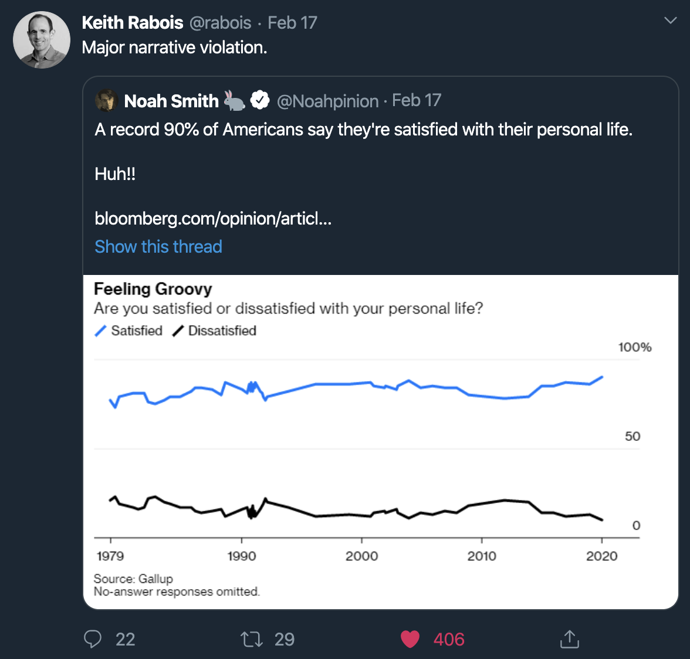
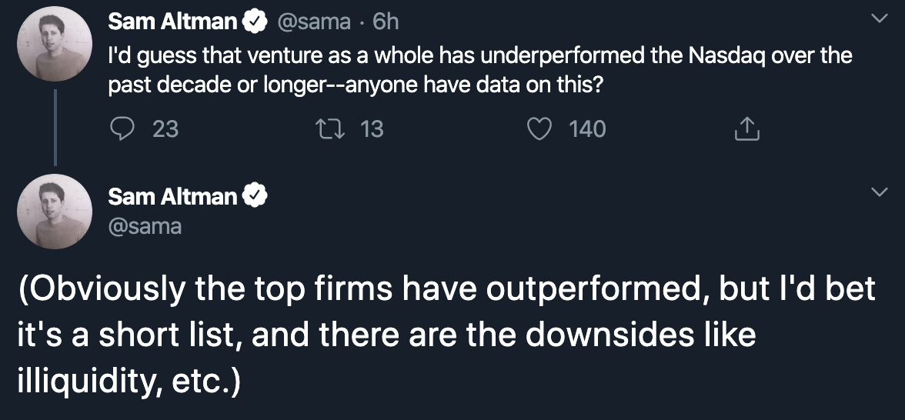

Twitter has been an invaluable tool for my personal development. No where else is there so much unsolicited, free, and useful advice. The value of twitter is that it is an open forum, allowing the public to selectively hear from experts and those with far more opportunity and experience than we may ourselves.

I find the most fruitful twitter discussion to be when two high profile users disagree. In these cases, testosterone is our friend. Competition and the burning desire to be right can sometimes lead to a clash of truths, a modern day Jefferson versus Hamilton. They can't both be right. Someone has erred and their respective followings take sides. For me however, especially as someone new to Twitter and uninitiated as to who has a track record of being right, or whose personalities I have begun to like, Twitter is a battleground for two completely foreign parties. I can take in their arguments for their true strength, unbiased by personal affiliations.

My absolute favorite occurrences are 'narrative violations', a term I first saw used by [Keith Rabois](https://twitter.com/rabois), self described contrarian. His most recent illustration of this this concept is shown below. Amazingly, satisfaction with one's personal life is at an all time high among Americans. Completely contradictory to the cultural narrative that social isolation and depression is on the rise due to social media and the internet.

These simple facts do a tremendous job of trimming down the unproven building blocks of one's worldview. The internet has given us unparalleled access to an unlimited supply of information. However, there is strong evidence to support the notion that the quality of such information follows a power law. For every piece of factual information presented in a journal article or research report, there are multiple interpretations of data, the quality of which is difficult to monitor. As news diffuses through multiple people, we experience further dilations or misinterpretations of the truth. Then, if we consider people's comments, opinions, and further, people's reactions to comments and opinions, we further increase the chance of misinformation, or at the very least, the chance that a person hears and interprets truth from the source decreases exponentially due to network effects. This is not necessarily a bad thing, just something to consider. There is no survey data available, but I would wager a significant amount of money that less than 1% of Americans have actually read primary literature demonstrating climate change. Clearly, scientists are in agreement and there is more or less an established truth that climate change is real, but in other cases, the truth may not be so clear. It is of utmost importance to actively seek out violations to societal narration. Herd mentality is powerful and will lead us astray.

Here, I wanted to present two more 'narrative violations'. These are far from refutations, but in my view, are a useful factual check on overuse of emotion or heuristic based decision making.

_1. Screening for Cancer._

Results from the [Nelson clinical trial](https://www.nejm.org/doi/full/10.1056/NEJMoa1911793) evaluating CT lung cancer screening for reducing lung cancer mortality did not improve survival. Increased cancer screening is currently seen as a wholly useful activity, allowing earlier detection and treatment of disease to reduce healthcare spending and increase survival. While the study did show decreases in lung cancer related mortality, it is difficult to say whether such interventions are truly useful if overall survival doesn't improve. On the one hand, you may be able to detect a malignancy earlier, but you also increase risk of detecting false positives and stress patients with hospital visits and costs. We need to be more careful when evaluating the efficacy and utility of broad screening, especially in low risk populations. Furthermore, AI/ML detection systems to speed screening can be useful, but we need to ensure we continue to follow evidence based practices for implementation.

_2. VC Earnings_

Sam Altman recently tweeted surmising that the venture capital industry has underperformed the Nasdaq stock index. As much of a breeding ground for VC optimism and enamor that twitter is, here we have someone at the top of the field questioning the narrative that venture is an infinite sum game. As much talk there is about being in the industry and the success and admiration that comes with it, we do have [data](https://www.slideshare.net/kloeckner/kauffman-foundationventurecapital) showing that you actually need to be good at your job in order to survive and pay rent in San Francisco.

