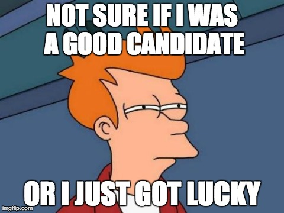
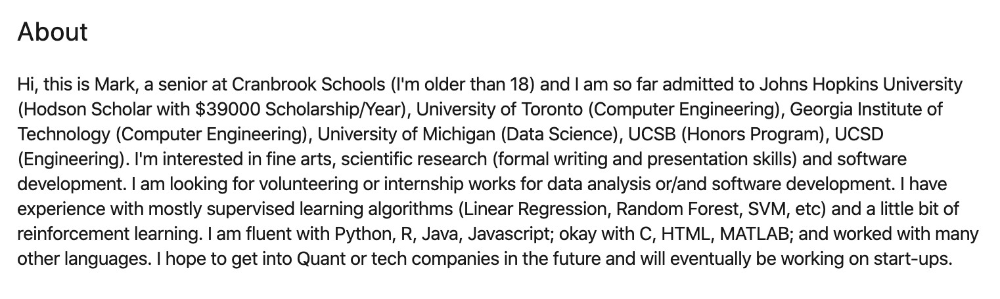
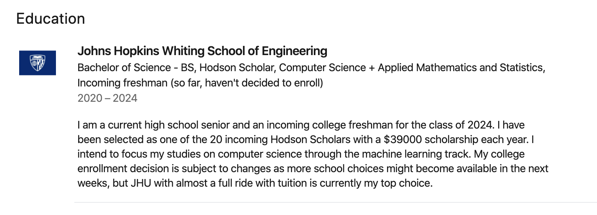

Today, I want to become a cancer doctor. Friendship ended with cap sheets, DCFs, and pitch decks. Oxaliplatin, pembrozimulab, and RCTs are my new best friends. At the start of sophomore year, I wanted to be a consultant at Bain. In the span of weeks, this became investment banker at Morgan Stanley, private equity analyst at BlackRock, and venture partner at NEA. Let's zoom back to the summer and previous spring semester. I remember the days of looking at internships at Neuralink to exercise my passion for brain computer interfaces and computational neuroscience. Machine learning, artificial intelligence, deep learning, data science were all buzzwords that I used to search Handshake postings. If we zoom back even further to the beginnings of getting started in college, I wanted to be a regenerative medicine and aging researcher.

Frankly, I don't think this is a unique experience, and while I wouldn't brag to the Med school AdComs about this career search journey, I also wouldn't say I'm not proud of what I did.

I spent a whole day reading a pdf of Victor Cheng's [Case Interview Secrets](https://www.amazon.com/Case-Interview-Secrets-Interviewer-Consulting/dp/0984183523). I set up calls with VCs, analysts at bulge bracket banks, and sent hundreds of LinkedIn messages. My interests in computer science led me to take exploratory classes on deep learning, machine learning, and to learn web development. I have an Evernote filled with my notes from research articles describing cell senescence and the anti-aging interventions. My most recent foray into the pharmaceutical industry and medicine has led me to create an excel spreadsheet where I track biotech startups, common indications, and their standard of care. Surely, these are meaningful experiences.

But, my GPA suffered. I didn't optimize my schedule to take the graduate level upper level elective classes. Getting into your dream job in your dream career is a competitive process where you have to compete with the ultra-specialized. Especially in medicine, you have a career in which specialization and long term dedication is key; reasoned expertise ([type 2 thinking](https://www.amazon.com/Thinking-Fast-Slow-Daniel-Kahneman/dp/0374533555)) is more valuable than diversity of experience (type 1 thinking).

***

The pillars of a strong med school applicant are dedication to community service and volunteering, strong research capability, numerous clinical experiences, stellar academic and test records, and strong leadership and interpersonal skills. They say it isn't a checklist. But, a lack of demonstration of one of these will tank an application, or so I'm told. College students need time to think, to explore the world around them. College is the ideal time to do so. It is a uniquely unspecialized period in one's life, but it still retains access to the immediate world. The things one does in college are 'real' in a much stronger sense than in high school.

So, why are we spending our time [checking boxes](https://www.medscape.com/viewarticle/924457), doing tasks that do not meaningfully change our perception of the world? For those specializing in medicine, surely one cannot be all around passionate about research, volunteering, community service, shadowing, and academics all at once. At some point, these are just tasks that don't add meaningful value to one's undergraduate experience. They are much more of a demonstrative activity, a signaling exercise to say that I am willing to put in the work to pursue this profession. There are similar situations in other fields. Networking in business is a soul-sucking but necessary task to land interviews. There is some loose anecdotal evidence that prestige in a profession has a correlative and probably causal relationship with a necessity to complete signaling exercises (see Ivy League, M7 B-schools, HYS Law schools). From an employer or AdCom perspective, this makes sense. You want to instill confidence in clients and maintain/build the prestige of one's own institution. Social darwinism.

Here, I think we are doing students a disservice. Marketing is an important skill, but if we are rewarded for pursuing the superficial, we are certainly leaving much to be desired. All the hours spent on signaling activities are better spent on exploratory or character building experiences. Diversity of experience is a valid indicator of curiosity which might be dismissed next to someone with intense specialization in scientific research. I actually might think its a warning if people are ultra-specialized. There are an abundance of exciting fields, why did you choose to only learn about one? Premature specialization may be an indicator of a predisposition to engage in signaling activities and a lack of curiosity and character.

***

Now for an example for what I'm talking about:

You're 18. Why do you want to get into quant. Why do you feel the need to list all your college acceptances? I cringe at this now that I am already in college, but I fear that those already in Med School or working cringe in a similar fashion at the LinkedIn pages of myself and my peers. Indeed, signaling is a cringeworthy activity.

Thank you for clarifying that your tuition is worth exactly $39,000 per year but also for telling me that you haven't decided to enroll. This kind of behavior is cancerous.

***

Why do we make people specialize? Is it fear? Is is hubris? Everyone wants to believe that they are making the largest impact, doing the most honorable work, making the most money, working on the most interesting problems. Specialization is a way of sheltering oneself from experts in other domains such that no one in the world is better versed at the subject than oneself. Following this, marketing to the world to explain why one's subject matter is the most important is an easy way to feel as though one is the most important person in the world!

I understand the motivation. I also wanted to be an intern at McKinsey in my Sophomore summer. But is this doing the world any good? Are you contributing more value as a sophomore than someone would as a junior? It seems like your motivation is to signal. I realize now more than ever, that the time we have during college is precious and not to be spent signaling to the world how great we are. Premature specialization is an unfortunate consequence of a society that values external signaling over substance. Our guiding question should never be how to demonstrate competency. Instead, at each step of our journey, we should be guided by how we are adding value and how we can best make the world a better place.
