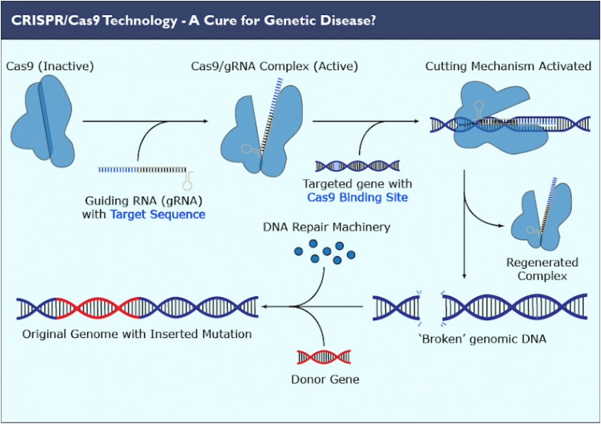

Since its initial discovery as a genetic reprogramming tool in 2012, CRISPR has widely been regarded as a breakthrough scientific discovery and quickly become one of the hottest new biotechnologies in the industry.

CRISPR/Cas gene editing technology arose from a bacterial defense mechanism against viral infections. It involves a guide RNA specific to a certain nucleic acid sequence, that leads a Cas protein to the site at which it binds. Binding sites must be accompanied by protospacer adjacent motifs (PAMs), which are extra base pairs in the DNA that the Cas protein needs to recognize in order to cut. Once the guide RNA binds to the host cell DNA, the Cas protein cuts the strands apart, allowing free nucleotides or other local DNA sequences to fill in the gap via endogenous DNA repair mechanisms. The guide RNA can be synthesized specifically to bind to any sequence, thus allowing scientists to directly target certain genes or genetic defects.

### The Frontier of Gene Therapy

Therapeutically, CRISPR can be used to knock out, repair, or insert genes into the genome of the host cell. Gene knockouts are the easiest task, as only the basic CRISPR machinery is required. The guide RNA will lead the Cas protein to the location to induce a break in the DNA, where afterwards random nucleotides will fill in the gap and deform the resulting proteins that are formed during translation. This random filling in of nucleotides relies on an endogenous repair mechanism called non-homologous end joining (NHEJ), which is highly efficient but introduces insertions or deletions that can shift the entire strand. A separate endogenous mechanism known as homology-directed repair (HDR) is far less efficient and also generates unwanted insertions or deletions, but has the potential to also insert larger strands of DNA if readily available. Ongoing CRISPR development is aimed at increasing the efficiency and frequency of HDR as a 'paste' gene editing function.

The future of CRISPR therapeutics development is dependent on technological advances in delivery methods and editing safety and granularity. Establishing that the agent can be delivered in an animal model in a manner that reaches the target tissue, understanding to the extent possible any potential side-effects and how to best manage them, optimizing editing efficiency in the target tissue in animals, developing practical ways to manufacture the candidate therapeutic at the high quality and consistency level required for use in humans, and several other key requirements are also crucial to developing new therapies. These are expensive and time consuming processes that are not well suited for teams without leading scientific expertise and many years of funding runway.

In the near term, CRISPR can be applied to immediate tools that are currently using gene editing including knockout animal models, isogenic cell lines, CAR T cells, etc. Currently, clinical translation of CRISPR is in very early stages. The initial human studies that are set to finish in 2020 and 2021 will provide data on efficiency, toxicity, off target effects, and efficacy that is currently unknown. Over the next five years, we will see a maturing drug pipeline that will eventually reach late stage clinical trials in select monogenic diseases. Hematopoietic diseases, such as hemophilia and sickle cell anemia, will likely be the first target to circumvent delivery challenges. Applications in other monogenic diseases will start to emerge, but mostly using ex vivo delivery.

In the long term, the advance of in vivo delivery will enable CRISPR application in more complex genetic diseases, which include hard-to-target monogenic disorders and multigenic disorders. With increasing development of base and prime editing, CRISPR will theoretically be able to address essentially all types of genetic disorders, including those that base editing and the basic CRISPR/Cas9 system are unable to treat, such as Progeria or Tay-Sachs Disease. The continued growth and development of CRISPR technologies will depend on improvements in delivery technology, multiplexing efficiency, and the prevention of off target effects.

### Market Overview

The CRISPR therapeutics market has started to saturate, with low hanging indications dominated by leading scientists and their companies. IP is also owned and collaboratively licensed among industry leaders, adding to the difficulty of market entry. New opportunities in the field are highly competitive and expensive to enter, with few seed or pre-seed rounds and large ($30 M+) series A rounds typical.

CRISPR therapeutics are a quickly maturing area that will drive significant patient impact in blood diseases, cancer, eye diseases, and other genetic diseases. Continued development of improved CRISPR delivery mechanisms that reduce off target effects and increase editing efficiency will catalyze the translation of gene editing into clinics within the next 10 years. However, industry leaders bolstered by the scientific inventors and patent owners of CRISPR technology have built up a commanding development lead. CRISPR therapeutics have demonstrated to be a vertical with long and expensive time horizons, with no candidates past Phase 2 clinical trials. As a result, venture rounds have been large, and there have been few early seed stage startups.

CRISPR startups in the therapeutic domain have raised large financing rounds and have been keen to IPO early to raise additional funds. While top companies have been able to reach high valuations, few started out at low enough valuations for a seed stage fund to have an impact. Due to the competitive funding environment for CRISPR based technologies, larger VCs, pharmaceutical companies, and others with larger powder kegs have dominated fundraising opportunities. With the presence of powerful competitors and the moats they have developed from their IP, smaller scale startups are risky when tackling an established indication. For a seed stage startup to be successful, they must have strong academic ties to help fuel research, a novel and feasible indication to tackle, and a proprietary technological advantage.

### Investment Areas

__CRISPR Delivery Technology:__ Cell type and organ level specificity and efficiency of delivery has become a major challenge. In order for CRISPR technologies to become cost effective and clinical feasible, they must be delivered with high efficiency and with minimal off target effects. Companies that are developing better delivery technologies will be able to address this growing demand as gene therapies like CRISPR continue to progress.

__Indication Specificity:__ While CRISPR technology is a promising platform gene therapy technology, deep understanding of the addressed indication is essential to clinical success. Companies such as Verve Therapeutics and Excision Bio are able to address indications where market dominance can be established. In contrast, the scientific giants in the space and their companies (Beam Tx, Editas, CRISPR Therapeutics) have half a decade in progress treating the low hanging fruit. Companies that understand the clinical landscape and target diseases without large competitors have the greatest chance of clinical scale-up.

### Startups to Watch

[eGenesis](https://www.egenesisbio.com/): eGenesis was founded by George Church and Luhan Yang in 2014 to bring to life CRISPR based xenotransplantation. The company has raised a total of $140 million in funding through Series B to grow human compatible organs inside of pigs. Pig genomes can contain up to several dozen copies of porcine endogenous retroviruses, or PERVs, which can't be eliminated by breeding alone. PERVs are known to be infectious in humans and are one of the contributing factors to the failure of past xenotransplantation efforts. Addressing the ever-growing need for transplantable organs, eGenesis is working on eliminating these retroviral genes from pig genomes using CRISPR, making organ transplantation from pigs to humans a safe option.

[Inscripta](https://www.inscripta.com/): Inscripta was founded in 2015 by Andrew Garst, Ryan Gill, and Tanya Lipscom to develop the next generation of CRISPR nucleases. These improved enzymes boast such innovative features as differing PAM recognition sequences, cut efficiencies, reduced sizes, and differing enzyme kinetics. Inscripta boasts a high-throughput multiplexed genetic engineering platform that can synthesize enhanced bespoke enzymes for specific customer uses. So far, the company has raised $260 million through Series D.

[Verve Therapeutics](https://www.vervetx.com/): Verve was founded in 2018 to develop gene editing therapies for cardiovascular diseases. Their goal is to develop gene-editing therapies to reduce the risk of coronary artery disease in adults. In order to achieve this, they are developing gene therapies, administered in a single dose, that would act as naturally protective gene variants. This would then confer lifelong protection from coronary heart disease in adults. The company has raised $121.5 million through Series A.

[Excision Bio](https://www.excision.bio/): Excision is a seed stage company that has raised $10 million to develop CRISPR-based therapies to cure viral infectious diseases and improve the lives of chronically ill patients. Their initial target is HIV, and is the first company to completely remove HIV from the genomes of animals.

[Eligo Biosciences](https://eligo.bio/): Eligo has raised $27.4 million to develop a new class of targeted biotherapeutic agents to selectively intervene on the microbiome. Eligo is using proprietary methods in synthetic biology, protein and genome engineering to create Eligobiotics: genetic circuits packaged in phage-based delivery vectors used to diagnose, eradicate, or functionalize targeted microbial populations.
