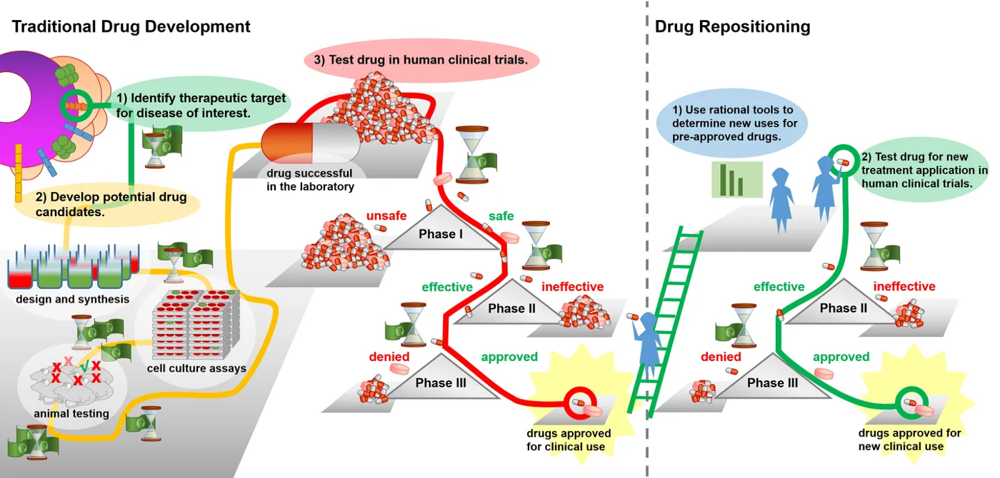

# Creating New from Old

Drug repurposing and reengineering is a promising and recently popular approach to rescuing and reusing drug compounds for other indications. Powered by a more complete understanding of network and systems biology as well as improved characterization of disease biology in underserved indications, repurposing has utilized these insights to provide a low cost, low risk drug development option for medium and large size biopharma companies. Since many repurposed compounds have already gone through clinical trials and been characterized with efficacy, safety, and pharmacokinetic data, they are also quicker to market and often can jump past Phase I and directly to Phase II testing. The drug repurposing field is also accelerated by increasing use of AI and computational biology techniques that can help reengineer molecules to better bind to targets as well as better characterize root causes of disease in less studied indications.

Drug repurposing makes sense both from a business and risk perspective, yet large biopharmas have only recently entered the space and typically their priority has been to rescue their own drug compounds. Much faster traction has been made by medium sized companies that are comfortable with the at times niche and small rare disease indications that drug repurposing has shown scalable impact in. There already exist large scale brute force screening platforms that have utility for developing repurposing targets which are widely used by large biopharmas. New companies in the space must provide a more intelligent screening platform or else risk becoming a company defined by their leading compound. New technologies such as precision medicine and combination therapy approaches, as well as better understanding of disease biology, will power the future growth of the space.

Drug repositioning is an “universal strategy” for neglected diseases due to 1) reduced number of required clinical trial steps could reduce the time and costs for the medicine to reach market, 2) existing pharmaceutical supply chains could facilitate “formulation and distribution” of the drug, 3) known possibility of combining with other drugs could allow more effective treatment, 4) the repositioning could facilitate the discovery of “new mechanisms of action for old drugs and new classes of medicines”, 5) the removal of “activation barriers” of early research stages can enable the project to advance rapidly into disease-oriented research.

# Limitations
While significant benefits are in store for teams that can successfully develop a repurposing platform, the inherent nature of the market has limitations. At a high level, drug repurposing has been viewed by some in the industry as hitting singles and doubles, with blockbusters exceedingly rare.

Market sizes are typically smaller due to a focus on niche indications. Repurposing for more significant indications, primarily oncology, are conducted primarily by large biopharmas. There are additional difficulties for startups in terms of upfront validation costs. Due to lowered home run potential, there are typically higher standards for in vitro or in vivo validation before there is buy-in to move forward with a clinical program. Large biopharmas are less interested in acquisitions because of potential patent rights disputes, as well as the small indication sizes not being providing the economies of scale to meet profitability standards.

Finally, there are still scientific and clinical risks. Drug repurposing efforts in many indications are limited by understanding of disease biology and the inability to elucidate targets or disease mechanisms. Even when relevant targets are identified, the dosage required for the treatment of novel disease can differ from the original target disease, meaning that Phase I clinical trials may need to be initiated again. The toxicological and pharmacokinetic properties may thus need to be reinvestigated.

# Investment Thesis Areas

Drug repurposing and reengineering is a rich vertical with significant opportunity for platform based approaches to thrive. Specifically, companies that are able to address the following needs will have ample ground to build category defining leadership.

1. Signature Reversal Principle: As data collection and analysis abilities continue to improve, much greater granularity in characterizing diseases can be reached. Understanding of disease will become increasingly multifaceted, with multiple genomic, transcriptomic, and proteomic signatures of diseases that must be corrected. Therapeutic approaches that are able to address multifaceted signatures of disease will eventually become the standard of care. Technologies that are able to help bring upon this change will be addressing a large future need.

2. Platform enabled drug repurposing: Drug repurposing as a singular company focus has the tendency to turn companies into single asset therapeutics companies with low margins. Repurposing and reengineering as a platform however, provides the volume necessary to develop a venture scale operation. Successful drug repurposing plays will be enabled by platforms that give companies a sharp technological advantage.

# Industry Leaders

[BioXcel](https://www.bioxceltherapeutics.com/): BioXcel was founded in 2017 and IPOed in the first half of 2018 with a current market cap of \$1.2 billion. The company has advanced Phase II and III programs in immuno-oncology and neuropsychiatry respectively developed via an AI platform that identifies new therapeutic indices.

[Pharnext](https://www.pharnext.com/en/): Pharnext has pioneered a combinatorial medicine platform called Pleotherapy that leverages AI to predict efficacious combination therapies. The company was founded in 2007, IPOed in 2016, and is currently worth \$70 million. Their leading compound treating Charcot-Marie-Tooth disease type 1A presented positive Phase III data, but the FDA has required an additional trial for final approval which is expected to be initiated prior to Q1 2021.

[GNS Healthcare](https://www.gnshealthcare.com/): GNS Healthcare was founded in 2000 and has raised \$77.3 million through Series D to develop a platform for in silico patient modeling to predict the impact of drugs on patients. Their REFS platform is claimed to reveal the drivers of disease progression and individual patient responses to drugs.

[Healx](https://healx.io/): Healx was founded in 2014 and has since raised \$67.6 million through Series B from investors including Intel and Balderton Capital. Their focus is on utilizing AI to survey public biomedical databases, scientific literature and proprietary curated data to fill in knowledge gaps for rare disease and develop repurposed therapeutics in conjunction with strategic partners.

[EQRx](https://www.eqrx.com/): EQRx launched in January 2020 with \$200 million in series A funding from investors including GV, ARCH, and a16z. The company is led by an experienced and connected team of healthcare professionals and their CEO is Alexis Borisy. EQRx is the largest ever startup dedicated entirely to producing lower cost medicines via drug repurposing.

[Recursion](https://www.recursionpharma.com/): Recursion is another large and well known computational drug discovery company which is utilizing computer vision as a high throughput screening measure to test efficacy of various medicines in order to repurpose them for niche conditions. The company was founded in 2013 and has since raised \$226 M through Series C.
