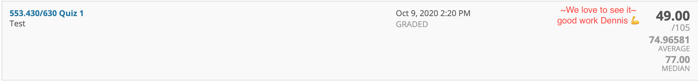
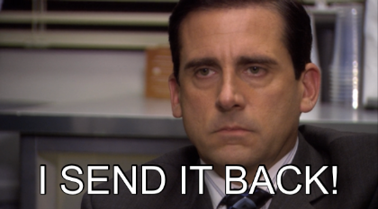

It's been a really long, really weird, and really tiring year. I'm turning 21 in 6 days but I think I'm over seeing age as anything more than just a number. 21 is exciting though, finally an official adult! Both a very scary feeling, but also it couldn't come soon enough. Every year when I reflect upon what happened in the past 365 days, I feel pretty pumped about what happened and what will happen next year. This year though, it's hard to not feel anxious, tired, and trapped with all that has happened. It's like the feeling when you're running on fumes up a hill, or when you have a recital in 2 weeks for a song you already can play. You know it will eventually be over, but theres little short term upside to put in more than the bare minimum.

I just finished my last final of the year today. An introductory statistics class which is jointly taught to undergrads and grad students, and a class where I routinely scored around a sigma below average. The exam was 5 hours (midterms were 4 hours), and just 15 multiple choice questions. Around half the class cheated and shared exam answers and each week there would be new complaints on the class forum to the professor begging her to make the grading scale more generous. I'm pass/failing the class, and will likely scrape by with some sort of C from the very generous curve. I'll be happy with it. It's that type of year. Everything is kind of a shitshow, but somehow we survive and can't really complain.

In all honesty, from a purely statistical and accomplishment driven perspective, this year was a knockout success for me. Outside of the stats class, I'll have a 4.0 with my first A plusses I've ever earned. The first paper I ever contributed to got published. I submitted my first 1st author manuscript and another mid-author manuscript will be submitted in the coming weeks. Several large projects/jobs including my BME Design Team, MedHacks, Alix, Capsulomics, SENS Research, and my undergrad thesis project either were kicked off or finished during the year. Market irrationality lifted my stock bets to an all time high and my Chess rating peaked in August and is finishing off on a high note. I ran a half marathon, got off all socials except Twitter, and started meditating every day. I've written and read more this year than possibly all my high school years combined.

Lots got done, but there is no way I feel any more secure or happy than I did last year this time. Maybe a bit more satisfied in a competitive sense, but still that same feeling I described earlier. I'm concluding that it must be true that we never truly get satisfied, that happiness is a moment, not a status.

I'm trying to think what made me the happiest this year. Good feedback (validation), feelings of accomplishment, snacks (for sure), watching TV, Twitter/NBA/NFL following, podcasts, and long walks in good weather. I used to hold pretty radical views against non-STEM industries and now I send them all back.   

Let's see, a lot of not so great stuff happened this year as well. My dear grandfather was diagnosed with CMML. That one hurt a lot. My performance and accountability in some projects wasn't what I would have wanted it to be. Overall, I spent too much time on my phone and on social media, and I had a lot of lazy days, especially at the end of the year. Every year, I say I'm going to start cooking or travel which clearly didn't happen this year. Covid sucked. Not seeing my friends sucked.

So where does that leave us for next year? I think I have 3 takeaway lessons that I'd like to use thematically next year to make it better.

# Number 1: Actively plan down time

I think it is pretty common practice to plan our exercise time. As a result, it gets into routines and gets done. Equally (maybe) important, is play. I never really thought about this before Covid hit, probably because it comes so naturally to see and hang out with friends. Now however, it's hard to serendipitously run into friends and experience the job of social connection. Instead, this feeling (or lack thereof) shows up increasingly in the morning or at night or during daytime distractions. Doom or hope-scrolling for entertainment is a habit I'd think that everyone would want to break. At the same time, I think it's important to make time to be purposeful with indulgence. Not because it saves time, but because its much more enjoyable. I find that a lot of the motivation behind scrolling is to find things to read/watch, but I never actually take the time to consume, they just sit in a queue of articles or videos that occupy brain space and make it even less likely that I'd ever eventually look at them again.

Instead, maybe a better model is to purposefully schedule time to read, or to watch. I'd much rather start or end the day with a much anticipated episode of Kim's convenience, rather than 30 minutes of scrolling through Twitter. Carving out time to consume is foreign, but likely a necessary habit for adulthood ;).

# Number 2: Make experimentation a priority

One side effect of the pandemic was a boatload of extra time. The absence of a school or work schedule made it extremely easy to 'batch' work and enable long stretches of uninterrupted time. This led to some interesting experiments, like being able to binge TV shows for an entire weekend or reading up on esoteric or random things that I otherwise would have never touched. A consequence of this has been an expansion of cultural awareness, breadth of knowledge, and new skills. Everyone always harps about making sure that you are always taking on new experiences, but somehow I always forget or don't make it a priority. It's one of those things where there is no reason why more experimentation is bad, so doing more of it should clearly be a priority. I literally say I want to experiment with new things every year (try new clothing styles, cook more, etc.) but never make it a priority. In 2021, this will for sure happen. Books, cooking, and traveling.

# Number 3: Continuously document and reflect

The most essential software tool for me this year has by far been Microsoft Excel. Google Drive's autosave is great, but the act of saving a local copy is somehow deeply satisfying. Somehow CTRL+S is concrete and committal. I have several spreadsheets that I consistently open and use. The most important is titled 'Planning', and contains literally all of my goals, reflections, things I am proud of, aspirations, and future plans. The most important tab just contains months on the columns and 7 rows below where I write any goals or things I want to accomplish over the course of the month. If I complete them, I mark them green. It sounds profoundly stupid, but it's incredibly motivating and satisfying at least for my monkey brain. An added bonus is that you never lose track of what you accomplished, making reflection extremely satisfying. Other tabs in this spreadsheet track restaurants, my chess learning plan, my grades (sad ik), and a quick list of good news from every month as well.

The rest of my spreadsheets can be categorized as knowledge organizing. Clearly more than ever before, knowledge workers will become the soul of the modern workforce. However, I'm consistently confused about how much I am actually supposed to know, or how much I actually do know, or how in depth I need to know things. A transcript is sort of useful for this, as presumably it documents all the subjects you have studied. However, especially in research fields, a lot of the learning must be done independently by reading papers or attending conferences, or even reading on Twitter. I know some people might take notes on the papers they read but let's be real, I don't think anyone has the strength to go back and read notes. A typical scientists will probably read hundreds of thousands of papers. How in the world can we summarize and understand which areas we have a good understanding of and which areas we need to learn more about? For some reason, I like Excel for this and it has been a great way to document and write down ideas, understand disease treatment landscapes, and have everything in one place. Moral of the story is to keep doing this, because for some reason it has been effective. [Yay, go me!](https://twitter.com/SASBurnerAcct/status/1336818455455129600)
