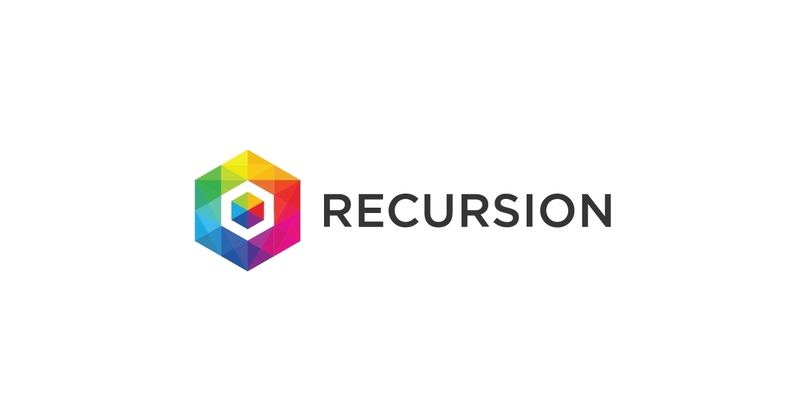
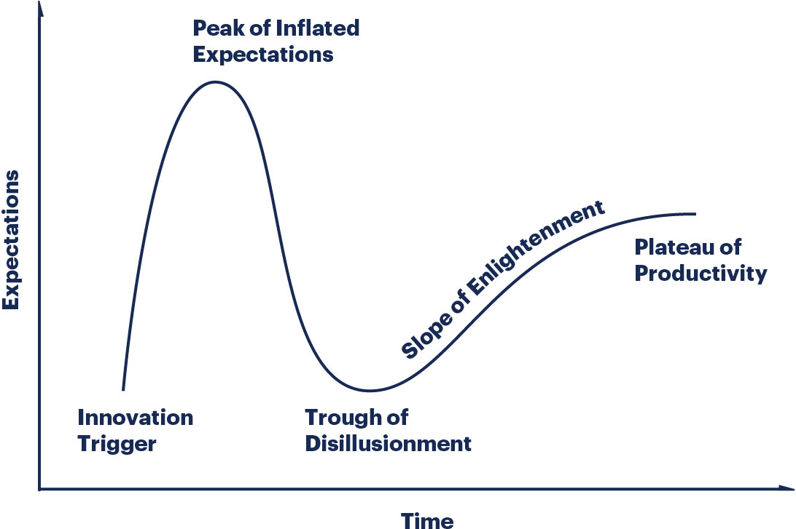

Recursion Pharmaceuticals is a much celebrated 'leader' in AI driven drug development. I wrote an entire 20 page report on the [AI drug development industry](https://www.dennisgong.com/AI_Drug_Discovery.pdf) in the summer of 2020 where I made the case for why AI was going to change biopharma forever. I'm much less bullish, perhaps even bearish on AI in drug discovery now, and hope to take a more sober view of Recursion's progress, valuation, and prospects moving forward as a viable fully integrated pharmaceutical company.

In July 2019, the company raised a 121 million series C at a valuation of \$646 million. Recently in September 2020, the company announced a \$239 million series D at a valuation of ~1.24 billion post-money. It was founded in 2013, and just recently over the past 3-4 years has it been operating at full scale, and doubling production YOY. The company has 4 compounds in human clinical trials, which I'll talk about later. Overall, the company claims to have over 30 programs in its pipeline, along with programs developed jointly with large pharmaceutical partners. They have 200 employees, roughly half split between bench and data scientists/engineers.

They produce almost 10 million images per week, allowing the generation of 100s of millions of images overall, producing petabytes of morphological data. Recursion is really great from an open science perspective as well, not necessarily by publishing papers, but by releasing datasets (albeit at lower resolution).

#### Business Development Efforts

Recursion in July of 2020 also announced the acquisition of Vium, a digital vivarium company that utilizes computer vision, machine learning, and sensor technologies to non-invasively collect and derive insights from digital biomarkers in preclinical in vivo research. In 2018, it was estimated that Vium had a post-money valuation in the range of \$100-500 million. Suffice to say, this was an expensive acquisition, but its very on thesis for the company. It allows proprietary integration of data based approaches in in vivo experimentation. I'm not sure how ethical it is to do mass parallel screening on mice using this data driven approach, but at the very least, it should provide a better indication of how drugs are functioning at the preclinical level at a more nuanced level than Kaplan Meier plots. You might be able to discern quality of life or side effect data better, saving some time and money in selecting the best prospects for testing in dogs or non-human primates. At the very least, it makes Recursion a more viable acquisition target.

In terms of deals, Recursion has announced collaborations with Bayer for programs in fibrosis in 2020, and Sanofi for various genetic diseases in 2016.

The Sanofi collaboration entails Sanofi providing Recursion with a number of small molecules, and Recursion screening these molecules across its library of genetic disease models. Sanofi will then have the option to develop products targeting any new indications identified. From Sanofi's point of view, it seems like they are outsourcing some R&D at low risk and cost. From Recursion's point of view, they probably got an upfront, will get milestones, and royalties if a candidate ever pans out. It has been a couple of years, and there is definitely some private understanding of what came out from the deal, but it would seem that if it were successful, Recursion might be interested in sharing? Suffice to say that we are still in wait and see mode with this collaboration.

Bill & Melinda Gates Foundation is the last partnership mentioned on their website, and it is a grant for finding malaria drugs. Nothing super special here, they probably got somewhere in the ballpark of 1-2 million to develop a cell screening assay and screen some molecules.

The Bayer collaboration was most recent, and represents the biggest hope that the company is making serious progress to becoming a real commercial entity. Bayer probably isn't the ideal partner given that they aren't really 100\% pharmaceutical, aren't doing super well commercially, are based in Germany, and are constantly getting sued for Monsanto, but maybe that is beside the point. Not only did Bayer lead the Series D with \$50 million, the deal they signed gives Recursion a \$30 million upfront, commercial milestone payments of up to \$100 million for more than 10 programs, plus royalties on future sales. Overall, it is a pretty lucrative deal from Recursion's point of view. It depends on the screening being successful, and Bayer is putting a decently sized bet that the AI is the real deal. Ultimately, my personal opinion is that while the deal isn't spectacularly large, it is above average for what Bayer typically pays, and they probably wanted to do this deal regardless. Bayer is currently undergoing restructuring and needs to diversify its bets. Being an early player in Recursion isn't a bad way to achieve some diversity and potentially add serious value if the screening platform plays out.

#### Team, funding, papers

The company was founded in 2013, when Chris Gibson dropped out of his MD-PhD program at the University of Utah. A more basic version of Recursion's platform actually formed Dr. Gibson's PhD work, and he published a [Nature paper](https://www.nature.com/articles/nprot.2016.105) and another [well cited paper](https://www.ncbi.nlm.nih.gov/pmc/articles/PMC4356181/) describing the use of the platform to find drugs for cerebral cavernous malformation. The company isn't founded upon decades of technological or scientific development, but rather the confluence of technological infrastructure that cloud computing, imaging, and lab automation has brought to drug development in recent years.

It isn't the traditional biopharma or biotech either. Based in Salt Lake City Utah, it has a kind of quirky mix of tech excitement and midwestern groundedness. The leadership team is solid but not spectacular. Investors are an interesting mix of tech visionaries (Obvious, Lux, Two Sigma, DCVC, Felicis), wealth holding companies (Mubadala, Laurion, Advantage Capital, Baillie Gifford), and some less mainstream bio investors (Catalio, Casdin, Samsara). A vote of confidence from an East Coast life science investor who has actually seen drugs to clinic before would have been nice, but all in all not a shabby group of investors.

Series D will certainly not be the last funding round if Recursion really wants to be a fully integrated pharma company like it says. Briefly talking about business model, it does seem that margins might not be so great if Recursion sticks to its current strategy of repurposed/rescued assets. Low patent lifespans and expensive clinical trial recruitment could really hamper the market cap if the company is unable to come up with a real blockbuster.

#### Clinical Pipeline

Recursion's pipeline is currently mostly in rare or genetically driven diseases using repurposed drugs as proof points. The company has 4 clinical stage assets, 30 total. I took a closer look at the 4 lead clinical assets:

TAK-773 is a clinical stage MEK inhibitor indicated as a treatment for a hereditary cancer syndrome and other related areas in oncology (I'm assuming this is the solid tumor line on Recursion's pipeline page AKA REC-4881). Recursion bought exclusive worldwide rights to the compound from Takeda after they screened 200 molecules from a Takeda library. This one is interesting because again, it wasn't a compound that Recursion developed, and evidently was one that Takeda decided to pass on. It is important to note also, that Recursion needed to screen Takeda's library to find this hit, and presumably wasn't able to find one with its own library of compounds. Restriction to certain hereditary conditions is tough from a TAM point of view, and there are other MEK inhibitors Recursion would have to compete with.

Another 'late stage' program is in GM2 Gangliosidosis (AKA Tay Sachs). Late stage is in quotation marks because like all of their clinical stage assets, they haven't actually been trialed in the target population (at least according to clinicaltrial.gov), they have merely shown an acceptable safety profile and 'passed' Phase I trials. This indication in particular is interesting as a target given that it seems to be a perfect use case for prime or base editing, not necessarily a small molecule approach. I'd certainly love to be proven wrong, but it does seem like a difficult indication for a company whose focus is not lead optimization (something especially necessary for BBB drugs). Again, small market size, yada yada.

The Neurofibromatosis Type 2 candidate was bought from Ohio State University and rebranded as REC-2282. It is being developed by a Recursion subsidiary CereXis Inc. A short description courtesy of Business Wire is below:

_REC-2282 is a pan-histone deacetylase (HDAC) inhibitor. There are multiple lines of evidence that REC-2282 exhibits both histone-independent and acetylation-independent mechanisms, at both epigenetic and cellular levels. The compound was previously in clinical development by Arno Therapeutics (as AR-42) for various solid and liquid tumors. Exploratory investigator-initiated studies have been conducted in patients with vestibular schwannomas and meningiomas. Rights to the compound were returned to OSIF in November 2017._

It is a rare condition, with an estimated incidence of 1 in 33,000 people worldwide. These are non-malignant tumors that allow patients to have an expected life span of 65 years, but they can be painful and impact mobility. There are no approved therapies, but a drug called selumetinib was approved for NF1 and currently has a trial set to end in 2022 for NF2. It will be interesting to see how Recursion plans to proceed with this candidate. Small market size and a promising competitor are barriers. People certainly won't be paying large sums of money for a non-malignant condition either. It may be interesting as a proof of concept to raise more money in the future, but this certainly will not be a blockbuster even if it works.

Finally, we have a program in cerebral cavernous malformation (CCM). This actually came from Chris Gibson's PhD work with Dean Li, paper [here](https://www.ncbi.nlm.nih.gov/pmc/articles/PMC4356181/). They identified two compounds from a 2,100 drug phenotypic ML cell based screen: cholecalciferol (Vitamin D3) and tempol. REC-994, which is the clinical compound Recursion is bringing to market for CCM is tempol, a superoxide dismutase mimetic which Recursion notes has been granted orphan designation by the U.S. FDA for symptomatic CCM. This one is actually pretty interesting to me. The market is roughly 60,000 patients who are symptomatic with seizures, vision and hearing loss, paralysis, other focal neurologic deficits and/or hemorrhagic stroke. Standard of care is surgery, but a non-surgical treatment may be useful as well. In the end, it comes down to how well the drug works (and whether improved outcomes over surgery are possible), which we won't be able to predict until trial data comes out.

#### Why AI?

The whole notion of why we would use AI in drug discovery centers upon cost. It costs north of \$800 million to develop a drug, some estimates in the \$2 billion range. Contributing to this is an incredibly high rate of attrition in clinical trials (1 out of 10 makes it out), the most expensive and rate limiting step. The idea is that AI has crushed development costs in many other industries, but not drug development, and that using the power of data and machine learning, we can move drugs to patients faster than ever before.

Many AI drug development companies are using repurposed or rescued drugs in order to save development time, and Recursion is no exception (though they do claim to have proprietary compounds). Recursion utilizes an in vitro cell based phenotypic screening platform, where cells are perturbed with compounds, imaged with microscopy with various dyes for important markers or organelles, and analyzed using machine learning. The type of machine learning being used is representation learning, which allows scientists to quickly identify cell states that signify that a compound might be having the intended effect. In essence, instead of a human needing to go through all these images, a computer is automating that part of the workflow (which is non-trivial as the amount of data Recursion is collecting 5+ petabytes is more than 200 years of continuous video streaming). After identification of these 'hits' their scientists can then validate the biology with traditional bench approaches along with other data driven approaches. To me, it seems like the machine learning is really the cherry on top (the last step in the pipeline, which honestly really isn't all too sophisticated). The real innovation here is being able to collect that much data.

The thesis is essentially that human biology is too complex to be studied solely by humans, and that computers are necessary to integrate the "97\% of human biology we will have to acknowledge is too complex for humans".

#### Okay, let's talk platform

At its core, Recursion is a high tech screening platform. Essentially all pharmaceutical companies have screening as a core part of their R&D. Why? From my understanding, it is helping to systematize serendipity (and probably because it is just fast and relatively cheap). So what are the core components of a good screen? First of all, you need good assays; those that are able to accurately predict what will happen in a more complicated biological state. The simpler your assay, the cheaper it will be, but the more risk you take on when you progress your compound up the development pathway. Obviously, there is a reason most pharma companies do target based screening, and not screening in mice; its cost and ethics. Recursion uses a phenotypic screen, meaning that what you are measuring is actually a change in biological phenotype, not just how well a molecule binds to a target receptor. Here, you don't have the bias of believing too heavily in your biological hypothesis. Rather, if it works, it works and we'll figure out biological pathway later!

Outside of the assay, is the screening library. The library you are screening is incredibly important. With any screening experiment, you are hoping that against a particular assay, at least one (or typically 1\%) of the compounds in your library has significant single agent activity. You need to be intelligent enough or lucky enough with your library to get a compound that 'hits'. Otherwise, there will be no actionable next step after the screening is completed, you are left with nothing. Typically, pharma companies will have libraries of compounds that they have previously developed and shelved, or compounds that are known to have ADMET properties, at least something to give a rationale for using it. The chemical design space is huge, and no one can feasibly screen every compound possible to make. Some compounds are prohibitively expensive to make (so hard to screen), and there is even the hypothesis that the correct compounds for the job just hasn't been discovered or made yet, and we need to do some sort of rational design in order to get the compound we need.

Platforms, especially tech based platforms have become a major point of contention between East Coast investors and entrepreneurs, and [West Coast investors](https://a16z.com/2021/01/08/bio-platform-companies/) and entrepreneurs. The central question is whether the goose or egg is more important so to speak. Do you think that your platform will be able to continuously produce assets, or should we be valuing a company based primarily on the lead asset? For specific processes, like drug or nucleic acid delivery, or vaccines, or biomanufacturing, I think there is a real role for platform type technologies. We already know the components and the endpoints needed in order to do the job successfully. I think it gets much more complicated when thinking about platforms for therapeutic development. Solving problems in biology requires a measured and multi-pronged approach due to huge complexities. Trying to force a platform onto the disease is the wrong approach in my opinion. We should instead be trying on different types of platforms and approaches on the disease. Platforms are only useful when we understand deeply what is going on biologically.

#### Some critiques

Okay great, so we know Recursion is doing a cell based phenotypic screening platform with repurposed/rescued compounds as their library. A couple of issues immediately come to mind with this strategy. First, if you are relying primarily on assets shelved by pharma, aren't you really just limited to the subset of molecules that pharma thought didn't work or weren't worth developing? It would seem that pharma already screened these molecules, so you would need to get 'lucky' with the possibility that pharma set up a bad screening assay, or you would need to screen in an assay that hasn't been done before (likely in a rare or low market value indication). Of course, Recursion could develop its own libraries, but that really isn't Recursion's strong suit and I'm inclined to believe that they wouldn't be able to do that well just yet. The cell models are more interesting. Apparently, Recursion has 750 cellular disease models that they have screened on. These can be created by inducing disease with CRISPR for example, or just by scouring literature for easy to replicate disease models. Recursion likely has a competitive advantage here over pharma, being a scrappy startup. Still, there is always the garbage in garbage out problem, and it takes time to validate these models. Just because you can run a screen doesn't mean it is predictive of the real disease biology in vivo.

Another critique of the platform is that it is pretty expensive. You need extensive lab automation in order to maintain the logistics of plate handling, dyes, cell culture, sterility, etc, and the reagents to create cell models, maintain cell culture, and do the fluorescence microscopy isn't cheap. There is a good reason Pharma companies have a layer of ultra-cheap target screening before cell biology. Its good that Recursion invested so much upfront in this stuff and its actually so cool what they've been able to build. It truly is magnitudes faster than what a human could do. However, I worry that you don't actually need all that data that they boast they have so much of. The magic of a good scientist is that s(he) can thoughtfully design experiments and think through the biology intelligently in order to reach actionable conclusions. If a scientist can easily recognize that half the screens being done are junk anyways and shouldn't be done, what was the point in collecting all that data? Because the scientists aren't as involved as they would be in a biology driven company, I worry that Recursion might not be screening in the most intelligent way. Don't tell us how many petabytes of data you have. Tell us how many drugs you are able to move through clinic and help patients. Finally, there are a whole slew of data science pipelines that need to be built to even be sure that the data being collected is accurate or clean or high quality. Data science is undoubtedly an important part of this company and approach, but I'm skeptical that better data science equals better biological understanding.

These new screening approaches are difficult because they have to simultaneous cross several barriers in order to have utility. The problem is not just simply finding 'hits' against a target. You need to prove that you are better than existing screening platforms, that you are more accurate than what pharma is already doing. What are the false positive and false negative rates? Are you more confident in a phenotypic screen experiment as a starting point, or would you rather engage in development from much more well validated biology first? It seems that the real value that is provided by using a screening + AI based approach is when it can do something that we can't do already and I'm not convinced that Recursion has found the killer application where this is the case. Driving science into application requires not only the best technologies that are available, but also a deep sense of, and respect for, the complexities of biology. I'm a believer that the rate limiting steps in drug development are understanding biology, not the availability of data.

There are a huge number of discrete and often lengthy and expensive steps involved in making a drug, and even if you believe you’ve fixed one (generally early) problem there remain a slew of additional hurdles. For example, even if you can create a bunch of candidates, you need a really amazing BD team to get pharma to help you develop them. Making molecules is one thing, but making drugs is something entirely different. If you spent 7 years building an AI platform, you still need to put in the time to build a chemistry team, do lead optimization, do the trials, etc. At the end of the day, when we think about have platforms ever worked before, we get a rather murky answer. Cautionary tales such as BenevolentAI, GlycoFi, and Sirna Therapeutics show us that stories need to be backed up by data, and Recursion's story doesn't have data yet.

My last take on this platform is about what really Recursion brings to the drug development ecosystem. These days, everyone has phenotypic screens. Is Recursion going to cure cancer just because it has more data? Probably not. Is Recursion going to get an Alzheimer's drug approved because it has more data? Probably not. Rapid screening platforms like these are useful in areas where the biology is not well developed; ie in rare and less researched diseases. The paradox here is that areas where the biology is not well understood are precisely the areas in which assays and development of good cellular models is difficult. If we know how to create a great cellular model of the disease, we must have a good understanding of biology, in which case phenotypic screening might not have such a competitive advantage. I think the technology behind what Recursion does has a place in the drug development ecosystem. Unfortunately, I don't think it works as a company.

#### The Bull Case

I'd be remiss if I didn't mention the bull case. Some VCs see Recursion producing - I kid you not - _thousands_ of drugs. Just because you can make 1000 drugs, doesn't mean you have a thousands drugs. They have to be clinically useful. Another well respected VC on Twitter posted an investor memo claiming that by EOY 2023, Recursion will have 80 assets, 40 of them in clinical stages. How is no one calling bullshit on this?? Nonetheless, let's get into the hype.

Remember when I talked about Recursion's pipeline? Well turns out investors are sharing new non-public information on Twitter now, and we see that Recursion claims to have a much more developed early stage pipeline:

It looks like we're dabbling in oncology much more, even with NCEs. How in the world are you evaluating all of those assets at once? It's okay though, because Recursion is doing things with hyper efficiency. _"[By marrying ML to the ground truth (what even is this ground truth, please enlighten) Recursion takes a problem that would have taken 4000 years to just 10 weeks](https://twitter.com/zavaindar/status/1334310435353399300)"_ Imagine saying whatever you want on Twitter and getting away with it because it takes 100x the amount of time to prove you wrong. I remember there being a 'law' describing this...

The same VC puts out [another tweet](https://twitter.com/zavaindar/status/1304520009776066560/photo/2) saying that there is a pdf of 200+ true positives and true negatives that Recursion has predicted or 'reverse discovered' through the platform. Well first of all, obviously you should be getting the true positives and true negatives right because otherwise they wouldn't be approved drugs/would be on the market...and pharma companies are doing the same screens as you anyways, just at a smaller scale. Just getting the answers right doesn't give you an upper hand. And then what are the false positive and false negatives rates? These are the real kickers, and unless you are able to demonstrate that your rates are better than pharmas through clinical data, you don't really have anything. In fact the only public info they put out on this was the following:

It's really awesome they got HCQ right because everyone else was saying that it would work. Even if you publicly announced these predictions in April when they would have been useful, do you think HCQ trials would have stopped? Probably not, and in fact all of these trials would have continued regardless of the Recursion readout. And thank the lord that no one was listening to Recursion because we would have missed out on literally the best Covid drug we know of (dexamethosone) which they predicted incorrectly. It's really great that you predicted remdesivir, and baricitinib, two drugs that don't have nearly the clinical utility as dexamethosone and are 100x more expensive.

_CEO Chris Gibson thinks the application of machine learning to cellular imaging will ultimately guide everything from target identification to target deconvolution, library enrichment, lead optimization and toxicity testing._ I would love if that were the case, but prove it! _"We aim not only to discover drugs, but to build a system that quickly and efficiently discovers drugs at scale."_ Prove it! So far the company hasn't proved out its thesis and until then I can't support the hype.

#### Conclusion and Recursion's Future

After all the research that I did, I'm not convinced that Recursion has anything more than a more sophisticated screening platform. It will benefit from the emergence of more sophisticated cellular models, but what if in vitro cellular models are inherently limited? To what extent can you be confident that success in a preclinical model translates to success in clinic? In what world does Recursion start to develop real drugs that aren't just repurposed or rescued assets? I'm not convinced that Recursion is getting past the first Gartner Hype cycle hump.

Read The Billion Dollar Molecule. Read The Antidote. Drug development is never as simple as it is sold on Twitter. Flashy numbers are worthless until they translate to Kaplan Meier plots. Especially in oncology, there have been too many clinically useless drugs developed, extracting billions of dollars from desperate patients who 'have nothing better'. We should have respect for the complexities of disease biology, and principally we should be respectful of the patients who are suffering from the terrible diseases that are to investors, too often just market numbers. Hype shouldn't have a role to play in developing medicine; it is a serious endeavor where you can't move fast and break things. I hope in the future, we can take a measured approach, grounded in biological understanding, and faithful to the patients that we serve.
