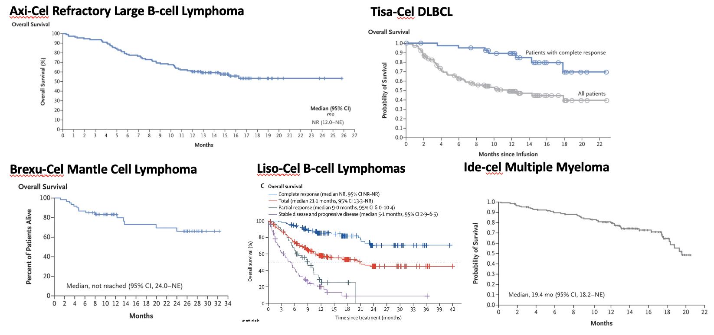
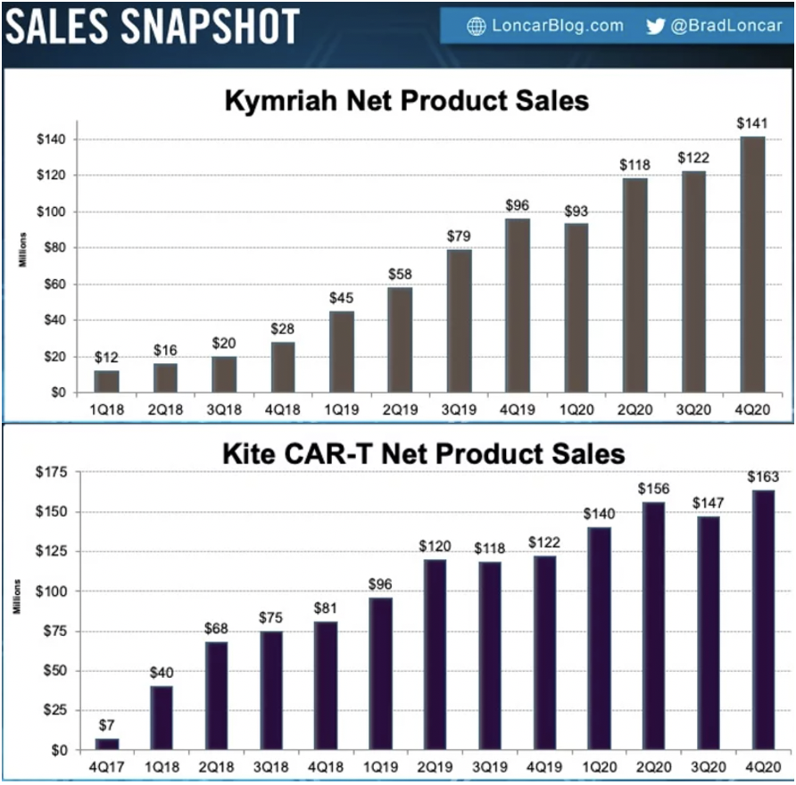
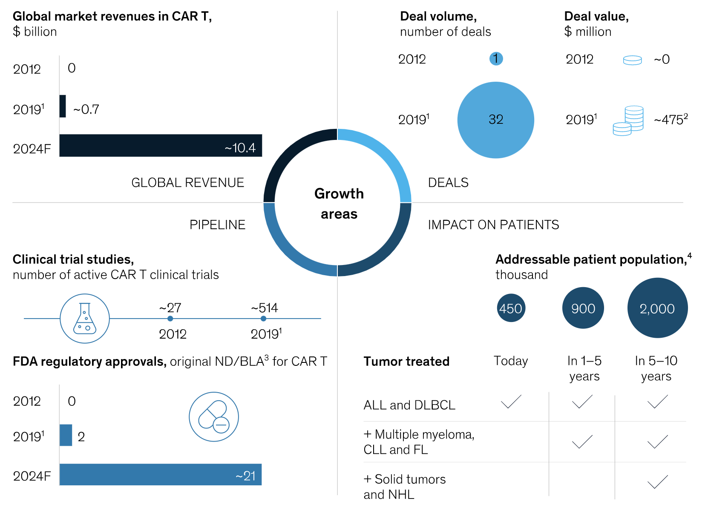

Its no secret anymore that CAR-T and cell therapy as a whole is beginning to transform care for patients in a variety of indications but most specifically cancer. Based on one [review](https://aiche.onlinelibrary.wiley.com/doi/full/10.1002/btm2.10214), out of 767 ongoing T-cell therapy trials, 85% of trials are for cancer, out of 136 dendritic cell therapies, 93.4% are for cancer, and for the 116 ongoing natural killer (NK) cell trials, 94.8% of them are for cancer.

For me, the huge growth in clinical trials is tremendously encouraging. To talk just about CAR-T for a moment, what sets cell based therapies apart from chemotherapy, antibody therapies, targeted therapies, and others is the pretty stunning one-shot cure potential. While this varies indication by indication, one [review](https://pubmed.ncbi.nlm.nih.gov/30948292/) has CD19 complete response rate at roughly 50%, with other hematological cancers at around 25% in the relapsed and refractory setting. CD-19 CAR-T clearly works for ALL, DLBCL, Follicular Lymphoma, and Mantle Cell Lymphoma. BCMA CAR-T sort of works for multiple myeloma.

Here I hacked together Kaplan Meier plots from the pivotal studies. As you can see, the multiple myeloma one seems like we haven't actually determined the percentage of durable remissions yet. Overall, they say it is 33% complete response, but time will tell. Not to say this isn't insanely impressive in a significant unmet medical need, but less impressive than the CD19 stuff.

## CAR-T Market Sizing

At the same time however, CAR-T sales are sluggish and the cell therapy market has become very saturated. CAR-T currently is the only immune cell based cell therapy approved, but soon will receive competition from TCR therapies, CAR-M, CAR-NK, and other more intricate cell design platforms. There are some big names in the space and a lot of big acquisitions. Gilead bought Kite for \$12 billion and BMS wound up with Juno for \$9 billion. Both companies have had significant write downs in manufacturing difficulties, and even IP disputes that at this point have dwarfed earnings.

Yescarta, Gilead's drug for DLBCL and Follicular lymphoma, landed \$563 million in worldwide sales in 2020 while Novartis's Kymriah earned \$474 million. Both of these were approved in the latter half of 2017, so its taken 3 years to reach these sales numbers. Courtesy of Brad Loncar, we even have sales graphs over time:

Peak sales for these drugs are supposed to be \$2 billion for Yescarta and ~\$1 billion for Kymriah, but sales so far have not been encouraging enough to support those aspirations.

McKinsey also wrote a report at the end of 2019 with a nice graphic of the market summary.

It pegs global market revenues at \$10 billion by 2024. Kymriah costs \$475,000 and Yescarta costs \$375,000. If we say each patient on CAR-T is paying \$450,000 for simplicity, that is roughly an expected 22,200 patients getting CAR-T. I'm not super sure how McKinsey is calculating patient population size, it seems very high. Roughly 18,000 people are diagnosed with DLBCL each year and 6,000 with ALL in the U.S.. Maybe 450k comes from worldwide prevalence, and includes all people living with those cancers. Either way, I think it goes to show that even with a small slice of the total patient population, CAR-T can be lucrative, though less so to clinical centers.

## Points about the science

There are a few data points that I would want to see to increase my optimism on the space. Most importantly I think is how far CAR-T and cell therapy in general is able to push into earlier lines of therapy. The hematological indications that CAR-T is good at fortunately do have decent early line therapy options. The issue is proving out that CAR-T's obvious downsides in adverse events are able to outweigh marginal gains in overall survival and complete responses.

I think probably the biggest criticism of CAR-T is expanding beyond specificity. Only BCMA and CD19 have been approved as targets, and even with these targets, only a small percentage of patients are eligible. I think side effects will probably vary by target and with expanding target space, we will learn more about whether BCMA and CD19 are uniquely applicable for CAR-T or whether the platform can be expanded.

Solid tumors are a no brainer point for expansion, but I think there will be more dominated by TCR therapies, cancer vaccines, and other modalities. CAR-T is great for recognizing surface antigens, but the heterogeneity of solid tumors has proven to be a significant challenge. Even if CAR-T does end up working for some solid tumors, I'd worry about how scalable those results are to other tumor types. Ultimately, what would be great is an approach that is able to discern both MHC presented peptides and also classic tumor antigens. Combination therapies including a cell therapy plus some genetic engineering of the TME to make tumors antigen presenting, may also be interesting. Innate immune responses built off of NK cells and macrophages may help address criticisms of CAR-T being an extremely targeted therapy type.

In terms of side effects, we seem to be doing an OK job at developing 'smart' CAR-Ts with logic gates to improve safety. With CD19 CAR-T there was a [paper recently](https://pubmed.ncbi.nlm.nih.gov/32961131/) saying that there is a population of brain mural cells that express CD19, and this might be a reason why there is neurotoxicity. Though a caveat is that Ide-cel the BCMA CAR-T still had neurotoxic effects in 18% of patients, though this is a bit lower than axi-cel at 28%, brexu-cel at 31%, 30% in liso-cel, and 21% for tisa-cel. While I think the mural cell CD19 phenomena probably is contributing to some of the neurotoxicity, the CRS probably is contributing to it also. Speaking of CRS, it seems to be an indicator that CAR-T is working and perhaps an inevitable consequence. Using 4-1BB domains instead of CD28 domains [might provide less severe CRS](https://www.cell.com/molecular-therapy-family/oncolytics/fulltext/S2372-7705(19)30073-7) given that it is more of a slow and steady approach. 4-1BB also seems to induce a more robust memory phenotypes with less T-cell exhaustion.

Homing of CAR-T is a big issue. In 2020, [there was a paper](https://insight.jci.org/articles/view/134612) showing that <5% of the T-cells in the TME are actually CAR-T cells. Good news I guess is that you don't actually need that many cells to infiltrate the TME for remissions, meaning that you might be able to get away with dose reductions if you're able to improve homing. This might help reduce CRS and other tox problems as well. Bad (or more so lukewarm) news is that there is a lot of work to be done to better engineer TME infiltration or homing.

## Relevant Players

__Kite/Gilead__: Gilead seems to be content developing upon leads in brexu-cel and axi-cel, pushing treatment to earlier lines of therapy and in combination with other treatments. They do have 2 early programs for solid tumors in Phase I trials.

__Juno/BMS__: BMS's pipelines is similarly focused on developing their existing ide-cel and liso-cel assets and pushing it to different lines of therapy.

__Legend/J&J__: Legend Biotech and J&J are partnering to bring cilta-cel, a BCMA CAR-T with favorable safety and efficacy to market (its essentially a better ide-cel). Cilta-cel most recently finished off its rolling submission to the FDA and hopes for approval by the end of 2021.

__Novartis__: Similar to Gilead and BMS, Novartis hopes to push Kymriah to larger indications like Lymphoma. However, Novartis also has Phase I trials in AML usig a CD123 CAR-T, in GBM with an EGFR CAR-T + PD1 inhibitor, and a BCMA multiple myeloma CAR-T.

__Bluebird Bio__: Bluebird isn't a true CAR-T player per se, as they just have ide-cel in collaboration with BMS. They have one other pre-clinical solid tumor CAR-T but who doesn't these days.

__Autolus__: Autolus is a CAR-T focused public biotech based in the UK worth $372 million as of April 2021. I think the idea is to improve upon first generation CAR-Ts Kymriah and Yescarta in ALL, NHL, and DLBCL. Their ALL candidate has a CD19 receptor with a faster off-rate which is supposedly to reduce chance of excessive activation in order to reduce toxicity and reduce T-cell exhaustion. Their next most advanced asset is a CD19/CD22 CAR-T for DLBCL which is supposed to reduce remissions due to antigen loss.

__Allogene/Cellectis__: Allogene and Cellectis are two separate companies who have worked together extensively to bring AlloCAR-T to the market. Allo is interesting because it can be administered in an off the shelf manner, but may present additional problems relating to toxicity due to graft versus host. Cellectis uses TALENs to edit T-cells and install the CAR constructs and other modifications. Unfortunately, the early allo results weren't super encouraging and current assets from these two are in Phase I trials so it will be a while until we get a readout.

__Tmunity__: Tmunity is the famous Carl June company funded by a16z. Great thing about this company is that they are able to outsource a lot of their preclinical R&D to UPenn's Center for Cellular Immunotherapies where the co-founders are based out of. By their pipeline, it seems like Tmunity is mostly focused on solid tumors, with lead programs in prostate cancer (PSMA as antigen) and another TnMUC-1 antigen CAR-T that is supposed to work for NSCLC, Pancreatic cancer, Triple negative breast cancer, and ovarian cancers. They also have FR alpha  (ovarian cancer), GPC2 (neuroblastoma, small cell lung cancer, neuroendocrine cancers), EGFR & IL-13Ralpha2 (glioblastoma), and FAP (pancreatic, ovarian, lung, breast, head and neck cancers). These are a lot of new targets which will be interesting to see the clinical readouts for. At the very least, it will be a real test for progress in targeting solid tumors. Primary readouts from at least 2 posted clinical studies are expected by the end of 2022.

__Exuma Biotech__: Exuma (formerly F1 oncology) is interesting because they are concurrently developing novel delivery systems. One system they are terming CCT3 is touted to have a vein to vein time of 12 days. Another termed rPOC basically cuts out the expansion steps and theoretically allows same day administration in under 6 hours subcutaneously. So far, only poster presentations and no clinical data. Wait and see on this one, it doesn't seem like they have nominated a pipeline yet.  

__Arcellx__: Arcellx is another company offering cool technology in the form of a universal CAR-T. Essentially the CAR receptor on the T cell doesn't recognize any body antigen, but instead a specific bispecific molecule that they designed which then latches on to the target cell of interest. Theoretically, you could infuse the CAR-Ts and have them sit in the body and whenever you needed to activate them, you would administer this bispecific molecule to enable targeting. Arcellx also randomly has a normal BCMA multiple myeloma CAR-T in the pipeline. Go figure.

__Sana Biotech__: Lastly, Sana is bringing to market in-vivo CAR-T through a nanoparticle infusion. Flagship's [own page](https://www.flagshippioneering.com/companies/sana-biotechnology) will explain it better than I will, but essentially they are taking advantage of fusogens to deliver genetic payloads to T-cells in-vivo without needing to do leukapheresis. INDs are scheduled for 2023/24 and they haven't published any pre-clinical data that I'm aware of. However, they have a stellar management team, raised a massive 700 million series A in 2020, and currently trades at $4.5 billion market cap. One to watch for sure.

## Closing thoughts

I think overall, CAR-T is a perfect example of why it makes a lot of sense to be a fast-follower in biotech and biopharma. Novartis and Gilead did a ton of the heavy lifting in terms of making mistakes that others could learn from. They showed everyone how to conduct trials, how to set up manufacturing facilities, how to deal with the FDA, and how to navigate payments and reimbursement. Sales are so far behind estimates that I'm almost certain that the profits on early products will be marginal or moderate at best in comparison to what was paid in acquisitions or development.

Another point is that I'm really curious what CAR-Ts are going to look like in 20 years when the major patents expire. Many of the new engineered features like antigen ultra-sensitivity, on/off switches, adaptor/SUPRA CARs, armoured CAR-Ts, and dual antigen receptors seem like they could be combined. With more clinical data, we might be able to figure out which of these modifications actually have clinical benefits and match them together to make 'super' CAR-Ts. Of course, I imagine that there will be a never ending tweaking and re-engineering process, allowing them to get better over time. However, a counter point might be that the extra clinical and financial risk might leave us at a point where no one actually wants to touch them anymore if they are 'good enough'. Anyways, looking forward to gigantic genetic payloads and accessories. Might as well make the cells glow while we're at it.

One area in particular that I'm excited about is in-situ cell therapies akin to Sana, in which the genetic engineering of the immune cells happens in-vivo with some sort of nanoparticle or genetic engineering vector. This isn't a necessarily a new idea, [POC work came out in 2017](https://www.nature.com/articles/nnano.2017.57), but it is only just starting to get commercialized because of the success that CAR-T and other cell therapy modalities have had. Sana, Ensoma, and Tidal Therapeutics (which was just acquired by Sanofi) are figuring out the drug delivery techniques to make this happen and hopefully will provide the clinical readouts showing safety and efficacy in the next couple of years. What is great about this approach is that you can drastically reduce the biological risk by just using the same CAR construct as the original product, and if you can show that gene delivery is efficient, you already have a huge pipeline of new therapies to try. This approach is much less expensive than the traditional leukapheresis approach and gives you the flexibility to re-dose quickly and even spread out the treatment over months instead of giving all the cells at once. Of course, you could very easily update the payload to target different antigens if there is antigenic drift. The flexibility of this approach will democratize cell therapy for countries without leukapheresis infrastructure and allow older individuals to receive benefits.

#### Other great reading:

[Nisarg Patel's piece in April 2018](https://medium.com/@nxpatel/next-generation-car-t-71b7159b2328) |
[McKinsey in December 2019](https://www.mckinsey.com/industries/pharmaceuticals-and-medical-products/our-insights/driving-the-next-wave-of-innovation-in-car-t-cell-therapies#) |
[Genetic engineering of T cells for immunotherapy](https://www.nature.com/articles/s41576-021-00329-9) |
[Recent advances and discoveries in the mechanisms and functions of CAR T cells](https://www.nature.com/articles/s41568-020-00323-z) |
[Engineering strategies to overcome the current roadblocks in CAR T cell therapy](https://www.nature.com/articles/s41571-019-0297-y)
