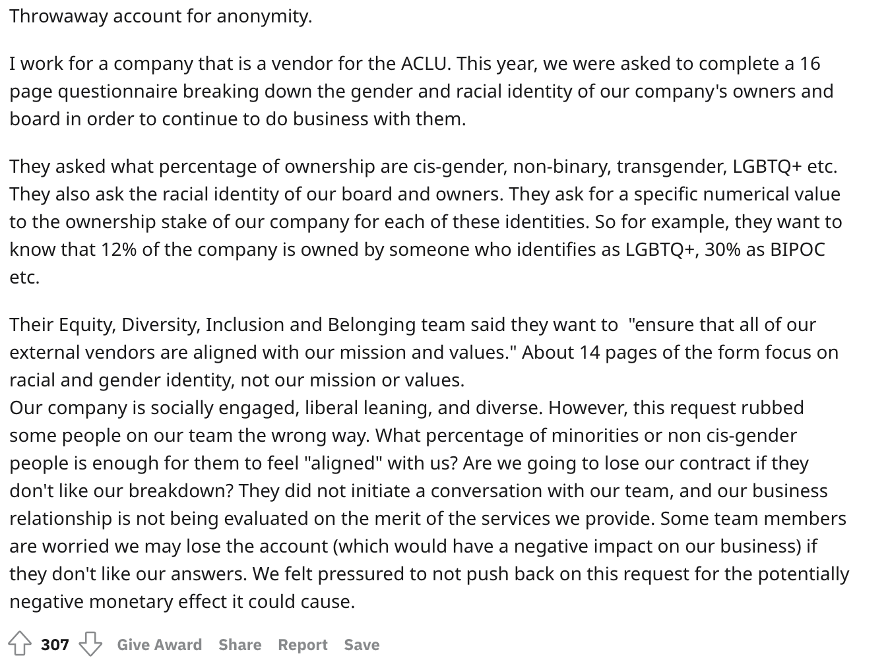
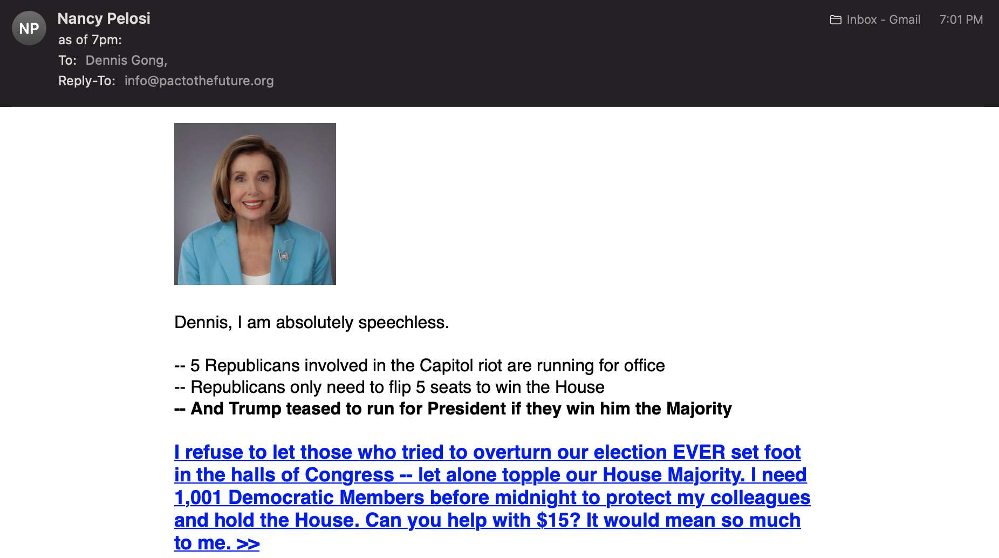

### Motivation

I recently finished reading Steven Brill's book, _America's Bitter Pill_, a long investigative account into how the Affordable Care Act was passed and implemented which offers a uniquely personal lens on the bill, even with sections from the former president himself. There are too many takeaways to cover here, but the thing that struck me the most was the heroics of Mikey Dickerson, Jeffrey Zients, Todd Park, Jini Kim, and the rest of the trauma team that fixed healthcare.gov. Without this team of engineers from the valley, Brill argues that the ACA would have failed. Millions of people without healthcare saved by all nighters, daily stand ups, and smart, hard working, engineers.

The central lesson I took from this is that a bill, a proposal, an idea, is nothing without execution. This is repeated ad nauseam in self help and startup advice circles (which have more than a few similarities), but it was hard for me to connect this to something so impactful: 20 million Americans with healthcare.

This type of execution is something we can all be proud of. It is easy to attack the embarrassing management failures of CGI, Nancy Ann DeParle, Henry Chao, Kathleen Sebelius, et al., and in some cases rightfully so. It is almost impossible to attack the heroism exhibited by the trauma team and the execution that provided Americans with healthcare. In fact, a side story in the book is the state of Kentucky's "Kynect" healthcare exchange market that was widely applauded around the state even when their opinion of Obamacare was negative. Politicians and personalities don't really matter; execution does.

***

### Political Ideology

The heart of what motivates conservatism is exactly this lack of progressive execution.

An important aside here is that the word conservatism has been ruined by American political discourse. Using the words republican and right wing can bag hold connotations associated with certain politicians, the same way that the words 'left wing democrats' does. Conservatism, liberalism, and progressivism are distinct ideals that cannot be written off as wrong or right. Conservatism broadly, is the commitment to the status quo, with general opposition to change. Liberalism is generally thought of as a willingness to respect or accept behavior or opinions different from one's own. Progressivism is in many ways in opposition to conservatism in that it bases itself on the idea of progress and change from the status quo. Straying far away from these definitions and making broad assertions about ethics or lack thereof of any of these ideologies is misguided. Of course, in certain situations each ideal can be argued as most or least ethical.

Conservatives respect the status quo either because 1. it works or 2. because there is no better alternative, or 3. that alternatives threaten an already satisfactory way of life. Unfortunately, republican politicians have been (both wrongfully and rightfully) in many ways written off in taking stands on positions based on this third factor. The inability to agree on issues like the legalization of marijuana, rights for BIPOC and LGBTQ Americans, and women's rights is rightfully an incredibly dark stain on the perception of conservatism. It can also be said that there are issues where reasons 1 or 2 or even 3 are the primary concern of conservatives and for ethically sound reasons.

Given these qualifiers, there are certainly areas where conservatism should be a guiding principle. For example, the NIH grant program has been tremendously successful and it would be silly to make wholesale changes to the program because things are working properly. In a more contentious sphere, recent conversations to defund police departments should be had with great caution given the tradeoffs inherent to such a decision even if evidence can be presented that some police departments have a devastating history of misconduct. In medicine, new and innovative treatments fail more often than they are successful even with purportedly positive Phase II trials. The FDA is supposed to act as a conservative body to uphold only treatments that meaningfully improve patient outcomes given tradeoffs of financial toxicity.

Progressive ideas are often directionally correct, but lack the framing and early execution necessary to convince skeptical conservatives, which is necessary as allies often do not vet aggressively enough. People are obsessed with change and the barrier to change is at all time lows. With the internet, anyone can learn how to do anything (correctly or not), support proposals with statistics (real or fake), and rally support (true or manufactured). Writing a white paper, [especially one so poorly written and laden with misconceptions](https://porter.house.gov/uploadedfiles/final_pharma_ma_and_innovation_report_january_2021.pdf), does not make you a thought leader or provide support for a political agenda. Doing the hard work of interviewing many individuals from different perspectives and addressing the core counterarguments takes time to do correctly, but if those doing the work actually cared about addressing the issue, this is what they would do. The world needs less white papers, more focused execution on ideas that matter.

Instead, progressives have focused on emotion driven programming that supposedly aims to expand the set of people that care enough to vote. The result has been 'monolithing' minority groups and young pre-voters with sound bites and cancel culture instead of addressing the root issues that people care about. Movements like #StopAAPIHate might have been useful for mobilizing private school field trips but produce friction with other liberal agenda items like criminal justice reform and thus do not materially benefit the communities that suffer. A poignant example is Chesa Boudin's office and responses to elderly attacks on Asians in San Francisco, but this also applies in my hometown of Baltimore where grocery store and restaurant owners are resigned to the occasional robbery on top of existing Asian dehumanism in Baltimore communities. The Chinese community in the U.S. has their own set of social networks including WeChat and Wenxuecity where American indifference to Chinese values and needs has already permeated and the social media tactics of American politics has not yet polluted. The only thing that does and should matter to change perceptions and impact lives is execution of social policy with obvious and clear utility. We forget that it is okay to agree 60% with someone. Disagreeing with someone about criminal justice reform does not make the other person evil or negotiation with them a nonstarter.

***

The progressive agenda depends on change. The whole point of conservatism is that life is good as is. This is not to say conservatives are anti-progress; rather that they believe that the baseline rate of improvement that already exists will not be beat by new policy. In any analogy, change requires far more work than doing nothing. Entropically, change will cause short term disorder and tradeoffs will inevitably make some people losers while making others winners. Uncertainty associated with change is very powerful and exceedingly difficult to predict a priori even with expertise and modeling (just look at Covid-19 case projections and policy). Beating this baseline level of improvement given the difficulties in uncertainty and tradeoffs is a high bar for success, and as a result progressives do need to hold themselves (their conduct, the evidence they provide, the implementation) at a higher standard to conservatives. The ones interested in change hold the burden of proof and should need to demonstrate successful pilot programs, engage more allies that you think you need, and refrain from using divisive rhetoric. To be successful, progressives cannot sink to grift culture and need to actively dampen their activity or any other 'dumb' things that are not evidence focused. From a people standpoint, talent needs to not only be smarter, but more empathetic, more hard working, and more operator, engineer, and logistics focused (as opposed to maybe thought leader, think tank focused).

Given the difficulty of successful change, progressives should pick their battles, focusing on issues with large magnitude of benefit and a strong evidence base. Things like offering affordable and accessible pre-K to marginalized communities instead of eliminating accelerated math classes. Things like increasing teacher salaries instead of tearing down statues. And when experiments of change are done, it is important to do them at small scale multiple times before implementation of wholesale policy. Small roll outs provide opportunities to assess efficacy and provide meaningful evidence to convince skeptics. My last point is that politics really shouldn't be fought over ideology. And it shouldn't even be fought; it should be debated issue by issue, as nothing is as simple as it seems and there is significant degree of issue by issue nuance. Bipartisanship isn't dead; we just need better execution, better evidence, and the humility to admit when things don't work.

And not this. This has fraud vibes.

