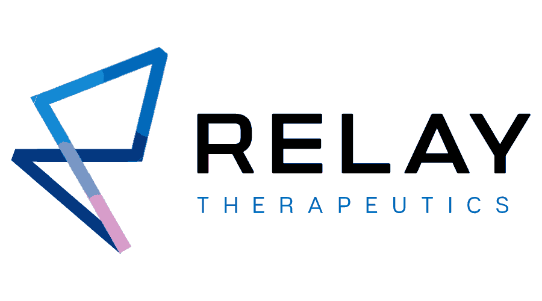
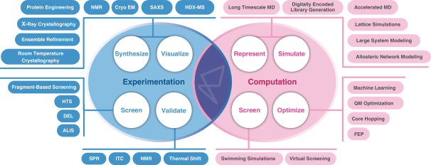
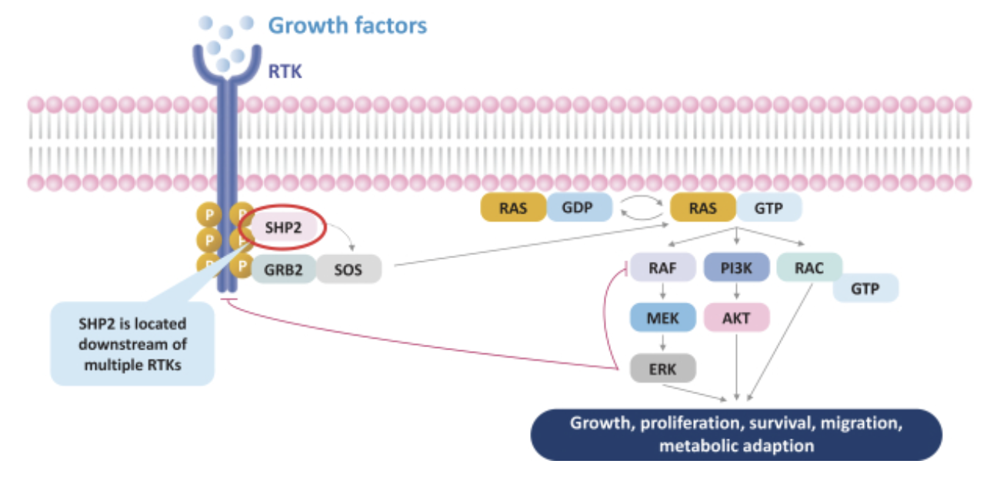
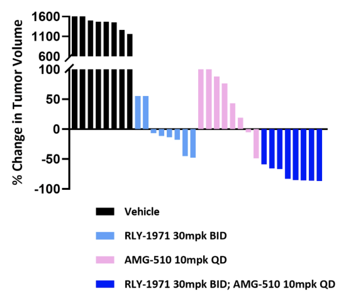
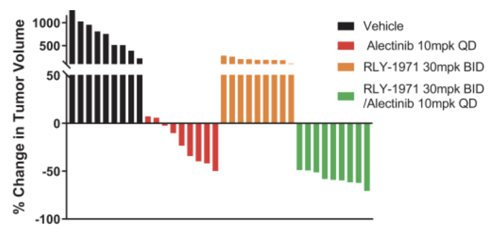
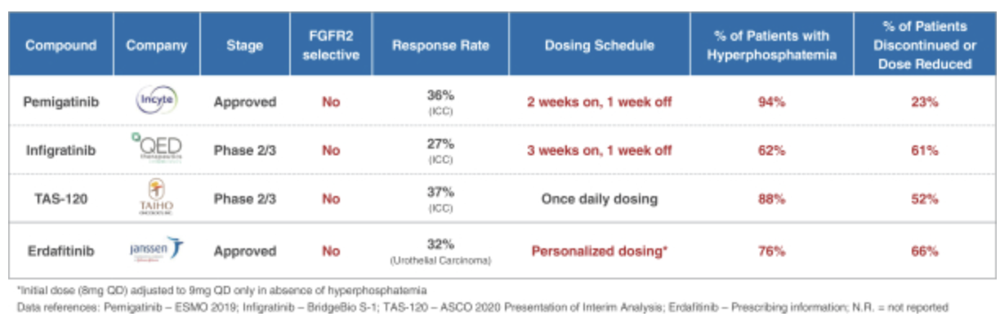
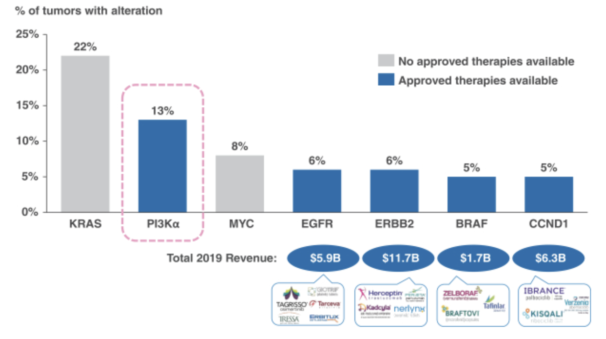
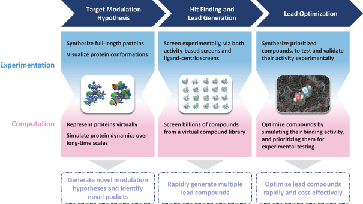
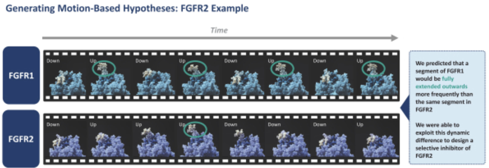

[Relay Therapeutics](https://relaytx.com/) is a clinical stage small molecule drug development company based in Cambridge, founded in 2015 to utilize protein motion screening assays for precision medicine. The company IPOed in July 2020, raising \$400 M at a valuation of roughly \$1.8 B. The company is interesting to me because it is yet another tech enabled screening platform, but one that was partially invented by those at D.E. Shaw Research. It also seems to me like the closest thing to a real pharmaceutical platform company that isn't untractable to analyze. Reading [S-1 filings](https://www.sec.gov/Archives/edgar/data/0001812364/000119312520177746/d924757ds1.htm#rom924757_12) has been a good exercise to begin to understand the work being done at the cutting edge, and also to read the closest thing to a publicly released comprehensive narrative of a company's prospects.

### Overview
The company is the brainchild of 4 superstar scientists, Dr. Mark Murcko, Dr. Matt Jacobson, Dr. Dorothee Kern, and Dr. David E. Shaw, all leaders in the field of computational drug design. The platform they developed, termed 'Dynamo', allows the development of drugs for protein targets based on their motion and changing state through time. The idea is that conventional drug development tools such as structure based drug design (championed by Murcko at Vertex), relies on static images of proteins, which is different from the behavior of proteins in their natural state, which is more dynamic. By understanding how proteins change shape through time, Dynamo allows motion based drug design for the synthesis of new molecules with improved specificity and selectivity. This work has been catalyzed by immense progress in computation, with Dynamo being supported by the Anton 2 supercomputer, a special built computer for molecular dynamics owned by D.E. Shaw Research.

Relay's total operating expenses grew from roughly $50 M in 2018, to $84 M in 2019, to $138 M in 2020 (with $83 M in 2020 revenue). Operating expenses for 1st 3 months 2021 were $42 M compared to $26 M in 2020. As of March 31st, Relay has $742 M in total assets, with $263 M of that being cash. [Link to latest 10-Q](https://www.sec.gov/ix?doc=/Archives/edgar/data/1812364/000156459021027601/rlay-10q_20210331.htm#ITEM_1_FINANCIAL_STATEMENTS)

### Clinical Programs

Importantly, Relay focuses on indications with low biological risk (ie. it is clear that the target proteins influence disease pathology), and low clinical execution risk (ie. patient subgroups are easily stratified using companion molecular diagnostics.). With such a strategy, the company currently has 3 lead programs in precision oncology, RLY-1971 for SHP2 dependent solid tumors, RLY-4008 for patients with FGFR2-mediated cancers, and RLY-PI3K1047 for PI3Kα H1047X mutants.

#### RLY-1971

This program is an oral small molecule inhibitor of the protein tyrosine phosphatase (opposite of a kinase) Src homology-2 domain-containing protein tyrosine phosphatase-2 (SHP2) that binds the protein and stabilizes it in its inactive conformation. Relay believes that "inhibition of SHP2 could block a common path that cancer cells exploit to avoid killing by other antitumor agents, thus overcoming or delaying the onset of resistance to those therapies." Given the range of cancers that SHP2 seems to be involved in, Relay believes that RLY-1971 could become a 'backbone therapy', meaning that it could be a relatively safe starting point onto which other drugs can be built on for combination.

SHP2 is involved downstream of other common RTK targets pictured above, and thus represents a common node to address bypass resistance, a phenomena where cancers will evolve mutations to reduce dependency on a particular pathway targeted by a therapeutic. For example, MEK inhibitors can fail after tumors shift growth factor signaling to alternate RTKs to reduce sensitivity to such therapies. As a result, Relay has successfully demonstrated synergies between their SHP2 inhibitor and other targeted therapies targeting KRAS and ALK.

The current development plan is a monotherapy Phase I trial to assess dosing considerations, and subsequent combination trials with other targeted agents, the soonest of which will be with Genentech. Genentech also announced in December 2020, a worldwide license and collaboration agreement for this drug in which Relay got \$75 M up front, with \$25 M in near term and \$695 M in long term milestones.

Although there are no approved therapies targeted SHP2, the competitive landscape is quite crowded, with other companies with clinical trials including Revolution Medicines (with Sanofi), Novartis, Navire Pharma, Erasca, and Jacobio (with AbbVie).

#### RLY-4008

Their next program is an oral small molecule selective inhibitor of fibroblast growth factor receptor 2, or FGFR2. FGFR2 is one of 4 members of the FGFR family, and RLY-4008 selectively inhibits FGFR2, without effects on the other family members. Targeting growth factors and their receptors is not new, and there are several other FGFR2 inhibitors approved including erdafitinib and pemigatinib. However, these and other molecules in clinical trials are not selective specifically for the FGFR2 family member, and due to dual inhibition of FGFR1, these other molecules cause dose limiting hyperphosphatemia.

The molecule Relay developed using their platform was designed to have improved specificity for FGFR2, up to 200 fold over FGFR1 which casuses the hyperphosphatemia. This is important as it widens the therapeutics window to allow for use in combination treatments and more therapeutically active dose regimens. Currently, response rates max out at 37% at a once daily dosing level. It seems that Relay wants to dose twice daily in their initiated Phase I clinical trial. One other differentiator of Relay's molecule is improved potency against common FGFR2 resistance mutations, likely because their molecule hits an allosteric site. To me, this is a no brainer since it hits a different site, but Relay's molecule will probably have its own resistance mutations that it doesn't work on.

Relay's clinical development for the molecule is occurring in a Phase I initiated in September 2020 with patients enriched for FGFR2 altered solid tumors, using a twice daily dosing schedule. Relay makes a point of defining the target patient population as follows:

_"We believe FGFR2-mediated cancers affect approximately 8,000 late-line patients annually in the United States, of which fusions represent approximately 2,700, amplifications approximately 1,600, and mutations approximately 3,800. In the future, if RLY-4008 advances to earlier lines of treatment, we believe it could potentially address approximately 20,000 patients annually in the United States across the different alterations."_

#### RLY-PI3K1047

Finally, Relay wants to develop a franchise of PI3K mutant inhibitors. Phosphoinositide 3-kinase alpha (PI3Kα) is overactive in many cancerous malignancies, and acts downstream of tyrosine kinases like RAS to promote cell growth, proliferation, and survival. PI3Kα mutants are present in 13% of all solid tumors, but is difficult to drug. The one FDA approved PI3Kα inhibitor Alpelisib (Piqray) is used for breast cancer but comes with significant toxicity.

Relay's lead program in this franchise selectively targets the PI3Kα H1047X mutant, and two additional mutations of interest are E542X and E545X. Alpelisib on the other hand, is less selective and binds the active site of PI3Kα, which inhibits both mutants and the wild type PI3Kα. This leads to on target toxicity, including hyperglycemia in 64% of patients (36% Grade 3 or 4). Additional off target toxicities include gastrointestinal toxicity in 93% of patients (9% Grade 3) and 36% of patients with rash (10% Grade 3). This combination of adverse events resulted in 64% of patients requiring dose reductions, 25% of patients discontinuing treatment, and 87% of patients requiring insulin and other anti-diabetic medication to manage hyperglycemia. Despite 11 month progression-free survival (PFS) in the SOLAR-1 Phase 3 trial of alpelisib, the median duration of dosing in the alpelisib arm was 5.5 months, indicating the majority of patients discontinued dosing prior to disease progression.

The Relay molecule results in 5-10 fold inhibition for the PI3Kα substrate in in vitro assays, which doesn't happen for Alpelisib or a competitor molecule, GDC-0077 that is in development by Genentech.

RLY-PI3K1047 will be tested in a tumor agnostic setting in 2021 as a monotherapy and in disease specific settings in combination with other targeted therapies.

Relay estimates 10,000 late-line patients annually for the H1047X mutant molecule in the United States, and up to 50,000 if it advances to earlier lines of treatment. For the two additional mutations of interest, E542X and E545X, Relay estimates there are 15,000 late-line and 60,000 total patients annually in the United States who might benefit.

### Computational Drug Design Process

To build this pipeline and to fuel future discovery efforts, Relay relies on a next generation chemical development platform termed Dynamo. Importantly, the platform doesn't sell itself as an entirely automated solution. The core of the platform is the quality of their scientists. However, there are powerful technological advancements that allow their scientists to see things that weren't possible to see before. But the whole process follows the typical pattern of hypothesis generation, identifying a druggable binding pocket, finding hits, and optimizing leads.

#### 1. Target modulation hypothesis.
The process starts with getting a mechanistic understanding of the dynamic behavior of the protein. To do this, Relay performs a range of structural biology techniques on full length proteins including room temperature X-ray crystallography and Cryo-EM. With these experimental datasets (knowing how the atoms are arranged), Relay deploys a computational simulation platform to demonstrate how the protein moves over long time scales (molecular dynamics; knowing how atoms interact). This requires a silly amount of compute power, which Relay accesses via Anton 2, which calculates the force between each atom and every other atom in a given system at discrete time points to model behavior over time. For benchmarking experiments, Relay has simulated systems of up to 1 million atoms at time slices of 2.5 x10-15 seconds at timescales of tens of microseconds. For a sense of comparison, a 10 microsecond simulation of a 1 million atom benchmark protein (satellite tobacco mosaic virus), which requires one day of processing on the Anton 2, would require 271 days on an Nvidia V100.

Using these simulations, a motion picture of the protein can be stitched together, and Relay scientists can develop hypotheses about how the protein functions. For example, in the slide below, they describe how they developed a hypothesis for their FGFR2 inhibitor:

#### 2. Identify allosteric binding pockets.
Once a hypothesis is generated, Relay drug hunters are able to identify allosteric pockets that are potentially druggable. This step involves a combination of computationally and chemist derived hypotheses which are tested in laboratory experiments on full-length proteins.

#### 3. Hit finding/lead generation.

Soon after, their scientists use a bunch of different screening techniques including cloud based virtual screens and a variety of physiologically relevant activity-based and ligand-centric in vitro screens to find hits.

#### 4. Lead optimization.

Finally, during optimization, they leverage the same long timescale MD simulations to study binding pocket dynamics and to test analogs of lead compounds to prioritize which ones to synthesize and test experimentally. These simulations also generate a lot of data, which the team uses machine learning to help parse and develop predictive models to prioritize synthesis. This is a flywheel process which allows continual improvement of models and decreased screening burden over time.

### Takeaways:

The information above is a simple and quick summary of what was presented in the S-1 filing, but there is a lot more and probably updated information in corporate presentations on their website. Below are my own takeaways and _~analysis~_.

1. The quality of your molecule matters. "The ability of a drug to specifically and deeply inhibit the protein target of interest while minimizing the inhibition of other closely related protein targets can result in a profound difference in outcome. A key example of this is seen in two drugs targeting the altered protein RET. One is a non-specific drug, cabozantinib, and the other is a purpose-built, specific drug, selpercatinib. Seplercatinib increased tumor response rate to 68% from the 28% demonstrated for cabozantinib."

2. "Importantly, subtle differences in protein conformational dynamics (on the order of a few angstroms) have been observed in otherwise structurally similar proteins. In addition to these small-scale changes, global motion of proteins can create on and off-states that can be dynamically regulated. Defects in the conformational dynamics of proteins have been implicated in up to 40% of all diseases." Crystal structures do not accurately represent the dynamic nature of a protein in its biological context, which could impede drug design.

3. Relay is still a hypothesis driven drug company. The platform helps them see, but the experience of drug hunters on their team helps them build the molecules. Relay's success seems to me more a function of throwing a lot of compute at a problem, rather than automation and AI. It is gratifying to see that it is still the scientist at the end who is developing the SAR hypotheses.

4. Foundation Medicine and other companion diagnostics have dramatically expanded the TAM of cancer therapeutics. Segmenting patient populations makes it easier to do trials and hopefully improves outcomes. Gathering more data about patient illnesses has been a huge win for the industry.

5. Relay's (and I presume other precision oncology companies') general strategy is to start in a small precision indication and gradually expand to earlier lines or other cancer types. These drugs will be pricey and it is easier to justify at smaller treatment populations.

6. Key differentiators can be the ability to be oral and be amenable to once daily continuous dosing to reduce toxicity. Cancer patients already suffer a great deal and often can't take medicines because of toxicity or other reasons. Creating medicines that go down easy might be an under-appreciated way to boost outcomes. Relay has also demonstrated to me how easy it is to tear down competition in the pre-clinical setting and how important it is to not be first, but be best.

7. Earlier this year in April, Relay acquired machine learning DNA encoded libraries startup Zebi AI. The deal cost \$85 M up front, plus up to \$185 M in earnouts and milestones over next 3 years. This acquisition boosts screening capacity and theoretically improves predictive models by adding more data.

8. Current valuation is 3.3 B which is a bit rich for the current pipeline and up significantly since the IPO but speaks to investor confidence in the platform and team. This is on \$500 M in total fundraising to date. This seems to indicate that people think the drugs will work. Genentech deal for SHP2 program was quite small also.
