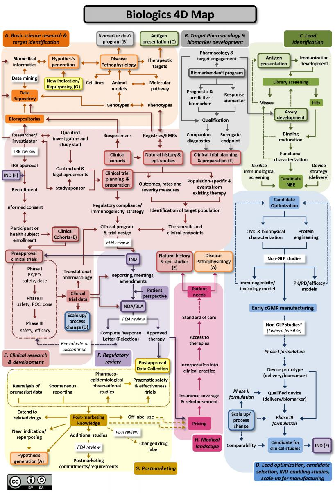

XBI is down 25% off February highs and 8% YTD despite a blistering IPO market and drop after drop of groundbreaking scientific data. Catalysts like the approval of Aducanumab, Intellia's first in human editing (and a slew of other gene therapy advances), and widespread recognition of the potential of LNP seem to have been priced in. Meanwhile, of the recently approved therapies ready for commercialization, initial sales have been sluggish and there again seems to be the realization that pharmaceuticals is a business, and one that is villified by the American public.

Several analysts have blamed private markets for this. Venture creation firms are printing money given the ease of IPO. It is too easy to raise and immature companies are soaking up investment dollars and siphoning them away from mature yet out of fashion outfits whose milestones no longer make headlines. Supply outpaces demand.

At some point, companies transition from being priced on story, to being priced on deliverables. Kaplan-Meiers, AEs, approvals, revenue. The issue with public markets is pricing based upon often binary catalysts. Retail investors are adept at 'selling the news', and ignoring for a moment the blind hype that is outwardly polluting valuations, there is a certain pessimism that revolves around calling 'tops'. Analysts are too optimistic and sales invariably miss. Once a drug is approved or pivotal data released, only bad things can happen.

***

This kind of environment is perfect for dissecting away hype and focusing on risks. Being able to understand and quantify risks requires an encyclopedia like understanding of medicine and most people will never attain that; but as a proxy, pattern matching with previous failures is a limited alternative that may provide some insights. Below are four mental models I've found useful in navigating risk when there isn't an abundance of clinical data.

1. Pre-test probability

Some indications are much more difficult to tackle than others, and as a result the expectation that a drug might work for that indication should be lower. For example, drugs for neurodegeneration and neuropsychiatric disorders are rare, and the expectation that a trial should work in these indications should be lower than Macular Degeneration for example, where the disease biology is better understood. Alzheimer's, glioblastoma, anything aging related, or other indications where there haven't been drugs approved in a long time should be approached with caution as there is significant biological risk.

The toughest indications to tackle are often multi-factorial, with inadequate understanding of the underlying disease pathophysiology. As a result, the expectation should be that the company designing the trial probably chose the wrong target, or wrong patient subpopulation to conduct the trial. There are simply many more things that need to go right in order for the trial to be successful.

2. Correction for multiple comparisons

Another area of risk that isn't communicated effectively is the problem of making multiple comparisons. These problems surface when a company runs multiple confirmatory trials for the same drug (ABeta trials for Alzheimer's), or when -omics based technologies are used for diagnostics, or when patients in clinical trials are sliced and diced into many subgroups for analysis. For subgrouping, this is particularly common in analysis of Phase 3 results, but should in theory happen in Phase 2. When running a large confirmatory trial, the FDA requires companies to 'call their shot', which lowers the likelihood of a good result happening by chance. If there happen to be certain subgroups that outperform others, it shouldn't be unreasonable to ask the company to run another confirmatory trial to validate the result.

3. Immature technologies

The most common area of risk that leads to mispricing comes from going to clinic too early or promising to go to clinic too early. Safety signals are far too commonly missed in preclinical development, especially for next generation modalities like cell and gene therapies. The whole field remembers Jesse Gelsinger who died from a reaction to a gene therapy vector more than 20 years ago in 1999. Cell therapy almost had a similar moment where an inability to predict cytokine release syndrome almost led to the death of a patient if it wasn't for an emergency authorization to use an IL-12 antibody that had just recently been developed. Gelsinger's death did set the field back a decade and without quick thinking by the group at UPenn, cell therapy would have been set back a decade. Interferons and cytokines were both immature technologies that were attemped to be commercialized in the early 2000s, but only until now has improved engineering technologies provided some renewed promise.

4. Inertia

An area that recieves considerably less attention in the life of a biopharma is commercial launch. The reality is that while there are some more academically inclined physicians that are receptive of providing their patients the newest therapeutic options, the vast majority are more skeptical and slower to onboard in a commercial launch. Trust of current standards of care, slow insurance adoption, and poorly designed clinical trials can all delay sales. Physicians at the end of the day want what is best for patients and new therapies are rarely universally good for all patients, and have the additional risk of developing new adverse safety signals over time. A recurring example has been the adoption curve for cell and gene therapies which to many has been slow compared to expectations. A slow launch has advantages of being able to respond to safety signals and optimize treatment infrastructure, and investors should be cognizant that rushing a launch in pursuit of impressive sales growth can be bad for patients and the long term relationship between providers and the drug.

***

Developing drugs is hard and often oversimplified by focus on milestones and binary events (see map below of biologic development). Strong and experienced teams should theoretically be able to effectively communicate risks and be patient in extolling a company's strengths before key aspects have been derisked.

In 2017, the FDA released a [report](https://www.fda.gov/media/102332/download) detailing 22 case studies where Phase 2 and Phase 3 trials had divergent results. Bad trial design is not the only reason why such failures were so expensive. As authors in [Nature Drug Discovery write](https://www.nature.com/articles/d41573-020-00167-0),

_"Many late-stage failures, particularly in trials for complex chronic diseases, would have benefited from additional basic knowledge of the condition. Such knowledge gaps could be addressed through ‘deep human phenotyping’ or more precise and comprehensive analysis of phenotypic abnormalities, linked with genetic analyses that are becoming more commonplace. Real-world evidence could contribute additional knowledge to fill gaps."_

### Why are bubbles (misjudgement of risk) bad?

There are several reasons involving effects on all stakeholders except those who were lucky enough to time the bottom and top.

The primary issue stems from patient harm, which sours the patient and physician relationship with the drug and potentially setting back whole sectors. Good faith is a resource that the pharmaceutical industry runs short of, and losing good faith for reasons that are in control of the company is selfish and short termist. If patients do get harmed by a drug or a drug doesn't work as intended, people lose money, investment dries up, and a washout effect occurs where stuff that is real doesn't get funded. No one wants to get into a situation where science occurs by press release and details in clinical journals are missed.

There are several examples of the above that are good to highlight:

1. [Accelerated approvals failing to show clinical benefit that don't get pulled from market increases distrust of the accelerated approval pathway and ultimately faith in the FDA](https://www.targetedonc.com/view/fda-takes-a-stand-on-accelerated-immunotherapy-approvals-without-confirmatory-benefit). The long term effects of this may be that standards of care become more entrenched and inertia for clinical launches becomes tougher. In the linked article above, the FDA does pull some but not all of the drugs that do not show confirmatory benefit. The recent approvals of Aducanumab and Sarepta's Duchenne Muscular Dystrophy gene therapy have both eroded confidence of the FDA, however.
2. A slew of failures in the 'aging' field including Cynthia Kenyon's Elixir Pharmaceuticals, David Sinclair's Sirtris, resTORbio and RTB101, Unity Biotech and UBX101, and more have made the 'aging' indication a meme.
3. Medical reversals like ABMT in breast cancer, and widespread misuse of stents highlighted by Vinay Prasad increase scrutiny of medical devices.
