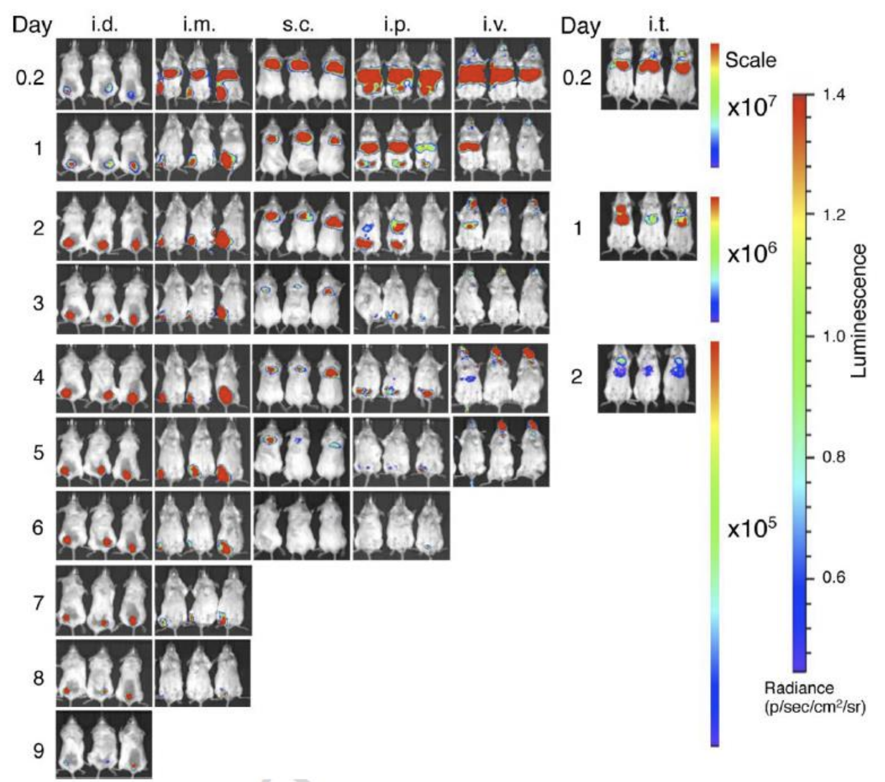

Gene therapy is a rapidly growing therapeutic modality but is currently limited by several factors including delivery, safety, and manufacturability. Recently, there has been tremendous focus on new delivery technologies such as lipid nanoparticles (LNPs) as a way to address potentially all of these factors. As someone interested in delivery and working tangentially on delivery related projects, it has somewhat been less clear how the payload or even cells of interest can be engineered to promote improved gene expression. Understanding how these aspects can be optimized can potentially further improve our capabilities to design better delivery vehicles (ex. co-delivery with excipients, packaging size considerations, multi-gene delivery). A multi-pronged approach may be preferable.

The main question I had was what actually goes into a DNA or RNA payload and what factors are 'engineerable' to the extent that they may be applicable in a clinical setting? In fact, I might even think that in some cases, this will have a greater impact on gene therapy than the vectors themselves. Frankly, I've become somewhat unimpressed by combinatorial chemistry or high throughput screening approaches using toy models like B6 mice and GFP. The variability is amazingly high and likely what works for a mouse won't work for an NHP, and what works in an NHP might not even work in a human. There may be specific vectors that perform specifically well for certain payloads and even this might be patient specific. What seems most realistic for me is better methods for local delivery or engineering the payloads for cell specific expression. Maybe a dream scenario might involve a setup where you do a test infusion of various vectors to see if any selectively target cells in a specific patient and then choose that specific vector for delivery of the real payload at clinically relevant doses. 'Personalized delivery'. Below is an example of this variability, courtesy of Acuitas who developed some of the lipids being used in the vaccine LNPs.

Alternatively, you have biologically mediated means of delivery like [fusogens](https://sana.com/) or using [anelloviruses](https://www.ringtx.com/), or even using [cells as delivery vehicles](https://advances.sciencemag.org/content/6/18/eaaz6579). Given the success of GalNAc liver targeting, I'm more convinced that something like this would work. But ideally, you combine several lines of engineering that allows you to detarget everything except the cells of interest.

But assuming we have vectors that sort of target the cells of interest, we still have a problem. The majority of vectors will be cleared either by immune cells or via glomerular filtration, some will inevitably transfect off-target cells. Biodistribution in any case isn't uniform across tissues so even with targeting, only a small fraction of the vector will reach the cells of interest. Once in the vicinity of target cells, assuming we get decent uptake, the efficiency of translation of nucleic acids is still on the order of 1-2% of what is contained in total in the vector for nanoparticles (each virus only packages one casette so I'd assume multiple viruses per cell are needed to get expression?). It is difficult to know exactly how much nucleic acid can be complexed in a polyplex nanoparticle, but I would guess on the order of hundreds/thousands?

_(Ideally, I'd calculate this by taking the mass of lipid/polymer + nucleic acid added and the particle concentration of a sample to get the mass per particle and using whatever w/w ratio used to calculate how many nucleic acids are in each particle. Here, I'm assuming that a dose of polyplex is similar in terms of number as AAV for ~10^16 viruses/particles, and the relevant human dose of LNP for Intellia's ATTR drug is 0.3 mg/kg so lets say 10 mg mRNA. Lets say the molar mass of a 4000 bp mRNA is 660 for a single base * 400 = 2.64E6 g/mol. 10 mg is 3.8E-6 mol or 2.36E18 molecules, which is on the order of hundreds per particle. It is possible that there are more particles (less immunogenic) or less particles (viruses are smaller generally) so calculations are clearly garbage quality but maybe in the right ballpark.)_

Say an mRNA can be reused for translation on the order of ~50 times, and the duration of siRNA silencing can last for a week maybe. That is a lot of room for engineering and/or co-packaging nucleic acids or other molecules. For viruses, each contain only 1 cassette, so while there is less room to be creative in engineering more complex payloads, you still have to be clever to maximize use of space.

## Payload Engineering Toolbox

Systems biology has taught us that genetics is incredibly complex. Transcription and translation are highly regulated events that are not close to being fully understood. As a result, the oft touted simplicity of gene therapy really isn't so simple. Below is the mRNA casette present in the mRNA Covid-19 vaccines.

There are great articles by [Derek Lowe](https://blogs.sciencemag.org/pipeline/archives/2021/01/11/rna-vaccines-and-their-lipids) and [Bert Hubert](https://berthub.eu/articles/posts/reverse-engineering-source-code-of-the-biontech-pfizer-vaccine/) that explain more comprehensively what each component of the casette does and how they were modified. A clue to the importance of these modifications is the dramatic difference in response between Moderna and Pfizer's modified RNA casette and CureVac's unmodified casette. Briefly, the 7-methylguanosine cap on the 5' end acts as a signal that the mRNA was made from the nucleus and prevents premature degradation in the cytosol. There are pseudouridine (or 2' ribose for siRNA) substitutions and codon optimization (more Cs and Gs) that make the RNA less immunogenic and more translated respectively, and a poly-A tail to give the RNA longevity to be translated multiple times. Finally, the 5' and 3' UTR regions are less understood, but help inform the ribosome and other cellular elements the kinetics of how to regulate and translate the mRNA.

How do we engineer how mRNAs are transcribed and trafficked to ribosomes, how ribosomes decide to translate mRNA into protein, or how other elements interact with the mRNA payload or even the protein it produces? And more broadly, how do we do this for other nucleic acid therapies like siRNA, DNA, miRNA, etc.? The rate limiting factor is unsurprisingly, our understanding of the basic biology behind gene expression, and we continue to learn more and more about it every week. But even with our current toolkit, there are perhaps infinite ways to perturb how gene therapies are processed intracellularly. A couple of recently promising strategies are described below.

__Codon/base optimization:__ As described above, codon optimization can be used to tune immunogenicity and clearance. Generally, incorporating pseudouridines and less cytosines and guanines is preferable to decrease clearance and TLR responses and increase the longevity of the construct. However, in certain cases such as cancer vaccines, it may even be preferable to codon optimize for increased Cs and Gs to increase the immunogenicity of the vaccine.

__Cell type specific promoters, enhancers, and silencers (cis regulatory elements or CLEs):__ Companies like [Circularis](https://circularisbiotech.com/) have developed discovery platforms for promoters. Given that transcriptional regulation is the primary method of cellular control and can work over a 10^6 fold range, Circularis believes that this is a more promising route for improving integrating gene therapies. Cis regulatory elements typically involve a cell specific transcription factor or other switch element that only turns on (or off, ex. with cell specific miRNA)in cells expressing that protein in order to regulate expression.

__Inducible vectors:__ To further limit control over dose and time of expression, many systems include inducible switches that get activated by small molecules or other molecular sensors. These take advantage of advances in gene circuits, and have seen considerable progress over the past years. The tetracycline doxycycline system originally developed in bacteria is a common system that has gained some clinical use owing to the relative safety of doxycycline dosing for inducement.

__Nuclear Localization Signals (NLS):__ A major issue in DNA delivery is trafficking to the nucleus. These are somewhat addressed by NLS which are clusters of arginines and lysines that tag proteins for nuclear import. Similarly, nanoparticles or other vectors containing DNA can be tagged with NLS sequences to increase the likelihood of nuclear import.

__UTR Engineering:__ This is another area where HTS approaches may be useful as it isn't clear that we understand how UTR regions interact with ribosomes or other elements to coordinate translation yet. However, a number of approaches have demonstrated that sizable improvements can be made to influence expression by optimizing UTR regions.

These are likely only scratching the surface of what is possible and I will be adding more to this list as I come across them. In the mean time, several good reviews/articles I came across are linked below:

[Gene Regulation Systems for Gene Therapy Applications in the Central Nervous System. Naidoo & Young 2012](Gene Regulation Systems for Gene Therapy Applications in the Central Nervous System)

[Cis-regulatory elements: molecular mechanisms and evolutionary processes underlying divergence. Wittkop & Kalay 2011](https://www.nature.com/articles/nrg3095)

[Realizing the promise of gene therapy through collaboration and partnering: Pfizer’s view. Tretiakova et al 2018](https://www.nature.com/articles/d42473-018-00307-6)

[High-throughput 5′ UTR engineering for enhanced protein production in non-viral gene therapies Cao et al 2021](https://www.nature.com/articles/s41467-021-24436-7)
