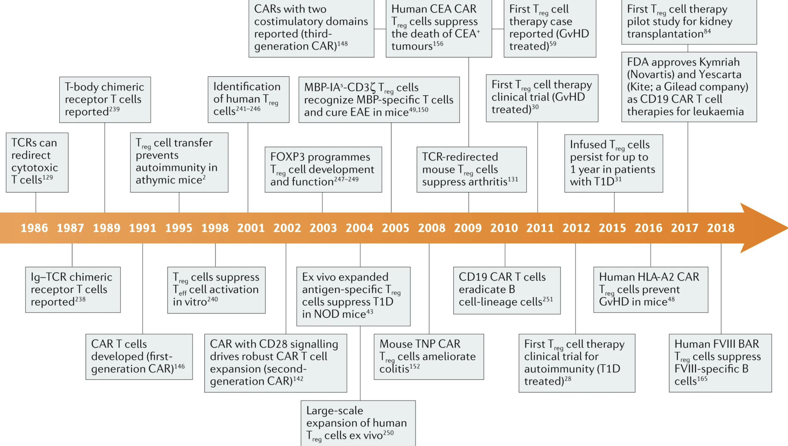

Over the past several months, there has been significant interest in Tregs as a cell therapy modality and as a therapeutic target. If you're like me and [don't understand](https://twitter.com/TheSASBurner/status/1437624151007711235) why this is, [this poast might be interesting](https://twitter.com/TheSASBurner/status/1439641668282630148) to read. Its my attempt to sift through the biological hypotheses being made in each of these companies.

### Why target Tregs?

Inflammatory and autoimmune diseases and disorders are hard nuts to crack. Graft versus host disease (GVHD), organ transplantation, type 1 diabetes (T1D), systemic lupus erythematosus (SLE), inflammatory bowel disease (IBD), and multiple schlerosis (MS) among other autoimmune and inflammatory disorders are underserved by existing therapies and will represent a considerable public health burden as our population ages. Current options are non specific and/or require long term administration. Additionally, nonimmune diseases such as cardiovascular diseases, obesity, type 2 diabetes, and degenerative diseases of muscle and brain are exacerbated by inflammation. Even aging itself has been thought to have a root cause in inflammatory dysfunction.

Cyclosporin, voclosporin, belimumab, rituximab, steroids, cyclophosphamide, azathioprine, methotrexate, mAbs against cytokines and their receptors such as anti-TNFalpha anti-IL-1β, anti-IL-4 receptor subunit-α , anti-IL-5, anti-IL-6 and anti-IL-17), and abatacept are all options. But potent disease modifying therapies are still few and far between. Similar to how progression in oncology has reached cell based therapeutics, autoimmunity and inflammation are catching up. The next generation of companies may be reliant on cell modification rather than pathway modification.

"It is very hard to assimilate all the functions of the cell, and so perhaps the cells themselves can be a drug."

Tregs are 20 years behind the rest of the engineered T cell field, and we don’t necessarily have a lot of the basic science background to base decisions on. The first clinical trial evaluating Treg therapy in humans was published in 2009 and there hasn't been that much progress since then because of the difficulty of manufacturing Treg cells and selecting and recruiting patients. Still, the tremendous successs of cell therapy in hematological malignancies has perhaps spurred a newfound interest in conjunction with strategies to overcome manufacturing difficulties. The timeline for Treg based therapy has been long, but is just beginning to mature.

To provide a brief overview of the basic biology, Tregs constitue 1-2% of peripheral blood lymphocytes and 4-5% of CD4+ cells. The FOXP3 transcription factor plus surface expression of CD4 and CD25 are standard markers for defining Treg cell populations. There are further differences between peripheral and thymus derived Tregs. Treg cells confer immune tolerance via multiple mechanisms for example through the expression of anti-inflammatory soluble molecules, such as IL-10, TGFβ and IL-35, the consumption of IL-2, and the expression of negative regulatory cell surface receptors such as cytotoxic T lymphocyte antigen 4 (CTLA-4), CD39 and CD73. They can target T cells directly or indirectly by modulating APCs. Tregs mainly recognize self antigens, TCR repertoire is mostly non-overlapping with effector T cells. Tregs localize at the site of antigen presentation, decreasing risk of general immunosuppression but at the same time causing a bystander suppression effect (aka infectious tolerance), where they cause nearby cells to become immunosuppressive. This is in contrast to effector T cells which function in primarily a contact based manner. Tregs are the “ideal therapy for autoimmune disease” because they are locally activated, address various types of inflammation, release soluble factors that change the surrounding environment and have the potential to repair. Tregs also last a long time, which is critical for chronic diseases like MS.

Yet Tregs are also quite fickle to work with. They are very plastic and because of this, the stability of FOXP3 and their status as Tregs can potentially be an issue. In response to proinflammatory or otherwise inhospitable conditions, Treg cells transdifferentiate into Teff cells (also known as ‘ex-Treg cells’), including pathogenic TH1 cells, TH2 cells and TH17 cells. The plasticity and rarity of endogenous Tregs make it costly to isolate and purify Tregs, creating scalability and phenotypic inconsistency issues for Tregs sorted from peripheral blood. Expansion of Tregs using rapamycin and CD3/CD28 beads is quite variable. Magnetic activated cell sorting (MACS) and fluorescence activated cell sorting (FACS) are the main methods of purifying Tregs, though both are inadequate. MACS has insufficient purity and FACS is slow and often not GMP compliant. The field is still organizing itself in [terms of manufacturing](https://www.ncbi.nlm.nih.gov/labs/pmc/articles/PMC5775516/). We will see below that entire companies have been built with the core technology being manufacturing based. With Tregs even more so than CAR-T in hemonc, process is product.

Several application specific lessons have also been learnt about Tregs via both preclinical and clinical readouts. Perhaps the most significant finding is regarding antigen specific versus polyclonal Tregs. Antigen specific Tregs are able to exert tolerance in an antigen specific manner while polyclonal Tregs may have multiple antigens but are not as potent against single antigens. A landmark failure in Treg therapy came in 2019 when Caldrius Biosciences [reported](https://www.globenewswire.com/news-release/2019/02/13/1725052/0/en/Caladrius-Biosciences-Reports-Top-Line-Data-for-the-Phase-2a-Sanford-Project-T-Rex-Trial-of-CLBS03-for-Recent-Onset-Type-1-Diabetes.html) that polyclonal Treg ACT did not have a therapeutic benefit in T1D. Preclinical work over the past decade has also strongly supported antigen specific Tregs as more potent and efficacious. Another potential downside may be that the use of polyclonal Tregs can potentially suppress protective immunity against tumors and infectious diseases by transferring a large number of Tregs of broad undefined specificity. However, this is not to say that antigen specific Tregs are superior in all indications. Larger tissues can activate sufficient Tregs in a polyclonal population to achieve therapeutic effect, whereas smaller tissues may require antigen-specific Tregs for ACT.

Future development of Treg cell therapies highlight how far genetic engineering and modularization of biological pieces has become. Broadly, technologies used for CAR-T in oncology will be applicable in Tregs. For example, knocking out HLAs to prevent rejection or the IL-6 receptor to ensure Treg stability. Other strategies like knocking in CD47, suicide cassettes, chemokine receptors, or other bioorthogonal activation recptors may be relevant as well. Finally, co-administration of Treg selective IL-2 variants may promote in vivo expansion. The decision to arm cells with antigen specificity via TCRs or CARs may be context specific. For example, TCRs may be more appropriate to target antigens expressed at low levels whereas CARs may be more useful for abundantly expressed antigens on target tissue, with low expression on normal tissues. TCR immunosequencing can be an additional method for generating patient specific Tregs for precision medicine.

[Box 2 and 3 from this review](https://www.nature.com/articles/s41577-019-0232-6) serve as good summaries for the major questions and future directions for the field.

### Companies:

In all, I count 8-9 interesting companies that have launched recently that have unveiled Treg based therapies. Brief descriptions of each are below:

__[Egle therapeutics](https://www.egle-tx.com/)__: Targeting most immunosuppresive Tregs for oncology and autoimmune diseases via starving. Spin out of Institut Curie by Luc Boblet and Dr. Eliane Piaggio. Raised 40 million Euro Series A announced in October 2021 with backing and partnership from Takeda. Antibody specific targeting plus computational based IL-2 modified variants.

__[Mozart therapeutics](https://www.mozart-tx.com/)__: CD8 Treg cell modulators for the treatment of autoimmune and inflammatory diseases including Celiac and IBD. Raised \$55 M Series A from ARCH, Sofinnova, Leaps by Bayer, Altitude, Alexandria, MRL Ventures (Merck), and Eli Lilly announced in October 2021. Company was founded based on [seminal work](https://www.nature.com/articles/s41586-019-1467-x) from Mark Davis from Stanford who discovered that the CD8 T regulatory cell network plays a key role in surveillance, recognition and elimination of inappropriately activated autoreactive and pathogenic immune cells that are a root cause for autoimmune and inflammatory disease. Chris Garcia, Calvin Kuo, and Michael Rosenblum join Mark Davis on the SAB.

__[Abata Therapeutics](https://abatatx.com/)__: Launched announced in June 2021 after 3.5 years of incubation at Third Rock with \$95 M Series A led by Third Rock with participation from ElevateBio, Lightspeed, Invus, Samsara, and the JDRF T1D Fund. Autologous TCR Treg cell therapies for progressive multiple sclerosis and other serious autoimmune diseases. Goal is to have early safety and biomarker data in 2024 with the MS program in the clinic by end of 2025, as well as programs in Type 1 diabetes and inclusion body myositis. The company is led by former Biogen executives and Third Rock EIR/VPs Samantha Singer and Richard Ransohoff and is joined by Michael Birnbaum, Roland Martin, Diane Mathis, and Daniel Reich on the SAB. Abata will collaborate with the ElevateBio’s R&D and manufacturing center on process development and end-to-end manufacturing.

__[TRexBio](https://trex.bio/)__: Computational biology tools are used to map tissue Treg behavior to disease processes. This 'deep biology' platform has identified 20 novel targets, that the company has turned into 6 preclinical candidates. The company was launched out of stealth in June 2021 with a \$59 million Series A from Eli Lilly, SV Health, J&J Innovation, Pfizer Ventures, and Alexandria. The deep biology platform was developed by CSO Melanie Kleinschek and is supported on the SAB by Michael Rosenblum, Houman Ashrafian, Adil Daud, Diane Mathis, and Allison Simmons. The company has announced foundational collaborations with Lilly and UCSF and will name 2 development candidates in the next 12 months.

__[GentiBio](https://www.gentibio.com/)__: The company is developing [engineered T cells (EngTreg)](https://www.science.org/doi/10.1126/scitranslmed.aay6422) from allo or auto CD4+ immune cells to address manufacturing difficulties of isolating and engineering existing Treg populations. GentiBio raised a \$20 M seed in August 2020 from Orbimed, Novartis Venture Fund, and RA, and followed that up in August 2021 with a \$157 M Series A led by Matrix with participation from Avidity Partners, JDRF T1D Fund, Seattle Chilrdren's Research Institute and existing seed investors. The initial lead indication is T1D, beginning IND enabling studies by the end of the year, but will also tackle a variety of other autoimmune alloimmune, autoinflammatory, and allergic diseases. GentiBio’s co-founders hail from the  Seattle Children’s Research Institute, Benaroya Research Institute at Virginia Mason (BRI), and MIGAL Galilee Research Institute (MIGAL). All three companies are now partners, and Seattle Children’s has agreed to license its technology exclusively to GentiBio.

__[Orca Bio](https://orcabio.com/)__: Orca Bio leverages a more tech enabled platform developed in Irv Weissman's lab at Stanford called OrcaSort that enables high speed and high precision cell sorting. The clinical stage company is developing a replacement for traditional BMT called Orca-T which has applications for patients with blood cancers. The major value proposition for Orca-T is prevention of GvHD, which Orca aims to accomplish via high purity Treg sorting. Since establishment in 2016, the company has raised \$300 M, most recently in a \$192 M Series D led by Lightspeed and with participation from 8VC, DCVC, ND Capital, Mubadala, Kaiser Foundation Hospitals, Kaiser Permanente Group Trust, and IMRF. Ivan Dimov, Rick Klausner, and Irv Weissman highlight the company's board.

__[Sonoma Biotherapeutics](https://www.sonomabio.com/)__: Sonoma debuted in February 2020 with a \$40 M Series A from ARCH, Milky Way, 8VC, and Lyell, and went on to raise a \$265 M Series B in August 2021 led by Ally Bridge Group and with participation from existing investors, ArrowMark, Avidity, Casdin, Deep Track, Fidelity, Frazier, GV, Janus Henderson Investors, Mirae Asset, NS Investment, Osage, Piper Heartland, Vertex Ventures, Alexandria, the JDRF T1D Fund, LifeForce, Lilly Asia Ventures, and Octagon Capital. The company led by Jeffrey Bluestone hopes to bring Treg adoptive cell therapies with or without a effector T cell conditioning therapy for a variety of autoimmune and inflammatory conditions. Notable co-founders include Alexander Rudensky, Fred Ramsdell, and Qizhi Tang. Currently under development are two CAR-Tregs for rheumatoid arthritis and IBD, and a effector T cell debulking protein therapeutic for T1D and in combination with their cell therapies.

__[Coya Therapeutics](https://www.coyatherapeutics.com/)__: Coya raised \$10 million in February 2021 to develop autologous monthly infusions of expanded Tregs for the treatment of neuroinflammatory diseases. The primary target indication is ALS, with a Phase 2a trial expected to read out any day now but it doesn't look like it will work based on the Phase I data.

__Bonus: Pandion therapeutics (acq. Merck)__: In February, Merck paid $1.85 billion to acquire Pandion Pharmaceuticals and its pipeline of drugs targeting Tregs for autoimmune conditions with the lead compound looking to bind with IL-2. That lead drug, dubbed PT101, will go after ulcerative colitis and scored a win in a Phase Ia trial earlier this year. In that 56-patient study, PT101 increased Treg levels by 260% and increased the level of high CD25-expressing Tregs, known as CD25 bright Tregs, by  6,250%. The drug also hits its marks on safety and tolerability.

### Major Themes

Each of these companies with the exception of Coya are extremely well funded and led by exceptional management teams. Orca and GentiBio are solving manufacturing challenges, taking a more platform approach. TRexBio, Mozart, and Egle are taking a more pathway modulation based approach, and Sonoma, Coya, and Abata are taking a product based approach. None of these companies are public. The first to drop an S-1 will provide an interesting look into preclinical datarooms which presumably are more advanced than those found in academia.

Major clinical readouts will be available in the next 2-3 years, and trials should not be overly difficult and time consuming to run. While the off-target safety profile of Treg cell therapy has been established, on-target safety issues have yet to be elucidated and may significantly impact development in an indication specific manner. While Tregs will likely be tried for all autoimmune and inflammatory conditions, they likely won't be a primary option until cell therapy becomes administerable out patient and V2V times reduced significantly.

The field harbors significant biological and execution risk, favoring experienced management teams with institutional investors. Without proof of concept human data, it makes it difficult to think about technology development. Advances in CAR-T effector therapies may also be generally applicable to Tregs if the basic biology can be flushed out.

It will be interesting to see who emerges as the Carl June for Tregs. Interestingly, the gravitational center of the field favors San Francisco researchers like Qizhi Tang, Mark Davis, and Irv Weissman. Like most therapeutics, understanding of basic biology is the major roadblock to translation.

Initial indications and preclinical data is encouraging but not entirely clean. Outside of GvHD, there aren't yet any clinical proof of concept data. Best case scenario, effect sizes are likely to be moderate and require additional therapeutic options. However, for indications that have long been overlooked (there was never a war on inflammation), the recent wave of Treg company launches is surely an encouraging sight. There are always cures and we will find them.

### Further Reading

[Treg cells - the next frontier of cell therapy](https://sci-hub.se/10.1126/science.aau2688). Jeff Bluestone and Qizhi Tang in Science

[Treg cell-based therapies: challenges and perspectives](https://www.nature.com/articles/s41577-019-0232-6). Nature Reviews Immunology

[Next-generation regulatory T cell therapy](https://www.nature.com/articles/s41573-019-0041-4). Nature Reviews Drug Discovery
