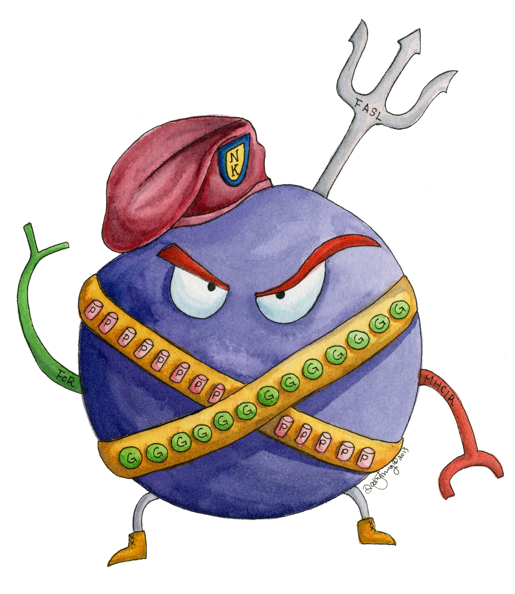

Contained here is another installment of a watered down NRDD review, this time on NK cells for cancer immunotherapy. Again, there has been a good bit of clinical data released, just enough to start speculating about the future of the field. In this post, I will review the companies pioneering NK cell therapy and adjacent modalities such as NK cell engagers.

[Drawing from Daisy Chung!](https://daisychung.com/portfolio/items/immunology-cartoon-cells/)

### NK Cell biology

Natural Killer (NK) cells represent 10-15% of circulating lymphocytes in the body. They are part of the innate immune system, functioning irrespective of antigen specificity. When NK cells encounter a potential target cell and gets activated, a synapse with the target cell is formed, and lytic granules, transported on microtubules, converge towards the synapse. The release of perforins and granzymes kill target cells with high potency. NK cells become activated and exert cytotoxic activity (similar to a CD8+ T cell) based upon a balance of stimulatory and inhibitory receptors on their cell surface that results in either tolerance or response to target cells.

CD16 (aka low affinity IgG Fc region receptor III) can unilaterally activate NK cells and is the most potent activating receptor. When IgG antibodies opsonize onto cells, the Fc regions crosslink with these CD16 molecules, activating antibody-dependent cell-mediated cytotoxicity (ADCC).

Other activating receptors of interest include NKG2D (ligands on human tumor and virally infected cells) and NKG2C (mediates expansion of hyperfunctional adaptive NK cells). NKG2A and the killer immunoglobulin-like receptor (KIR) family bind to class I HLA molecules to mediate tolerance.

Cytokine exposure is key to NK cell activation. IL-2, IL-15, IL-12, and IL-18 are all potent pre-activators of NK cells, though they need to be given in combination. NK cells can also be transduced with membrane bound IL-15 which helps expansion and proliferation in vivo.

### Role of NK Cells in cancer

NK cells are able to kill cancer cells that downregulate MHC-I, a resistance mechanism that allows evasion from CD8+ T cells. NK cells also produce inflammatory cytokines like IFN-gamma and TNF that are cancer antagonistic and also enhance CD8+ T cells. Also secreted are chemokines that recruit T cells to the tumor site. Finally, NK cells exert activity via ADCC. Granzyme and perforin mediated cell killing is inflammatory and releases large amounts of tumor antigen.

NK cells play a central role in the control of metastasis and are key drivers of a 'hot' tumor microenvironment. Infiltration and activity in the TME predicts survival and relapse. And most importantly, robust clinical data packages have demonstrated that NK cells can potently seek out and kill some liquid and solid tumors.

### Companies with Exciting NK Cell Programs

[Affimed (\$AFMD)](https://www.affimed.com/): Affimed is a German biotech developing innate cell engagers (ICEs) using their "Redirected optimized cell killing" (ROCK) platform involving tetravalent bispecific molecules consisting of two scFv dimers that engage NK cells with a target. At its current \$842 M market cap, the company has been active in dealmaking. It signed a deal with Roivant in 2020 for bispecifics, \$60 M upfront, up to \$2 B in royalties, with Roivant getting rights to AFM32 (an ICE with an undisclosed target). They also signed a deal with Genentech in 2018 for \$96 M upfront and up to \$5 B in royalties, progressing with a BCMA bispecific. Owned by Affimed are AFM13, a CD30 ICE, AFM24 for EGFR, and AFM28 for CD123. The company has released exciting clinical data which will be discussed below.

[Innate Pharma](https://www.innate-pharma.com/): Innate Pharma is an older company with a number of assets. It sits at a \$380 M market cap and has a number of assets nearing end of Phase II and going into Phase III. The company has an NK cell engager platform called ANKET in preclinical development. The more advanced programs specifically related to NK cells are: [Monalizumab](https://www.innate-pharma.com/products/monalizumab), an immune checkpoint inhibitor mAb targeting NKG2A receptors, and several NK cell engagers. NKG2A inhibits cytotoxicity through binding of ligand HLA-E, which cancer cells overexpress. Astra Zeneca retains full rights to Monalizumab since 2018, and the antibody is being trialed in combination with various other mAbs in head and neck cancers and other solid tumors. Innate also seems to have two NKp46/CD16 cell engagers partnered with Sanofi and Astra Zeneca. IPH6101, the Sanofi partnered molecule is for targeting CD123, and IPH62, the AZ partnered molecule is going after undisclosed targets (both molecules preclinical).

[Fate Therapeutics \$FATE](https://fatetherapeutics.com/): At a \$5 B market cap, Fate is one of the more controversial cell therapy companies and probably is worth its own post. The platform relies on the company's ability to create NK cells from iPSC. With multiplexed editing enabled by CRISPR, this gives Fate the ability to engineer highly complex products. The comapny has a collaboration with J&J on advancing programs in 4 cancer immunotherapy targets, and has many other programs listed below in preclinical and early stage clinical development

__FT500__ - universal off the shelf iPSC derived NK cell therapy used in combination with checkpoint inhibitors.  
__FT516__ - iPSC derived NK cell therapy with high affinity 158V CD16 receptor. Monotherapy in AML, with CD20 mAb for advanced B-cell lymphoma, with mAbs in solid tumors.  
__FT536__ - iPSC derived CAR-NK for alpha3 domain of MICA and MICB, with high affinity CD16, IL-15 receptor fusion, and CD38 knockout.  
__FT596__ - iPSC CAR-NK targeted towards CD19 with a high affinity CD16 and IL-15 receptor fusion protein. Being studied as monotherapy and plus Rituximab for advanced B-cell lymphoma and in combination with obinutuzumab for CLL  
__FT538__ - iPSC with high affinity CD16, IL-15 receptor fusion, and CD38 knockout used as monotherapy for AML and in combination with CD38 or SLAMF7 mAb for multiple myeloma.  
__FT573__ - iPSC derived CAR-NK for B7H3 with high affinity CD16, IL-15 receptor fusion, and CD38 knockout  
__FT576__ - iPSC derived CAR-NK for BCMA with high affinity CD16, IL-15 receptor fusion, and CD38 knockout

[Immunity Bio \$IBRX](https://immunitybio.com/): Merging with NantKWest in late 2020, Immunity Bio has a \$2.6 B market cap and has a basket of trials for engineered NK cells and an IL-15 superagonist complex in many different indications. Anktiva, the IL-15 superagonist complex has reached late stage clinical testing, while combo treatments with engineered NK cells are just beginning to trickle into Phase I. Their NK related programs include:

__haNK__ - NK cells engineered to express high affinity CD16  
__t-haNK__ - NK cells for targeting PD-L1 expressing cells  
__Anktiva__ - IL-15 superagonist complex  
__m-ceNK__ - memory cytokine enriched NK cell (auto)

[Nkarta \$NKTX](https://www.nkartatx.com/): Nkarta has fell from a roughly \$2 billion dollar company to its current \$538 M market cap in just the past year. Nkarta uses donor derived NK cells and makes many edits including membrane bound IL-15, knockout of CISH to provide resistance to TGFbeta, and a CAR to target activity to relevant antigens (NKX101 for NKG2D ligands on solid tumors and in AML, NKX019 for r/r B cell malignancies). The cells are co-cultured with K562 feeder cells, a cytokine cocktail, and cryopreserved prior to dosing, the whole manufacturing process taking ~2 weeks. Nkarta gained some notoriety for building a 88,000 sq foot manufacturing facility set to open in 2023 while still in Phase I trials. The company also has several co-development programs with CRISPR Therapeutics for CD70 and NK+T combination therapies.

[Celularity \$CELU](https://celularity.com/): The NK cell program is perhaps a small part of the overall story of Celularity, but is worth mentioning because the cell product is derived from placental hematopoietic stem cells and gene modified to express a high affinity CD16. CYNK-001 is in the clinic for MM, AML, and GBM.

[Catamaran Bio](https://catamaranbio.com/): Using a transposon based manufacturing platform, the company is developing optimized CAR architecture for improved cell activation and potency-boosting switches to address the hostile TME. CAT-179 for Her2+ Breast/Gastric cancers has a CAR for Her2, IL-15 membrane expression, and a TME swtich to neutralize TGFbeta engineered into the cell product. CAT-248 for targeting CD70 in Renal cell carcinoma has a CD70 CAR, IL-15 membrane expression, the same TGFbeta switch, and knockout of CD70 in the cell product.

[Artiva](https://www.artivabio.com/): Cord blood, CAR-NK (CD19: AB-202, Her2: AB-201), IL-15 co-expression. AB-101 allo-NK in combo with Rituximab for r/r B-Cell NHL in the third line setting. Partnerships with Merck (clinical development) and Affimed (combination therapy with Affimed's innate cell engagers).

[Wugen](https://wugen.com/): Wugen is a well funded company that come out of stealth in 2021 with \$208 M in funding through Series B to develop off the shelf "memory" NK cell therapies. The company is built off research from Todd Fehniger's lab at WUSTL, which in 2016, showed that their lead candidate WU-NK-101 had a 60% overall response rate in 15 patients with AML. Manufacturing seems to be a major selling point for Wugen, as the company claims to not need feeder cells for expansion, only priming cytokines.

[oNKo-innate](https://www.onko-innate.com/): Gilead/Kite collaboration announced in 2020. The company uses genetic screening to understand NK cell biology and is modality agnostic. Currently discovery stage, the company is based in Australia and led scientifically by CSO Nicholas Huntington.

[Dragonfly Therapeutics](https://www.dragonflytx.com/platform): Developing Tri-specific, NK Cell Engager Therapies (TriNKET). DF1001 is their lead candidate, a HER2 NK cell engager that recently recived Orphan status for esophageal cancer. Dragonfly is also quite active on the licensing front. In August 2020, they out licensed DF6002, an IL-12 Fc-fusion protein to BMS for a \$475 M upfront, milestones, and a 24% royalty on sales. BMS has licensed 5 other drugs since 2017 from Dragonfly including CC-96191 for r/r AML and CC-92328 for r/r MM, as well as some neuro programs. Dragonfly also initiated a collaboration with Abbvie in 2019, which has led to licensing of an undisclosed TriNKET. Merck has also collaborated since 2018 and has licensed two TriNKETs. The company is the brainchild of Tyler Jacks and David Raulet and includes an impressive cast of [researchers on the SAB](https://www.dragonflytx.com/about-us). Dragonfly is led by Bill Haney as CEO, who also is CEO of Skyhawk. Both companies are similarly very aggressive on the partnering front. The origin of Dragonfly is an interesting story as well. Jacks and Haney were college roommates, and Haney was college friends with Tim Disney at Harvard as well. Dragonfly was launched with funding from the Disney family office, without any outside VC funding.

Takeda and Sanofi both have NK cell programs. Takeda has licensed the original CAR-NK product from Katy Rezvani and MD Anderson that was [reported in the NEJM](https://www.nejm.org/doi/full/10.1056/NEJMoa1910607?query=featured_home). Sanofi bought Kiadis in 2020, which had K-NK004, a modified NK cell product with CD38 knocked out for coadministration with CD38 antibodies, K-NK002 for post transplant relapse in AML/MDS, and K-NK003 for r/r AML. The Kiadis programs are also interesting because they have developed beads to replace feeder cells during manufacturing and do not use any genetic engineering.

### Important Clinical Readouts

Key proof of concept [data published in the NEJM](https://www.nejm.org/doi/full/10.1056/NEJMoa1910607?query=featured_home) only came out in 2020. Of the 11 patients treated in the study, 8 had a response within 30 days. However, the cells did not potently expand in vivo, and CRs were only sustained in 1 patient past 12 months, with the remaining patients receiving further treatment.

Fate posted initial data on their FT596 program at ASH 2020 which also caused quite a stir. A heavily pretreated patient (7 prior treatment regimens) with DLBCL responded to a dose of just 30 million cells. Fate also announced results from their FT516 program around this time, with 3 out of 4 evaluable patients showing an objective response, with 2 achieving a CR and no Grade 3 AEs. In August 2021, Fate released more Phase I data from FT596 and FT516. For FT516, while 8/11 patients receiving therapy responded at 3 months, the durability has weakened over time, with just 5 patients maintaining those responses (2 CRs progressed and 1 PR forced to receive additional therapy). FT596 was more promising, with 10/14 patients posting an objective response with 7 CRs. We will see additional data at ASH this year, especially regarding durability.

In November 2021, Affimed posted an update on their Phase 1/2 study of donor NK cells + AFM13 (CD30 ICE) demonstrating responses in 16 of 18 patients with r/r NHL and HL with 7 CRs. Patient's received a median 6 prior lines of therapy, and at the highest dosage given, the objective response rate was 100%. Notably, the infused NK cell product was unedited, demonstrating that perhaps a high affinity CD16 moiety is not required for activity.

In the next several months, we should expect continued readouts from Affimed, Fate, Immunity Bio, Takeda, Sanofi, and Dragonfly.

##### What is the role of NK in a crowded cell therapy landscape?

The key questions are durability and the ability to scale therapies for redosing. In order to take advantage of redosing, allogeneic cells are a must, and there are several approaches (NK92, iPSC, donor derived, cord blood derived) that are being tried, each with their advantages/disadvantages. Cord blood derived NK cells do not require HLA matching and thus can be used universally but are harder to acquire. Unmatched or NK cells that are not engineered against clearance are typically rejected 2-3 weeks after infusion. NK-92 cells are a cell line isolated from a NHL patient that has similar cytotoxic activity as NK cells. Using NK-92 cells as a starting material simplifies the manufacturing process but limits therapeutic activity, as the cells need to be irradiated prior to infusion to prevent uncontrolled proliferation. This hampers persistance and activity. iPSC derived NK cells are difficult to manufacture and by nature quite plastic. It can be hard to understand whether edited iPSCs are really NK cells. Donor derived NK cells can have shorter manufacturing but require donor matching.

From a functional perspective, choosing the right modality for using NK cells in a therapeutic setting is important. For example, while CAR-T enables cytotoxicity and proliferation of T-cells to drive responses, CAR-NK helps with cytotoxicity but doesn't help NK cells proliferate to the same extent as CAR-T cells yet. NK cell engagers may offer the sizable benefits of using NK cells therapeutically without the cost of producing and delivering a cell product to most patients, while some may require the potency of infused cells. Careful comparisons of NK cells redosed or not (price, convenience, tox wise) to other established redosable modalities like ADCs or mAbs should be an area where clinicians have sizable influence. Scalability, consistency, logistics will be key.

NK cells have demonstrated a much improved safety profile compared to T-cells. Because they lack antigen specific receptors, there is no GvHD. There is also minimal cytokine release syndrome due to the decreased release of IL-6 from NK cells compared to T-cells. NK cells can also be redosed, something significantly harder to do with T cells. NK cell therapy is also more amenable to allogeneic approaches, which address potential concerns about efficacy of autologous cell therapy in community versus academic settings, and the potential for logistical and procedural mishaps to adversely affect patients receiving cell therapies.

I think NK will eventually have its place in the cancer immunotherapy toolbox as an important consideration in combination therapy. For example, currently NK can be given after patients are refractory to CAR-T. Giving CAR-T with NK in combination may provide the best of both worlds safety, efficacy, and durability wise. NK cells in theory may be able to debulk tumors without cytotoxicity while the persistance of T-cells can induce durable and long lasting remissions.

Understanding and controlling the toxicities related to combination immunotherapy is clearly the key to progress. As the editing toolbox continues to expand, the NK field can readily borrow from progress in CAR-T. As basic biology continues to get explored, clinical trials will also continue to provide richly informative answers to hypotheses about durability. Approved NK cell therapy by 2025 :).

### Further Reading

[NK cells for cancer immunotherapy. NRDD 2020](https://www.nature.com/articles/s41573-019-0052-1)

[Exploring the NK cell platform for cancer immunotherapy. NRCO 2021](https://www.nature.com/articles/s41571-020-0426-7.pdf?origin=ppub)

[NK Cell-Targeting Strategies Come Into Their Own. OncLive 2021](https://www.onclive.com/view/nk-cell-targeting-strategies-come-into-their-own)
