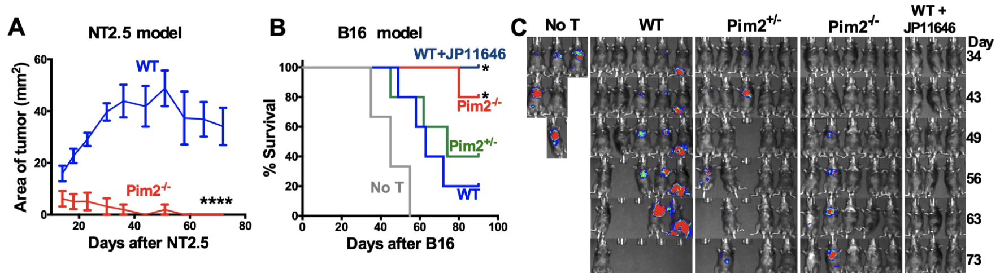

I got really into medicine this year. I wanted to understand where science starts impacting patients and it was clear that the clinic was offering valuable lessons to work backwards from. I also wanted to get smarter about the role scientists have in patients' lives, where the most pressing translational needs are, and how to improve assessment of emerging therapeutic assets. I have general interest in all aspects of oncology, and while AACR, ASCO, and ASGCT earlier in the year were interesting, I find hematology and liquid tumors most fascinating, with the science fastest moving. The American Society for Hematology (ASH) annual meeting held this year from Dec 11-14 (while during finals) were thus a perfect opportunity to soak up information and fully participate in academic medicine.

Twitter was a fantastic resource during the conference while I was stuck at home studying. Post-conference, I discovered that all abstracts were actually [published online](https://ash.confex.com/ash/2021/webprogram/start.html). I had originally intended to compile my favorite studies posted on Twitter, but the opportunity to read for myself was too great to pass up. In total, I've spent the last 2 weeks reading 278 total abstracts including 66 from orals and 212 from posters. Of course there are so many more, but I had to limit myself to cell therapy abstracts. Cells as medicine is an incredible concept and I can never get enough of it.

This post contains several components. First, a rambling list of thoughts that came to me while reading abstracts (jumping off points for further debates and hypotheses to be validated at future meetings). Second, I summarize my favorite abstracts, maybe not the most clinically impactful, but those that I found inspiring and instructive. Third, I summarize some other major results not in the field of cell therapy per se, but import clinically and scientifically. Specifically, I cover gene therapies for hematological disorders, Mosunetuzumab, and comparisons of CD19 CAR-T in DLBCL. Finally, I write quick summaries for ~85% of the abstracts I read. Hoping these will be useful as bookmarks as I revisit this writing next year.

***

## Some major points:
- Cilta-cel is a beast, 19/20 ORR at 9.7 months. Huge for r/r MM patients and vast improvement over ide-cel. AUTO1 continues to show promise in r/r B-NHL and CLL.
- China is leading the charge with combination treatments. CAR-Ts with multiple targets, co-administration of multiple CAR-T products, combination with PD-1 and IL-2, and with transplant have all been tried. The data is still immature, but hoping that combination immunotherapy can be curative and live up to the true potential of cellular medicines.
- iPSC based therapies are maturing quickly. Fate and Century are demonstrating that at low cost/dose (as low as $2000 potentially) with highly multiplexed and flexible engineering, we are getting closer and closer to truly programmable medicine.
- Lots of new cell therapy ideas for AML including new CAR targets (FLT3, CD70, TSLPR, CD33, CLL1, mesothelin, ADGRE2) and new modalities including leukemic cell vaccines and DC/AML peptide vaccines. Picking winners without infrastructure for head to head comparisons will be quite difficult.
- The logistics of CAR-T is killing people. New manufacturing methods (like Precigen and Novartis' <2 day manufacturing) and safety improvements (like prophylactic Anakinra) are helping, but landing 25% of patients in the ICU with CRS or ICANS can't be sustainable. We need better bridging and combination therapy to address rapidly progressing or bulky disease. Median inpatient cost is \$400k and outpatient isn't much better at \$250k.
- Lots of new creative engineering for cell edits, CAR constructs, and antigen targets. Great to see reports from Editas (2780) and Intellia (1711) on multiplexed engineering approaches for allo. Lots of great scRNA-Seq derived results. Great engineering of CAR constructs pays off (see Jim Kochenderfer, Autolus, Arcellx, Seattle Children's abstracts).
- New technologies are a mixed bag. Sana's fusosomes only depleted B-cells in 4/6 macaques, but their Hypoimmune platform looks great. T-charge and Orca-T look fantastic. Placenta CD34+ NK looks like trash. NGS is clearly superior as a method of detecting MRD (2842) and should be SOC once costs are reasonable. Senti's OR/NOT circuit (2799) based CAR-NK looks pretty cool, as does Michel Sadelain's If-Better circuits (2774). Posoleucel (ALVR105) looks pretty decent.
- Treating with CAR-T as salvage is effective. Redosing even with the same target can be active, even better with different targets. I don't think we should ever view CAR-T as one and done, but the manufacturing and logistics has to improve by several orders of magnitude.
- Lots of new effective targets. In particular, CD7 for T-ALL (437), GPRC5D for MM (827), CD22 for B-NHL (741, 469).
- There is some correlative work looking at the microbiome and CAR-T responses. Taking vancomycin improves response and taking iperacillin-tazobactam, imipenem-cilastatin, and meropenem makes your response worse. Hope these can be replicated!

## Some general learnings:
- The most interesting information in NEJM papers is in the supplement. Results from medical literature are generally easy to understand and digging into the supplement is worth the extra effort.
- Responses are fluid. PRs morph into CRs, CRs morph into relapses.
- The structure of a CAR receptor is pretty interesting. This is a [cool review article](https://www.ncbi.nlm.nih.gov/pmc/articles/PMC6330382/).
- MSKCC, Fred Hutch/Seattle Children's, CHOP/CCI @ UPenn, University of Colorado, NCI, MassGen, hospitals in China seem to be cell therapy hubs.

##### Other thoughts:
- How are we ever going to compare all of these new therapeutic options.
- Academic Twitter is alive and well
- Incredibly refreshing to expect CRs in >50% of patients. May we one day see the same for solid tumors.
- \$CELU a massive short, long \$AUTL

### My Favorite Abstracts

1. Project Stella (2788): There is a rare but highly aggressive pediatric AML characterized by a CBFA2T3-GLIS2 (CBF/GLIS) fusion. It is highly refractory to chemotherapy, but through transcriptional profiling, scientists at the Fred Hutch found that FOLR1 is highly expressed. A FOLR1 CAR-T was developed, is active, and is undergoing clinical translation.

2. T-charge (740, 2770, 3864): Novartis has developed a simplified manufacturing process called T-Charge which decreases manufacture time to <2 days and preserves naïve and stem cell memory T cells which is expected to improve persistence. This technology has been used to develop new CD19 (YTB323) and BCMA (PHE885) CAR-Ts with promising early results.

3. Orca-T (98): Using high fidelity cell sorting technologies, [Orca Bio](https://orcabio.com/) has developed the capability of creating ultra purified cell products. Orca-T is a purified donor Treg product to prevent GvHD post HSC transplant. With v/v times of <72 hrs, Orca-T acheives 74% GvHD and relapse free survival compared to 34% in SOC.

4. Benefits of earlier line CAR-T (739): Results from ZUMA-12, a Phase II 1st line Axi-cel in high-risk LBCL study were released. 42 pts enrolled, 40 received therapy, 95% had stage III/IV disease. Estimated OS at 12 months was 91%, 80% CR rate. 85% of patients had Grade ≥3 AEs. CAR-T expansion was greater here than in previous 2+ line trials like ZUMA-1, potentially indicating that cells taken in the early line are more fit.

5. DC/AML vaccine (904, 737, 2830): It is possible to make fusion cells by co-culturing DC and tumor cells in the presence of polyethylene glycol (PEG). DC/tumor fusion cells can be used as vaccines to educate naïve T cells. Authors report initial results from a study of post-HSCT vaccination with DC/AML fusion cell vaccine. 11 pts received a mean fusion vaccine dose of 4.36 x106 cells. 7 pts developed GVHD related to the vaccine, and 10/11 remain in CR at a median of 21 months post transplant.

6. Pim2 (1720): Authors from MUSC demonstrate that targeting the serine/threonine kinase Pim2 improves anti-cancer immunity of T cells using both Pim2 KO mice and also a Pim2 inhibitor (JP11646). Pim2 modulates metabolism and autophagy and is a regulator of differentiation and maintenence of effector T cells.

7. Arcellx (3832): BCMA CAR-T with synthetic binding domain, high response rate in r/r MM (16/16 ORR w/ 12 VGPR+ and 9 CR/sCR. Of those evaluable (n=12), all but one MRD-ve bone marrow at 1 month. Autolus (902, 1710, 3823): further data on AUTO1, a fast-off rate CD19 CAR for r/r B-NHL and CLL are presented. Out of 9 evaluable patients, 8/9 were disease free at last followup (median 6.1 months), with 1 patient dying due to Covid-19.

8. Fate's science (406, 407, 823, 2793, 2795, 1718, 3873): Tons of cool stuff from Fate at ASH this year. Highlights include an engineered CD64/16A fusion protein that facilitates pre-absorption of antibodies for modular and heterogenous targeting. Also, iDuo NK cells that allow dual targeting via a CAR and ADCC through surface hnCD16. Fate also demonstrated multiplex editing capabilities, developing TCR, CAR, and hnCD16 engineered into a single cell, dual CARs, and triple knockout of CD38, B2M and CIITA to prevent rejection. Clinically, they demonstrate redosing and clinical activity in both FT596, their dual CD19 and CD20 iNK for r/r BCL (7/11 CRs), and FT516, their hnCD16 iNK co-administered with Rituximab (8/13 ORR, 5 in remission in r/r BCL)

9. Combination CAR-T (1730, 1754, 1753, 1755): CAR-T will eventually become like any other drug. Redosable, flexibly given, and without the frictions of cost, logistics, and hospitalization inducing toxicity. As such, its nice to see early trials investigating CAR-T in the combination setting, where there may be synergies we don't yet understand.

10. NfL is an early marker for development of ICANS suggesting that risk of developing ICANS reflects pre-existing latent neuroaxonal injury (2841). NfL screening for all?

### Other Amazing Results

I also wanted to highlight some other amazing __gene therapy__ and __bispecific__ results.

1. We may have a cure for pyruvate kinase deficiency (PKD) courtesy of Rocket Pharmaceuticals. Patients with PKD have chronic hemolytic anemia and require frequent transfusions due to a defect in the PKLR gene. [Mitapivat](https://ash.confex.com/ash/2021/webprogram/Paper147711.html) developed by Agios Pharmaceuticals is a small molecule activator of pyruvate kinase R and as the abstract shows, 40% of patients have a hemoglobin response. Rocket Pharma [presented data](https://twitter.com/RobertLKruse/status/1470162660205469697) ([abstract]((https://ash.confex.com/ash/2021/webprogram/Paper148161.html)))from two patients using genetically modified HSCs to restore PKLR function and remarkably restored hemoglobin levels from 7.0-7.5 g/dL to normal 13.5-15.5 g/dL within 3 months. While the data is n=2, it is a powerful preview of the full forthcoming Phase I data.

2. We may also have a functional cure for sickle cell disease. BlueBird Bio's LentiGlobin (lovotibeglogene autotemcel) reported results at ASH and in [NEJM](https://www.nejm.org/doi/full/10.1056/NEJMoa2117175?query=featured_home) showing spectacular reductions in vaso-occlusive events and improvements in markers of hemolysis, which are symptoms of disease. LentiGlobin is an autologous transplantation of hematopoietic stem and progenitor cells transduced with the BB305 lentiviral vector encoding a modified β-globin gene, which produces an antisickling hemoglobin, HbAT87Q. 25 patients with a history of vaso-occlusive events and were treated with LentiGlobin had complete resolution of severe vaso-occlusive events, leading to the spectacular figure below. Sickle cell is a crowded indication space with multiple gene therapy companies working on it. Potential commercial difficulties aside, an amazing update for patients.

3. Also from BlueBird (albeit announced earlier this year at EHA2021) is beti-cel (betibeglogene autotemcel), their gene therapy for transfusion-dependent β-thalassemia. Like LentiGlobin, beti-cel consists of autologous CD34+ hematopoietic stem cells and progenitor cells transduced with the BB305 lentiviral vector, but encoding the β-globin (βA-T87Q) gene. This therapy enabled 91% of the patients, including 6 of 7 patients who were younger than 12 years of age, to become transfusion independent, with an average hemoglobin level of 11.7 g/dL (reference: 13.5 - 17.5 g/dL for men, 12.0 - 15.5 g/dL women) 6 months post infusion.

4. Genentech/Roche have taken the strategy of foregoing major CAR-T development, callling their shot on bispecific T-cell engagers instead. They presented data at ASH21 of Mosunetuzumab, their CD20xCD3 TCE, in FL and achieved an amazing ORR/CR rate of 80%/60% with no ICANS, almost no Grade 3+ CRS, mDOR of 22 months, and mPFS of 18 months. This is in contrast to a historical CR rate in this population of 14%.

### Some comments on Axi-cel, Tisa-cel, and Liso-cel

A couple of interesting studies were published regarding the performance of Axi-cel (Kite/Gilead, retroviral w/ CD28 co-stim CD19 CAR-T) and Tisa-cel (Novartis CD19 CAR-T w/ 4-1BB co-stim) particularly in DLBCL. In [NEJM]((https://www.nejm.org/doi/full/10.1056/NEJMoa2116133?query=featured_home)), the results of ZUMA-7, a comparison of Axi-cel vs SOC in 2nd line DLBCL demonstrated a survival benefit (61% vs 52% at 2 yrs). In contrast, results from the BELINDA Phase III trial of Tisa-cel in the same setting were published at ASH as a [late breaking abstract](https://ash.confex.com/ash/2021/webprogram/Paper155068.html) (later in [NEJM](https://www.nejm.org/doi/full/10.1056/NEJMoa2116596?query=featured_home)) and demonstrated no survival benefit. Meanwhile, liso-cel, BMS/Celgene's CD19 CAR-T with a 4-1BB co-stim demonstrated similar efficacy to Axi-cel in an [oral presentation](https://ash.confex.com/ash/2021/webprogram/Paper147913.html) described below (91.).

So what is driving differences in performance? Some have theorized time to transfusion, as it took 52 days from randomization to infusion for tisa-cel, compared to just 29 for axi-cel. Median time from leukapheresis to product delivery to trial site was 18 days for axi-cel. The extra time to infusion gives tumors more time to progress and exhausts the T-cell product. Bruce Levine also highlights the inferiority of manufacturing using 2% serum in ex vivo expansion media compared to 5% in the Novartis trial. Perhaps most importantly, are the differences in bridging therapy allowed. While chemo based bridging was not allowed in ZUMA-7 (only steroids), chemo based bridging was allowed in BELINDA. This may have led to the inclusion of patients with bulkier chemo sensitive tumors in BELINDA that may have been poorer candidates for CAR-T, while ZUMA-7 may have excluded patients that needed to get chemo based bridging. As the authors in an [accompanying NEJM commentary]((https://www.nejm.org/doi/10.1056/NEJMe2118899#.Ybnh5KuTvLQ.twitter)) article argue,

"...that the ZUMA-7 trial did not allow bridging chemotherapy introduces a considerable enrollment bias against patients with rapidly progressing or bulky disease because the protocol specifically excluded patients with a “requirement for urgent therapy due to tumor mass effects.” The BELINDA trial which did not show benefit of tisa-cel over SOC allowed bridging chemotherapy."

"...not all patients with “relapsed or refractory large B-cell lymphoma” are the same...the presence of bulky or rapidly progressing disease may well be a major barrier to successful outcomes with CAR T cells."

Last point: Aaron Goodman posted a [great poll](https://twitter.com/AaronGoodman33/status/1474072080127709186) on Twitter regarding crossover when a drug is approved in a later line setting and is being moved up to earlier lines. CAR-T is approved for 3rd line DLBCL, so we should really be comparing 2nd line CAR-T to patients with 2nd line SOC and then get 3rd line CAR-T and seeing if survival outcomes there are improved. In ZUMA-7, only 56% of patients in the SOC group received subsequent cellular immunotherapy -- this may be a disservice to both patients and trial design.

***

# Summaries of all cell thearpy oral presentations

### Cellular Immunotherapies: Basic and Translational I

163. CCI @ UPenn: Co-administration with antibiotics like vancomycin improve CAR-T performance via cross priming and enhanced CAR-T expansion. A clinical trial of oral vancomycin in patients receiving CD19-directed CAR T cells for B-cell lymphomas is planned.

164. Tigit is a biomarket of CAR-T dysfunction in patients with NHL. Case Western

165. Data Driven Bioscience. "DLBCL patients whose tumors have molecular features that are predictive of inferior response to standard frontline treatment including the high-risk subgroups (C2/A53) and (C5/MCD) have favorable treatment outcomes with CAR-T cell therapy. In contrast, individual driver mutations including MYC and BCL2, CDKN2A, and KLHL6 are associated with inferior PFS with CAR-T cell therapy, while mutations in BTG2, MYD88, and CD79B are associated with a favorable PFS. In addition, gene expression analysis implicates a potential role for the microenvironment in modulating responses to CAR-T therapy. These findings suggest that predictive biomarkers for response to traditional chemoimmunotherapy and cellular immunotherapy are distinct."

166. CCI @ Upenn. 2 Major phases of CAR-T cell therapy: Initial response phase dominated by CD8+ T cells, then a long term remission phase dominated by CD4+ T cells that are Ki67[Hi].

167. CHOP, CCI @ UPenn. MILR1 and soluble FLT3 are predictors of CRS in pediatric patients receiving CD19 CAR-T.

168. Seattle Children's. high levels of IFNy-IL-18 are associated with poor response and CRS in pediatric patients receiving CD19 CAR-T. This is caused by CD161+IFNy+ T cells which are hyper responsive to IL-18.

### 703. Cellular Immunotherapies: Basic and Translational II

403. Seattle Children's: Optimized a CD22 CAR for pediatric ALL for pts with recurrent disease following CD19 CAR-T. They originally tried one CAR construct but needed to transition to an optimized CAR (which is doing better) due to poor performance. Their findings suggest a shorter linker and hinge as well as incorporation of an CD8 alpha transmembrane region improves performance. Overall, highlights the need for improved preclinical models for CAR evaluation.

404. CHOP: Preclinical investigation of targeting FLT3 leukemias using FLT3i and CAR-T combination therapy. "Earlier-generation FLT3i have been reported to increase cell surface FLT3 expression on FLT3-mutant AML cells. Given the known importance of target antigen site density for CAR T cell efficacy, we reasoned that a sequential approach to dual therapy with FLT3i ‘priming’ followed by FLT3CART may be superior to a simultaneous treatment strategy." Preclinical xenograft models demonstrate efficacy.

405. MassGen: CD70 is a potentially promising antigen to target in AML. Leick and colleagues build upon previous work to develop a CAR for CD70 by building multiple rationally designed CAR constructs and testing them in xenograft models. They concluded that "CD70-targeted CARs comprised of a fusion of truncated CD27 to a CD8 hinge and transmembrane domain have promise in patients with AML, with and without combination with azacitidine."

406. Fate Therapeutics: A CD64/16A fusion protein that facilitates pre-absorption of antibodies was developed and engineered into iPSC NK cells. The idea is for these cells to be armed with mAbs pre-infusion, including various combinations thereof to enable multi-antigen targeting and to address tumor heterogeneity. Antibody directed NK cells mediate ADCC and clear tumor cells in both in-vitro and in-vivo models, albeit with lots of improvement and optimization needing to be done.

407. Fate Therapeutics: iDuo NK cells, which are able to address tumor antigen escape. "iPSC line was clonally engineered to express high-affinity, non-cleavable CD16a (hnCD16), an anti-CD19 CAR optimized for NK cell signaling, and a membrane-bound IL-15/IL-15R fusion (IL-15RF) molecule to enhance NK cell persistence". The idea is that the CD19 CAR kills CD19 expressing cells and co-administration of iDuo cells with Rituximab allows CD20 killing via ADCC, allowing two antigens to be targeted at once.

408. Celyad Oncology: An NKG2D CAR-T product was developed because of the ability of NKG2D to recognize MICA and MICB along with the UL16 binding proteins 1-6 (ULBP1-6) which are frequently over-expressed on AML and myelodysplastic syndrome (MDS) blasts. However, expression of MICA and MICB on T-cells led to fratricide due to self targeting. Co-expression of shRNA targeting MICA and MICB improves clinical activity.

### Cellular Immunotherapies: Basic and Translational III

733. Preferentially Expressed Antigen in Melanoma (PRAME) is a differentially expressed intracellular antigen in AML. TCR mimic (mTCR) antibodies have recently developed as a way of recognizing HLA complexes. Colleges at Fred Hutch built an mTCR CAR targeting PRAME and demonstrated efficacy in pre-clinical models of AML

734. It is hypothesized that normal myeloid cells are required for CAR T activity against myeloid tumors like AML. Colleagues at WUSTL demonstrate using CD33 KOs that targeting myeloid antigens may be intrinsically self-defeating due to loss of myeloid cells that are required for sustained CAR T cell activity.

735. During manufacturing, the CAR density is another optimizable parameter. Colleagues from Spain demonstrate that hi and lo CAR densities impact function. Hi density CAR-Ts have increased cytotoxicity and cytokine production, but increased tonic signaling and exhaustion. Lo density CAR-Ts have increased persistence.

736. Colleagues from University of Colorado have developed a model of low antigen leukemias to study CD8+ CAR effector T cell responses. Impaired expansion and tumor clearance was observed in cells responding to low antigen versus high antigen.

737. A DC/tumor vaccine may be combined with CAR-T cells may be able to increase persistence of CAR-T cells and allow a polyclonal T cell response against tumor antigens in the non-CAR-transduced T cells. From HMS

### Cellular Immunotherapies: Basic and Translational IV

901. TNFR2 may be a knockout target for CD19 CAR-T. TNFR2 plays a role in early activation and apoptosis initiation following CAR stimulation with target cells and knockout of TNFR2 enhances anti-tumor activity. Mayo Clinic

902.  From Autolus Therapeutics, an anti-CD21 CAR has been developed for T-ALL. CD21 positivity is around 60% in primary T-ALL samples. CD21 is a difficult molecule due to its bulkiness but the company was able to design successful binders that is functional in vitro and in vivo.

903. Also from the UK, CCR9 was found to be another differentially expressed target for T-ALL. It was found to be expressed in 74/102 (73%) of primary T-ALL cases with enrichment in relapsed and refractory cases 64% vs 85% vs 86% and greater antigen density on relapsed and refractory cases (1320 vs 1889 vs 2175 antigens/cell). Authors demonstrated potent activity in vitro and in vivo.

904. So apparently you can make fusion cells by co-culturing DC and tumor cells in the presence of polyethylene glycol (PEG). This DC/tumor fusion cells can be used as vaccines to educate naïve T cells. Colleagues at Harvard and Sanofi have demonstrated that these educated T cells in conjunction with a CD123 TCE are active and synergistic in AML in preclinical xenografts.

905. Seattle Children's and bluebird bio have developed a rapamycin inducible CD33 targeted CAR-T for AML.

906. The non-covalent BTK inhibitor Vecabrutinib improves CAR-T activity by downregulating inhibitory receptors and decreases CRS and neurotoxicity.

### Cellular Immunotherapies: Cellular Therapies for Lymphomas

91. Lisocabtagene Maraleucel (liso-cel) is Celgene/BMS's CD-19 CAR-T using a 4-1BB co-stim with an equal target ratio of CD4/CD8 cells. Previously in the TRANSCEND study in pts with r/r LBCL, liso-cel resulted in an ORR of 73%, 53% CR, 2% Grade 3+ CRS, 10% Grade 3+ neurological AEs in the 3rd line setting. TRANSFORM reports liso-cel in the 2nd line setting. Median OS was 16.4 months in the SOC and not reached in the liso-cel arm (CR rate 39% vs 66%). Of the 92 pts in the liso-cel arm, 90 received therapy, with grade 3+ AEs occuring in 85 pts (92%).

92. Colleagues from France performed propensity score matching comparing these two CD19 CAR-Ts and concluded that Axi-cel yielded higher ORR and CRR and significantly prolonged PFS compared with tisa-cel. However, greater efficacy came at the cost of higher neurotoxicity with axi-cel.

93. ZUMA-5 is an ongoing Phase II study of axi-cel in r/r indolent NHL with 2 or more lines of prior therapy. At the first data readout, 148/153 (97%) of patients received an infusion, resulting in 92% ORR, 74% CR. Serious AEs in 50% of pts. Updated at ASH21, the median DOR of 38.6 months and 57% of eligible patients in ongoing response for FL. 50% of eligible patients in ongoing response for MZL, with median DOR not reached.

94. From Tongji Hospital in China, the authors treated patients with and without TP53 mutation with CD19/22 CAR-T cocktail with or without incorporation of ASCT. The authors found that TP53 mutation status had no impact on endpoints while incorporation of ASCT significantly improved outcomes.

95. Lentigen presents a phase 1/2 trial of IL7/IL15-expanded bispecific CD19/20 CAR T-Cells for r/r NHL. The authors compared 8 vs 12 day manufacturing time, finding improved outcomes in 8 day. Results were strong with low ICANS/CRS and high ORR, but will need to be trialed in a larger study.

96. Prophylactic Anakinra (IL-1R inhibitor) reduces CRS and ICANS in CD19 CAR-T in r/r lymphoma. MSK

### Cellular Immunotherapies: Cellular Therapies for Low and High Grade Lymphomas

739. ZUMA-12: Phase II Axi-cel in High-risk LBCL. 42 pts enrolled, 40 received therapy, 95% had stage III/IV disease. Estimated OS at 12 months was 91%, 80% CR rate. 85% of patients had Grade ≥3 AEs. CAR-T expansion was greater here than in previous later line trials like ZUMA-1, potentially indicating that cells taken in the early line are more fit.

740. Novartis has developed a simplified manufacturing process called T-Charge which decreases manufacture time to <2 days and preserves naïve and stem cell memory T cells which is expected to improve persistence. T-Charge was utilized to develop YTB323, a CD19 CAR-T for DLBCL. Out of 8 pts evaluable at the 5-12.5 M cell/kg dose, the CR rate was 75% with similar tox as previous CAR products.

741. Relapse from CD19 CAR-T in LBCL have a median OS of 6 months. This study evaluated a CD22 CAR-T as salvage therapy in 21 pts and demonstrated at a mean followup of 7.3 months, ORR and CR rates of 18/21 (86%) and 14/21 (67%).

742. Grover and colleagues at UNC Chapel Hill developed CD30 CAR-Ts co-expressing CCR4 to help homing to the tumor microenvironment in Hodgkin's Lymphoma. Compared to CD30 CAR-Ts in a previous study, plasma CCL17, a biomarker for disease in HL, was reduced 83%. Out of 8 evaluable pts, 6 CRs and 2 PRs with median PFS and OS not yet reached.

743. Real world evaluation in France of Brexu-cel (Kte-X19) in MCL demonstrated similar outcomes as those observed in clinical trials. 8/55 pts were unable to receive a Brexu-cel infusion due to disease progression, manufacturing failure, or preexisting conditions. Median time between CAR-T order and infusion was 56 days (!). Transfer to ICU was necessary in 27.7% of pts. ORR was 88%, CR rate: 61.9%.

744. Another real world evaluation of Brexu-cel occured in the U.S. with similar results. Out of 107 pts who underwent leukapheresis, 93 (87%) completed an infusion. 68 (73%) of pts would not have met ZUMA-2 criteria, the study that was used to approve Brexu-cel. ORR/CR was 86%/64%, 26% of pts required ICU admission.

### Cellular Immunotherapies: Cellular Therapies for Myeloma

547. Nanjing IASO Biotherapeutics is developing CT103A, a fully human BCMA CAR-T product. In a phase 1/2 study, 71 pts with median 4 lines of prior therapy received CT103A with ORR/CR of 94.4%/50.7%. Pts who previously received BCMA CAR-T were eligible for the trial, and posted a ORR/CR rate of 77%/38.5%. Treatment related AEs were relatively uncommon with grade 3+ CRS at 2.8% and only 1 pt having grade 2 ICANS.

548. bb21217 is a 2nd generation ice-cel that includes PI3K inhibitor durign ex vivo culture to enrich memory-like T cells. In a multicenter 72 pt Phase I trial of r/r MM pts with 3+ lines of prior therapy, bb21217 posted a ORR/CR rate of 69%/28%.

549. Previously a Phase 1b/2 open label trial of the Legend/J&J BCMA CAR-T cilta-cel was published in the Lancet for r/r MM with 3 prior lines of therapy. 113 patients enrolled, 97 patients received an infusion (86%). While there was neutropenia and CRS in almost all patients, the study posted an ORR 97%, 12 month OS 89%, 67% CR rate. Updated results at ASH show that the ORR is now 98%, with 80.4% of patients in sCR.

550. The LocoMMotion is a prospective study of real world clinical practice outcomes in triple-class exposed patients with r/r MM and was designed to act as an external control for CARTITUDE-1. Cilta-cel beat SOC in every category.

551. A trial of BCMA CAR-T co-administered with gamma secretase inhibitor that increases BCMA antigen expression was conducted in r/r MM. Out of 18 pts dosed, ORR/CR was 89%/44%. 7/18 (39%) had prior exposure to BCMA CAR-T.

### Cellular Immunotherapies: Cellular Therapies for ALL

469. Co-administration of CD22 (CART22-65s from Novartis) and humanized CD19 (huCART19) CAR-T is effective in r/r B cell ALL. Of 11 patients evaluable for response, 100% achieved CR and only one pt had molecular recurrence 9 months post infusion.

470. SCRI-CAR19x22v1 is an autologous dual lentivirus transduced CAR-T with both CD19- or CD22-specific CARs, both with 4-1BB co-stimulation. During manufacturing, 42% CD22 only, 33% CD19 and CD22, 3.2% CD19 only CAR-Ts were produced. 91% obtained a CR.

471. HSCT for high risk ALL is curative due to the graft versus leukemia effect but relapse is a major cause of treatment failure. The authors expanded donor derived T cells with autologous DCs loaded with pepmixes encoding tumor antigen and infused these after HSCT up to 4 times. Out of 8 evaluable patients, 6 remain in CR at a median of 46.5 months post infusion.

472. Authors utilized the Sleeping Beauty transposon system as a non-viral engineering system for donor derived CAR-T generation. Out of 26 enrolled, 21 received an infusion. CR was achieved for 13/21 pts and median OS was 9.7 months.

473. CD7 CAR-T in r/r T-ALL is effective (13/14 pts with CR) and safe (1/14 w/ grade 3 CRS, no grade 2+ ICANS). 11/14 patients were bridged to consolidation allo-HSCT at a median of 57 days post CD7CAR infusion, of which 9 are MRD negative.

474. Authors collected outcome data from reinfusion of CD19 CAR-T in r/r B-ALL in children and young adults. Among 63 patients reinfused for relapse prevention (due to signs of therapy not working), 33 had a CR at day 28, 16 remain in remission at a median 39 months post infusion.

### Cellular Immunotherapies: Allogeneic CARs and CARs for T Cell Lymphomas

649. Allogene's ALLO-501A in LBCL uses TALEN gene editing to disrupt the T-cell receptor alpha constant gene (TRAC) and the CD52 gene to reduce the risk of graft-versus-host disease (GvHD) and permit the use of ALLO-647, an anti-CD52 mAb, for selective and transitory lymphodepletion. In this Phase 1/2 trial, out of 20 enrolled pts with median 3 prior lines of therapy, 15 received an infusion and ORR/CR was 50%/50% in 12 evaluable pts. Consolidation dosing during stable disease led to ORR/CR of 66%/66%.

650. Precision Bioscience's allo CD19 CAR-T for r/r B-ALL (PBCAR0191) also posted results. Out of 15 patients, 9 had a CR at 1 month.

651. Allogene's BCMA CAR-T (ALLO-647) for r/r MM posted an ORR of 61.5% with a VGPR+ rate of 38.5%.

652. CD37 CAR-Ts are active against CD37+ hematological malignancies. In four subjects with median 5.5 lines of prior therapy, 3 had a CR, and 2 are alive today 200+ days after CD37 CAR-T infusion.

653. CD5 CAR-Ts in r/r T cell lymphoma posted a 44% response rate in 9 patients with median 5 lines of prior therapy.

### Cellular Immunotherapies: Expanding Targets and Cellular Sources for Immunotherapies

823. Fate presented on FT596, their dual CD19 and CD20 targeted iPSC based NK cell therapy. In a 20 pt Phase I in r/r BCL, no DLTs were observed. In the 90+ M cell dose groups, 7/11 had CRs. Redosing was well tolerated.

824. The study treated 7 children with r/r AML with CLL1 CAR-Ts with either a CD27/28 or 4-1BB co-stim domain. Among these 7 patients, 2/3 in the 4-1BB and 3/4 in the CD27/28 groups responded. Three children remain alive.

825. This study describes Precigen's Prgn-3006 Ultracar-T, which are engineered using non-viral gene delivery to simultaneously express CD33 CAR, membrane bound IL-15 (mbIL15) and kill switch and manufactured in <48 hours. In the lymphodepletion cohort, 3/6 pts posted a response, all of whom are alive 5-10 months post infusion.

826. Eureka Therapeutics is developing ET019003, an anti-CD19 γδ TCR-T cell with a human anti-CD19 antibody and an independent chimeric signaling receptor. Out of 8 pts, 5 had a CR (4 ongoing CR), and 12 month OS was 87.5%.

827. MCARH109 is a first-in-class G Protein Coupled Receptor Class C Group 5 Member D (GPRC5D) targeted CAR T for r/r MM. Of 12 pts treated, they received a median of 8 lines of prior therapy. 10 patients had at least a minimal response (2 CRs) with 9 patients achieving MRD negativity.

# Summaries of interesting cell therapy poster abstracts

1764. ZUMA-1 pivotal study of Axi-cel in LBCL, with over 4 years of follow-up, median OS was 25.8 months, and the 4-year OS rate was 44%.

1746. Reported results from Cellectis' allogeneic UCART22 program. Responses in only 2 out of 9 who received therapy.

1760. Posoleucel (ALVR105) is an off-the-shelf, multivirus-specific (CMV, EBV, HHV-6, AdV, BKV, and JCV) T-Cell therapy for the prevention of viral infections post-HCT developed by AlloVir. After allo-HST, up to 90% of pts develop viremia with 40-50% developing significant viral infections within 200 days of transplant. None of the 12 pts receiving Posoleucel developed a clinically relevant infection within 14 weeks, and one developed an infection during an additional 12 week followup.

Several abstracts from Soochow University in China: 1730, 1754, 1753, 1755 have interesting findings. Coadministration of CD19 and CD22 CAR-Ts in combination with PD-1 inhibitor in r/r NHL resulted in responses in 9/11 pts and PFS/OS rates at 6 months of 80.8% and 100%. Decitabine, a DNA methyltransferase inhibitor, which has been demonstrated to reverse exhaustion-associated DNA-methylation programs and promote the rejuvenation of CAR-T cells and enhance anti-leukemic effect of CAR-T cells in vitro demonstrated slightly improved OS, LFS, and CR rates in B-ALL. Finally, co-administration of CD19 and CD22 targeted CAR-Ts is an improvement over each separately or one after the other, especially when followed by HSCT in B-ALL.

2799. An update on Senti's SENTI-202 (FLT3 OR CD33 NOT EMCN) CAR-NK program for AML. A bivalent CD33/FLT3 CAR achieved >80% cytotoxicity in vitro. The NOT portion was able to protect up to 67% of FLT3+ EMCN+ cells.

2800. CD229 may be a new CAR-T target for relapsed BCL due to reduced trogocytosis of CD19 and fratricide.

2801. RORγt overexpression can enhance the ability of CAR T cells to persist and self-renew, and prevent terminal exhaustion and may be a new editing target for CAR-T.

2793. Fate demonstrated that a TCR, CAR, and high-affinity+non-cleavable CD16 can be engineered into iPSC induced T cells. This allows CAR, TCR, and ADCC mediated killing in a T-cell and they demonstrated activity both in vitro and in vivo.

2795. Another example of Fate's multiplexed iPSC engineering are triple-gene knockout of CD38, B2M (prevent CD8 rejection), and CIITA (prevent CD4 rejection) in NK cells. Co-administration with a CD38-targeting mAb they showed is an effective strategy to avoid host immune rejection.

2771. Century Therapeutics developed a method to manufacture and engineer γδ CAR-T cells from iPSCs.

2780. From Editas Medicine, deletion of CISH (negative regulator of IL-2/IL-15 signaling) and TGFβR2 (to resist TGFβ mediated suppression) in iPSC derived NKs using CRISPR-Cas12a results in 3 fold reduction in tumor burden in vivo compared to non-edited NKs.

2770. Novartis presented its new BCMA CAR-T product, PHE885, which is manufactured using T-Charge and has an optimized CAR receptor composed of a fully human anti-BCMA scFv fused to 4-1BB/CD3ζ signaling domains. They reject tumors at a dose of 5 fold lower than traditionally manufactured CAR-Ts.

3864. In a Phase I trial of PHE885, 6 penta-refractory pts received infusions, all of them with PR, VGPR in 2 pts, CR in 1 pt at 1 month. At 3 months, 2 CRs, 1 PR, and 1 PD.

2769. Sana presented preliminary data from their CD8a targeted fusosome program for CD20+ depletion. The paramyxovirus-based vector fuses with target cell membranes and transduces CD8a+ cells with a CD20 CAR. In macaques, B cell reduction was observed in 4/6 animals infused with the fusosome after 7-10 days.

2779. Placental CD34+ cells are being investigated by Celularity as a source of allogeneic NK cells for cancer immunotherapy. In this abstract, the authors report 29.2% transduction of placental cells with retrovirus at the end of 35 day culture. Their CD19 CAR-NK improved survival (39 days vs 28 days) compared to vehicle in a xenograft lymphoma model.

2773. Celularity also reported engineering in a high IgG binding affinity and proteinase cleavage resistant CD16 variant (CD16VP) into their NK cell product for ADCC mediated cell killing. CYNK-101 in combination with daratumumab improved survival from 28 to 35 days in a lymphoma xenograft model.

2775. More evidence of PD-1 blockade improves CTL killing in AML. Authors demonstrated Pembrolizumab in combination with CTL adoptive cell therapy decreased disease burden both in vitro and in vivo.

2774. From Michel Sadelain's group, "If-Better" CAR-Ts to address phenotypic heterogeneity in AML are described. In the study, an ADGRE2 CAR was combined with a CLEC12A-targeting chimeric costimulatory receptor (CCR). High ADGRE2 triggers killing independently, while low ADGRE2+high CLEC12A cells are also killed while sparing ADGRE2-low/CLEC12A-negative normal cells. In vivo experiments demonstrated durable remissions in xenograft models.

2772. Wugen describes WU-CART-007, an allogeneic CD7 CAR-T for T-ALL and LBL. WU-CART-007 is manufactured from donor T cells by knocking out TRAC and CD7 to prevent fratricide. In vivo studies demonstrate CD7+ cell clearance and inhibition of tumor progression.

2789. Colleagues at the Fred Hutch report TSLPR as a CAR-T target in AML.

2788. There is a rare but highly aggressive pediatric AML characterized by a CBFA2T3-GLIS2 (CBF/GLIS) fusion. It is highly refractory to chemotherapy, but FOLR1 is highly expressed. Colleagues at the Fred Hutch demonstrate activity of FOLR1 CAR-T in vivo. Clinical translation is underway under codename: Project Stella.  

1694. Precigen also announced Prgn-3007, a ROR1 Ultracar-T with mbIL-15, kill switch, ROR1 CAR, and intrinsic blockade of PD-1 expression. Manufacturing is non-viral and is completed overnight. This abstract publishes data demonstrating superiority of Ultracar-T versus control ROR1 CAR-T in a MCL xenograft model.

1700. Legend developed a tri-specific CD19xCD20xCD22 CAR-T for heterogenous B-cell tumors with enhanced expansion and prolonged persistence in a xenograft model.

1702. AMV564 is a CD33/CD3 TCE that depletes MDSCs for applications in AML. Initial human data was published in a Phase I, and the drug is being developed by Amphivena Therapeutics.

1703. Saar Gill's group at UPenn have developed FLT3 CAR-Ts for AML.

1704. HA-2 is an HLA-A*02:01- and haematopoietically-restricted minor histocompatibility antigen derived from the class I myosin protein, MYO1G. Patients receiving donor lymphocyte infusion from HA-2-mismatched donors who develop HA-2-specific T cells show a graft vs leukemia response and often experience long-term remission, making HA-2 an ideal candidate for TCR-engineered T cell immunotherapy of liquid tumors. TScan utilized their ReceptorScan platform to discover 1,302 HA-2-specific TCRs by screening 237 million naïve CD8+ T cells from 5 healthy HA-2-negative donors. These TCRs were evaluated for affinity and surface expression using their DexScan platform, and screened for off-target reactivity using their TargetScan platform. TSC-101 is being advanced for IND-enabling studies to prepare for first in human testing in 2022.

1693. Dan Kaufman's group at UCSD reported development of iPSC derived macrophages expressing CARs for cancer immunotherapy. In vivo results aren't inspiring yet. The group also reported in 1692 the combination of iPSC derived macrophages and NK cells demonstrating improved activity than either alone in vitro against leukemia blasts.

1691. Catamaran Bio reports engineering of their CD70 CAR-NK. Using the non-viral TcBuster™ Transposon System to deliver transposons containing a CD70 CAR and an IL15 expression cassette while simultaneously knocking out CD70 by CRISPR/Cas9 in primary human peripheral blood NK cells, they achieved >70% CAR integration/expression and >80% knockout of CD70.

1690. Sana describes their Hypoimmune allo CAR-T strategy and demonstrates activity in mice and evades immune recognition. The technology is isolated CD47 overexpression, with deletion of b2m, CIITA, and TCR.

1729. Century Tx describes CNTY-101, a multi-engineered CD19 CAR-NK where ß2M is disrupted by insertion of a transgene encoding the HLA-E protein tethered with ß2M and a peptide, CIITA is disrupted with an EGFR safety switch and IL-15.

1706. An AML cell vaccine was engineered by harvesting leukemic cells and lentivirally engineering them to express CD80, IL-15, and IL-15Ralpha. The advantage here is that it is agnostic to which AML proteins are immunogenic for each patient.

1707. Colleagues at Novartis performed scRNA-seq to characterize BCMA CAR-Ts with good or bad engraftment. One interesting finding characterizing cells that engrafted is overexpression of the RXF5/RFXAP/RFXANK transcriptional activator complex.

1710. From Autolus, they developed a highly sensitive CD22 CAR binder that can differentiate cells expressing less than 255 CD22 molecules on the cell surface. Co-transduction with a CD19 binder improves outcomes in mice models.

1711. Intellia describes their own 'off the shelf' approach. Using CRISPR/Cas9, they knockout HLA class I and class II expression, the TRAC and TRBC loci to KO the TCR, and replace the TCR with a CAR.

1712. From Quy Le's group at the Fred Hutch, they demonstrate that the validated mesothelin target for AML can be addressed with a CAR-NK which shows efficacy in a mouse model.

1713. This abstract describes Aleta Bio's CAR-T engager Aleta-001. The rationale is that while CAR-T response rates are high, 50% of responders relapse. The engager protein binds CD20 on tumor cells and presents CD19 to enable CAR-T activation on CD19- cells. The protein also binds albumin to enable long half-life.

1714. Duvelisib inhibits PI3K δ/γ and preferentially expands CD8+ T cells. CLL is a tumor that is inherently immunosuppressive, such that CLL patients are significantly deficient CD8+ T cells. Duvelisib may thus be used as an epigenetic reprogrammer for CLL CAR-T therapies.

1717. Nanobodies are small VHH fragments of antibodies that can be used as binders. This abstract describes the development and evaluation of a CD72 nanobody binder. Even with low affinity, fast off, and slow on rates, their NbD4 binder cleared tumors and prevented relapse on re-challenge.

1718. From Fate, they report development of a CAR-T co-targeting BCMA and MICA/B.

1720. Authors from MUSC demonstrate that targeting the serine/threonine kinase Pim2 improves anti-cancer immunity of T cells using both Pim2 KO mice and also a Pim2 inhibitor (JP11646). Pim2 modulates metabolism and autophagy and is a regulator of differentiation and maintenence of effector T cells.

1722. From Gracell Biotechnologies, an allogeneic CD19/CD7 CAR-T (GC502) that enables anti-tumor targeting via CD19 and suppression of HvG via CD7 targeting.

1723. The authors show that pharmacologic blockade or KO of IFNγ reduces IFNγ signaling without compromising T cell phenotype or effector function. Blocking IFNγ could simultaneously mitigate cytokine-related toxicities while enhancing T cell proliferation and persistence via reduced expression of immune checkpoint proteins.

1725. From ONK Therapeutics, they report using the Tc buster transposon non-viral transduction method with simultaneous CRISPR/Cas9 KO of CISH to engineer CLL-1 CAR-NKs for AML.

2833. Authors used machine learning to identify correlates of CRS and ICANS for Axi-cel in LBCL. Most significantly, they found T-cell viability (product cell fitness) and conditioning-related elevation of factors (IL-15 and CCL2) most influence toxicities.

2834. Adicet reports a Phase I trial design for their allogeneic anti-CD20 γδ CAR-T (ADI-001). The goals are to evaluate dosing and combination with IL-2.

2838. Rapa Therapeutics is developing temsirolimus to inhibit mTOR during ex vivo manufacturing of adoptive cell therapies. RAPA-201 are autologous polyclonal T cells manufactured with temsirolimus with enhanced Th1/Tc1 polarity, reduced immune checkpoints, and improved response to the key homeostatic cytokines IL-7 and IL-15. In a 6 pt trial, RAPA-201 was administered every 35 days, achieving responses in 4 pts and very little toxicity.

2840. 2 year follow up of liso-cel in r/r LBCL showed median OS of 27.3 months (50.5% at 2 yrs), median PFS of 6.8 months (40.6% at 2 yrs), median DOR 23.1 months (49.5% at 2 yrs). ORR/CR rates of 73%/53%.

2842. The authors demonstrate that NGS is more sensitive than flow cytometry for classifying MRD status and that improved sensitivity may be useful for recommending patients for HSCT, resulting in improved survival results.

2841. The authors find that NfL is an early marker for development of ICANS during a CAR-T response, suggesting that risk of developing ICANS reflects pre-existing latent neuroaxonal injury.

2844. Temferon is a macropahge cell therapy for GBM where macrophages expressing Tie2 deliver IFN-alpha to the GBM microenvironment. In this Phase I/II study, out of 15 patients dosed, 6 died and 9 had progressive disease.

2845. The authors conducted a study to investigate CD20 CAR-T in rituximab R/R CD20(+) B-NHL patients. Out of 15 pts dosed, ORR/PR/CR at 30 days was 100%/73%/27%. 5 pts converted from PR to CR and 6 pts relapsed at longer followups.

2811. CNCT19 is an autologous CD19 CAR-T developed by Juventas Cell Therapy in China. Out of 63 pts dosed, grade 3+ CRS/ICANS occurred in 19% and 20.6% respectively. CR/CRi and MRD rates were 93.7% and 88.9%. RFS and OS at 12 months were 51.7% and 74.1% respectively, with improved results in children over adults.

2812. The authors reported usage of anakinra, an IL-1R antagonist, to manage CRS in cilta-cel for MM. Most CRS events are successfully managed by tocilizumab +/- dexamethosone, but anakinra can be considered with persistent CRS despite toci usage.

2814. NKTR-255 is PEG modified recombinant human IL-15R agonist that enhances CD8+ T-cells and exapnds NK cells. In 6 patients who progressed from CAR-T/CAR-NK in r/r NHL or MM, NKTR-255 was administered to assess T-cell expansion. In all pts, the total CD8+ cell fraction was expanded and in 3 pts, there was an increase in CAR-T cells.

2816. The authors find that early administration of high-dose anakinra (8mg/kg/day IV or SC) was associated with rapid resolution of CRS/ICANS symptoms after use of tocilizumab and/or corticosteroids, with a manageable toxicity profile, and with a non-relapse mortality rate at day 30 of 0%. In contrast, 38% of patients treated with low-dose anakinra died from infections.

2819. Results from 5 pts who received allo NKTs with a CD19 CAR, IL-15, and shRNA targeted b2m and CD74. Out of the 4 NHL pts with DLBCL, 3 had PRs, 1 turning into a CR, and the 1 ALL pt had a CR. Minimal toxicities were observed.

2823. Authors conducted a cost-effectiveness study, finding that median inpatient cost was $397,610 ($346,550-$650,749) and median outpatient group cost was $243,050 ($204,344-$408,467).

2829. CD30 CAR-Ts are active and well tolerated in pediatric patients even following anti-CD30 ADC.

2830. Authors report initial results from a study of post-HSCT vaccination with DC/AML fusion cell vaccine. 11 pts received a mean fusion vaccine dose of 4.36 x106 cells. 7 pts developed GVHD related to the vaccine, and 10/11 remain in CR at a median of 21 months post transplant.

2828. Authors infused 23 BMT recipients with r/r (n=11) and/or high-risk (n=12) AML (n=20) and ALL (n=3) post-transplant with donor derived T cells targeting tumor associated antigens WT1, PRAME and survivin. 1 yr OS was 36% and 89% respectively in the two groups.

3880. Allogeneic HCT as consolidation post-CAR-T during CR had transplant related mortality of 9%, lowered the rate of relapse (HR:0.37), but was not associated with an improvement in mortality (HR: 0.75).

3878. The ALPHA study is a Phase I study of Allogene's CD19 CAR-T with TRAC and CD52 KO (ALLO-501) with ALLO-647, a CD52 mAb for transitory lymphodepletion. Out of 18 FL and 11 LBCL pts at 6 months, CR rates were 27.8% and 36.4% respectively.

3873. Authors from Fate present a Phase I study of FT516 (hnCD16 Fc receptor) w/ Rituximab for r/r BCL. Out of 13 pts, 10 received the planned 6 doses of FT516. Out of 8 responders, 5 are in remission between 4.6-9.5 months.

3872. MB-106 is a fully human CD20 CAR-T with both 4-1BB and CD28 co-stim domains and in this abstract, the results of treatment in r/r B-NHL and CLL are presented.

3866. In a longer followup of cilta-cel from CARTITUDE-2, ORR remained at 19/20 pts, with 1 VGPR, 1 CR, and 17 sCR.

3868. Nkarta unveils study design for a Phase I trial of NKX019, a cryopreserved CD19 CAR-NK with mbIL-15.

3865. Letetresgene Autoleucel (lete-cel; GSK3377794) is a NY-ESO-1/LAGE-1a+ targeted TCR product for r/r MM. 6 pts were divided into Arm 1: lete-cel alone or Arm 2: lete-cel + pembro. Arm 1 had ORR of 33.3% (1 CR, 2 SD), arm 2 had ORR of 66.7% (1 VGPR, 1 PR, 1 SD).

3858. Poseida Therapeutics presented data from their BCMA CAR-Ts (P-BCMA-101 and P-BCMA-ALLO1) manufactured using piggyBac transposon. ORR with rituximab or lenalidomide are 73% and 71% respectively.

3854. Gamida Cell reports 2 yr survival from their allogeneic NK product GDA-201 in r/r NHL with low-dose IL-2 and Rituximab. GDA-201 is manufactured from CD3 depleted mononuclear cells, culturing with NAM and IL-15, resulting increased expression of CD62L. Among 19 pts evaluable, OS at 2 yrs was 78%.

3849. Authors found that T-cells previously exposed to ibrutinib had increased expansion of KTE-X19 (brexu-cel) and potentially increased effector function.

3848. A CMV TCR-T cell therapy was trialed in allo-HSCT patients with refractory CMV viremia or viral disease. Out of 6 evaluable patients, all 6 achieved complete response (CMV DNA-negative plasma).

3847. Investigators report strong activity of CD30 CAR-T in classical Hodgkin Lymphoma (cHL), with 4 CRs, 1 PR out of 5 evaluable pts at 42 days post infusion.

3845. Investigators report quality of life differences between liso-cel and SOC from the Phase III Transform study.

3843. Investigators from China report preliminary results from a Phase 1b trial in r/r DLBCL of CD19 CAR-Ts that express IL-7 and CCL19 in combination with PD-1 antibody. At 3 months post-infusion, 4 CRs, 1 PR out of 7 evaluable pts.

3833. Authors conducted a dual-center on-site manufacturing trial of CD19 CAR-Ts with TNFRS19 transmembrane domain for r/r BCL using the CliniMACS Prodigy which enabled median v/v time of 13 days. Out of 31 pts, 25 (81%) responded with 22 (71%) in CR. 94% of patients in CR had sustained remission at 12 months.

3832. From Arcellx, they report results from a Phase I study of their BCMA CAR-T with synthetic binding domain instead of scFv (CART-Ddbcma) for r/r MM. Out of 16 evaluable pts, ORR is 100% w/ 12 VGPR+ and 9 with CR/sCR. Of those evaluable (n=12), all subjects, but one, have achieved MRD-negative bone marrow responses at 1 month.

3823. From Autolus, further data on AUTO1, a fast-off rate CD19 CAR for r/r B-NHL and CLL are presented. Out of 9 evaluable patients, 8/9 were disease free at last followup (median 6.1 months), with 1 patient dying due to Covid-19.

3837. From Jim Kochenderfer's group at the NCI, they developed a BCMA CAR with a fully human heavy chain variable domain (FHVH33) that lacks the light chain, artifical linker, and 2 linked-associated junctions of a scFv to reduce size and immunogenicity. r/r MM patients with median 6 prior lines had 23/25 ORR, 17 w/ VGPR+. Median PFS of 78 weeks, 13 pts have ongoing responses.

98. Orca Bio presented results for Orca-T, a stem and immune cell product using highly purified donor Tregs to control alloreactive immune responses to prevent GvHD. Orca-T significantly improved GvHD and relapse free survival compared to SOC.

253. Taking anaerobe-targeting antibiotics used in the setting of neutropenic fever: piperacillin-tazobactam, imipenem-cilastatin, and meropenem (PIM) is associated with worse outcomes in CD19 CAR-T.

##### Done!!!
