I saw a couple of really heartwarming annual letters on Twitter, including those from [Jack Raines](https://twitter.com/Jack_Raines/status/1475279358059294721) and [Pete Huang](https://twitter.com/nonmayorpete/status/1475270794108227587). There is something about the act of looking backwards and learning from within that is quite beautiful to me. Its raw. Its genuine, and its what makes us all unique. In theory, there is no one you know better than yourself, yet every time I think back upon what I did or look through old photos, I can't help but feel suprised about where I was, what I was feeling, and how I viewed the world. Understanding and coming to terms with our experience in the world and interactions with those around us I think is a somewhat unique aspect of the modern world, where so much of our activities can be documented by photos, texts, and videos. Suffice to say, reviewing my year has been quite surreal, and while at no point did the year feel spectacular, now as the last few days trickle away, I can very clearly say that this has been one of the best years of my life.

This post is a month by month highlight reel of my experiences as a 21 year old college student living in Baltimore and through the ups and downs of Covid-19 (albeit minus some personal details). I wish I could tell you more, let you experience more of my life, but I can't remember everything. At the bottom is a year in review letter to myself and my friends. If we're not friends yet, I like expressing myself in writing and I would love for you to say hi and tell me about how your year has gone. It makes me very happy to hear about people's lives from their own writing and reflection. Cheers to a great 2022, its going to be a good one.

_Side note: every year, Tim Ferriss wants us to do a ['past year in review'](https://tim.blog/2021/12/27/past-year-review/), so this may include elements from there as well._

#### January

Where to begin. I think myself and most of us went into the year with a lot of hope. A more sensible U.S. president, vaccine distribution beginning to come online, and just generally an expectation that we'd see some reversion to the mean after a disastrous 2020. There was no way 2021 could be worse.

My year started quietly, if not a little sad. Seasonal depression + a year of not seeing my friends + the idea that I would be starting my adulthood at home in lockdown did not inspire a lot of joy. I remember feeling quite lonely, but I quickly turned to journaling and watching old Wong Fu favorites as a way to pass the time and process some emotions. It was a reactive time; early on we had the Jan 6th capitol riots, Joe Biden's nearing inauguration, and the Georgia elections that enabled Democratic control over the senate. An early highlight was an Advances in Immunoengineering Workshop series that invited speakers to lecture about the intersection of immunology and bioengineering. The beginning of January was a lot of information and feelings to process and I was concurrently bored and lethargic.

As I began to settle into the new year however, I began to string together little wins. One thing I appreciated this year is that momentum is real. A daily meditation habit kept me focused enough and gave me the clarity afterwards to be proactive. I read a lot, including the Great American Drug Deal by Peter Kolchinsky, Shoe Dog by Phil Knight, and The Antidote by Berry Werth. All these books were fantastic, but Shoe Dog especially was a big source of inspiration and led me to buy more books. I also bought dumbbells and a kettlebell and started working out with a paid subscription to the Fitbod app. One of the things this year that I'm proud of is realizing that money should be used as a tool, not simply saved unnecessarily. As long as you can trust yourself to filter properly, it is almost always favorable to buy now rather than later.

I attended and set up several other fun virtual events, like reaching out and chatting with Alexey Guzey and attending cool talks by Endpoints (Beyond AAV 1.0) and Axial (Omar Ali on his company Immulus). I wrote a blog post from Alexey's prompting called "Meta Science Thoughts" where I explained some of the ways that I thought science could be improved. I dipped my toes back into biotech/pharma investing, kicking off what has become an obsession and area of major growth for me this year. I restarted my research, starting an independent project for the first time where I led from start to end, while continuing to work part time for Capsulomics.

I enjoyed a lot of Rex Orange County, especially recordings of live concerts. Ohh the rush of the crowd! I got my first vaccine dose in mid-January, went back to school in person to visit my friends a few times and started going back to stores in person. I was extremely excited to have my favorite Costco softserve.

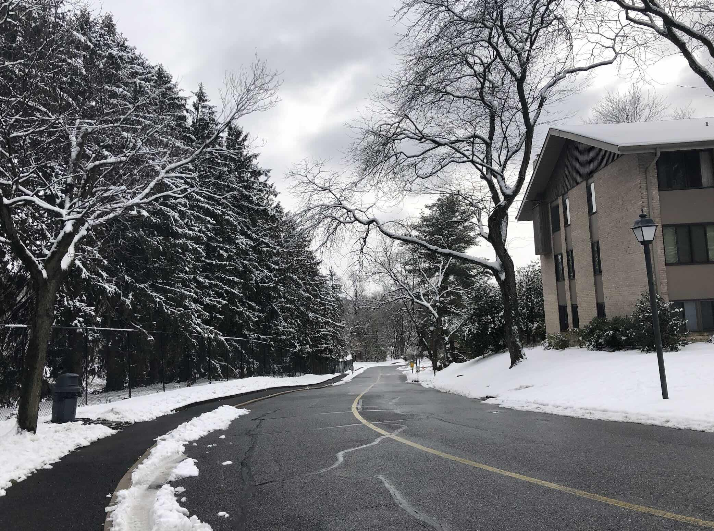

#### February

In February, school kicked off and with it, it felt like the year truly started. Suddenly, I was busy. While taking a somewhat lighter courseload, I balanced working at Capsulomics, doing my research work, TAing two classes, and running my design team. I got to onboard 3 amazing freshmen onto my design team, making the whole project come to life. We were finally able to shadow our clinical sponsor and see procedures to understand the clinical problem we were tackling. Again, I credit my daily meditation practice as helping me stay on track.

One of the most impactful things I did was look at Recursion Pharmaceuticals and publish some writing about what I thought about their business prospects and technology. I was incredibly proud of that piece because not only did I spend a lot of time thinking and reading about the business, it was also not my original take on the company. Back in the summer of 2020, I was a massive AI drug discovery bull, and the more sober view I took on the field in my piece I saw as an example of intellectual maturation. The piece ended up as by far my most popular post and attracted many visitors to this site and several warm email interactions. The power of the internet!

Another highlight of February was the vibrancy of the early biotech Clubhouse community. In particular, the Life Science Week in Review hosted by Josh Elkington was a fun way to end the day on Friday. Random other sessions throughout the week made home workouts and walks at night entertaining and educational.

Of course, reading was another highlight. I finished Atomic Habits (meh), Hood: Trailblazer of the Genomic Age (great!), and Her-2: The Making of Herceptin (also great!).

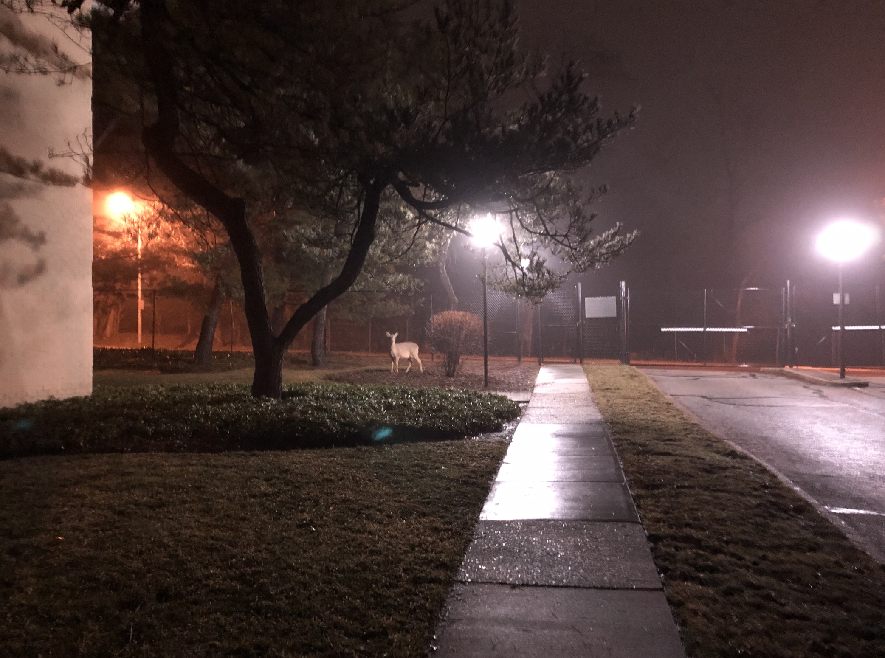

#### March

March I remember for being a productive month of school, and also the month when I started seriously reading journal articles. I bookmarked all the major journals in the fields I am interested in and developed the habit of clicking and OneTab-ing interesting articles to read later. By doing so, I drastically increased the volume of reading that I was doing each week and exposed myself to tons of new science. Getting the reps of reading papers, understanding figures, digesting results, and integrating the intro and discussion sections into my mental model of science has been quite fruitful. Being familiar with cutting edge science has also helped frame my own perspective on which questions are interesting to answer and what new science might look like in the future.

I continued my crusade against hype in science by writing a "Misaligned Incentives in Bio VC" piece in which I argued that the quick path to IPO and pumping of private company science before clinical validation is harming patients in the long run. I also reflected on the shootings in Atlanta, thinking about what it meant to be an Asian American and writing down a few thoughts. I think one of the striking things about Atlanta was how relatable it was. I saw my own grandparents when I read about the victims.

Another highlight of my March was coming into my own as a leader and operator running my design team. March was the month where we finished our minimum viable product and iterated on it with our clinical sponsors. I felt immense relief, as we had finally delivered a product that could potentially have value in a clinical setting. As a leader, I think I learned how to motivate people, how to get people to work together, and how to provide 'fire' for the team (setting up calls, emailing people, and generally whatever else I could do to push the project forward). I remember stressing about design history files, desk reviews, and scheduling for committee meetings. I hated our faculty sponsor. So it goes.

Finally, March was when my family and I finally felt comfortable going back out to restaurants and stores. Shoutout to Red Pepper. I also finished reading Bottle of Lies by Katherine Egan, an amazing book about the generic drug industry.

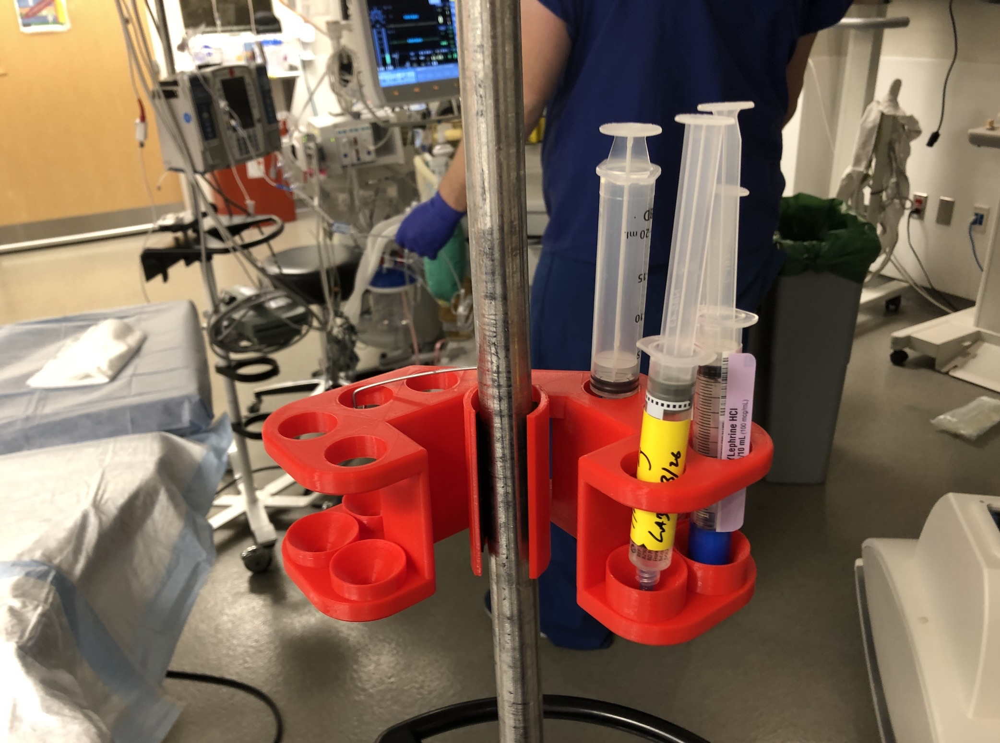

#### April

April this year was a month of planning. Believe it or not, the end of school was in sight (I had no finals), and summer activities need to be laid out. I earned my first legitimate 4.0 semester. The classes I took, Seminar in Epigenetics, Foundations of Computational Biology and Bioinformatics, Nucleic Acid Sequencing, Cell and Tissue Engineering Lab, Biomedical Design Team, and Research for Credit were all quite easy. I enjoyed bioinformatics the most because of the friends I had in the class. The Nucleic Acid Sequencing class taught some pretty cool content, but the format of the class was quite dry.

Our design team did some last bonding before school ended and folks went home. During April, we developed new collaborations and research paths for the summer, and were named JHU BPC finalists. Our star freshman also made these incredibly cute miniature versions of our product that he made into keychains. I also made solid research progress in preparation for full time work in the summer. A research proposal I wrote won the Summer PURA award.

On the professional side, I came across a cool opportunity through a MedHacks connection to join Compound for the summer as a research intern. This was my second VC internship, and at a more generalist fund I was very excited to get to know the East Coast side of the venture ecosystem. I published pieces on CAR-T and the future of cancer therapy. I think I began shifting my writing to more content based pieces as an excuse to do deep dives on areas of interest. Anyways, these were fun pieces to write because it allowed me to speculate and think about what kind of problems I wanted to work on during my PhD.

Speaking of, I spent a lot of time in April thinking about the different programs I wanted to apply to and different PIs I might want to work with. I attended some cool talks from Don Ingber, David Mooney, and Carl June and also took some time to find and watch lectures from cool scientists on YouTube. From this 'research' I began my organizing spreadsheet for graduate school application season.

Lastly, I restarted running almost daily at my favorite park in Baltimore, Lake Roland. I had a routine of going every day around 9-10 AM and there was always a cute dog being walked that I would say hi to.

 

#### May

May was a transition month. A month of saying goodbyes and hellos. Our design caught up and said goodbye to our TA Ignacio who we love dearly. Senior sendoff for the BME department was over Zoom and was honestly incredibly cringey. I won a TAing award which I am immensely proud of, so I attended the 2021 send off. I'm hoping so hard that ours is in person. Several of my classmates graduated and moved on to new jobs or took some time to prepare for med school. The transition to summer was quite anti-climactic for me given that I was just at home the whole time. I remember feeling annoyed that we didn't move in earlier and we lost out on an in person semester where most people were on campus.

May was a tremendous month for science and I reflected on this in a piece "Fantastic Papers and Where to Find Them". I attended a great talk by James Dahlman and learned to really respect him as a scientist and person for how supportive he is of his students. He serves as a role model and an archetype for the type of PI I would want to work with in the future.

I started my work with Compound, learning all about DNA synthesis, presenting my work at weekly "Compound Bio Hours", and getting to meet with founders starting with the Valence Discovery team. D.A. Wallach randomly reached out to me from my website. Incredibly gratifying to have your work read by someone who clearly has a lot of interesting things to do with their time. Finally, I got to resume research and return to working with everyone in the Green Lab. I remember being so happy to reconnect with my mentor after 1.5 years away from the bench.

The reading grind continued. In May, I read Admissions by Henry Marsh and Lifespan by David Sinclair. Admissions was a perspective changing book that really helped me understand the motivations and less glorified parts of being a surgeon. Lifespan was an interesting book, but I eventually became quite irritated by Sinclair's style of over-promising and hyping up his longevity therapy. I ran out of interesting books to read and also wanted something denser to learn from so I ordered a few textbooks (Janeway Immunology, Case Studies in Immunology, Cancer Biology).

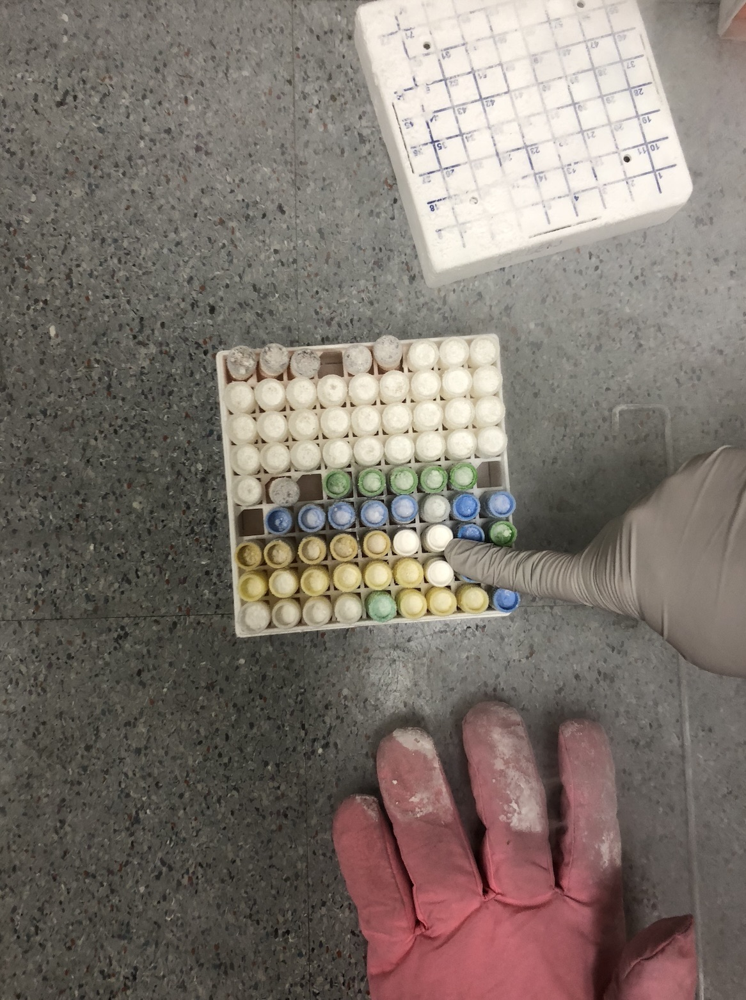

#### June

June marks the official start of summer, and it was my first summer that I truly 100% made research my primary focus. I was working on two projects concurrently which required lots of set-up. Culturing multiple cell lines, learning how to make nanoparticles, getting trained on all the new equipment, and managing experiments took a while to ramp up, but when it did I was happily busy.

But it wasn't as if I was ever bored. In fact, for much of June I felt sort of suffocated by all the other work I had to do. I continued working on my design team, mostly in a project management role. I worked on a nanopore sequencing project for Capsulomics that I didn't really want to do. I also was taking Microeconomics as a summer course for credit. Finally, June was a busy month for my work at Compound. I wrote out all of my theses within biotech/biopharma and wrote a piece on synthetic biology.

I spent a lot of time walking and being outside in June. Lots to think about and at this point my meditation habit was over so the time in the fresh air was a substitute. It was a quiet time again. Most of my friends weren't in Baltimore so I again turned to the internet to pass the time. After reading Steven Brill's book, _America's Bitter Pill_, I wrote a piece on the clash between progressivism and conservatism. It is actually an essay that re-reading now I am quite proud of. While only 5-6 months later, I think my words stand the test of time. I also took some time to learn about computational drug discovery, digging through Relay Therapeutics' S-1 filing and writing up a post on it. This is another post I am proud of because I learned all about small molecule drug development, how to read potency assays, all the other pre-clinical assays that are expected for an asset, and how to assess market sizing. Overall, Relay's S-1 was the first mature and legitimate drug development enterprise I've evaluated, the rest have been seed stage pitch decks and public facing documents on the internet. Recursion's S-1 came out in June and I wrote a Twitter thread about it.

A couple things made me very happy in June. First, I went to Philadelphia to visit my cousin and his wife. It was just a day trip where I drove over with my sister but still the best time. We went to a Chinese restaurant for lunch and had the most amazing tea-tree mushroom dish. We also visited UPenn and I was quite amazed at the new hospital they had built; could definitely envision myself there for graduate school. My favorite part of these trips is just chilling at home and catching up, he's been a big part of my life since I was a little boy. Another thing that made me happy was actually buying Stan Smiths. I never really tried to have good style (started a bit in 2021 though!) so seeing how good they looked brought a smile to my face everytime I wore or saw them.

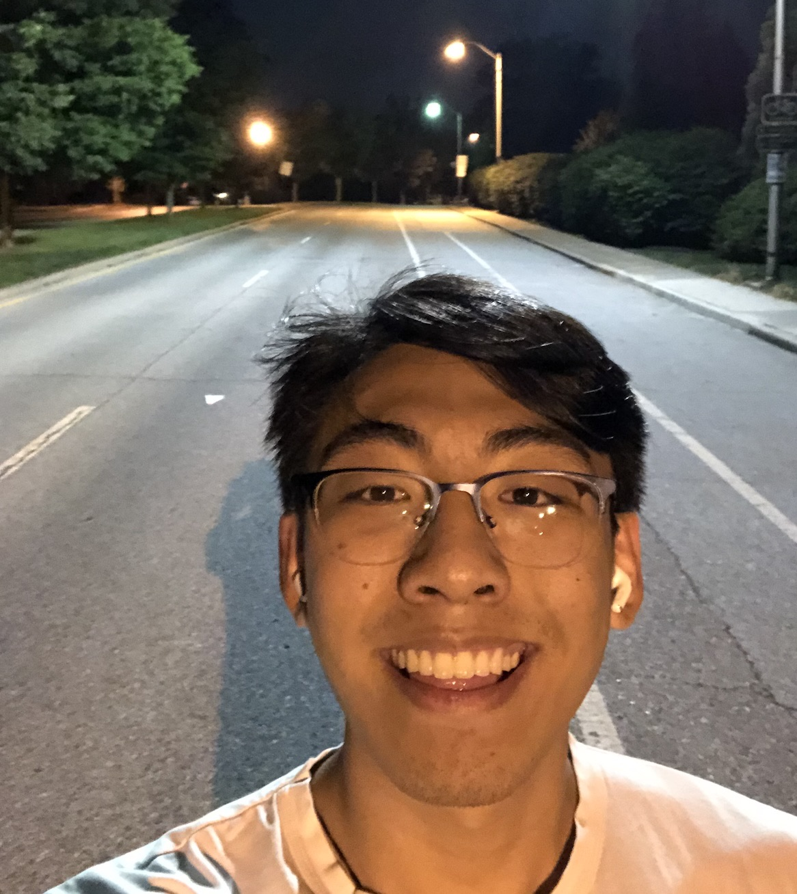

#### July

July was a month of travel and fulfillment after weeks of grinding in lab. I learned so many lab techniques, and collected some strong data for my projects. I developed greatly as a scientist, reaching true independence to the point where I designed all my own experiments, collected all my own data, and was the only one working on my project. I never thought I would get here during undergrad so I am so thankful to my mentors in the lab who helped me progress to this stage. The Covid-19 situation continued to improve during the summer, so much so that masks came off in lab. Seeing people's faces made me very happy.

July was another very fulfilling month at Compound. I wrote pieces on Protein Biomanufacturing and Mental Health Biomarkers. My protein biomanufacturing piece got a shoutout on Twitter and I felt a lot of love from the comments. On my side, I also wrote pieces on my website about failures in biotech and what they mean for the industry, and another piece on Lyell Immunopharma and ARCH style venture investing in biotech/biopharma. These pieces helped me take a broader view over the entire industry and think about what kind of company I want to build someday (hint: take huge bets with amazing teams and hit homeruns).

I also continued with a lot of clinical shadowing for my design team. I got to see tons of cool stuff ranging from a Davinci machine in action, foot amputations, lung nodule removals, and open heart surgeries. During the open heart surgery I saw, my friend and I actually got blood squirted on us! Luckily my glasses protected me but it was cool. 10/10 would let it happen again. They made us get a blood test afterwards because the patient was HIV+. I conquered my fear of drawing blood by watching a bunch of YouTube videos of people getting blood draws and desensitizing myself to my fear. I saw a heartbreaking case of an incarcerated diabetic man getting his foot amputated. I shared his story on Twitter and regret it.

The highlights of my month and some of my favorite memories of the year came from trips I took to Boston and New York. I went to Boston with my mom and sister for 3.5 days. We stayed in the Omni Parker hotel in the middle of Boston so we were able to walk anywhere in the city (Boston isn't that big anyways). I love walking around and exploring, and the weather was perfect so it was heaven for me. I'd take entire afternoons to stroll through the waterfront, little Italy, Chinatown, MGH, Quincy and Faneuil market, Boston Commons, and City Hall. I took the T down to MIT and took in Kendall Square, and got inspired by all the institutes where the best science happens. Flagship, Moderna, Draper, the Ragon, the Broad...goosebumps. With my sister, we strolled through Harvard and MIT campus. The first night we arrived in the city, we went to an amazing dumpling restaurant and I overhead a group of college students talking about vaccine technology. I felt at home. The food was amazing. Highlights were Flour bakery, fried seafood and clam chowder at the waterfront, bustling Chinese restaurants in Chinatown, and a Boston cream donut I bought from a local bakery.

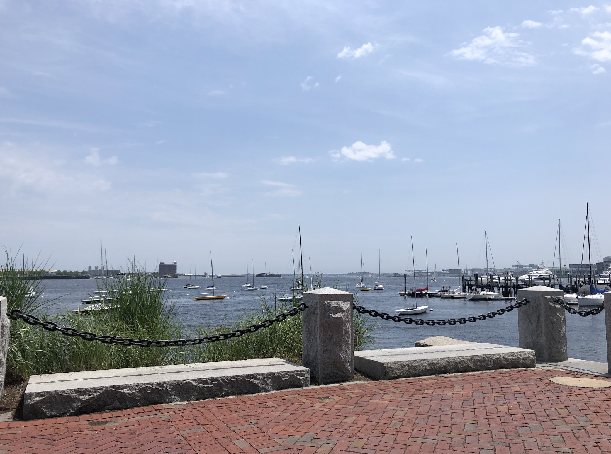

Two weeks later, I went to New York City by myself for a 2.5 day trip. I love traveling by myself because there are no schedules, no compromises, just whatever I want, whenever I want. Aside from a stomach bug issue and losing my mask on the subway, the trip was quite amazing. I walked through beautiful central park on an amazingly sunny and breezy day. I spent some time in the financial district getting inspired by the architecture, bustle, and energy of the city. I walked through the 9/11 memorial and Battery park. I walked along the Hudson river and explored the piers. I bought Pizza, sat down in Bryant Park to eat it and worked on my NSF application essays. Wifi and everything; delicious bliss.

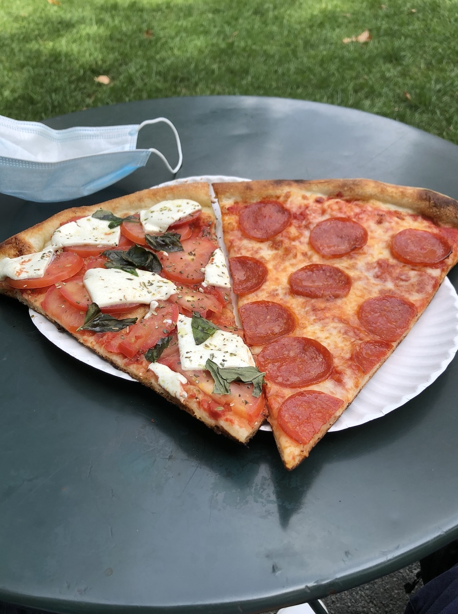

I stayed in Flushing, ate at Nanxiang and New World Mall. I walked all the way to Columbia University from the vessel, took the subway back. I walked through NYU 'campus', went to Mt. Sinai Hospital, the Washington Square Arch and saw some chess players. My feet were sore but I was happy.

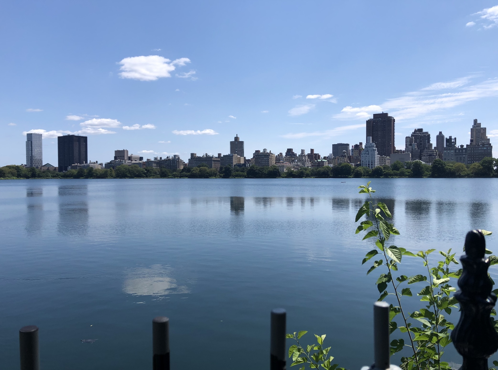

#### August

August signaled the start of something new. And truly, it was the start of something new. I began the month with a trip to Ocean City with my dad and my sister. We only stayed for 2 days, but again had a really amazing time. We strolled through the boardwalk, swam in the ocean, and ate some tasty seafood. Dry 85 OC specifically was delicious.

Getting back in Baltimore, I caught up with my high school friends for our annual Fantasy Football draft. My team is currently in the finals and I've never won the league in 5 years playing so crossing my fingers. With Compound, I met with the founders of CacheDNA and ImmTune, who are respectively developing exciting DNA storage and in-vivo CAR-T technologies.

I presented my summer's work in lab meeting and received lots of praise, filling me with gratitude and the confidence that I needed to write my graduate school applications. I also received several job offers (??) both via LinkedIn I presume after reading some combination of my Tweets and blog. I ended up accepting two as part time jobs and thoroughly enjoyed my time working and learning from those experiences, one of which is ongoing today. Partly from these experiences, I was inspired to write a piece on Engineering Gene Therapy to think through all the different ways that gene therapy constructs can be engineered and improved.

August is when PhD application season really felt like it was kicking off, and I caught up with some Hopkins alums currently in PhD programs which was a nice experience to see how they were doing.

I made several purchases that brought me lots of joy, including new running shoes (very colorful Nike Reacts), an Apple Watch, and a lego typewriter. The health gear is obviously an attempt to get myself to be more active and I'm happy to say that it worked. The typewriter is because it is an incredible piece of engineering and I love legos. This year, I learned that inspiration and motivation can be hard to come by, and when you see something beautiful and inspiring, you should just capture it immediately before the emotion drifts away.

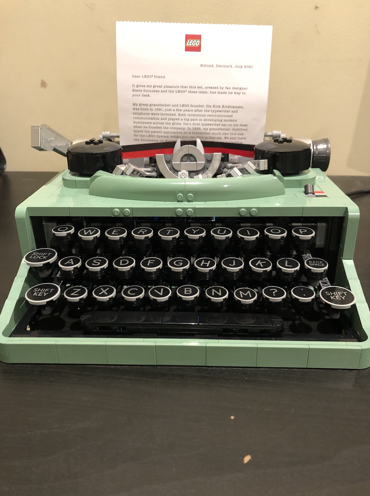

Most importantly, I moved into my first apartment! I saw my amazing roommates who I haven't seen in 2 years, who I am best friends with now. The apartment has an amazing view with a lot of sun that I soak up every morning. Most of my friends live in the same building as me too so I get to see them quite often. The 'ownership' aspect (even though we're renting) has given me a lot of freedom to think about how I want to design and take care of my living space.

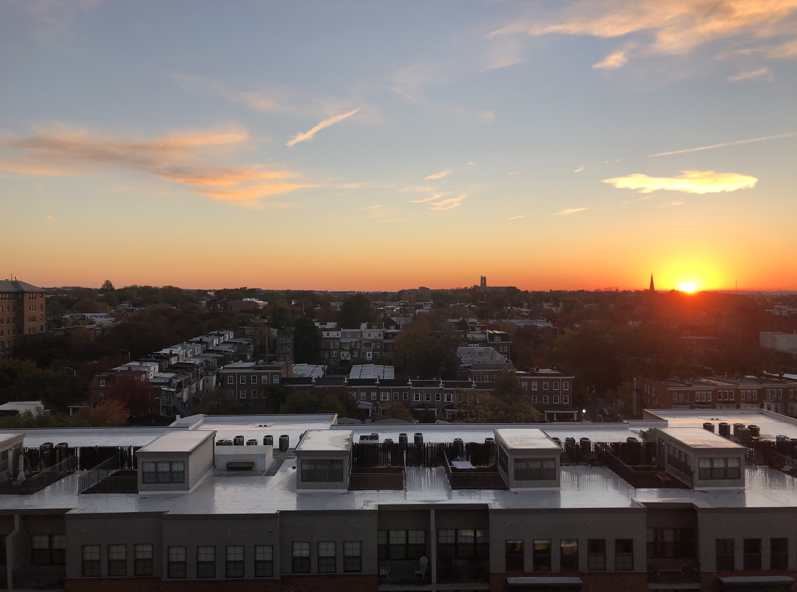

#### September

Back to normal. Finally, back to normal. In September, I finally had a full month to enjoy my friends, in person school, and have overall an incredibly fulfilling time. I was originally quite dissappointed because I was taking 3 math classes, all of which were online, and only 1 of my other courses was meeting in person. The biology class that was switched last minute to online I dropped after attending 2.5 classes (I literally left the Zoom meeting and unregistered in the middle of class and it was a 16 person class, hope he didn't get an email). I switched that to one that was specifically in person. Seeing people early in the morning, saying hi, and chatting during/after class was a real treat. I don't think I could ever do virtual work.

I'm proud that I developed some consistent habits that really helped me live comfortably and happily. I started weekly grocery shopping (for the first time okay, this counts as something to be proud of) and cooking for myself. I cleaned the apartment every week and kept everything tidy, much moreso than I did at home. My friends and I made a habit of getting together every weekend for food or to go places. My roommates and I spent hours just chilling on the couch. One day, we spent 6 hours watching the entirety of Squid Game after ordering way too many shitty wings from BeOne.

I wrote a piece on Neoleukin Therapeutics and their protein engineering platform. I connected with a Med student at Hopkins and a now biotech VC, both of whom reached out to me from the internet.

The highlight of my month was mooncake festival, where I received a really moving message from grandmother. It's been a tough year for them as my grandfather continues to struggle with his leukemia. I cried and was once again reminded that family is forever.

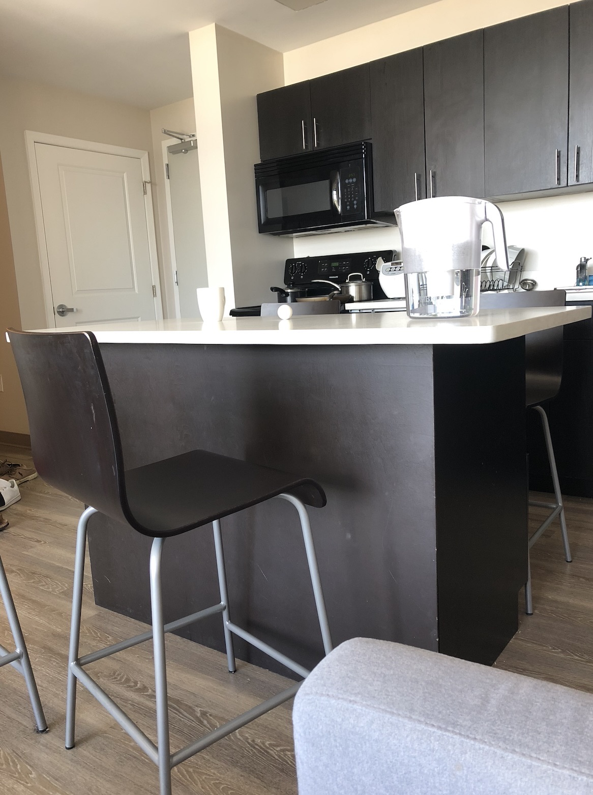

#### October

October was unfortunately a reminder that school and other commitments still require work to be done even if you are having so much fun. I got slapped around by a couple midterms. Once class, Applied Statistics and Data Analysis, I heard was extremely tough and I took it anyway because I wanted to prove to myself that I could learn statistics by myself (didn't have any friends in the class) and do well in math classes (traditionally has been a weak point). My first week of exams, I had a test on Friday, and two (including Appled Stat) the following Monday. I got quite stressed to the point where my roommates could tell and I had some stomach and other minor health issues.

I worked on a lot of consulting projects, finished experiments for my first research paper in lab, gave a seminar presentation, and submitted the NSF GRFP funding proposal. I capped that off with a short blog post containing some advice to a younger more ambitious version of myself and also with Projections by Karl Deisseroth which I was able to finish up after exams cooled down. Extremely productive, but also extremely busy. The habits I built the previous month really helped me, as did my night runs.

I got back into some hobbies including table tennis and real tennis. I finally caved and bought Allbirds, and I must say they do live up to the hype. I made a really great pot of coconut curry.

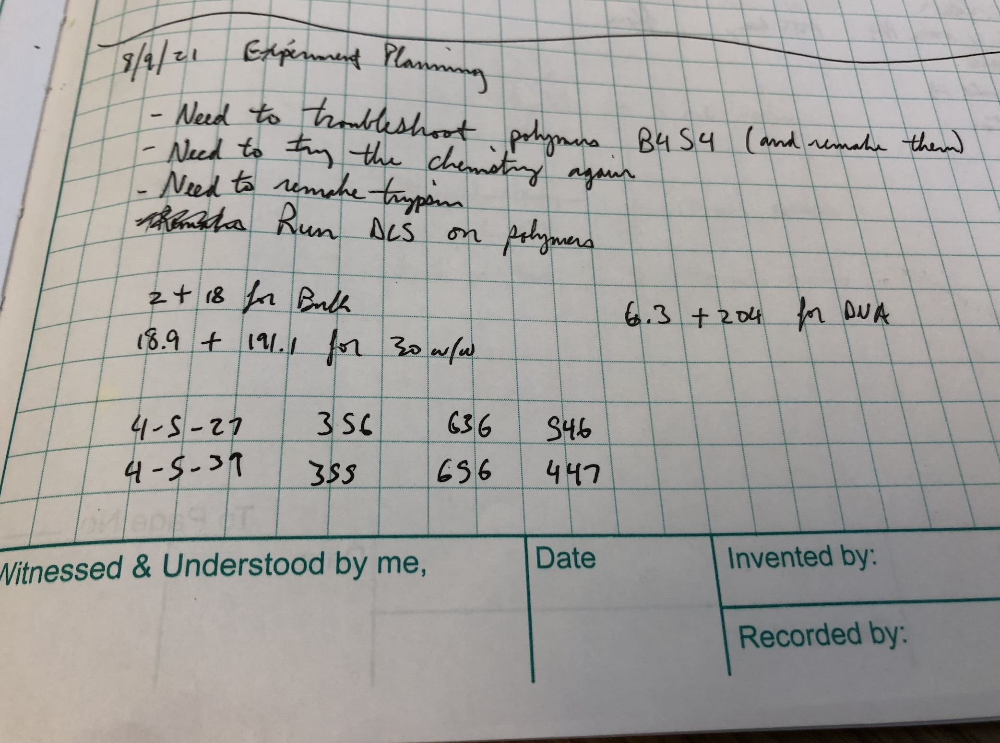

#### November

November was a turbulent month, filled with extreme highs and a few hours of painful anxiety. I spent a solid 3 weeks waking up ~2 hours earlier than I normally would just naturally, with an elevated heart rate, and an inability to focus. I was worried and excited all the time. Thinking about my future, my friends, and my career. My stocks were soaring. I made tons of new friends. I went to the gym 3 times a week and played tons of tennis and ping pong. I did well on my tests.

I realized I was graduating in a month. Yet, I had doubts about whether I wanted to pursue a PhD or pursue medicine. All my friends were getting interviews for medical school (and from great schools as well). If they could get in, so could I, yet I was going to do a PhD for 5-6 years? What if I didn't have the talent to be a top scientist, medicine seemed lower risk. My favorite papers to read were suddenly from NEJM instead of Nature Biotech. How could that be? The Culture of Medicine class I was taking surely was contributing to my change of heart, but why was I just having this realization now? I blame Covid. I would 'decide' on pre-med vs PhD and change this 'decision' almost every other day. I signed up for the MCAT and scheduled a meeting with the pre-health office. Eventually one morning I spent a couple hours writing out all of the thoughts in a document that currently sits on my desktop titled "What I want to do with my life" and this actually helped a lot.

I ended up writing and submitting my PhD applications. I started Anki and let me tell you, it's all medicine related.

My personal life was quite fulfilling, however. I learned how to skate and play badminton. I went to NYC with my friends. I went to DC with another friend group, and had Fogo de Chao on Black Friday. I cooked all of Thanksgiving dinner for the first time. I got gifts for my close friends for their birthday. We celebrated my roommate's birthday by going to Ellicot City and playing drinking games. I started running seriously with Strava and upped my mileage a lot.

I went ham on the blog and published pieces on Tregs, NK cells, and Cell Therapy Infrastructure. I got inducted into Tau Beta Pi.

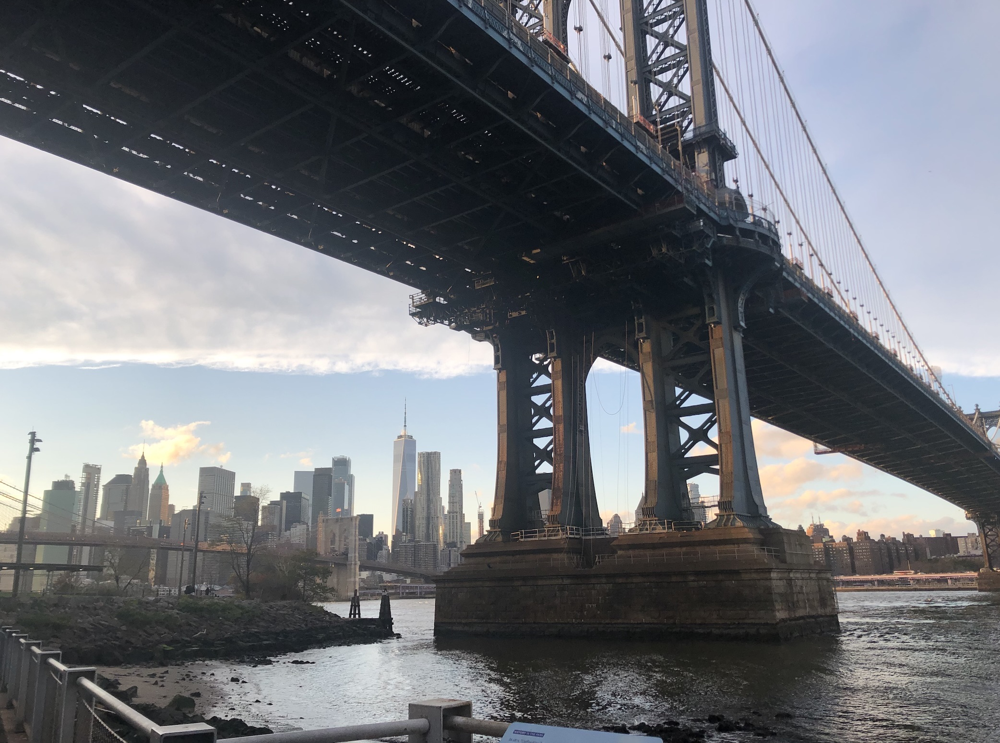

#### December

I'm writing this 3 hours before the new year in a mad race to the finish line. I love December. It's my favorite month and boy did it come through this year. I had an absolutely amazing end to the year, more than I could have ever hoped for.

To start off the month, I heard a really amazing pitch on a call with Compound (that we eventually invested in) and got to catch up with Ron and Mike for the first time in forever. I killed an Applied Stat midterm and arranged my new more or less fulltime job for the spring and some volunteering work. I had a secret santa gift exchange with a great group of friends I made this semester. I studied intensely and did well on my finals. I ended my last semester with all As except one A- in optimization (rip Donny) and finished undergrad strong with a 3.88 overall GPA which I am incredibly proud of.

I had a going away party for one of my closest friends since freshman year, an end of year dinner with a group of my guy friends, and had a wonderful dinner with my roommates at a nice steakhouse. I saw Spiderman and baked cookies. I went home to be with my family for the holidays. The first thing I did after I got home from school was start an Instagram and if that doesn't sum up my Fall I don't know what does. Growth comes in many ways :)

I bought my family a set of gifts I'm really proud of. An 8Sleep, an Oculus, and a moving wooden model toy. Steaks that I cooked with my dad for Christmas. My sister and I cooked our Christmas dinner (some asparagus, a lasagna, some roaster broccoli, plus 2 ribeyes and a NY strip) and it was delicious. For Christmas, my dad gifted me an iPhone 13, my mom an all-in-one air fryer, slow cooker, etc. pot, and my sister a couple of plants that will really brighten up our apartment.

I did a deep dive into the American Society of Hematology conference and published a Twitter thread and a post on my blog. It was well received and I learned so so much from doing it. I had a really great month of music and am currently in the Fantasy Football finals with my high school friends for the first time ever.

My birthday is December 28th, and I had the most amazing day ever. I woke up early, called my grandparents, and went on a walk. My mom, sister, and I went to a beautiful park, took some fantastic photos, and had a great lunch in Rockville. When we came back, I found that the 8Sleep I ordered had arrived and I set it up on my mom's mattress. After eating dinner, I went to the track and ran a 6:24 mile, my fastest in a long time. I got so many texts from my friends that made me feel so loved and happy. I made my first post on Instagram.

In the days since then, I've done tons of reflection, worked out, and saw my friends. I made a list of things I want to cook, hobbies I want to try, books I want to read in the new year. I also ordered a ton of new books for the new year (guilty pleasure). I made my new year's resolutions and set goals for what I want to accomplish.

On the last day of 2021, I went to the 'Future' exhibit at the Smithsonian in DC. What better way to end the year than by thinking about the future. Thank you 2021, and happy new year.

### A Year in Review

Whew. What an exercise. If you're still here, I have 2 hours until the clock strikes midnight. I want to keep this letter short and simple. Here goes:

__Friends,__

I just completed my first year of adulthood and I have never felt more proud and satisfied with how my year has turned out. I've had the most wonderful mentors, the most memorable and blissful times hanging out with you all, and the best support group I could have ever asked for just suddenly materialize all at once. I feel lucky every day for having the privilige of your friendship, you all are the most thoughtful, accomplished, and caring people.

I'll organize my gratitude in three bins: adulting, career-ing, and socializing.

##### Adulting

I had way too much fun buying shit. Be it books, gifts, clothes, or even apps, having disposable income has transitioned how I view myself, from someone who can and should endure a low footprint lifestyle, to someone who is worth nurturing with various items and gifts to improve their life.

Moving into my first apartment and truly feeling like I had a home was a watershed moment for me. Felt like a real adult with all the grocery shopping, cooking, and cleaning I did. I really like cooking now and I'm hoping to step up my game here significantly next year. I also need to decorate our apartment more. Having a window and seeing beauty every day was so important for my daily happiness.

Strava is my new favorite social network and has really helped my physical fitness. Going to the gym regularly has made me so much stronger and healthier. Plus I can eat more and recover faster.

##### Career-ing

I love reading and writing and in these areas my year has been a smashing success. I read 11 books, but spent like an hour on Twitter reading every day (that's gotta count), and developed a habit of regularly reading like 20 journal papers a week. I wrote 18 articles this year on the blog. I'm quite impressed by some of my writing from this past year. My most recent posts have been content based and honestly the prose is quite shit due to my focus on completeness of information. I'm glad I started posting on Twitter as well, it's been a good way to organize my thoughts and express them clearly and concisely.

Twitter has remained an incredible resource for gathering papers, learning about new initiatives and people, and keeping up with the news and latest happenings on the internet. If theres any indication of personal growth, my Twitter went from Paul Graham and VCs jerking each other off about work life balance to transitioning to academics, clinicians, and scientists commenting on clinical data and posting cool papers.

The medicine/PhD decision is no doubt one that I've probably discussed with all of you. My inability to decide must be frustrating but we'll eventually reach some conclusion. Good thing is, we're done with school and next semester I can figure things out.

##### Socializing

I've finally internalized the importance of being vulnerable, putting yourself out there, and being honest with your emotions and needs. Being strong and independent is great, but when your friends are there for you, it makes everything so much easier. Special thank you to my roommates for making me laugh, listening to me rant, and overall for the good vibes all the time.

All the parties, lunches, dinners, and hangouts that we had were the favorite part of my life this year. Incredibly refreshing and energizing, each one of them (except for that one time I threw up). We're doubling down next year and I'm hosting.

I actually ended up having a decent year of travel as well. I went to Philly, Boston, NY 2x, DC 3x, and Ocean City. I want to travel more with you all in 2022 and continue to explore the world and enjoy new cities and experiences.

##### What am I done with?

Zoom. Constantly checking Robinhood for stock quotes. Getting stuck on projects I don't care about for vanity metrics like publications. Going to try to stop comparing myself to others but no promises.

***

The year started slow, and ended extremely fast. I'm going to take way more pictures to document our time together; it made me so happy to look through my photos the past couple of days. It's too precious to lose, and I have 2 APOE4 alleles so memory loss is coming fast!

I'm feeling really good about 2022. My most important goal is to have fun and spend time with you all. Adjacent to that is continued success in my career. I want to prove to myself that I can be an incredibly productive and talented scientist and patient, thoughtful caretaker. Finally, I want to continue to improve my physical fitness, gain 100 ELO (chess), and keep up all my other hobbies.

Thank you to all that were a part of my life, you all made my year. There is so much to look forward to, so much to accomplish, and so much love to spread. Until next year.

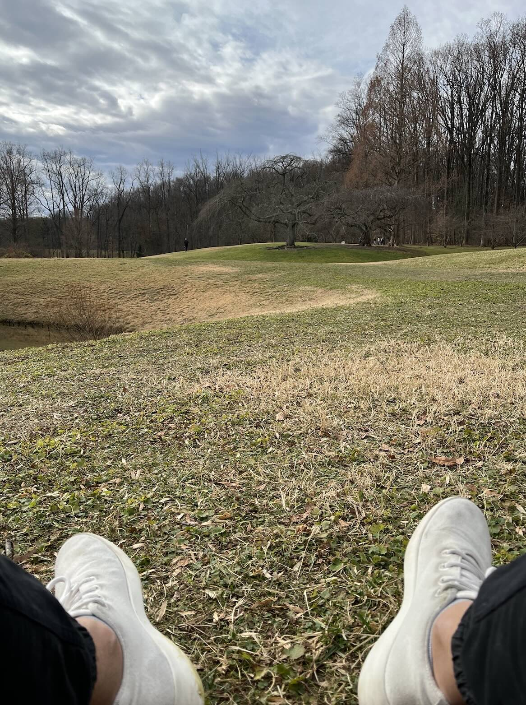

43 minutes to spare. GG 2021.
