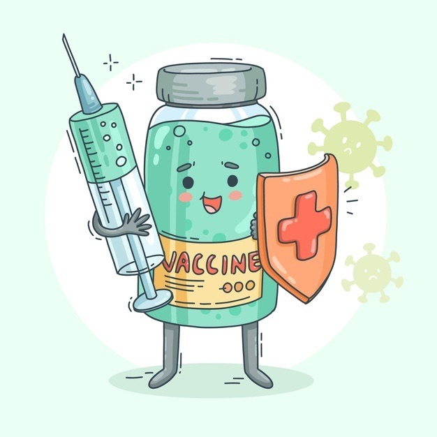
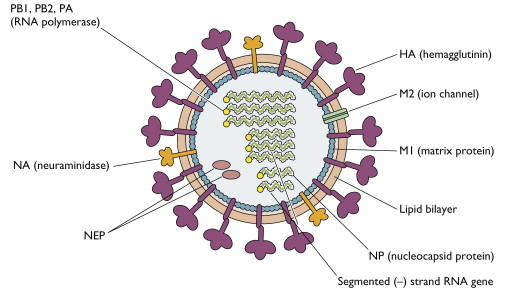

Vaccines are arguably the most important scientific breakthrough ever invented. Each year, 2-3 million lives are saved by current immunization programs. Millions of lives and trillions of dollars of economic activity have been saved by fast development of vaccines during the SARS-CoV-2 pandemic. Yet, my sense is that vaccines are sort of an afterthought compared to
other therapeutic modalities. Even with the advent and testing of vaccines during our current pandemic, I hadn't given much thought to the role of vaccines beyond SARS-CoV-2. This post is an attempt to summarize all that I've learned from a couple days of investigation. As it turns out, vaccine development has recently become quite exciting. I'll focus mostly on vaccines for infectious disease and cancer, talk about exciting new technologies being developed, and map the landscape of companies doing interesting work.

***

On the most basic level, all of us (hopefully) has interacted with and received a vaccine in our lifetime. What kind of vaccines do we get in the U.S.? I got Varicella, MMR (Measles, mumps, rubella), Meningococcal MCV, Tetanus, Diphtheria, Pertussis (whooping cough), HPV4, Hepatitus B, Polio, yearly Flu, and now three SARS-CoV-2 vaccines. What was the patient experience like? How did these vaccines provide us with immunity in the most basic sense?

Almost all of these vaccines are given in a prime -> boost dosing schedule, often with multiple doses in each stage separated by time between them. The idea of a vaccine is to develop immunological memory, such that the response to pathogen is quicker and more potent than if it were encountered without vaccination. The dosing schedules are optimized to generate strong enough of an immune response such that immunological memory is maintained, but low enough to avoid AEs -- this is the 'therapeutic window' for vaccines. These adverse events are typically temporary, for example just local injection soreness, mild fever, or fatigue, but reactions invariably can become more severe. For people with autoinflammatory conditions like psoriasis where there is persistent innate driven low grade inflammation, the severity of a response to pathogens either in vaccine form or the real thing will be stronger. We are also aware of events like blood clotting/coagulation issues, myocarditis, nausea, headaches, etc so preventing AEs while maintaining potency is a real problem.

The potency of a vaccine is commonly measured by looking at markers of an immune response. Antibody titers are perhaps the most common endpoint because it's quick, but inflammatory cytokines indicative of cell activation, or other assays looking at populations of antigen specific cells may also be useful. The potency of a vaccine is highly boosted by adjuvants, the most common of which is aluminium salt (Alum). They increase magnitude of antibody response, enable lower doses, and broaden immunity to clade adjacent pathogens. Potential mechanisms are depot theory (prolonging slow release of antigen over time) and activation of innate immunity.

Overall, the 'point' of a vaccine is generation of memory is long lived and has potential for long term clearance and disease remission. This in theory should prevent recurrent disease, whether that be in the form of infection, cancer, or other pathogen.

Are there potential downsides to vaccination? In most cases, the answer is a resounding no. Two concepts may be important to reconcile during development however: original antigenic sin and antibody dependent enhancement. Original antigenic sin is the concept that a memory response triggered against a similar but not identical set of antigens can be less effective than a response in the absence of memory. The idea is that if the antigens are too closely related, memory B cells can dampen the response of naive B cells to new antigens if they are too similar. Antibody dependent enhancement is the concept where antibodies are just good enough to recognize and bind pathogen, but not good enough to stave off infection. The consequence is that these antibodies actually help the pathogen get into cells, making it more infectious.

Vaccines come in many different forms. There can be live attenuated viruses, inactivated viruses, toxoids, subunit/conjugates, and genetic vaccines. Most recently, subunit/conjugate vaccines and genetic vaccines have been a major area of research effort and development for more difficult immunization targets. The other 'OG' vaccine platforms have been adequate and responsible for a majority of our childhood vaccinations but new approaches are needed to solve manufacturing, logistics, and efficacy issues.

Last point on background is regarding the economics of vaccine development. Though we wouldn't guess it from the SARS-CoV-2 vaccine sales, vaccines are generally not a good business opportunity. While patient panels can be large, vaccines need to be cheap in order to be cost effective. Manufacturing is expensive and difficult ([why do we have to grow viruses in eggs ?!](https://www.cdc.gov/flu/prevent/how-fluvaccine-made.htm)), and the ability to assemble complex supply chains and deliver vaccines at scale with cold storage and last mile logistics is not something a small company can handle. Remember when Bill Gates [funded 7 vaccine manufacturing centers](https://www.weforum.org/agenda/2020/04/bill-gates-7-potential-coronavirus-vaccines), only expecting 1 or 2 to pan out? Success rates for vaccine candidates are not high enough to justify the massive risk and costs for a small company to execute properly. Even Merck, who has been the queen of vaccine development, failed to develop a SARS-CoV-2 vaccine. Novavax, a relatively small biotech has struggled for 2 years to bring their SARS-CoV-2 vaccine to market despite already having compelling clinical data. For non-SARS-CoV-2 vaccines, you are often working with LMICs with low willingness to pay.

### Vaccines for Infectious Disease

We have made tremendous progress eradicating certain infectious diseases from existence using vaccines. Still, there remain several challenges.

In __tuberculosis__, the BCG vaccine is somewhat effective at preventing infection in when administered early in life, but a challenge remains for those who either did not get an early BCG vaccine (where the effectiveness protecting against infection plummets below 20%) or for those were are latently infected and need a vaccine to prevent later manifestation of severe disease.

The first __malaria__ vaccine, called RTS,S (Mosquirix) was recently recommended for widespread use by the WHO in October 2021. The vaccine has been more than 30 years in the making, costing the Bill and Melinda Gates foundation and GSK more than \$750 M. It could help prevent the deaths of 23,000 children a year, helping in the fight against a disease that kills 400k+ annually. In clinical trials, Mosquirix prevented ~30% of severe malaria cases after a series of four injections in children under the age of five. In addition, the vaccine reduced childhood malaria deaths by 73% if children received three doses in the run-up to the rainy season — when malaria peaks — and another dose before the rainy season in the two subsequent years when dosed in combination with seasonal malaria chemoprevention. At a potential cost of about \$5 per dose, researchers suggest the vaccine rollout, including its distribution, would cost around \$325 million to administer each year across ten African countries with a high incidence of malaria.

More recently, [Phase III trial](https://www.thelancet.com/journals/lancet/article/PIIS0140-6736(21)00943-0/fulltext) results read out from a newer protein based malaria vaccine called R21, showing up to 77% protection at 1 year after 3 doses. [Link](https://www.nature.com/articles/d41586-019-03639-5) to Nature outlook article.

Another urgent area of need is a vaccine against __Group B streptococcus (GBS)__, which is present in almost 1 in 5 women around the world and is responsible for nearly half of all life-threatening infections in newborns. GBS-NN, a recombinant protein-based vaccine developed by MinervaX and capsular polysaccharide (CPS) conjugate GBS vaccines like GlaxoSmithKline’s CPS-CRM197, and one being developed by Pfizer are under development.

Many companies are going after __respiratory syncytial virus (RSV)__, which affects 64 million people annually worldwide. Early efforts in the 1960s were disastrous, as an inactivated RSV vaccine actually made disease in those infected worse off. Structural biology research revealed that this is because the vaccines were targeting a post-fusion viral protein instead of the pre-fusion version that would have blocked cell fusion. A variety of new vaccine strategies are being evaluated in clinical trials, most prominently a bivalent subunit vaccine from [Pfizer](https://www.pfizer.com/news/press-release/press-release-detail/pfizer-announces-start-phase-3-clinical-trial-adults-its), a recombinant subunit vaccine from [GSK](https://www.gsk.com/en-gb/media/press-releases/gsk-starts-phase-iii-rsv-candidate-vaccine-programme-for-older-adults/) conjugated to their AS01 adjuvant, [Janssen's](https://www.jnj.com/janssen-announces-phase-2b-data-demonstrating-its-investigational-rsv-adult-vaccine-provided-80-protection-against-lower-respiratory-infections-in-older-adults) adenovirus + protein vaccine, and [Moderna's](https://www.biospace.com/article/releases/moderna-announces-first-participant-dosed-in-phase-2-3-study-of-its-mrna-respiratory-syncytial-virus-rsv-vaccine/) mRNA vaccine. [Link](https://www.nature.com/articles/d41586-021-03704-y) to Nature outlook article.

__Influenza__ vaccines are only 40-60% effective depending on the year and face antigenic drift and strain mismatch challenges as well as significant manufacturing difficulties. Developing a better flu vaccine has thus been an area of intense focus for many research groups. The current standard is Fluzone, a quadrivalent flu vaccine from Sanofi that most in the U.S. receive.  The structure of the influenza virus is shown in the figure below.

How these vaccines work is by generating immune responses against the HA hemagglutinin surface proteins of which there are 18 different types. These seasonal flu vaccines work against the influenza strains A(H1N1), A(H3N2), B/Victoria, and B/Yamagata, each of which may have different versions of HA. Improved antigen display and improved ability to match strains to develop new seasonal vaccines is a major area of research. Moderna, Novavax, and the Institute for Protein Design at the University of Washington have come up with next generation flu vaccines. While the Moderna shot [does not seem to demonstrate superiority](https://www.biopharma-reporter.com/Article/2021/12/13/Moderna-says-data-from-Phase-2-study-of-mRNA-flu-vaccine-will-be-key) over Fluzone, Novavax was able to demonstrate superiority in several secondary endpoints and non-inferiority in the primary immunogenicity endpoint. The IPD vaccine trials are ongoing.

Other viruses with genetic diversity that have drawn attention are __HIV__ and __Hepatitus C virus__. Recently, mRNA vaccines for HIV targeting the Env and Gag proteins demonstrated efficacy in NHPs and Phase I trials will begin in healthy volunteers. A Hep C vaccine has been far more difficult to progress in part due to effective anti-virals but also due to genetic diversity of the virus. In 2019, there were 39 ongoing HIV vaccine trials; by contrast, just two HCV vaccine candidates have progressed to human trials.

Chronic viruses are potentially important targets also for therapeutic reasons. Clearance of long covid from vaccination remains anecdotal, but potentially offers a mechanism for an immune mediate method of viral clearance, instead of small molecule antivirals. This may be especially important for viruses with high prevalence such as __cytomegalovirus (CMV)__ and __Epstein-Barr Virus (EBV)__. Between 50-80% of adults in the U.S. have a CMV infection by age 40, and CMV has been associated with inflammaging. EBV infects more than 90% of the human population and has recently been reported to be necessary for the development of Multiple Sclerosis. This [landscape article](https://www.genengnews.com/topics/drug-discovery/vaccine-development/pursuing-victory-moderna-begins-dosing-in-phase-iii-cmv-trial/) describes the development of Moderna's 6 mRNA vaccine design for CMV and various other vaccines in development (not that many). Moderna also recently started a Phase I trial for their EBV mRNA vaccine.

### Cancer Vaccines

I was going to write a good bit of text here, but [this review](https://www.nature.com/articles/s41568-021-00346-0) I found is extremely clear and easy to understand. Please read it, its way better than any summary I could have written.

My personal opinion is that vaccines make a __ton__ of progress in the next couple of years. BioNTech, Pfizer, and Moderna are 'rich', ready to do deals, and continue to be eager to run clinical trials, which should be easier to recruit. We have the largest safety dataset of vaccines ever and LNPs have demonstrated ability to deliver payloads at meaningful efficiency. More companies are working on this than ever before with loads of funding pumped into the sector over the past couple of years.

I think the issue will be velocity of clinical trials. Vaccines strike me as something where all at once you need to figure out combo therapies, targets, delivery, dosing schedules, etc. It's a new therapeutic modality that physicians may be inexperienced administering. You have to figure out how it works with CAR-T, with CPIs, and chemo. Getting logistics of neoantigen personalization down and manufacturing to reasonable timelines will be another challenge. The initial trials have been quite disappointing and I think as a field we just need to have some patience as the clinical logistics are figured out. To get to where CAR-T is right now, I would guess 10-15 years. First approval maybe 8 years away.

### Exciting New Developments

At the research stage, we are in a pretty exciting time in vaccines. While mRNA vaccines have been around for a while, clinical validation has demonstrated the power of the platform both in speed and potency. They have set a new standard in vaccine development and set the stage for next generation development (for ex. saRNA, multiplexing, new delivery strategies, etc). A couple of new ideas to highlight:

Darrell Irvine often in coordination with Dane Wittrup have been doing great vaccine work for many years now, but several recent studies are worth highlighting. In [December 2021](https://www.science.org/doi/10.1126/sciimmunol.abf1152), they reported saponin/MPLA nanoparticles as a new class of adjuvant. In [July 2019](https://www.science.org/doi/10.1126/science.aav8692), the group reported a vaccine to boost the performance of CAR-Ts in solid tumors. These are amphiphile CAR-T ligands that traffic to lymph nodes upon injection. In [June 2020](https://www.nature.com/articles/s41551-020-0563-4), the lab reported a technology fusing immunogen peptides to proteins to tune pharmacokinetics in vivo to enhance immunogenicity and T cell responses. In [December 2013](https://www.nature.com/articles/nbt.2759), the group published in Nature Biotech data from microneedle skin patch vaccines in NHPs.

David Mooney's group also does great deal of exciting vaccine work. In particular, I am quite impressed by their work designing a biomaterials based vaccine for AML. [A biomaterial-based vaccine eliciting durable tumour-specific responses against acute myeloid leukaemia](https://www.nature.com/articles/s41551-019-0503-3?proof=t%2529). This platform was similarly applied towards [bacterial infections and septic shock]((https://www.nature.com/articles/s41551-021-00756-3)). Unlike a traditional vaccine that stimulates the immune system and gets degraded, these biomaterials based vaccines stay and act like an artifical lymph node, prolonging the vaccination effect. Remarkably, these vaccines prevented AML engraftment, prevented relapse, provided transferable immunity, and even enabled de novo T cell responses _in the absence of antigen_!

Lastly, the work from the University of Washington's Institute for Protein Design requires highlighting. Two seminal papers from the King Lab describing protein nanoparticles were published in 2020: [Elicitation of Potent Neutralizing Antibody Responses by Designed Protein Nanoparticle Vaccines for SARS-CoV-2](https://www.ipd.uw.edu/wp-content/uploads/2020/10/1-s2.0-S0092867420314501-main.pdf)and 2021: [Quadrivalent Influenza Nanoparticle Vaccines Induce Broad Protection](https://www.nature.com/articles/s41586-021-03365-x). The way these work is by computationally designing and assembling 2 constructs that self assemble and display surface antigen via linker attachment. The core is roughly 20-25 nanometer and the whole particle can be ~50 nm. This platform generated remarkable titers (high and diverse) and demonstrated multiplexing ability, since different surface antigens can be concurrently attached.

##### Some other cool ideas:
- [Cell fusion vaccines](https://ashpublications.org/blood/article/138/Supplement%201/904/482655)
- Replace all antibodies with antibody vaccines
- Vaccines as a therapeutic to clear latent infection
- New adjuvant discovery and screening
- Structure based vaccine design with our improved understanding of structural biology

### Vaccine Companies/Labs

Lotta portfolio approaches (vaccines are inherently platform-y) making me write way more than I need to for each company -_-

Robert Seder Lab at NIH: Spun out Avidea Technologies
- vaccines against HIV, malaria, TB, SARS-CoV-2, and cancer

Oxford Jenner Vaccine Institute: works on a wide range of infectious diseases, non-communicable diseases, and emerging pathogen vaccines. Developed the Astra Zeneca adenovirus vaccine for Covid-19

Moderna Therapeutics: mRNA vaccines
- SpikeVax (Covid-19)
- mRNA-4157 (personal cancer vaccine). [Clinical trial](https://jitc.bmj.com/content/8/Suppl_3/A477.1)
- mRNA-1893 (Zika vaccine, BARDA funded, Phase II)
- mRNA-1215 (Nipah vaccine, NIH funded, preclinical)
- HIV, RSV, hMPV, PIV3, EBV vaccines. CMV (mRNA-1647) in Phase III
- mRNA-1010, flu vaccine in Phase II

Icosavax: Virus like particles
- licensed lead Covid-19 vaccine from King lab at IPD (IVX-411)
- IVX-421 for beta strain of Covid-19
- IVX-121 Phase I testing for RSV
- IVX-A12 is bivalent for RSV and hMPV
- [S-1 Filing](https://www.sec.gov/Archives/edgar/data/1786255/000119312521209031/d916073ds1.htm)

Vaccitech (Avidea Technologies)
- VTP-300 HBV
- VTP-200 HPV
- VTP-800/850 Prostate cancer
- VTP-600 NSCLC w/ chemo + CPI
- VTP-900 Covid-19 licensed to Astra Zeneca
- VTP-500 MERS
- VTP-400 Zoster

Baseimmune: Bioinformatics based antigen discovery platform

Pfizer
- [RSV vaccine](https://clinicaltrials.gov/ct2/show/NCT05035212?term=RSVpreF&draw=2&rank=2)
- Comiarty (Covid-19)
- TicoVac (Tic-borne encephalitis)
- Prevnar 20 (Pneumococcal 20-valent conjugate vaccine)
- Mencevax, Nimenrix (bought from GSK, Meningococcal vaccines)
- NeisVac-C (bought from Baxter, Meningococcal vaccine)
- Trumenba (Meningococcal vaccine)

BioNTech:
- Phase II, 2023, Autogene cevumeran, mRNA cancer vaccine partnered with Roche
- NEOPV-01 Phase I, 2026+ peptide vaccine
- Comiarty (Covid-19)
- Flu vaccine candidate partnered with Pfizer

Astra Zeneca
- Covid-19 vaccine (Vaxzevria)

J&J
- JNJ-78436735 (Covid-19)

Merck
- Vaxneuvance (Pneumococcal 15-valent conjugate vaccine)
- Gardasil for HPV
- BCG vaccine
- Ervebo for Ebola
- MMR Vaccine
- PedvaxHIB for haemophilus B
- Pneumovax for pneumococcal diseases
- ProQuad for MMR + Varicella
- Recombivax HB for hepatitus B
- RotaTeq for rotavirus
- VAQTA for Hepatitus A
- VARIVAX for Varicella
- Vaxelis for Diphtheria and Tetanus Toxoids and Acellular Pertussis, Poliovirus, Haemophilus b and Hepatitis B
- Vaxneuvalence for pneumococcal diseases

Affinivax: MAPS platform (biotin/rhizavidin antigen presentation)
- Bacterial vaccines (Streptococcus pneumoniae ASP3772 furthest in Phase II plus other preclinical)
- Covid-19 and melanoma programs

Meissa Vaccines: live attenuated intranasal vaccines for RSV, Covid-19, and hMPV

Novavax: recombinant nanoparticles produced via Sf9/BV insect cell platform
- NVX-CoV2373 (Covid-19, marketed)
- NanoFlu™ (Seasonal Influenza Vaccine, done Phase III)
- ResVax™ - RSV F Vaccine (done Phase III)
- programs for Ebola, MERS, SARS

CureVac: mRNA vaccines
- partnered with GSK on flu vaccine

Vaxart: Oral vaccines

GSK
- [RSV vaccine](https://clinicaltrials.gov/ct2/show/NCT04886596)
- Ambirix (hepatitis A (inactivated) and hepatitis B (rDNA) (HAB) vaccine (adsorbed))
- Bexsero	meningitis B
- Boostrix tetanus toxoid, reduced diphtheria toxoid and acellular pertussis vaccine, adsorbed
- Cervarix human Papillomavirus vaccine (types 16, 18) - recombinant, adjuvanted, adsorbed
- Engerix-B	hepatitis B Vaccine (Recombinant)
- Fendrix	hepatitis B (rDNA) vaccine (adjuvanted, adsorbed)
- Fluarix and Flulaval QIV	seasonal influenza vaccine (4 strain)
- Havrix hepatitis A vaccine, inactivated
- Hiberix	haemophilus B conjugate vaccine (tetanus toxoid conjugate)
- Infanrix diphtheria and tetanus toxoids and acellular pertussis vaccine adsorbed
- Kinrix diphtheria and tetanus toxoids and acellular pertussis adsorbed and inactivated poliovirus vaccine
- Menitorix	combined Haemophilus influenzae type b and Neisseria meningitidis group C (Hib-MenC) conjugate vaccines
- Menjugate	meningitis C
- Menveo meningitis ACWY
- Pediarix diphtheria and tetanus toxoids and acellular pertussis adsorbed, hepatitis B (recombinant) and inactivated poliovirus vaccine combined
- Priorix-Tetra	measles, mumps, rubella, varicella (chicken pox)
- Rotarix	human rotavirus vaccine, live attenuated
- Shingrix	Zoster Vaccine Recombinant, Adjuvanted
- Synflorix	pneumococcal polysaccharide conjugate vaccine (adsorbed)
- Twinrix	combined hepatitis A (inactivated virus) and hepatitis B vaccine (genetically derived surface antigen)
- Varilrix	varicella (chicken pox) in healthy adults and adolescents

Sanofi
- VAT008 partnered w/ GSK, protein vaccinem readout in early 2022
- Fluzone (quadrivalent flu vaccine)
- Adacel (Tetanus Toxoid, Reduced Diphtheria Toxoid and Acellular Pertussis Vaccine)
- ActHIB (Haemophilus b Conjugate Vaccine)
- Daptacel (Diphtheria and Tetanus Toxoids and Acellular Pertussis Vaccine)
- Dengvaxia (Dengue Tetravalent Vaccine)
- Imovax and Imogam for rabies
- IPOL for polio
- Menactra (Meningococcal (Groups A, C, Y and W-135) Polysaccharide Diphtheria Toxoid Conjugate Vaccine)
- MenQuadfi (Meningococcal [Groups A, C, Y, W] Conjugate Vaccine)
- Pentacel (Diphtheria and Tetanus Toxoids and Acellular Pertussis Adsorbed, Inactivated Poliovirus and Haemophilus b Conjugate (Tetanus Toxoid Conjugate) Vaccine
- Typhim Vi® (Typhoid Vi Polysaccharide Vaccine)
- Vaxelis™ (Diphtheria and Tetanus Toxoids and Acellular Pertussis, Inactivated Poliovirus, Haemophilus b Conjugate and Hepatitis B Vaccine)
- YF-VAX® (Yellow Fever Vaccine)
- Flu vaccine candidate using mRNA (Translate Bio)

Vaxcyte: cell free protein expression conjugate vaccines for bacterial infections

Elicio Therapeutics: Lymph node targeting AMP platform (Darrell Irvine)
- PDAC, CRC, NSCLC Phase 1 mKRAS vaccine
- CAR-T booster vaccine for CD19 heme malignancies

Inovio Pharmaceuticals: DNA vaccines
Geneos Therapeutics (subsidiary)
- GNOSPV-02, DNA vaccine Phase I/II, 2026+

Codagenix: single dose intranasal life-attenuated virus vaccine

Gritstone Bio: cancer neoantigen vaccines
- Zvexneo DNA vax w Merck, Phase I/II, 2024

Genocea Biosciences: personalized cancer vaccine
- GEN-009 Peptide vaccine, 2026, Phase I/II

SK bioscience: licensed a Covid vaccine from King lab at Institute for Protein Design
- GBP510 in Phase III trials funded by CEPI

### Fun Reading

[Nature guide to vaccinology](https://www.nature.com/articles/s41577-020-00479-7)

[Nature milestones in vaccines](https://www.nature.com/collections/hcajdiajij)

[Therapeutic Cancer Vaccines](https://www.nature.com/articles/s41568-021-00346-0.pdf) Nature Reviews Cancer

[Challenges towards the realization of individualized cancer vaccines](https://www.nature.com/articles/s41551-018-0266-2) from Ugur Sahin's group at BioNTech

[Advances in the development of personalized neoantigen-based therapeutic cancer vaccines](https://www.nature.com/articles/s41571-020-00460-2). Nature Reviews Clinical Oncology

[A biomaterial-based vaccine eliciting durable tumour-specific responses against acute myeloid leukaemia](https://www.nature.com/articles/s41551-019-0503-3?proof=t%2529) from David Mooney

[Biomaterial vaccines capturing pathogen-associated molecular patterns protect against bacterial infections and septic shock](https://www.nature.com/articles/s41551-021-00756-3) from David Mooney

[Quadrivalent Influenza Nanoparticle Vaccines Induce Broad Protection](https://www.nature.com/articles/s41586-021-03365-x) for King group at IPD

[Elicitation of Potent Neutralizing Antibody Responses by Designed Protein Nanoparticle Vaccines for SARS-CoV-2](https://www.ipd.uw.edu/wp-content/uploads/2020/10/1-s2.0-S0092867420314501-main.pdf) from King group at IPD
