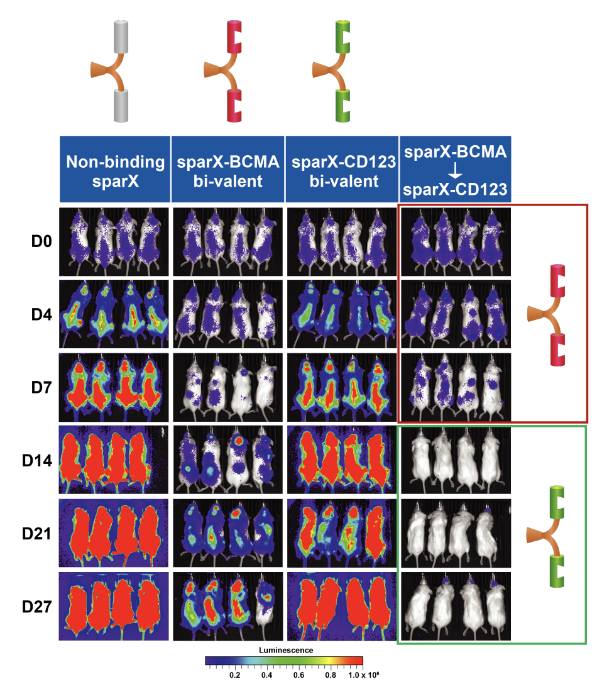

[Arcellx](https://www.arcellx.com/) (\$ACLX) is a clinical stage cell therapy company that is developing two platforms, SparX and D-Domain binders, to improve upon existing cell engineering approaches. The company was incorporated in December 2014, under the name Encarta, and changed name in January 2016 to Arcellx. The company closed a \$115 M series C in April 2021 and an \$85 M series B in October 2019. Privately, they have raised a total of 234.8 M from investors including NEA, Novo Holdings, Quan Capital, SR One, and Takeda Ventures.

Their IPO closed in February 2022, selling 9,487,500 shares at a public offering price of \$15 a share, for gross proceeds of \$142.3 million and net proceeds of \$128.0 million. This is in addition to \$70 M of cash they had prior to the offering, giving them a total of \$198 M, which should last until 2H 2023. There are 139,218,480 shares outstanding

Simply because I don't want to retype it all, here is what Arcellx's spending/cash has looked like from the past two years:

Corporate HQ is in Gaithersberg, MD where the company employs 78 FTEs, 61 of which are R&D focused. The company is led by CEO Rami Elghandour and CMO Christopher Heery. The CEO is getting paid a fuck ton in options and shares on top of salary and bonus. He already owns 7% of the company with 10,488,657 shares, but has options for almost 11 M more, and an additional 5 M in stock awards which should vest over the next 3 years. He made 13 M in 2021, compared to the former CEO who pulled 1 M in 2021. Hope he's worth it.

Here are links to Arcellx's [corporate presentation](https://ir.arcellx.com/events-and-presentations/default.aspx) (updated for March 2022) and [S-1](https://www.sec.gov/Archives/edgar/data/0001786205/000119312522022267/d129231ds1a.htm#toc129231_13) published in February 2022. In this post we will cover Arcellx's technology, clinical programs, and strategy for navigating a crowded cell therapy landscape. Arcellx's IPO comes at a time where biotech markets have drastically underperformed and many clinical programs have failed leaving confidence in the sector at historic lows. Nevertheless, Arcellx's performance on the public markets while still poor, did somewhat buck a trend with a substantial IPO haul. I became interested in the company due to the IP portfolio they have established, the good will the company seems to have on Twitter, and clinical data presented at ASH 2021.

### Technology

First will be a general review of Arcellx's core technologies, mostly scraped from corporate presentations, the S-1, and public abstracts and publications. These two technologies are complementary and surprisingly versatile. Arcellx has a portfolio of 14 granted and 50+ pending patents, allowing them to be relatively good stewards of allowing their scientists to publish results in journals.

##### D-Domain

The first piece of technology that was first described in literature [here](https://www.ncbi.nlm.nih.gov/pmc/articles/PMC6612629/) and being derisked in the clinic is Arcellx's D-Domain antigen binder. These are synthetic binding domains derived from the 73 amino acid three helix bundle protein α3D [first described in 1999](https://www.ncbi.nlm.nih.gov/pmc/articles/PMC21886/) that has no known homolog in nature or apparent function, that replace the traditional scFv that is traditionally used as part of the CAR construct. There are several features that make these D-Domains advantageous.

Firstly, it is 8kDa in size compared to 25kDa scFv or 50kDa TCR. The smaller size translates to higher transduction efficiency due to it being a smaller construct, as well as lower tonic signaling due to reduced aggregation which can afflict scFv based CAR molecules. The D-Domain structures lack disulfide bonds and N-linked glycosylation, making them easy to make in not just mammalian based expression systems. Finally, due to rapid folding kinetics and high thermal stability of these domains, there may be higher surface expression and more engineer-ability of the protein for downstream uses. D-domain libraries can be engineered and screened using protein engineering techniques to generate binders to specific antigen targets, and because the anitgen binding domains vary only by 12-14 amino acids, the manufacturing process is near identical for each.

These advantages translate clinically to shorter v/v times, lower COGS during manufacturing, higher manufacturing success rates, and potentially lower doses of cell product, assuming the density of binding proteins is higher with D-Domains than scFv.

##### SparX

Building off the D-Domain technology, Arcellx has developed a versatile targeting strategy that promises to provide substantial clinical utility beyond what a traditional CAR-T might offer. SparX allows a universal antigen receptor complex (ARC) T cell to be targeted via an intermediate binding protein (SparX) to any target. Since all ARC-T cells are the same, this approach renders the killing function of the ARC-T cell dependent on the antigen specificity and dose of the SparX protein rather than on uncontrolled CAR-T proliferation as is the case with conventional CAR-T therapy.

All SparX proteins are comprised of one or more antigen-specific binding domains from the D-Domain library, fused to a TAG protein which is designed to be recognized by ARC-T cells and signals T-cells via 4-1BB and CD3-zeta. The TAG is a ~26 kDa C-terminal fragment of human alpha fetoprotein (hAFP) which humans have pre-established tolerance to from experiencing high levels in utero and as pregnant mothers. Small size allows tumor microenvironment penetration with short half life for controlled dosing.

The severe toxicities associated with CAR-T in some instances might be mitigated with dose titrations and schedule of SparX protein administration, which potentially may expand patient eligibility. Additionally, stopping the dose of the SparX protein periodically can allow the ARC-T cells to rest after activation lowering the risk of T-cell exhaustion, which is a common cause of rapid decline of genetically modified T cells. Since all ARC cells are the same, this provides scalability in manufacture and flexibility for administration to the physician.

Since the Antigen binding domains on the D-domains only differ by 12-14 amino acids the manufacturing process is similar (and can be done in a variety of expression systems). The PK should also be similar, simplifying the regulatory pathway. Arcellx is actively Working on subQ formulations to complement the existing i.v. formulation.

Perhaps the most promising aspect of SparX as a platform is its ability for clinicians to flexibly control when and what is being administered to patients. There is the potential for addressing r/r disease when tumors are heterogenous. SparX proteins can be designed to be logic gated to address tougher tumor targets where tumor markers may be co-expressed on healthy cells. The SparX protein can be mono-valent, multi-valent, or multi-specific providing the ability to tune the therapeutic window or increase potency in some cases.

For example, bi-valent SparX Her-2 protein demonstrated more potent tumor killing than the mono-valent form, in [data](https://www.arcellx.com/wp-content/uploads/2020/05/ASCO-2020_Abstract-3041_Poster_Selective-Targeting-of-HER2-overexpressing-Solid-Tumors-with-a-Next-generation-CAR-T-Cell-Therapy.pdf) Arcellx presented at ASCO 2020.

### Programs

Like most other cell therapy companies, Arcellx has multiple programs across both liquid and solid tumors. Their first focus is multiple myeloma, targeting BCMA. Having to go after multiple indications simultaneously is an unfortunate characteristic of most clinical cell therapy companies, which is primarily due to small addressable markets. Because of the added commercial risk, plus the fact that companies often try to differentiate based on technology, there is often very minimal biological risk taken. BCMA is a validated targeted with an already approved CAR-T ide-cel (and now more recently cilta-cel) and by the day it becomes more crowded. Arcellx estimates the TAM of r/r MM 3L+ where their lead CART-ddBCMA product operates as \$10 B. Their estimate of the total market opportunity in cell therapy for hematological cancers as \$66 B. There is value to be captured here, but there is a real revenue ceiling as well.

__CART-ddBCMA__: Arcellx's lead product has performed admirably in clinical trials thus far. In a Phase I dose finding study, the D-domain BCMA T cell posted a 100% ORR (68% CR, 16% VGPR, 16% PR) in 19 evaluable patients. Median CAR expression was 74% (61-87%). Durability was strong and CR rate increased over time. Arcellx made special note of performance in extramedullary disease, a setting that typically has poor prognosis for survival. While competing BCMA CAR-T products from CARsgen (CT041) and J&J/Legend (cilta-cel) post similar if not better CR rates (Carsgen posted 100% ORR with 11/14 patients in sCR and 9 patients reaching sustained CR/sCR for over 12 months. 98% ORR, with 80.4% CR in 97 patients for cilta-cel), Arcellx claims that CART-ddBCMA is best in class in the extramedullary disease setting which affects ~20% of patients. Here, Arcellex posted 100% ORR with 86% CR and mPFS of 12.6 months in 7 patients. In comparison, cilta-cel posted ORR of 82.4%, CR in 60%, and 8.1 month mPFS in the same patient population.

Given these Phase I data, Arcellx has planned a pivotal Phase 2 to initiate by the end of 2022 with RP2D of 100 M cells (0% Gr3 CRS, 6% Gr>3 ICANS in the Phase 1). They met with the FDA in 4Q 2021 to discuss study endpoints and expect to present updates in 1H 2022 and Q4 2022, with an anticipated BLA in 1H 2025 if the trials goes well. Arcellx has also planned an earlier line trial (iMMagine-2) of the same product to initiate in 2023.

__ACLX-001__: A follow on multiple myeloma product is utilization of the ARC-SparX platform for r/r MM again using BCMA as target. This trial is planned for initiation in 1H 2022 and is already on clinicaltrials.gov. Interim data is expected in 2023. [Preclinical data](https://www.arcellx.com/wp-content/uploads/2021/04/Arcellx-AACR-2021-Poster-ACLX-001_Abstract-1549.pdf) for this program was published at AACR in 2021. Interesting to see was that the SparX protein needs to be dosed at least twice a week, but most likely daily for efficacy to be comparable to the CART-ddBCMA product.

__ACLX-002__: In a more challenging indication, Arcellx is developing a CD123 targeted SparX product for AML/MDS. Clinical trial is planned to initiate in 2H 2022, but Arcellx has published a wealth of preclinical data. In the [published preclinical data](https://www.arcellx.com/wp-content/uploads/2020/06/AACR-II-2020-Poster-601-Abstract-3243-Chimeric-antigen-receptors-incorporating-novel-binding-domains-targeting-CD123-direct-potent-antitumor-activity-of-T-cells.pdf), Arcellx demonstrates that D-domain cells perform comparably to scFv CAR-Ts, that high affinity monovalent SparX proteins are superior than bivalent SparX proteins, and that activity is dose dependent.

__ACLX-003__: Arcellx also has another (undisclosed) antigen target for AML/MDS they are going after with ARC-SparX, with planned initiation in 2024. ACLX-003 at least has advanced to preclinical stages, but they also list 2 other AML/MDS programs that are discovery stage.

Additionally, Arcellx has 2 solid tumor programs in hepatocellular carcinoma (HCC) and small cell lung cancer (SCLC). It is undisclosed what antigen targets or what platform they will be deploying for these programs. These are also discovery stage assets.

### Business Strategy

One of the most interesting parts of the S-1 to me was the strategy section. Thinking through how top executives (the CEO must be top if he's getting paid that much) think through priorities has been an interesting way to develop pattern recognition. There are a couple of interesting points to make about Arcellx's posted business strategy. First is the product focus on r/r MM and AML/MDS, instead of too much focus on platform development. As a public clinical stage company, having alignment with patients and focusing intensely on bringing products to market seems the most fair to both patients and investors. Priority 3 entails expansion into new product areas. Platform development doesn't come in until 4-7, where they start thinking about going allogeneic, doing patient eligibility expansion, and other discovery technologies (they mention trying to integrate AI in their corporate slides and S-1). Last is strategic partnerships and collaborations. I think its important to explore collaborations as a core aspect of your business, but at the end of the day it should be in pursuit of the killer application of your base technology, not in service of your collaborator's. In other words, pick your targets carefully, and take on allies to help you reach it; don't take on allies to fight their battles for them.

1. Advance CART-ddBCMA to treat r/r MM patients in the United States and abroad
2. Develop comprehensive ARC-SparX AML/MDS program
3. Expand pipeline to select solid tumor indications
4. Apply D-Domain technology outside of autologous CAR-T solutions
5. Enable greater access to CAR-T therapy through clinical studies in broader patient populations that support improved market access
6. Invest in technologies that enable access
7. Leverage novel technologies to drive our discovery efforts
8. Opportunistically pursue strategic partnerships and collaborations to maximize the full potential of our platform

### Conclusions and Prospects

Arcellx is quite a young company with lots of clinical data to be read out so it is difficult to forecast where the company will fit into the broader therapeutic landscape. Obviously if things work out, the platform is quite versatile and has the potential to be the end all future of cell therapy.

In Arcellx's ideal world, SparX proteins will be available in intravenous and potentially subcutaneous formulations and physicians will be able to routinely utilize both forms of administration in the outpatient setting while patients may periodically (e.g., weekly) self-administer subcutaneous formulations in the home setting. In follow up visits, the physician can assess the patient for adverse events (AEs) and disease response and then accordingly dose-modify or change the SparX protein(s) with the objective of limiting toxicity. The ARC-SparX platform allows the physician to control toxicities by dose modifying or switch to a different SparX protein in the case of r/r disease.

Additionally, intermittent dosing of SparX protein can allow ARC-T cells to rest between doses because the predicted half-life of SparX proteins of a few hours allows the SparX to naturally decay and limit constant ARC-T stimulation. The periods of rest may lower the risk of T-cell exhaustion. administer different SparX proteins to redirect the same ARC-T cells to new antigens

Another interesting point Arcellx brought up in the S-1 was the use of DOR instead of RR as the most meaningful clinical endpoint. Cell therapies have all gotten pretty good that high response rates are quite common. What matters more now for patients and physicians are toxicities that need to be managed, and cure rate. The peace of mind knowing that you are cured for good will be a big value inflection point for future generations of cells.

In the future, I'm also curious about the work coming out of companies like Arsenal Bio, whose scientific leadership seems to be world class but as a company are quite stealthy. I recently covered Lyell's S-1 and prospects and have hopes that their metabolic reprogramming and rejuvenation techniques can work against solid tumors. Finally, I'm excited about Fate Therapeutics, and the ability to potentially dose cells just like any other medicine. The prospects of cell therapy are bright and the next couple of years will be quite informative. We have lots of shots on goal, but many patients to serve.

### Abstracts and Publications

[Chimeric Antigen Receptors Incorporating D Domains Targeting CD123 Direct Potent Mono- and Bi-specific Antitumor Activity of T Cells](https://www.ncbi.nlm.nih.gov/pmc/articles/PMC6612629/)

[Novel CAR-T Cell Therapy that can be Activated, Silenced, and Reprogrammed In Vivo with Soluble Protein Adapters in a Dose Dependent Manner](https://www.arcellx.com/wp-content/uploads/2020/04/ASGCT-2020-Abstract-788_Poster_Novel-CAR-T-Cell-therapy-that-can-be-activated-silenced-and-reprogrammed-in-vivo-with-soluble-protein-adapters-in-a-dose-dependent-manner.pdf)

[Selective Targeting of HER2-overexpressing Solid Tumors with a Next-generation CAR-T Cell Therapy](https://www.arcellx.com/wp-content/uploads/2020/05/ASCO-2020_Abstract-3041_Poster_Selective-Targeting-of-HER2-overexpressing-Solid-Tumors-with-a-Next-generation-CAR-T-Cell-Therapy.pdf)

[Chimeric Antigen Receptors Incorporating Novel (non-scFv) Binding Domains Targeting CD123 Direct Potent Antitumor Activity of T Cells: Correlation Between Affinity and Activity](https://www.arcellx.com/wp-content/uploads/2020/06/AACR-II-2020-Poster-601-Abstract-3243-Chimeric-antigen-receptors-incorporating-novel-binding-domains-targeting-CD123-direct-potent-antitumor-activity-of-T-cells.pdf)

[Phase 1 Study of CART-ddBCMA, a CAR-T therapy utilizing a novel synthetic binding domain for the treatment of subjects with relapsed and refractory Multiple Myeloma](https://www.arcellx.com/wp-content/uploads/2020/12/Arcellx-CART-ddBCMA-Clinical-Data-Presented-Dec-2020.pdf)

[ACLX-001*, a novel BCMA-targeted CAR-T cell therapy that can be activated and silenced in vivo with soluble protein adapters in a dose dependent manner](https://www.arcellx.com/wp-content/uploads/2021/04/Arcellx-AACR-2021-Poster-ACLX-001_Abstract-1549.pdf)

[D Domains: A De Novo Scaffold for the Development of Targeted Therapeutics](https://www.arcellx.com/wp-content/uploads/2021/05/ARCELLX-PEGS-2021.pdf)

[Design and Demonstration of Potent in vitro and in vivo Activity for CART-ddBCMA, a BCMA-Targeted CAR-T Cell Therapy Incorporating a Non-scFv Binding Domain](https://www.arcellx.com/wp-content/uploads/2021/05/ARCELLX-ASGCT-2021.pdf)

[Phase 1 Study of CART-ddBCMA, a CAR-T therapy utilizing a novel synthetic binding domain for the treatment of subjects with relapsed and refractory Multiple Myeloma](https://www.arcellx.com/wp-content/uploads/2021/06/Arcellx_ASCO-2021-CART-ddBCMA.pdf)

[Phase I study of CART-ddBCMA: a CART-Therapy Utilizing a Novel Synthetic Binding Domain for the Treatment of Subjects with Relapsed or Refractory Multiple Myeloma](https://www.arcellx.com/wp-content/uploads/2021/12/Arcellx-ASH-2021-CART-ddBCMA.pdf)
