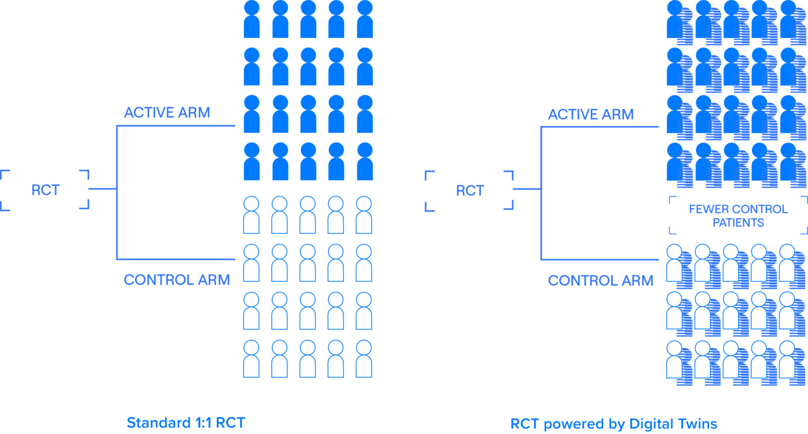
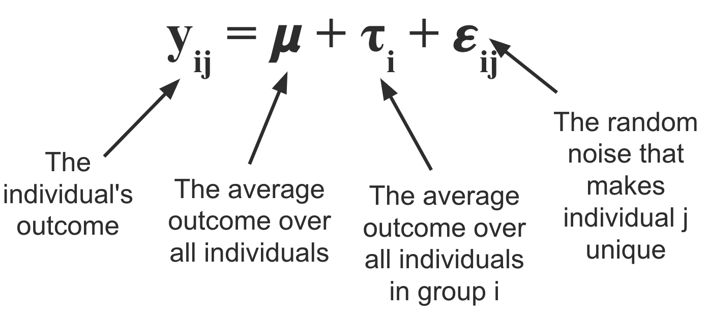

I've always been interested but skeptical of things that seem like magic. Sometimes stuff comes out that just somehow works with massive effect size, usually the output of decades of advances strung together but sometimes just a lucky guess. I'd classify the Covid vaccines in this category, hand washing, statins, imatinib, and several others. But recently in our hypercompetitive news cycle, everything seems like a breakthrough revolution. Its become a bit of a chore to understand what the true reality of how big a new piece of work actually is. What sucks is that nobody is taking the time to write about relative effect sizes, comprehensive comparisons of status quo versus new tech, and the step by step detail breakdown about what is new and an advance. There's no incentive to do so (in fact it probably hurts you to do it), its a lot of work to do correctly, and all the experts that could comment quickly are hard at work on their own projects.

So when I came across this [exchange](https://twitter.com/UnibusPluram/status/1541540584589910016) by two clinical trial statisticians about Unlearn.AI, a company working on creating 'digital twins' to speed up clinical trials, I was excited because this was a rare example of experts cutting exactly to the chase.

I had heard about Unlearn.AI for a few years, mainly in bits and pieces. The word on the street was that they had the potential to totally replace control arms in clinical trials. Couldn't get specifics of course, tech VCs don't do that, but [overall a ringing endorsement of the traction and vision](https://youtu.be/T_uO53JAHKw?t=9). Recently, they raised a \$50 M series B financing that was covered in [TechCrunch](https://techcrunch.com/2022/04/19/unlearn-ai-a-startup-developing-a-digital-twin-service-for-clinical-trials-raises-50m/). The 'digital twin' marketing is used in the article, on Unlearn.AI's [website](https://www.unlearn.ai/), and in all description of the company.

What's somewhat hilarious is that the company knows that the digital twin nomenclature is rudimentary at best and somewhat incoherent at worst. Credit to [Jeremy Sussman](https://twitter.com/JeremySussman) for the language here, but the technology is simply risk score based covariate adjustment. Alejandro Schuler, the first author of the [paper](https://arxiv.org/pdf/2012.09935.pdf) describing the technology never uses the 'digital twin' terminology and says that it __"clearly works perfectly as red meat for VCs and mediocre tech journalism. Gets the cash, gets the clicks."__. Schuler worked for Unlearn for almost a year and a half before joining the faculty at UC Berkeley.

### What is Unlearn actually doing?

Unlearn was founded in 2017 by three physicists by training, and is currently led by founder CEO Charles Fisher. They have raised $70 M across Seed, A, A extension, and B rounds and sit at more than 40 employees.

The core product that the company sells is the TwinRCT, a suite of statistical techniques that slim down clinical trials. Its somewhat unclear whether Unlearn is taking over the statistical plan for new clinical trials in a one by one services manner or via partnerships. The essential value the business provides thought is application of modern statistical techniques to decrease patient enrollment requirements.

Some basic statistical theory is required to understand how clinical trial statistics work and where Unlearn fits in. I'm no expert, but the ideas are simple enough where my undergraduate math degree was sufficient to provide servicable background.

Firstly, we should familiarize ourself with the ANOVA (analysis of variance). The basic idea is that for any given experiment that satisfies a certain set of assumptions, you can break down the variance in the outcome variable Y from a set of data X into a treatment effect and some random error. By fitting this analysis of variance to placebo and experimental groups for example, you can do some statistical tests to measure the treatment effect.

In clinical trials and almost all other settings, there is more that explains the outcome variable than just the treatment. In other words, there is still unexplained variance in the error term. By 'controlling' (adding terms to the model to regress them out) for things like age, sex, weight, and other biomarkers, you can get a more precise estimate of the treatment effect. This is because you are taking more variance out of the error, and thus decreasing the size of error bars. This combination of ANOVA and regressing out covariates is called an [ANCOVA (analysis of covariance)](https://www.statisticshowto.com/ancova/).

As a trialist, one of the goals is to regress out as many important covariates as reasonable, and this is where Unlearn comes in. They call what they do a Prognostic Covariate Adjustment (PROCOVA), an ANCOVA with a small addition. Unlearn uses historical data to learn a prognostic model which generates a prognostic score for each patient enrolled. This score is used as an additional covariate in the model. The idea here is computing this score allows the model to integrate as much historical data as possible while keeping dimensionality to a single variable. The company notes that this is similar to including composite covariates like BMI, Charlson comorbidity index, and Framingham risk score.

Unlearn generates this prognostic score using their DiGenesis machine learning model. This is part of the innovation; they use [Conditional Restricted Boltzmann Machines](https://www.nature.com/articles/s41598-019-49656-2), a neural net based architecture. The model creates a 'digital twin', which Unlearn defines as a longitudinal computationally generated clinical record that describes what would happen if a specific patient received a placebo. Essentially its a generative model that stochastically generates measurements through time for each given patient.

### Utility and limitations

Unlearn is doing the work of cleaning up and processing historical data and generating prognostic scores. Its valuable work and its great that someone is doing it. In ideal circumstances, Unlearn expects sample size reductions of 10-30%. These ideal circumstances are those for diseases where the progression course is known. On their website they list CNS and Inflammation and Immunology as initial areas of focus. These are progressive degenerative diseases affecting lots of people and without precision approaches or recent largescale therapeutic development. The reason I highlight this point is that historical borrowing approaches work best in these circumstances where there is sufficient training data and also where the standard of care is relatively constant. The use of historical borrowing also is going to benefit those historically represented in clinical trials; not underrepresented minorities and groups new to the healthcare system.

Historical control arms are already used and hotly critisized. The reason is that they don't control [type I error](https://en.wikipedia.org/wiki/Type_I_and_type_II_errors) and they have limited utility as a benchmark because standards of care change. Placebo arms can be difficult to predict, just ask [BridgeBio](https://www.fiercebiotech.com/biotech/bridgebio-s-baffling-heart-disease-drug-fail-de-intensifies-competition-and-net-neutral-for). Unlearn's approach controls Type I error but still suffers from historical controls. The main one being that you have to assume that the patients in the historical control are more or less as the patients being seen today. Probably true, but there are certainly caveats.

The way I see Unlearn is that its a services company that helps trialist be modestly more efficient. However, trialists also need to be careful of not assuming too much of the technology. The EMA writes that _overly optimistic assumptions on the effect of covariates may result in too low sample sizes and inconclusive studies_. There is also the point that trials happen not just to detect treatment differences between drug and placebo groups, but also _to collect sufficiently large safety database or, in some cases, to address more than one endpoint or the precision in important subgroups_ (EMA again).

I'm really curious to see how many patients and dollars this actually saves. In theory, it sounds great, just shave off 10% from trial costs and timelines. Let's say the cost per patient is roughly 40k. For a large trial such as the Alzheimer's trial they use to illustrate in the EMA, they showed they could decrease participants 15% from 402 to 343, representing 59 less patients, or $2.36 M in savings.

I have a couple questions though:

1. What happens when the standard of care changes? does the existing model become worthless?
2. What kind of place does this technology have in the era of precision medicine, where there might not be as much data to validate the prognostic score? is precision medicine actually a better use case? given that it may be harder to recruit
3. Does the technology eventually have a role in oncology or other indications where the nice continuous responses from slowly progressing disease might not be present?
4. How much time and cost does it take to set up PROCOVA for a trial? What is the lifetime of a PROCOVA model?

One last point I'll make is that the prognostic score concept sits at a weird conundrum point where if its too good, we need to ask trial investigators why they aren't stratifying patients based on the score, and if its not so good, we probably can't use it right? It would be really cool if these models were explainable and teaching us about the course of disease.

### In a more perfect world...

We don't need to use disingenuous language in order to get funded. AI and machine learning is really just statistics. A digital twin is simply a prognostic score. Really the moat here I doubt is better machine learning, but rather the workflow infrastructure of slowly building prognostic models, the IP to protect what you're doing, and the business development team to show off and sell the product. Its a fine business and should help patients which ultimately I'm happy about.

In theory we shouldn't even need this in the first place if our medicines are good enough. The best way to reduce clinical trial enrollment is by having a larger effect size! Perhaps another way of speeding up clinical trials and reducing bloat is by making better medicines and cutting out bad trials from the ecosystem. Overall though, I'm a fan of what they are doing. The marketing is disingenuous, but its real work that should make an impact when done correctly.

### Links

1. [Tweet inspiration](https://twitter.com/UnibusPluram/status/1541540584589910016)
2. [TechCrunch article](https://techcrunch.com/2022/04/19/unlearn-ai-a-startup-developing-a-digital-twin-service-for-clinical-trials-raises-50m/)
3. [Arxiv paper describing PROCOVA](https://arxiv.org/abs/2012.09935)
4. [EMA decision on the use of PROCOVA](https://www.ema.europa.eu/en/documents/other/draft-qualification-opinion-prognostic-covariate-adjustment-procovatm_en.pdf)
5. [Unlearn PROCOVA handbook for trialists](https://assets.website-files.com/5ef3f3eba7c8fa472d1ff536/6245379657574b15fc62c747_UnlearnPROCOVAHandbookForTheTargetTrialStatistician.pdf)
