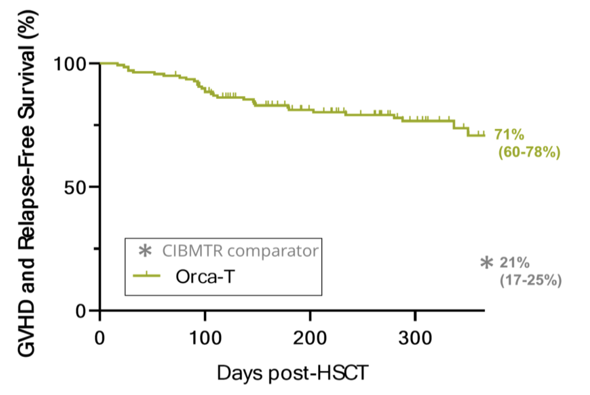

Building a biotech business is about identifying a problem in biology and developing technology to address it. Without a concrete and specific problem statement and use case you can get lost in optimizing for useless metrics. Solving difficult engineering problems is undoubtedly an important part of building an enduring company, but it shouldn’t be the first consideration. Biology comes first, technology follows.

The makings of a strong and healthy biotech company are threefold. Businesses that build the frontier of biotechnology are founded on a unique biological insight, provide concrete services or products, and solve important engineering problems. They use technology for optimal use cases, never needing to force integration of tech where it doesn’t belong. They publish frequently and because they were first to identify or solve a problem, have broad defensible IP moats. Finally, they are focused on metrics that matter. The products and services being built are benchmarked in patient lives and improved quality of life.

Ideally, these businesses have established product opportunities and de-risked technology, enabling them to continue development and progress on their own terms. They offer tangible improvements over status quo and they exist in large and growing markets. In each case, there is key consideration and clear answers to these three questions:

1. How does the current standard of care or status quo work, step by step?
2. How will it work better with the new innovation, step by step?
3. Why is \#2 better than \#1, and by how much? How many people does this help?

### Orca Bio

Orca Bio, based in Menlo Park, was founded in 2015 and has raised more than $300 million in funding through a Series D, supporting more than 80 employees. Out of Irv Weissman’s group at Stanford, the founders at Orca have discovered that precisely formulated cell populations can offer tangible improvements over unpurified allogeneic cells. This addresses a clear unmet need. Allogeneic hematopoietic stem cell transplant (HCST) is a cornerstone of treatment for liquid tumors, and can be curative. Following conditioning chemotherapy to clear out the host’s existing immune cells, HLA matched donor derived cells are infused to engraft and recolonize bone marrow, ‘resetting’ a patient’s immune system. These new cells are often more capable of clearing malignant cells, infections, or even resolve autoimmunity.

However, HCST can also cause adverse events including graft versus host disease (GvHD), post-transplant lymphoproliferative disorder (PTLD), and a higher chance of developing cancer overall possibly due to tumor initiating cells in the transplant. The current standard of care HCST is an

uncontrolled heterogeneous set of over 50 cell types containing therapeutically active cells, but also contaminating, non-active, or inhibitory cell populations. Bluntly ‘resetting’ an immune system in this manner is crude and leads to slow recovery of up to a year, an opportunity for infection, and worse therapeutic outcomes. In preparation for an allogeneic cell product, there are often two types of prophylactic treatment with immunosuppressants like tacrolimus and methotrexate. Still, acute GvHD happens in 16% of cases at 6 months, and chronic GvHD develops in 38% of patients by 1 year. Relapse to cancer occurs in roughly a third of patients by 1 year, and survival dips to 68% by 1 year for what should be a curative procedure.

How can we rectify this? Orca addresses this problem by high throughput, high sensitivity cell sorting to reduce the number of harmful cells in the final transplant product. Basic science research from as early as 2003 has led to discoveries that certain cell types including hematopoietic stem and progenitor cells (HSPC), Tregs, iNKT, and Tmemory cells allow early rescue of immunity and suppression of GvHD. Tregs assist in engraftment and prevent GvHD by suppressing alloreactive tissue resident T cells, and iNKT cells support Tregs with feedback signals to enhance immunosuppression. HSPCs reconstitute the blood and immune systems, and memory T cells exert anti-infection and anti-tumor effects.

Orca leverages these discoveries to build designer immune system transplants using improved cell sorting technology. The team engineered an improved fluorescence activated cell sorting (FACS) technique to increase speed and preserve sterility for clinical applications. Their [patented](https://patents.google.com/?assignee=Orca+Biosystems&oq=Orca+Biosystems) technology is published and the team clearly describes why their solution is a substantial improvement over the current standard.

Specifically, FACS sorting doesn’t scale because in order to sort the estimated 2.8 billion cells in the average transplant, it would require more than 24 hours per patient. This not only makes it infeasible for addressing large numbers of patients, but also negatively affects primary cell viability and functionality. An alternate sorting technology termed magnetic-activated cell sorting (MACS) is fast and can be done sterile, but lacks the purity and multiplexing ability of FACS. GvHD can develop with a T-cell frequency in the transplant product as low as 0.0014%. Furthermore, transplants with fewer tumor initiating cells can extend progression free patient survival by 12-14 years. Maintaining the purity of FACS is thus of utmost importance.

Orca has figured out how to do this using microfluidics and electromagnetic radiation. Essentially there are these cassettes of micropore arrays, each pore containing a single cell. Imaging tells you which pores contain the cells you want and electromagnetic radiation releases the desired cells from the specific pores. 2-4 billion cells are sortable within 2 hours with 70-90% viability and similar accuracy as FACS. It's unclear if it is as good as FACS in terms of sensitivity or specificity, but it's hard to measure this benchmarking comparison. Various other details are scattered throughout various patent filings.

Clinical proof of concept has been communicated at major academic conferences with strikingly positive results. The company has dosed 130+ patients with reliable manufacturing lots and vein-to-vein times of less than 72 hours. Overall, there's lower infection, lower GvHD both acute and chronic, less relapse, and more survival. A phase III trial evaluating Orca-T, their flagship product, in heme malignancy transplant settings is ongoing, but it looks like a parachute. Below are data from a combined Phase 1b/2 trial results of Orca-T presented at EHA Congress 2022.

Is there upside to what Orca is doing? Allogeneic cell therapy and potentially even autologous cell therapy already can be strong and growing markets for commercializing their technology. However, the holy grail here is indication specific designer cell therapy systems. Orca has the competitive advantage here, but doesn’t necessarily need to be the one discovering what cell populations are driving therapeutic outcomes. Outside of transplanting immune systems, Orca’s technology can readily be applied towards regenerative medicine, sorting iPSCs and creating designer mixes of cells that will seed functional tissue.

### Building Winners

Outside of the foundations, there is no right way to build a biotechnology business. Founder led versus incubated in a venture creation studio. CNS papers versus specialty journals, George Church on the SAB or not, it's mostly just noise. Maybe there are patterns, but these are so far down the priority list that they are nearly irrelevant. The important parts of what make a company special are almost always clear. Strong management teams that can execute, a real problem in biology that is being solved, and a robust technology portfolio that allows them to address problems in a way that no one else has before.

There are some models that may be useful at the earliest stages, however. Early-stage founders are good at tech development and sourcing and implementing applications of their technology. This is a gray area that is out of scope for an academic lab, could possibly be supported by an SBIR/STTR/DARPA grant if not time constrained, but most efficiently explored via ~5M or less of VC + small (500k - 2M) validation deals with pharma/larger biotech. Depending on the success of these projects, the company can get bought as an aqui-hire for ~40M or continue executing on deals if the growth trajectory is reasonable. To evaluate whether this can work, the consideration should be whether the team can get those pilots in a reasonable timeline without further dilution (team is competent and won’t get distracted, problem isn’t too difficult, some initial work already done, problem being solved is real and customers are willing to pay). Novel technologies with IP and early strategic interest or licensing/spinning out from a larger company who has already done IP/validation work are also models that can work.

Identifying problems that are rate limiting for the entire industry is a good way of understanding where a company fits in with the broader landscape. The next step is analyzing whether solving the problem is limited by time, resources, or the right technology for the job. While academia can be quite productive and it is optimized for certain 0–1 tasks like target ID, inventing new technologies, and to some extent, proof of concept experiments for new technologies. Companies are far better at technology development and optimization, securing and executing deals, and building out manufacturing and scaleup.

Winners are category defining and solve important problems. At the end of the day, the role of the company is to perform useful work and usually the harder the problem you solve, the more upside there is. While there are more companies than ever and more problems than ever to solve, there isn’t infinite money to support everyone. Biotech is here and it's growing fast. But still it's worth some caution and careful analysis.
