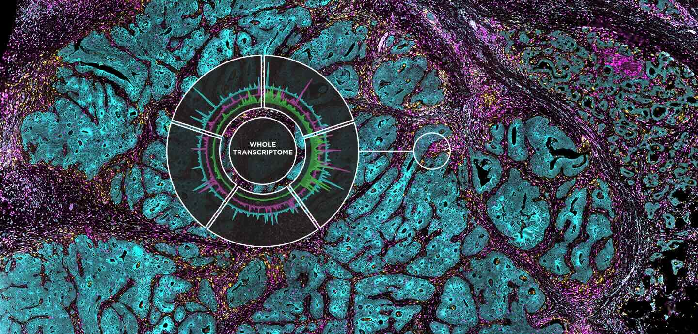
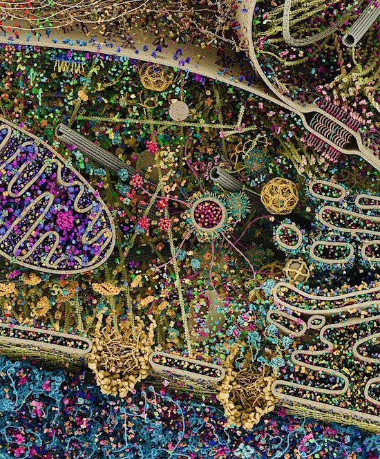
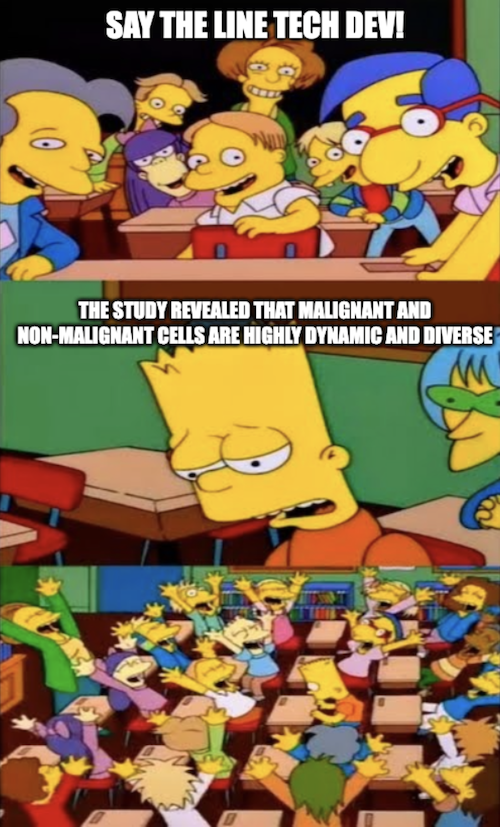

If you're working in biomedical research, there are so many things you could work on. If you're a biologist, you can study the basic processes of life and disease, utilizing the latest tools. If you're a tech developer, you can use your creativity to push the bounds of what is physically possible. There are those that work with the main goal to understand, and those who work to treat, diagnose, or prevent disease. I've recently been curious about the discovery side of the research enterprise. Being a believer that the rate limiting step in drug discovery is our understanding of biology, I've spent some time wondering what kinds of questions we need new technology to answer. What is the fundamental reason why we aren't finding new drugs faster and faster?

There are two parts of drug discovery: finding the target, and drugging the target. To drug the target better, you need a mix of better engineering and maybe better understanding of biology (combo tx, maybe the target is inaccessible, maybe we need to know how the drug interacts with off targets, etc). To find the target, you need a better understanding of biology which maybe you can get through better engineering, or maybe just better question asking or sequencing of experiments. This essay will explore a bit about the target ID aspect and what exactly new technology is giving us for new actionable discoveries for drug development. My current view is that we use new technology to ask and answer new questions that have been unable to address previously. Biology always leads and going fishing perhaps isn't the best strategy at least in our current therapeutic landscape. Next gen tools will be useful for unraveling niche and poorly studied indications.

### Tech Dev or Basic Biology?

When I read new tech dev papers, a lot of it is confirming what we already know, or coming up with huge lists of potentially interesting areas for followup. Invariably, the tech dev team will need to rely upon biologists to do the work of sifting through data and independently verifying each claim. Or perhaps a team of biologists will collaborate with the inventors of a technology to apply it and generate new data. What happens in followup has always been a mystery to me. It probably gets licensed because very rarely do I see spinouts based on biological insights gained from screens.

The validity and repeatability of studies utilizing new technology are a question mark still to me. Perhaps we are in the part of the cycle where immature technology produces immature results. The technology is always changing and new stuff keeps coming out. The cost to run these new technologies is increasing expensive, not just in terms of reagents but also the human cost of the time it takes to learn how to use the newest inventions. There is also the sample cost. A lot of these technologies are expensive to use so they are saved for human samples, which can be hard to come by, leading to limitations of small sample sizes and potentially unrepeatable results. Hopefully soon, costs should come down and sample sizes will allow these new tools to produce robust and repeatable results.

Given these limitations, I'm stuck. I'm particularly interested in cancer biology. Let's say we want to develop new treatments for pancreatic cancer. Do we do tech dev or do we do biology experiments?

[Zack Chiang](http://zackchiang.com/spatial-technologies-of-the-future/) wrote a great article titled ["Spatial Technologies of the Future"](http://zackchiang.com/spatial-technologies-of-the-future/) in which he writes that new tech development in the future should enable three capabilities:

1. Molecular resolution: be able to identify every molecule (DNA, epigenetics RNA, proteins, etc.)
2. Spatial resolution: be able to pinpoint the 3D location of every molecule to identify interactions
3. Temporal resolution: be able to do 1 and 2 at every point in time

But even if we do have this, how do we use it to cure cancer? The below is an artist's rendering of the intricate details of a human cell. You can see various pores and vesicles, organelles and proteins floating around.

Let's say you have this picture of a normal human pancreas cell, and a picture of a pancreatic cancer cell. Would you be able to develop a drug? You'd probably say no because it's a purposefully ridiculous example. My point is that even with the clearest resolution of what the characteristics of cancer are, a lot of the information is useless. Who cares what the exact location of something is or the expression pattern of a protein is if it will change through time, and it varies from patient to patient or even sample to sample within the same tumor. __[Highly dynamic and diverse.](https://twitter.com/TanentzapfLab/status/1557818176355741696)__

To make CAR-T work, all we needed to do is profile the surface proteome, do some differential expression analysis between target and off-target tissue, and then do some trial and error. Here, we didn't need 21st century technology to do target ID. We've known for a while that PDAC is a KRAS addicted tumor, yet KRAS inhibitors don't work. Here, modern -omics technologies gave us a target, but it hasn't been effective. How do we rectify this? If the lowest hanging fruit like these examples either has been addressed by old drug hunting or been ineffectively drugged, how confident can we be that further tech dev will give us better targets?

How have we developed drugs before? Using -omics for sure works. It's a proven strategy. But there's also been lots of brute force phenotypic screening for chemotherapeutics. Our understanding of T-cell biology certainly aided development of CAR-T and checkpoint inhibitors. What new insights will new technologies uncover that will lead to new drug development? This is a question I'm quite curious to answer. Quite simply, __I want to know how many drugs and new targets scRNA-Seq, spatial biology, CRISPR screens, etc will come up with!__ To show me the power of discovery platforms, I've outlined key use cases for some foundational technologies below. As I learn more, I may continue to update.

### Drug Development from the Latest and Greatest

#### Tool compounds

Chemical probes are small molecules with well defined potency, selectivity, and PK. These are useful for mechanistic studies where you can clearly test the hypothesis of whether the inhibition or activation of a certain target affects phenotypes. For example, cell lines can be screened with probes to understand which cancers are sensitive to certain types of inhibition. Functional pathways such as mTOR signaling have successfully been explored using chemical probes as well. In the following [Cancer Cell article](https://www.ncbi.nlm.nih.gov/pmc/articles/PMC5511331/), there is useful discussion of challenges of using probes as well as the complementary role they play among biological interference methods like RNAi or CRISPRi.

#### CRISPR

CRISPR has revolutionized genetics by plummeting the cost of genetic interference and engineering experiments while expanding the toolkit for answering important questions. From the early GeCKO screens, to Floxed mice, to multiplexed gene editing, CRISPR has made the job of the cancer biologist far easier and saved tremendous time and hassle. In the following [Nature reviews cancer paper](https://www.nature.com/articles/s41568-022-00441-w), many advances are described. Among them are CRISPR engineering and their extensions for therapeutics (Intellia, Verve, etc), cancer diagnostics, as well as a myriad of ways of perturbing and studying biology. These include fast and efficient 'clean' KO cell lines and mice, various ways of modulating gene expression, and engineering of cancer associated genomic changes like chromosomal rearrangements and SNVs. In addition, you can modulate non-coding aspects of the genome, model complex mutational profiles with combinatorial sgRNA libraries, and use positive selection CRISPR screens for identifying drivers. Specific targets that the review highlighted were ASF1A, YAP1, and RIPK1.

CRISPR has been a valuable tool for the development of several drug hunter resources including [DepMap](https://depmap.org/portal/depmap/) and [CMAP](https://www.broadinstitute.org/connectivity-map-cmap).

#### scRNA-seq

Single cell sequencing earned the Nature Method of the year in 2013, and multi-modal single cell -omics won in 2019. It has been instrumental in the discovery of new cell types, untangling heterogeneity, and shed insights into cell evolution and lineage progression. Specifically for cancer therapy, it along with flow cytometry has been useful for the discovery, characterization, and isolation of new cell types for cell therapy, as well as analysis of rare cell types driving disease progression. There has been substantial work utilizing scRNA-seq for identifying tumor subclones and their evolution, paving the way for informed combination targeted therapy. Tracking circulating tumor cells at single cell resolution has also been critical for understanding metastasis and tissue invasion. Finally, in dense tissue types such as pancreatic cancer where stromal tissue may contaminate bulk sequencing readouts, the specificity of single cell approaches has allowed the clarity to study tumor cells faithfully.

Further discussion can be found in the following [Nature Reviews Cancer paper](https://www.nature.com/articles/nrc.2017.58)

#### Spatial biology

Spatial biology, the 2020 Nature method of the year, sits at the intersection of -omics and pathology. In one albeit expensive and time consuming assay, you can combine the power of a sequencer and a microscope. This method and its relatives are what I am most curious about moving forwards from a drug discovery perspective. There are so many companies offering spatial biology assays and it seems as though there has not yet been a clear winner like 10x in single cell or Illumina in sequencing. It does seem like a sort of final frontier, that if we can't find targets from assay, is it really worth looking harder to find the needle in the haystack? Maybe we need to wait for temporal resolution in some cases. To date, it doesn't seem like there have been any clear example of drug targets discovered using spatial biology techniques, but perhaps people are working on them.

In the discovery realm, they are a great tool for descriptive experiments, when you don't know what you don't know. They are optimal for studying the tumor microenvironment, and the cell:cell interactions that shape tumor growth and metastasis. For example, the [following paper](https://www.nature.com/articles/s41467-022-32430-w) used single cell spatial analysis to discover a spatial correlation of tumor CD73 and microglial CD39 in GBM, revealing a potential drug target. Spatial biology assays have been used to study immune infiltration and to discover tumor subclones and biomarkers associated with response and non-response. The following [Nature Methods Review paper](https://www.nature.com/articles/s41592-021-01203-6) contains some details into the technical state of the art and limitations.

In the clinical realm, spatial assays should complement digital pathology and increase the explainability of deep learning approaches to diagnostics. They should provide clinicians with a more comprehensive view of the tumor and increase the applicability of precision medicine approaches. There are also some practical advantages of spatial assays, for example the ability to avoid cellular dissociation and to use FFPE frozen tissue sections in some assays. If we are able to leverage spatial technology to directly study human tissue without extensive processing, this would dramatically increase the discovery power of academic centers and make clinical trials far more informative.

#### Traditional -omics (GWAS, Bulk RNA-Seq, Proteomic Atlases)

While perhaps not as technically advanced, the utility of the foundational -omics assays has been a central pillar of target discovery over the past decade. The [TCGA portal](https://portal.gdc.cancer.gov/), [GTEx portal](https://gtexportal.org/home/), and [human protein atlas](https://www.proteinatlas.org/) along with other atlases that continuously are published have been widely illuminating, providing many avenues for translation and basic research. They have illuminated important biomarkers such as chromosomal translocations, single nucleotide polymorphisms (SNPs), copy number variation (CNVs), aberrant expression and methylation patterns, and many more that have been used in a diagnostic context and also to build better preclinical models. In many cases, they have been used to identify targets for targeted therapy. For example, kinase inhibitors specific for cancers where expression is abnormally high have been highly effective.

Sequencing has allowed us to discover resistance mechanisms. Companion diagnostics. Risk loci. Molecular characterization of tumor evolution. Nothing beats traditional -omics.

#### Cryo-EM

Cryo-EM has been an invaluable tool for rational drug discovery approaches championed by Vertex and others. By solving the structure of protein and performing pharmacophore modeling, hypothesis driven and iterative improvements over design can be applied towards small molecule synthesis. Not only have these structural biology approaches been applied towards small molecules, they have also been critical to protein design. While Cryo-EM has already become a mainstay in drug development, newer approaches such as AlphaFold may provide some complementary value in areas where Cryo-EM can be cost prohibitive, with the caution that AlphaFold predicts but does not empirically solve structures. A major limitation of approaches  within structural biology for drug discovery is that it often comes after target identification. Surely these technologies have helped us develop improved methods of hitting targets, but their utility for discovering targets has to this point been undeveloped.
