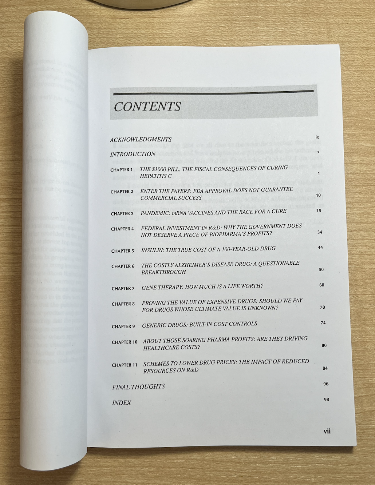

This [book](https://www.amazon.com/Pharma-Profits-Balancing-Innovation-Medicine/dp/1119881331/ref=asc_df_1119881331/?tag=hyprod-20&linkCode=df0&hvadid=598359424988&hvpos=&hvnetw=g&hvrand=16891243433154497867&hvpone=&hvptwo=&hvqmt=&hvdev=c&hvdvcmdl=&hvlocint=&hvlocphy=1018145&hvtargid=pla-1643841214241&psc=1) is one of the best I've read for the entire year. It is a short (97 pages), well referenced, and easily understandable overview of the major drug pricing debates surrounding the pharmaceutical industry. The author, John LaMattina, is a former SVP of Pfizer and President of Pfizer global research and development where he oversaw the drug discovery and development efforts of more than 12,000 employees. It's rare for someone of LaMattina's experience level comment candidly about current issues facing the industry. The book provides a thoughtful and discussion based approach to understanding the industry perspective, considering major milestones and specific examples and case studies throughout. Alongside Peter Kolchinsky's _The Great American Drug Deal_, these two should make up the core of any debate about drug pricing in the United States.

Here are the table of contents:

In this post, we will go through the book chapter by chapter and highlight important points.

- [Chapter 1: The Fiscal Consequences of Curing Hepatitis C](#chapter-1-the-fiscal-consequences-of-curing-hepatitis-c)
- [Chapter 2: FDA Approval Does Not Guarantee Commercial Success](#chapter-2-fda-approval-does-not-guarantee-commercial-success)
- [Chapter 3: mRNA Vaccines](#chapter-3-mrna-vaccines)
- [Chapter 4: Federal Investment in R&D](#chapter-4-federal-investment-in-r&d)
- [Chapter 5: Insulin](#chapter-5-insulin)
- [Chapter 6: Aducanumab](#chapter-6-aducanumab)
- [Chapter 7: Gene Therapy](#chapter-7-gene-therapy)
- [Chapter 8: Proving the Value of Expensive Drugs](#chapter-8-proving-the-value-of-expensive-drugs)
- [Chapter 9: Generic Drugs](#chapter-9-generic-drugs)
- [Chapter 10: Pharma Profits and Healthcare Costs](#chapter-10-pharma-profits-and-healthcare-costs)
- [Chapter 11: Impact of Reduced Resources on R&D](#chapter-11-impact-of-reduced-resources-on-r&d)
- [Concluding Thoughts](#concluding-thoughts)

## Chapter 1: The Fiscal Consequences of Curing Hepatitis C

The book starts with discussion of Sovaldi, Gilead's cure for Hepatitis C. At its core, Sovaldi was to me a marketing mistake. The \$1000 pill is a buzzy and easy target, even though the total price of cure (84k per patient) is 20% cheaper and safer than existing treatments. Here and throughout the book, LaMattina argues that drug pricing should be based on value, rather than cost of development. A major area of miscommunication it seems is the public's general disinterest or inability to understand the base case standard of care. Alternatively, the industry needs to do a much better job of educating the public about the costs of avoiding medication. LaMattina poses several questions that need to be asked when evaluating drug pricing:

1. How does a compound compare to existing treatments (including surgical and hospital based) in terms of efficacy and safety?
2. How expensive are these other treatments?
3. Without this drug, how many will die or have other adverse events?
4. Without the drug, what is the ultimate cost to the healthcare system?

Another issue that is highlighted in this section is the distinction between list and net price. The price paid by a healthcare system is rarely if ever the list price. Rather, the price is negotiated by payers, either the government or private insurers. Competition is always right around the corner, and in the case of Hep C, subsequent approvals dropped the cost in the U.S. to below 30k for a functional cure. This will continue to fall, and soon dramatically so once generics come online.

Finally, there is discussion of what to do about populations like the VA and prison populations. For the VA, the government was able to negotiate a contract such that all veterans were cured for roughly 25k each. For prisoners, even this is too steep. For this, there is the idea of nominal pricing, a pricing mechanism that provides deep discounts to safety-net facilities without disrupting the Medicare market. It is a special discount, and now all pharmaceutical companies have such policies in place. If a certain group of people really can't afford their medication, the industry has safeguards, so long as the major money making market does not get disrupted.  

Curing Hepatitis C should have been a major area of celebration, showcasing the strength of American science. Yet, it is remembered as a debacle. The \$1000 pill is a terrible way to honor the millions of people whose lives were saved.

## Chapter 2: FDA Approval Does Not Guarantee Commercial Success

In chapter 2, LaMattina discusses heart disease and the cost/benefit of LDL-c lowering therapy on top of statins. Physicians recommend lower than 100 mg/dL, which is achievable with statins, but there was the question of whether further reductions were even more beneficial (spoiler alert: they are). But at the time, there were these PCSK9 antibodies from Regeneron and Amgen that were approved based on data that they reduced LDL-c to 30 mg/dL, but not on whether they reduced cardiovascular events. These antibodies had a list price of ~14k, much higher than the price of statins but without the proven benefit (let alone what the magnitude of benefit was). Again, there was fear mongering that these would bankrupt the American healthcare system.

Turns out that given these limitations, the PCSK9 antibodies just didn't sell! 80% of PCSK9 prescriptions were denied by payers, and following an appeal, just 25% were approved for commercial payers and 50% for Medicare. The lesson here is that just because a drug has been approved by the FDA does not mean that payers will pay for it. The key here was that there was no large scale cardiovascular outcome trial (CVOT) that proved clinical benefit beyond just a surrogate endpoint. These are large trials involving anywhere from 10-25k patients, and costing \$500 million - \$1 billion. In order to convince payers, pharma had to pay up for the CVOT. Both did (isn't it great we have drug companies to pay for these large studies? Incentives matter, see the [TAME trial](https://www.statnews.com/2022/08/09/anti-aging-projects-funding-much-discussed-trial-overlooked/)), but because these large trials have uncertain magnitude of benefit, are expensive, and difficult to get exactly right in terms of length, population, etc, the results were unclear. The trials showed that cardiovascular events could be mitigated, albeit at perhaps slightly lower rates than expected, and in one trial, that overall survival was improved.

How to remedy these uncertain results and convince payers to pay? Both Amgen instituted value based contracting where depending on how much LDL-c dropped, the price for the therapy would differ. Amgen and eventually Regeneron in response also lowered the list price to ~6k annually. Still, the Institute for Clinical and Economic Review (ICER), a non partisan non government non profit research group that assesses fair prices for health interventions, thought that pricing should have been lower still, given the cost of infusions from the hospital side (~1k each visit). They benchmarked the annual cost given the benefits at 2-4k annually for all comers and 4-9k if used to treat high risk patients. Another turn in the story came when inclisiran, an siRNA drug that only needs to be given twice a year (versus twice monthly for the antibodies) demonstrated equally impressive reductions in LDL-c in a Phase II clinical trial. Under the brand name Leqvio, this will be priced at \$6,500 annually. After the initial outcry of LDL-c lowering therapeutics bankrupting the healthcare system, the pharmaceutical industry delivered over a two fold price reduction plus a product more convenient for patients.

## Chapter 3: mRNA Vaccines

The next story comes from discussion of mRNA vaccines and Covid-19. As we all are now familiar with, the covid vaccine was a herculean effort that was regularly mocked by editorials in popular press like the New York Times and Washington Post. One such critic was Elisabeth Rosenthal in the NYT, who began critiquing price way before efficacy readouts even came out. Using $500 a dose, she modeled pharma profit as $150 billion, saying that the development would bankrupt the U.S. healthcare system (notice a theme here?). These are straw man attacks that are out of touch with the struggles of everybody else who needed the pandemic to end in order to be educated, feed their families, and see their loved ones. Even if pharma were to profit \$150 billion, it would have been well worth it and a fitting prize for the speed and terrific efficacy of the vaccine effort. As we all know now, the vaccines only cost ~\$40 per course, remarkably cheap, and astoundingly this is less than hospitals got paid for administering the vaccine. Hospitals made more than the companies who invented, tested, manufactured, and distributed the vaccines and nobody said a word.

Early in the pandemic, the Trump administration initiated Operation Warp Speed (OWS), a massive operation to facilitate vaccine development, testing, and distribution efforts. It is a stunning example of how favorable government policies can facilitate tremendous progress in a short period of time. LaMattina draws a parallel to the scale up and distribution of penicillin prior to D-Day in WWII. More than 90% of penicillin shipped and delivered to the warfront was manufactured by Pfizer, saving thousands of lives.

The most successful vaccine developer however, did not take any OWS money. Albert Bourla placed a \$2 billion bet on vaccine development, something that could only happen with the existence of a strong and healthy pharmaceutical sector. They did this to avoid bureaucratic hindrances that may have come from taking government money, and it turns out that they were probably correct, being able to ship the highest volume of vaccines worldwide. OWS and other government entities were still responsible for placing vaccine orders. Across the globe, the largest orders were placed for the AstraZeneca vaccines, because they were the cheapest. Difficulties in the Phase III trials and lower efficacy compared to mRNA led to distrust of these vaccines. Australia deferred purchasing Pfizer vaccines. Getting enough to inoculate 80% of Australians would have cost $780 M, a bargain, considering that Australia is still in lockdown. Pharmaceuticals are not something to pinch pennies over. They are almost always worth the investment.  

A last point that LaMattina talks about was the general spite for the industry even though they were responsible for returning the world back to order. Outside of the general complaining over profits, the reputational harm done to the industry was quite harmful and may have prevented many Americans from going in to get vaccines. There was discussion of voiding the patents, even though this would have done nothing to accelerate vaccine development. If anything now, we have too many doses and it is not as if centers for making the vaccines can be built overnight. Just the machines used to manufacture the lipids cost \$200 million each, and Moderna's plans to create manufacturing sites in Africa are taking at least 3 years. Even down to the packaging pharma was using to ship vaccines, there was [accusation](https://www.statnews.com/2021/05/28/boxed-in-how-a-single-pfizer-decision-disrupted-the-covid-vaccine-rollout-while-boosting-profits/) that pharma was making decisions solely to maximize profits.

## Chapter 4: Federal Investment in R&D

In chapter 4, LaMattina provides a summary of a tired and old argument: that the federal government deserves a share of profits due to the contributions of the NIH. To begin, he describes an exchange between Alexandra Ocasio-Cortez (AOC) and Aaron Kesselheim that AOC tweeted out but later deleted. The [exchange](https://twitter.com/SSWorks/status/1091079715572592640) essentially paints the picture that the NIH is putting tons of money into the development of drugs that eventually become privatized, receiving no return on investment. Derek Lowe writes an article describing why this is an oversimplified view of how drug development works, leveraging his more than 30 years of expertise. AOC later calls Derek Lowe sexist for writing this article.

AOC, Aaron Kesselheim, Marcia Angell, Ron Wyden, and I'm sure many many others all want a return on investment from federal investment dollars. But fundamentally, these aren't the rules of the game. If you want to suddenly change these rules, you'll see a migration of scientists out of the U.S. or a stoppage of collaborative work with the federal government. Do they want Apple to pay the federal government a share of their profits too? Companies already pay taxes, provide job opportunities, and propel the U.S. to become a leader on the world stage in innovation. That is enough.

There was a Federal Technology Transfer Act (FTTA) that allowed government labs to enter into Cooperative Research and Development Agreements (CRADAs) with biopharma companies. The legislation demanded that the price of any resulting product reflect taxpayer investment. Industry avoided such collaborations like the plague, but from these agreements and others the federal government has earned $2 billion in royalty revenue for NIH since 1991. Only when the policy was ended by former NIH director Harold Varmus, did collaborations begin to flourish and allow collaborative new drug discovery to happen between industry and the government. Another factor accelerating R&D was the passage of the Bayh-Dole Act in 1980 which allowed assignment of IP from inventions coming from federally funded research. These policies have established the United States as the world leader in life sciences research by an extremely large margin. A big reason for this is the private sector, allowing investors who fund the bulk of development costs to have returns on their invested capital. If the NIH or federal government owns the upside, there is no reason for follow on capital to invest. Moderna raised \$2.7 billion from private investors before making SpikeVax. The annual budget of the NIH is just over \$40 billion. Xeljanz (tofacitinib) is another story. Researchers at the NIH discovered there was a possibility of JAK being a target for autoimmune diseases but without a drug company to carry on this project from the NIH, there was no way of knowing whether this was a viable hypothesis. Pfizer spent 19 years and $1 billion to validate this hypothesis, eventually coming up with a safe and effective drug for rheumatoid arthritis. The NIH has never developed a drug.

## Chapter 5: Insulin

Insulin is a hot topic and has been talked about enough. I've written about it [previously](https://www.dennisgong.com/blog/Pharma/#insulin-and-epipen). Here, LaMattina provides a couple key points arguing that directionally, things are getting better.

Firstly, there are many different types of insulin, reflecting the iterative improvement of the product over time. The original insulins are quite affordable and can be purchased for less than \$100 a month. For newer insulin analogs, it is still the case that the net cost of insulin is going down, while the list prices keep rising. This reflects increasing revenue capture by insurance companies. This is less a problem for people who are privately insured.

Walmart and biosimilars by Viatris and Biocon are making insulin more affordable. But the clinical trials to verify that these are working as intended take time and money. The original insulins came from injecting ox pancreas extract. The situation is improving and we can't expect everything we want to come at once.

## Chapter 6: Aducanumab

Here, Aduhelm, the amyloid-beta antibody, is presented as another example of the market being unwilling to pay for a drug with uncertain benefits, high cost, and safety risks. To those all throughout the drug industry, this drug has been an absolute negative. It has caused resignations from the FDA review panel and raised questions regarding the nature of the FDA-industry relationship. Thankfully, the approval has been universally denounced. Biogen has cut prices 50%, and some hospitals have banned Aduhelm drug representatives. Payers have been unwilling to pay for the therapy outside of study settings. In some ways, this demonstrates some of the strength of the sector. At the end of the day, critical appraisal won here, and while some desperate patients may be willing to give Aduhelm a try, sales and distribution of the drug has fallen almost completely flat.

Here, who is to blame? Probably the FDA for approving such a poorly supported therapy, especially given the broad label. It does highlight the pressure patient advocacy groups can have and the general difficulty of making these yes or no decisions. Running another Phase III trial in the subgroup to confirm benefit would make sense, but there is always the question of whether Biogen would have paid for it.

## Chapter 7: Gene Therapy

In chapter 7, LaMattina discusses a difficult financial challenge for the industry: how to ease payers into the era of curative gene therapy. How to price these one and done therapies such that they can be fairly compensated for the value that they bring without angering the public is a major challenge. First, we are introduced to the example of Kymriah, the first curative CAR-T therapy approval for patients with pediatric ALL. Realizing the potentially contentious battlefield that could result from the high price of therapy, Novartis priced the therapy lower than analyst expectations (475k vs 600-750k) and also with the stipulation that no payment would be made unless the patient responded to therapy. Given the manufacturing and logistical kinks that had to be worked out, Novartis actually lost money on Kymriah for the first several years of commercial activity.

So how was Kymriah priced considering the value that such a curative therapy could bring? Here, the concept of a quality adjusted life year (QALY) is introduced. Essentially a value of a year of human life, it has been used by payers and appraisers like ICER to determine what a fair cost of a healthcare intervention is. The UK rates a QALY at 50k, and based on previous decisions, CMS and the FDA have used ~300k as a QALY previously, with high variance. The QALY clearly has its critics and rightly so. Even so, with the context that Kymriah is a curative therapy and that payment will be received only if patients respond, the price of the therapy seems quite reasonable.

The chapter also discusses Novartis's pricing of Zolgensma, a gene therapy for SMA at \$2.1 million, making it the world's most expensive therapy. Novartis offered insurers a 5 year payback period of equal annual installments plus refunds if the therapy did not work. ICER, using a range of 100-150k per QALY, gave a value based price benchmark of 1.1-1.9 million, demonstrating that even though the list price ended up being at the high end of the spectrum (net price likely negotiated lower), Novartis did price the therapy within reason. Being a curative therapy, this is a significantly better deal than standard of care maintenance therapies like Spinraza and Evrysdi that cost hundreds of thousands of dollars annually, just for maintenance. Finally, there is discussion of Spark Therapeutics's Luxturna, which treats an inherited form of blindness. This offers another interesting case study of value based pricing. The list price of the one time treatment is 850k, with payments tied to improvement in vision. Pharma has gone great lengths to ensure that therapies are priced fairly and using pricing mechanisms that ensure benefit to the healthcare system. Gene therapies will not bankrupt the U.S. healthcare system after all.

## Chapter 8: Proving the Value of Expensive Drugs

Chapter 8 brings us back to the FDA, and the difficult decision they have in appraising drugs for accelerated approval. Accelerated approval was a policy established in 1992 in response to the HIV/AIDS crisis, and allows for earlier approval of drugs that treat serious conditions, and that fill an unmet medical need based on a surrogate endpoint. These have frequently been used in the context of oncology, where molecular biomarkers are plenty and there are few treatment options. The FDA has a difficult position where there will be therapies approved under the accelerated pathway that do not offer clinical benefit, are expensive, and don't get pulled from the market because confirmatory trials are not done or convoluted. However, the cost of denying patients potentially life saving therapy is also incredibly difficult to deal with.

Here may also be an area where value based pricing plays a role. One example in oncology is Pfizer's Xalkori, which is a targeted kinase inhibitor with more than a decade of clinical use. Pfizer will refund the entire cost to any patient and healthcare plan should the medicine fail to work after three months of treatment. Value based pricing would certainly incentivize companies to only develop drugs that have a meaningful chance of improving the standard of care. However, for difficult to treat diseases like pancreatic cancer where the chance of a response is already incredibly low, it may provide a disincentive for development. There needs to be a method of incentivizing development for hard to treat diseases, otherwise patients will continue to be SOL until the end of time.

## Chapter 9: Generic Drugs

Similar to the insulin chapter, this story has already been run through quite a bit. LaMattina does the usual rehashing of how generic drug makers enable the biotech social contract without needing to regulate the industry with price controls. Greater use of biosimilars and increased me-too competition just via the passage of time should further deflate drug prices.

## Chapter 10: Pharma Profits and Healthcare Costs

Are biopharma profits driving increases in healthcare costs? This is the question LaMattina answers in chapter 10. The answer is a resounding no. Unlike hospital procedures, there is a built in cost control mechanism for drugs. Hospital procedures see the continual increase in cost by about 5% annually, outpacing inflation. Spending on pharmaceuticals has squarely been in the 12-14% range. While prescription drug spending has been flat or decreasing, hospital care spending has increased. Medication is by nature priced to bring value to the healthcare system. They reduce expensive procedures and are a critical pillar of preventative health. For high risk individuals, ideally we should maximize the use of medication. Just like we strongly recommend vaccines, we should be strongly recommending early medication for diabetes, heart health, and perhaps even obesity.

From a financial point of view, biopharma companies are rarely profitable. Only 14% of publicly traded biopharmas showed positive net income compared to 65% of companies in other industries in 2017. By return on equity and internal rate of return measures, the biopharmaceutical industry is squarely average.

## Chapter 11: Impact of Reduced Resources on R&D

This was my favorite chapter, because it flows naturally from LaMattina's experience as President of R&D at Pfizer. It discusses how unfavorable government regulations like price controls may impact R&D budgets across the industry. The bottom line is that lower revenues mean that jobs will be lost and that future innovation will be hampered. One example that LaMattina provides from personal experience came from a $1 billion R&D budget shortfall at Pfizer due to the failure of a potential blockbuster drug in clinical trials. Pfizer closed 2 research sites in France, one in Japan, and one in Ann Arbor Michigan. The Ann Arbor shutdown cost 2200 jobs. Pfizer shut down major research areas in metabolic diseases, CNS, infectious disease, and allergy and respiratory disease.

It is estimated that the industry spends $160 billion each year on R&D (NIH spends $41 billion), which represents 25% of revenues. How will the incentives for drug development shift if price controls drastically reduce revenues? The early stage ecosystem would take a hit because companies would need to focus on late stage programs with more concrete revenue potential. Startups who operate with borrowed money won't be able to raise money (why invest in biotech when software is so much easier!). It will be more difficult to justify programs which require long and expensive clinical trials to prove therapeutic benefit. Therapeutic areas like cancer, rare diseases, and vaccines would thrive, but cardiovascular diseases, diabetes, and obesity would take a hit. The CBO estimates that the newly passed inflation reduction act will cost 59 drugs over 3 decades. Another estimate from the University of Chicago estimates 167-342 fewer new drug approvals through 2039.

## Concluding Thoughts

Every time I talk to my friends about my goals to develop drugs in the future, the first thing they ask me is if I plan on jacking up the price. Short of having a long discussion with them about how pricing in the drug industry happens and why it is quite fair given the benefits and costs, there is little to do except smile and agree. Drug development is an esoteric subject that to me seems like magic. You need lots of luck, and there are so many aspects to it that it is unfathomable for one person to execute individually; science is a team sport. Yet, to the general public it is an inevitable churn, drugs will come no matter what the circumstances. Some genius somewhere will always be responsible for it.

<figure>
	<blockquote>
		
If you look at the industry's return on investment, this industry's performance is about average across similar sectors. Yet there is nothing average about the benefits biopharma delivers.

	</blockquote>
</figure>

Working for pharma is selling your soul and makes you a less respectable person. But if you toil away in academia trying to come up with ideas, people think you are wasting your time, short of winning the professor lottery. There isn't really any recognition for the hard work that you do for society. No one knows who developed statins. There is no biography of Paul Janssen. It is unfair to be fairly compensated for these contributions to society. The average software engineer makes twice the salary of a seasoned staff scientist.

As timely as this piece is, it is far from comprehensive. [Jack Scannell](https://www.forbes.com/sites/matthewherper/2015/10/13/four-reasons-drugs-are-expensive-of-which-two-are-false/?sh=2d8ad9664c3b) and [Derek Lowe](https://www.science.org/topic/blog-category/drug-prices) have both written extensively about this topic. The drug developer's required reading list should probably include this book. Others that are good candidates include:

1. Malignant - Vinay Prasad
2. Genentech: The Beginnings of Biotech - Sally Hughes
3. When Breath Becomes Air - Paul Kalanithi
4. The Billion Dollar Molecule - Barry Werth
5. Bottle of Lies - Katherine Egan
6. Hood: Trailblazer of the Genomics Age - Luke Timmerman
7. Antidote - Barry Werth
8. Science Lessons - Gordon Binder
9. The Great American Drug Deal - Peter Kolchinsky
10. Her-2: The Making of Herceptin - Robert Bazell
