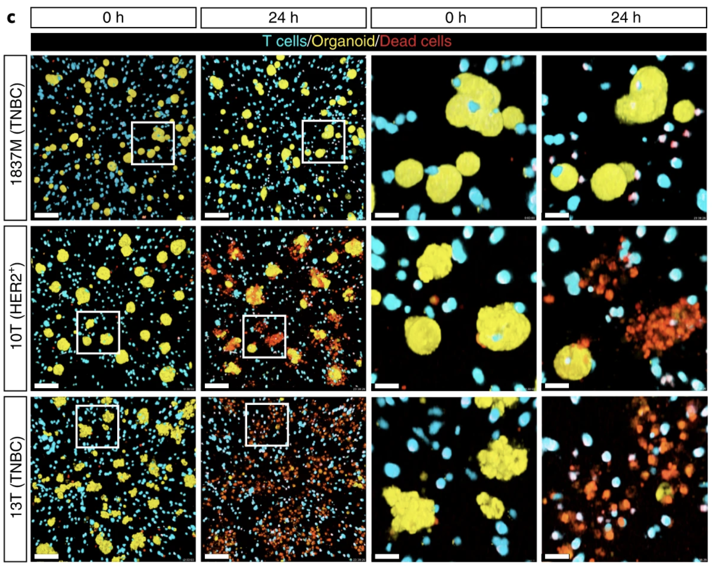
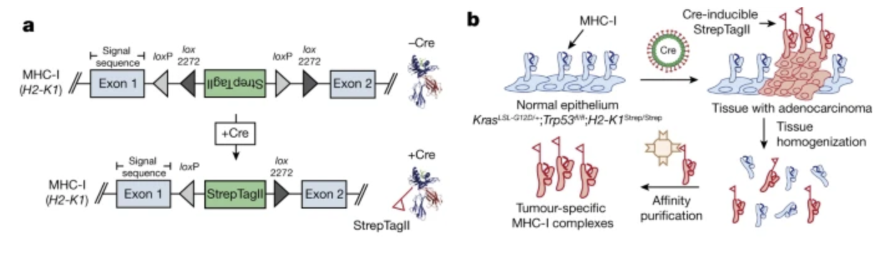
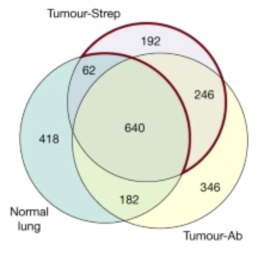
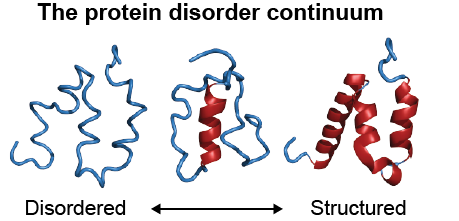

I'm starting grad school this week which means I'll be spending a lot of time reading papers. My OneTab is filled with interesting papers I never get the chance to read. As a method of churning through this backlog, this will be an ongoing series.

### Uncovering the mode of action of engineered T cells in patient cancer organoids

Published recently in [Nature Biotech](https://www.nature.com/articles/s41587-022-01397-w) by authors in the Netherlands, Dekkers et al developed a method of combining microscopy, sequencing, and organoids to study T cell anti-tumor activity. They engineered T cells with a gamma delta receptor (TEGs) and live imaged them to see activity against a [library of breast cancer PDOs from Hans Clever's group](https://www.sciencedirect.com/science/article/pii/S0092867417313193?via%3Dihub). They found that there is patient level heterogeneity in treatment response that is conserved over multiple passages. Still, TEGs kill different tumor types including midline glioma and head and neck cancer.

They identified unique subpopulations of TEGs with imaging.

_"Patterns varied from inactive behaviors (dying, static and lazy) to active motility (slow scanner, medium scanner and super scanner) and organoid engagement (tickler, engager and super engager)"_

Next, they combined transcriptomics with behavioral readouts, termed behavior guided transcriptomics. Most prominently, they find that neural cell adhesion molecule 1 (NCAM1) is linked to super engager behavior. Compared with CD4+ TEGs, CD8+ TEGs were shown to be more potent tumor-targeting cells with profound serial killing capacity. Single CD8+ TEGs were able to kill entire organoids (up to 18 cells in 11 h). Finally, they find that IFN-β primes PDOs for targeting by TEGs by increasing sensitivity.

The [supplementary discussion](https://static-content.springer.com/esm/art%3A10.1038%2Fs41587-022-01397-w/MediaObjects/41587_2022_1397_MOESM1_ESM.pdf) was the most interesting part of the paper. The authors suggest that a clinical regimen of IFN-beta followed by a mix of CD4/CD8+ TEGs sorted for NCAM1 positivity may have broad applicability across a range of solid tumors types.

### Deciphering the immunopeptidome in vivo reveals new tumour antigens

Out of the Jacks lab and [published in Nature](https://www.nature.com/articles/s41586-022-04839-2), Jaeger et al develop a technology to find more tumor antigens. They use the Jacks lab KrasG12D mutant p53 floxxed mouse and engineer this model such that there is an affinity tag attached to the MHC-I molecule. The MHC-1 complex is a trimeric protein consisting of heavy chain (H2-K and H2-D in C57BL/6 mice, HLA-A, HLA-B and HLA-C in humans), a light chain (β2 microglobulin) and a peptide (generally 8–11 amino acids in length).

MHC-I-associated peptides, collectively known as the immunopeptidome are limited to in vitro investigation or bulk tumor lysates. To isolate peptides from bulk tumor lysates, MHC-I complexes are pulled down using nonspecific antibodies that get contaminated by peptides from tumor-infiltrating immune cells and other stromal cells in the microenvironment. As expected, they show that there are differences in peptides detected using antibody based MHC pulldown in normal tissue versus tumor tissue versus Strep affinity based pulldown of MHC in tumor tissue.

Using the empirical affinity purification method, they identified this alveolar type 2 (AT2) phenotype in cre induced cancer cells. As expected, the immunopeptidome changes through time to reflect tumor evolution and other phenotypic changes.

Another finding using their lung adenocarcinoma model was that using mRNA or translation efficiency (TE) to predict epitopes was not accurate. Only 39 out of 312 mRNA predicted epitopes were replicated using Strep affinity pulldown, and only 4 out of 312 for TE compared to the empirically identified peptides.

Eventually, they discover a few immunogenic antigens that seem to be able to induce an immune response when loaded in a dendritic cell cancer vaccine.

At first I was kind of amazed at this paper but after reading I think it leaves a lot of unanswered questions. Why is immunotherapy not working? What is the actionable insight? I'm always curious, are the tumor antigens the same from mouse to mouse, and is this a relevant discovery platform for human tumors. What is the difference between doing this and doing TIL TCR sequencing? But anyway, this paper seems like more of a methods paper.

### Potentiating adoptive cell therapy using synthetic IL-9 receptors

Sometimes I ask myself whether it's a lack of targets for solid tumor cell therapy or that our cell therapy product just simply isn't good enough. This [paper published in Nature](https://www.nature.com/articles/s41586-022-04801-2) makes me believe the latter.

This is a collaboration between Chris Garcia and Carl June's labs, integrating a synthetic cytokine receptor that selectively binds to a mutant form of a native cytokine. The purpose is to use an 'orthogonal' protein to selectively enable cytokine mediated expression pathways.

Why IL-9? Part of the reason was that it wasn't well studied in T-cells. It shares a common gamma chain with the IL-2 receptor, allowing them to repurpose the Garcia lab's existing orthogonal IL-2 molecule that has well defined properties. What they found was somewhat surprising. T-cells stimulated through the orthogonal IL-9 receptor (o9R) ended up having a Tscm phenotype, a subset known for anti-tumor efficacy. There was also enrichment of genes associated with T cell activation and effector phenotype and a favorable Jun/Fos ratio.

They end up testing these oR9 stimulated cells in several preclinical solid tumor models including B16 melanoma and mesothelin PDA. Finally, they show that these cells are resistant to exhaustion by conducting successive incubations of human engineered cells with pancreatic cancer cell lines.

### Modulating biomolecular condensates: a novel approach to drug discovery

This is a [review article](https://www.nature.com/articles/s41573-022-00505-4) by Mark Murcko and other scientists at Dewpoint Therapeutics, the SoftBank funded startup with almost \$300 M raised.

The interest in drugging condensates is the observation that there is phase separation in the protoplasm of the cell. This seems like a core aspect of biology that just hasn't been figured out yet. Notable more well characterized examples include the centrosome, nucleolus, and stress granules. However, phase separation as a biophysical phenomenon may have central importance in a whole host of other processes in both health and disease that has yet to be explored by our latest tools. There's a possibility that once we understand the rules of condensate formation, we can figure out how to perturb them and manipulate them for therapeutics applications.

A central player are proteins with intrinsically disordered regions that help structure condensates, presumably by tangling up with each other.

Condensates may be at the center of how some genes are regulated. The high-density assembly of proteins at super-enhancers is now understood to constitute transcriptional condensates that drive gene expression. RNA binding proteins and their interactions may be at the center of controlling how often mRNA gets translated -- the missing layer between mRNA expression and protein expression.

Several different approaches to drugging condensates include:
1. Modulating the condensate scaffold
2. Modulating the condensate composition
3. Modulating the interaction landscape within the condensate
4. Degrading the condensate interactions
5. Modulating condensate regulatory processes

New tools for condensate discovery include:
1. Proximity labeling to map condensate composition and formation
2. Advanced microscopy methods
3. Algorithms to predict whether proteins will phase separate
