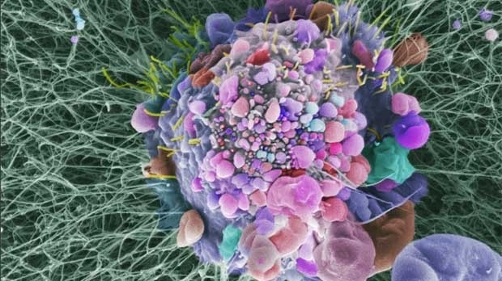

One of the issues I've had with all these new tools for studying biology is that the immediate conclusion from all of them is simply heterogeneity, and heterogeneity is not something that is immediately useful. Now I've realized that we're going to solve for heterogeneity using the law of large numbers. 

A poor understanding of heterogeneity unveiled by new assays shouldn't be surprising. Just because the results aren't currently interpretable doesn't mean that they are not worth pursuing. We just need to be comfortable with burning large amounts of money on them. It's why we are going to start seeing a new generation of drug targets come out of academia rather than companies. How much sequencing you can buy with a launch round today will not compare with what academia can provide over the next 20 years. More than anything, a launch round is a bet that we have reached saturation with what academia can provide. What we need to become comfortable with is that the benefits of any new tool will be felt at the long tail, only after a cloudy and expensive investment. 

The only tool that has reached such saturation seems to be GWAS, and with great effect. A [recent GWAS](https://www.nature.com/articles/s41586-022-05275-y) of genetic variants associated with human height showed that all we needed to understand the missing heritability was more samples. The [UK Biobank](https://www.ukbiobank.ac.uk/) and [Regeneron Genetics Center](https://www.regeneron.com/science/genetics-center) have contributed greatly to our understanding of human disease and health. [Veera Rajagopal](https://twitter.com/doctorveera) writes on Twitter and SubStack about what GWAS has given us. 

In some cancers, bulk DNA sequencing is close. In 2014, the Broad released a [paper](https://www.nature.com/articles/nature12912) showing that you can get a saturated map of all somatic mutations with on the order of 10^3 matched samples. The issue I have with this is that this assumes that there are no confounders which is certainly not the case. Differences due to sex, race, especially stage, and so many other variables may produce separate lists of mutations. But overall in cancer, our ability to perform adequate data science leaves a lot to be desired. 

***

A tumor that is 1 cubic centimeter (weighing just 1 gram) has approximately 10^9 cells. Its quite disappointing that we only are able to sequence up to 10^6 of them if we are lucky. How are we to understand anything if we only are assaying 0.1% of the cells? Even more disappointing is that when we do single cell sequencing, the data is incredibly sparse. We have on the order of 10^5 mRNA molecules made of 10^4 different transcripts. Each cell has on the order of 10^7 proteins. The number of reads we get in a single cell is only on the order of 10^4 so we need to do a bunch of imputation and math to say anything meaningful. Capturing everything experimentally is the way.

There are many public repositories being built and utilized. 

- The [__Human Tumor Atlas Network__](https://humantumoratlas.org/) is a new NCI funded initiative trying to collect 3D atlases of tumor evolution. 

- The [__Broad Institute Single Cell Portal__](https://singlecell.broadinstitute.org/single_cell) contains single cell sequencing data from many tumors and acts as a repository.

- The [__TCGA__](https://portal.gdc.cancer.gov/) is a general data portal containing a lot of whole exome sequencing, but also RNA-seq, targeted sequencing, and other newer assays.

- The [__cBioPortal for Cancer Genomics__](https://www.cbioportal.org/) is another repository, primarily for sequencing data from published papers. 

- [__COSMIC__](https://cancer.sanger.ac.uk/cosmic) is a comprehensive catalog of somatic mutations in cancer.

- The [__Broad Institute Tumor Portal__](http://www.tumorportal.org/) contains data from the 2014 saturation paper where tumors from 21 different cancer types were sequenced to find a saturating list of cancer associated mutations.

- [__Depmap__](https://depmap.org/portal/) is a profiling project of cancer cell lines to identify genetic and pharmacologic dependencies and biomarkers. 

- Finally, the [__Connectivity Map__](https://clue.io/) is a reference collection of gene-expression profiles from cultured human cells treated with perturbations, together with pattern-matching software to mine these data. 

These are all nice first steps, but variations in data quality and formatting provide some difficulties. In addition, if I have a sample of a tumor, I also want to know everything else about this patient. What the treatment history has looked like, whether there was a family history, diet, exercise, recent travel...everything! Treating each patient as a patient. It would be great if there was a giant table with all of these clinical characteristics that I can sort and pull sequencing data off of effortlessly. Holistic data.

In addition we need to be better at preserving specimens and developing tools that extract as much information as possible out of each sample. If there are rare tumors, we don't have many opportunities to understand what drives them before the next time we need to treat someone. Even for tumors that are classified as 'common', there are so many things that can affect the makeup of the tumor that if we continue to slice and dice, we can call anything rare. This isn't something to get discouraged by, but rather another place where we can solve for heterogeneity with high content sequencing assays. Lung cancers in stage IV after 6 lines of therapy are also rare samples. These are still quite important and may provide answers to how tumors are shaped by successive rounds of treatment. We need to understand what remaining molecular alterations are there, what continues to drive the tumor, and what can be further targeted.

I want the 'molecular cause of death' for every patient. It can't be the case that a patient is resistant to all the types of therapy we have for cancer. And if they really are, how can we mitigate that? Thinking of cancer from an evolutionary point of view, we should be able to continue thinking of new orthogonal ways to outsmart cancer. At the very least, we should be able to understand why the cancer progressed and what we can do to make sure that the next patient with the same tumor has a treatment option. Tumor heterogeneity is a feature, not a bug. There are so many 'handles' to grab onto and use to develop therapies.

Just keep sequencing. There is always another layer to unravel, new therapies are on their way.

