The end of the year has come upon us again! This year, instead of writing a month by month story, I will opt for a more regimented list of accomplishments, learnings, and hopes for the future. Unlike last year, I don't really need to think too hard to know that this was again the best year of my life so far. Thank you to everyone that made that the case, feeling very lucky going into 2023!

### Major Accomplishments

The first thing I'm proud of is actually meeting all of [last year's](https://www.dennisgong.com/blog/2021/) goals. These included less Zoom, not caring about stock performance (though somewhat to my detriment this year), and not doing projects I didn't care about. I wanted to spend more time with friends, prove to myself that I can be a productive scientist, improve my physical fitness, gain 100 ELO in chess, and keep up with all other hobbies. I actually did do all of these which means I need to be more ambitious with goal setting. But outside of these, I found there were three areas of personal growth which stood out, again sparing many personal details which in many ways outweigh all of these.

Most importantly, I felt like I always had something to look forward to. Each day except for a stretch during the summer felt unique and exciting. I had lots of new experiences, and I made time for people. I became much smarter overall, got better at writing, and saw things clearer and described things more concisely. 

#### 1. Scientific Development 

The number one goal to myself for this year was to prove to myself that I could be a talented and productive scientist. Naturally this type of doubt comes when applying for fellowships and graduate school but I felt that especially with the Covid lab shutdowns, I didn't have time to prove that to myself during undergrad. I spent a lot of my time exploring different activities like clubs, TAing, working at startups and other jobs, doing VC work, and even trying to be premed. I certainly did not have the depth of knowledge that other science focused undergrads seemed to have. 

Getting into graduate school in the Harvard-MIT HST program plus the NSF Fellowship was quite a big step towards me believing that I could do good work. Another major confidence boost came from my half year stint at Vaccitech, where I learned how to do flow cytometry, ELISA, and developed IHC staining capabilities for our lab group. Getting used to running these assays routinely and collecting useful data without messing up was very gratifying. In the Fall, I had two first author papers get published, the first work that I did from start to end. In May and in November, I went to the AAI and SITC conferences where I learned a ton about the state of the field in immunology and cancer. They helped me figure out where is exciting to me and where I might potentially have a competitive advantage. For me, this is probably going to be something multidiciplinary -- applying molecular engineering towards clinical problems. 

And then in the Fall, I did my first lab rotation in Jonathan Weissman's lab in the Whitehead Institute. It was a fantastic training experience where I learned a lot about how a successful lab is run and the many interesting questions that can be addressed in academia. Another confidence booster was being responsible for my own experiments, and giving a lab meeting presentation. The most impactful thing though was spending the time in the library reading papers beyond surface level understanding and coming up with ideas and questions. The act of formulating questions, checking if they have been already been answered, and reaching for the next question, was actually my favorite part of the semester. The classes I took were excellent and helped me immensely, even while not directly applicable to my research.

#### 2. Physical Fitness 

Starting from the first day of 2022, this goal can only be classified as a success. I ran a half marathon each of the first 5 months of the year, including on New Years Day. That's up from 1 I did in August 2020. I was in a state where if I wanted to I just got up and ran 13 miles. Or if I wasn't feeling well mentally I would wake up early the next day and go run 7 miles at 5 AM. Then later in the summer when it was too hot to run outside, I was crushing weight lifting goals, at my peak being able to shoulder press a plate (135 lbs) and bench two plates and a bit (235 lbs). I got into bouldering and rowing, and started biking to class once I started grad school. For the year, I went on 83 runs, lasting 46 hours, and covering 313 miles. My proudest run was an April half marathon that I finished just over 1:56.

I was in the best shape of my life, and then I wasn't. I got covid which sucked cause I couldn't go outside, and then when I recovered it was summer, making it too hot to run outside. Once I got to grad school, it was hard to keep back up with the old routine given that classes and research were more intense and having lots of new things to do made getting a routine more difficult. A large part of this has to do with acclimating to a new environment so I'm quite confident that any lull is temporary.

#### 3. Making a transition

This last part is something that I haven't really dealt with thus far in my life since I've essentially only been in Baltimore for an extended period of time. But for the first time, I've been able to explore a new city full of new opportunities and unknown potential. Being able to explore from scratch all the new activities, restaurants, and neighborhoods that Boston and Cambridge have to offer has been quite a happy experience. Being able to take care of myself and stay in touch with others while making new friends and habits was challenging at times but now looking back has been a successful and fulfilling time.

At the same time, it has been the first time I've had to deal with feeling homesick. Not feeling at home definitely impacts your motivation and mood, and makes you appreciate home that much more. Overall, a good thing to experience. Through it all, I'm proud that I was able to continue reading, writing, and learning. 

### Learnings

Perhaps the biggest learning adulthood gives to you is to have a lot more personal self respect. I've never felt less FOMO and its become increasingly easy to deal with this in moments when it creeps through as I've become more specialized. If someone is rude to you in any way, you should take it as a negative sign for a future relationship and the onus should be on them to repair any breach of respect. In the same vein, you should have the personal respect to yourself to not deal with such people anymore, and any sacrifice to your own career as a result you should be willing to make up elsewhere. 

You also begin to realize that you no longer have to worry about being 'smarter' than other people. This mentality develops as you begin to noticie your own brilliance and realize when other people are out of their depth of knowledge. It's all about finding your niche. I think everyone should find something that whenever they walk into a room, they know that they are the best at. For me, it is usually a hobby like Chess or tennis or running etc., but sometimes when it is science related, it feels really fulfilling.

In terms of advice, I've learned that the truth is always fuzzy and subject to one's personal experiences. The only advice I will take is if someone has spent the time to look at things from my perspective and put themselves in my shoes, or if I can faithfully put myself in someone else's shoes.

If you want to be knowledgable and smart in an area, there are two ways of making it happen: either working harder, moreso than your peers. Or, simply showing up and being there through time. The first option is at the expense of your emotional and physical health, and you will no longer be able to sit through conversations with your peers without getting antsy. However, people do eventually notice, and it will open up your career to outsized benefits with asymmetric upside. On the flip side, simply showing up really does work. Essentially every mentorship talk you go to these days is a person telling the audience they are really stupid but they somehow ended up in this high position. In order to be foundationally groundbreaking though, I think you need a combination of the two.

Setting the tone is incredibly important. I definitely noticed loss of some momentum mid-year with covid, and I think once you do lose your momentum it is easy to get into a bad streak of getting disappointed by things. The best way to stay in control of this is focusing on yourself and not deriving too much excitement from things that are ultimately not in your control. Somewhat related to this point: there is a ton of unappreciated learning from Wikipedia and Youtube. If you can't bring yourself to read papers, binging talks on Youtube can lift you into a productive state.

I've done a 180 on my opinion of VCs. I used to think, "wow they are so smart and cool and they get to meet a bunch of people and learn from them". But now I realize that you can really only learn from people if your head is there too. VCs are simply allocators of capital, and while I think they are good at arbitrage, I have a hard time believing that they can predict the future. I think the next generation of top investors does not come from Gen Z but comes from seasoned executives. Now especially, I have a list who I would never raise money from.

Hate to be that guy but I'm going to be that guy. Harvard/MIT is an unmatched training environment with so many unfair advantages that I now fully understand why a PhD from here is more valuable than a PhD elsewhere. My favorite lectures were from Mark Murcko, Alice Shaw, Vamsi Mootha, Mark Price, and Loren Walensky. Each of these talks dramatically improved my mood for the day and gave me energy and excitement for my research. Even the dogwater lectures were from top executives like Sam Kulkarni, CEO of CRISPR Therapeutics. Every morning when you walk through Kendall Square you are surrounded by conversations about the latest new science. It is the highest density of Nobel Prize winners. Everyone is working on CNS caliber work, and everyone expects those kinds of results. It just seems like everyone here is one experiment away from changing the world, and talking to people here you really believe it. Also, Cambridge and Boston are beautiful and the campuses are so cleanly and elegantly designed. I love it here.

Regarding student archetypes at Harvard vs MIT vs Hopkins, I do see some clear differences. Across all three, people are clearly over medicated on caffeine, but potentially moreso here. Lately, I have seen some of the most jittery people just completely incapable of performing without their magic drink. When I walk around the library, it does seem that people at MIT are just working on more complicated stuff. Lots of code and math. Lots of actual work being done wheras people seemed more distracted at Hopkins. Across Harvard vs MIT, I have a bias towards liking the vibe of MIT students better but both are obviously very talented. At the same time, people who are 'brilliant' are still a minority, especially in the medicine related courses. The conclusion I've drawn is that people from top schools aren't necessarily harder workers but they are more or less guaranteed to be good communicators. 

### What's next, 2023?

In 2023 I will be 23 years old. This feels like the first post-college year given that all my friends and classmates have graduated by now. In the adult world, it is becoming more clear that nothing really matters anymore, except for what you care about. There isn't really a need to prestige hunt anymore or to do whatever you can to preserve optionality. Ideally, you should be there already, doing what you want to be doing. On that note, I really love grad school and am very happy to make that my primary focus for the next several years. 

Focusing on academics in a time where science is moving incredibly quickly and academic institutions are improving rapidly seems like a strong bet. Even working at a startup feels slow and too rigid in comparison to working in a top lab. Working in early stage venture is pretty brain dead. Potentially focusing on broader markets with sector wide coverage seems interesting but it seems like being much more of an observer rather than a doer. Finally, doing medical, law, or other non-participatory type of schooling at the cost of delaying work seems like missing the boat a little bit. At least this is how I've justified my decisions!

#### Goal Setting

A couple to focus on:

1. I want to seriously use my phone less. I've somehow been averaging about 4 hours of phone use daily which seems absurd. The goal will be 2.5 hours daily in 2023.

2. Probably less music consumption. I'm in the 98th percentile for 2 straights years now. It probably isn't great for my ears and also not for my productivity. Shooting for 85th percentile this year.

3. Obtaining mentors to help with intellectual growth and career planning. This one will be easy as being a graduate student automatically gives you mentors :)

4. Not very measurable, but broadly I want to be better at denoising feedback. Knowing when to focus on the forest versus the trees I think just takes a lot of experience.

5. Its going to be weird being full stop focused on science without worrying about the next thing. Hopefully without distractions I want to prove to myself that when I am 'immersed' the work product is better, and that I can work on impactful science, not just paper mill science. The big theme for 2023 will be focus. 

6. Last year I ran 5 half marathons, hopefully this year I do at least 3. I will try to get a 6 minute mile. 

### Pictures

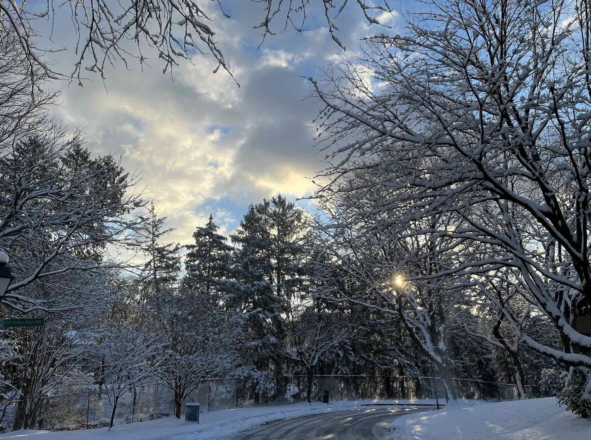
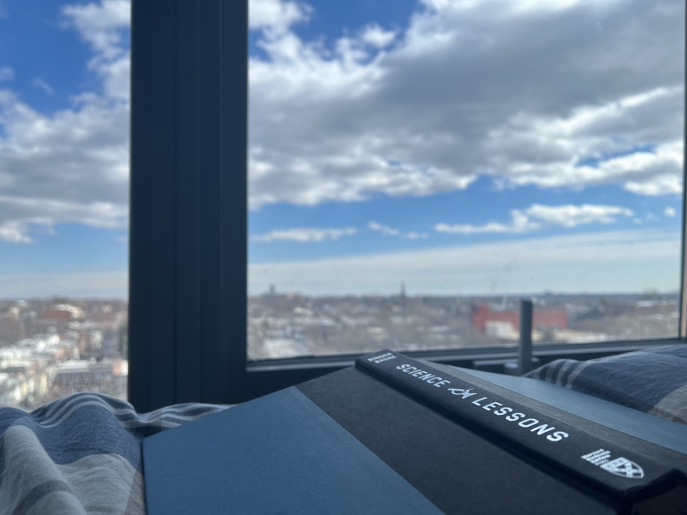
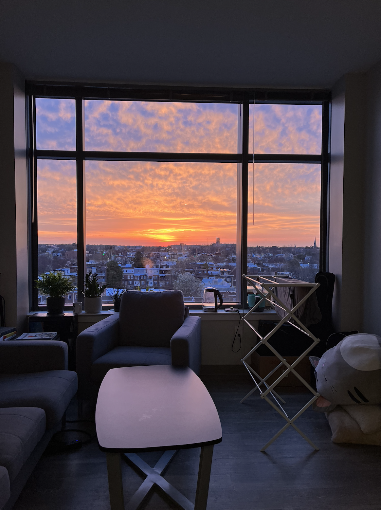
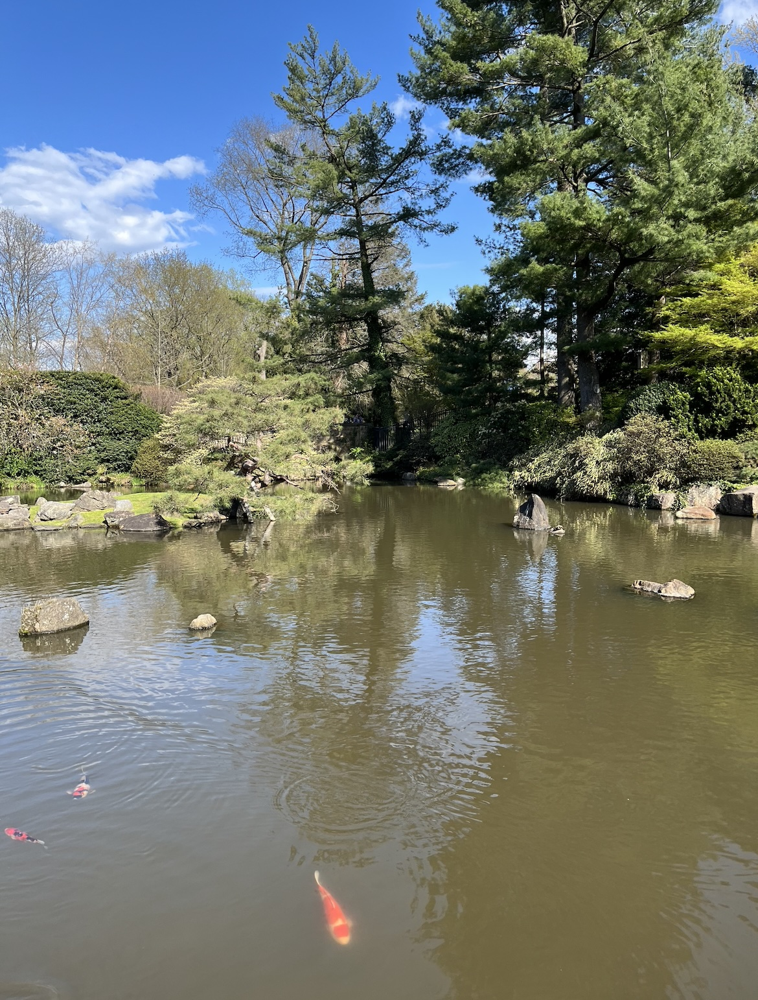
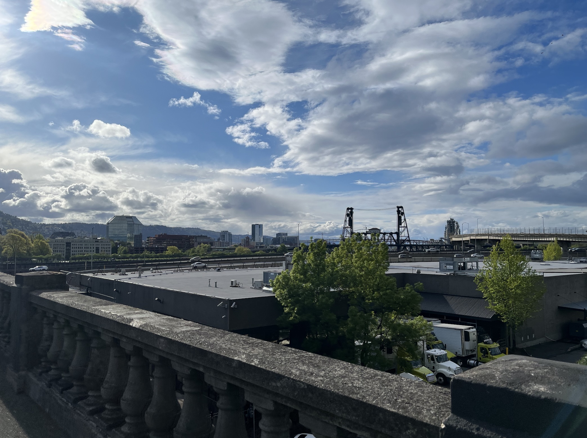
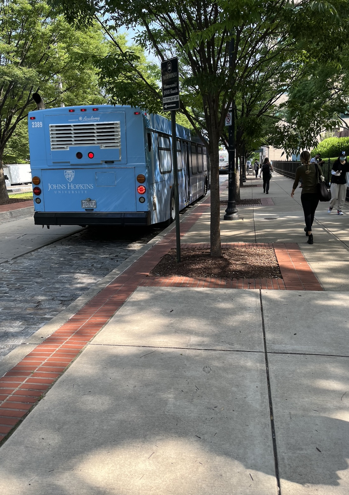
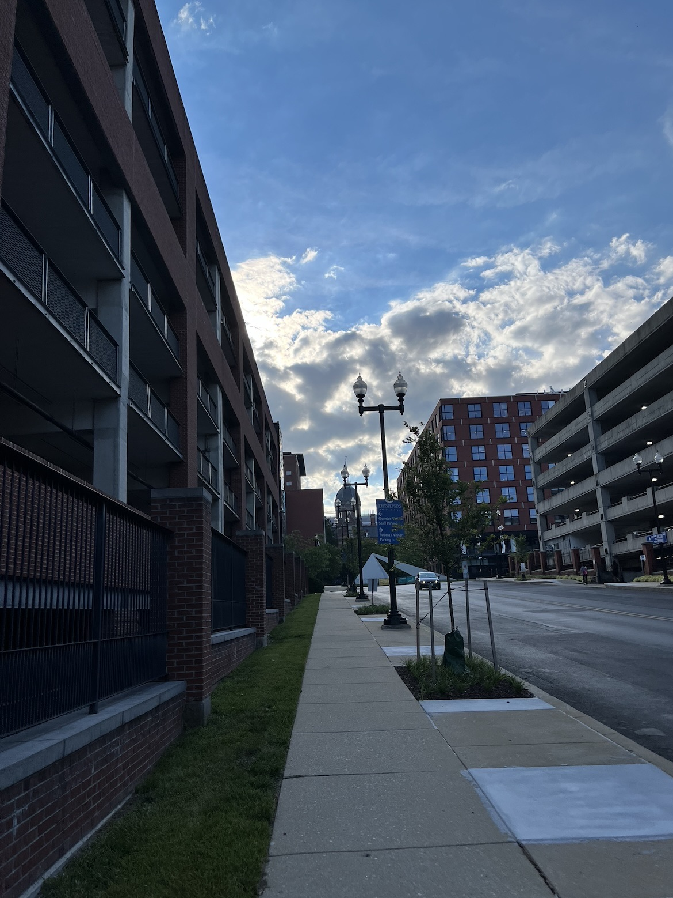
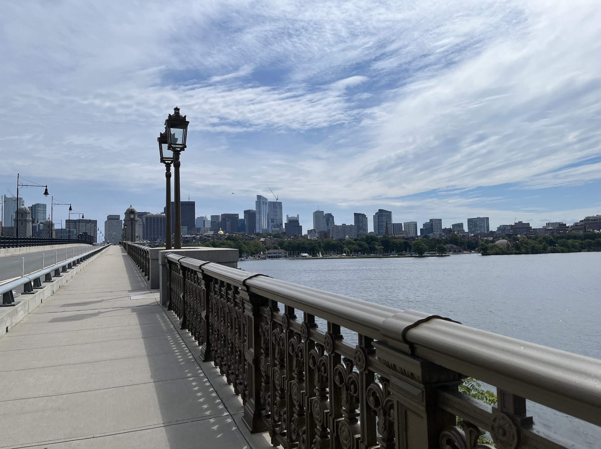
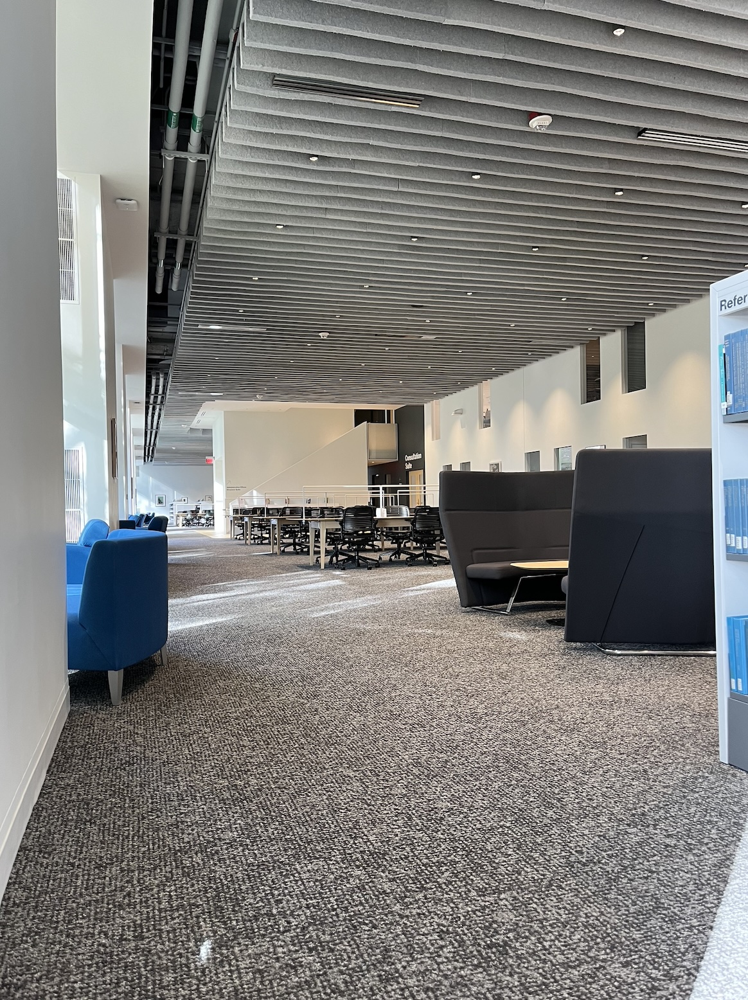
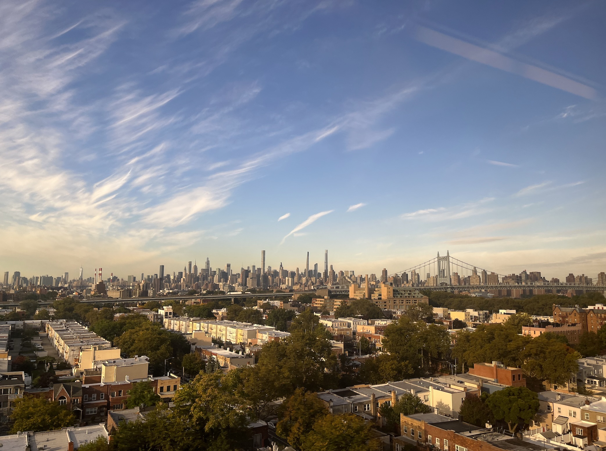
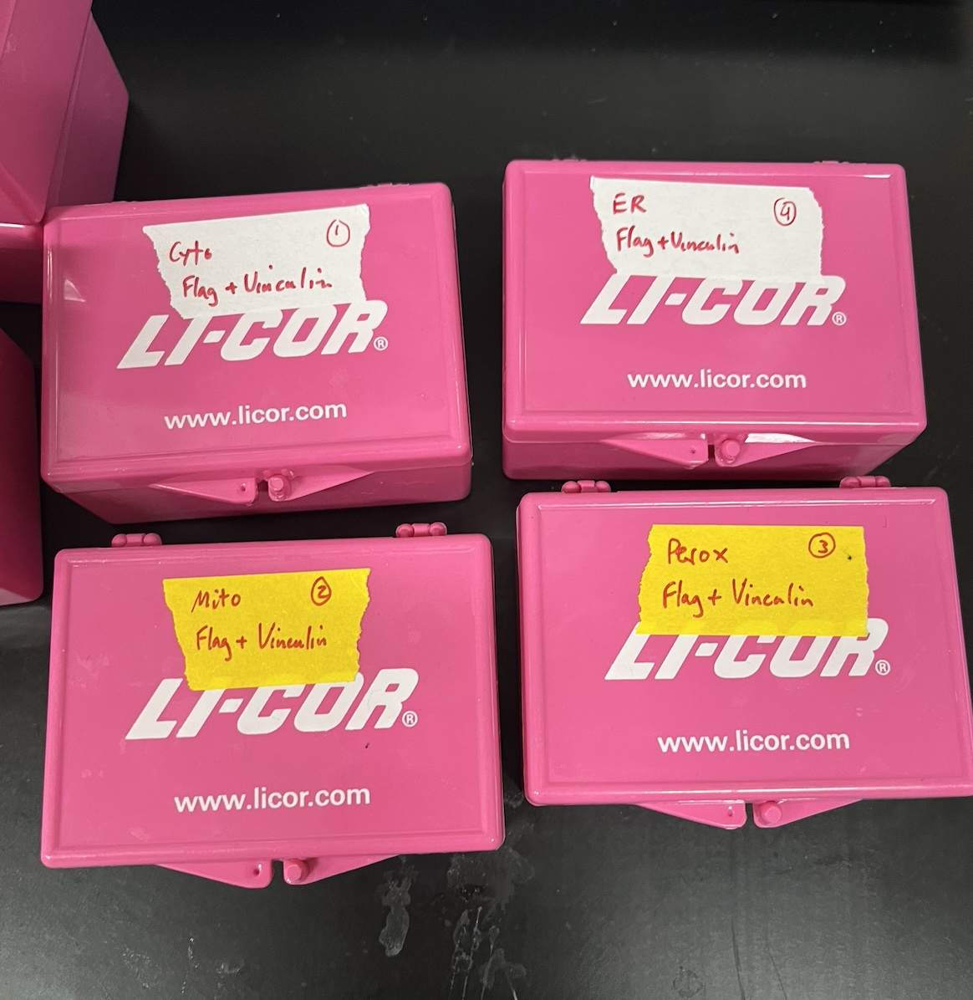

