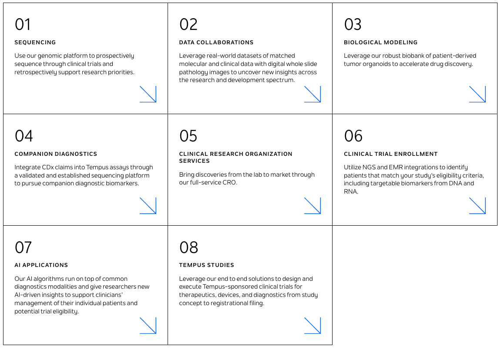
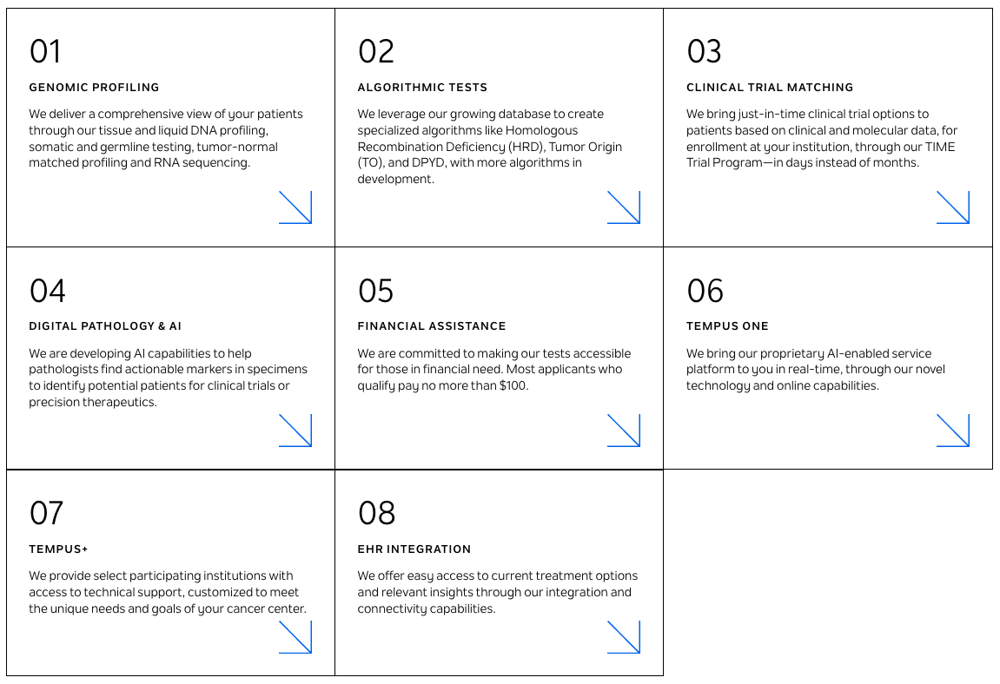

Tempus Labs is perhaps the largest private AI precision medicine company. 

In this post, I hope to answer questions such as:

1. What is the company doing?
2. How do they do what they do?
3. What new capabilities are unlocked by Tempus's scale?
4. Who is building Tempus and who wants to work there?
5. Where will Tempus be going in the critical next five years? (and will they make money?)

*** 

Tempus labs, based in Chicago, was founded in 2015 by former Groupon co-founder and CEO Eric Lefkofsky. As of this writing, he is 53 years old and worth north of \$4 billion. Lefkosky is a serial entrepreneur that made much of his wealth in advertising (Mediaocean, InnerWorkings, Starbelly) but also in freight logistics (Echo Global Logistics). His inspiration for starting Tempus comes from his wife being treated for cancer and the realization that integration of data into healthcare decision making has not been as straightforward as one might assume.

The company was exploring an IPO in early half of 2022, and was valued at \$8.1 billion at a recent funding round in 2020. With another \$275 million raised at the same share price in H2 2022, the company has raised via previous investors and debt financing, over \$1.3 billion since the company's founding. 

In the [Tempus overview video](https://www.youtube.com/watch?v=jsbWH3sfrcM) that is advertised on their website, the mission of the company is stated as "Building a platform to help physicians in clinic make real time decisions". The company builds software for clinicians to interpret biomedical data, and a platform of infrastructure offerings including sequencing services and clinical trial matching. Tempus states that their technology is touching 1 in 4 patients in the country, and while clearly an oncology focused enterprise, the company has since expanded to other markets including neurology/psychiatry, cardiology, infectious disease.

## How does Tempus make money?

Tempus is still private but based on publicly available information, they achieve revenue in four major segments:

1. Clinical trial services (selling to life sciences companies)
2. Licenses of de-identified patient data (selling to life sciences companies)
3. Tempus Lab services (selling to patients)
4. Physician software services (selling to providers)

In terms of scale, Tempus has:
- 5k+ oncologists using their platform, representing 40% of practicing oncologists
- 20k+ patients identified for enrollment into clinical trial network
- 6M+ de-identified research records
- 600k+ with clinical data matched to genomic data
- 150k+ records with full transcriptomic data

At this scale, and as of 2021, Tempus has reached "significant scale in terms of revenue" but is not yet profitable.

## What does Tempus actually do?

The three market segments that Tempus advertises on their website are providers, life sciences, and patients with solutions for each customer group. For each, there are a large number of services that Tempus provides which I outline below:

### Patients

Tempus Labs revenue consists of sales from multiple sequencing tests for patient tumors. Amazingly, they return results in 9-14 days per test.

- Tempus xT: targeted panel of 648 genes by DNA NGS + Whole transcriptome
- Tempus xE: Whole exome sequencing (19k+ genes)
- Tempus xF: liquid biopsy panel of 105 genes
- Tempus xG: hereditary cancer panels of 88 and 52 genes, via [GeneDx](https://www.genedx.com/)

Along with sequencing, Tempus offers companion assays for immunotherapy applications as well. These assays are used to identify:

- MSI, TMB status
- PD-L1 IHC results
- risk of resistance (RNA expression of PD-L1 & CTLA-4)
- neoantigen prediction
- HLA genotyping and loss of heterozygosity
- Tumor immune infiltration
- oncoviral detection
- TCR/BCR repertoire

There are also several laboratory developed tests, built based on the large databases that Tempus has developed with "AI" and other validations. 

- Tempus HRD predicts the probability of a patient’s cancer having a phenotype characterized by the inability to repair DNA breaks via the homologous recombination repair (HRR) pathway, known as homologous recombination deficiency (HRD).
- The Tempus TO test predicts the patient's most likely cancer type for cancers of unknown primary
- The Tempus DPYD test is designed to help physicians to better identify patients who may be at risk for toxicity and serious adverse effects from 5-FU/Capecitabine. The test works by identifying variants in the DPYD gene (dihydropyrimidine dehydrogenase) that helps break down 5-FU/Capecitabine
- The Tempus UGT1A1 test identifies patients at elevated risk for toxicity from treatment with irinotecan, sacituzumab govitecan, and/or belinostat based on polymorphisms in the UGT1A1 gene

Sequencing I assume makes up the bulk of Tempus's operating revenue, though license contracts for data may eventually occupy a more formidable part of the business model as royalties build. Importantly, Tempus offer financial assistance to qualifying patients, with most patients who qualify paying less than \$100 for sequencing tests.

### Life Sciences

One of the major value propositions that Tempus offers is access to a massive de-identified patient database to other players in the oncology industry. The database is 25x larger than the TCGA and is constantly growing. Tempus licenses access to this database to 160+ biopharma partners, including 18//20 top pharmaceutical companies. Tempus offers two tiers of partnering: an exploratory level where Tempus bioinformaticians answer client research questions (clients do not get access to data), and a data license program where partners gain access to the full Tempus de-identified dataset. These can be quite lucrative for Tempus, as a recent October 2022 deal with GSK netted \$70 million for a 3 year partnership to improve speed and efficiency in clinical trials and identify new drug targets. [Pathos AI](https://pathos.com/about/), a spinout of Tempus labs has hired several bioinformatics focused PhD graduates as well as some director level hires from pharma to do this in house. Clearly, there is a belief that large real world databases can be powerful tools to aid drug discovery and candidate selection for clinical trials.

In conjunction with clinical data, Tempus also has developed a large biobank of patient organoids. Somehow this biobank has reached >500 samples, taken from resection and core needle samples under IRB approved protocols. For pharma partners, they offer these models for screening along with single cell and spatial transcriptomics services, and of course each of these models is well characterized using the Tempus sequencing platform (somatic variants + RNA-seq). This business segment is called Tempus|M modeling lab and it contains an in house in-vitro facility.

Tempus sells algorithms that sit on top of NGS, IHC, and H&E that can potentially identify molecular biomarkers and tumor phenotypes. These are not different than the earlier described algorithms used for LDTs. Perhaps the greatest value Tempus provides in the algorithm space is the ability to partner and validate your own algorithms on the dataset they house.

A smaller and less mature business segment is development of companion diagnostics. Or course Tempus would offer this service, but it seems like aside from one partner, A2 Biotherapeutics, there has not been lots of activity. A2 Biotherapeutics is using Tempus to identify patients with loss of heterozygosity. 

Finally, a major growth segment for the life sciences business segment is clincal trial services. They call the service Tempus Compass and it offers assistance with trial design and patient enrollment. The idea is that the multi-modal database enables more data driven protocol design, and the Tempus TIME trial network enables faster recruitment of patients. The TIME Trial network launched in 2019 and uses real-time clinical and molecular data to match patients to trials, rapidly opening pre-qualified sites once patients have been identified. Over 200 provider networks and research institutions are involved with TIME, and Tempus claims that it takes just 10 days to activate a new site. The NGS laboratory and EMR integrations theoretically allow Tempus to operate efficiently. Tempus has also partnered with Covance, a CRO, and acquired a CRO by the name of Highline Sciences to provide the operational support needed to sustain this business unit.

### Providers

A less mature service that Tempus offers is termed Pixel. Pixel is a digital pathology platform built upon image analysis algorithms that can predict molecular biomarkers from H&E. Computational pathology suggestions can be used to aid pathologists for triaging and to suggest patients for clinical trials. Curiously, Tempus also offers "digitization as a service" to help practices transition to digital pathology.

A new offering that Tempus is building is a sort of "Siri for the clinic", where using voice commands, physicians can quickly answer questions about clinical reports or about the status of certain orders. This could be interesting, but likely runs into human factors challenges in practice.

Tempus+ is an institutional offering that provides access to de-identified patient data to participating institutions. This is similar to the enterprise data license for pharma product, potentially with an added UI for data navigation. So far, Tempus has sold this product to Allegheny Health Network, Baylor College of Medicine, Cedars Sinai, Stanford, UCLA, and UNC. 

Finally, what seems to be the most impactful product for providers is EHR integration. Tempus was the first NGS lab to integrate with Epic, and has carried out 200+ integrations across the country. 

## Publications

Tempus has 280+ publications and conference abstracts. The vast majority of these are published by collaborating authors at clinical society meetings, but Tempus does author their own manuscripts, some of which have been accepted to high quality journals like Nature Biotech and Nature Communications.

Based on broad survey and reading of publication titles, I have categorized the type of publications they produce into the following buckets:

1. Gene prognostic score validations or identification of subgroups with interesting clinical performance. And other types of patient stratification
2. Determining the frequency of certain genetic variants
3. Molecular correlates of certain genetic alterations
4. Real world treatment patterns (how often do people sequence) or outcome patterns
5. Concordance of different molecular tests
6. Characterization of gene expression or immune infiltrate in certain conditions
7. Development of atlases or landscapes
8. Clinical trials and associated molecular comparisons
9. Demonstration of utility of multi-omics
10. Preclinical investigation of PDO models (sometimes in collaboration with therapeutics companies)
11. Case reports
12. Clinical utility of Tempus clinical services

The dataset is the dream of any clinical investigator. Any question you want to ask, you can pretty much answer. But what's somewhat disappointing from a review of what is possible with this data, is that there is nothing wow worthy. There are tons of interesting results that are publishable in medical society journals, but nothing that gives you confidence that precision medicine has arrived. It is fantastic that Tempus does publish results; this is something that very few established companies do. However, we either don't have enough eyes looking at this data, or unfortunately this data really isn't meaningful to push the needle. Data without analysis is just gossip.

## What Tempus Offers

So how do we evaluate this behemoth of a company? \$1.3 billion buys you a lot of things and they have clearly done lots of useful things with an impressive publication record and the assembly of the largest most powerful precision medicine dataset ever. Tempus has sequenced hundreds of thousands of tumors, providing physicians with rich molecular details and tools for interpretation, and patients with hope that their cancer can be understood and treated in a personalized manner. There is significant activation energy that needs to be overcome to make precision medicine a cornerstone of care, and being first to the market always comes with the suffering of large upfront costs. Tempus should be commended for taking the brunt of the damage!

Tempus aims to be a one stop shop for precision medicine. But unfortunately, Tempus is not without competitors. While the sheer scale of the company has enabled it to build faster than others perhaps, Tempus operates in a very crowded marketplace with competitors across all business segments. The real world data marketplace is saturated by COTA Healthcare, Flatiron, and Fabric Genomics. Companion diagnostics and patient tumor sequencing is dominated by Foundation Medicine and Exact Sciences, with others such as Natera and GeneDx active in other indications and not to mention large incumbents like Abbott, LabCorp, and Danaher. Finally, the CRO space is also hypercompetitive with players like IQVIA, Parexel, and ICON currently dominating market share.

The company has grown to 1750+ employees since 2015, but with a median tenure of just 1.8 years. The vast majority of employees are in Chicago and are hired from local Chicago schools, but there are offices in Boston, New York, Chicago, Barcelona, Durham, San Francisco, and Georgia (Peachtree Corners). Achieving this scale is risky, and sampling from Glassdoor comments about the company, there seem to be inherent structural deficits that threaten the integrity of the company. The tremendous growth without profitability in an industry where scale is not automatically economical (like software), has led many to complain of low pay and high workload. Healthcare is not a high margin business because many see margin as unethical. High rates of turnover and an unclear organizational structure where everything funnels through Eric (who some think has a Steve Jobs complex) is a tricky situation for a company that is especially vulnerable to accumulate technical debt. Employees have lack of confidence in an IPO and don't see paths towards career progression, leading many talented individuals to leave. What is particularly concerning is that due to fast expansion yet lack of head count, some have commented that Tempus's enormous database is poorly maintained, not well integrated, curated, or cleaned, and has a bad reputation among industry partners. Yikes.

At some level, the story of Tempus is sad because even though this is how precision medicine eventually gets advanced, it is hard to imagine investors get a payoff and that this becomes a sustainable business without angering the general public. 280+ publications seems like a lot, but \$1.3 billion also gives you 520 maxed out 5 year R01 grants. I suppose someone had to create the world's largest biobank, but did we get the insights that we wanted? 

When the S-1 is released, we will find out whether Tempus has the potential to become a truly transformative healthcare company, or just a Groupon-like fad that slowly fizzles to a whisper. The great enabler of the promise of precision medicine, or a zero interest rate phenomena. What used to be an \$8 billion dollar company I think fizzles to half the valuation on public markets. Tempus will always have value, but the utility of the database does begin to erode if not consistently maintained. Roche paid ~\$2 billion for Flatiron in more favorable market conditions, and while it does seem like Tempus has more, I am doubtful that it is 4x more. Hard to make money in healthcare.  
