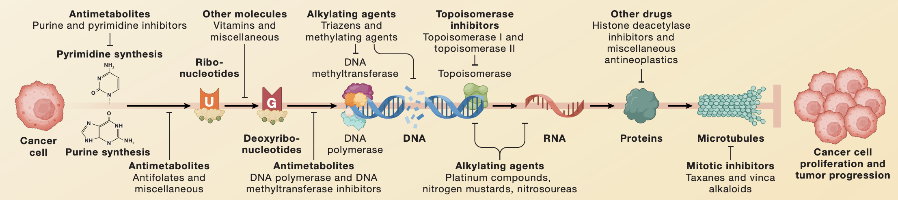

If we want to develop a drug or validate the use of a drug in a new indication, it would be good to know all the previously effective mechanisms of action. This analysis would reveal the effect sizes needed for efficacy as well as what kinds of side effects are tolerable. For example, if we ran an in vitro killing assay, what is the minimum effect size that would be interesting enough to nominate testing in an animal? Or on a broader level, what are the most significant levers that need to be pulled to acheive a therapeutic window? If a drug candidate's effect is entirely overlapping with the MOA of an existing therapy, why would it be worth developing it as a new entity?

In cancer, we can use several frameworks to classify drug targets. There are intrinsic targets which directly target cancer cells, and extrinsic targets which potentiate existing natural response to tumor development. Of the intrinsic targets, there are pan-cytotoxic which achieve killing of all cell types and selective dependencies that are based on some genetic alteration in cancer cells. Of the extrinsic targets, immunotherapy is the major class which can be further subdivided into therapies that remove 'brakes' from immune responses or actively stimulate, adding 'gas' to an ongoing response. As large categories, this leaves us with pan-essential, selective genetic, and immunotherapy as classes of currently tractable drug targets.

Outside of broadening existing therapy to new indications, it is worth wondering where the new targets will come from, and how they compare with existing targets. Will the advances in cancer care come from optimization of how therapy is administered (schedule optimization, localized drug delivery, better target engagement) or new biology (new targets or combination therapy)?

## Pan-essential

A frequent scapegoat, I think it is a bit unfortunate that we don't learn about or talk about chemotherapy, given that is a backbone for almost all cancer treatment regimens. Furthermore, the dramatic treatment differences of chemotherapy as a payload of antibody drug conjugates tells us that not all chemo is the same. It is important for the new generation of bioengineers not to forget about a modality that is cheap, effective, and is becoming increasingly utilized in precision and combination medicine approaches.

Pan-essential gene targets that are lethal in knockout or RNAi conditions across panels of cell lines while not labeled as chemotherapy, are de-facto "next generation" chemotherapies. These included mTOR, MEK, CDK, and HDAC inhibitors which have mixed results in clinical trials when given as orally without schedule optimization. 

Finally, surface targets that are frequently defined by lineage such as the classic CAR-T antigen CD19 are another set of pan-essential gene target that acheives therapeutic window by selectively being expressed in non-essential tissue. Such targets are frequently utilized for engineered therapies such as ADCs, mAbs, bispecifics, BITEs, and CAR-T. While lineage specific surface targets have phenomenal results in hematological malignancies, their utility in solid tumors remains to be proven.

## Genetically Targeted

In contrast, solid tumors seem more amenable to targeting via genetic dependency, where based on dysregulated expression phenotypes, tumors are more reliant on certain genes than their normal counterparts. The prototypical examples are paralogs and synthetic lethalities yet surprisingly few FDA approved cancer medications rely on these types of selective mechanisms. PARP inhibition in BRCA mutated cancers is the lone examples as of April 2023, but it is expected that the maturation of molecules currently in the clinic such as small molecules targeting POLQ, USP1, PKMYT1, and PRMT5 will expand the scope of paralog and synthetic lethal drug targeting.

The biggest and arguably most effective category for targeted therapy is directly inhibiting oncogene addiction. While nothing has lived up to the initial success of imatinib in CML, the pipeline of targets to address continues to expand. Mutant selective inhibition of kinases or enzymes such as EGFR, BRAF, IDH1/2, and now KRAS have provided an armamentarium of targeted agents to selectively kill mutant cells. Additionally, tumors may acheive addition via dysregulated expression of growth signaling genes that are not constituitively expressed in normal cells. These include RET, ABL, KIT, TRK, ALK, hormone receptors, and surface receptors like EGFR and HER2. While pocket mutations have rendered the efficacy of these inhibitors temporary, improved medicinal chemistry and combination therapy provide avenues to continuously improve upon standard of care. For example, the ADC Enhertu drastically improves over traztuzumab or HER2 inhibition with lapatinib alone.

Targeted therapy may particularly benefit from combination approaches given relatively low toxicity, specific mechanisms of action, and conversion of tumor microenvironments to immunologically favorable conditions. 

## Immunotherapy

Finally, immunotherapy has already become a mainstay of treatment for a subset of patients, but I think most would agree that the performance of current drugs is far shy of its potential. Checkpoint blockade of the PD-1, CTLA-4, LAG3, and TIGIT pathways is effective for only a fraction of patients and may be causing both short and long term adverse effects. Cytokine therapy has largely been a failure despite decades of optimization. Cancer vaccines and oncolytic viruses however, are beginning to emerge with promising data supporting use in niche applications. Unfortunately, the preclinical evaluation of immunotherapy is skewed towards systems that are easy to evaluate but poorly representative of patient tumors, partially due to the difficulty of recapitulating immunity in mice.

Triplet or quadruplet therapy with orthogonal mechanisms of action seems like the future of tackling tough solid tumors. Combining an oncogene addiction inhibitor with further immunotherapy to reprogram the TME and an inhibitor of EMT, possibly with a therapy that targets a selected for cell state that confers resistance to the above may be at least something to try. I wonder if there is literature to specifically test such hypotheses. In pancreas cancer, a combination of 41BB agonist, LAG3 checkpoint blockade, and CXCR2 inhibition resulted in robust antitumor immunity, surpassing the pedestrian results obtained by each drug alone.

### Further Reading

- [Targeting Pan-Essential Genes in Cancer: Challenges and Opportunities](https://www.sciencedirect.com/science/article/pii/S1535610820306565)
- [An Expanded Universe of Cancer Targets](https://www.cell.com/cell/pdf/S0092-8674(21)00170-7.pdf)
- [Targeting Synthetic Lethal Paralogs in Cancer](https://www.cell.com/trends/cancer/fulltext/S2405-8033(23)00022-5)
- [Rational combinations of targeted cancer therapies: background, advances and challenges](https://www.nature.com/articles/s41573-022-00615-z)