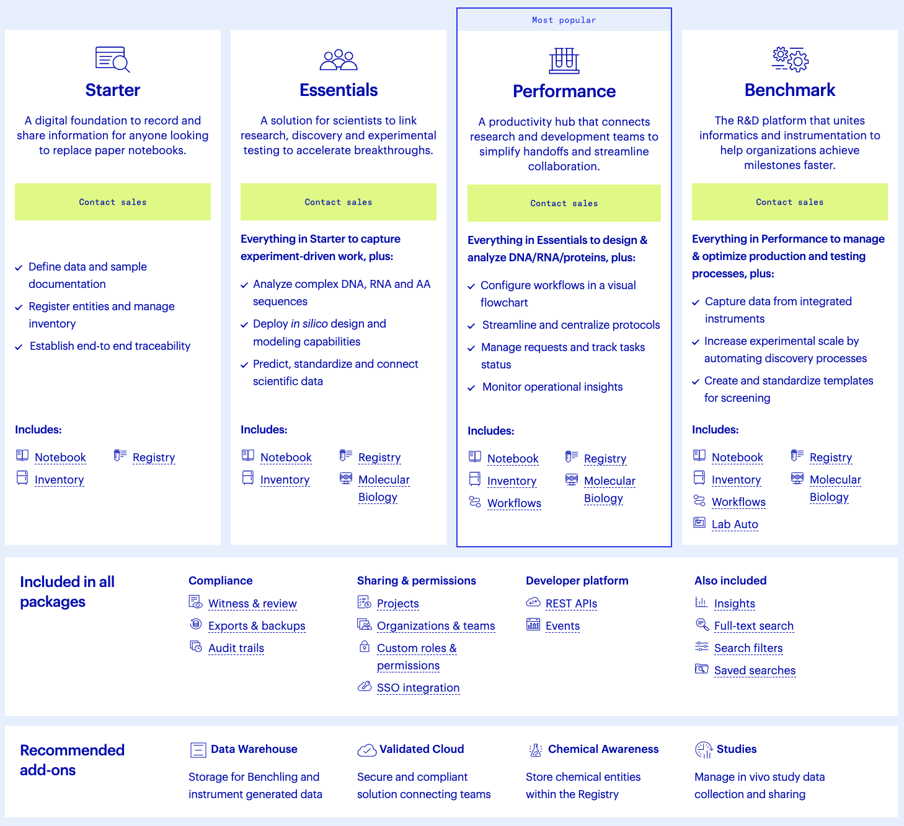

If you are running an R&D organization, what is the optimal resource allocation to maximize productivity and innovation for the least amount of cost? Do you want to maximize scientist headcount and run fewer experiments? Or do the goals of the organization favor extremely high throughput experimentation, perhaps with fewer scientific teams. Striking this balance is typically fit for purpose and within biotech there will be a range from companies with a model comprising zero R&D footprint, essentially all virtual staff spending all the cash on CROs, to models where most everything is done in house save for a few specialized experiments. Another category which has recently gained quite a bit of traction, is tools for scientists. In other words, how much do I need to pay for software, equipment, reagents for scientists so that they can be aligned and set up for success. 

I'd argue that the most important line item inevitably ends up being essential experiments as there are certain data that the FDA requires for submitting an IND. The more focused a company is, for example let's say they only have 1 drug candidate, the more lean the organization can be, as there needs to be less exploratory work and more or less the key experiments can be done by a CRO. These lean organizations typically are run by experienced management teams with the connections to efficiently conduct these experiments without spending on staff, tools, or anything other than data.

Recently, in part driven by low interest rate environments, it has been more fashionable to start biotech companies with broader scope and with drug candidates that come earlier and earlier in the life cycle. These companies, which typically revolve around 'platforms' that in theory should produce multiple drug candidates one day, require much larger rounds to finance and the set up of complex R&D organizations that spend more on scientist headcount and tools, and fewer on the IND enabling experiments. Examples of these types of companies include Lyell Immunopharma, Laronde, Sana, Moderna, and the list goes on. Anything that comes out of Flagship pioneering or similar venture creation firms may have a similar style. In line with the slowing of the biotech fundraising environment, the emergence of these types of companies have been less frequent and across the board there seems to be greater frugality. 

Regardless, within these more enterprising firms that depend on R&D departments to support expansive pipelines, spending on scientists and tools to support them are far higher. When the experimental needs of an organization are high, the complexity of aligning experimental teams and goals both at the global and micro level become a real pain point. Managers want to make sure resources aren't being wasted on non-informative experiments without micromanaging scientists. Scientists at the same time want to feel that they have intellectual freedom to make maximized contributions while ensuring that the day to day tasks and details are being communicated to research associates and technicians. Miscommunications are costly, but everyone has an allergic reaction to too frequent meetings and needs some degree of independence to learn and grow in their positions.

Truthfully, academics have been insulated from these issues given the emphasis on independence (though this is changing). Everyone is more or less able to rely on email or Slack to communicate and share protocols and files, and labs are small enough that lab meetings and spontaneous conversations fill in most gaps in communication. Moves to industry and the subsequent emphasis on process and organizational flow have a steep learning curve with many being guided to conform to the structure of a commercial organization for the first time. Information sharing across functional teams is critical, with the reality of expensive and important experiments serving as a backdrop.

### A software solution

Enter Benchling, a cloud based platform for managing workflows, project management, tracking inventory, and keeping lab notebooks. There are several pricing tiers shown below:

Essentially, its the ultimate bundled tech stack you assumed a large company would have built in. The benefit of a solution like Benchling clearly is alignment. Getting everyone to learn the same workflows and conventions with easy file sharing and collaboration features makes this ideal for a team with lots of moving parts. These industry services are built specifically for consistent workflows that are typical of industry science. Benchling even restricts some offerings from academic users because they know that academic users will frequently shift their usage or roles, change data formats, and require unstructured external collaboration. 

Is Benchling by itself good enough to support the full stack of needs that an industry scientist has? Does buying the enterprise version of the software make the Microsoft Office, Google, Box/Dropbox, etc. suites useless? What about other types of product/project management solutions like Notion, Asana, Trello, etc.? Lets say your workflow involves the use of lots of bioinformatics. Does Benchling make sense then? 

Ideally, Benchling becomes a no-brainer purchase for any biotech doing molecular biology, just like FlowJo is for those doing flow cytometry. I've never been in an organization with large scale use of Benchling, including industry applications. As a result, it's pretty difficult for me to understand the value proposition as it relates to competitor products. 

I've tried using Benchling (the stripped down Academic one) several times and in my experience it really isn't a sticky product. There is no desktop or mobile app and it doesn't work offline. The product doesn't feel as clean or as feature rich as an Apple or Microsoft product. The integration is nice, but for molecular biology applications, it isn't the same as SnapGene or UGENE. The newer features such as BLAST search integration, connection with JMP software for data visualization, and Alphafold capabilities seem nice (except for academics who only get 5 Alphafold uses _per year_), but do these features really save that much time versus using the full products separately? 

According to Benchling, companies using their products accelerate workflow cycle time by 38%. Gilead in particular reported that there was 63% less time spent on administrative tasks. Bolt Threads reports 25% shorter cycle time for some workflows, 150% increase in speed to aggregate and visualize data, and ~4 hours per week saved by scientists on data, search, compilation, and sharing. Oobli, a startup focused on engineering sweet proteins, reported that their scientists saved ~2 hours a week, spending 50% less time on data analysis and reporting. Anagenex reports a 200% estimated increase in speed, 50% decrease in time spent on data entry and cleanup, and 100% agreement from their ML team that Benchling helped with wet-dry lab integration.

In my view, these are mostly surrogate endpoints. The true question is, are companies that use Benchling better off than without? Are they more capital efficient, do they produce more products, do they have better ROI? Culturally, the companies using Benchling's products come from a younger, more tech forward style. Most focus on biologics and represent diverse applications ranging from biomanufacturing, to drug development, agritech, bioprocess/bioanalytical development, and more. Top customers include Gilead, Twist Bioscience, Bolt Threads, Novozymes, and Mammoth Biosciences. Newer customers are welcomed on Benchling's LinkedIn page and include companies like ÄIO, a startup focused on engineering fats and oils. Benchling is a premium service, and the type of company that chooses to join the ecosystem is different from those who prefer to be more frugal. Ultimately, I think it is hard to make the determination that Benchling is a waste or that it is useful as the metrics for success in biotech are simply far more difficult to link to product adoption.

If a company adopts the product, there really isn't any going back. Everyone will be using or at least paying for the product to support alignment whether they like it or not. The unfortunate thing about biotech is that company life cycles are not that long. When a company gets acquired, will they continue to use Benchling or be required to shift to a new system? The realization of how much bloat there is in biotech is growing and to me, ELMs could represent a cuttable cost. After all, does the biotech industry really need to spend 500 million annually on an electronic lab notebook? It will be interesting to see how Benchling matures as a business.

### Financials and business

The company itself was launched in 2012 by Ashu Singhal and Sajith Wickramasekara from MIT CS. It has become one of the first successful life sciences focused companies to come out of YC, and has since built a strong brand within the biotech ecosystem, counting 200k+ scientists and 1k+ biotech companies as users. The fundraising schedule is listed below:

- \$7 million – Series A in October 2016
- \$14.5 million – Series B in June 2018
- \$34.5 million – Series C in June 2019
- \$50 million – Series D in May 2020
- \$200 million – Series E in April 2021
- \$100 million – Series F in November 2021

In sum, this is \$406 million. At the Series F, the estimated valuation was over \$6 billion, coming off of triple-digit year-over-year revenue growth in its late 2021 fiscal quarter, a 70% increase in customer count, and 169% dollar-based net expansion rate from expansion within existing accounts. These strong numbers were temporary and in line with the broader challenges facing the biotech and tech industries, Benchling laid off 9% of staff in 2023, affecting 74 employees mostly on the SF marketing team. The company filed for an IPO in 2021, but there has not seemed to be any progress towards a listing here now in 2023, so perhaps we can expect some time early 2024. 

Glassdoor and Blind reviews are mixed. There are the typical complaints about poor management and unclear product roadmap but an equal number seem to still be excited and mission aligned. Pay seems to be on the lower side in the tech industry but relatively high for the biotech industry.

There are almost 900 employees. Since this is a tech company, say (conservatively, since this company is based in SF and Boston) that average salary per employee is 100k, and annual cost per employee is around 125k. This gets you to a burn rate of \$112.5 million annually.

Now for revenues, we know that Benchling charges at minimum 20k a year for 5 seats for the base professional tier. This is according to [this](https://web.archive.org/web/20200625022441/https://www.benchling.com/pricing/) WebArchives snapshot from 2020 (currently Benchling is obscure about its pricing). I'm guessing the majority these 200k+ scientists are academics so instead let's take a bottom up approach. Say the average biotech may have 30 scientists who are using the paid Benchling professional service. That is 30k paying seats annually, getting you \$120 million annual revenue. This assumes a company is paying on average ~120k a year for an electronic lab notebook. Clearly this is back of the napkin trash type of analysis as a power law distribution to describe revenues seems most appropriate here. However, Benchling actually hasn't landed as many [high value contracts](https://www.benchling.com/customer-stories) as it may seem. Lots of pre-commercial private companies that raised too much capital.

Lets assume there is growth to \$200 million annual revenue in 2023 and optimistically they get to \$300 million ARR by their IPO. How do we value this? Selling to biotech is tough, and I'd expect the revenue multiple to be amongst the lowest in relation to their SaaS peers. Lets say 7x revenues to be safe. So, \$2.1 billion? Going to be quite a few unhappy stockholders but given that the last publicly disclosed valuation of >\$6 billion was in 2021, I would feel comfortable with this estimate. IPO still probably opens at like \$5 billion, but within 9-12 months I like my chances of getting down to my estimate.

### Enterprise software's role in science

In conclusion, mission accomplished I guess? Benchling has built a great product that knows its lane but at the end of the day, the success or failure of a biotech company is not going to be because of the adoption of a productivity solution. I'm going to sound like a broken record at some point, but biotech is a fundamentally different business than software or most other industries. In biotech, margins are evil. In biotech, revenues are maybe 5 years detached from R&D, and value outcomes are often highly binarized. Efficiency basically doesn't really matter in light of being right or wrong. Will Benchling help a company be less wrong?

As an investor, I can tell you that there is no more attractive opportunity than a high probability product that can be developed with the least amount of R&D bloat possible. As a scientist, I can tell you that I realistically don't want to be blowing any significant amount of my budget on software. There are reasons why software in biotech is not great! Yet, there are some things you really can't live without. A word processor. A communication platform. Spreadsheets. In some cases like FlowJo or SnapGene, these may be worth thousands of dollars but only to buy a few seats for select team members. Is there a scenario where Benchling matures into a Microsoft Office like product with ubiquitous no-brainer buy in from scientists? What kinds of features would warrant this kind of demand?

I think pretty soon, AI products will get there. A foundational machine learning model of the cell. A truly intelligent digital assistant. Help me cure cancer and we'll pay anything you want. Give me Google Docs for life science and I'll start using Microsoft Word.