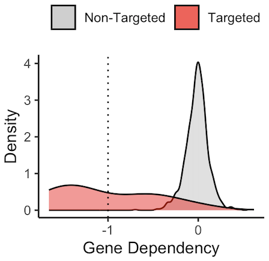
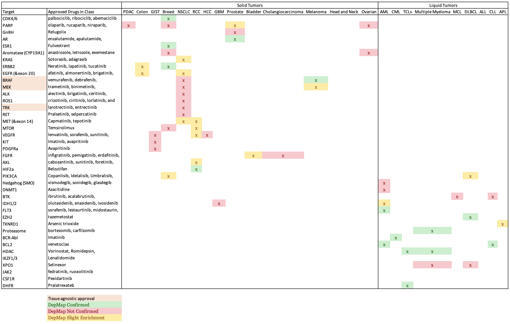

Very simple goal today. I want to know whether DepMap can be used to screen targets for efficacy in certain patient populations. Using a [recent catalog of targeted therapy approvals from the FDA](https://www.nature.com/articles/s41573-023-00723-4), I will calculate the sensitivity of DepMap for verifying the targetability of certain patient populations. If the sensitivity is high enough, we should be able to screen clinical trials in oncology using DepMap to understand probability of success for biomarker driven targeted therapies. This analysis will only consider targeted therapies. Ie. no chemotherapy, immunotherapy, antigen targeted therapies, etc will be considered.

[DepMap](https://depmap.org/portal/) provides a broad collection of gene dependency data for a wide variety of human cancer cell lines. The basis for this in-silico test is the idea that since there is diversity in cell types represented in the database, we can screen for biomarker specific gene dependencies and filter out targets that are pan-essential or toxic to most cell types. This is perhaps not a great way to screen for chemotherapies, since in theory they should be killing cancer cells at similar rates, but for molecularly targeted therapies that exploit specific genetic dependencies, using broad panels of cell lines to approximate different organs is not a bad first step.

For example, many CMLs are driven by a chromosomal translocation fusing BCR and ABL1 kinase. This constituitive activation of ABL1 drives the growth and proliferation of CML tumors and inhibition of the BCR-ABL protein using targeted small molecules like imatinib have been curative for patients. Accordingly, DepMap shows that genetic CRISPR knockout of the ABL1 driver gene is lethal (more negative) to CML cell lines (red) and not to other cancer cell lines in the DepMap portal. The threshold of -1 is empirically determined such that scores below -1 are termed strong dependencies, and a score around zero means that no effect on growth is observed in the context of genetic knockout.

Using this framework, I want to know how many other molecular targets can be confirmed using DepMap's dependency data. To do this, I will assemble a list of targets and indications from FDA approvals. For each pair, I will calculate the difference in mean dependency in the targeted group and the non-targeted group. ABL1 in CML is a strong example which yielded a difference of around 1 in dependency score. Based on the distribution of dependency score differences from all pairs of target and indications, I will empirically assign a cutoff for difference in dependency score that meaningfully stratifies dependency based on target biomarkers.

## Results

The results were quite poor. I stratified enrichment in a target tissue to three levels representing full confirmation of dependency, moderate/slight confirmation, or no confirmation. Overall, 15 full confirmations, 16 partial, and 25 unconfirmed out of 56 total indications for targeted therapy. Keeping the partial cases, that is a sensitivity of 55%, so basically a coin flip, while the specificity will always be horrible given the many ways to data mine a result.

The results are better in liquid tumors than in solids (sensitivity of 67% compared to 50%). The solid tumor setting also had many more of the 'partial' results.

There are 1826 cell line models in DepMap, of which 1078 are profiled with CRISPR KO screening (as of this writing). These are heavily skewed towards solid tumors, with just 116 of these (11%) being liquid tumors cultured in suspension. This in some part reflects the difficulty of culturing liquid cancers versus adherent solid cancer cells. Many of the unconfirmed results are in my judgement due to scarcity of appropriate model systems, such as in GIST where only 1 cell line is available, and there is no dependency data. It was surprising to find no profiled cell lines with rearrangements or sensitivity to ALK/ROS1/TRK knockout. There seem to be improved results where many model systems are available (e.g. in breast). The effect size roughly tracks with how transformational the therapy is.

## Discussion

Drugs have multiple modes of action beyond the target protein, both inside the cell and in the microenvironment. The criticism of cell line models being non-representative of the TME and the downstream effects on cellular phenotype is highlighted quite clearly in the analyses I've done. At least in PDAC, cells grown in culture are transcriptionally more similar to treatment resistant basal like tumors that are more resilient to genetic insult. 

I think that the lesson is to think more deeply about the utility of CRISPR screens as an assay class. They are high throughput, but low sensitivity and even lower specificity. Perhaps using more sophisticated readouts, past guide enrichment, can be more fruitful. Morphological phenotypes, gene expression signatures, functional readouts, etc can be higher yield but also need to be tested in this manner systematically.

My experience with DepMap has been that unless the effect size is strikingly large, the results are largely unreliable. There are many ways of analyzing the data and essenially any biological signal can be teased out if you really want it to be true. Analysis of specific cell lines that have outlier dependencies or other characteristics can be informative though. Just because your favorite target doesn't show up in DepMap doesn't necessarily mean its a dead target! But there should be some striking biological result somewhere to make you believe. 

Datasets like DepMap prompt the question of how to best be guided by human genetics in cancer. With the preponderance of data available, we need to think hard about the quality of evidence required in order to initiate a clinical trial. To gain confidence, do we do large atlasing studies, identifying commonly amplified and mutated genes? Are the phenotypes so heterogeneous that these studies are impractical and integration of diversity would mask signal? An alternative approach relies on targeted attacks on relatively familiar biology, but driven mostly by intuition. While DepMap continues to be itereated upon, training this drug hunter phenotype seems like the best path forward.
