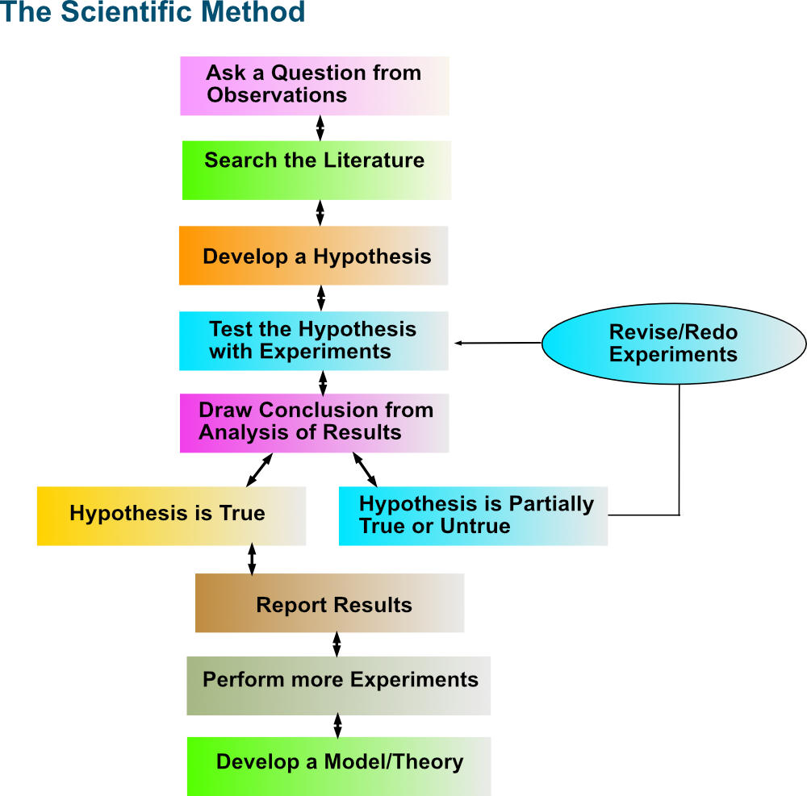

We need to seriously think about how we are analyzing single cell, spatial, and other high dimensional -omics datasets. As someone who is now relatively familiar with how these technologies work and how these data are analyzed, my most striking realization is not how rich these datasets are (in fact the quality can be quite poor), but rather how easy it is to generate science that frankly isn't very useful from them. 

For example, say I want to study a certain bacterial infection. I collect PBMCs from patients that respond to antibiotics and from those who don't. I do my state of the art scRNAseq on my PBMCs and use an algorithm to discover "cell states" in the major cell types. It is pretty obvious that what we are finding is a "cell state" associated with fever. The more aggressive your fever is, the more we see the transcriptional signature. We see it in the patients who don't respond to antibiotics. Do we call the fever "cell state" a treatment resistant cell state? Most definitely. And we also submit to Nature with a paper titled "Single cell atlas of Strep throat infection uncovers a treatment resistant cell state associated with poor mortality". 

My point is that a lot of the novel biology that has been 'discovered' with high dimensional -omics is a sort of repetitive rehashing of the same things we already knew were happening. Its cool that the new fancy technique was able to recover these things, but to ignore the existing literature in order to say you are being 'unbiased' or 'systematic' has become synonymous with all breadth, no depth. I've been looking for a long time and have yet to identify a drug target that you could only discover using scRNAseq or related tools. These tools I think are best suited for hypothesis checking, a useful resource for the community but not for unbiased discovery. The best studies in a sense are single plex. They propose a hypothesis and they comprehensively answer why it is relevant and whether it is true.

__Whenever you propose a new idea, whether it be for a specific experiment or larger concept, it is essential to contextualize.__ What is the exact question you are trying to answer, and what is the currently understood answer? Is this widely believed or is there equipoise? When our datasets are large, we cannot be frequentists and must be Baysian. Our priors shouldn't be lazily constructed and our null hypotheses deserve as much or even more care to construct than our alternative.

If you are studying a disease, what are the essential differences between the disease setting and the normal setting? In our example, the essential difference is that the bacteria are resistant to antibiotics -- everything else is secondary and a downstream consequence. Why is there a fever "state" in PBMCs "associated with treatment resistance"? Probably not because this "state" is causing the bacteria to resist therapy. One way of doing this is by asking whether a phenomena happens in normal homeostasis; and if it does, whatever phenomena you are seeing is probably downstream rather than upstream. In my field (pancreatic cancer), my working model is that what separates normal pancreata from frank malignancy is really just the genetics. KRAS is necessary but typically not sufficient, and commonly the loss of tumor suppressor genes via damaging mutation or chromosomal aberation will be present in early disease. My hypothesis is that most of the phenotypes that you see, whether they are transcriptional subtypes, tumor immune microenvironment characteristics, or even weird things like entosis, these are all downstream consequences of having aberant KRAS signaling. This mimics wound healing or regeneration in normal pancreata and this [idea](https://www.nejm.org/doi/10.1056/NEJM198612253152606) has been around for at least 40 years.

While the tools we design our experiments around evolve, answers to even basic questions continue to remain elusive. The pace of publications is at all time highs but I often find that the papers that most satisfy my questions are from many years ago. There must be something we can learn from 2nd grade. The scientific method requires contextualization, and its a key ingredient missing from the -omics revolution.

