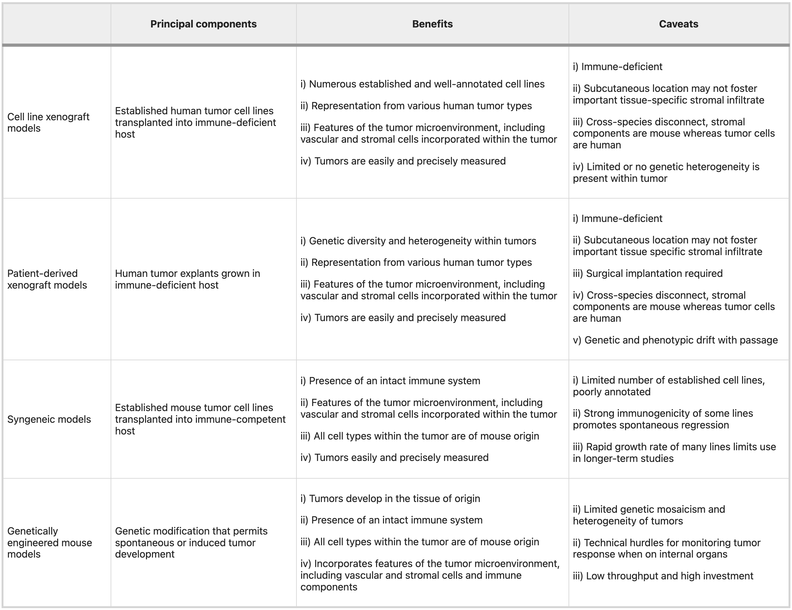

Everyone hates the mice. The technicians hate it. The PIs hate it. The investors hate it. We hide it from the general public because no one wants to be known as a researcher that works with mice. They smell. It's "unethical". They are expensive to keep.

But we put up with all of that because at the end of the day, they are useful and they work. Mice have many physiologic similarities to humans, they can be manipulated genetically, and they can be efficiently housed and bred. Every successful pharmaceutical innovation has been tested in animal models, and there are broad roles ranging from establishing biological relevance of targets, to establishing therapeutic windows between efficacy and toxicity, to determining efficacious drug exposure targets, to validating diagnostic hypotheses, and to identifying biomarkers of response. These are not absolute oracles that forecast exactly how biology plays out in human, but they are informative and for that alone we should always do them. Be careful of who is trying to tell you that mouse models are replaceable.

For the next century of drug development, mouse models will remain irreplaceable and become even more valuable. The reason is that therapeutic regimens are becoming more complicated. We are doing more and more phase II trials, without investing in phase III head to heads. How is a clinician supposed to know what triplet combination to use or what order to give it, or what dose? As standards of care become more complex, this will become an impossible problem. No one really will know whether first line bispecific EGFR MET antibody plus EGFR TKI is better than CTLA4 + PD1 blockade or whether one combination of those 4 drugs is better than just the 2 or whether we should use 3 instead? Optimizing this using randomization in Phase III will be expensive and a never finished problem as we continue to trial more and more investigational agents. Put this to test in animal models, where we can rigorously run these randomized studies.

However, we need to know when and where to use them appropriately. We also want to be able to leverage this exciting research avenue to its fullest potential. In this article, I'll discuss my read of the mouse tumor modeling literature and a new idea for using mice for iteratively studying therapeutic targets and combinations.

### An overview of mouse tumor models

There are roughly three categories of model systems that are widely used in oncology research: xenografts, syngeneics, and GEMMs. There are also carcinogen induced models for some cancers but given that these sometimes also require a genetic perturbation to make work anyways, we won't spend time talking about them. Each has specific tradeoffs relating to time, cost, and fidelity. Clearly, the right choice is question specific and ideally you test in as many model systems as possible. In any case, details matter. Picking a system means being able to clearly articulate down to extremely specific details, why the chosen model is most appropriate.

#### Xenografts

Xenografts by definition refer to the implantation of human cells into a mouse host. They can be cell line derived or patient derived, and almost always requires a mouse that will not readily reject the transplant (either nude or humanized mouse). In general, these are looked down upon. There is a clonal selection process from the culture of human tumor derived cells that may limit the genetic diversity present, and typically these are implanted without normal tissues, stromal cells, and other TME components. The doubling time of these cells is much faster than normal tumor (potentially due to lack of chronic inflammatory environment from a normal course of tumor development) and there is no normal tumor architectures (as these are typically transplanted subcutaneously). Finally, these do quite a poor job of modeling immunity as if you use a nude mouse you have no immune system and if you use an expensive humanized mouse, you could get a vaccination effect because most cells die after injection. Humanized mouse models
have limited development of mature innate immune cell populations (monocytes, macrophages, conventional and plasmacytoid dendritic cells (DCs), and natural killer (NK) cells), have inability to generate robust antigen-specific antibody responses, lack complement, don't have as many lymph node structures and germinal centers. Nude mice are quite frail and potentially show defects in DNA repair.

Nonetheless, these are useful for screening and if you are a pharma company with the resources to screen through 20+ xenografts, you could end up getting an adequate spread of genetic heterogeneity. Furthermore, it's relatively simple to think about experimental design and dosing as the tumor is clearly perfused. You just give your drug and the only effect you are really measuring is whether the drug is having an effect on shrinking the tumor. As a result, these models are mainstays in small molecule pharmaceutical development.

#### Syngeneic transplants

An alternative model is transplanting mouse derived tumor cells so that you don't necessarily worry about outright tumor rejection. Here, you can typically just derive tumor cells from a genetically engineered mouse model tumor and if you can propagate it _in vitro_, then you have a cell line that you can use for transplants. This can be ideal because you have full control over the genetics, and you can create basically any strain you want. For example, you can create a library of mouse clones, with very similar genetic background, and study differences in immunophenotype that may be defined by tractable cell-intrinsic factors [citation](https://www.cell.com/immunity/pdf/S1074-7613(18)30261-9.pdf). These transplantable models can be used to study in detail how specific perturbations modulate the microenvironment in conjunction with cell intrinsic behaviors like proliferation and death from drug.

However, the major limitation with these models is that mice and humans do indeed have differences. These will in most cases be subtle. For example, they lack mutational patterns typical of human tumors. If you run InferCNV on a mouse tumor, you will be hard pressed to differentiate it from adjacent normal tissue. Evaluating drugs against murine tumors may also be difficult if the target is appreciably different in the mouse than in human. For example, you may need to develop a new antibody against the mouse version of your target. Finally, differences in immunology may lead to imbalances in TME makeup between human and mouse tumors.

Nonetheless, syngeneic models have taught us a significant amount about targetable immune checkpoints. For example, we have learned that immunogenic cell death can be generated from chemotherapy and targeted therapies, which can potentiate immune checkpoint blockade. Beyond this simple idea, an extensive vista of new immunotherapies have relied upon syngeneic models to generate preclinical evidence (plenty of caveats, however)

#### Notes on route/format

Transplant models can typically be done in organoid or loose cell format and delivered subcutaneously, orthotopically, intraperitoneally, or intravenously (however, probably more variations than the stated). The tradeoffs here are mostly logistical, as in most cases doing the organoid orthotopic transplant is most representative but for some questions it may be irrelevant. Intraperitoneal or intravenous transplants can be used to study metastasis or questions relating to systemic circulation. Organoid transplants better model glandular structures and mechanical signaling in the microenvironment, including invasive and metastatic proclivity. Cell line transplants are more aggressive and progress faster than the natural course of tumor development, unlike organoids. However, organoids are more difficult and costly to propogate and maintain, and may be more difficult to genetically engineer. Subcutaneous transplants are accessible and measureable by caliper which make it easy to perform assessment of tumor growth dynamics, versus in an orthotopic setting where you may need to rely on bioluminescence/CT/MRI/US. 

#### GEMMs

Genetically engineered mouse models are the gold standard and ultimately, should be the 'final boss' for evaluating a new therapeutic. They most faithfully recapitulate normal tumor evolution and formation of the tumor microenvironment. However, there is some degree of nuance in that the act of 'forcing' a mouse to get a certain cancer often involves turning all the cells of that organ into a precancerous state. This may mean that these pre-neoplastic cells do not evolve in the context of a normal microenvironment, and that you may have some odd overwhelming effects on the immune system owing to the sheer number of lesions that may form. One model that I am familiar with, the KPC pancreas cancer model involves germline Pdx1 (pancreas specific promoter) deletion of p53 and KRAS G12D activation mutation. This means that all the cells in the pancreas are 'born' predisposed to development of cancer and within months, a tumor will form. 

The limitations of these systems are primarily cost related. Generating a GEMM can cost tens of thousands of dollars and many months if not years of effort. You also need to be nuanced about what you are engineering. The model is only useful if there is at least some recapitulation of human and the more 'creative' you become, the further you risk separating yourself from the true biology. For dox or tet inducible systems where gene activation or knockout is engineered into the cells only upon stimulus, you need to think about whether overexpression or deletion may cause senescence or apoptosis. 

We have learned so much from GEMMs that we could probably write a textbook. Not only in tumor immunology, but all of biology owes a gigantic debt to the engineered mouse model. Some simple examples I found compelling relate to oncogene addiction, and the fact that simply removing the addicted oncogene can naturally clear tumors. For example, reactivation of p53 causes senescence in malignant cells that allow them to be cleared by innate immune effectors, including macrophages and neutrophil granulocytes. Because Myc binds promoters of immune checkpoint blockers, extinction of Myc can often resolve malignant growth and restore normal tissue architecture. Sometimes biology can be very elegantly simple. 

### High throughput genetic engineering to evaluate therapeutic targets

Here comes an area where I think a lot of innovation can occur, specifically around the idea of modeling therapeutic combination regimens. We want to be able to create a system where we can phenocopy pharmacologic inactivation in multiplexed fashion, such that if we have a therapeutic hypothesis involving pathway inhibition at multiple nodes, we can model it even without drug. We can't feed mice drugs all the time and want to get over the barrier of chemistry and all the challenges related to PK/PD and systemic off target tox. These are issues that can in theory be addressed during downstream engineering, but currently what we care about is whether the biology is real.

All models are wrong but some are useful and in this case, genetic inactivation could be a useful model to phenocopy pharmacologic inhibition. To do this, we ideally want to use a dox/tet inducible system so that tumors develop normally and only upon target inactivation (like giving drug), there is a phenotype. For example, people have developed dox inducible KRAS inactivation for the KPC PDAC model in which KRAS can be turned off in tumor cells upon administration of doxycycline to the water of mice. They have learned specific mechanisms of KRAS bypass such as YAP1 amplification. The obvious next question is what happens when you turn off both KRAS and YAP1. Then will the mouse be 'cured?' But of course this is possible only with a GEMM and generating a GEMM that has doxycycline inducible KRAS and YAP1 deletion could be very time and cost intensive, especially since after this, the obvious question is what happens when you have a new resistance mechanism. You can't just keep making GEMMs. 

However, we _can_ scalably make cell lines and using syngeneic transplants, sort of mimic the performance of GEMMs to an extent. We can take a KPC derived line or library of lines, then transduce with lentivirus encoding our dox inducible cassette. This cassette can be single plex, or multiplex to model multiple perturbations. Of course we want to validate that the genetic engineering creates a biologically feasible level of inhibition. You implant those into a mouse, preferably orthotopically, let the tumor (at this point only with KPC alterations) grow to sufficient size, then dose with doxycycline to turn on target inhibition. Ideally, you transplant in an arrayed fashion, but you could also imagine engineering your library of 'hypotheses', each with a barcode, and performing some type of _in vivo_ multiplexed screen. You take your top hits and design a rigorous study to test whether your hypotheses are real.

Your pharmacodynamics are a bit different because it takes time for the dox system to stop production of your target, and the pharmacokinetics are largely driven by the kinetics of doxycycline _in vivo_. However, you can imagine quite quickly validating a biological hypothesis. You can use RECIST criteria for evaluating efficacy in human clinical trials, which require >50% tumor shrinkage to be considered a response, to understand whether this biology is worth pursuing more cleanly than if you used a small molecule which may have variable performance in mouse vs in human. Once you prove that this biology is interesting, you can iteratively think about introducing chemistry. For example, replacing the gene inactivations in the cassette with dosing with the relevant small molecule inhibitor. There you can start to understand to what extent effects are driven by PK/PD. 

### Reading

1. [NRCO 2023 Humanized mouse models for immuno-oncology research](https://www.nature.com/articles/s41571-022-00721-2)
2. [Trends 2017 Modeling Pancreas Cancer with Organoids](https://www.ncbi.nlm.nih.gov/pmc/articles/PMC4847151/)
3. [NRC 2016 Mouse models in oncoimmunology](https://www.nature.com/articles/nrc.2016.91)
4. [Nature Medicine 2015 Translational value of mouse models in oncology drug development](https://www.nature.com/articles/nm.3853)
5. [NRC 2007 Maximizing Mouse Cancer Models](https://www.nature.com/articles/nrc2192)
6. [NRDD 2006 The mighty mouse: genetically engineered mouse models in cancer drug development](https://www.nature.com/articles/nrd2110)
