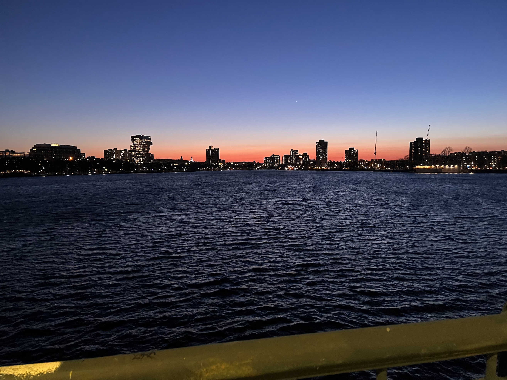
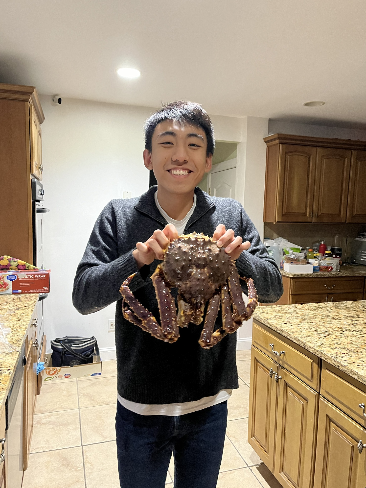

 

Another year, another year in review! I've had this blog for more than four years now and as I read the previous entries from [2020](https://www.dennisgong.com/blog/2020/), [2021](https://www.dennisgong.com/blog/2021/), and [2022](https://www.dennisgong.com/blog/EOY2022/), I am most proud of this year's growth in maturity. 2023 wasn't the happiest year, nor was it the most successful by hard metrics. But what I love about it was that it instilled calmness and it distilled purpose. The arrival of 2024 will be met with the best version of myself and for that I am grateful to everyone that made my past year special. Thank you to my friends, family, and loved ones.

*****

# Accomplishments

I leveraged hard on learning and doing science which is something that I'm proud that I did, but will try not to do again. I relearned how to listen to my elders and gained the maturity to follow their advice. I was 23 this year, and now I feel 24.

### 1. Perspective

The biggest thing I've gained from this year is the appreciation that everyone is doing their best. You don't need to ruin anything for anyone, but instead provide a reasonable sounding board. You can have high standards for yourself, while preserving gratitude for what others can give you. I'm saying this not because I want to spew platitudes, but because this year I finally understood that each person's circumstances are truly unique. When you grow up, fairness is seen as the moral standard. The Golden Rule tells you to treat others the way you would like to be treated. This might work when you are young and people's life experiences are more or less the same. But when you are an adult, everyone has different goals and circumstances. People are in science for different reasons. Some people are willing to give up their weekends for the lab and some people want to spend that time at peace. You can't know what people are dealing with; there is too much random stuff that happens as an adult. People prioritize differently and have unknown responsibilities.

While my weeks were spent in the lab or in the classroom, I spent many of my weekends traveling. I went on 44 trains, buses, and flights and some driving trips as well. I spent extended periods in Boston, New York, DC, Baltimore, China, and Avon (CT). My high school and college self would envy this broadening of horizons, and now as I remember back, each trip was more than worth it in the memories and time spent. Early in the year I would resent the rush to the terminal and the dirty and cramped Greyhound bus. The 1 AM arrivals at Back Bay Station were certainly tiring. However, such is life. Certain people have certain circumstances. I always surprised myself with how productive the next day was. I started looking forward to the naps on the train, the feeling of knowing that I was doing my best, and the well earned rest I would get the following night. I don't think that this schedule will change too much in the new year but I think that is okay.

During my China trip, I visited my grandfather. I carried him in my arms and swatted mosquitos while saying goodbye with warm eyes. I had a long late night conversation about life with my soon to be retired uncle. I went to visit art and architecture exhibits with my aunt; they made me feel proud to be Chinese. I took my grandma out to go shopping, do errands, and see new Shanghai. She stayed up late to give me advice the next morning. I ate sukiyaki with my cousin and my sister while he did a business school quiz. When I came back to the States, my grandma stayed up late to call me during my lunch break. A week later I visited my cousin and his newborn daughter with my sister and my Dad. My aunt was there; retired, healthy, and always proud. I am grateful for my beautiful family.

I ate at many restaurants this year, more than any other year. K took me to Omakase, Carmine's, and New York's best Chinese restaurants. I took her to Hillstone and Koco's pub. We went to the top of the rock, learned to become spies, and went to our first NBA game. She brightened my year and made it pop. See? Don't do that. You're learning! Very good.

With my HST cohort, I went whale watching, I went to Provincetown, and I went Apple Picking. In my biological networks and modeling classes, I carried and was carried. Walking into class and seeing my friends gave me many smiles. The Sunday office brightened my week and made the cold and wet warm. 

I took anatomy and dissected a 96 year old donor. I learned each muscle, bone, and attachment in the human body. On the first day, Rick Mitchell scolded me for not putting away a scalpel and I couldn't suture. By week 3, my dissections were clear and I performed a laminectomy with hammer and chisel. In my hands I held Her hands, Her brain, and Her heart. As a graduate student, I spend my days thinking at the scale of molecules, genes, and cells. You see someone exposed like that and you can't help but remember your purpose.

### 2. Academics

I've had strong success in research this year and it gives me the confidence to think that I could really be an academic one day. This year, I've learned how to thoroughly analyze single cell and spatial transcriptomics datasets. I started from a very rudimentary level, having not even run through the [PBMC clustering tutorial](https://scanpy-tutorials.readthedocs.io/en/latest/pbmc3k.html) and now I have run pretty complicated pipelines such as [SCENIC](https://www.ncbi.nlm.nih.gov/pmc/articles/PMC5937676/) multiple times. I have analyzed human and mouse snRNAseq datasets, human and mouse imaging and sequencing based spatial datasets, and all sorts of CRISPR screening, RNAseq, and other data types. Facile retrieval and manipulation of public data is a new skill that I now use frequently both in science and investing projects.

I have learned how to thoroughly evaluate therapeutic targets. Jimmy served as a great mentor and teacher in this regard, really helping me understand how to use different datasets to triangulate towards something real. I attended cancer program and cell circuits meetings at the Broad which broadened my horizons and taught me new techniques. I realized the strength of using large CRISPR screening datasets to identify phenotypes. There was a point in the year where I was pretty disapointed and thought that many of the major findings in biology have already been found. What I now know is that when papers are written, people don't talk about genes they don't know about and if you look hard enough, there is a wealth of phenotypes and information to follow up on. I think I have a relatively strong understanding of cancer now. I have my own perspectives and know how to pick apart a paper. I'm confident that I have good ideas.

Jimmy also taught me how to make beautiful figures and slides and to communicate with clarity and intent. I learned how to use Prism to make publication quality figures and represent data in a manner that highlights key points without distraction. I've also learned the basics of various molecular biology techniques. I struggled a lot with qPCRs but now know how to effectively run all types of assays including Westerns, qPCRs, RNA-seq, cell viability, colony formation, etc. The ability to work as both an experimentalist and a computational biologist has proved to be immensely helpful in leading projects and understanding how to put things together. I learned how to CAD and 3D print. We invented a new method for bridging live cell imaging and -omics. I have identified several promising therapeutic targets that need to be investigated with functional studies.

I'm going to be a co-author on papers going to at least two high impact journals, and co-first on three papers in mid-tier journals. I presented three posters this year and I will be giving a flash talk at AGBT 2024. Additional work will be presented at AACR 2024. However this desire, to go to conferences and present, has been saturated for now. I now only want to present if I have something interesting to say. I still want to go to conferences to listen and learn, but not to show off. I helped teach and mentor 2 new staff, an undergrad, and 2 temporary students. 

Several grants were written this year. I wrote one for HST.590, a grant writing focused research class. The feedback there was generally useless, though I do remember feeling proud that I was able to cruise to an A while it wasn't so simple for some classmates. I wrote sections of private foundation grants, government grants, and my own proposals for graduate school (6 different pieces in total). On top of that, I applied for the PD Soros fellowship which gave me a chance to reflect about my heritage. 

I helped assemble a new lab which in retrospect was no easy feat. I organized all the equipment, reagents, and benches. I installed new equipment and navigated other resources within the building to know what to buy and what to borrow. I cleaned up on the weekends and bought materials to stock the lab. I became a leader and director of scientific direction. As a second year graduate student, I rememeber always thinking that this wasn't my job. I'm glad that I did it in retrospect though. See one, do one, teach one.

A thematic challenge for me throughout the year was coordinating research with a heavy class schedule. The HST program features coursework both at MIT and Harvard Medical School and as a result, your time each week can fill up with time intensive classes. In the Spring, I had an immunology class, a biological networks class, a grant writing class, a drug development class I TAed for, and my seminar class. In the Fall, I took anatomy and a biological modeling class in addition to my seminar class. The Spring was somewhat better given that all the classes were at MIT and I didn't need to commute 20-30 minutes to the medical school, and the courses were manageable with my rotation schedule. The Fall was more difficult. Anatomy is notoriously time consuming and difficult with in person dissections twice a week Monday and Wednesday and tests each Friday. There was prework and studying to do for each class, which made the total time commitment around 20 hours of real work each week. On top of that, the biological modeling class took up another 10 hours of time each week, made up of class time and problem sets each week. You layer that all on top of time you need to spend commuting, taking care of yourself, and keeping up with family commitments, and your research time starts to take a hit. When you do research, you need long periods of time to conduct experiments properly. When you are rushed, the experiments don't go well, you can't collect meaningful data, and you feel even more behind. But I did it. 

# Learnings

I am proud of the maturity I have earned. 

Scientifically, I have learned how results can be faked and or misinterpreted yet still land in top journals or attract investment. I have learned to ask more from data and expect a high bar from my own work.

I figured out why I wasn't interested in technology development. I realized that the people I admired the most were those who discovered fundamental new facts about the world, rather than coming up with ever more ways to do things. There is beauty and alpha from focusing on individual genes. I'm a biologist. 

A painful lesson that I've learned is that even in a PhD, you can still do too many things. It was more than three years ago now that Brian Fiske told me not to do so many things that you can't be world class in each of them anymore. I'm done with feeling so busy that I can't fully diligence things. I want to be a finisher of projects, a publisher of papers, instead of letting them sit and get stale.

I learned how to advocate for myself and not accept mediocrity in the people that I work with. I learned how to work with different types of people in a research environment and to resolve conflicts. It has been important for me to learn how to set boundaries. Sure you want to be a team player and sure, everything you do at work could help you in some way if you think hard enough. However, few things actually move the needle and are actually things that are exciting and change how you think about the world. I have dealt with unfairness. A firing, slackers in group projects, and unreasonable expectations. I certainly never expected that I woudl land in such a situation and while I don't feel that I deserved to deal with the problems of others, I now know with great detail how I would handle these situations. As a team member, what you want is leadership and competence. Meetings starting on time. People getting called out when things aren't right. A plan to figure things out rather than an apology. 

At the same time, the lab has taught me the importance of culture. Good cultures sustain good people in times of disapointment. This year we looked forward to and spent a good amount of time installing and troubleshooting a new instrument, the CosMx spatial molecular imager. What I've learned is that the instrument does not, and probably will never work as expected, which has been frustrating for us to deal with. You don't want to be the graduate student who is the only one in the lab with the skills to troubleshoot this. However, dealing with this situation has shown me how to be resilient and resourceful and for that I am grateful.

# Goals

I was unable to keep up with my fitness goals. I stopped keeping track and meeting monthly goals. I only ran 190 miles this year versus nearly 300 in the year before. There were 5 half marathons last year and zero this year. I benched 235 last year and can barely get 185 currently. I disapointed people and had some very lazy days. I hit only 3/6 goals that I made [last year](https://www.dennisgong.com/blog/EOY2022/). There were 0 half marathons when I said I'd run 3. I reduced my Spotify consumption significantly but I still sit at 97th %ile rather than the 85th that I promised myself. Screen time similar to last year was around 4 hours daily which is again grossly above my goal of 2.5 hours. A lot of screen time is educational, but we can watch those videos on a computer instead of a phone. I lost steam around May. I used to go into the office by 8 and work productively for the first hours of the day. I had days where I wasted those precious first hours in favor of Barstool Pizza Reviews and NBA highlights. I had to deal with health issues for the first time as an adult. This blog had its best year yet but was driven mostly by one article and has started plateauing. I hit the monthly minimum but didn't dream about much more.

This year, it will be helpful to have a clean slate. I made the same excuse last year about graduate school transitions, and I was so sure that 2023 would be a return to habit. I'm hoping with the newfound maturity, 2024 will be different.

### Learning goals:

A major theme in 2023 was learning skills to become a strong scientist. My current assessment of myself is that the ideas and style of thinking is generally okay, but there are still major holes in technical ability that should be filled. Scientifically, these are:

1. __Experimental fluency in conducting preclinical assays.__ In essence, what I want is for things to work the first time I do it. I want to become more familiar with different tricks and best practices to make life easier. I want to feel comfortable doing everything myself versus relying on someone to show me. Specifically, I want to become very proficient at cloning and microscopy this year. If I can do some _in vivo_ work as well, that would be stellar.

2. __Improved writing fluency.__ The writing flow took a slight hit this year with increased responsibilities in the classroom and lab. I'd like to get back to an accelerated pace of not just a post once monthly, but whenever I feel like I have something to say. I want the words to flow out without having to struggle with sentence construction or voice. I used to think a lot about how I was portraying myself with my online writing but I think with the improved maturity of 2023, I can be a more confident and fluent writer, not just on the blog but in papers as well.

3. __Learn structural biology and pharmaceutical chemistry.__ I have long had a fascination with medicinal chemists and how they can seemingly just look at a structure and tell you whether it is druggable or not. Or, have the ability to just look at a molecule and know whether it has druglike properties. This is cool to me and I want to be able to do this.

I also have two areas where I want to grow as a professional:

1. __Improvement as a project manager.__ In the past year, I have taken on responsibility as a manager of technicians and an undergrad. Ultimately the productivity of a team is the responsibility of the manager and I think we can do much better. I will do a better job of planning each week ahead and making sure everyone is on the same page about expectations. 

2. __Setting culture.__ Similarly, in the group setting I think our team is in need of a culture setter. This is someone who makes sure meetings start on time, makes sure that meeting minutes are taken at each meeting, and that summary emails or agendas are sent to all meeting participants. Every team needs someone who thinks clearly about the objectives and really cares enough to execute consistently. I want to be that guy.

### Personal goals

On the personal side, I know I have a lot to work on. Getting back to the pace that was set in 2022 needs to happen.

1. __Get back on the fitness train.__ I want to try and run two half marathons this year. I want to bench 200 again. This shouldn't be difficult, I did it before.

2. __Finish projects.__ Finishing means publishing or stopping. These projects also need to be tracked in a notebook somewhere. You need an active log of everything that is happening in your life so that you control what is happening to you.

3. __Focus on what is on my own plate.__ Stop worrying about the performance of others. Schedule in things from your own todo list and if you can't do the work for other people, that is okay. If you don't have anything left to do for the day, go home and work on your own goals instead of trying to make up for others.

4. __Continuation of previous year's goals.__ Less Spotify. Less screen time. These are ambitious goals, but need to get done.

*****

One of the things that stuck with me this year was a [video of a man](https://www.tiktok.com/@lukefoods?lang=en) eating Indian food for the first time in Kentucky. That type of enthusiasm for something that most of us have had, and can be sufficiently snobby about, was refreshing. You can lead a simple life yet still feel very lucky. When a kid sees the moon for the first time or the first time it snows all year, these are all opportunities to age a little slower. To be able to appreciate what you have. Like we all do, I have a lot of things to look forward to in the new year. All the feedback on submitted grants and papers. New opportunities to finish projects and do critical experiments. Spending time with my family.

On the whole, I think the year was successful, though when you look at any individual month, I don't see them as particularly impressive. Each week felt like a sprint and goals were accomplished but unclear that they amounted to anything substantial. Perhaps this was a consolidation year, or a reminder to focus on process rather than accomplishments. Growing in unmeasurable ways was uncomfortable and confusing, but now finally when I have a chance to reflect, I now understand that the personal growth I had this year was substantial. To my future self, you found that you were most happy when you saw your Mom smile, when your sister came to ask you what classes to take next semester, when your Dad showed you the catio he built, and when you held hands and walked to dinner. I played games with my sister (Hades, Bread and Fred), I cooked for my Dad, and I shopped for groceries with my Mom. I felt lucky on my birthday and when I cried, it was because I had people that brought me joy. Thank you 2023 and welcome 2024.

# Pictures

__January__

__February__

__March__

 

__April__

__May__

__June__

 

__July__

__August__

__September__

__October__

__November__

__December__

