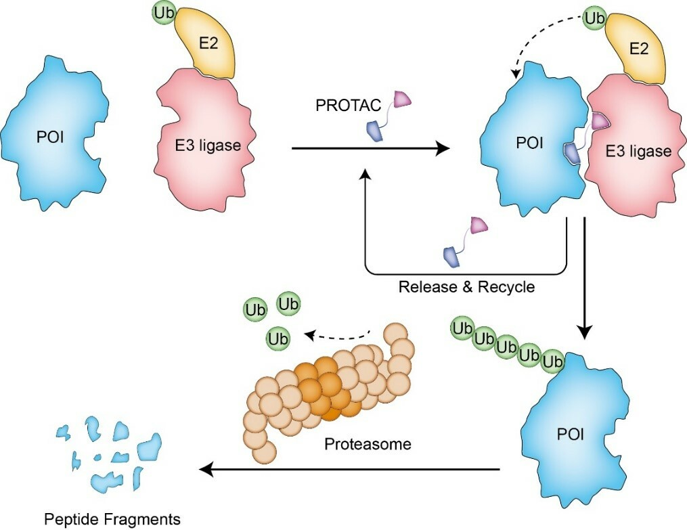
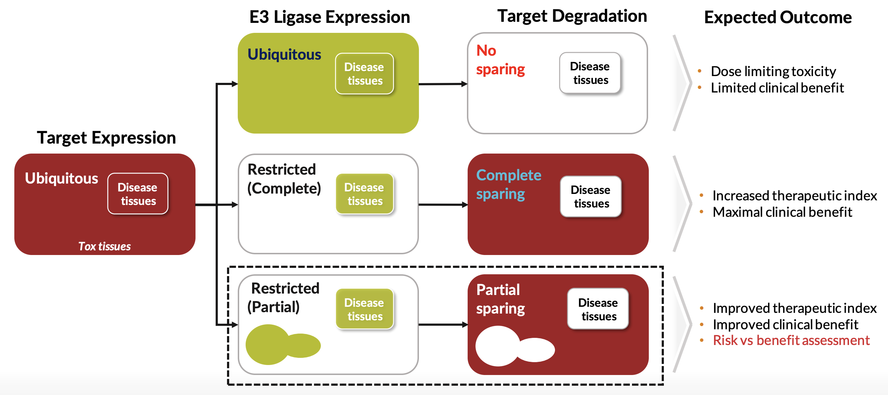
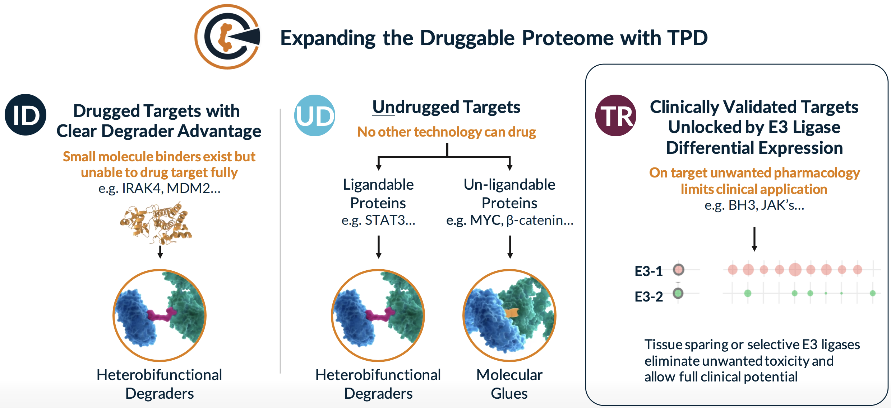
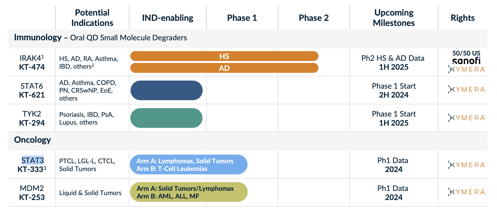
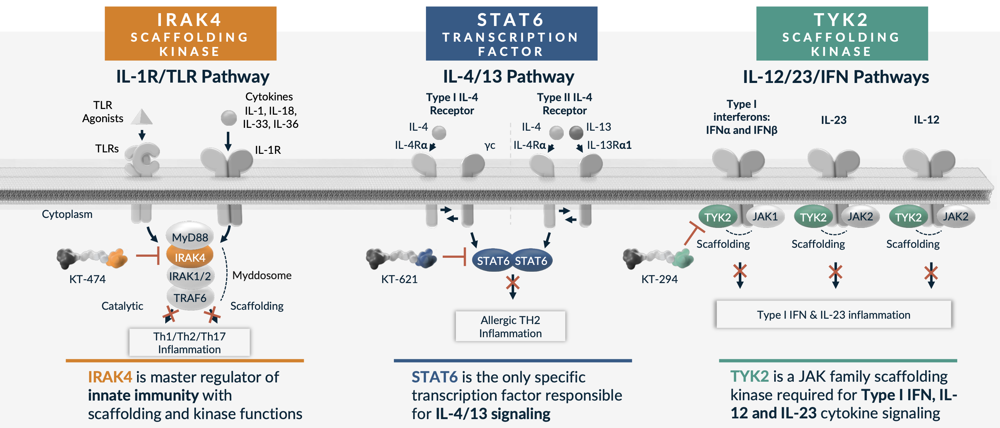
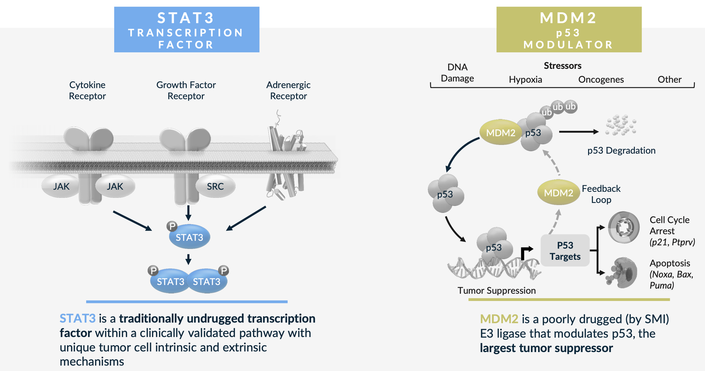

# Company overview

Kymera Therapeutics is a protein degradation company with a healthy \$2.5 billion market cap. It has nearly quadrupled in value since October 2023. Founded in 2016, it employs nearly 200 people and has HQ in Watertown, MA. They have $745 million cash and expected runway into the first half of 2027. Data from several Phase II readouts should be achieved by then, including trials in hidradenitis suppurativa (HS) and atopic dermatitis (AD).

The company develops small molecule oral protein degraders with biologic-like efficacy. Target selection in immunology came from clinical pathway validation from approved biologics (e.g. cytokine targeting mAbs).

The company has received backing from pharmaceutical bluechip investors including Amgen, Eli Lilly, Pfizer, Sanofi, and Vertex. They have executed on research partnerships with Vertex (engaged 2019, 4 year deal w/ \$70 M upfront, up to \$1 billion and 6 targets) and Sanofi (engaged 2020, \$150 M upfront, deal worth up to \$2 billion). 

Its  77 page corporate deck, with 72 papers/data releases and 69 patents on Google Patents (boasting 500+ on their website). It's an exciting company with a lot of data to sift through. Both the technology and targets are novel, an Atlas company to the core.

# Targeted Protein Degradation (TPD)

Kymera developed heterobifunctional protein degraders composed of a target binding ligand, linker, and E3 ligase binding ligand. The idea is that this molecule helps bring together the E3 ligase to a target protein, allowing the E3 ligase to label the protein with ubiquitin and for the protein to be eventually degraded by the ubiquitin proteasome system. This enables targeting of the 'undruggable' genome but also proteins that have scaffolding activity and are inadequately inhibited by small molecules. Degrader molecules are typically catalytic, as the degrader can be reused multiple times. For building these molecules, ligands for E3 ligases and target proteins can be discovered using many traditional screening approaches, and the linkers must be engineered.

The core of the Kymera story is its Pegasus platform, essentially their all around know-how for how to build heterobifunctional degraders. This platform is made up of 5 components: 1. a dataset quantifying E3 ligase expression throughout the body 2. a suite of E3 ligase ligands capable of binding and engaging various E3 ligases 3. an understanding of structural modeling of the degrader biochemistry and ternary structures 4. and quantitative pharmacology models based on E3 ligase expression throughout the body and 5. chemistry know how for synthesis and optimization of heterobifunctional molecules. Reading through Kymera's materials, a lot of this seems like putting labels to expertise but there are a few interesting points:

- Kymera has assembled and integrated a dataset (termed [MaxQuantAtlas](https://www.linkedin.com/pulse/new-proteomics-based-tool-advance-targeted-protein-precision-sharma/)) mapping ~600 E3 ligases to their expression throughout the body and subcellular location. This synthesizes both proprietary mass spectrometry datasets but also publicly available ones including CPTAC and DepMap. This data and Kymera's aim to go after many of the uncharacterized E3 ligases is a major point of differentiation from the many other protein degrader companies. Some E3 ligases that are highly studied, like cereblon (CRBN), only target ~1% of proteins and the thought is that you can probably find a more optimal E3 ligase for your protein of interest by sifting through the other options. Kymera has experimentally confirmed that ~400 of these 600 proteins actually drive degradation in human tissues, giving them lots of open space for discovery.

- Using this dataset, Kymera has shown that the tissue specific distribution of various E3 ligases can be advantageous for avoiding toxicity or maintaining a therapeutic window. Matching the right target with the optimal E3 ligase. Design away toxicities. Frequent example they bring up is an E3 ligase with very low expression in bone marrow, which in theory should allow a drug to bypass bone marrow toxicity. Most E3 ligases including CRBN and VHL have ubiquitous expression in all tissues

- Partnerships with A-Alpha Bio for protein protein interaction screens (AlphaSeq). Partnership with GSK for DEL screens. 

- Apparently they were the first to publish a heterobifunctional Cryo-EM ternary structure. They can do SAR using their structures and maybe this speeds them up. This type of ternary complex modeling can be used to optimize linker lengths and geometry, and optimize ligands. For example, KT-474, their IRAK4 degrader was an optimized CRBN binder (pomalidomide) that made degradation much more specific to IRAK4 by removing a benzene that engages degradation of IKZF1 and IKZF3 transcription factors.

- They have a nice framework for selecting E3 ligases termed LED (ligandability, expression, degradation). They assess ligandability using common screening modalities and SAR. The expression aspect utilizes their tissue specific distribution data as discussed above. The degradation point is pretty important, as the the vast majority (>95%) of human E3 ligases are RING domain based which do not actually lead to degradation. They developed this proximity degradation system with degradable reporter proteins that they force whatever E3 they are screening to interact with. With some genetic engineering, they are able to use this system to assess whether any given E3 ligase can be used as part of a degrader system.

# Pipeline

One thing that stands out about Kymera is how clearly they communicate target selection. None of their targets (except their new TYK2 program) have been successfully drugged, but each feels inevitable.

Kymera unveiled new degraders and targets at their R&D day in January 2024. This represented a large shift in priority to immunology. While their IRAK4 program was always meant for HS and AD, the rest of their platform and their former IRADIMiD drug candidate (KT-413) was oncology focused. The messaging from the company is now very clearly immunology focused, highlighting the opportunity in IRAK4, STAT6, and TYK2. 

#### IRAK4 - KT-474
Kymera's IRAK4 program is shared with Sanofi, which owns 50% of U.S. rights. KT-474 is being investigated in two Phase II trials in AD and HS with data in 1H 2025 (ADVANTA & ZEN respectively). IRAK4 is a critical component of the IL-1R/TLR signaling pathway, adult humans with IRAK4 null mutation are healthy, and while the kinase functions have been successfully inhibited, the important scaffolding functions which regulates the stability and activity of the IL-1R/TLR dependent MYD88 complex, have not. This represents the opportunity for Kymera's degrader platform. Clinically, Phase 1 data has been published in Nature Medicine [link](https://www.nature.com/articles/s41591-023-02635-7). Compared to adalimumab, there are on par if not slightly worse response rates and also some QTc segment increases as treatment related toxicity. This is thought to be because of an interaction between drug with ion channel and increased heart tissue penetration. 

#### STAT6 - KT-621
STAT6 is a new target unveiled at Kymera's R&D day in January 2024. It is an undrugged specific and essential TF in the IL4/13 pathway. This pathway engages Th2 T cell differentiation, causing pro-allergic adaptive immunity. Gain of function mutations confer severe allergic disease and Dupilumab which targets upstream cytokines is a huge drug approved for multiple indications. STAT6 functions via protein-protein interactions making degradation the key mechanism necessary for successful targeting. Kymera's preclinical data shows specificity for STAT6 over other STATs, increased potency vs Dupilumab in cellular assays, comparable in-vivo activity vs Dupilumab in an MC903 atopic dermatitis model, and dose dependent deep degradation of STAT6 in humans at pM potency. A Phase I trial is set to start in 2H 2024, with data in 2025. 

#### TYK2 - KT-294
Atlas loves TYK2. TYK2 is a scaffolding kinase that transduces signals from IL-12, IL-23 and type I IFN receptors. The TYK2 human genetics story has been told countless times, TYK2 cytokines (IL-23) have been successfully targeted, and yet there are other scaffolding or catalytic functions of TYK2 that are not addressed by inhibitors (Sotyktu and TAK-279). This is Kymera's opportunity. In preclinical models they have also shown lack of activity on IL-10 pathways, which play essential roles in intestinal homeostasis (Kymera can potentially avoid colitis toxicities). Phase 1 initiation is in 2025, so we won't see an update for a while it seems.

#### STAT3 - KT-333
Oncology has been deprioritized to an extent, and I think the disappointing results thus far in STAT3 have in some manner been a contributor to that. Kymera is seeing some level of responses in some liquid tumors but there is no single agent activity in solids. There is rationale for this target as  STAT3 does appear hyperactivated in leukemia patients treated with JAKi, but also solid tumors treated with targeted therapies like MEK or EGFR inhibitors. The Phase 1a dose escalation is completing in 2024, and Kymera with _evaluate_ potential expansion. 

#### MDM2 - KT-253
MDM2 I think this is more interesting as you do see responses to small molecule inhibition (e.g. Rain Oncology's milademetan). There is a reason why a degrader could see improved efficacy as well given feedback loops of MDM2 inhibitors that upregulate MDM2 production. There is an ongoing clinical study where Kymera has seen a response at dose level 1 in merkel cell carcinoma, out of 3 solid tumor patients treated. Kymera also has some preclinical data in AML with some impressive activity versus small molecule MDM2 inhibitors. Finally, there is opportunity for tumor selection based on human genetics (intact p53; occuring in ~50% of cancer patients).

# Final thoughts

At the time of their IPO, they had their IRAK4 program, STAT3, and IRAK4/IRAKIMID for Myd88 mutated DLBCL. Their stock started trading at ~\$33 and within 6 months ratched all the way up to \$86 in December 2020. Caveats aside, we thought this was a \$5 billion company with a worse pipeline. Immunology is very competitive, but hard to say that oncology wasn't/isn't as well. Kymera is a company flush with cash. They closed a \$275 million offering following their R&D day in January 2024, an \$150 million private placement (PIPE) in August 2022, a \$223.5 million offering in June 2021, and their \$200 million IPO. While there has yet to be a clear killer application that has successfully traversed clinical trials, the opportunity for heterobifunctional degraders and/or molecular glues seems enormous. If you believe that the frontier of biological discovery truly is broad and far reaching, you have to think that degraders will play an important role. To me, the question is whether Kymera is the one to capitalize on it financially, but given the 'know how' necessary to make these drugs, I think they will be.

Wouldn't it be great to be the head of biology for one of these platforms? It is unfortunate that these director level positions are all 15-20 years post PhD, but that speaks to the quality of talent the company has attracted. A fantastic place to be an early career scientist. Being there from the beginning, Bruce Booth and Atlas Venture are clearly doing well by doing good (Before the IPO, Bruce Booth owned 27% of the company...).

Everything down to how their website looks, how resources are presented, and communications demonstrates a culture of excellence. Simple things like neat slide formatting or presenting data in both absolute and log scales are always thoughtfully optimized. The visualizations make sense and aren't overly stylized. You look through their resources, and they seemingly tell you exactly how they do it [just one such example](https://www.kymeratx.com/wp-content/uploads/2022/10/2022_10_25_Boston_TPD_McDonald_Kymera_E3_platform_final.pdf).

Kymera is a company we can all learn to admire. 