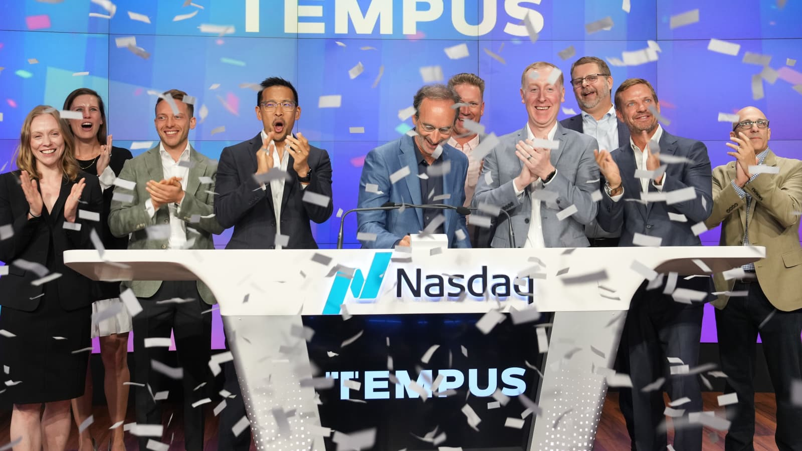
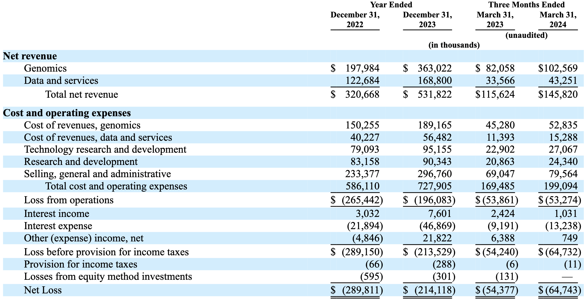
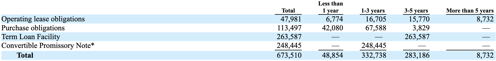
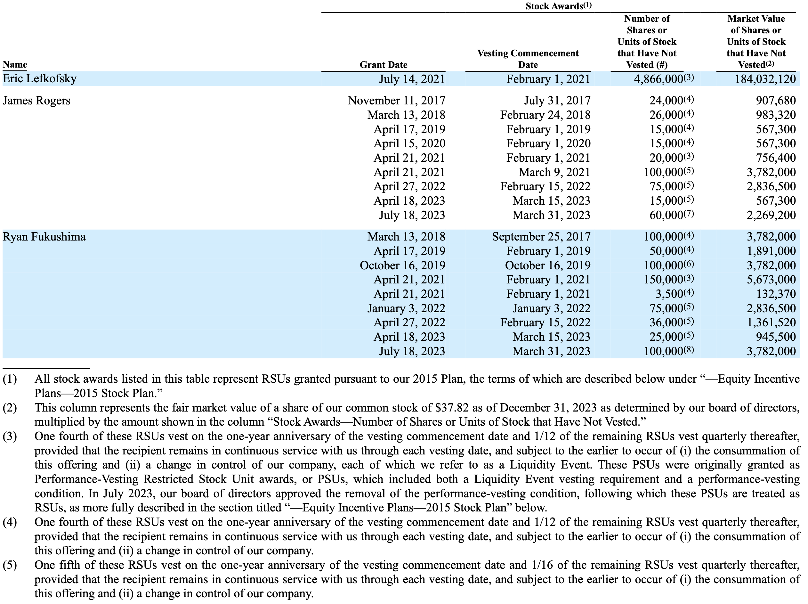

Today's post is a followup of my previous speculation about Tempus Labs/AI (\$TEM), now that the [S-1](https://www.sec.gov/Archives/edgar/data/1717115/000119312524142956/d221145ds1.htm) is live and Tempus has finally gone public. Over the past weeks, I have gone carefully through the ~300 page S-1 to pull out what is interesting and attempt to accurately summarize their business. There are certainly lots of areas for optimism; as a systems biologist, access and exploration of Tempus's data and resources would be a dream come true. I do think Tempus has the best shot out of anyone for making precision medicine work in cancer. However, I was surprised (in a bad way) by their financial situation and have come away with new doubts about the sustainability of their growth trajectory.

Today's stock is trading around \$25 a share, with the total market cap around \$4 billion roughly 2 weeks after shares started trading. This is pretty in line with what I [previously](https://www.dennisgong.com/blog/TempusLabs/) predicted more than a year ago. 

## Table of contents 

1. [Summary](#summary)
2. [Genomics](#genomics)
3. [Data and Services](#data-and-services)
   1. [Insights](#insights)
   2. [Trials](#trials)
   3. [Organoids](#organoids)
4. [AI Applications](#ai-applications)
5. [Regulatory](#regulatory)
6. [Intellectual Property](#intellectual-property)
7. [Software](#software)
8. [Partnerships](#partnerships)
   1. [Pathos](#pathos)
   2. [AstraZeneca](#astrazeneca)
   3. [GSK](#gsk)
   4. [Recursion](#recursion)
   5. [Japan Joint Venture](#japan-joint-venture)
9. [Financing](#financing)
   1. [Balance Statement](#balance-statement)
      1. [Ares Capital Credit Agreement](#ares-capital-credit-agreement)
      2. [Google Agreement](#google-agreement)
   2. [Capitalization](#capitalization)
      1. [Series G financing](#series-g-financing)
10. [State of the Market and Competitors](#state-of-the-market-and-competitors)

## Summary

Tempus priced at the upper range of the IPO at \$37 per share on Thursday June 13th. The 11.1 million shares sold raised \$410.7 million and valued the company at \$6.1 billion. The ethos of this company is to make the dream of precision oncology come through. They provide low cost or often free molecular profiling, integrated access to data from healthcare delivery organizations, algorithms for molecular and imaging based data analysis, cloud storage and computing. Their platform connects to more than 7,000 physicians across 65% of all academic medical centers, making up >50% of oncologists. They have a powerful platform with recurring revenue that should reach a billion annually in the next couple of years, and the tailwind of increasing payor reimbursement for precision medicine tests.

The business is divided across Genomics, Data and Services, and AI Applications, with the vast majority of revenue coming from the first two categories, respectively. Eric Lefkosky (founder, CEO) and Ryan Fukushima (1st hire) are the powerful executives who run the company. Eric owns >50% of the voting power, partly due to his total ownership of the Class B common stock (which has 30 votes per share vs 1 for Class A common). It is very clearly his company and he has extracted a lot of the financial benefits of building Tempus. 

As of March 31, 2024, there are more than 2,300 employees, of which 757 are technical and engaged in product and engineering, and research and development. Headquarters are in Chicago, but there are other employees based in Atlanta and Raleigh. Employees complain of low pay, and the lower level employees at Tempus and companies they work with complain about logistical difficulties. Tempus is certainly an operation and like most things in healthcare, is at least a little bit dysfunctional. There is a unionization effort ongoing. Lapse of financial reporting standard in December  2021. Despite rapid growth in revenue, net losses are still >\$200 million. Meanwhile in 2024, the company paid ~\$5.6 million of accrued and unpaid cash dividends, \$5.3 million of which was paid to entities controlled by their CEO.

***

Tempus' explicit goals for growing their business are as follows:

1. Grow database and number of providers on platform
2. Drive increased adoption of Genomics product
3. increased adoption of data licensing and clinical trial matching products
4. Validate and deploy AI applications
5. Expand outside of oncology
6. Expand internationally

What kind of headwinds will Tempus face? Public investors have grown skeptical of the AI in life sciences pitch. With it looking like a long time before Tempus becomes a profitable business, and the continual need for R&D across the many business segments that the company operates in, the biggest worry I have is that Tempus simply runs out of money. Tempus needs to become an all in one, one stop shop for oncology, maybe even like an [Epic](https://www.forbes.com/sites/katiejennings/2021/04/08/billionaire-judy-faulkner-epic-systems/), but its going to take longevity to get there. Just for fun, Epic makes \$4 billion annually in revenue but was founded in 1979. Tempus was never really in the business of charging hospitals for software, but just to make the point that in healthcare, sometimes you just need to stick around long enough for people to get used to you.

Genomics tests will be commoditized, and it will be hard to argue with insurance over pricing, even if the software makes it straightfoward to order Tempus tests. I also don't buy that the AI products will ever form a substantial part of their business. Culturally, I don't think doctors or payors would trust or even want to follow a product they don't fully understand. The framing of it being an AI test that is billed separately, instead of just as part of a package of results you get when a full transcriptome test is ordered also does not seem viable. In healthcare, margin is evil and so the sustainable part of their business must be the data and services.

The data however, is a pretty massive moat and should retain a lot of value. Due to patient to patient heterogeneity, a lot of problems in oncology are limited by molecular data. It will be interesting to see how the lifetime cohort value continues to change through time. I think that data gets less valuable as time goes on, simply because the standard of care continuously updates.

The clinical trials space is already quite crowded, and the value of more efficient clinical trials should be felt by the drug developers, not a service provider. Clinical trial operations is not just about recruiting patients, but rather the whole process of keeping patients adherent to protocol and monitoring them throughout the trial is the costly part. I'm not certain that Tempus is or even should be the one trying to capture that value.

On expanding internationally and outside of oncology, I would love that job. Biomarkers are the backbone of medicine and to have the opportunity to evangelize and apply a playbook to other disease segments or countries would simply be a fun job. Oncology truly is unique however about how committed we are to molecular biomarkers and due to intrinsic heterogeneity of the disease, collecting boatloads of sequencing data makes a lot of sense. Most people are going to have very different profiles. Outside of oncology, I would need more convincing that this is true. Someone's cardiac anatomy will always be the same, and no amount of AI is going to change the recommendation to put people on the common set of medications (ARBs, beta blockers, diuretics, statins, etc). Neuropsych isn't my area, but the last time I checked there aren't too many actionable genotype-phenotype relationships either.

So what to conclude about this complicated company? There are truthfully many things to be excited about. Increasing payor reimbursement for genomic tests in oncology is a huge boon for a company that has managed to successfully commercialize biomedical data at scale. Their genomics business has the opportunity to become really profitable. Traction and revenue retention within the largest pharmaceutical players means that the data is actually useful and will likely continue to become more and more useful as patients become more heterogeneous with new drugs and treatment strategies being approved. If I care about a specific biomarker directed population treated with the newest FDA approved drug, I will need to query a large up to date database, that only Tempus has. The company spent \$185 million on research and development this past year, and if we are to believe anything about the productivity of their scientists, we should hope that this investment translates to new lines of business. If not, this means that there is substantial room to make this business more lean.

At the same time, something feels off. The CEO, with stock compensation and ownership, will be amongst the highest compensated executives across the life sciences. Their employees and customers certainly are not writing glowing reviews about the company, or their practices. Their data corpus is large, but even so it remains to be seen whether this increased scale has meaningfully impacted precision medicine by improving patient outcomes. Every year, they flood ASCO with posters but it's the same tired approach of collecting way too much multi-modal data, and trying to use AI/ML to come up with some hypotheses about how to stratify patients or to develop prognostic signatures. Computational biologists have tried for so long to find things that humans can't see, but just like in other fields impacted by machine learning, you really need humans in the loop to try and show algorithms what to look for. The company just hasn't yet created the golden goose that can produce meaningful biological insights. 

In the following sections, I've tried to point out meaningful details about Tempus' business segments. It is a pretty remarkable company with a compelling vision and track record. Things aren't perfect and understandably so for a company growing as fast as Tempus is. But overall, I'm excited about biomarkers in oncology and I think we all have to be excited about the future that this company has. 

## Genomics

Tempus' major business unit is genomics, where the company offers a suite of molecular tests that can provide patients and their providers molecular biomarkers. The products are as follows:

- xT – 648 gene solid tumor cancer assay
- xR – full transcriptome (RNA) solid tumor cancer assay
- xT-cdx – 648 gene, tumor/normal FDA approved assay
- xE – whole exome cancer assay
- xF – 105 gene liquid biopsy cancer assay
- xG – 52 gene inherited cancer risk germline assay
- nP – pharmacogenomics profiling in neuropsychology
- xF+ – expanded 523 gene panel covering additional fusions and copy number variants, or CNVs, as well as blood tumor mutational burden, or bTMB, and microsatellite instability high, or MSI-H
- xG+ – 88 gene panel covering genes associated with both common and rare hereditary cancers

- xM: high coverage methylation sequencing assay for monitoring for cancer recurrence and minimal residual disease launch in 2024, initially in colorectal cancer
- Additionally, there is a Personalis Dx test which is validated and developmed by Personalis but billed and ordered through the Tempus platform for breast cancer, lung cancer, and immuno-oncology monitoring. Deal agreed November 2023.

These tests, save for nP, are all oncology related, and sales of these tests make up a large proportion of Tempus' overall revenue. They accounted for 46% and 63% of revenue in 2022 and 2023, respectively. The good thing though, is that margins on genomics is 48% and this number is rising because Tempus is finally getting paid for NGS tests. Through 2022, Tempus had only received payment on 50% of NGS tests, in large part due to claim denials from insurance, but they note that they had greater success in 2023 and probably will continue to have improved success. Additionally, a new CPT code went into effect in 2023 that covered full transcriptome tests separately from DNA tests. Prior to this CPT code, Tempus never actually billed for this test. As a result, average reimbursement for NGS tests jumped from \$916 in 2022, to \$1,452 in 2023 (59%). Sequencing revenue has thus finally evolved from a net loss (revenue/cost = 0.52 in 2018), to a business with nice margins (revenue/cost = 1.94 in 2023). The number of NGS tests has rapidly grown over the past years with 40,600, 64,300, 97,000, 148,000 and 218,700 tests performed in the years 2019, 2020, 2021, 2022 and 2023 respectively.

The xT and xF tests successfully deliver results over 95% of the time, assuming tissue is received that meets the minimum assay requirements. Average turnaround time for xT assays is nine days, and average turnaround time for xF is seven days. Hopefully operations continue to improve and we get better than a 5% failure rate. Payments to Illumina for sequencing make up ~40% of total vendor patients, totaling ~\$40 million annually.

50% of the liquid biopsy tests ordered are in proximity to a solid tissue-based test, and over 85% of solid tissue-based tests include both RNA and DNA results. Tempus is also launching a liquid biopsy test for cancer recurrence monitoring and minimal residual disease in 2024 (xM); however, this product and others (xF, xF+) led to Tempus getting sued by Guardant Health the same day shares started trading.

Genomics revenue was \$198.0 million and \$363.0 million for 2022 and 2023, respectively, in large part again due to improved reimbursement. Q1 revenue also grew 25% from 2023 to 2024. They have 200 sales reps. Once a physician starts using Tempus, if they order more than 5 oncology NGS tests, their 12-month retention rate is 87%.

## Data and Services

Roughly 30% of Tempus' total revenue is from data and services. This business is primarily composed of licenses of data and associated software for consuming such data, their __Insights__ product, and their just in time clinical trials service called __TIME__. In this product area, 2023 was a banner year and likely a big reason for why they were able to file for an IPO. Data and services revenue grew 37.5% from \$122.7 million in 2022 to \$168.8 million in 2023. Q1 revenue grew from \$33.6 million to \$43.3 million (29%), but they note that data and services revenue is back-weighted towards the second half of the year so probably cannot conclude that growth is slowing by any means. Costs of revenue in this product area hover around 33%, which corresponds to \$56.5 million in 2023 costs. I calculated the data licensing revenue to be ~\$140 million in 2023, meaning that of the \$168.8 million total data and services revenue, ~\$30 million (17.5%) comes from the clinical trials product and the rest comes from data licensing. Net Revenue Retention, or the amount of money customers spend on top of what they spent the previous year, was approximately 125% in 2023 compared to the same cohort of customers for 2022. There continues to be a lot of value in this business line, as Tempus has signed contracts with a remaining value of at least \$920 million, and potentially \$300 more in potential opt-ins. The contractual nature of this product line means that revenue can be top weighted towards high value customers. In 2023, \$67.9 million (~40%) of revenue came from 3 customers.

There are 47 sales executives in Data and Services.

### Insights

For the Insights product, Tempus has gathered a corpus of more than 900 million documents (including physician notes and other unstructured data) and 5.6 million de-identified patient records since 2016. There are more than 1 million of these records with imaging data, more than 900,000 with genomic information, and 220,000 with transcriptomic profiles. This is a very very large dataset, an order of magnitude bigger than the TCGA as of the new year in 2024. 

Machine learning algorithms (OCR, NLP) are used to parse these datasets and extract relevant information like sample type (tissue and primary vs metastatic), treatment history, response to therapy, adverse events, etc. This data is collected through structured collaborations with medical centers and organizations such as ASCO (CancerLinq) and ONCare Alliance. Data are retrieved with both near real-time connections (e.g., HL7, FHIR) and batch data exchanges. The collection of all this data is referred to as Tempus' Medical Ontology. Large language models are utilized to build various predictive models which hopefully have some utility in the future.

Customers pay for Tempus Medical Ontology by licensing libraries of linked clinical, molecular, and imaging de-identified data. Payment can be on a per file basis or in the form of multi-year data licensing agreements. AstraZeneca is an example of a large customer that pays hundreds of millions dollars in fees for access to the Insights product.

Naturally, data commercialized in a subscription approach enables substantial value capture of the underlying data far past it was acquired. Indeed, Tempus quantifies this as the "cohort lifetime value", which is the cumulative revenue from both initial sequencing (Genomics) and licensing and related services (Data and Services), minus the initial sequencing costs. In 2018, 7,500 sequenced patients has translated to recurring revenue of \$16.4, \$13.7, \$6.8, \$6.4, \$6.7, and \$7.2 million over the course of the next 6 years. This is frontloaded, and was also frontloaded in 2019, but for the past 4 years, recurring revenue has actually grown. I'm less convinced that this is a result of the underlying data getting more valuable over time, but perhaps there was a change in contract structure, or most likely, that this simply reflects signing on more customers.

### Trials

Making up the 'services' part of this business segment, Tempus engages with clinical trial sponsors to enroll patients using their biomarker platform. Sponsors pay for enrollment on a per patient basis, and thus far Tempus has identified (key word, not necessarily enrolled) 30,000+ patients across 230+ trials and 90+ health systems. The reason why their trials product is differentiated is because they have a portfolio of biomarker tests that can be used to stratify patients, and because they can activate trials sites quite quickly due to their network of partner hospitals. Specifically, it takes on average 2 weeks for activation of a new trial site and just 3-10 days after that for the patient to be consented. Tempus refers to this as the TIME Trial® program, which was launched in June 2019. Tempus highlights how AstraZeneca has leveraged the TIME network to accelerate the identification and recruitment of patients for its SERENA-6 Phase III clinical trial which has supported the recruitment of 25% of US participants

Tempus accelerated movement into their clinical trials business unit in January 2022 by acquiring Highline Consulting (~\$35 million), a CRO that Tempus has renamed Tempus Compass. This group more directly manages and executes early and late-stage clinical trials, primarily in oncology.

### Organoids

Sort of a minor business segment that Tempus has but doesn't talk much about is their organoid platform. Since 2017, Tempus claims to have collected 4,000 tumor samples to date. What this means and whether all of them have successfully been derived into organoids is unclear. Working with organoids is kind of a low value enterprise, as it requires a lot of expertise and working hours to properly grow and maintain them. They use them for drug screens and for the development of RNA signatures, which makes sense, but is attainable at the academic scale (DepMap) and of questionable value from a translational perspective. Why not farm out a large PDX study to Crown or any other CRO which in theory should be a better model, versus trying to eek out some insight from a finicky in vitro model? I can't imagine that this group is run by more than a very small team or that there are advanced plans on commercializing this to a relevant scale.

## AI Applications

The name change from Tempus Labs to Tempus AI reflects the company's desire to make AI a central pillar of their business in the coming years. However, AI revenue is currently not even reported as a separate category (it's a part of data and services). Revenue for AI products was \$1.4 million and \$5.5 million for 2022 and 2023, respectively, and less than \$1.0 million for both Q1 2023 and 2024, which represents less than 1.5% of total revenue in each period. The AI business segment comprises two products:

__“Next”__ is an AI platform that leverages machine learning to apply an “intelligent layer” onto routinely generated data to proactively identify and minimize care gaps for oncology and cardiology patients. I read this as LLMs summarizing patient files and making care recommendations.

The __'Algos'__ product line is composed of a set of algorithms that Tempus hopes will one day represent billable clinical decision support tools. These include the Tumor origin (TO) test, homologous recombination deficiency (HRD) test for PARPi sensitivity, and Dihydropyrimidine Dehydrogenase Deficiency (DPYD) for 5-FU/Capecitabine toxicity in oncology. These assays are included part of the xR whole transcriptome test and are not billed separately. Tempus also touts 60 cardiology algorithms that analyze imaging and ECG data. These include algorithms for predicting aortic stenosis, low ejection fraction, familial hypercholesterolemia, and predicting AFib from ECGs in certain populations that received FDA breakthrough designation (March 2021).

In the future Tempus wants radiologic images, digital pathology slides, and routine IHC/H&E stains to be read with AI. In October 2022 and March 2023 respectively, they acquired two companies, Arterys, a radiologic imaging analysis company, and Mpirik, a cardiology algorithms company. Arterys is essentially now their radiologic imaging business unit, with already 8 FDA approved algorithms and an already assembled team of engineers. Mpirik represents a natural extension into cardiology with a focus on extracting clinical insights from regularly collected clinical documents.

The risks that Tempus highlights in this arena are that some Algos will likely yield little to no reimbursement until their clinical utility is established. By the time the clinical utility is or isn't established, others may develop lower-priced, less complex tests that payers and healthcare professionals could view as functionally equivalent to their products. __No one is going to pay for something they don't understand, and once they understand they won't need to pay you.__

## Regulatory

Tempus lives in a heavily regulated industry dominated by acronyms and rules at both the federal and state levels. The GDPR, CCPA, CPRA, HIPAA are just four separate privacy and data protection regulations operating in distinct jurisdictions. Tempus has a long list of regulatory categories, each of which may have separate regulatory requirements or accreditations that need to obtained prior to commercialization:

- Laws applicable to test ordering, documentation of tests ordered, billing practices and claims payment and/or regulatory agencies enforcing those laws and regulations
- Health care fraud and abuse laws
- Laboratory anti-mark-up laws
- Changes and compliance to coverage and reimbursement levels by Medicare, Medicaid, other governmental payers and private insurers
- Restrictions on coverage of and reimbursement for tests
- Laws governing laboratory testing, including CLIA, and state licensing laws
- Laws and enforcement policies governing the development, use and distribution of diagnostic medical devices, including laboratory developed tests, or LDTs  
- Laws and enforcement policies governing the use of AI in analyzing data, including data in healthcare related areas
- Laws governing the handling and disposal of medical and hazardous waste
- Occupational Safety and Health Administration rules and regulations
- State data privacy and security laws
- Consumer protection laws.

## Intellectual property

One thing I hadn't fully appreciated is how much patents mean not only in biomarkers, but also for platform. Tempus' patent portfolio includes 82 issued U.S. patents and allowed applications, 136 pending patent applications, 25 issued foreign patents, and 20 licensed patents.

These patents fall into four broad categories:

1. Platform patents including claims for product ordering processes, data processing, and multimodal data analytics
2. Genomics patents including claims for detecting and monitoring cancer and other diseases by determining genetic variations and other biomarkers
3. Data patents including claims for analysis of healthcare records and patient outcomes
4. Algos patents including claims for machine learning diagnostics and predictions in cancer and cardiology

Tempus notes that competitors have more mature patent portfolios, and this become immediately an issue of concern on the 1st day of trading when Tempus received a [lawsuit](https://www.reuters.com/legal/litigation/guardant-sues-tempus-ai-over-dna-testing-patents-2024-06-12/) from Guardant Health regarding liquid biopsy tests.

## Software

As a technology company, Tempus has built software to facilitate their 'modernization' of biomarker tests in medicine.

__Hub:__ physicians and other providers use Hub as a central interface for placing orders for laboratory tests, tracking them through the sequencing process, viewing results, and developing treatment plans using the other information Tempus makes available

__Lens:__ Tempus also develops Lens, which is a software application for life sciences and advanced precision research. These include processes for data retrieval and interactive analysis using Jupyter Notebooks.

__TempusPRO:__ Patients use TempusPro, a mobile application, to complete regular and systematic check-ins, while providers use the tool to view clinical reports and review the patient reported information. longitudinal basis. This app also captures passive lifestyle measurements such as daily steps and minutes spent exercising. 

## Partnerships

Tempus has data agreements with 19 of the top 20 pharmaceutical companies by revenue, but holds 5 partnerships of note that utilize additional services that the company provides. 

#### Pathos AI

The most interesting is [Pathos AI](https://pathos.com/), cofounded by Eric and Ryan, which is a precision oncology therapeutics company that spun off from Tempus and is now led by Ryan as interim CEO (at <50% effort). Pathos utilized Tempus's data and services to in-license assets (notably Pocenbrodib, a CBP/P300 inhibitor for prostate cancer) and do clinical development. The idea is that they can leverage Tempus's biomarker expertise and clinical trial capacity to facilitate more efficient drug development. Pathos has a nominal subscription fee for access to data and services and Tempus retains a warrant for 23,456,790 shares (16.5% of total) of outstanding equity for \$0.0125/share. 

#### AstraZeneca

Tempus entered into a master services agreement with AstraZeneca in November 2021. AstraZeneca has committed to spend a minimum of \$220 million on discounted prices on licensed data, sequencing, clinical trial matching, organoid modeling services, and algorithm development through 2028. Additionally, they have warrants to purchase \$100 million in shares of Class A common stock at the IPO price. AZ is the global leader in oncology and their use of Tempus is a signal that the data and services that Tempus provides are genuinely useful. AZ has one of the highest success rates in all of oncology.

Tempus has stated that AstraZeneca specifically uses their data to inform Phase III trial decisions, and also has leveraged the TIME clinical trial product to accelerate recruitment into clinical trials, such as 25% of US patients in the SERENA-6 breast cancer trial.

#### GlaxoSmithKline

Similarly, GSK entered into an agreement in August 2022 for licensed data, sequencing, clinical trial matching, organoid modeling services, and algorithm development. This deal through 2027 includes a \$70 million upfront and a minimum of \$180 million spent on these services.

#### Recursion

In November 2023, Recursion made a big deal about entering into this $160 million deal through 2028 for data access. Honestly, these are pretty spectacular terms for Tempus. \$32 million a year for providing data and some services. The only issue for Tempus is that this is payable in Recursion stock.

#### Japan Joint Venture

Finally, Tempus entered into a joint venture in Japan, evenly split with SoftBank to essentially develop a Tempus for Japan. The joint venture will pay \$48,185,033 to Tempus for data access and \$48,185,033 for technologies and certain services, which makes up Tempus' share of the total \$192,740,130 that went into this venture.

## Financing

My biggest revelation from reading this S-1 was that Tempus is in a pretty deep financial hole. \$1.5 billion in private financing for 9 years, paired with having a very concentrated leadership team makes the public stock quite unattractive. You just know that with all the pent up RSUs, warrants, redeemable convertible stock, and substantial need for future financing, dilution could be pretty bad. 

### Balance Statement

This is a company headlined by hundreds of millions in losses each year. The company has incurred losses of __\$289.8 million__, __\$214.1 million__, __\$54.4 million__ and __\$64.7 million__ for 2022 and 2023 and Q1 2023 and 2024, respectively. The accumulated deficit is \$1.5 billion, or \$(24.83) per share. They only have __$80.8 million__ in cash, good for 12 months when combined with ~\$200 million from sale of series G-5 convertible preferred stock in April 2024 and cash flows from operations. Total revenue was __\$320.7 million__ and __\$531.8 million__ in the years ended December 31, 2022 and 2023, respectively, and __$115.6 million__ and __\$145.8 million__ in the first three months of 2023 and 2024, respectively. This growth is at the cost of an increase of \$25.1 million in personnel costs, \$24.8 million of material and service costs, and \$3.7 million in cloud expenses.

Tempus has signed contracts with a remaining value of more than \$920.0 million with \$300 million in potential opt-ins. They do a good job of retaining revenue (125% in same customers year on year). Large frontloaded deals such as the ones signed with GSK help support the balance sheet. GSK has committed to spend a minimum of \$180 million, of which \$70 million was paid upon execution. Single company agreements like this make up a substantial proportion of revenues. ~8% for the highest customer and ~6% for the next highest.

Shareholders are also taking on a lot of debt. As of the S-1, the company has \$452.5 million of debt, comprising \$186.7 million under the convertible promissory note to Google, and \$265.8 million from the credit agreement with Ares Capital. Interest expense on the debt was \$21.9 million for 2022 and \$46.9 million for 2023, an increase of \$25.0 million, or 114.1%.

#### Ares Capital Credit Agreement

On September 22, 2022, the company entered into a Credit Agreement with Ares Capital Corporation for a senior secured loan of \$175 million. This agreement was amended on April 25th 2023 where the principal was increased by an additional \$50 million, and interest was increased 0.25%. The agreement was again amended October 11th 2023 which added an additional \$35 million to the principal. The loan is due September 2027 with quarterly interest payments.

#### Google Agreement

Tempus has an interesting agreement with Google in which Tempus issued a convertible promissory note to Google for \$330 million. They paid off \$80 million by issuing Google series G-2 preferred stock. Tempus can reduce principal either by making payments or by utilizing Google Cloud services, where the principal goes down according to how much Cloud compute they pay for. If the note is outstanding at maturity, Google can convert into Class A common stock.

### Capitalization

Tempus raised at a \$6.1 billion dollar valuation, raising \$410.7 million by selling 11.1 million shares. Using this rough calculation, I estimate that there are roughly 165 million shares outstanding. Much of this information is redacted in the S-1 so unfortunately, I don't have exact numbers. 

What is crystal clear though, is that Eric Lefkofsky owns a dominant portion of this company. All Class B stock is owned by him, which has 30 votes to 1 vote for common Class A shares, giving him effective control over the company. He probably owns at least \$200 million worth of stock. Eric gets paid \$1.6 million annually, James Rogers, their CFO, gets paid \$500k annually, Ryan Fukushima their COO gets paid \$375k annually. if either of them resign or get fired, 100% of unvested equity immediately vests and can be exercised.

The S-1 also describes another \$555 million of unrecognized stock-based compensation expense, likely as a result of the outstanding 20,793,305 RSUs. These are of course subject to lock up agreements, but there could be a substantial degree of dilution. 9 years as a private company, raising \$1.5 billion in equity financing, and hiring 2k+ employees means there are a lot of mouths to feed. 90-180 days from the date of trading starting is September 11th - December 10th. 

#### Series G financing

- November 2020 and January 2021: the company sold 3,453,139 shares of Series G-2 convertible preferred stock at \$57.3069/share for ~\$189 million in private placements
- April 2022 and May 2022: the company sold 1,614,114 shares of Series G-3 convertible preferred stock at \$57.3069/share for ~\$92.5 million in private placements
- October 2023: the company sold ~785,245 shares of Series G-4 convertible preferred stock for \$57.3069/share for ~\$45.0 million in private placements 
- April 2024: the company sold 3,489,981 shares of Series G-5 convertible preferred stock at \$57.3069/share, for ~\$200.0 million in a private placement. 

## State of the market and competitors

Tempus operates in a highly competitive precision medicine landscape, albeit being a market with a lot of room to operate in and potential for growth. 

In diagnostics, Tempus competes with Foundation Medicine (Roche), Caris Life Sciences, Guardant Health, Neogenomics, and ResolutionBio (Agilent), among others, for precision oncology tests, and legacy diagnostic laboratories, such as Quest and LabCorp. For pharmacogenetic tests in neuropsychology, competitors include Myriad Genetics, and Genomind.

In data and services, Tempus competes with Flatiron Health, IQVIA, and ConcertAI, among others. The services aspect also faces competition from CROs, including Fortrea, ICON, Syneos, PPD, and others, who provide data and clinical trial matching services to pharmaceutical and biotechnology companies.

Within AI Applications, Tempus competes with Roche, Caris Life Sciences, Guardant Health, Illumina, and others, specifically for the TO test, and Myriad Genetics, Caris Life Sciences, and others, for the HRD test. Algorithm-based diagnostics for digital pathology compete with PathAI and PaigeAI. In cardiology, competitors include HeartFlow, Anumana, and Eko. 

The company cites a \$70 billion opportunity in biomarker tests across just oncology and neuropsychology for their genomics business line. Data and services operates in a market where life sciences companies spent \$262 billion in 2023 on R&D. Let's say \$40 billion of that gets spent directly on cancer drug development. What seems fair for Tempus to capture? Clinical trials probably still take up the bulk, but if I had \$40 billion to spend on cancer drug development, spending 5% on data (\$2 billion annually) doesn't seem like a horrible idea. Additionally, there is a \$50 billion clinical trial services market, a \$51 billion market for biomarker discovery, and an \$18 billion market for third party research for “real world evidence”, which Tempus seems suited to offer a compelling product for.
