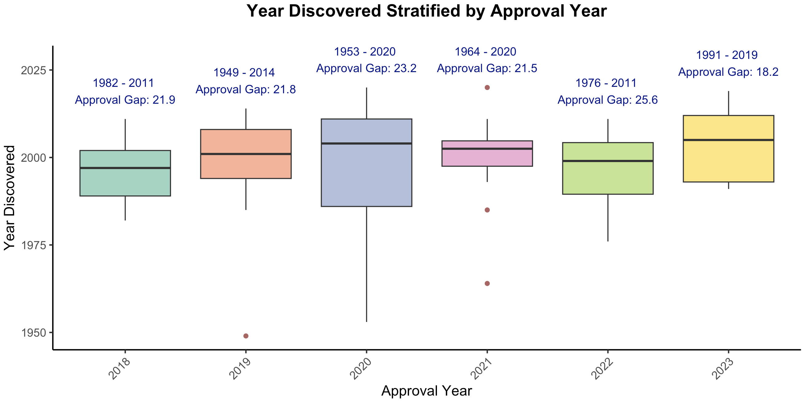

One of the most common tasks for the life sciences consultant is to perform an exercise called 'target identification and indication selection'. The client has typically developed a platform technology that has the potential to be applied across a wide range of therapeutic areas. For example, you may encounter a discovery platform to discover RNA targeting small molecules, or a screening platform for so-called catalytic antibodies that can degrade extracellular proteins. The consultant's job is to decide which nails to hit first. 

Finding targets is the best example of "artisanal alpha" that is difficult to automate with artificial intelligence. It's a multimodal task with a low rate of success, and when there is success, a lot of redundancy (me-too targets). There is always going to be an information limit with regard to competitive intelligence. It is impossible to know and be up to date with everything (including non-public information), while simultaneously knowing who to trust and who not to trust.

While doing this exercise, one question has consistently bothered me. Understanding competitive differentiation or what to believe from industry or academic publications is important and can help narrow in on a candidate. But I think the most impressive and high leverage thing a biologist can do is to have the spine to go after unknown mechanisms that are uniquely enabled by the platform. Why does everyone go after the same handful of targets for the same handful of large indications? There are roughly 20k genes in the human genome, and only a fraction are currently actionable or currently drugged. Depending on the classification system, there are thousands of indications, very few of them have effective therapies. 

The first part of this issue, that only a fraction of the genome is druggable, is being solved by advancements in chemistry and AI. For example, transcription factors which have long been appreciated to be bonafide drivers of cancer, are only now druggable with technologies like molecular glues or PROTACs. Other difficult to ligand oncoproteins like KRAS and VAV1 are also newly druggable. Technology is no longer rate limiting.

__Now, it is the biologist's turn to contribute.__ No longer can we complain that there aren't tool compounds, that it's too labor intensive to develop antibodies, or that we don't have sensitive measurement technologies. There are only 20,000 genes that need to be matched to just a few thousand diseases. Most genes can be ruled out as drug targets very easily with common sense (e.g. can't be drugging essential proteins outside of oncology). We could have very easily had millions of targetable proteins across millions of potential diseases.

## Why care about targets?

It is a good question given the comparably better success of phenotypic screening vs target based drug discovery. But starting with targets has several important benefits:

1. _Being able to better predict toxicity._ If you know what your molecule targets, you can start to understand where the toxicity is coming from (e.g. is it on target or off target), whether there are toxicity/efficacy tradeoffs, or which parts of the molecule can be engineered to avoid the toxicity.

2. _Being able to run optimization on a target_ (making it easier to explore chemical space). If you know the target, then you can know its structure. With a structure, you can optimize binding. Modeling binding to a target is generally easier (due to physics based modeling) than trying to predict efficacy on a biological endpoint (which is likely also more expensive).

3. _Being able to rationally design combinations._ If you understand the target, you can do biomarker studies on patients and understand resistance mechanisms and efficacy biomarkers. This could help you pick how to combine certain targets (e.g. EGFR antibody + BRAF inhibitor in CRC due to pathway reactivation). On the other hand, Adam Palmer has taught us that synergy is rare and really all we should be doing is combining two drugs that both have efficacy which in theory you could do just with phenotypic screening. However, I think that we will one day be able to design rational synergistic regimens or at the very least have biomarkers (which are harder to find if you use a phenotypic approach). 

From a practical point of view, targets are also becoming the most scarce resource in biotech. Chemistry and engineering are going to be commoditized by AI. There will be innovation around the edges like half life or delivery mechanisms, or developing more complicated products (e.g. glucose responsive insulin, CAR-T). But I would argue that these are all secondary to picking the right mechanism. Target selection cannot really be commoditized (unless working in the 'best in class' space) because it relies on clinical development -- you can't really commoditize clinical trials since its people's lives.

Picking a target is being __'directionally correct'__ as Peter Thiel would say, in the context of uncertainty.

## How are targets discovered today?

Target discovery is all -omics. The complexity comes in where to apply it. I think that there are 3 layers of omics, which I'll term primary, secondary, and tertiary. These relate to how directly connected the discovery was to an -omics readout.

1. Primary Omics 

The most common method of target discovery has been genomic sequencing of diseased samples and comparing mutations versus ostensibly normal tissue. This applies both on the population level (ie. GWAS), but also on the individual level (tumor vs normal tissue analysis). 

Historically, these targets not only have a [high success rate](https://www.nature.com/articles/s41586-024-07316-0) in clinical trials, but they are also just low hanging fruit. A mutated gene is highly likely to be contributing to pathology and by understanding the downstream effects of loss of function or gain of function mutations, one can rationally design a therapy. Alternatively, the absence of mutations in a healthy population protected from pathology can also be used to nominate targets. For example, PCSK9 loss of function mutations are protective for hypercholesterolemia and as a result PCSK9 therapeutic antibodies have been developed.

Analysis of the transcriptome or proteome can also be useful particularly in cancer. Cell surface targeted drugs like therapeutic antibodies or CAR-T benefit from large cohort staining or RNAseq experiments to identify tumor associated antigens.

For more complicated targets like cytokines, RNAseq has also been used to identify increased expression in diseased lesions. 

2. Secondary Omics

Secondary to the simple approach of analyzing diseased tissue is deriving targets from phenotype. "Phenotypic screening" goes beyond the simplicity of screening libraries of small molecules on cell lines and looking for signs of disease reversal. This category also includes CRISPR screens, cell line libraries, and other methods of 'brute forcing' target discovery.

These approaches have had a history of success, with many drugs being approved solely from the results of a phenotypic screening approach. Indeed, many drugs don't even have a solid understanding of the target (e.g. aspirin, acetaminophen, etc). 

Pioneered in cancer but certainly expanding to other indications, CRISPR screens are now frequently used to identify gene targets capable of inducing a phenotype. For cancer, the readout is typically loss in proliferative capacity, but there are many other creative ways to design screening endpoints. In vivo screens have identified new cancer immunotherapy targets like [Ptpn2](https://www.nature.com/articles/nature23270).

3. Tertiary Omics

Finally, tertiary -omics is what I refer to as 'artisanal alpha'. These are the targets which require new model systems or new techniques to uncover. These are hypothesis driven and are much more difficult to brute force. Maybe a metabolic pathway had to be figured out first. Maybe we needed to understand how the immune system worked before understanding that cells instead of specific proteins can be pathogenic. Tertiary omics targets have historically led to giant breakthroughs, and many of the best selling and most impactful drugs are not from brute force approaches (PD1 antibodies, steroids, statins, Dupixent, anti-cytokine drugs in general, Advair, GLP1s, etc.).

Beyond background knowledge, tertiary omics targets often require new discovery formats. For example, many immunotherapy targets including PD1, LAG3, and CTLA-4 were discovered in reductionist T cell activation and exhaustion models, sometimes involving transgenic OT1 mice. Inventing this system was crucial to discovering these molecules and their functions. Another example is the discovery of IL-11. This came in an RNAseq assay simply measuring the transcriptional output of treatment with TGFb. The critical insight was understanding that TGFb itself may not be druggable, but its effector proteins may be, and now there is an emerging story of IL-11 inhibition in fibrotic diseases. Similar tricks can be used for other pathogenic secreted proteins (e.g. STAT6 inhibition in type 2 autoimmunity driven conditions).

Mouse models are often a critical aspect of untangling the biology behind tertiary omics targets. While these certainly can be brute forced (e.g. the work of the [IMPC](https://www.mousephenotype.org/) to create KO mouse strains for every single gene), making organ or cell type specific knockouts is probably not going to happen. Thus, building mouse models in a hypothesis driven format requires a degree of artisanal decision making. Tissue specific gene knockout mouse models have been critical for verifying phenotypes, especially for pathogenic secreted proteins like cytokines, and are also useful as gold standard preclinical models for testing new therapeutic agents.

You can also get lucky by identifying off target effects of selective inhibitors of a certain target. This is a form of backwards phenotypic screening which requires an astute scientist to notice and follow up on clinical observations.

## The topic of today

Here, we will review 75 drug targets from the past 6 years of drug approvals (from NRDD's new targets series; e.g. the [most recent](https://www.nature.com/articles/d41573-024-00057-9) from earlier this year), and describe how each target was discovered. Major classes of targets are cytokines and their receptors, GPCRs, secreted proteins, kinases, viral proteins, and tumor associated antigens. Approved drugs include several new modalities including antibody drug conjugates (enfortumab vedotin, polatuzumab vedotin, belantamab mafadotin, sacituzumab govitecan, tisotumab vedotin) targeting NECTIN4, CD79b, TROP2, TF, and BCMA, siRNAs (lumasiran, nedosiran, givosiran) targeting ALAS1, HAO1, and LDHA, ASOs (tofersen, golodirsen, volanesorsen) for dystrophin exon 53, APOC3, and SOD1, and Radiolabeled chemotherapy or imaging agents (Borofalan (10B), Ga 68 PSMA-11, Flortaucipir F 18). Peptides, fusion proteins, mAbs, small molecules of note include the super long half life small molecule HIV drug lenacapavir, the GLP1 peptide tirzepatide, and the first approved KRAS inhibitor sotorasib.

There were 37 primary, 7 secondary, and 30 tertiary omics level targets, and 1 drug (Luspatercept) which we are still unsure of the mechanism. These medicines were approved on average 20 years after their target was discovered. 

#### Primary level -omics targets

Most of the primary level targets were discovered with sequencing. Genes are first cloned, and mutations are identified in families with a history of disease. For cancer, tumor mRNA or DNA sequencing, or protein staining has been a straightforward way of identifying cancer selective targets.

Virus sequencing studies also nominate viral proteins for small molecule antivirals.

In some instances a leap needs to be made based on the function of the mutated protein. For example, paroxysmal nocturnal haemoglobinuria is characterized by mutations in PIG-A, which prevents surface presentation of complement inhibitors on red blood cells. The approved drugs are thus complement targeted instead of PIG-A targeted.

Primary level targets are reaching saturation. Some very large GWAS studies are potentially identifying new risk alleles, but on the whole its harder and harder to squeeze out new variants.

#### Secondary level -omics targets

In this analysis, I found two categories of secondary targets. The first is for identifying oncogenes. NTRK and KRAS were both discovered by cloning genes from tumor cell lines and assaying their transforming potential by transduction into 'normal' cell lines like NIH 3T3 cells.

The second category is identification of a target through conventional phenotypic screening, or an existing drug phenotype relationship. For example, Leptomycin B, a potent compound capable of killing multiple myeloma cells was found to target the nuclear transporter XPO1. Another example is α-melanocyte-stimulating hormone, which had been found to induce sexual behavior in male and female rats. Later, it was discovered that the target was MC4R. 

These secondary level targets are underrepresented but I think will become a substantial source of target discovery in the coming decades. Projects like the Cancer Dependency Map have already identified synthetic lethal targets like WRN which inevitably will lead to approvable drugs. As screening  endpoints become more advanced (e.g. more sophisticated endpoints outside of death, in vivo spatial perturb-seq, multiplexed screening, etc), it is likely that we will discover new targets that will translate into new therapeutics. 

#### Tertiary level -omics targets

The last category is perhaps the most interesting, as it relies on original thought. This may partly involve some profiling but for the most part requires some leap of faith based on a hunch or a critical orthogonal piece of data. In many cases, this could be a clinical observation paired with some gene expression analysis. For example, in the 2000s, scientists noticed that patients infused with the soluble protein CGRP (used to test vascular tone) develop headaches. It was also found that CGRP is enriched in the plasma, saliva, and tear fluid of patients with migraine attacks. In 2018, there were two antibodies approved for migraine, targeting the soluble protein and the CGRP receptor. 

In other instances, the target hypothesis came from some mechanistic detail from a biochemistry experiment (e.g. protein co-IP, isolation of an organ restricted or phenomena associated molecule, metabolism pathway), which prompted generation of a mouse model clearly demonstrating a phenotype. For example, hyperoxaluria type 1 is a condition characterized by too much oxalate, in some cases due to inability to metabolize it. Using the knowledge that HAO1 is responsible for producing oxalate, a group published a double KO mouse model showing a normal phenotype in mice with both HAO1 and hyperoxaluria associated mutations.

Finally, mouse models can often come first, unveiling biology that later lead to a drug target. For example, the biology of FcRn in antibody recycling and maternal-fetal antibody transfer was studied with knockout mouse models, and now with knowledge that some autoimmune conditions are primarily due to autoantibodies, FcRn inhibitors have become clinically very useful.

Given the more creative nature of how tertiary targets are discovered, it is hard to predict their future incidence. Maybe we need to be doing more weird experiments, or maybe all the data we need is already here and we just need to think harder. 

## The upshot

My suspicion is that continued improvement in the fidelity of model systems will drive the discovery of new targets. But I also suspect that there will continue to be new targets discovered simply because there is alpha in being 'better at target discovery'. There are no disciplines for target discovery. There is no "target discovery" PhD. The industrialization happens in industry, which seems non-optimal. Drug developers typically focus on a particular therapeutic area, like oncology, or neuroscience, or I&I, etc. Maybe there should be people who have expertise across indications, and are skilled at picking targets, designing clinical trials, and evaluating preclinical datasets. I have a lot of respect for people at groups like BridgeBio or Roivant who get to do this. I can't help but feel that our biopharma industry would be more efficient if we had more proactive capital allocators (the traditional VC model is by contrast quite __re__-active).

What does such training look like? Obviously you need reps to understand across many drugs, what their story was. You need quite a bit of background knowledge too -- what modalities exist, what their strengths/weaknesses are, where to apply them. You need to be fluent in what the standard of care is, why it works, and why it doesn't. 

How would you educate yourself?

1. Start a spreadsheet where you keep track of all indications and targets. 
2. Read as many R&D day presentations as possible
3. Keep up with clinical trial readouts, especially of novel mechanisms and modalities
4. Read UpToDate and new clinical trial publications religiously

__Drug discovery is a series of experiments.__

Scientific intuition is a thing. There are efficient scientists who seemingly make discovery after discovery, and scientists who can either be favorably characterized as thorough, or more unfavorably as wasteful. They need to repeat experiments that are done poorly, they do experiments that don't teach them anything new, they don't learn from the mistakes or progress of others.

Some drug developers run poorly controlled or underpowered trials, they make me-too undifferentiated medicines, and they are slow to adapt following readouts of critical clinical trials.

The prolific scientist is technically competent. They can execute screens, don't fail Western blots, and can apply bioinformatics tools. The prolific drug developer knows how to run a patent search, evaluates clinical trial data correctly, and reaches the correct interpretation from a review of academic literature.

Drug discovery is a science, and calls for a new breed of drug discovery scientist.
