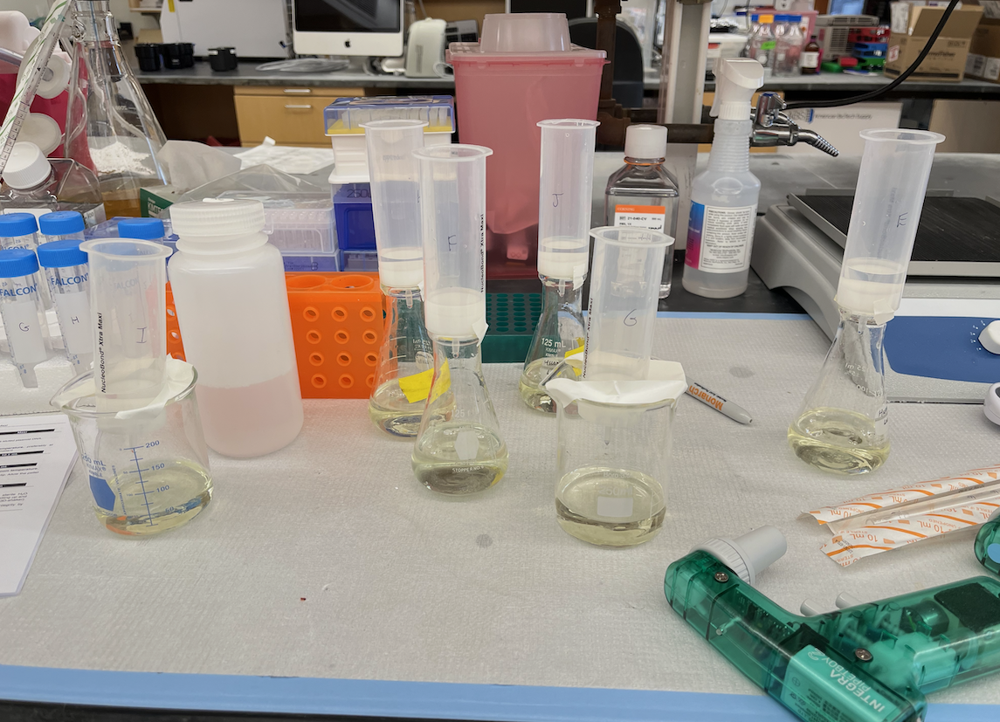
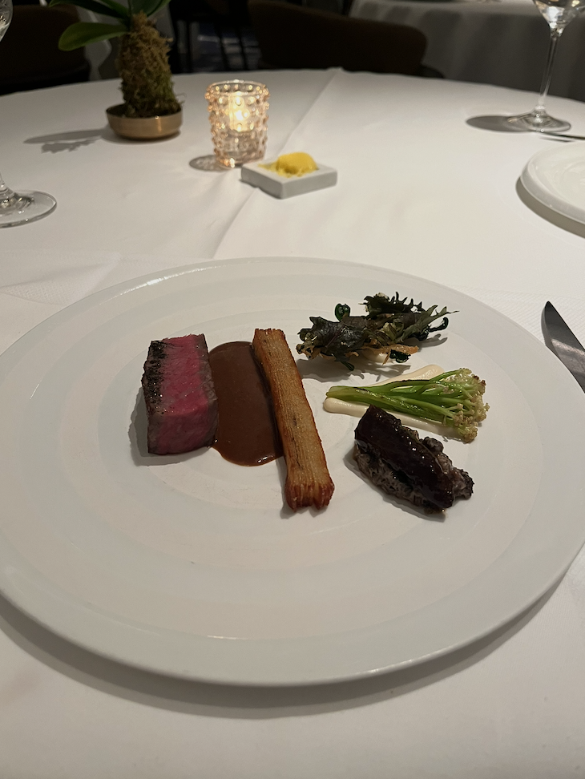
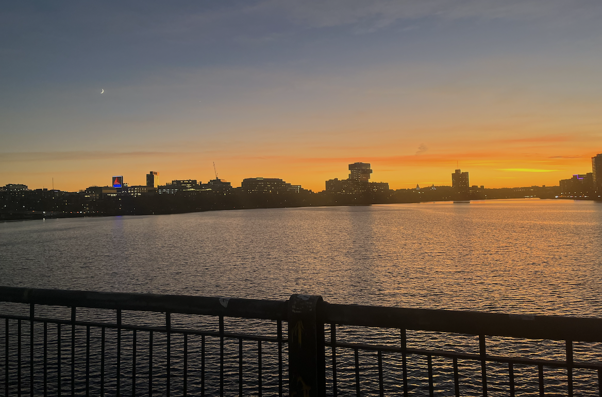

The years keep coming and they won't stop coming. 

This year felt very fast and burned into my psyche two graphics on Twitter. The [first](https://waitbutwhy.com/2015/12/the-tail-end.html) was a graphic of how many times you will see your parents for the rest of your life. The [second](https://www.vox.com/2015/7/20/9003175/years-passing-visualization) was a graphic of how long each day feels throughout your life. The takeaway is that most of the time you have spent with your parents is already over and that each passing day feels shorter than the day before it. By the time you are my age, your life is essentially half over (viscerally). Then in May, there was also a very disturbing paper on homozygous [APOE4](https://www.nature.com/articles/s41591-024-02931-w) mutations (which I have), and a reported virtually guaranteed Alzheimer's diagnosis. All of these facts have greatly affected how I have been thinking about life in both positive and negative ways.

I think the first time I viscerally felt the passage of time was when I was around the age of 10. Every year, time was just mistakenly writing 1/6/10 instead of 1/6/11. When I got to middle school, I thought 2014 was so far away, then 2018, then 2022, and now it feels like 2026 is just around the corner. Is adulthood just realizing you don't have time anymore? This year, I often felt like I didn't have time to sit down or think. There was always the next call, chore, or research task. In November, I got some advice that it is already time to start thinking about post-grad opportunities. I wonder if there is a German word for feeling simultaneously overwhelmed yet still behind where you want to be. Maybe "capitalism".

Some years feel intentional, like you have time to proactively design your life. This year and last year felt very reactive. A firehose of new opportunities and experiences that I am incredibly grateful for. I'm 2-3x the person that I was 2 years ago, but it felt like 2nd/3rd grade where things kind of just happened to you without being able to process it.

## Did anything change from last year?

A lot of stuff was similar to last year. For travel, there were 42 busses, roadtrips, flights, or trains. Roughly two trips a month, down 2 trips overall. Hopefully the reason why this (and last year) felt fast was because of travel. Spotify consumption continues to decline, now only in 95th %ile with 61k listening minutes this year. Screentime I think actually got better this year. Really the only screentime is a few videos before bed or scrolling Twitter throughout the day. The rest is white noise, something to help turn off the brain. 

What is great is that last year's post is cringe. Endless platitudes of blah and nonspecific goals. While this makes evaluation of whether goals were accomplished difficult, I do think that embarrassment at prior behavior is an indicator of personal growth. 

## Accomplishments

It was again another productive year in the lab. One of the biggest insecurities for me coming into graduate school was whether I could actually come up with ideas and execute experiments. Last year, I wrote that I felt happy with my ability to ideate, analyze, and present data, as well as my ability to evaluate therapeutic targets. Each of these aspects has continued to improve and this year I am happy to report that I have taken a big leap experimentally as well. 

I now understand and can perform all the basic preclinical in vitro assays that a cancer biologist would use. These include CRISPR engineering workflows, various proliferation assays, invasion/migration assays, organoids, and molecular techniques for analysis such as RNAseq, Western blotting, immunofluorescense, etc. Last year, I was particularly excited about learning cloning and microscopy, both of which I spent many hours doing. At certain times, I was culturing 18+ cell lines at once, with 4-5 experiments ongoing simultaneously. 

I helped execute several large scale multiplexed IF experiments (Lunaphore COMET) by designing a 40-plex panel and analyzing imaging data. I also probably did ~40 hours of imaging to collect CellPainting data on cultured cells. I successfully performed a CosMx spatial transcriptomics assay on cultured cells, something only a handful of other groups in the world have done. One of my goals coming into my PhD was to be able to execute a pooled screen. Remarkably, this got off the ground this year and everything worked out on the first try so I've been able to check that one off the bucket list.

Out of all the techniques and goals [I said that I wanted](https://www.dennisgong.com/blog/PhD/) out of my PhD, its very cool to see that I have checked off most of them. Lab automation software, animal studies, structural biology, chemistry, microfluidics are the major techniques I haven't been able to learn yet. Animal studies for sure I'll get to in the new year. Structural biology and chemistry I'll get to by myself, but probably not in the actual lab. I wrote about lab automation when thinking about how I wanted to make [my own lab](https://www.dennisgong.com/blog/lab/), but I probably won't be able to get to that or microfluidics unless I do a postdoc. I don't have and probably won't have a CNS paper unfortunately but honestly who cares.

I think we've found some interesting biology with respect to a progenitor-like cell state that seems to express neural genes, and a new-ish mechanism of resistance to emerging KRAS inhibitors. I've presented this year at AGBT, [AACR Pancreas](https://aacrjournals.org/cancerres/article/84/17_Supplement_2/B076/747720), and [AACR](https://aacrjournals.org/cancerres/article/84/6_Supplement/3988/740632). I got two papers to complete formal drafts (1 in review, and 1 in [press](https://www.cell.com/cancer-cell/fulltext/S1535-6108(24)00349-0)). Two additional papers were pushed to draft form near the end of the year and will be submitted to journals hopefully early next year. I performed the critical in vitro validation experiments for another paper published in September. A portion of my undergraduate [research](https://link.springer.com/article/10.1007/s12274-024-6589-2) was also published in April. I wrote 2 grants this year and went 1/2 with a 250k industry grant. I established 5 new collaborations.

What this year has shown me is that if I wanted to become an academic, I certainly could.

  ───────────

In addition to research, I finished several graduate program requirements including my qualifying exam, formal coursework (cardiovascular physiology and renal physiology), and formation of my thesis committee. 

I continued consulting activities with two early stage startups and a third upcoming in the new year. I deepened my investing activities ranging from seed to public companies.

Athletically, I ran another half marathon though mileage again was lower this year at 94.5 miles. But I also learned how to play squash and hit PRs in various weight lifting exercises so you win some you lose some.

I wrote a couple of blog posts I'm proud of and want to highlight:

1. [How to find new targets](https://www.dennisgong.com/blog/newtargets/) published earlier this month

2. [What my lab would do](https://www.dennisgong.com/blog/lab/)

3. [Is genius worth pursuing?](https://www.dennisgong.com/blog/AI/) (a commentary on AI in biology)

4. [Bispecific antibodies in cancer](https://www.dennisgong.com/blog/Antibodies/)

5. I also covered [Kymera](https://www.dennisgong.com/blog/KYMR/), [Revolution Medicines](https://www.dennisgong.com/blog/RVMD/), [Guardant](https://www.dennisgong.com/blog/Guardant/), and [Tempus AI](https://www.dennisgong.com/blog/TempusIPO/).

Lastly, I want to highlight four moments that helped refocus my year and bring me happiness:

1. Understanding my duty as a son, brother, grandson (~February and again ~August). Fortunately or unfortunately due to circumstances beyond my control, I feel a special responsibility beyond most people to 'be there' for my family. It is a lonely experience as immigrants and due to China's one child policy, Chinese families are already quite small.

2. Feeling proud of myself for the effort I've put into building my career (~August). Reflecting on the past 5 years, there has been a lot of compounding and improvement beyond what I could have ever imagined starting out. It makes me very optimistic about the next 5 years.

3. Reaching the truth for how to progress in your career (~November). I previously spent a lot of time hoping for life changing advice from people, believing that mentors are the key to success. Now I realize that this is only partly true. Most of your personal success is directly a function of yourself.

4. Feeling proud of the relationship I've built with my girlfriend (~December). My girlfriend and I have been dating for nearly 3 years and I must say that being in love with an amazing woman trumps all of the experiences that I have had over that timeframe. Spiritual satisfaction probably becomes ever more important as you get older and out of all the life changing aspects of finding a partner, I think the best has been the fact that it is always fun to talk and laugh.

## Some life lessons

I think every year, your expectation of yourself and the world around you changes. Call it being jaded, pessimistic, cynical, whatever. What I have noticed is that this year, the expectations to produce (papers, money, knowledge) become much more concrete, which has influenced what I view as the most important axioms to live by. Last year's reflection (2023) takeaway theme/lesson was maturity, and really I think this was a way of saying 'taste' (ie. knowing what is good and what is bad). This year (2024) has told me that you not only need taste, but also your own refocused activity towards what you think is good. Knowing what is good and bad is not the same as working on something good; you need to understand where to point your effort and __also__ to move in that direction. And so to simplify that into nice sounding phrases, my takeaways are the following:

### 1. Simply don't work for or with untalented people, it will pollute your headspace and is often unproductive in the first place.

Something I learned this year was how easily you can tell if someone actually cares about something versus just going through the motions hoping that someone else takes over. Maybe a year or two ago, I would have told you that everyone (especially at Harvard/MIT) is trying their best. But at the end of the day, some people just won't listen to your advice, or ultimately just don't care. The worst harmonize both incompetence and lack of effort. 

These types of red flags are not just there for decoration, they are calls for action.

### 2. You don't need to solve everyone's problems. 

Simply put, don't work on things you don't believe in. Over the course of the year, you get looped into these random calls to help people. It's admirable to say yes, but also okay to say no.

If other people have issues, and continuously exploit your willingness to help to compensate for said issues, that's not a healthy relationship.

If instead you want to cultivate a long term relationship with someone where it is clear that the other side is trying their best, I think that is totally valid and simply the right thing to do, to uplift and support. But choose these relationships very carefully. 

### 3. Just ship.

Sometimes I think I am working very hard all of the time, but then I see these 17 year old CEOs on Twitter and I remember that there are levels to things. Whatever you are doing, there is always a way to make it higher quality, faster, and better overall.

Whether it is blog posts, pretty much biweekly consulting sprints, coursework, papers, experiments, or just helping out your family, you can pretty much always be better. 

Spending time to make your processes more efficient so that you can accomplish more things is a function of wanting it more than you did the previous day.

### 4. It is your job to seek out new experiences.

Being at an elite academic institution has the effect of training you to say no to many things. This is good in that you become selective on what you choose to use your time for, but has the negative consequence of making you less exploratory.

I realized during the summer that I would go weeks without going to an interesting talk, or listening to a high quality podcast, or even having a productive conversation about work. At some point, you need to stop being a baby bird and waiting for opportunities or new knowledge to be force fed down your throat. Curating information intake is a __continuous__ process, not a set it and forget it kind of deal.

Without knowing, I personally graduated from self-help books to Medium articles to Reddit to Twitter, and now probably the next evolution is textbooks, equity research reports, and academic journals. Patents, R&D day presentations, BiotechTV, ChatGPT etc. are new sources of information that need to be integrated into the information diet and consumption routine.

## Deciding on a career

Something that stung this year was rejections from two opportunities I thought I had a pretty good shot at. In these situations where there is literally zero feedback given to you as a candidate, you can do one of two things: 1. make yourself more attractive to the selection committee, or 2. ignore and get better. Figuring out how and where to get better led to a better understanding of what kind of career I wanted to have.

The first thing I realized was that the academic route is not for me. Academia is about polishing rocks and hiding blemishes. I didn't want to spend time thinking about how to get something past a reviewer or spending a week on an experiment that doesn't provide any scientific value. The reward functions are also poorly defined and forever dependent on motivating people to work for you and being well liked in the academic community. Lastly, there isn't a lot of money to be made (and at some point you need to make money). Academia is like a grocery store, the margins are tiny. In order to create anything useful, people (ie. biotech entrepreneurs) take ingredients (ie. patents, technology) and make something nice out of it. 

The other high upside options are in investing. Early or late stage venture capital, sell-side equity research, hedge funds. I felt like VC isn't a great fit because it relies on information arbitrage and personal connections. I don't want to lose because someone decided to not give me allocation in a round. I appreciate jobs where 'anyone can win'.

I think my personality is high intensity and somewhat abrasive and I highly value achievement by merit, which I think fits either the founder/operator or hedge funds. But for hedge funds, I frankly didn't want to spend time thinking about how lenient the FDA is going to be and how that might affect price action on my gene therapy stock. What I appreciate about the founder role is that if you do your job well, you save lives. I appreciate that decision making is the key resource, rather than the pace at which you do experiments or set up 'catch up' calls.

## Goal setting

As far as new years resolutions go, I typically take them very seriously. Unfortunately, last year's goals were far to nonspecific and difficult to empirially measure. We fix that this year:

1. __Write 15 high quality blog posts.__ The writing has definitely improved. It is more concise, it is more fun to reread. Off the bat, I have plans to do a holistic review of human diseases and the companies tackling each one, and their associated drug mechanisms. I want to do more research on biotech companies and think about what it would be like to go L/S public stocks. I also want to understand the role of China and the biopharma ecosystem there. I want to know why a ton of new R&D is coming from China.

2. __Have some urgency in taking care of physical health.__ I don't think travel is ever going to stop being a part of my life. Keeping up a 2x weekly gym schedule despite travel is a goal. I also want to max out most of the machines in the gym. I have already set the goal of running 2 half marathons in 2025 and will be signing up for races.

3. __Identify opportunities for companies.__ One of the more productive activities I had over the past year was thinking about business opportunities or research opportunities that, to me, seem like good ideas. At this juncture, I think brainstorming is rate limiting for me to eventually start a company. I had 3 or 4 decent ideas in 2024, and I'm hoping for on the order of 20+ in 2025.

Here is to a more intentional year. Thank you to everyone who has been along for the ride.

And as is tradition...

## Here are pictures

### January

 

### February

### March

### April

### May

### June

### July

### August

### September

### October

### November

### December

