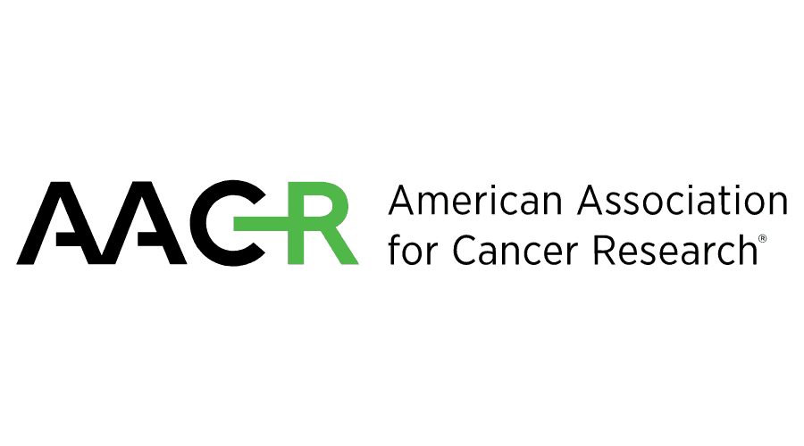
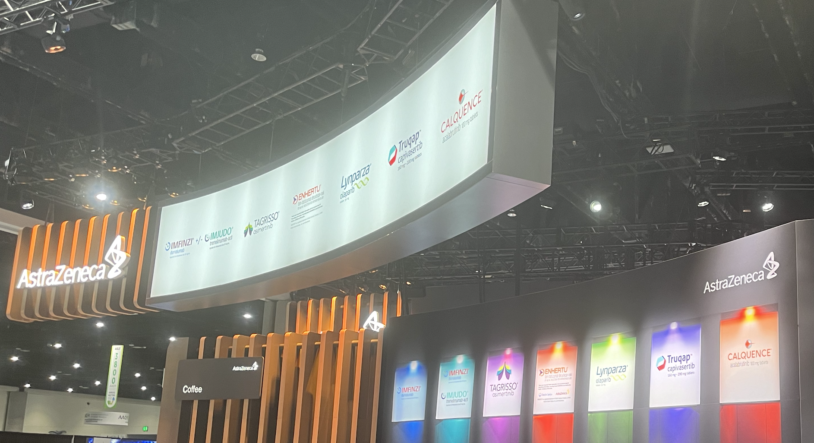
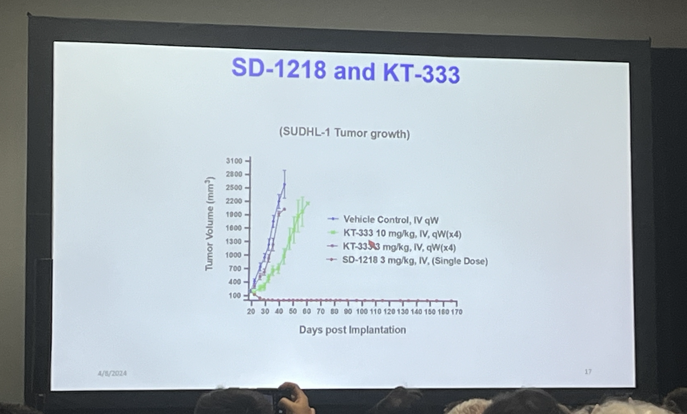
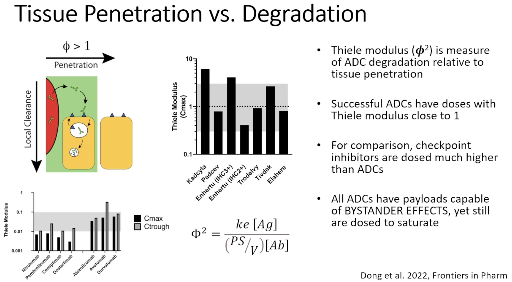
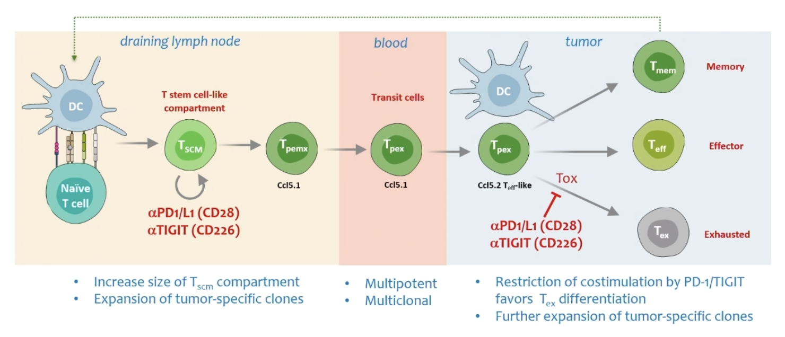
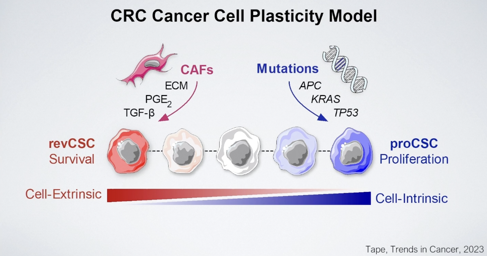
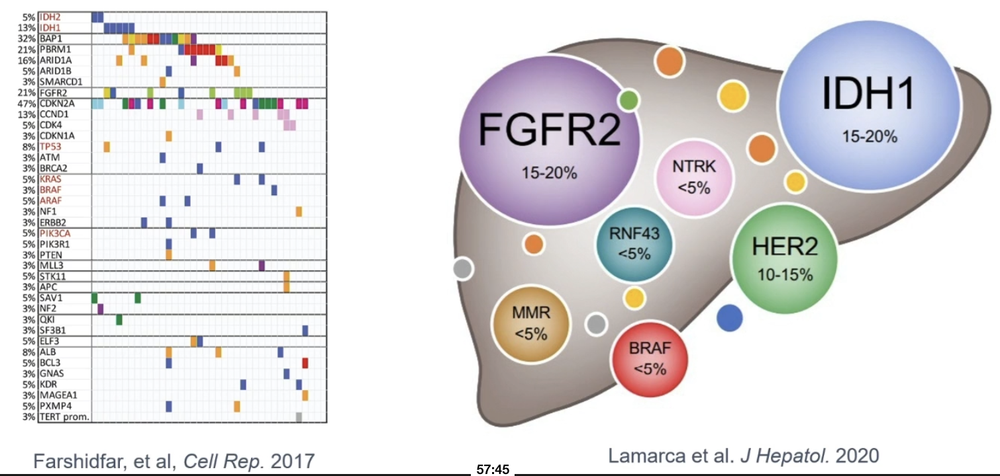

In this blog post I will review what I learned from AACR 2024, held in San Diego from April 7-11 2024. The conference was beautiful; everyday was sunny and action packed. It was incredibly crowded, with more than 20k people in the San Diego convention center. San Diego in contrast to the East Coast feels like a place where there is no one in charge. The food and weather is exquisite and the city feels empty and without hustle. Their car culture means that not a lot of people are walking around, but their downtown area still feels bustling and cozy to walk around in. 

In contrast, the science was simply too much. There is a lot of garbage. Not to disparage any individual investigator, but the reality of our current scientific ecosystem is that without contextualization, your science just floats in the middle of nowhere. I felt this especially at this conference, because of the variance between the high quality presentations given by industry veterans and PIs/postdocs versus the poorly motivated student presented posters. It is hard to care about your underpowered miRNA signature that predicts treatment sensitivity to random therapy X. Your spatial analysis identified heterogeneity and a gene signature predictive of immune infiltration. Tremendous.

Chemistry shined the brightest at this meeting (2 talks at opening plenary and widely covered on social media). There was lots of interest in ADCs, radiopharmaceuticals, and PROTACs/molecular glues. Cancer vaccines made a splash and look really promising. At any given time, there may have been 10-15 things happening concurrently, but AACR has implemented recording of all major sessions. I've probably watched 35-40 of these sessions combining in person and 2x Vimeo recordings. My notes of interesting ideas are scattered below.

Caution: there were lots of DO NOT POST talks which unfortunately has forced a lot of vagueness both on social media and here.

But before beginning, what an ad from AstraZeneca. Just an incredible picture

# New drugs 

### Targeted Therapy

- KRASi + EGFR blockade with cetuximab will likely be a thing, though the responses look weak and short lived. This comes from data in CRC combining adagrasib and cetuximab, covered [here](https://www.aacr.org/about-the-aacr/newsroom/news-releases/adagrasib-plus-cetuximab-may-provide-clinical-benefit-in-patients-with-krasg12c-mutated-colorectal-cancer/) and in [Cancer Discovery](https://aacrjournals.org/cancerdiscovery/article/doi/10.1158/2159-8290.CD-24-0217/742949/Efficacy-and-Safety-of-Adagrasib-plus-Cetuximab-in).

- BMS-986365, a AR degrader and inhibitor looks like a very real drug. Cool mechanism of both degradation and inhibition. The authors show that there is a relationship between agonism and degradation, where good degraders typically act as agonists of the protein. This differentiates BMS-986365 from other degraders of AR because the drug is able to offer dual blockade and degradation of protein.

- Kymera disclosed the structure of their STAT3 degrader KT-333. There was a funny story with a UMich postdoc who somehow guessed the structure of KT-333 and used it as a less potent control in several of their preclinical studies. For what its worth, the UMich compound looks far more potent than KT-333 but they did not do a great job of answering questions about tox/off-targets/specificity. 

- TNG260 looks like a real drug for STK11 mutant lung cancer. Potent and selective inhibitor of HDAC1-CoREST complex which is a synthetic lethal target in STK11 mutant cancers. [Abstract](https://aacrjournals.org/cancerres/article/83/7_Supplement/ND12/727044/Abstract-ND12-TNG260-A-novel-orally-active-CoREST)

- NX-5948 BTK degrader. Reason for BTK degraders? 1. Treatment emergent resistance mutations 2. scaffolding function 3. Greater potency at lower dose. [Publication](https://www.science.org/doi/10.1126/science.adi5798). Degraders are PK advantaged due to their catalytic activity. Requires lower concentration in plasma. Subnanomolar concentrations compared to inhibitors which are much higher. This BTK degrader in particular is brain-penetrant, providing important differentiation vs other BTK inhibitors.

- Foghorn Therapeutics selective EP300/CBP synthetic lethal degraders. Looks interesting but hard to say anything about this target without clinical data. The mouse data looks fine.

- Revolution Medicines drugs look really good. G12C specific + pan-RAS doublets are effective. Inhibition of both mutant and wild type RAS, preventing amplification of KRAS. Deeper RAS pathway inhibition. KRAS G12D (on) specific covalent inhibitor in particular got a lot of attention from medicinal chemists because it is a very complicated drug, and overturned a lot of skepticism for drugging G12 aspartic acid. Two Nature papers, one exploring specifically in [PDAC](https://www.nature.com/articles/s41586-024-07379-z, and another [pan-cancer](https://www.nature.com/articles/s41586-024-07205-6). Another paper in [Cancer Discovery](https://aacrjournals.org/cancerdiscovery/article/doi/10.1158/2159-8290.CD-24-0027/742968/Translational-and-Therapeutic-Evaluation-of-RAS) showing effects in humans.

- PRC2 inhibitor ORIC-944 induces luminal cell fate with high susceptibility to AR inhibition. Meh. [twitter](https://twitter.com/KwiatBerlin/status/1777088046720032935)

- [AZ4331](https://aacrjournals.org/cancerres/article/84/6_Supplement/6589/738352/Abstract-6589-Discovery-of-potent-and-selective) new TEAD inhibitor. Potential applications in LOF Hippo pathway mutations (e.g. NF2 mutant mesothelioma, LATS) and YAP/TAZ amplification, and also as an adaptive resistance mechanism, for example in response to EGFR TKI and KRAS inhibition.

- [Neutrophil elastase drug](https://www.cell.com/cell/pdf/S0092-8674(21)00495-5.pdf). NI17465. Systemically administered elastase with selectivity for cancer cells. Wild mechanism and weird company

- Daiichi Sankyo has a TA-MUC1 targeted ADC (DS3939a) in Phase I development. TA-MUC1 has shorter glycan chains, with highest expression in bladder, breast, ovarian, and lung cancers. The preclinical evaluation looks as good as it can for a new target. Robust tumor regressions in mice at acceptable doses.

- Profound Bio EGFR - cMET bispecific ADC (PRO1286). A better Ambivantamab, hopefully. They developed a highly hydrophilic linker drug platform called sesutecan using an exatecan payload. 

- IPH45, next generation NECTIN4 ADC with improved bystander activity and response rate in PDX models of urothelial carcinoma. Unique epitope, cleavable hydrophilic linker, DAR8 with exatecan & bystander effect

- Arvinas has a BCL6 degrader (ARV-393) for use in NHL. Looks fine. [Here](https://classic.clinicaltrials.gov/ct2/show/NCT06393738) is the clinical trials page.

- AZD8421 - CDK2 inhibitor. CDK2 dependency in ER+ breast cancers resistant to CDK4/6 is due to CCNE1 amplification/overexpression, Rb loss, Myc overexpression, PTEN loss, and adaptive upregulation of PI3K. Looks okay not great.

- BLU-222 another CDK2 inhibitor [poster](https://emailer.hcg-int.com/bpm/03282024/blu-222-ccne1.pdf)

- M3554 - GD2 ADC. Reduced ADCC and CDC via antibody engineering to reduce toxicities. Nice strong antitumor activity

- AstraZeneca saruparib PARP1 selective inhibitor has improved therapeutic window over previous PARP inhibitors. 49% ORR in Phase 1/2 PETRA trial

- Various new KRAS allele specific inhibitors were disclosed including Quanta Therapeutics KRAS G12V (QTX3544); Huge crowd in front of poster. Frontier Medicines FMC-376 G12C (on) and (off) inhibitor. Verastem Oncology GFH375/VS-7375 KRAS G12D (on) and (off) inhibitor. [D3S-001](https://aacrjournals.org/cancerdiscovery/article/doi/10.1158/2159-8290.CD-24-0006/745202/D3S-001-a-KRAS-G12C-inhibitor-with-rapid-target) D3 Bio (Wuxi) KRAS G12C (off) inhibitor with rapid kinetics.

- BBO-8520 deserves a point on its own. First in class direct inhibitor of KRAS (on). Binds to switch II pocket. Forms covalent bond with C12. Newly synthesized KRAS is GTP-bound. 1st (adagrasib, sotorasib) and 2nd generation (divarasib) KRAS inhibitors leave efficacy on the table. (OFF) inhibitors require cycling for efficacy. Looks very good in the preclinical assays. Pretty short half life in mice. You see amplification of KRAS as a mechanism of resistance for (off) inhibitors but not for this (on) inhibitor. Does resistance come from normal RAS or mutant RAS? Ryan Corcoran [paper](https://www.ncbi.nlm.nih.gov/pmc/articles/PMC9809542/)

- Mythic Therapeutics pH sensitive cMET ADC published [poster](https://mythictx.com/wp-content/uploads/2024/04/AACR-24-Poster-Final-03132024.pdf) and [paper](https://aacrjournals.org/mct/article/doi/10.1158/1535-7163.MCT-23-0784/745066/MYTX-011-a-pH-dependent-anti-cMET-antibody-drug)

- PF-07220060 Selective CDK4 inhibitor decreases myeloid and neutrophil toxicity. Increased CDK4 coverage enables higher dosing and greater tumor growth inhibition. 28.6% ORR in mBC patients who have progressed on prior CDK4/6 and endocrine therapy

- WRN inhibitors HRO761, VVD-214, and GSK_WRN4 made a big splash at AACR. Nature papers [1: Novartis](https://www.nature.com/articles/s41586-024-07350-y) [2: Vividion](https://www.nature.com/articles/s41586-024-07318-y) and in Cancer Discovery [3: GSK/Sanger](https://aacrjournals.org/cancerdiscovery/article/doi/10.1158/2159-8290.CD-24-0052/742950/Novel-WRN-Helicase-Inhibitors-Selectively-Target) collectively show how WRN was discovered from genome wide CRISPR screening datasets as a synthetic lethal target in MSI cancers. However, difficulties in targeting WRN persisted until fragment based screening approaches (GSK), Vividion's proprietary chemoproteomics platform, and novel WRN inhibition assays (Novartis) enabled drug development campaigns.

- Improved tumor:salivary gland ratios with 225Ac-PSMA-Trillium from Bayer. In Bayer fashion, they have no idea how this works. Small molecule based targeted alpha therapy

- Nested Therapeutics unveiled a compelling data package with concurrent publication in [Cancer Discovery](https://aacrjournals.org/cancerdiscovery/article/doi/10.1158/2159-8290.CD-24-0139/743146/The-Pan-RAF-MEK-Nondegrading-Molecular-Glue-NST) for their Pan-RAF-MEK molecular glue NST-628. Showed some superiority over direct KRAS inhibitors. I think this could be a compelling strategy to avoid mutation associated resistance mechanisms. 

- [PF-07799933](https://aacrjournals.org/cancerdiscovery/article/doi/10.1158/2159-8290.CD-24-0024/745099/A-next-generation-BRAF-inhibitor-overcomes) (ARRY-440) is a brain-penetrant, selective, pan-mutant BRAF inhibitor. Looks pretty good!

### Immunotherapy

- ABBV-303: a cMet targeted TriNKET immune engager. anti-NKG2D (low affinity) + anti-cMet (high affinity) with IgG1 Fc.

- Some [interesting data](https://aacrjournals.org/cancerdiscovery/article/doi/10.1158/2159-8290.CD-24-0102/742926/CD70-Targeted-Allogeneic-CAR-T-Cell-Therapy-for) from CRISPR Therapeutics allogeneic CAR-T in RCC with concurrent publication in Cancer Discovery. One CR lasting out for 3 years. Longest ever response to an allogeneic CAR-T in a solid tumor setting.

- GV20 Therapeutics interesting IGSF8 antibody discovered by predicting antibodies produced in humans with cancer that may be having functional effect. Does not have cell intrinsic activity but when co-cultured with NK cells, has activity. Phase I clinical trial shows monotherapy efficacy. Paper accepted to Cell. Interesting that patients naturally make PD-1 antibodies

- Dual blockade of TIGIT and CD96 looks much more potent that anti-TIGIT alone. BMS-986442 is in Phase I clinical trials.

- Shattuck labs - TRIM7 inhibition. May be a driver of ICB inhibition

- BioNTech personalized cancer vaccine enables long term >3 year survival in PDAC patients (6/16 responders). autogene cevumeran. 20 neoantigen targets. Clinical trial [link](https://classic.clinicaltrials.gov/ct2/show/NCT05968326?term=GO44479&draw=2&rank=1) for global randomized trial of 260 patients.

- Moderna cancer vaccines (mRNA-4157). In melanoma, open label Phase 2 trial, after 18 months 78.6% of those who got the combination had no recurrence of their cancer, compared to 62.2% of patients who got the pembrolizumab alone. Additional data in Head and Neck at AACR showing immune activation and safety

- Transgene [TG4050](https://www.aacr.org/about-the-aacr/newsroom/news-releases/investigational-personalized-vaccine-provides-clinical-benefit-for-some-patients-with-resected-head-and-neck-cancers/) (30 personalized neoantigens). T cell responses to 6-9 of these antigens in locoregional resected HNSCC

- Diakonos Oncology DOC 1021 [poster](https://www.diakonosoncology.com/wp-content/uploads/2024/04/DIAKONS_AACR-poster-2024-final.pdf). DC vaccine for GBM. 12/16 newly diagnosed GBM patients remain alive at 12.9 month average followup

- Regeneron BCMAxCD3 bispecific linvoseltamab. 200-mg dose every week, then twice weekly.  December 2023 showing a 71% objective response rate and a 46% rate of complete responses or better. 92% of evaluable patients with complete response were minimal residual disease (MRD) negative. 100% of patients experienced some sort of adverse events, with 85% reporting a grade 3 or worse event. 14 patients died after treatment related adverse events such as infections. A case of, if you respond without dying from infection, you are doing great. If you don't respond or otherwise get sick from adverse events, the outcomes are poor.

- Mural Oncology had 2 posters describing a 'split IL-12' where IL-12 fragments are administered separately and come together in the TME, and a PK enhanced and IL-18BP evading IL-18 protein. 

- Some early data from Synthekine's engineered IL-2: Of the 40 evaluable patients, three had a partial response as of data cutoff and 12 had stable disease. Okay I guess. Kind of disappointing but I guess expected that something like this is relegated to combination regimens.

# New and emerging modalities

## ADCs

There was a great session which maxxed out seating room titled "Designing the next generation of ADCs". This session was chaired by [Greg Thurbur](https://scholar.google.com/citations?user=XlabR1YAAAAJ&hl=en), a chemical engineering professor at UMich. My notes from the talks are below:

#### Talk 1: Elaine Hurt (AstraZeneca): Biology Meets Design: Lessons learned from 30 years of ADC development
- AZ investing heavily in surface proteome data to address poor RNA:protein concordance
- Cancer cell paper found only 50-75 surface proteins driven by oncogenes. Tumor specific targets are limited but multidimensional targeting can be useful (built an algorithm to predict target pairs)
- Most use stochastic conjugation of payload to cysteines and lysines. This leads to higher hydrophobicity and greater clearance. Site specific conjugation provides greater stability and efficacy
- 1st gen ADCs used DNA damaging agents (too toxic), 2nd gen are microtubule inhibitors (many approvals), 3rd gen are topoisomerase inhibitors (lower potency but allows higher DAR). Future: different classes of targeted drugs
- Sequential delivery of ADCs with different payloads can be efficacious
- Co-delivery of ADCs (e.g. Padcev and Trodelvy in bladder cancer) can show high response rates
- Computational pathology to better quantitate marker expression
- Preclinically, can also look at other biomarkers of response, not just marker expression
- Potential for using radioconjugates to help with patient selection
- Only 15% of the cells in a tumor need to have expression in order to have bystander effect (MMAE, MMAH, exatecan derivatives)

#### Talk 2: Joe Balthasar (University of Buffalo): Pharmacokinetic strategies to improve the therapeutic index of ADCs
- ADCs increase payload delivery by 5-15 fold but <1% of payload dose is actually delivered
- AE rate is >90%, steep dose response relationships where small increases in dose lead to large increases in efficacy and toxicity (narrow therapeutic window). Toxicity limits efficacy
- Target independent toxicity (non specific endocytosis, receptor mediated endocytosis, free payload) is where most of the toxicity comes from
- ADC tox is driven by payload, independent of cancer treated, antibody, or antigen
- Payload antagonists (Payload-binding selectivity enhancers or PBSE) to mitigate off target tox from systemic exposure [paper](https://aacrjournals.org/mct/article/22/11/1332/729818)
- Use phage display to identify payload binding agents (Fabs, peptides, etc). Can get really high affinity (44 pM). 
- Blocks payload tox without affecting efficacy, showed both in vitro and in vivo, and in bystander models
- Bystander effect is overestimated from in vitro studies
- Work has been translated into company called [Abceutics](https://www.abceuticsinc.com/), acquired by Merck for up to [\$208 M](https://www.fiercebiotech.com/biotech/merck-co-signs-280m-deal-acquire-startup-bid-improve-adc-safety) a few hours after the talk
- Binding site barrier: antibody distribution is limited to regions adjacent to tumor capillaries
- Approach is to co-administer with anti-idiotypic distribution enhanced (AIDE) to transiently inhibit binding, allowing antibody to move deeper into the tumor
- Small nanobody inhibitor can vastly increase distribution throughout the tumor -- can do some modeling to optimize size, affinity, etc [paper](https://aacrjournals.org/mct/article/22/4/459/719018/Payload-Binding-Fab-Fragments-Increase-the)

#### Talk 3: Greg Thurbur (University of Michigan): Designing Clinically Effective ADCs: Role of Intratumoral Distribution and Development of 'Auto-tuning' ADCs for Maximum Efficacy
- The reason for poor biodistribution of antibodies in tumors is that their binding affinity is way higher than diffusion. They bind to the first thing they see
- Saturation front moves throughout the tissue slowly because when antibodies bind, they get internalized. Thus, penetration deep inside tumor tissue does not improve with time or multiple doses
- Same issue with monoclonal antibodies, but you can just dose higher until saturation
- However, administering loading doses of non drug conjugated antibodies can improve spatial distribution of ADCs in the tumor [paper](https://www.ncbi.nlm.nih.gov/pmc/articles/PMC5903206/)
- This issue depends on expression of the target, so if you have more expression of the target, the more you have this tissue penetration issue. In contrast if you have low expression of the target, a higher potency payload is fine because it will diffuse into the tumor instead of getting stuck at the border [paper](https://aacrjournals.org/mct/article/20/1/203/92830/Antibody-Co-Administration-Can-Improve-Systemic)
- Enhertu has better efficacy than Kadcyla because there is increased tissue penetration (lower potency payload enables higher dosing)
- Lower DAR Enhertu has better efficacy in high expression tumors. Enhertu is optimized for moderate expression
- Sought to develop a molecule that only competes in high expression tumors using concept of avidity (HALA antibody)
- Can further engineer HALA antibodies with enhanced fc effector function so that avidity is enhanced in presence of immune cells to enable ADCC

## New approaches for chemical biology

Another great session was chaired by Dan Nomura and featured talks by him, Liron Bar-Peled and Christopher Parker. Most of this session went over my head but I can provide high level overview of what was discussed. Attendees of the session are generally all excited about the potential for chemoproteomics to aid covalent ligand discovery, expand the scope of targeted protein degradation, and to discover new induced proximity modalities. These new drug design methodologies will enable drugging of protein complexes, intrinsically disordered proteins, and all the other proteome members that do not yet have drugs.

Dan Nomura discussed engineering molecular glues, mostly work described in a paper led by Ethan Toriki in ACS. They developed a [minimal covalent handle](https://pubs.acs.org/doi/pdf/10.1021/acscentsci.2c01317) that could be used to turn any protein binding ligand into a molecular glue degrader (to a certain extent).

Liron Bar-Peled presented [DrugMap](https://www.sciencedirect.com/science/article/abs/pii/S0092867424003180?dgcid=author), a massive effort to define cysteine ligandability across many cell lines. This paper was a collaborative effort with Scorpion Therapeutics, and they have developed a variety of computational tools to analyze this data. Of note, they seem to have developed a SOX10 ligand that is potentially interesting for melanoma. [drugmap.net](drugmap.net) will hopefully be active by the time that someone clicks this.

Finally, Christopher Parker described screening work as an offshoot of his seminal fragment based screening paper in [Cell](https://www.cell.com/cell/pdf/S0092-8674(16)31745-7.pdf). They have a library of functionalized probes (~2,000 of them) that they can drop onto cell lysates and map what binds where. Recently, they developed methods using chimeric spectra of diazirine based photoaffinity probes with promiscuous reactivity to improve the resolution of mapping down to exactly where on the protein these probes are binding. Finally, Chris talks about recent work on [portimines](https://www.nature.com/articles/s41586-023-06535-1#Sec5) to explore the structural basis for anti-cancer activity and off targets. Portimines specifically target NMD3, and prevent formation of polysomes

# Interesting biology research

In addition to lots of interesting work on new modalities and new therapies, there was a bit of basic or translational biology worth highlighting. Peter Sorger gave a nice plenary talk on 3D profiling of tissues, showing that context beyond the 5 micron sections typically used for spatial biology studies is really necessary for understanding cell:cell interactions. [This](https://www.biorxiv.org/content/10.1101/2023.11.10.566670v3) is the preprint with data. Another exciting development was an exosome liquid biopsy technology led by Ajay Goel of City of Hope. They presented detection of 97% of stage 1-2 pancreatic cancers when combined with the biomarker CA 19-9. Very impressive.

I previously had sections for immunology, metabolism, and radiation. Nothing was particularly interesting to me. Ira Mellman gave a sort of rehashing about the tumor immunity cycle and some explanation of why he expects good OS data for TIGIT. Meh. There was a somewhat interesting talk by Alec Kimmelman about serine metabolism in PDAC and specifically how stromal cells like nerves or in liver mets, hepatocytes, are able to provide serine. In radiation world, people are finally starting to do personalization based on genetics. The person giving the talk was Dr. Jacob Scott, and he gave a nice overview of how tools like [GARD](https://www.thelancet.com/journals/lanonc/article/PIIS1470-2045(21)00347-8/abstract) (genomic-adjusted radiation dose) can be used to personalize dosing.

## Plasticity

A major point on metastasis that was made during plenary was that targeting invasion or trying to study the primary to stop metastasis maybe isn't the best way to address it. Metastasis happens in parallel with development of the primary so drugs aimed at stopping metastasis have to contend with the fact that the mets are probably already there before you try to intercept it. Christoph Klein actually presented some data showing that metastatic dissemination starts early and does not increase with tumor size.

There was a Dana Pe'er talk describing "non-canonical states" (ie. neuroendocrine or squamous) that are associated with plasticity and metastasis. This association comes from scoring of the cell state gene sets in metastatic human samples or in mice. Given the previous statement about metastases already being seeded prior to these non-canonical states being developed, I'm not sure how much I buy the association. Nevertheless, they claim to have found a transcription factor that drives these plastic states, namely PROX1 (this is all in colon cancer). Karuna Ganesh, who is actually the senior author on [this study](https://www.biorxiv.org/content/10.1101/2023.08.18.553925v1.full.pdf) wants to target these cells with L1CAM ADCs. Interesting. 

Another study from MSK by Jason Chan and Tuomas Tammela did a similar plasticity study in lung cancer, finding a population marked by Slc4a11. They are saying that they can ablate this state by inhibiting Nfkb. Fun.

Arnav Mehta did a bunch of plasticity analysis in PDAC to identify transcription factors capable of enforcing classical or basal like cell identities and towards the epithelial to mesenchymal transition. The presented work lacks experimental followup or validation of any hits (all screens), but some interesting factors come up including ELF3 and KLF5.

A group of authors in China found [one mechanism](https://aacrjournals.org/cancerdiscovery/article/doi/10.1158/2159-8290.CD-23-0539/742967/ZNF397-Deficiency-Triggers-TET2-driven-Lineage) of preventing AR inhibitor resistance in prostate cancer. Essentially they find that TET2 enables transition out of the luminal subtype of prostate cancer (governed by AR). Inhibition of TET2 can purportedly eliminate this 'plasticity' mediated mechanism of resistance.

Chris Tape talked about his organoid papers, essentially saying that they have used IMC as a high plex protein single cell technology to map out how various perturbations are influencing colorectal cancer organoids. Kind of what we all know and expect about the mesenchymal/squamous - classical/luminal/glandular spectrum of cancer cells but interesting to see it quantified in detail.

One of my favorite studies comes from Richard White and Miranda Hunter who did a [beautiful study](https://www.biorxiv.org/content/10.1101/2024.01.30.577120v1) demonstrating that mechanical cues enforce the expression of neural like genes. They demonstrate that mechanical force is an independent factor that drives a cell state change, specifically towards the expression of neural like genes. A reason for this potentially is that neurons are among the most migratory cell types. They use an acetylated tubulin cage to shield themselves as they wiggle through tissue. Mechanical signaling may reinforce neuronal identity. 

## Molecular biomarkers in the post-TCGA era

Lastly I want to highlight a great session chaired by Lipika Goyal with additional talks from Harshabad Singh and Petros Grivas. All three of them gave really smart and specific talks about precision medicine and the most near term clinical avenues. 

In gastroesophageal junction cancers, Dr. Singh highlighted HER2, CEACAM5, TROP2, NECTIN4, and CLDN18.2 as actionable cell surface targets. KRAS amplification and FGFR2 mutations are additional alterations that can be addressed with therapy. Another great point from this talk was that you can design an individualized therapeutic regimen considering toxicity profiles and other risk factors. For example, if someone has HER2 overexpression, are you always giving them Enhertu? Maybe, but you can also give something with a very clean safety profile like Zanidatamab which can be dosed much higher and be combined with additional therapy.

In urothelial carcinoma, Dr. Grivas similarly highlighted HER2, NECTIN4, and TROP2 as cell surface targets. Additionally, FGFR3 fusion and mutation can be targeted with Erdafinib for example.

Finally, Dr. Goyal described the landscape in biliary tract cancers, where I learned that second line FOLFOX response rate is 5%.

