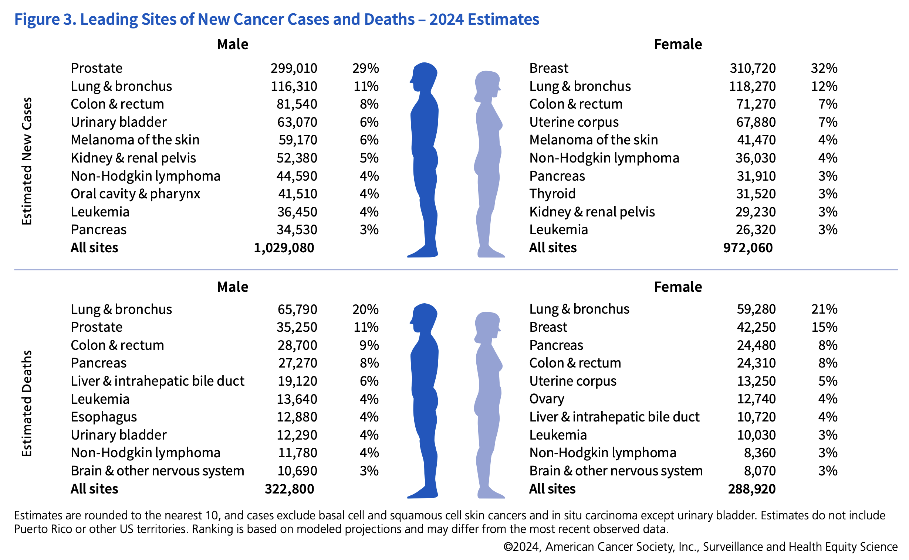
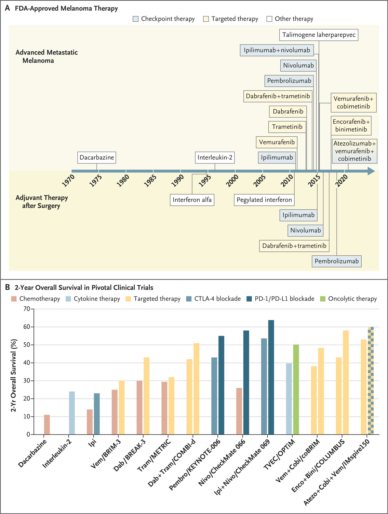

# Introduction & Nomenclature

In this month's post, we will be going over every type of cancer and how the standard of care has changed in the past 10 years. We will pay special attention to up and coming therapies and biomarkers that can potentially improve outcomes. None of this is medical advice, I will simply be using publicly available resources including journal articles, [NCCN guidelines](https://www.nccn.org/guidelines/category_1), and cancer primers on [cancer.gov](https://www.cancer.gov/types) to summarize recent innovations for treating various tumors.

The goal here is to gain an appreciation for the scope of how cancer care is evolving and which cancers have been 'difficult to treat'. I'm going to focus mainly on systemic therapies, though for most of these cancers, local treatment (e.g. surgery or radiotherapy) is usually curative. Inevitably, some of this is going to be very wrong and I welcome any feedback to fix what I have written. Definitely a living document and probably something that needs to be an Excel sheet.

First, lets discuss the classes of cancers. There are 78 organs in the human body, all of them can get cancer. I have categorized them into a few broad categories. At the highest level, there are liquid and solid tumors which categorize into those that grow in the lymphatics and blood, and those that grow within some tissue substrate. Liquid tumors are broadly classified into lymphomas, leukemias, and multiple myeloma which categorize cancers based on cell of origin and primary location. Lymphomas arise in lymph nodes and lymphatic tissues and consist of lymphocyte lineage cell types. Leukemias form from hematopoietic lineage cells in the blood and bone marrow. Multiple myeloma is a cancer of plasma cells arising from the bone marrow.

Within solid tumors, the broad category is dependent on the functional role of the originating cell. Carcinomas are cancers arising from epithelial tissues and make up the bulk of cancer diagnoses worldwide. Subtypes of carcinomas include adenocarcinomas (glandular or secretory epithelial cells), squamous cell carcinomas (squamous epithelial cells), basal cell carcinomas (basal cells in epidermis), and transitional cell carcinomas (transitional epithelium; e.g. bladder, ureters). Sarcomas are cancers originating in bone, cartilage, fat, muscle, blood vessels, or other connective or supportive tissue. Neuroendocrine tumors arise from hormone secreting cells, central nervous system tumors arise from brain or spinal cord cells, and germ cell tumors arise from sperm or embryonic cells. Finally, melanomas, mesotheliomas, and desmoid tumors make up a 'miscellaneous' category of tumor types.

# Table of contents 

1. [Introduction & Nomenclature](#introduction--nomenclature)
2. [Liquid Tumors](#liquid-tumors)
   1. [Castleman's Disease](#castlemans-disease)
   2. [Multiple Myeloma](#multiple-myeloma)
   3. [Leukemias](#leukemias)
      1. [Acute lymphoblastic leukemia (ALL)](#acute-lymphoblastic-leukemia-all)
      2. [Acute myeloid leukemia (AML)](#acute-myeloid-leukemia-aml)
      3. [Chronic lymphocytic leukemia (CLL)](#chronic-lymphocytic-leukemia-cll)
      4. [Chronic myeloid leukemia (CML)](#chronic-myeloid-leukemia-cml)
      5. [Hairy Cell Leukemia](#hairy-cell-leukemia)
   4. [Lymphomas](#lymphomas)
      1. [Hodgkin lymphoma](#hodgkin-lymphoma)
      2. [Non-Hodgkin lymphoma](#non-hodgkin-lymphoma)
3. [Solid Tumors](#solid-tumors)
   1. [Brain Tumors](#brain-tumors)
      1. [Glioblastoma (GBM)](#glioblastoma-gbm)
      2. [Low-grade glioma](#low-grade-glioma)
      3. [Meningioma](#meningioma)
   2. [Head and Neck Cancers](#head-and-neck-cancers)
      1. [Oral Cancer](#oral-cancer)
      2. [Nasopharyngeal Cancer](#nasopharyngeal-cancer)
      3. [Hypopharyngeal, Pharyngeal, and Laryngeal Cancer](#hypopharyngeal-pharyngeal-and-laryngeal-cancer)
      4. [Thyroid Cancer](#thyroid-cancer)
      5. [Salivary Gland Cancer](#salivary-gland-cancer)
   3. [Lung Cancer](#lung-cancer)
      1. [NSCLC](#nsclc)
         1. [Early-Stage (Stage I-II)](#early-stage-stage-i-ii)
         2. [Locally Advanced (Stage III)](#locally-advanced-stage-iii)
         3. [Advanced or Metastatic (Stage IV)](#advanced-or-metastatic-stage-iv)
      2. [SCLC](#sclc)
   4. [Breast Cancer](#breast-cancer)
      1. [Hormone Receptor-Positive (HR+)](#hormone-receptor-positive-hr)
      2. [HER2-Positive](#her2-positive)
      3. [Triple-Negative Breast Cancer (TNBC)](#triple-negative-breast-cancer-tnbc)
   5. [Skin Cancer](#skin-cancer)
      1. [Merkel Cell Carcinoma](#merkel-cell-carcinoma)
      2. [Basal cell carcinoma](#basal-cell-carcinoma)
      3. [Melanoma](#melanoma)
      4. [Uveal Melanoma](#uveal-melanoma)
   6. [Gastrointestinal Tumors](#gastrointestinal-tumors)
      1. [Pancreatic cancer](#pancreatic-cancer)
         1. [Pancreatic Adenocarcinoma (PDAC)](#pancreatic-adenocarcinoma-pdac)
         2. [Pancreatic Neuroendocrine Tumors (PNET)](#pancreatic-neuroendocrine-tumors-pnet)
      2. [Gallbladder Cancer](#gallbladder-cancer)
      3. [Esophageal Cancer](#esophageal-cancer)
      4. [Gastric Cancer](#gastric-cancer)
         1. [Gastrointestinal Neuroendocrine Tumors](#gastrointestinal-neuroendocrine-tumors)
         2. [Gastrointestinal Stromal Tumors](#gastrointestinal-stromal-tumors)
      5. [Colon Cancer](#colon-cancer)
      6. [Rectal Cancer](#rectal-cancer)
      7. [Anal Cancer](#anal-cancer)
      8. [Cholangiocarcinoma/Bile Duct Cancer](#cholangiocarcinoma-bile-duct-cancer)
      9. [Hepatocellular Carcinoma](#hepatocellular-carcinoma)
   7. [Genitourinary Cancers](#genitourinary-cancers)
      1. [Ovarian Cancer](#ovarian-cancer)
      2. [Cervical Cancer](#cervical-cancer)
      3. [Endometrial Cancer](#endometrial-cancer)
      4. [Fallopian Tube Cancer](#fallopian-tube-cancer)
      5. [Vaginal Cancer](#vaginal-cancer)
      6. [Germ cell tumors (testicular cancer)](#germ-cell-tumors-testicular-cancer)
      7. [Penile Cancer](#penile-cancer)
      8. [Urethral Cancer](#urethral-cancer)
      9. [Prostate Cancer](#prostate-cancer)
      10. [Bladder Cancer](#bladder-cancer)
         1. [Non-Muscle Invasive Bladder Cancer (NMIBC)](#non-muscle-invasive-bladder-cancer-nmibc)
         2. [Muscle-Invasive Bladder Cancer (MIBC)](#muscle-invasive-bladder-cancer-mibc)
         3. [Advanced or Metastatic Bladder Cancer](#advanced-or-metastatic-bladder-cancer)
      11. [Kidney Cancer](#kidney-cancer)
         1. [Hereditary Kidney Cancers](#hereditary-kidney-cancers)
   8. [Hormone Gland Tumors](#hormone-gland-tumors)
      1. [Adrenocortical Cancer](#adrenocortical-cancer)
      2. [Parathyroid Cancer](#parathyroid-cancer)
      3. [Pituitary Tumor](#pituitary-tumor)
   9. [Sarcomas](#sarcomas)
      1. [Osteosarcoma](#osteosarcoma)
      2. [Chondrosarcoma](#chondrosarcoma)
      3. [Ewing Sarcoma](#ewing-sarcoma)
      4. [Liposarcoma](#liposarcoma)
      5. [Leiomyosarcoma](#leiomyosarcoma)
      6. [Rhabdomyosarcoma](#rhabdomyosarcoma)
      7. [Angiosarcoma](#angiosarcoma)
      8. [Kaposi Sarcoma](#kaposi-sarcoma)
   10. [Other Cancers](#other-cancers)
      1. [Atypical teratoid/rhabdoid tumor](#atypical-teratoid-rhabdoid-tumor)
      2. [Mesothelioma](#mesothelioma)
      3. [Retinoblastoma](#retinoblastoma)

# Liquid Tumors

### Castleman's Disease

Cyclophosphamide, Doxorubicin, Vincristine, Prednisone (CHOP) can be used for multicentric (multiple lymph node) severe/refractory Castleman disease (MCD). Since Castleman's is linked to HIV and HHV-8, antiviral therapy can be effective as well in the first line.

[Siltuximab](https://www.thelancet.com/journals/lanonc/article/PIIS1470-2045(14)70319-5/fulltext) or tocilizumab are IL-6 monoclonal antibodies that can be used in HHV-8 Castleman's and Rituximab can also be used in HIV or HHV-8 associated MCD.

### Multiple Myeloma

There are too many doublet, triplet, and now even quad regimens to cover and understand. It seems like the most commonly used regimen in the United States consists of VRd (bortezomib, lenalidomide, and dexamethasone), but recently a [trial](https://www.nejm.org/doi/full/10.1056/NEJMoa2312054) showed superiority for adding Daratumumab, a CD38 monoclonal antibody to this regimen in the induction setting. Lenalidomide is typically given in the maintinance setting regardless.

THe goal is typically to bridge patients to a stem cell transplant. BCMA targeted CAR-T is approved in relapsed and refractory multiple myeloma with pretty [spectacular results](https://www.nejm.org/doi/full/10.1056/NEJMoa2303379) (Carvykti, not Abecma). 

Recently, a new Ikaros and Aiolos (IKZF1 and IKZF3) degrader Mezigdomide is under investigation with some promising [early clinical data](https://www.nejm.org/doi/full/10.1056/NEJMoa2303194). This should in theory be a better version of lenalidomide.

## Leukemias

### Acute lymphoblastic leukemia (ALL)

Vincristine, Dexamethasone, and L-Asparaginase (ALL cells cannot synthesize asparagine) are commonly used in induction therapy. Methotrexate and 6-Mercaptopurine are used in maintenance therapy.

Cyclophosphamide and Cytarabine are part of the regimen for high-risk patients.

Imatinib, Dasatinib are used for Philadelphia chromosome-positive ALL.

[Blinatumomab](https://www.nejm.org/doi/full/10.1056/NEJMoa1609783) is a bispecific T-cell engager (BiTE) antibody construct targeting B cell lineage restricted antigen CD19 that has also seen usage but is limited by logistical challenges such as infusion time (given over a 28 day continuous infusion).

CAR-T (e.g., Tisagenlecleucel) can be used for relapsed or refractory B-cell ALL.
[Inotuzumab ozogamicin](https://www.nejm.org/doi/full/10.1056/NEJMoa1509277), an antibody-drug conjugate targeting CD22 has also shown some level of benefit despite toxicity. It was recently approved for pediatric ALL in addition to adults.

### Acute myeloid leukemia (AML)

Cytarabine and Anthracyclines (e.g., Daunorubicin, Idarubicin) are standard induction therapy with high-dose Cytarabine commonly used in consolidation therapy. The regimen is termed "7+3" because IV cytarabine is given for 7 days, and the anthracycline is given IV for 3 days.

Various targeted agents including FLT3 inhibitors (e.g., [Midostaurin](https://www.nejm.org/doi/full/10.1056/NEJMoa1614359), [Quizartinib](https://www.thelancet.com/journals/lancet/article/PIIS0140-6736(23)00464-6/abstract), [Gilteritinib](https://www.nejm.org/doi/full/10.1056/NEJMoa1902688)), IDH1/2 inhibitors (e.g., [Ivosidenib](https://www.nejm.org/doi/full/10.1056/NEJMoa2117344), [Enasidenib](https://www.nejm.org/doi/full/10.1056/NEJMoa1716984)), or Gemtuzumab ozogamicin, a CD33 ADC, can be given in conjunction or as replacement for induction chemo depending on molecular biomarkers.

[Venetoclax](https://www.nejm.org/doi/full/10.1056/NEJMoa2012971) (BCL2 inhibitor) is often combined with hypomethylating agents in older patients or those unfit for intensive chemotherapy.

[Azacitidine](https://www.nejm.org/doi/full/10.1056/NEJMoa2004444), a hypomethylating agent, is used as maintinance therapy. 

Menin inhibitors, CAR-T, and cancer vaccines are on the horizon but have not reached an inflection point for widespread usage.

### Chronic lymphocytic leukemia (CLL)

Chemotherapy with Fludarabine, Cyclophosphamide, and Rituximab (FCR) has been considered the standard regimen, with Bendamustine and Rituximab another common combination. Recently an ibrutinib venetoclax regimen showed [superiority](https://www.nejm.org/doi/full/10.1056/NEJMoa2310063) over FCR. 

[Ibrutinib](https://www.nejm.org/doi/full/10.1056/NEJMoa1509388), [Acalabrutinib](https://www.nejm.org/doi/full/10.1056/NEJMoa1509981) are BTK inhibitors that can be given in the refractory setting or first line. [Zanubrutinib](https://www.nejm.org/doi/full/10.1056/NEJMoa2211582) and other next generation BTK inhibitors like [Pirtobrutinib](https://www.nejm.org/doi/full/10.1056/NEJMoa2300696) can improve PFS over Ibrutinib while lowering cardiac events.

[Venetoclax](https://www.nejm.org/doi/full/10.1056/NEJMoa2213093) in combination with obinutuzumab, an anti-CD20 monoclonal antibody, is another option for fit patients that can tolerate intensive therapy. [Idelalisib](https://www.nejm.org/doi/full/10.1056/NEJMoa1315226), a PI3K inhibitor, is used with Rituximab in the relapsed setting.

Breyanzi, BMS's CD19 directed CAR-T has also recently been approved for relapsed or refractory CLL.

### Chronic myeloid leukemia (CML)

CML is typically a result of BCR-ABL fusions and thus can be targeted by small molecule inhibitors including Imatinib, Dasatinib, and Nilotinib (first line). Bosutinib and Ponatinib are second and third-line TKIs.

Chemotherapy or stem cell transplant are rarely used, unless in refractory cases or in blast crisis.

[Asciminib](https://www.nejm.org/doi/full/10.1056/NEJMoa1902328) is a novel STAMP inhibitor targeting the ABL myristoyl pocket, showing promise in resistant CML.

### Hairy Cell Leukemia

Cladribine is standard treatment with Pentostatin as an alternative option (both purine analogs). Rituximab or obinutuzumab (CD20 antibodies) are often used in combination with chemotherapy.

Almost all patients with hairy cell leukemia have BRAF V600E mutations and as a result, most patients get BRAF inhibitors like Vemurafenib. Recently, chemo free regimens using [Vemurafenib plus CD20 antibody](https://www.nejm.org/doi/full/10.1056/NEJMoa2031298) have had nice results.

[Venetoclax](https://www.nejm.org/doi/full/10.1056/NEJMc2216135) has also been used off label with some success in refractory patients.

Moxetumomab pasudotox, an anti-CD22 recombinant immunotoxin was previously used for patients with 2 or more lines of therapy but this has recently been [discontinued](https://www.onclive.com/view/astrazeneca-to-discontinue-moxetumomab-pasudotox-in-us-for-hairy-cell-leukemia) in the U.S. by AstraZeneca due to low clinical uptake.

## Lymphomas

### Hodgkin lymphoma

ABVD (Adriamycin, Bleomycin, Vinblastine, Dacarbazine) is the standard regimen with BEACOPP (bleomycin, etoposide, doxorubicin, cyclophosphamide, vincristine, procarbazine and prednisone) used for advanced-stage or high-risk disease as a more toxic alternative.

Recently, Brentuximab vedotin, an anti-CD30 antibody-drug conjugate has demonstrated superior efficacy when replacing bleomycin in ABVD (A+AVD) in both [adult](https://www.nejm.org/doi/full/10.1056/NEJMoa2206125) and [pediatric](https://www.nejm.org/doi/full/10.1056/NEJMoa2206660) patients.

Checkpoint inhibitors (e.g., [Nivolumab](https://www.nejm.org/doi/full/10.1056/NEJMoa1411087), Pembrolizumab) are used in relapsed or refractory cases.

### Non-Hodgkin lymphoma

There are many [subtypes of NHL](https://www.lls.org/lymphoma/non-hodgkin-lymphoma/nhl-subtypes), including but not limited to:
- Diffuse large B-cell lymphoma (DLBCL) (30%)
- Mantle cell lymphoma (MCL) (3%)—has features of both indolent and aggressive NHL
- Lymphoblastic lymphoma (2%)
- Burkitt lymphoma (BL) (2%)
- Follicular lymphoma (FL) (22%)
- Marginal zone lymphoma (MZL) (7%)
- Chronic lymphocytic leukemia/small-cell lymphocytic lymphoma (CLL/SLL) (7%)
- Gastric mucosa-associated lymphoid tissue (MALT) lymphoma (8%)
- Peripheral T-cell lymphoma, not otherwise specified (PTCL-NOS) (6%)
- Cutaneous T-cell lymphoma (CTCL) (4%)

CHOP (Cyclophosphamide, Doxorubicin, Vincristine, Prednisone) was the standard regimen but now has been replaced by R-CHOP (addition of Rituximab) in both [adults](https://www.nejm.org/doi/full/10.1056/NEJMoa011795) and [children](https://www.nejm.org/doi/full/10.1056/NEJMoa1915315) as the SOC in B cell lymphomas. Polatuzumab-Vedotin, a CD79b targeting ADC has [marginal benefit](https://www.nejm.org/doi/full/10.1056/NEJMoa2115304) in addition to R-CHOP in DLBCL.

Ibrutinib is effective for certain subtypes like [mantle cell lymphoma](https://www.nejm.org/doi/full/10.1056/NEJMoa2201817).

CAR-T cell therapy (e.g., [Axicabtagene ciloleucel](https://www.nejm.org/doi/full/10.1056/NEJMoa2116133), [Tisagenlecleucel](https://www.nejm.org/doi/full/10.1056/NEJMoa1804980)) is very effective for relapsed or refractory B-cell NHLs.

Lenalidomide can be combined with rituximab to show exciting benefit in multiple subtypes of NHL including [follicular lymphoma](https://www.nejm.org/doi/full/10.1056/NEJMoa1805104), [mantle cell lymphoma](https://www.nejm.org/doi/full/10.1056/NEJMoa1505237), and across [indolent lymphomas](https://www.ncbi.nlm.nih.gov/pmc/articles/PMC7035866/).

# Solid Tumors

## Brain Tumors

### Glioblastoma (GBM)

Temozolomide (TMZ), a highly toxic chemotherapy is standard of care in [combination with radiotherapy](https://www.nejm.org/doi/full/10.1056/NEJMoa1611977). Lomustine (CCNU), another chemotherapy, is often used in combination with TMZ or as a second-line treatment. Bevacizumab the VEGF antibody is used for recurrent GBM but approved based upon nonrandomized data. It seems that evidence for use is not being backed up by [randomized trials](https://www.nejm.org/doi/full/10.1056/NEJMoa1707358).

Recently CAR-T cells targeted neoantigens have entered clinical trials with interesting but limited early [results](https://www.nejm.org/doi/full/10.1056/NEJMoa2314390).

### Low-grade glioma

Low-grade gliomas include astrocytomas and oligodendrogliomas. They are primarily treated with temozolomide in the first line. The PCV regimen consisting of procarbazine, lomustine, and vincristine is also effective and preferred in certain subgroups such as anaplastic astrocytomas or tumors with 1p/19q co-deletion.

Targeted therapies with BRAF inhibitors in V600E mutant gliomas (mostly [pediatric](https://www.nejm.org/doi/full/10.1056/NEJMoa2303815)) or [vorasidenib](https://www.nejm.org/doi/10.1056/NEJMoa2304194?url_ver=Z39.88-2003&rfr_id=ori:rid:crossref.org&rfr_dat=cr_pub%20%200pubmed) or other IDH inhibitors in IDHIDH1/2 mutant gliomas are also used.

### Meningioma

Hydroxyurea is considered for recurrent or aggressive meningiomas. Somatostatin Analogues (e.g., Octreotide) is sometimes used for refractory cases.

## Head and Neck Cancers

### Oral Cancer

Cisplatin: often used in combination with radiation therapy (chemoradiation) for advanced cases. [Cetuximab](https://www.ncbi.nlm.nih.gov/pmc/articles/PMC2745918/), EGFR antibody, is used in combination with radiation or as monotherapy in recurrent/metastatic disease. [Pembrolizumab](https://www.ncbi.nlm.nih.gov/pmc/articles/PMC6048158/) is used in recurrent or metastatic oral cancer.

### Nasopharyngeal Cancer

Cisplatin and 5-Fluorouracil (5-FU) is the standard combination chemotherapy for nasopharyngeal cancer. Gemcitabine and Cisplatin can alternatively be used in combination as first-line therapy for advanced cases. Pembrolizumab and [Nivolumab](https://www.nejm.org/doi/full/10.1056/NEJMoa1602252) used in metastatic or recurrent nasopharyngeal cancer.

### Hypopharyngeal, Pharyngeal, and Laryngeal Cancer

Chemoradiation with cisplatin or various other regimens (e.g. 5FU, paclitaxel) for advanced laryngeal cancer. Cetuximab can also be used first line in combination with radiotherapy. Pembrolizumab can be useful in some instances.

### Thyroid Cancer

Radioactive iodine (I-131) can be given which is toxic and is readily absorbed by thyroid cells. However, a [large clinical trial](https://www.nejm.org/doi/full/10.1056/NEJMoa2111953) did not show benefit in the adjuvant setting post thyroidectomy.

Sorafenib and Lenvatinib are used in radioactive iodine-refractory differentiated thyroid cancer.
Vandetanib and Cabozantinib are used for metastatic medullary thyroid cancer. RET mutations occur in 25-50% of sporadic cases, in which case selpercatinib or other RET inhibitors are [effective](https://www.nejm.org/doi/full/10.1056/NEJMoa2309719). 
Doxorubicin is used in advanced anaplastic thyroid cancer.

### Salivary Gland Cancer

The CAP regimen (Cyclophosphamide, Doxorubicin, and Cisplatin is used for recurrent or metastatic salivary gland tumors.

## Lung Cancer

### NSCLC

#### Early-Stage (Stage I-II):

Lobectomy, segmentectomy, or wedge resection is typically indicated, with adjuvant chemotherapy for patients with high-risk features post-surgery. [Neoadjuvant immunotherapy](https://www.nejm.org/doi/full/10.1056/NEJMoa2302983) has shown benefit in resectable early-stage NSCLC. Radiation can also be considered postoperatively or in patients not fit for surgery.

#### Locally Advanced (Stage III):

Chemoradiation with Cisplatin and Etoposide, or Carboplatin and Paclitaxel with consolidation immunotherapy (Durvalumab) can be considered. [Neoadjuvant immunotherapy](https://www.nejm.org/doi/full/10.1056/NEJMoa2215530) again has a very important role.

#### Advanced or Metastatic (Stage IV):

Various targeted therapies have been developed and usage is dependent on molecular profiling:

- EGFR Mutations are targeted by EGFR mutant TKIs including Osimertinib, Erlotinib, Gefitinib, and Afatinib.
- ALK rearrangements are targeted by ALK inhibitors [Alectinib](https://www.nejm.org/doi/full/10.1056/NEJMoa2310532), Brigatinib, and Lorlatinib.
- ROS1 rearrangements are treated with Crizotinib, Entrectinib. 
- BRAF V600E mutations are treated with BRAF and MEK inhibitors Dabrafenib and Trametinib.
- MET Exon 14 skipping mutations are treated with MET inhibitors Capmatinib and Tepotinib.
- NTRK Fusions are treated with TRK inhibitors Larotrectinib and Entrectinib.
- RET fusions are treated with RET inhibitors [Selpercaptinib](https://www.nejm.org/doi/full/10.1056/NEJMoa2309457).

For patients without molecular alterations, first line therapy is multi-agent chemotherapy (Cisplatin or Carboplatin with Paclitaxel, Pemetrexed (for non-squamous), Gemcitabine, Vinorelbine) in combination with immunotherapy (PD-1/PD-L1 inhibitors Pembrolizumab, Nivolumab, Atezolizumab, Durvalumab). Docetaxel has been a mainstay of second line therapy in NSCLC. Finally, VEGF inhibitor Bevacizumab and Ramucirumab can be combined with chemotherapy for advanced NSCLC that has progressed on chemo-immunotherapy.

### SCLC

In the limited stage concurrent chemoradiation is the standard of care with chemo regimens including Cisplatin and Etoposide, or Carboplatin and Etoposide. Prophylactic Cranial Irradiation (PCI) is also utilized, which reduces the risk of brain metastases.

In extensive stage SCLC, chemotherapy again is standard of care with Cisplatin or Carboplatin with Etoposide/Irinotecan. PD-L1 inhibitors [Atezolizumab](https://www.nejm.org/doi/full/10.1056/NEJMoa1809064), Durvalumab can be combined with chemotherapy as first-line treatment.

In relapsed/refractory disease, various other chemotherapy regimens can be tried in the 2nd line such as [Topotecan](https://ascopubs.org/doi/10.1200/JCO.2006.08.3998) or [Lurbinectedin](https://www.thelancet.com/journals/lanonc/article/PIIS1470-2045(20)30068-1/abstract)

Recently, DLL3 has emerged as a promising cell surface target and has been targeted with bispecific T cell engagers including [tarlatamab](https://www.nejm.org/doi/full/10.1056/NEJMoa2307980).

### Breast Cancer

#### Hormone Receptor-Positive (HR+)
Tamoxifen is a selective estrogen receptor modulator (SERM) that blocks estrogen receptors and is first line therapy for premenopausal women with HR+ breast cancer.

Aromatase Inhibitors (e.g., Anastrozole, Letrozole, Exemestane) inhibit the enzyme aromatase, reducing estrogen production, and is considered standard treatment for postmenopausal women with HR+ breast cancer.

CDK4/6 Inhibitors (e.g., Palbociclib, [Ribociclib](https://www.nejm.org/doi/full/10.1056/NEJMoa2305488), Abemaciclib) can be combined with endocrine therapy (e.g., aromatase inhibitors or fulvestrant) for advanced HR+ breast cancer. Fulvestrant is a selective estrogen receptor degrader (SERD) that can be used alone or in combination with CDK4/6 inhibitors for advanced HR+ breast cancer. AKT inhibitors such as [capivasertib](https://www.nejm.org/doi/full/10.1056/NEJMoa2214131) can be added to aromatase inhibition, as AKT activation is a resistance mechanism. Alpelisib, a PI3K inhibitor, can be used for HR+, HER2-negative breast cancer with PIK3CA mutations, in combination with fulvestrant. 

#### HER2-Positive

Trastuzumab, a HER2 monoclonal antibody, is often used in combination with chemotherapy. Pertuzumab targets an alternate epitope on HER2 and is often given in combination with trastuzumab.

TKIs targeting HER2 including lapatinib and neratinib can be used upon progression from antibody based regimens.

Enhertu (trastuzumab deruxtecan) is probably now standard of care after [DESTINY-Breast04](https://www.nejm.org/doi/full/10.1056/NEJMoa2203690)

#### Triple-Negative Breast Cancer (TNBC)

Combination chemotherapy with Doxorubicin, Cyclophosphamide, Paclitaxel, or Carboplatin is first line therapy.

[Immunotherapy](https://www.nejm.org/doi/10.1056/NEJMoa1910549?url_ver=Z39.88-2003&rfr_id=ori:rid:crossref.org&rfr_dat=cr_pub%20%200pubmed) (PD-1/PD-L1 blockade) can be used with positive companion diagnostic tests for PD-L1 protein, or in advanced patients with MSI or MMR high tumors.

PARP Inhibitors (e.g., Olaparib, Talazoparib) are used in patients with BRCA1/2 mutations.

[Sacituzumab Govitecan](https://www.thelancet.com/journals/lancet/article/PIIS0140-6736(23)01245-X/fulltext) is an antibody-drug conjugate targeting Trop-2, used in metastatic TNBC after 2 prior therapies.

PI3K or CDK4/6 inhibitors are not widely used in TNBC.

## Skin Cancer

### Merkel Cell Carcinoma

Various [PD-1/PD-L1 antibodies](https://www.nejm.org/doi/full/10.1056/NEJMoa1603702) are utilized including avelumab, pembrolizumab, and nivolumab.

### Basal cell carcinoma

Hedgehog pathway inhibitors such as [vismodegib](https://www.nejm.org/doi/full/10.1056/NEJMoa1113713) and sonidegib are typically used for tumor control.

### Melanoma

Immunotherapies and targeted therapies are used and often in combination in [both the neoadjuvant and adjuvant setting](https://www.nejm.org/doi/full/10.1056/NEJMoa2211437). Pembrolizumab and nivolumab are the PD-1 antibodies most often used in advanced, metastatic, or unresectable melanoma. These agents can be given in combination with Ipilimumab, a [CTLA-4](https://www.nejm.org/doi/full/10.1056/NEJMoa1910836) antibody or Relatlimab, a [LAG3](https://www.nejm.org/doi/full/10.1056/NEJMoa2109970) blocking antibody.

[Dabrafenib and Trametinib](https://www.nejm.org/doi/full/10.1056/NEJMoa2005493), the BRAF and MEK inhibitors, respectively, are used in BRAF V600 mutation-positive melanoma. Vemurafenib and Cobimetinib are an alternative BRAF/MEK combination for V600 mutant melanoma. Finally, encorafenib + binimetinib are another BRAF/MEK combination that is apparently more efficacious than the other combinations.

Recently, [tumor infiltrating lymphocyte (TIL) therapy](https://www.nejm.org/doi/full/10.1056/NEJMoa2210233) (Lifileucel) has been approved for heavily pretreated (PD-1 blocking antibody, and/or BRAF inhibitor if BRAF mutant) unresectable and metastatic melanoma. [Neoantigen vaccines](https://www.sciencedirect.com/science/article/abs/pii/S0140673623022687?via%3Dihub) are another exciting immunotherapy that has shown some promise in resected melanoma.

### Uveal Melanoma

[Tebentafusp-tebn](https://www.nejm.org/doi/full/10.1056/NEJMoa2304753) is a bispecific T cell engager for a cancer epitope (gp100) approved and used in HLA-A\*02:01-positive disease. Immunotherapy with pembrolizumab or ipilimumab, or dacarbazine based chemotherapy can be used as well.

## Gastrointestinal Tumors

### Pancreatic cancer

#### Pancreatic Adenocarcinoma (PDAC)
PDAC is the most common malignancy of the pancreas and has poor prognosis. KRAS mutations are present in >90% of cases and the emergence of KRAS inhibitors is thus seen as the frontier for new treatment regimens. HER2, and BRCA1/2 mutational status have recently been approved as biomarker directed therapies (Enhertu and [PARPi](https://www.nejm.org/doi/full/10.1056/NEJMoa1903387) respectively). Otherwise, first and second line treatment is combination chemotherapy, either the [FOLFIRINOX regimen or gem-abraxane](https://www.nejm.org/doi/full/10.1056/NEJMoa1011923).

#### Pancreatic Neuroendocrine Tumors (PNET)

Somatostatin analogues (SSAs) (e.g., Octreotide, Lanreotide) are typically 1st line treatment in functional PNETs (e.g., those secreting insulin, gastrin, etc.) and for tumor stabilization in non-functional PNETs.

PNETs can also be treated with radiopharmaceuticals targeted against somatostatin receptors (SSTRs). [Lutetium-177 dotatate](https://www.nejm.org/doi/full/10.1056/NEJMoa1607427) (Lutathera) (SSTR targeting) is a radionuclide used in 2nd line PNET but ongoing clinical trials are evaluating use in the 1st line setting.

Targeted therapies including the mTOR inhibitor Everolimus and the multi-targeted TKI (VEGF family receptors and PDGF receptors) Sunitinib are used in advanced, progressive PNETs. Recently, Cabozantinib, a cMET and VEGFR2 multi-targeted TKI, posted encouraging [data](https://ascopost.com/news/october-2023/cabozantinib-for-pretreated-patients-with-advanced-neuroendocrine-tumors-cabinet-trial/) in second line PNET, improving median PFS from 3.2 to 8.3 months.

Various chemotherapy agents including Streptozocin, Doxorubicin, Fluorouracil (5-FU), Capecitabine, and Temozolomide are used in high-grade or rapidly progressing PNETs. Common regimens include: Streptozocin and Doxorubicin: Standard for advanced PNETs. Capecitabine and Temozolomide (CAPTEM): Effective in low- to intermediate-grade PNETs, particularly those with a Ki-67 index <20%.

### Gallbladder Cancer

Cholecystectomy (removal of the gallbladder) is indicated for localized tumors, though an extended resection including liver and lymph node dissection may be required for tumors invading surrounding tissues. Capecitabine can be given in the adjuvant setting.

For advanced, metastatic, or recurrent disease, Gemcitabine and Cisplatin is an early line choice. In the second line, the more aggressive FOLFOX regimen (5-Fluorouracil, Leucovorin, Oxaliplatin) can be utilized. Pembro is often utilized for MSI-H or dMMR tumors; however, this is extremely rare.

Radiation is used for localized control or for palliative care.

### Esophageal Cancer

Esophagectomy (removal of part or all of esophagus) is preferred for localized tumors. Your stomach or part or your small intestine get pulled up through your diaphragm! For very early-stage tumors, you can simply get an endoscopic Resection. 

Locally advanced tumors get [neoadjuvant chemoradiation](https://www.nejm.org/doi/full/10.1056/NEJMoa1112088) with carboplatin and paclitaxel, then [adjuvant immunotherapy](https://www.nejm.org/doi/full/10.1056/NEJMoa2032125).

Advanced or metastatic disease has traditionally been treated with systemic chemotherapy regimens including Fluorouracil, Cisplatin, Oxaliplatin, Paclitaxel. However, immunotherapy (PD-1 plus chemo or PD-1 plus CTLA-4 blockade) has shown [benefit](https://www.nejm.org/doi/full/10.1056/NEJMoa2111380) over chemo alone. Molecular biomarkers can also be used to guide targeted therapies including Trastuzumab or Trastuzumab-Deruxtecan for HER2 positive tumors.

### Gastric Cancer

Gastrectomy or endoscopic resection is used for localized disease.

The FLOT regimen (5-Fluorouracil, Leucovorin, Oxaliplatin, Docetaxel) is used for locally advanced disease.

Following progression on first line chemotherapy, there are a variety of options including Ramicirumab, a VEGFR2 mAb, immunotherapies for PD-L1 positive or MSI-H/dMMR tumors, [HER2 targeted agents](https://www.nejm.org/doi/full/10.1056/NEJMoa2004413), and more recently there has been excitement for CLDN18.2 targeted agents, though none have reached approval.

#### Gastrointestinal Neuroendocrine Tumors

These are treated very similarly to [PNETs](#pancreatic-neuroendocrine-tumors). Surgical resection for localized disease and limited metastases is preferred for early stage or localized disease. Somatostatin analogs, multi-targeted TKIs, and radiopharmaceuticals targeting SSTR are used for advanced or metastatic disease.

#### Gastrointestinal Stromal Tumors

Surgical resection is preferred treatment for localized tumors. Targeted therapies against c-KIT and PDGFR including imatinib, sunitinib, [avapritinib](https://www.ncbi.nlm.nih.gov/pmc/articles/PMC8674139/), regorafenib, and ripretinib are used in advanced or metastatic disease.

### Colon Cancer

Colectomy and removal of associated lymph structures and blood vessels is typically curative in the early setting. In the locally advanced setting,  adjuvant chemotherapy with FOLFOX (5-Fluorouracil, Leucovorin, Oxaliplatin) is SOC.

In the advanced or metastatic setting, systemic chemotherapy with FOLFOX, FOLFIRI (5-Fluorouracil, Leucovorin, Irinotecan) is given 1st line. This can be combined with VEGF inhibitors such as Bevacizumab and Ramucirumab and EGFR Inhibitors Cetuximab and Panitumumab in RAS wildtype tumors. RAS mutant tumors are now eligible for various RAS inhibitors including [sotorasib](https://www.nejm.org/doi/full/10.1056/NEJMoa2308795) and adagrasib, which target G12C mutant KRAS.

In the 3rd or 4th line, patients can also receive regorafenib, a multi targeted TKI, or trifluridine-tipiracil, a combination chemotherapy regimen. In later lines, bevacizumab has also shown [benefit](https://www-nejm-org.libproxy.mit.edu/doi/full/10.1056/NEJMoa2214963) vs chemotherapy alone.

Pembrolizumab, Nivolumab is useful for MSI-H or dMMR tumors.

### Rectal Cancer

Early-Stage Rectal Cancer can get a variety of surgeries including transanal, low anterior, or abdominoperineal resections. Preoperative [chemotherapy or chemoradiotherapy](https://www.nejm.org/doi/full/10.1056/NEJMoa2303269) followed by postoperative adjuvant FOLFOX can also improve outcomes.

EGFR Inhibitors Cetuximab and Panitumumab or VEGF Inhibitors Bevacizumab and Ramucirumab can be considered in combination with chemotherapy regimens. Rectal cancers with BRAF V600E mutations can get Encorafenib (combined with Cetuximab).

Pembrolizumab, Nivolumab, Dostarlimab or other PD-1 inhibitors have posted pretty incredible [results](https://www.nejm.org/doi/full/10.1056/NEJMoa2201445) for MSI-H or dMMR tumors.

### Anal Cancer

Chemoradiation (for localized disease) consists of 5-Fluorouracil and Mitomycin C with concurrent radiation.

Cisplatin and 5FU are used for systemic disease, and may include immunotherapy with PD-1 inhibitors especially if the tumors are MSI high or MMR deficient.

### Cholangiocarcinoma/Bile Duct Cancer

Surgical resection or liver transplant for unresectable disease is preferred for patients with early-stage disease. Capecitabine likely marginally [improves survival](https://pubmed.ncbi.nlm.nih.gov/30922733/) in the adjuvant setting. Radiation with external beam radiation therapy (EBRT) and various ablation techniques including radiofrequency ablation (RFA) and microwave ablation (MWA) for localized tumors.

Advanced or Metastatic Cholangiocarcinoma patients are treated with [Gem/cisplatin](https://www.nejm.org/doi/full/10.1056/NEJMoa0908721) in 1st line and FOLFOX in 2nd line. A variety of targeted agents are available for biomarker directed therapy including [Futibatinib](https://www.nejm.org/doi/full/10.1056/NEJMoa2206834), Pemigatinib, and Infigratinib for cancers with FGFR2 fusions, Ivosidenib for IDH1 mutants, HER2 directed therapy for HER2 amplifications, TRK inhibitors (Larotrectinib, Entrectinib) for NTRK fusions and PD-1 inhibitors for MSI-H or dMMR tumors.

Marginal [benefits](https://evidence.nejm.org/doi/full/10.1056/EVIDoa2200015) are also seen in all comers for durvalumab plus gemcitabine in advanced biliary tract cancer.

### Hepatocellular Carcinoma

In the early stage, surgical or ablative techniques can be curative. Hepatic Resection is preferred for patients with good liver function and resectable tumors. Liver transplantation is an option for patients with early-stage disease within Milan criteria. Radiofrequency Ablation (RFA) or microwave ablation (MWA) is preferred for small tumors (<3 cm).

In the intermediate stages, transarterial therapies delivering radiotherapy or chemotherapy directly to the liver are used.

In the advanced setting, 1st line systemic therapy for many years has been multi-targeted TKIs targeting VEGF, PDGF, etc with [sorafenib](https://www.nejm.org/doi/full/10.1056/NEJMoa0708857) and lenvatinib or regorafenib, cabozantinib, and the mAb ramucirumab in the 2nd line. However, several immunotherapy regimens (e.g. PD-1/CTLA-4 with [durvalumab & tremelimumab](https://evidence.nejm.org/doi/full/10.1056/EVIDoa2100070) or PD-L1/VEGF with [atezolizumab & bevacizumab](https://www.nejm.org/doi/full/10.1056/NEJMoa1915745)) have shown improved overall survival vs. TKIs in the 1st line.

Regular imaging (CT, MRI) and monitoring of alpha-fetoprotein (AFP) levels is commonly used to assess response and detect recurrence.

## Genitourinary Cancers

### Ovarian Cancer

Platinum-Based Chemotherapy (Carboplatin and Paclitaxel) is 1st line treatment, and it can be given intraperitoneally for [improved efficacy](https://evidence.nejm.org/doi/full/10.1056/EVIDoa2200225). VEGF antibodies including bevacizumab are used in combination with chemotherapy and as maintenance therapy for advanced ovarian cancer.

PARP Inhibitors ([Olaparib](https://www.nejm.org/doi/full/10.1056/NEJMoa1810858), [Niraparib](https://www.nejm.org/doi/full/10.1056/NEJMoa1910962), [Valiparib](https://www.nejm.org/doi/full/10.1056/NEJMoa1909707), Rucaparib) are used as maintenance therapy for BRCA-mutated or homologous recombination deficiency (HRD)-positive ovarian cancer. There may even be a benefit for all comers or in combination with chemotherapy during induction.

FRα targeted ADCs ([Mirvetuximab Soravtansine](https://www.nejm.org/doi/full/10.1056/NEJMoa2309169)) showed modest benefits in platinum-resistant ovarian cancer.

In the relapse setting, cytoreductive surgery can be offered in conjunction with chemotherapy to [improve outcomes](https://www.nejm.org/doi/full/10.1056/NEJMoa2103294).

### Cervical Cancer

Cisplatin-based chemotherapy is used in combination with radiation therapy (chemoradiation) for advanced cervical cancer, and can be further combined with [Bevacizumab](https://www.nejm.org/doi/full/10.1056/NEJMoa1309748) for improved survival both here and in recurrent or metastatic cervical cancer.

PD-1 inhibitors [Pembrolizumab](https://www.nejm.org/doi/full/10.1056/NEJMoa2112435) and [Ceplilumab](https://www.nejm.org/doi/full/10.1056/NEJMoa2112187) have shown benefit in PD-L1-positive recurrent or metastatic cervical cancer.

Recently, a tissue factor targeted ADC, [tisutumab vedotin](https://www.thelancet.com/journals/lanonc/article/PIIS1470-2045(21)00056-5/abstract), was approved by the FDA for recurrent or metastatic cervical cancer with disease progression on or after chemotherapy.

### Endometrial Cancer

Carboplatin and Paclitaxel is standard first-line chemotherapy for advanced or recurrent endometrial cancer.

[Pembrolizumab](https://www.nejm.org/doi/pdf/10.1056/nejmoa2302312), [dostarlimab](https://www.nejm.org/doi/full/10.1056/NEJMoa2216334) or other PD-1 inhibitors are now often combined with chemotherapy in the first line due to recent trials showing improvement in progression free survival.

Immunotherapy is often combined with [lenvatinib](https://www.nejm.org/doi/full/10.1056/NEJMoa2108330), a multi-targeted TKI in chemorefractory patients. Progestins and aromatase inhibitors are used in HR+ endometrial cancer.
  
### Fallopian Tube Cancer

Carboplatin and Paclitaxel is 1st line therapy which can be combined with bevacizumab.

PARP Inhibitors (Olaparib, Niraparib, Rucaparib) are now used for BRCA-mutated or HRD-positive fallopian tube cancer.

### Vaginal Cancer

Cisplatin or 5-FU based chemotherapy in combination with radiation is standard for advanced vaginal cancer. MSI-H status and PD-L1 expression can be used to guide treatment with immunotherapy.

### Germ cell tumors (testicular cancer)
The Bleomycin, Etoposide, and Cisplatin (BEP) regimen is standard 1st line therapy for testicular germ cell tumors (e.g. seminomas). Bleomycin is often omitted if patients are unable to tolerate pulmonary toxicity. Autologous stem cell [transplant](https://www.nejm.org/doi/full/10.1056/NEJMoa067749) is considered for refractory tumors with intensive chemotherapy. Ifosfamide, Cisplatin, and Etoposide (VIP) is an alternative regimen for advanced or relapsed germ cell tumors.

### Penile Cancer
Regimens include TIP (paclitaxel, ifosfamide, and cisplatin), or 5-FU + cisplatin in refractory patients.

### Urethral Cancer

Chemotherapy with Cisplatin, Methotrexate, Vinblastine, or Doxorubicin based regimens are 1st line for advanced or metastatic urethral cancer, sometimes in combination with checkpoint blockade if molecular biomarkers are positive.

### Prostate Cancer

Androgen Deprivation Therapy (ADT) with LHRH agonists (e.g., Leuprolide), LHRH antagonists (e.g., Degarelix), or Anti-androgens (e.g., Bicalutamide).
are standard for metastatic or recurrent prostate cancer. AR inhibitors including Enzalutamide are often [combined](https://www.nejm.org/doi/full/10.1056/NEJMoa2303974) for improved efficacy.

Abiraterone, an androgen synthesis inhibitor, is another option that can be combined with prednisone for metastatic castration-resistant prostate cancer (mCRPC). Docetaxel is combined with ADT for metastatic hormone-sensitive prostate cancer (mHSPC) and mCRPC.

Radiopharmaceuticals such as [Lutetium-177–PSMA-617](https://www.nejm.org/doi/full/10.1056/NEJMoa2107322?query=featured_home) have demonstrated clinical benefits by delivering cytotoxic radiation in a targeted manner. Radium-223, an alpha-emitting radiopharmaceutical, is another example in use for mCRPC with symptomatic bone metastases.

[Sipuleucel-T](https://www.nejm.org/doi/full/10.1056/NEJMoa1001294) is an autologous dendritic cell vaccine used in some mCRPC settings. However, the results are marginal and the complexity of this therapy leads to it not being widely used anymore.

### Bladder Cancer 

Almost all bladder cancers are urothelial carcinomas.

#### Non-Muscle Invasive Bladder Cancer (NMIBC):

Intravesical therapy with Bacillus Calmette-Guérin (BCG) is standard of care, which works by activating the innate immune system. Chemotherapy with various agents including Mitomycin C, Gemcitabine, Doxorubicin, and Epirubicin are used in the adjuvant setting ro reduce recurrence risk if a transurethral resection is able to be performed.

2nd line options include immmunotherapy with [checkpoint blockade](https://www.thelancet.com/journals/lanonc/article/PIIS1470-2045(21)00147-9/abstract) or [IL-15 superagonist](https://evidence.nejm.org/doi/full/10.1056/EVIDoa2200167) (investigational). Recently, [oncolytic virus therapy](https://www.medpagetoday.com/meetingcoverage/aua/104286) and an [intravesical targeted release system](https://www.jnj.com/media-center/press-releases/tar-210-results-show-90-recurrence-free-survival-and-90-complete-response-in-patients-with-high-risk-and-intermediate-risk-non-muscle-invasive-bladder-cancer-respectively) for erdafitinib have posted impressive clinical results.

#### Muscle-Invasive Bladder Cancer (MIBC):

[Chemoradiotherapy](https://www.nejm.org/doi/full/10.1056/NEJMoa1106106) or surgical resection is standard therapy. Adjuvant chemotherapy or [immunotherapy](https://www.nejm.org/doi/full/10.1056/NEJMoa2034442) can improve outcomes in patients with high-risk features.

In the neoadjuvant setting, Cisplatin-based regimens including Gemcitabine and Cisplatin (GC), Methotrexate, Vinblastine, Doxorubicin, and Cisplatin (MVAC) can improve outcomes when administered before radical cystectomy.

#### Advanced or Metastatic Bladder Cancer:

Systemic chemotherapy is the first line treatment and primarily involves the use of cisplatin-based regimens with gemcitabine and cisplatin (GC), or methotrexate, vinblastine sulfate, doxorubicin, and cisplatin (MVAC). Carboplatin-based regimens such as gemcitabine/carboplatin are used in patients ineligible for cisplatin based regimens (ECOG >=3, impaired renal function, neuropathy, hearing loss, heart failure, older patients). 

Various anti-PD-1 and anti-PD-L1 antibodies including Atezolizumab, [Pembrolizumab](https://www.nejm.org/doi/full/10.1056/NEJMoa1613683), Nivolumab, [Avelumab](https://www.nejm.org/doi/full/10.1056/NEJMoa2002788), and Durvalumab are used in metastatic bladder cancer, particularly in patients who are cisplatin-ineligible or have progressed on platinum-based chemotherapy.

[Erdafitinib](https://www.nejm.org/doi/full/10.1056/NEJMoa2308849) is an FGFR3 inhibitor used for patients with susceptible FGFR3 or FGFR2 genetic alterations after progression on platinum-based chemotherapy. 

Enfortumab vedotin (Padcev) is an antibody-drug conjugate targeting Nectin-4, used in patients who have progressed on platinum-based chemotherapy and immune checkpoint inhibitors. The most exciting advance in several decades came recently (2024) in the [EV-302 trial](https://www.nejm.org/doi/full/10.1056/NEJMoa2312117), where combination of Padcev and pembrolizumab doubled median overall survival (31.5 vs 16.1 months) versus a gem/platinum based chemotherapy regimen.

### Kidney Cancer

Multi-targeted TKIs, specifically those targeting the VEGF pathway, including Sunitinib, Pazopanib, Axitinib, Cabozantinib, and Lenvatinib have historically been used for 1st line treatment. Following progression on TKIs, mTOR inhibitors have been used.

However, immunotherapy has recently shown superiority in some settings. For example, PD-1/CTLA-4 checkpoint blockade [combination](https://www.nejm.org/doi/full/10.1056/NEJMoa1712126), and also [lenvatinib plus PD-1 blockade](https://www.nejm.org/doi/full/10.1056/NEJMoa2035716) showed superiority over sunitinib in advanced RCC. PD-1 blockade with Nivolumab showed [superiority](https://www.nejm.org/doi/full/10.1056/NEJMoa1510665) over mTOR inhibitor everolimus in patients previously receiving anti-angiogenic therapy. Finally, in the untreated setting responses are [maximized](https://www.nejm.org/doi/full/10.1056/NEJMoa2212851) with combination of checkpoint blockade combination therapy (Nivo+Ipi) with multi-TKI cabozantinib.

Finally in the adjuvant setting, [immunotherapy](https://www.nejm.org/doi/full/10.1056/NEJMoa2312695) has long had a role in improving outcomes.

#### Hereditary Kidney Cancers

There are several hereditary kidney cancers that have some distinct treatment approaches. For example, Wilms tumors are rare childhood associated nephroblastomas treated with a multi-agent chemotherapy regimen including Vincristine, Dactinomycin, or Doxorubicin, and commonly in combination with surgery and radiation. Reed's Syndrome patients have a predisposition to forming leiomyomas and renal cell carcinomas. These are typically treated with Everolimus, the mTOR inhibitor, and multi-kinase inhibitors sunitinib and pazopanib. TSC disorder associated RCCs are primarily treated with mTOR inhibitors, and VHL syndrome associated RCCs can be treated specifically with [Belzutifan](https://www.nejm.org/doi/full/10.1056/NEJMoa2103425), the HIF-2α inhibitor that is approved for VHL-associated tumors.

## Hormone Gland Tumors

### Adrenocortical Cancer

Mitotane is an adrenal cytotoxic agent, inhibiting steroidogenesis, that is often [combined](https://www.nejm.org/doi/full/10.1056/NEJMoa1200966) with Etoposide, Doxorubicin, and Cisplatin (EDP) in 1st line adrenocortical cancer. Streptozocin combined with mitotane is for metastatic or recurrent disease.

### Parathyroid Cancer

Surgery is the mainstay for localized parathyroid cancer. Systemic therapies are limited and mainly supportive.

Cinacalcet can be used to reduce parathyroid hormone levels and control hypercalcemia.

'Pick your favorite' chemotherapy regimens can be used for refractory or metastatic cases.

### Pituitary Tumor

Dopamine Agonists (e.g., Cabergoline, Bromocriptine) are used 1st line to inhibit prolactin secretion. Somatostatin Analogues (e.g., Octreotide, Lanreotide) are used for growth hormone-secreting tumors. Pegvisomant is a growth hormone receptor antagonist used when somatostatin analogues are ineffective. Temozolomide is used for aggressive or malignant pituitary tumors resistant to other treatments.

## Sarcomas

### Osteosarcoma

The first-line multiagent chemotherapy (MAP) regimen is doxorubicin, cisplatin, and high-dose methotrexate. Mifamurtide (MTP-PE) can also be used in combination with chemotherapy for metastatic or recurrent disease, though results are [inconclusive](https://journals.lww.com/jbisrir/abstract/2017/08000/effectiveness_of_mifamurtide_in_addition_to.16.aspx) whether it is actually doing anything.

### Chondrosarcoma

Surgery is typically the only option and chemotherapy and radiotherapy are ineffective. Immunotherapy has been successful in certain case reports.

### Ewing Sarcoma

Vincristine, Doxorubicin, and Cyclophosphamide (VDC) alternating with Ifosfamide and Etoposide (IE) is the standard first-line chemotherapy regimen.

Cyclophosphamide and Topotecan are used in recurrent or refractory Ewing sarcoma.

### Liposarcoma

Doxorubicin and Ifosfamide is a common first-line treatment for advanced disease, with Gemcitabine and Docetaxel as an alternative regimen. Trabectedin is approved for advanced cases after failure of standard chemotherapy. Eribulin is approved for unresectable or metastatic liposarcoma post-anthracycline failure.

### Leiomyosarcoma
Doxorubicin and gemcitabine based regimens are common first line, typically in combination with other agents such as dacarbazine or ifosfamide. Trabectedin, Eribulin, and Pazopanib have been tried in advanced cases.

### Rhabdomyosarcoma
Vincristine, Actinomycin D (Dactinomycin), and Cyclophosphamide (VAC) is the standard combination which can be modified based on risk. Other agents that have been used include Ifosfamide, Etoposide, Irinotecan and Temozolomide.

### Angiosarcoma

Another cancer where we pick our chemo of choice. Anthracycline based regimens (typically Doxorubicin) as monotherapy or in combination with ifosfamide are active. Paclitaxel, especially in cutaneous angiosarcomas, is also active. Finally, [Olaratumab](https://www.ncbi.nlm.nih.gov/pmc/articles/PMC7139275/), a PDGFRalpha monoclonal antibody has shown activity and is approved across soft tissue sarcomas.

### Kaposi Sarcoma
Kaposi Sarcoma (KS) is an AIDs related cancer. Control of HIV using antivirals can lead to KS regression. Otherwise liposomal doxorubicin or paclitaxel is indicated for first line treatment. [Sirolimus](https://www.nejm.org/doi/full/10.1056/NEJMoa042831) (mTOR inhibitor) can also be used in KS arising from transplant.

## Other Cancers

### Atypical teratoid/rhabdoid tumor

Intensive chemotherapy regimens including cisplatin, vincristine, cyclophosphamide, and etoposide followed by stem cell transplant is most common. Alternative chemotherapies including topotecan and high-dose methotrexate have also been tried.

### Mesothelioma

Standard first-line therapy for malignant pleural mesothelioma is combination chemotherapy with cisplatin and pemetrexed. [Nivolumab and Ipilimumab](https://www.thelancet.com/journals/lancet/article/PIIS0140-6736(20)32714-8/abstract)PD-1/CTLA-4 blockade is used for unresectable mesothelioma. The VEGF antibody bevacizumab can be added to cisplatin and pemetrexed regimens.

### Retinoblastoma

Vincristine, Etoposide, and Carboplatin (VEC) is 1st line standard therapy. Intravitreal Melphalan is used for localized control of vitreous seeds. Direct administration of chemotherapy (e.g., melphalan) into the ophthalmic artery (IAC) is effective for controlling localized tumors with reduced systemic toxicity.

