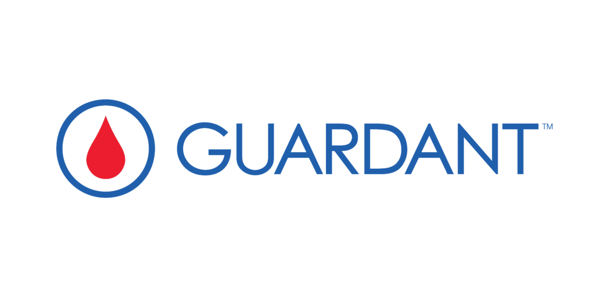
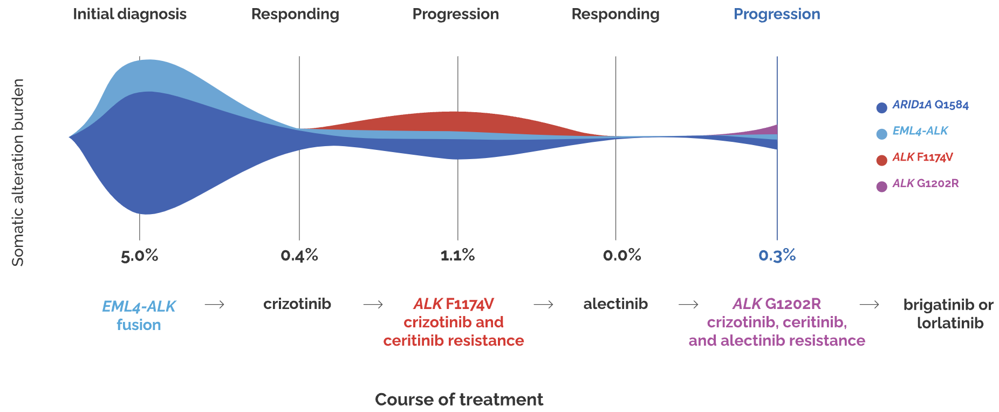
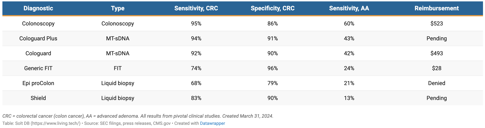

Guardant Health was founded in 2012 by Helmy Eltoukhy and AmirAli Talasaz. The company IPO'd in October 2018 after raising \$558 million in private financing. The company develops diagnostic tests for cancer detection, monitoring, and therapy selection using proprietary sample preparation chemistry, some bioinformatics error suppression software, and a fast next generation sequencing assay. The company has successfully penetrated the therapy selection market and is potentially starting a new chapter as an early detection company with the expected approval and launch of Shield, their blood based colon cancer screening test. Guardant is currently worth just under \$4 billion. 

In this post, we will explore several questions relating to their business and summarize information that could influence their business in the coming years. Their latest 10k is linked [here](https://d18rn0p25nwr6d.cloudfront.net/CIK-0001576280/48e480a0-651d-4199-9aeb-c3643608a6c8.pdf), and S-1 is linked [here](https://www.sec.gov/Archives/edgar/data/1576280/000162828018011647/guardanthealths-1.htm). 

### What does Guardant sell?

Guardant's products consist of biomarker tests marketed towards clinicians and paid either by patients or insurance. The company also markets data obtained through test results, selling it to pharmaceutical partners. Finally, the company also partners with pharmaceutical companies (170 distinct biopharma companies) to build companion diagnostic products and sell biomarker tests. Guardant has sold over 500k biomarker tests, and this is growing rapidly. In Q1 2024, they sold over 55k tests alone.

The biomarker products include:

1. Guardant360 CDx: This is the first FDA approved comprehensive liquid biopsy test for advanced solid tumors. It includes 55 genes for mutation profiling and also delivers biomarkers such as TMB, MSI status, and HRR. The test is used for therapy selection as a companion diagnostic for osimertinib, amivantamab, sotorasib, Enhertu, and elacestrant. The test provides results in 7 days and requires 2 tubes of blood. An expanded laboratory developed test (LDT) is also marketed with an expanded panel of 80+ genes, but is not officially FDA approved.

2. Guardant360 Response: This is an MRD liquid biopsy that measures treatment response across solid tumors and therapies. Guardant360 CDx or LDT test before initiating therapy is first used to establish a ctDNA baseline and a Guardant360 Response test 4 to 10 weeks after the therapy is then initiated to measure the change in ctDNA level. ctDNA predicts responders on average 8 weeks earlier than RECIST criteria and thus allows providers to switch out of toxic therapies quicker or escalate therapy if necessary. Guardant360 Response has MolDx LDT reimbursement for measuring metastatic or advanced cancer patient response to immune checkpoint inhibitor therapy. 

3. Guardant360 TissueNext: This is a tissue biopsy with a 500 gene genotyping and in the future methylation panel that is indicated for all advanced solid tumors and reimbursed as an LDT through Palmetto GBA as of March 2022. While Guardant is clearly a liquid biopsy company first, tissue based approaches can allow pathologists to take a "blood-first, tissue-next" approach where tissue based tests can be ordered as a reflex to confirm a biomarker diagnosis.

4. Guardant Infinity Core Module: This is Guardant's most comprehensive 753 gene panel, with a 15 MB methylation panel and additional IO, DNA Damage/HRD, and viral modules that can be collected in parallel. This product is designed for biopharma companies to aid biomarker development, and represents 30+% of pharma revenue. 

5. Guardant Reveal: Similar to Guardant360 Response, the Reveal product aims to use ctDNA to monitor for recurrence. The vision is for this to be a liquid-only minimal residual disease (MRD) test that monitors patients post-surgery to identify recurrence in early-stage colorectal, breast, or lung cancer. This is differentiated from the leading Signatera and NeXT Personal MRD test (see competition) which require some sequenced tissue from the surgical resection or biopsy specimen. In July 2022, Palmetto Gba coverage was granted for patients with residual or recurring stage II or III colorectal cancer who may benefit from adjuvant therapy, and was shortly thereafter approved in Sept 2023 for the Geisinger health plan. There is a large registrational study, [COSMOS](https://www.esmogastro.org/article/S2949-8198(23)00049-3/fulltext), which will allow Guardant to submit for reimbursement to Medicare in CRC. There is an analogous BREAST-MRD trial for neoadjuvant breast cancer. Reveal grew 90% in 2023 to low double digit millions in revenue with a hard sales ramp (which will taper in 2024), and in total this represents 4 million to 5 million in breast and colon cancer patients in total as the opportunity.

6. Shield: This is the big product that management thinks could be the largest franchise in cancer molecular diagnostics ever. The initial indication is primary screening colon cancer but there are plans to expand to lung and eventually offer the test as a multi-cancer early detection option. In January 2022, the company enrolled the first patient into a 10,000-patient prospective registrational study called SHIELD LUNG comparing Shield to low dose CT in high-risk individuals ages 50-80. Low dose CT has poor performance in lung relative to colonoscopy’s performance in CRC. In colon cancer, the FDA is expected to give a clean first-line label similar to Cologuard, albeit with limited sensitivity for detecting advanced adenomas. AdCom panelists voted 8-1 on safety, 6-3 on efficacy, and 7-2 on the risk-benefit balance of Shield in the indicated use (1L CRC detection in patients 45 years and older). The test is currently developed as a LDT but will be reimbursed with broader usage following the FDA decision in the coming weeks. 

7. Guardant Inform: This isn't a biomarker test, but instead a molecular database that can be sold to pharma. It includes >350k patients with testing, >50k with >1 Guardant360 test. 

### What are the regulatory and reimbursement considerations for liquid biopsy providers?

Biomarker diagnostic testing is a heavily regulated industry and there are many hoops to jump through in order to effectively market a test.

In broad strokes, there are two stages for a given biomarker test: pre and post FDA approval. In the pre-approval setting, tests can be marketed and covered through Medicare as a laboratory developed test (LDT) or an advanced dx lab test (ADLT). ADLTs are differentiated from LDTs in that they are specifically for proprietary algorithms while LDTs can be developed for tests in the public domain. In either case, they need to demonstrate clinical utility and maintain various lab certifications like CLIA (Clinical Laboratory Improvement Amendments) to CMS or a CMS contractor. For LDTs, tests need to be approved for coverage through regional Medicare administrative contractors (MACs), the most common of which is the MolDx program in the Palmetto GBA contractor. This specific program is a structured way for molecular diagnostics tests with clear high standards, making it easier for tests to go on to be approved and reimbursed by other MACs and private insurance organizations. ADLTs in contrast are directly evaluated by CMS. Some LDTs can transition to ADLTs given they meet ADLT criteria.

For LDTs, there are specific rates that Medicare reimburses for according to a Clinical Laboratory Fee Schedule (CLFS). Currently, it is up to \$5,000 per test, up from a maximum of \$3,500 at the start of 2024 but these rates vary depending on the type of test. For ADLTs, companies are allowed to set the price for the first 3 quarters of getting an ADLT coverage designation, which CMS will pay. After the 3 quarters, reimbursement is set at market rates depending on what private insurers are paying. 

The FDA approval process differs in that the emphasis is on safety and effectiveness, not merely that the text has clinical utility. Sponsors typically need to run large clinical trials with agreed upon endpoints. There is a review period, often with an advisory committee (AdCom) meeting where independent experts may come and vote in a non-binding fashion on the relative merits of a test on the criteria of safety and effectiveness. The FDA then generates an important label which decides the population that the test should be used on. 

FDA approval opens up Medicare population coverage. However, medical guidelines are seen as more important than the FDA label in determining the widespread usage and adoption of a test. For example, 10 states have mandates for local payers to cover colorectal cancer screening tests outlined as they are recommended by the American Cancer Society guidelines. The USPSTF (United States Preventive Services Task Force) most strongly influences reimbursement decisions. The USPSTF consists of an independent panel of experts in primary care and prevention and the Affordable Care Act mandates that preventive services with a grade of A or B from the USPSTF must be covered by most private insurance plans without cost-sharing. Positive USPSTF recommendation often increases adoption and utilization from insurance and clinicians. 

#### What does all this mean for Guardant and the upcoming decision on the Shield CRC screening test?

The LDT rate directly impacts the average sales price (ASP) of biomarker diagnostic tests. The increase in LDT rates directly led to the ASP of Guardant's test to grow to \$2,900-\$2,950 in 1Q24 from ~\$2,300 net of non-reimbursed tests. Shield is initially being developed as an LDT but will apply for ADLT status with pricing of \$895 in 2025.

Guardant is also expecting new ACS guidelines in 2025 which could include Shield as a blood based CRC screening modality. The company isn't expecting a USPSTF guideline decision until several years after the approval of Shield, but an important point is that the USPSTF only compares performance within modalities (i.e., stool, blood), meaning that Shield does not necessarily need to match the efficacy of Cologuard in order to receive a strong recommendation.

### What are the competition?

The liquid biopsy and molecular biomarker space in cancer is quite crowded. In their 10-K, Guardant describes competitors in each of their three business segments (therapy selection, minimal residual disease, screening).

#### Therapy Selection

- [Foundation Medicine](https://www.foundationmedicine.com/): Foundation offers both a Tissue and Liquid CDx; 300 genes plus bTMB, microsatellite instability high (MSI-H), and tumor fraction values
- [Caris Life Sciences](https://www.carislifesciences.com/products-and-services/molecular-profiling/): Almost every test imaginable
- [Tempus Labs](https://www.tempus.com/oncology/genomic-profiling/): Offers a slew of tests, covered [here](https://www.dennisgong.com/blog/TempusIPO/) on the blog. Most relevant is Tempus xF+, an expanded liquid biopsy panel consisting of 523 genes that detects pathogenic alterations in ctDNA and identifies SNVs, INDELs, CNGs and gene rearrangements.
- [Illumina](https://www.illumina.com/products/by-type/clinical-research-products/trusight-oncology-500.html): Sells kits that clinical centers can use to run their own therapy selection sequencing. 
- [Thermo Fisher](https://www.thermofisher.com/us/en/home/clinical/diagnostic-testing/condition-disease-diagnostics/oncology-diagnostics/oncomine-dx-target-test/oncomine-dx-target-test-us-only.html): Offers the OncoMine Dx testing for targeted therapies in NSCLC, cholangiocarcinoma, and thyroid cancer through NeoGenomics Labs or OncoCyte.

#### MRD Testing

- [Natera](https://www.natera.com/): MRD detection from cfDNA, called Signatera. Tissue is taken from FFPE specimens or surgical resection and sequenced. Variants are called and a personalized probe set for detecting those variants makes up the liquid ctDNA testing that is performed for monitoring ctDNA MRD. Positive predictive value of 98+%, the market leader in this category.
- [Foundation Medicine](https://www.foundationmedicine.com/): FoundationOne Tracker is a tissue informed test 
- [Personalis](https://www.personalis.com/): Three products: NeXT Personal, ImmunoID NeXT, and NeXT Dx. NeXT Personal is a similar assay to Signatera. NeXT Dx is a comprehensive genomic profiling solution for ctDNA, similar to the FoundationOne Tissue CDx product, but with paired normal sequencing as well.
- [NeoGenomics Laboratories](https://neogenomics.com/): "Market leader" in biomarker testing in cancer, they also offer a slew of CGP tests for solid tumors for therapy selection. They offer MRD tests mostly for hematological malignancies.
- [Tempus Labs](https://www.tempus.com/): They have announced an xM MRD assay for research use only in January 2024. They also sell Personalis' NeXT Personal test through their platform
- [Exact Sciences](https://www.exactsciences.com/pipeline-and-data/molecular-residual-disease): Oncodetect is a very similar assay to Signatera and NeXT Personal, potentially with more tracked variants and greater sensitivity.

#### Screening

The screening market is the big one due to the impending FDA approval decision for Shield, and the expectation that it will be the first approved blood test for CRC screening. Epi proColon test, a previous blood based early detection test, was denied reimbursement and withdrawn from the market because sensitivity and specificity were not good enough, but Shield's sensitivity/specificity are better and this is expected to land the company an FDA approval. Within CRC, Shield will most immediately compete with stool based tests and colonoscopy.

- [Exact Sciecnes](https://www.exactsciences.com/): Exact markets Cologuard, a [multi-target stool DNA test](https://www.nejm.org/doi/full/10.1056/NEJMoa2310336). Sensitivity for colorectal cancer is 93.9% and specificity for advanced neoplasia is 90.6%. Additionally, sensitivity for advanced precancerous lesions like advanced adenomas is 43.4%. Exact also bought Thrive Early Detection which previously developed a multi-cancer early detection platform that is now being marketed as [CancerGuard](https://www.exactsciences.com/pipeline-and-data/cancerguard).
- [Geneoscopy](https://www.geneoscopy.com/)'s ColoSense: This is a multi-target stool RNA test with 94% sensitivity for detecting CRC, 46% sensitivity for detecting AA, and 88% specificity for negative findings. This was recently approved by the FDA and is being commercialized as a competitor to Cologuard. Interestingly, the company is being sued by Exact Sciences.
- FOBT/FIT: Fecal occult blood test (FOBT) or fecal immunochemical test (FIT), are assays for the presence of blood in stool. A commonly used chemical to do this is Guaiac, which is a special compound that changes color in the presence of blood. There are also antibody based assays for detecting blood in stool, but guaiac is the most common. FIT tests (antibody based) have the highest sensitivity among these approaches at 57 - 89%.
- Colonoscopy: An endoscope is placed through the rectum and into the large intestine to visually inspect for polyps. This is the most sensitive and specific type of assay, with sensitivities in the range of 75-93%. Colonoscopies are typically scheduled every 10 years starting at age 50 and are the most common form of colon cancer screening. However, colonoscopy has several disadvantages responsible for low compliance including invasiveness, the necessity of bowel preparation, the risk of bowel perforation, and the need for sedation. 
- [Freenome](https://www.freenome.com/): Freenome uses a multi-omic biomarker solution for detecting CRC, leveraging integration of transcriptomic, proteomic, and genomic information from liquid biopsy. The results are less impressive than Shield with CRC sensitivity of 79.2%, advanced adenoma sensitivity of 12.5% and specificity of 91.5%. 

[Guardant Shield](https://www.nejm.org/doi/full/10.1056/NEJMoa2304714) reported sensitivity for stage I, II, or III colorectal cancer of 87.5%, 83% overall, with a specificity of 90%. A comparison of the tests Shield will be judged against is below:

Among other more early stage diagnostic companies, there are the following:

- [InterVenn Biosciences](https://intervenn.com/): Earlier stage company going after identification of advanced adenomas with high grade dysplasia, with their blood-based glycoproteomics test.
- [Exai bio](https://www.exai.bio/): This is an interesting company using recent developments from Hani Goodzari's lab among others that center upon orphan noncoding RNAs and other RNA species that can be obtained via liquid biopsy.
- [Earli](https://www.earli.com/): This is a synthetic biomarker company, where a priming agent is administered and somehow modified by the tumor. The modified product is detected and read out to diagnose disease.
- [AMADIX](https://amadix.com/): Spanish company with a diverse set of undifferentiated liquid biomarker tests
- [DELFI diagnostics](https://delfidiagnostics.com/): This company using technology from Victor Velculescu is developing the FirstLook test for lung cancer as an intermediate blood test step between suspicion of lung cancer and low-dose CT.
- [GRAIL](https://grail.com/): They market the Galleri multi cancer early detection test. This is not yet approved by the FDA and is in a tricky situation after Illumin's thwarted acquisition of the company.
- [CellMax Life](https://cellmaxlife.com/): colon cancer screening "FirstSight", optimized for adenoma detection
- [Berry Genomics](https://www.berrygenomics.com/cmscontent/211.html): in China - 6 cancer early detection
- [Burning Rock](https://us.brbiotech.com/): ELSA-seq technology for multi-cancer detection via blood. Another Chinese company.
- [AnchorDx](https://www.anchordx.com/en): Chinese company using cfDNA methylation for lung cancer early detection

### What are the major areas of differentiation from other liquid biopsy providers
The axes for differentiation across the three business segments (therapy selection, minimal residual disease, screening) have a lot of overlap. In essence it comes down to convenience and efficacy.

Blood based tests capture the convenience aspect quite well. You don't need to collect stool samples or get a colonoscopy. The 4 tubes of blood is somewhat concerning but really only 2 tubes are necessary to run biomarker tests. In MRD, Guardant hopes to differentiate from not needing a tissue sample in order to get a personalized ctDNA metric. Instead, having everything be blood based is hopefully a differentiating factor vs Natera's Signaterra or Personalis' NeXT Personal. Another platform advantage that Guardant has and provides an advantage in the therapy selection space is turnaround time. Guardant can return results in less than a week while other providers may need 2 weeks.

The efficacy side of the equation is honestly a bit difficult to interpret because there are many variables at play such as the screening interval, the population used for studies, the compliance rate, etc. These are all going to change the real world performance of the test much more than what a regimented clinical trial will tell you. For this reason, efficacy is obviously very important, but can get overshadowed in some instances by the convenience advantages.

### Why colon cancer as an initial indication?

While the colon cancer screening market is crowded, it makes sense for several reasons:
1. Colon polyps frequently shed ctDNA, which can be readily detected via liquid biopsy
2. There is a gold standard diagnostic to benchmark sensitivity and specificity of biomarker tests (colonoscopy)
3. The gold standard diagnostic approach is invasive and many patients are not comfortable with getting it
4. There is a very large market size. Of the 120 million adults in the U.S. who are eligible for CRC screening, 50 million are unscreened and are not up to date with their colonoscopy. These patients are candidates for non-invasive screening, either via FIT/FOBT/Cologuard/etc. Penetrating this market with 16 million annual tests (patients are screened every 3 years), with a cost of \$500/test gives you a TAM of \$8 billion annually. Overall, Leerink estimates the CRC screening market at \$20 billion. 
5. The benchmarks for FDA approval of a liquid biopsy screening test are known and no blood based screening tests have been approved thus far in colon cancer

### How is Guardant doing financially?

Guardant has \$1.2 billion in cash. The stock is worth almost \$4 billion. Throughout the company's lifetime, a deficit of \$2.1 billion has been accumulated, with a net loss of \$347 million in 2023. The company has projected cash flow break even in 2028 following the launch of Shield. Biopharma growth is 15% yoy, clinical tests are growing 39% yoy, and revenue is growing 25% yoy from \$562 million in 2023. The company's primary source of losses are from the development of Shield, and management hopes to cap Shield related burn at \$200 M annually. 

The company is quite healthy from a balance sheet perspective and has not indicated a need to raise additional capital in the near term.

### How profitable are tests and where does Guardant earn money from

From their 2024 [Q1 press release](https://investors.guardanthealth.com/press-releases/press-releases/2024/Guardant-Health-Reports-First-Quarter-2024-Financial-Results-and-Increases-2024-Revenue-Guidance/default.aspx): 

_"Revenue was \$168.5 million for the first quarter of 2024, a 31% increase from \$128.7 million for the corresponding prior year period. Precision oncology revenue grew 38%, to \$156.2 million for the first quarter of 2024 [this is from 46,900 tests to clinical customers and 8,450 tests to biopharmaceutical customers], from \$113.4 million for the corresponding prior year period, driven by an increase in clinical and biopharma testing volume, which grew 20% and 37%, respectively, over the prior year period. The increase in precision oncology revenue was also attributable to an increase in reimbursement for our tests, due to an increase in the Medicare reimbursement rate for our Guardant360 LDT test to \$5,000, effective January 1, 2024, and an increase in reimbursement received from commercial payers. Development services and other revenue was \$12.3 million for the first quarter of 2024, compared to \$15.3 million for the corresponding prior year period."_

Gross margins on precision oncology are 62%, and therapy selection with Guardant360 has 43% CAGR in clinical volume. Development services gross margin is 51%. These are very healthy numbers and are expected to increase as the reimbursement environment becomes more favorable towards molecular biomarkers (more frequent reimbursement and increasing coverage prices). Most (92.7%) of revenue comes from selling biomarker tests, so rule changes like increasing LDT reimbursement provide a lot of upside.

_"G360 TAT is now 4-5 days, making it the fastest option for physicians. G360 has benefitted from the recent increase in the LDT rate to \$5,000, the same as the CDx rate. GH has yet to see Medicare Advantage volume reflect this change, giving them confidence in ASP growth ahead. GH is on track to outpace the \$3,000 ASP target it set at its investor day. Enhancements to GH’s epigenetic capabilities are driving significant interest from pharma and academic partners, more so than larger panels that competitors are offering."_

In terms of costs, each of the tests may have a different platform and different COGS. Harmonizing these with automation, etc can substantially reduce costs on the internal side. For example, gross margin on Shield is expected to be negative initially but with harmonization and the expected increase in price due to ADLT listing in 2025, Guardant expects the product to have positive margins in 2025. Externally, these tests require a substantial sales force. Guardant is hiring 100+ sales employees to launch Shield (with up to 300+ at USPSTF guideline inclusion), with the expectation of burning up to \$200 million annually on screening (inclusive of negative GM, R&D, S&M, etc). So while initially, the estimated COGS for the Shield tests could be quite high, up to \$950/test according to Guggenheim analyst models, it is expected that this metric rapidly falls as more tests are sold. Guardant management says that they hope to get COGS below \$500 "very quickly after launch", and \$200 by 2028 if they are able to get to 1 million tests annually. Shield is expected to become the major cash cow of Guardant in the years to come.

Major R&D developments include Shield V2 with improved sensitivity/specificity, the Shield Lung cancer study, and more work towards multi-cancer early detection. R&D expenditures are hefty because they involve incredibly large trials; ECLIPSE, the study for Shield in CRC enrolled 45k individuals for reference. Additional areas for growth and expansion include EMR partnerships which could further streamline ordering workflows for physicians. Currently already more than one-third of orders are digital which speaks to the value of EMR integration. Finally, international expansions in Europe, the Middle East, and Asia are ongoing. Studies in the UK have set a model for working with top KOLs and Guardant is expanding a Shield lung study to 10k patients in the NHS and more in Spain as well.

GH estimates liquid biopsy for MRD and therapy selection represents an \$80B+ market. Guardant360 has been used on 700k+ metastatic cancer patients that represent \$6B of market opportunity today, and this is expected to grow with penetration into earlier lines of therapy. Reveal recurrence monitoring is a \$20B (14M cancer survivors) opportunity. Over the longer term, Guardant management thinks the Shield TAM is a \$50B multi-cancer screening opportunity for screening asymptomatic and high-risk patients.

### Will biomarker companies just be cash cows forever?

They might. From what I understand, the bar for creating one of these companies is very high as you need to run large studies to show efficacy. As a result, funding one of these companies can be quite risky, as the success of the company depends largely on the recruitment and execution of large clinical trials with thousands of patients. Insurance coverage is the major decisive factor as patients are generally not willing to pay out of pocket for these tests. So if a company can offer reasonable pricing for a test, they could just sit forever. Cancer is a forever problem and the barrier to entry is a pretty good moat.

In screening, it's possible that there is a limit of detection that can't be breached or be much more difficult to breach by fancier molecular biology. To even test the hypothesis, investors would need to be comfortable sinking hundreds of millions of dollars just to make lower margins when commercialization finally happens.

In MRD, it seems as if the MRD tests are already quite good. This means that there is a large growth opportunity that could be readily serviced by existing tests, without the need for competitive entrants to steal market share.

However, I envision that therapy selection will likely be commoditized. Genotyping tumors is simply not that exciting.

### What can Guardant's experience tell us about molecular biomarkers in cancer?

- Blood based tests have much better compliance. In 10,000 patients, Shield has a 1 time adherence rate of 96%, while stool based tests have adherence of 28-71%. 
- Blood based tests are exciting because they improve screening rates without necessarily having an effect on utilization of other screening tests. Early cancer detection is optimal with multi-modal approaches including highly sensitive tests like colonoscopy, but also physical exam, EHR symptoms, imaging, etc. Guardant has done 2 large randomized controlled studies to show that screening increases 1.8-2.4x with a blood based option without impact on colonoscopy and stool-based tests. You could argue that increased utilization of the healthcare system is a bad thing (we already spend too much on healthcare, screening hasn't demonstrated a meaningful increase in overall survival, yada yada), but I think it is at least reasonable to let people spend on their own health if they want to.
- Tissue and blood are not the same. Liquid biopsies can be used for patients with difficult to biopsy cancers, and provide more holistic sampling of all tumors, not spatially restricted to the biopsy site. Blood biopsies can find things that tissue biopsies miss. Tissue biopsies could be more sensitive in some instances as well. A paired approach enables collection of the best of both worlds
- Guardant is diving deep into the epigenome. This sort of makes sense because a single methylated gene (SEPT9) gives you a sensitivity/specificity of 68/79%. 
- However, multi-omics is not necessarily better. Shield was initially a cfDNA plus protein test but cfDNA alone outperformed

I think we are going to watch Guardant continue to be a dominant molecular diagnostics company with fluent operational expertise and aggressive clinical and commercial development in larger and larger indications. As a biologist, my belief is that there is much more to discover about cancer drivers and biomarkers. Cancer is complex and the intricacies of how to understand and treat patients in a personalized manner is not close to being solved. Better biomarkers are the only way forward, and the excellence of how Guardant and other companies have executed on providing these biomarker tests to patients is truly something to admire. 

