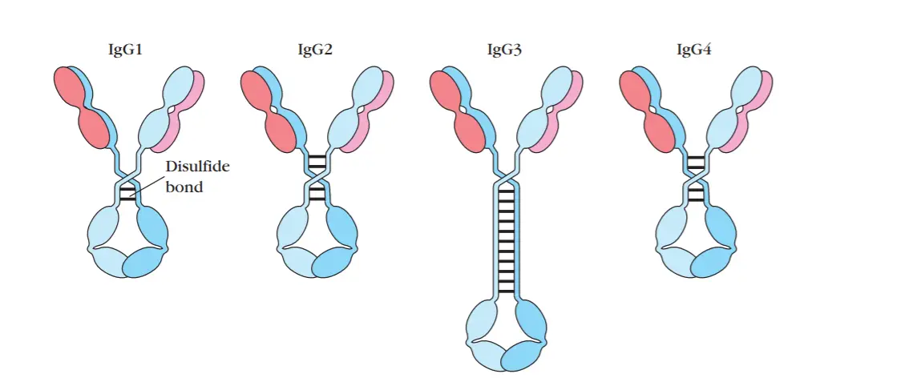

This post is a short survey of interesting new developments in antibody therapy for cancer. I'll specifically focus on bispecifics given some interesting recent clinical data from CytomX ([CX-904](https://ir.cytomx.com/news-releases/news-release-details/cytomx-therapeutics-announces-positive-initial-phase-1a-dose)), Merus ([petosemtamab](https://ir.merus.nl/news-releases/news-release-details/merus-petosemtamab-combination-pembrolizumab-interim-data)), Janux ([JANX007](https://investors.januxrx.com/investor-media/news/news-details/2024/Janux-Announces-Encouraging-Safety-and-Efficacy-Data-in-Ongoing-Dose-Escalation-Trials-for-PSMAxCD3-TRACTr-JANX007-in-mCRPC-and-EGFRxCD3-TRACTr-JANX008-in-Solid-Tumors/default.aspx)), and Amgen ([Tarlatamab](https://www.nejm.org/doi/full/10.1056/NEJMoa2307980)). 

There has also been a flurry of other activity in the bispecific space including Merck's acquisition of Harpoon Therapeutics (DLL3; $680 M), recent fundraising for Clasp, a pMHC T cell engager platform, and several smaller licensing deals and fundraises. 

### IgG subclasses

First, we should discuss how antibodies are built. All FDA approved antibody therapies and most in development are based off of an IgG template. IgG is the most common antibody in serum (~75%), and is made up of 4 subclasses (IgG1-4). 

Each of these has slightly different properties. IgG1 and IgG3 are efficient at activating complement and ADCC through NK cells whereas IgG2 has less and IgG4 has no capacity for complement activation or ADCC. Antibodies which do not have a cytotoxic component like an ADC are often engineered to enhance ADCC or CDC so that binding to a tumor antigen can elicit immune killing. In contrast PD-1 or other immune checkpoint antibodies which are meant to bind to immune cells or other stromal cells often are IgG4 so that there is no ADCC or CDC.

Further subdividing these is the fact that the light chains making up the antibodies can be either kappa or lambda light chains. Lambda light chain regions are more hydrophobic (more clumping), have a higher aliphatic index (more thermally stable), and have lower isoelectric point (pI). A disproportionate number of investigational agents are kappa because they seem to be overrepresented in screening libraries. For example, mice have higher κ:λ ratios (up to 20:1). 

### Engineering strategies for bispecifics

Companies have different platforms for bispecific engineering. There are two central challenges that these platforms solve for: PK and manufacturing.

Traditional mAbs have ideal PK because they are able to make use of FcRn recycling. Monoclonal antibodies can be engineered for half-life extension via Fc mutations that enhance binding to FcRn (e.g. YTE). Bispecific antibodies are often formed with smaller fragments or are structurally complex (ie. asymmetric, conformationally constrained, potential steric hindrance) which can interfere with FcRn interactions. The earliest BiTE program approvals from Amgen including Blinatumomab required continuous i.v. infusion over weeks. 

This is an engineering problem, and various approaches are under development to extend PK, such as via PEGylation. Balancing hydrophobicity and pI, to reduce aggregation and nonspecific interactions, and improving serum stability are major considerations. Recently, the importance of optimizing the distribution of charged and hydrophobic residues across the two arms has also been described.

Manufacturing is difficult because expressing and purifying these non conventional bispecific formats is a challenge. Once transduced into a CHO cell, either heterodimers (desired) or homodimers (want to avoid) are produced. Homodimers are not useful because they don't express the two distinct arms, just one of the arms twice. One particular engineering approach termed knob in hole (KIH), is commonly used to address this. The approach involves engineering specific pairs of 'lock' or 'key' on each unique arm of the antibody, and the corresponding pair on the common domain. This effectively reduces the amount of 'trash' or misfolded antibody and also useless homodimer that is produced, thus increasing yield. In addition to KIH mutations, charge based strategies, unnatural amino acids, and other steric strategies are utilized to bias towards heterodimer formation.

My impression for how bispecifics are 'discovered' is that this is just a very messy plug and play process. You find your binder using typical antibody discovery approaches, and see if you can put together something that has drug-like properties. As a review for how antibodies are traditionally developed, I would stratify discovery approaches into screening based -- with phage/yeast/mammalian cell display technologies, versus B cell sequencing based -- using humanized mice and immunization. These can be supplemented with computational approaches. 

Platforms that have successfully produced bispecific programs include:

- [BiTE platform](https://www.amgen.com/stories/2018/08/the-shape-of-drugs-to-come/bite-molecule) (Amgen): This is a small molecule (~55 kDa) which contains a variable region for CD3, a variable region for a target of interest, and connected by a peptide linker. 

- [DART platform](https://macrogenics.com/platforms/dart-and-trident-platforms/) (MacroGenics): DART molecules are engineered to have two binding sites for two different antigens. This format uses a single-chain variable fragment (scFv) from each antigen-binding arm, which are then stabilized by disulfide bonds. 

- [Multiclonics platform](https://merus.nl/technology/multiclonics-platform/) (Merus): The bispecific format uses a set of mutations in the Fc region that favors heterodimerization over homodimerization. This is called the "[DEKK Dimerization Technology](https://www.ncbi.nlm.nih.gov/pmc/articles/PMC5582861/)". A common light chain is used with variable heavy chains and the antibody ends up looking like a IgG1 with long half-life and low immunogenicity.

- [CrossMab platform](https://www.roche.com/stories/crossmab-technology-in-research-technologies) (Roche/Genentech): This approach involves swapping domains between the two different arms of the antibody. For example, the heavy chain domain of one arm may be swapped with the light chain domain of the other. This helps to prevent mispairing of the heavy and light chains, ensuring the correct assembly of the bispecific antibody.

- [Duobody](https://www.genmab.com/antibody-science/antibody-technology-platforms/duobody) (Genmab): This method involves controlled Fab-arm exchange, where two different antibodies are incubated under mild reducing conditions to enable the exchange of half-molecules, forming bispecific antibodies. The process relies on the natural affinity between heavy and light chains to reassemble correctly.

- [XmAb Bispecific Fc domains](https://xencor.com/technology/bispecific-fc-domains/) (Xencor): The Xencor [platform](https://www.sciencedirect.com/science/article/pii/S104620231830152X?via%3Dihub) is clever in that the Fc is engineered such that heterodimers have different isoelectric point than homodimers. This allows easy purification of the resulting mix of homo and heterodimers. Their platform also has a set of mutations in the Fc region that enable 95%+ homodimers.

- [DVD-Ig](https://link.springer.com/protocol/10.1007/978-1-61779-921-1_9) (Abbvie): his format involves fusing two different variable domains in tandem on each arm of a conventional IgG. This design allows the antibody to bind to two different antigens while maintaining a structure similar to a standard IgG.

- [Azymetric Fc platform](https://www.zymeworks.com/technologies/azymetric/) (Zymeworks): There are undisclosed mutations in both heavy and light chains that render the resulting antibodies 'asymmetric' and promoting of heterodimers without Fc effector function.

### New pharmacology

I'll try be best not to regurgitate what ChatGPT might tell you. For me, what is interesting are dual pathway signaling inhibitors, bi-paratopic antibodies, and masked T cell engagers.

Within the first class, dual RTK signaling inhibitors targeting different cell surface receptors has shown a clear efficacy signal both with amivantamab, the EGFR/MET bispecific that was recently approved in lung cancer, but also via exciting data from Merus. Their EGFR/LGR5 bispecific petosemtamab (CRC), and HER2/HER3 molecule zenocutuzumab (NRG1+ NSCLC and PDAC) have both demonstrated the value of co-targeting molecules to drive deeper internalization of the driver oncogenic receptor. Additionally, drugs like Ivonescamab which target two high effect size important drivers of tumors (VEGF/PD-1) are exciting not only from a biological perspective, but also clinically to streamline care to avoid multiple infusions of separate products.

Biparatropic antibodies are exciting also because they enable best in class targeting of known oncogenic drivers. The engineering behind the new likely best in class HER2 targeted antibody Zanidatamab allows the molecule to target two non-overlapping domains of HER2, thereby enhancing HER2 internalization and downregulation via receptor clustering. Addressing other difficult targets like c-MET (REGN5093), increasing the scope with ADCs (zanidatamab zovodotin), and even utilizing this approach in CAR-T (cilta-cel) represents growth opportunities.

Finally, masked bispecific approaches like the ones developed by Janux and CytomX somehow really seem to be working. Even something like EGFR which isn't typically associated with being a strong cell surface target in PDAC seemed to have real anti-tumor activity. Expansion of the targetable cell surface -ome to more offbeat antigens is the exciting frontier here. If EGFR works, there may be a bunch more that also may show activity. If surface targets don't need to be exquisitely specific or that highly expressed, pMHC engagers become much more interesting.

##### What am I not so excited by?

Innate cell engagers and multi-targeted checkpoint therapies. My reasoning is that if NK CAR-T doesn't work, I find it unlikely that the less potent engager approach will work. On multi-targeted checkpoint, I see how you can make an argument that the avidity effects can make a single molecule more potent than the combination of two molecules targeting distinct antigens. I see immunotherapy similarly to chemotherapy in that it really is a dial. The more effective you make it in the tumor, the more likely you are to see irAEs. Tumors have more sophisticated mechanisms of immune evasion; more so than typical normal tissue. One possibility which could address this is a masked approach. However, we have learned that the effects of checkpoint blockade are realized systemically in the periphery as well as intratumorally. Finally, half life improvement or funky engineering strategies like glofitamab, or trying to improve penetration like Blino are less interesting to me. The smaller size argument hasn't played out super well; getting as close as you can to native IgG1 probably gets you the most for your trouble.

