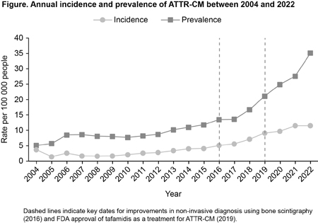
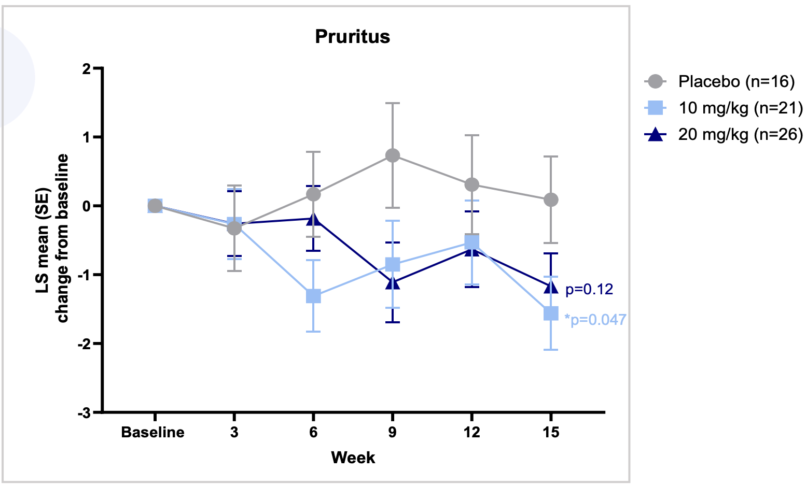
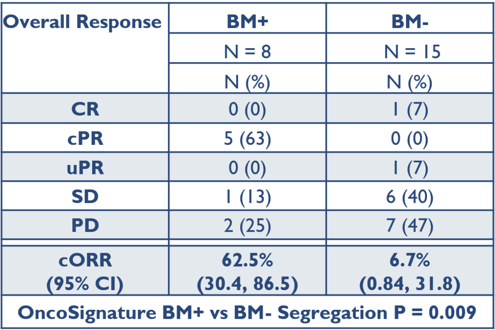

The goal for today is to practice evaluating investment opportunities. I've had a curiosity about doing hedge funds as a biotech analyst for a bit, but never had the chance to see if I would be any good at it. Following the markets is interesting in itself and I think the best analysts can reach a senior scientist level of expertise, which is an added bonus of trying to learn. This past year (2024) in particular has taught me the importance of super basic lessons like alpha vs beta, timing entry and exit opportunities, and how to search for ideas. This post is meant to be a knowledge checkpoint. Hopefully something I can look back at in a year or two to evaluate if I've gotten better at it in any way.

Also motivating me to write this is inspiration from a couple of Twitter threads, whose predictions I'll follow carefully:

1. [Peter Suzman](https://x.com/Biomaven/status/1874515083273154580)
2. [Erik A. Otto](https://x.com/ErikOtto2/status/1874461357640196173) 
3. [Sports_Bios](https://x.com/Sports_bios/status/1874293682158891330), [part 2](https://x.com/Sports_bios/status/1874293964674633935)
4. [Genomics Cow](https://x.com/GenomicsCow/status/1873824633839095912)
5. [Drugs](https://x.com/drug_smolecules/status/1873145720687165448)
6. [STL Biotech](https://x.com/STL_Biotech/status/1873149780517634121)

  ───────────

From last year, there were several (straightforward) opportunities to make money:

1. Riding the ADC/Radiopharm wave (\$ELEV, \$FUSN, \$CATX)
2. One offs after news from other companies (\$DRUG)
3. Playing large binaries (\$SAVA, \$GALT, \$VKTX)
4. Longing launches (\$VRNA, \$TARS)

I think there probably is a lot to learn from screening for these top performers (and losers) every year. You can study why they made such a big move, what the market valued them before and after. Other ways of finding learning opportunities are by learning about why others are interested in certain names (e.g. the [Biopick contest](https://x.com/pawcio2009/status/1878564473214013837)). There are also plenty of Jim Cramers in the market [e.g.](https://x.com/drsprs/status/1861885024972468712). 

I was probably (and maybe still am) one of those Jim Cramers. I stumbled upon my previous [coverage](https://www.dennisgong.com/blog/CancerIPOs/) of recent oncology IPOs. Certainly not as bad as the previously linked guy, but not great either. I would grade it a C, especially because some of the commentary is flat wrong (e.g. missing hard on AMAM, not appreciating ERAS enough, and never having any conviction to pull the trigger on NUVL or RVMD).

Have I grown as an investor? One basic lesson I learned last year is that good assets are worth money (except AUPH). I learned all about I&I and markets outside of oncology. I learned that preclinical data actually matters, and a thesis that you can understand is important.

I have 3 themes for 2025:
1. Interesting situation where people in biotech are freaking out about __competition from China__. Meanwhile, I think it relieves some pressure off of target focused teams with novel insights. Teams probably become more secretive. 
2. __Platforms are back__. Radiopharma, masked TCEs, TCEs in general in I&I, recent \$SANA data. Assets are always valuable, but its harder now to just go build an asset company given the competition.
3. __Indication expansion__. The 'hot' indications are going to be tricky to do trials in. Look at atopic dermatitis. With waves of new effective medicines, it is going to be harder to find sick people. The only answer is to push to indications with more clinical and biological uncertainty.

Lastly before picks, disclaimer to not listen to me in general. I lost a ton of money longing AUPH and TWST, never had the conviction to short any of the AI names I wanted to 4+ years ago including Ginkgo and Recursion. I never had the conviction to long RVMD or LLY despite being relatively early to the science. 

## What I am following

### Interesting Privates

#### Attovia Therapeutics: 

According to Pitchbook, this is worth \$280 million (post), after raising \$165 million. 

This is a 'next generation nanobody' play. Nanobodies have shown glimmers of potential (e.g. MLTX). Due to small size (30kDa), they have the theoretical advantages of better tissue penetration and ability to bind epitopes that may be restricted by geometry. Attovia's argument is that linking two nanobodies enables a unique biparatopic mechanism that has a very low off rate. Half life can be extended to Q3M+, probably by adding albumin binders. Initial targets are IL-31, and a bispecific IL-31 / IL-13. This is being trialed in atopic dermatitis and prurigo nodularis (probably).

I'm interested in this as a sort of referendum on protein engineering for I&I, not really to invest in. The valuation is quite rich for the stage (Phase I) and competition. Many of the novel strategies (e.g. AI Proteins) leveraging whatever is published in Nature is based on minibinders or nanobody technology.

#### Attralus Therapeutics: 

According to Pitchbook, this is worth \$426 million (post), after raising \$197 million.

This company is developing expertise on the structural biology of amyloid. The lead application is for various forms of systemic amyloidosis. The PFE/BBIO stabilizers or even the more advanced RNAi or CRISPR based approaches of silencing amyloid production still don't improve symptoms by actively reversing deposited amyloid. Attralus is developing a pipeline of antibodies that are meant to be able to clear amyloid from tissue.

AstraZeneca is developing its own amyloid removal antibody ([NI006](https://www.nejm.org/doi/full/10.1056/NEJMoa2303765)) that had pretty stunning results in Phase I. I'm generally excited about amyloid removal as a concept given that it seems like we don't have a great handle on the prevalence of amyloid accumulation in tissue and its physiologic effects (see plot below on diagnosis of ATTR cardiomyopathy).

## LONG

### Small cap

#### Rapt Therapeutics (\$RAPT)
This company in licensed an Omalizumab bio-better. Their lead product is a long half life IgE mAb that can cover the entire Xolair dosing table, be dosed less frequently, and also drive deeper IgE depletion. Chinese partners are running trials in asthma and CSU while RAPT is doing Phase II studies for food allergy. Company cites a \$4-5 billion opportunity. Key questions for me are all commercial. How does this compete with biosimilar omalizumab (company study cites only 30% premium)? How will RAPT parlay this into a commercial success story? Lot of specialist investors in this one.

#### Verastem oncology (\$VSTM)
Defactinib (and FAK inhibition more broadly) leverages an underrated mechanism that I think will continue to have success in combination with MAPK targeting agents. Verastem's current market cap is in the ~250 million range. Combinations of defactinib and their RAF/MEK clamp avutometinib will likely be approved in LGSOC. Indication expansion to PDAC, NSCLC, and other MAPK driven cancers will continue defactinib's growth.

However, they need to find a biomarker for FAKi sensitivity pretty badly. That would significantly improve the company's prospects in my head. Otherwise, you look at these FAK trials and there's no single agent activity. 

It's pretty hard to imagine why there aren't many other FAK targeting agents in clinical trials. In stroma rich cancers like PDAC, FAK inhibitors/degraders should definitely be a thing. The preclinical rationale is too compelling.

#### Tourmaline Bio (\$TRML)
IL-6 inhibition is going to be relevant in more indications than it is currently approved for. The company recently touted a new indication in AAA due to human genetics evidence, which is on top of existing ASCVD and TED trials. It sits at a \$500 million market cap but if any of these trials hit, I think that the company will be worth multiples as these are large chronic indications.

#### Kiniiksa (\$KNSA)
Long the launch of a good drug. Rilonacept in recurrent pericarditis. The IL-1a/b mechanism similar to IL-6 I think has legs for indication expansion (e.g. in hidradenitis suppurativa due to the lutikizumab [data](https://news.abbvie.com/2024-01-08-Lutikizumab-Showed-Positive-Results-in-a-Phase-2-Trial-of-Adults-with-Moderate-to-Severe-Hidradenitis-Suppurativa-as-Program-Advances-to-Phase-3))

#### Chemomab (\$CMMB)
Novel mechanism (CCL24) in primary sclerosing cholangitis. Tiny market cap, but two orphan indications with no approved therapies. Pathway has been validated in 12 model systems and the POC Phase II data make the drug look active. It certainly isn't the best antibody ever for CCL24 so I imagine the fast followers, if it works, will be very fast. Nonetheless, the market cap makes it an interesting set up.

#### Acrivon Therapeutics (\$ACRV)
The story here is biomarker strategy. Otherwise, its an undifferentiated CHK1/2 inhibitor. The proteomic biomarker seems to actually work. I think these become a thing for many more drug mechanisms.

#### Kura oncology (\$KURA)
Menin inhibition. Good drug. It will be integrated into triplets and eventually quads in AML and be impossible to displace. 

There is some hesitation since the company partnered with Kyowa Kirin for commercialization. Some investors took this as a sign the company wasn't getting acquired. I just find it impossible that a company with a drug achieving 80+% response rate in AML is worth anything less than \$2 billion.

The farnesyl transferase inhibition [strategy](https://www.biorxiv.org/content/10.1101/2024.12.20.629824v1) that makes up the rest of their pipeline could work as well. Likely not, but kudos for trying a new mechanism.

### Mid cap

#### Apogee Therapeutics (\$APGE) / Spyre Therapeutics (\$SYRE)
Long acting biologics to replace Dupixent, Entyvio, Skyrizi, etc. 

Apogee is doing IL-13, TSLP, and OX40L. Spyre is doing TL1A, a4b7 integrin, and IL-23. Both will eventually pursue combinations. Each has half lives that are multiples of their parent, while targeting essentially the same epitope to minimize biological risk.

These are good drugs genuinely. The management teams running these companies (same parent; Paragon Biosciences) were very savvy to enter YTE before everyone else. The opportunity is genuinely pretty massive and I am a buyer of the argument that better exposure leads to enhanced efficacy.

#### Revolution Medicines (\$RVMD)
In 2024, we got the first clinical data that RMC-6236 works quite convincingly across many animal models and most importantly in humans. RVMD has performed several large cohort combination studies in mouse models, and 2025 will have readouts from many of the combo studies they have initiated, including chemo, PD1, and allele specific KRAS inhibitors.

If these trials read out positively, it probably becomes pretty difficult to displace this drug. The company has had strong operations since being founded. 

#### Blueprint (\$BPMC)
Blueprint's kinase inhibitor library is a valuable source of new pipeline growth as new indications/mechanisms become biologically validated. For example, they have a WT Kit inhibitor for mast cell driven conditions like urticaria. A small molecule Kit inhibitor is differentiated versus antibodies. 

Buying BPMC at ~\$5 billion I think is reasonable. You are paying for an eventual [\$4 billion](https://www.prnewswire.com/news-releases/blueprint-medicines-provides-2025-outlook-and-highlights-strategy-for-continued-growth-302348688.html) in Ayvakit sales (\$2 billion by 2030). Maybe the CDK2/4 degrader programs are worth something too. They have almost \$900 million in cash.

#### Tempus (\$TEM)
I've written extensively on this company previously, [here](https://www.dennisgong.com/blog/TempusLabs/) when they were private and [here](https://www.dennisgong.com/blog/TempusIPO/) when they did their IPO. Ultimately I think that Tempus for all its issues is directionally correct. In a world where therapeutics are increasingly crowded, biomarkers are a way to differentiate. Owning tons of clinical and molecular data is a great way to lead the world in biomarkers.

If you were to make a bet in precision medicine...

#### Teva (\$TEVA)
1. Biosimilar revenue (\$4.3 billion worth)
2. Good antibody developer. 
3. TL1A antibody has value. 
4. Sneaky excited about IL-15 antibody in celiac.

#### Launches and Acquisitions

For some companies, there ultimately isn't much to say aside from the clinical trial data being pretty good, and the valuation of the company being less than the time and capital adjusted returns it would provide in downstream revenue.

1. Verona Pharma (\$VRNA): Launch of inhalable PDE4 inhibitor
2. Tarsus Pharma (\$TARS): Rare eye infections
3. Cytokinetics (\$CYTK): Cardiac myosin inhibitors and activators
4. Scholar Rock (\$SRRK): Activin receptor ligand trap

## SHORT

#### Dumb obvious ones

Mostly to keep track of the opportunities:

1. Quantum computing stocks (QSI, IONQ, & QUBT)
2. Fartcoin
3. Northwest Biotherapeutics (\$NWBO)

#### Recursion Pharmaceuticals (\$RXRX)

Recursion Pharmaceuticals is a company worth \$3 billion. That companies like this exist and are continuously able to raise money, is why I think there is tons of alpha in biotech. They have 800 employees and $800 million in cash.

#### Absci (\$ABSI)

This company is worth ~\$300 M and has ~120 million in cash. It has a TL1A antibody. The team is not built for drug development.

Partnership with AMD is reminiscent of Recursion's NVDA deal that didn't do anything for the company.

#### Abcellera (\$ABCL)

AI antibody design is a basket short. This company is worth almost \$900 million, and has ~670 million in cash.

ABCL575, their OX40L for atopic dermatitis is in IND enabling studies while APGE is in Phase I. They have an undisclosed GPCR/ion channel antibody, which I'm guessing is Kv1.3 (patents). Eli Lilly has a Kv1.3 antagonist small molecule in Phase II already in psoriasis.