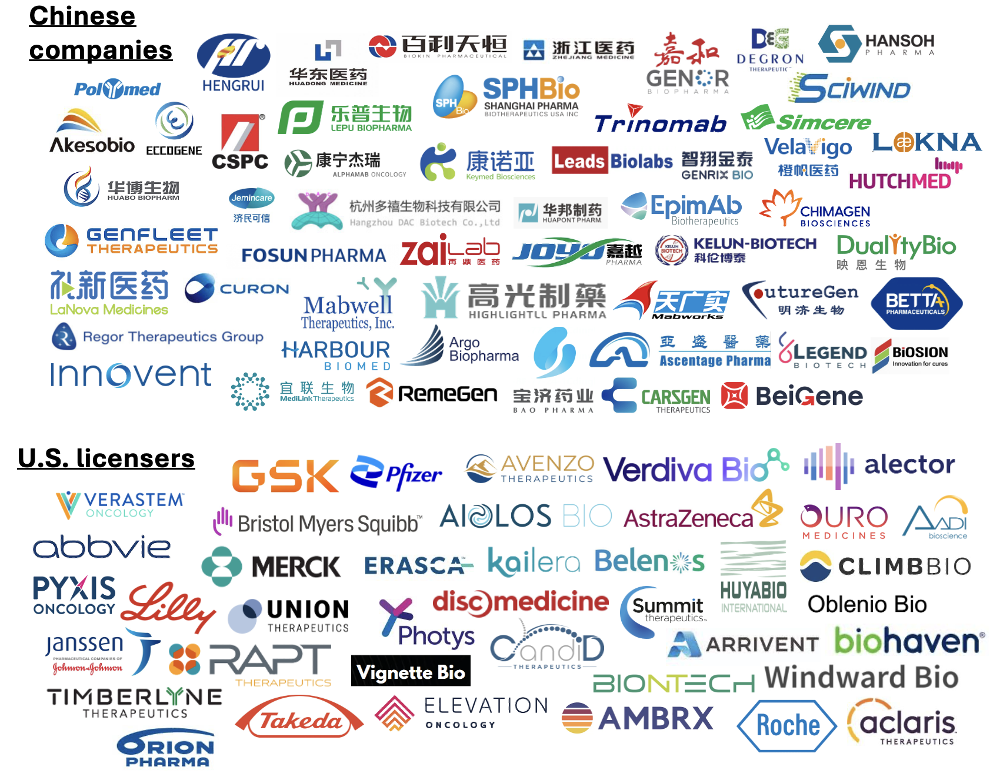
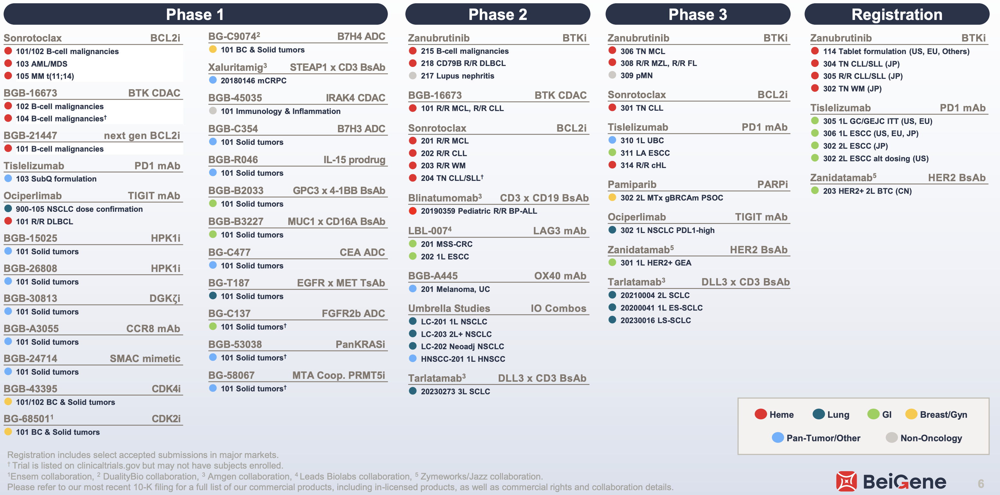
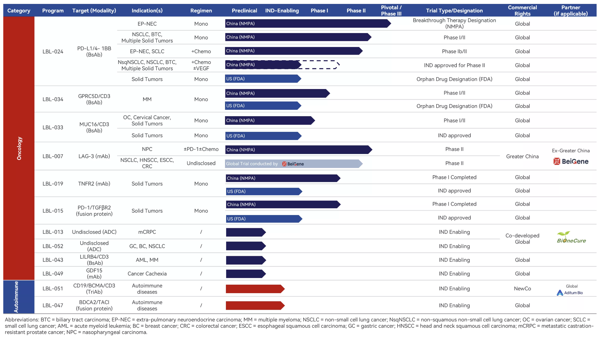
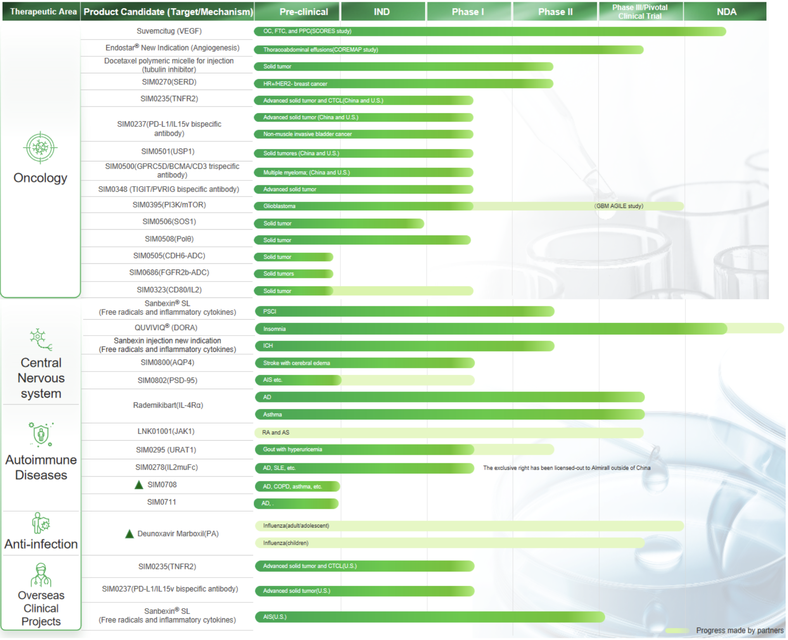
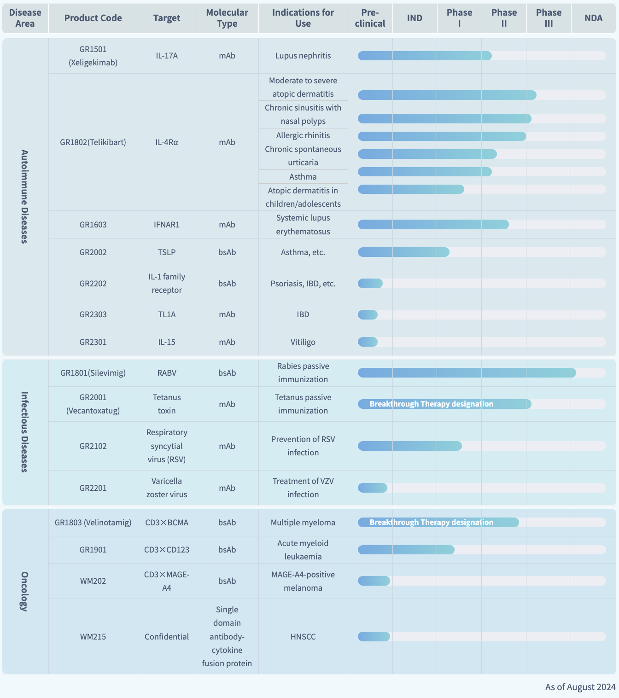
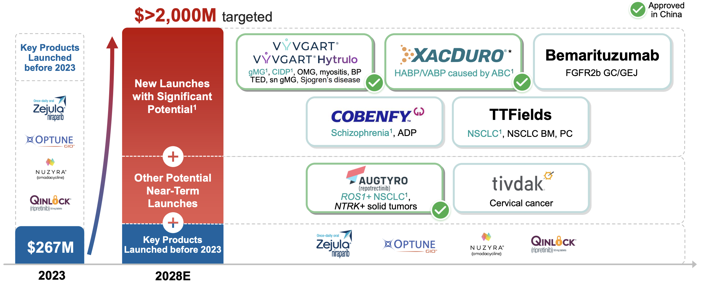
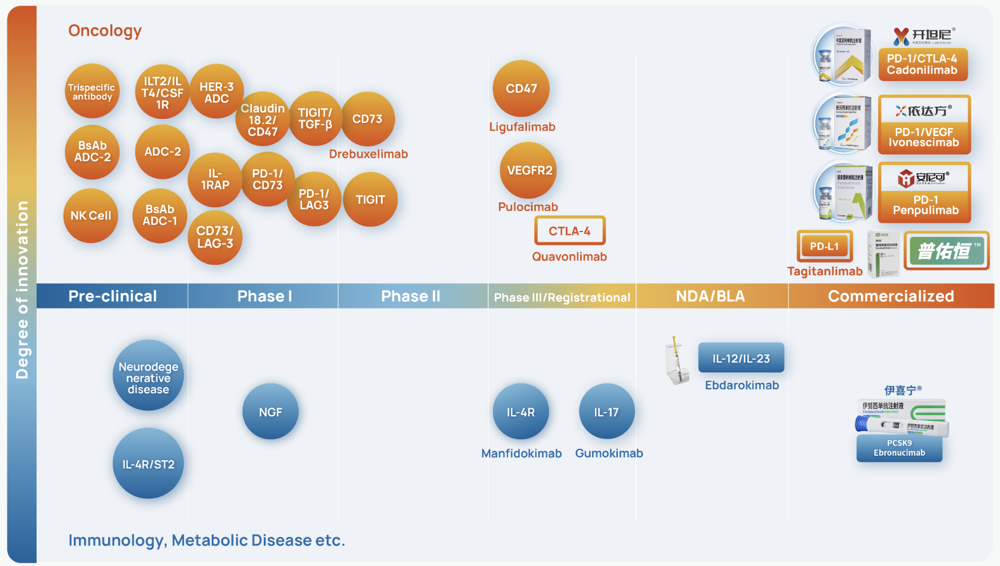
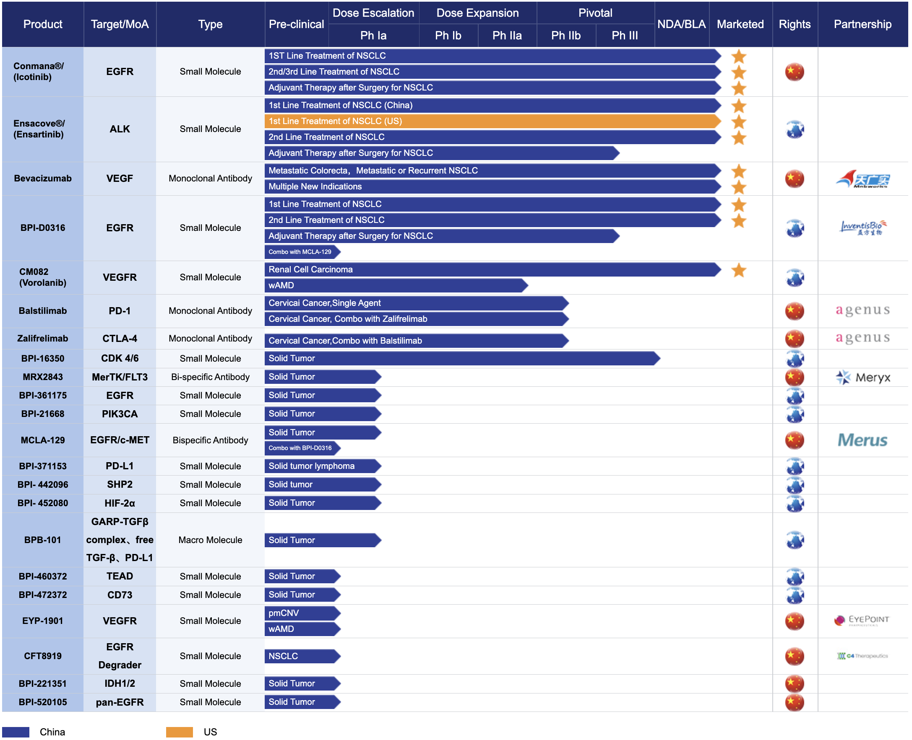

The goal today is to review Chiense biotech companies. A lot has been written about the concept of Chinese biotech, speculation on why they are 'winning', how they are licensing so many drugs to U.S. based companies, and general discussion about what it means for U.S. biotech. [The Economist](https://www.economist.com/business/2025/02/16/its-not-just-ai-chinas-medicines-are-surprising-the-world-too), [Wall St. Journal](https://www.wsj.com/health/pharma/the-drug-industry-is-having-its-own-deepseek-moment-68589d70), [CNN](https://www.cnn.com/2025/02/21/business/video/china-biotech-akeso-cancer-drug-ivonescimab-digvid), [Biopharma Dive](https://www.biopharmadive.com/news/biotech-us-china-competition-drug-deals/737543/), [Timmerman Report](https://timmermanreport.com/2025/01/china-is-here-to-stay-as-a-leader-on-the-global-biotech-stage/), and [STAT news](https://www.statnews.com/2025/01/15/jpm-conference-biotech-industry-excited-anxious-chinese-biotech-deals/) all had articles within the past month. Biotech is becoming different than many other industries (e.g. tech) where innovation happens in the U.S., and manufacturing gets outsourced to China. Instead, innovation is getting done in China, and molecules are licensed to the U.S. for clinical trials! 

This all comes in the wake of the [Biosecure Act](https://www.science.org/content/article/bill-targeting-chinese-biotechs-worries-u-s-researchers), which prohibits federal funds from going to five specific Chinese companies — BGI, MGI, WuXi Biologics, Wu Xi AppTec, and Complete Genomics — beginning in 2032. 

My opinion on why this topic got a lot of press is that people don't really have a great concept of what Chinese people are like and capable of. China is sort of this nebulous entity that is okay to openly criticize and make fun of due to cultural differences. But the fact is that everyone can do science and the U.S. is not the center of the world. It was kind of obvious in retrospect that Chinese biopharma would catch up? Maybe the reason why no one really noticed is that it wasn't worth taking a look at what they were building. I've never actually seen a 'market map' of Chinese biopharma.

I think the most interesting thing to talk about now are the pipelines. I've been curious about what is out there (and what U.S. BD groups are looking at). I want to know what therapeutic areas China cares about, and what new and creative mechanisms they are exploring (its not all me-toos). 

Today I go over 50+ companies, mostly focused on oncology and I&I, with some obesity. I wasn't comprehensive in describing pipelines but just wanted to highlight interesting molecules and overall trends. If you are interested in the [summary](#general-trends), you can skip to the end, but first we will review individual companies. 

Before we begin, the best news feed on Chinese biotech (by far) is from [Minhua Chu](https://x.com/chuminhua432) on Twitter. Highly recommend following. Here is an overview of [Chinese biotech in 2024](https://www.pharmadj.com/en/article/1878614257145294850) from her and her team. Also disclaimer: I did not look at any clinical data. If these drugs are toxic or don't have efficacy I had no idea when I listed them.

# The Companies

Chinese biotech is much bigger than I thought. Company after company -- you think you've reached the end and then you read another Minhua tweet and its another 20 drug pipeline and then you realize that China never ends.

## Table of Contents

- [Keymed Biosciences](#keymed-biosciences)
- [CSPC Pharmaceuticals Group](#cspc-pharmaceuticals-group)
- [BeiGene](#BeiGene)
- [Kelun Biotech](#kelun-biotech)
- [Duality Bio](#duality-bio)
- [CARsgen](#carsgen)
- [Legend Biotech](#legend-biotech)
- [Shanghai Pharma Biotherapeutics](#shanghai-pharma-biotherapeutics)
- [Lepu Biopharma](#lepu-biopharma)
- [Fosun Pharma](#fosun-pharma)
- [Zhejiang Medicine](#zhejiang-medicine)
- [Leads Biolabs](#leads-biolabs)
- [Genor Biopharma](#genor-biopharma)
- [RemeGen](#remegen)
- [Simcere](#simcere)
- [Genrix bio](#genrix-bio)
- [Joyo Pharmatech](#joyo-pharmatech)
- [Medshine Discovery](#medshine-discovery)
- [Hansoh Pharma](#hansoh-pharma)
- [VelaVigo](#velavigo)
- [Degron Therapeutics](#degron-therapeutics)
- [Chimagen Biosciences](#chimagen-biosciences)
- [EpimAb](#epimab)
- [Biosion](#biosion)
- [Trinomab](#trinomab)
- [Sciwind Biosciences](#sciwind-biosciences)
- [Hutchmed](#hutchmed)
- [Laekna](#laekna)
- [LaNova Medicines](#lanova-medicines)
- [Regor Therapeutics Group](#regor-therapeutics-group)
- [Curon](#curon)
- [Harbour Biomed](#harbour-biomed)
- [Zai Lab](#zai-lab)
- [Hangzhou Polymed](#hangzhou-polymed)
- [Eccogene](#eccogene)
- [Hengrui](#hengrui)
- [Akeso](#akeso)
- [Genfleet Therapeutics](#genfleet-therapeutics)
- [Huadong Medicine](#huadong-medicine)
- [Hangzhou DAC Biotechnology](#hangzhou-dac-biotechnology)
- [Biokin Pharma](#biokin-pharma)
- [Alphamab](#alphamab)
- [Jemincare Pharmaceutical](#jemincare-pharmaceutical)
- [Mabwell](#mabwell)
- [Highlightll Pharma](#highlightll-pharma)
- [Mabworks Biotech](#mabworks-biotech)
- [FutureGen](#futuregen)
- [Argo Biopharma](#argo-biopharma)
- [Shanghai Bao Pharma](#shanghai-bao-pharma)
- [Ascentage Pharma](#ascentage-pharma)
- [Betta Pharma](#betta-pharma)
- [Medilink Therapeutics](#medilink-therapeutics)
- [Huabo Biopharm](#huabo-biopharm)
- [Innovent](#innovent)

### [Keymed Biosciences](http://en.keymedbio.com/)
- KeyMed is maybe the flagship licensor of assets to the U.S., even earning an Endpoints feature [article](https://endpts.com/how-keymed-steered-the-china-to-us-newco-model-in-biotech/).
- In Jan 2025, they announced a license to [Prolium Biosciences](https://endpts.com/another-us-biotech-emerges-with-drug-candidate-from-china-based-keymed/), a newly incubated RTW company for a CD20 TCE. Terms were $17.5 million upfront and up to $502.5 million in milestones.
- Also in Jan 2025, GSK lead a \$120 mn funding round for [Ouro Medicines](https://endpts.com/with-120m-gsk-allied-ouro-medicines-throws-its-hat-into-burgeoning-tce-ring/), which starts with a BCMA TCE OM336/CM336. Licensing deal terms were \$16 million upfront and \$610 million in milestones.
- Also in Jan 2025, Timberlyne launched with \$180 million and a [CD38](https://endpts.com/another-biotech-scoops-up-asset-from-china-based-keymed-and-nabs-180m/) antibody from Keymed. Terms were $30 million in near-term payments and up to $337.5 million total in milestones, plus 25% stake in the new company.
- In Jul 2024, [Belenos Biosciences](https://endpts.com/orbimed-forms-biotech-with-assets-from-china-based-keymed-enlists-former-biohaven-exec-as-ceo/) emerged as an Orbimed autoimmunity newco with rights to two drugs (CM512 and CM536) with undisclosed MOA. Terms were \$15 million upfront and up to an additional \$170 million milestones, plus a 30% equity stake in the new company.
- AstraZeneca [licensed](https://www.astrazeneca.com/media-centre/press-releases/2023/astrazeneca-enters-license-agreement-with-kym-biosciences-for-cmg901-a-claudin-182-antibody-drug-conjugate.html#!) CMG901, a CLDN18 ADC, in Feb 2023 for \$63 mn upfront and up to \$1.1 bn in milestones. 
- Outside of these deals, Keymed also has a GPC3 TCE, a CDH17 ADC, a GPRC5D TCE, an a-beta antibody, and a CCR8 antibody partnered with Innocare.

### [CSPC Pharmaceuticals Group](https://www.cspc.com.hk/en/global/home.php)
- CSPC is a large pharmaceutical manufacturing company that has subsidiaries doing drug development. 
- Of note, they licensed a CLDN18 ADC ([EO-3021](https://www.oncologypipeline.com/apexonco/claudin182-expression-clouds-elevations-big-reveal)) to Elevation Oncology (\$27 million upfront, up to \$1.148 billion in milestones) and a Nectin 4 ADC ([SYS6002](https://www.globenewswire.com/news-release/2025/02/14/3026580/0/en/CRB-701-SYS6002-A-Next-Generation-Nectin-4-Targeting-ADC-Demonstrates-Encouraging-Safety-and-Broader-Efficacy-in-Phase-1-Study-in-the-US-and-UK-Presented-at-ASCO-GU-2025.html)) to Corbus (\$7.5 million upfront, \$680 million in milesstones)
- [YS2302018](https://endpts.com/astrazeneca-makes-another-cardio-deal-betting-100m-on-china-companys-lipid-drug/) is a preclinical small molecule lipoprotein(a) disruptor that was licensed to AstraZeneca. Terms are \$100 million upfront and up to \$1.9 billion in milestones.
- They have a ROR1 ADC in Ph1 (SYS6005) and an mRNA-LNP-based BCMA CAR-T therapy (SYS6020) that has obtained IND approval in China for multiple myeloma, systemic lupus erythematosus, and myasthenia gravis.

### [BeiGene](https://beigene.com/)
- Basically profitable, with worldwide revenue from their best in class BTKi Zanubrutinib, their PD-1 Tislelizumab, and China rights to a best in class HER2 biparatopic Zanidatamab.
- Its a \$25 billion company by market cap and there is a lot to be excited about in the pipeline. China rights to Tarlatamab, Sonrotoclax, their next gen BCL2i, their new BTK degrader (BGB-16673), TCEs against STEAP1 and GPC3, a panRAS inhibitor, and a PRMT5 inhibitor.   

### [Kelun Biotech](https://en.kelun-biotech.com/)
- Established in 2016 and based in Sichuan. 
- Most notably, Kelun signed a Merck ADC [deal](https://www.merck.com/news/merck-and-kelun-biotech-announce-exclusive-license-and-collaboration-agreement-for-seven-investigational-antibody-drug-conjugate-candidates-for-the-treatment-of-cancer/) worth \$175 million upfront and up to \$9.3 billion in milestones. 
- TROP2-directed ADC sacituzumab tirumotecan (sac-TMT, formerly SKB264/MK-2870) is the furthest along, and just received breakthrough designation in the U.S. in Dec 2024 for non squamous NSCLC with EGFR mutations. Additional partnered assets include MK-3120, a NECTIN4 ADC, and two undisclosed targets (SKB535 and SKB571)
- Kelun also has a B7H3 ADC SKB500 in Ph1 and a CLDN18 ADC SKB315 which was Merck's but they returned rights to Kelun, which is in Ph1.
- Kelun Biotech and Harbour Biomed licensed out assets to a newco in Jan 2025 called Windward bio to develop a TSLP antibody [HBM9378/SKB378](https://www.harbourbiomed.com/news/231.html)

### [Duality Bio](https://www.dualitybiologics.com/)
- Duality Bio was founded in 2020 in Shanghai by John Zhu, a healthcare investor previously at Wuxi Ventures. He did his MBA at Berkeley and PhD at UMass. 
- They have a license with [Avenzo Therapuetics](https://www.businesswire.com/news/home/20250107872148/en) for a EGFR/HER3 ADC. Terms are upfront payment of \$50 million and up to \$1.15 billion in milestones.
- There is a GSK ADC [deal](https://www.prnewswire.com/news-releases/duality-biologics-and-gsk-enter-exclusive-option-agreement-for-a-novel-antibody-drug-conjugate-db-1324-302320152.html) for DB-1324 against an undisclosed target for \$30 million upfront and up to \$975 in milestones.
- Their TOP1i ADC platform has generated ADCs for [HER2](https://investors.biontech.de/news-releases/news-release-details/biontech-and-dualitybio-form-global-strategic-partnership), [TROP-2](https://www.prnewswire.com/news-releases/dualitybio-expands-global-strategic-partnership-with-biontech-to-accelerate-development-of-a-third-antibody-drug-conjugate-therapeutics-for-solid-tumors-301894397.html), [B7H3](https://www.prnewswire.com/news-releases/duality-biologics-and-biontech-presented-positive-interim-data-for-investigational-b7-h3-antibody-drug-conjugate-bnt324db-1311-in-advanced-solid-tumors-at-the-esmo-asia-congress-2024-302324504.html) which are partnered with BioNTech, B7H4 which is partnered with BeiGene, and HER3 and DLL3 which are internal. 
- Finally, they have an interesting immune modulating ADC targeting BDCA2 for SLE (BD-2304). 

### [CARsgen](https://www.carsgen.com/)
- CARsgen specializes in cell therapy 
- Zevor-cel is a BCMA CAR-T launched in China. Btw this was approved based on a single phase 1/2 trial with 14 patients in China. 
- Claudin18.2 CAR-T (Satri-cel) is a Ph2/3 stage product for gastric cancers. Huadong Medicine has partnered with CARsgen for commercialization. Terms are upfront payment of $30 million and milestones up to \$149 million. 
- They also have a GPC3 (CT011) and a GPRC5D (CT071) CAR-T. Additionally, they have several allo-CAR-T programs, for BCMA, CD19/20, and CD38. 
- Founded in 2014 and based in Shanghai. Their CEO Zonghai Li was a former PI at the Shanghai Cancer Institute. 

### [Legend Biotech](https://legendbiotech.com/)
- Legend famously has a CAR-T [partnership](https://www.prnewswire.com/news-releases/janssen-enters-worldwide-collaboration-and-license-agreement-with-chinese-company-legend-biotech-to-develop-investigational-car-t-anti-cancer-therapy-300574740.html) with J&J for cilta-cel (CARVYKTI) that they entered into in 2017. The terms are 50/50% cost-sharing/profit-split, except in Greater China, where Janssen and Legend have a 30/70% cost-sharing/profit-split arrangement. Upfront payment of $350 million, and undisclosed milestone payments. 
- Outside of CARVYKTI, they have a bunch of ongoing Ph1 trials with a CD19/CD20/CD22 trispecific CAR-T, a CD19/GPRC5D bispecific, a GCC targeted colon cancer CAR-T, a DLL3 CAR-T, and a CLDN18.2 targeted cell therapy. They also have allogeneic programs against BCMA, CD19/20, and CD20. 

### [Shanghai Pharma Biotherapeutics](https://www.sphchina.com/main_business/pharmaceutical_R&D.html)
- Huyabio [licensed](https://www.prnewswire.com/news-releases/huyabio-announces-the-exclusive-license-of-the-wee1-inhibitor-from-shanghai-pharmaceuticals-301419236.html) a Wee1 inhibitor in Nov 2021.
- SPHBio acquired research programs of Oncternal Therapeutics in 2019. These include TK216, a first-in-class small molecule inhibiting the biological activity of ETS-family transcription factors, and Cirmtuzumab, a ROR1 antibody. 

### [Lepu Biopharma](https://en.lepubiopharma.com/)
- Arrivent licensed [MRG007](https://endpts.com/oncology-biotech-arrivent-does-another-china-adc-deal-this-time-with-lepu-biopharma/), an ADC for gastrointestinal cancers for \$47 million upfront and up to \$1.16 billion in milestones.
- Owns Shanghai Miracogen EGFR ADC candidate MRG003, which is in pivotal trials in HNSCC. The company also has ADCs targeted at HER2, TF, CD20, GPC3, and CLDN18. 
- In 2019, they [licensed](https://www.kissei.co.jp/e_contents/news/2020/20200327-3561.html) away CG0070, which is CG Oncology's Cretostimogene. 

### [Fosun Pharma](https://www.fosunpharma.com/en/innovate/pipeline.html)
- Fosun pharma is based in Shanghai and was founded in 1994. 
- They are a large mature company and an aggressive in licensor. For example, they made a [deal](https://www.amgen.cn/en/media/amgen_coroperation.html) with Amgen to commercialize Otezla (PDE4 inhibitor) and Parsabiv (calcimimetic) in mainland China
- Their pipeline is filled with me-too molecules. The one somewhat unique mAb is against GARP, a surface molecule on Tregs and receptor for TGFb.

### [Zhejiang Medicine](https://www.zmc.top/en/) (NovoCodex Biopharmaceuticals)
- Started in 1997, Zhejiang Medicine is mostly focused on generics manufacturing.
- The one deal of note in 2023 was for [ARX788](https://ir.ambrx.com/news/news-details/2023/ACE-Breast-02-Pivotal-Phase-3-Study-of-Ambrxs-ARX788-for-the-Treatment-of-HER2-Positive-Metastatic-Breast-Cancer-Achieves-Positive-Results/default.aspx), a HER2 ADC which was licensed to Ambryx in Mar 2023. Unfortunately, this molecule has a lot of ocular [tox](https://www.nature.com/articles/s41392-025-02149-3).

### [Leads Biolabs](https://en.leadsbiolabs.com/)
- [LBL-051] is a trispecific T cell engager was licensed to a newco started by Aditum Bio called [Oblenio Bio](https://endpts.com/joe-jimenezs-latest-aditum-company-lines-up-t-cell-engager-from-china/) in Nov 2024. The terms are \$35 million upfront and \$579 in milestone payments.
- Their PD-L1/4-1BB bispecific is pretty far in clinical development, reaching Ph3 in neuroendocrine carcinomas. They have two TCEs against MUC16 and GPRC5D in Ph1. There is a LAG3 mAb partnered with BeiGene in Ph2. The last interesting one is a PD-1/TGFbR2 fusion protein in Ph1 (LBL-019). 

### [Genor Biopharma](https://www.genorbio.com/)
- A CD20/CD3 TCE they developed, [GB261](https://endpts.com/third-rock-and-arie-belldegruns-firm-come-together-for-cd20-cd3-bispecific-out-of-china/), was licensed to a Third Rock spinout, TRC 2004, in Aug 2024. 
- In Jun 2020, they [licensed](https://investor.g1therapeutics.com/news-releases/news-release-details/g1-therapeutics-and-genor-biopharma-announce-exclusive-license) lerociclib from G1 Therapeutics for commercialization in Asia.
- Interesting products include an EGFR/cMET/cMET trispecific in Ph1/2, a PD-1/VEGF/CTLA-4 trispecific, a PD-L1/CD55 bispecific, a PD-L1/LAG3/LAG3 trispecific, and a CLDN18 TCE. 
- They also have a Humira and a Rituxan biosimilar. 

### [RemeGen](https://www.remegen.com/)
- This company was founded in 2008 and is based in Shandong. Their CEO is Daotian Fu who did his PhD/Postdoc in the U.S. and eventually was a VP at Sanofi. 
- RC18 is a Blys/April fusion protein in several pivotal PhIII trials in China and globally. It is launched in China for SLE, and interestingly just hit the primary in a Ph3 for gMG. 
- RC48 (Disitamab Vedotin) is a HER2 ADC that was [licensed](https://www.businesswire.com/news/home/20210809005208/en/Seagen-and-RemeGen-Announce-Exclusive-Worldwide-License-and-Co-Development-Agreement-for-Disitamab-Vedotin) in Aug 2021 by Seagen (now Pfizer). The deal was for \$200 mn upfront and \$2.4 billion in potential milestones. Unfortunately, Pfizer took a $200m impairment on this one due to "emerging competition."
- RC88 is a Msln ADC in Ph2, RC248 is a DR5 ADC in Ph1, and RC148 PD-1/VEGF bispecific in Ph1.
- They also have a VEGF/FGF fusion protein RC28-E in two pivotal Ph3 trials in China.

### [Simcere](https://en.simcere.com/)
- Simcere recently (Jan 2025) made a [deal]((https://news.abbvie.com/2025-01-13-AbbVie-and-Simcere-Zaiming-Announce-Partnership-to-Develop-a-Novel-Trispecific-Antibody-Candidate-in-Multiple-Myeloma)) with Abbvie for SIM0500, a GPRC5D/BCMA/CD33 trispecific antibody, currently in Phase 1 clinical trials in patients with relapsed or refractory multiple myeloma (MM), in both China and the U.S.
- They have 60 drugs in the pipeline and I have no idea how to evaluate it. Founded in 1995, it is worth 19.5 billion. 

### [Genrix bio](http://www.genrixbio.com/#/)
- This pipeline is pretty interesting. They have an IL-17, Xeligekimab, for LN in Ph2, an IL-4Ra (Telikibart) in 6 clinical trials furthest in Ph3, a IFNAR1 (GR1603) in Ph2, a TSLP (GR2002), a bispecific IL-1 receptor (GR2202), a TL1A (GR2303), and an IL-15 (GR2301) for vitiligo. 
- In infectious disease, Silevimig is a rabies virus bispecific for passive immunization under regulatory review, Vecantoxatug is a tetanus toxin mAb in Ph3, an RSV (GR2102) mAb in Ph1, and a preclinical varicella zoster virus mAb (GR2201).
- They have 3 TCEs against BCMA, CD123, and MAGE-A4, the furthest long of which (Velinotamig) is in Ph2. 
- They are based in Chongqing and founded in 2015.

### Joyo Pharmatech
- They licensed a panRAS inhibitor [ERAS-0015](https://endpts.com/erasca-revamps-pipeline-laying-off-staff-as-it-licenses-cancer-drugs-from-china-and-nabs-160m/) to Erasca for $12.5 million upfront, up to $176.5 million in milestones, and royalties. 

### Medshine Discovery 
- Parent is [Huapont Pharmaceuticals](https://en.huapont.cn/)
- They licensed a selective KRAS inhibitor [ERAS-4001](https://endpts.com/erasca-revamps-pipeline-laying-off-staff-as-it-licenses-cancer-drugs-from-china-and-nabs-160m/) to Erasca for $10 million upfront and $160 million in milestones. 

### [Hansoh Pharma](https://www.hspharm.com/)
- Hansoh is one of China's largest pharma companies and was founded in 1995. 
- Their most recent high profile deal is a Merck small molecular GLP1 agonist (HS-10535) [deal](https://www.merck.com/news/merck-enters-into-exclusive-global-license-agreement-with-hansoh-pharma-for-investigational-oral-glp-1-receptor-agonist/) in Dec 2024 for \$112 upfront and up to \$1.9 bn in milestones.
- They also have two deals with GSK. There is a B7H3 ADC HS-20093 for osteosarcoma ($185 million upfront, up to \$1.5 bn in milestones and royalties), and HS-20089 for gynaecologic cancers ($85 million upfront, up to \$1.49 bn in milestones plus royalties).

### [VelaVigo](https://www.velavigo.com/)
- Avenzo Therapeutics [licensed](https://avenzotx.com/press-releases/avenzo-therapeutics-provides-corporate-update-and-announces-closing-of-series-a-a-1-financing/) a Nectin4/TROP2 bispecific ADC on Nov 18 2024. 
- They don't have a public pipeline but claim 10 FIC/BIC bispecific/multispecific antibodies and ADCs in development.
- Based in Shanghai, founded in 2021 by Jing Li, their CEO who was formerly at Novartis before coming to Wuxi in China. 

### [Degron Therapeutics](https://www.linkedin.com/company/degrontx/)
- Most notably, Degron signed a Takeda [partnership](https://www.fiercebiotech.com/biotech/takeda-gets-crafty-12b-biobucks-deal-create-molecular-glues-degron) for up to \$1.2 bn in milestones in May 2024. 
- Degron emerged in 2021 from the lab of ShanghaiTech University professor and company co-founder Yong Cang
- They don't seem to have a website, but have five molecular glue programs in oncology and a discovery platform termed GlueXPlorer.

### [Chimagen Biosciences](http://www.chimagen.com/index.html)
- GSK [acquired](https://www.pharmiweb.jobs/article/gsk-enters-agreement-to-acquire-cmg1a46-from-chimagen-biosciences-to-expand-immunology-pipeline) CMG1A46, a clinical-stage dual CD19 and CD20-targeted T cell-engager for \$300 mn upfront. This is for SLE and LN. The deal was done Oct 2024 and was for \$300 mn upfront. 
- Chimagen also has CMG12, CMG06, and CMG10, three trispecific antibodies for cancer. 
- The company is based in Shanghai and was founded in 2016. Their CEO is Zhenhao Zhou who was a practicing physician before starting his career in drug development in China.

### [EpimAb](https://www.epimab.com/en)
- EMB-06 licensed to [Vignette Bio](https://endpts.com/little-known-startup-backed-by-foresite-and-samsara-swings-60m-china-ii-deal/) in Sep 2024. This is for a BCMA targeting TCE for \$60 mn upfront and \$575 in milestones. Vigenette was later acquired by Candid Therapeutics.
- They also have a EGFR/cMET bispecific in Ph2 (EMB-01), a ROR1 TCE in Ph1 (EMB-07), and a PD-L1/OX40 bispecific (EMB-09).
- EpimAb was founded in 2016, and is based in Shanghai. Their CEO Chengbin Wu did his PhD at University of Georgia and postdoc at Harvard Medical School, and took on a fellowship position at Abbvie, before coming back to China for various other companies and starting EpimAb. 

### [Biosion](https://www.biosion.com/)
- Biosion most recently (Nov 2024) did a [deal](https://www.prnewswire.com/news-releases/biosion-announces-exclusive-global-license-agreement-with-aclaris-therapeutics-on-two-potential-first-in-class-and-best-in-class-immunology-assets-302308547.html) with Aclaris Therapeutics for out-license of their long half life TSLP antibody, bosakitug. Biosion receives \$40 million in cash, 19.9% shares of Aclaris common stock, and up to \$900 mn in milestones. Aclaris also receives BSI-502, a TSLP IL-4R bispecific.
- They have additional antibodies against IL-4R, CD40, Siglec-15 ([licensed](https://www.prnewswire.com/news-releases/biosion-licenses-bsi-060t-anti-siglec-15-to-pyxis-oncology-301512711.html) to Pyxis), SIRPa, HER2, and BTN3A1. They have a PD1/ILT4 bispecific in Ph1 as well as a TROP2 ADC, and two other undisclosed bispecifics.
- The company was founded in 2017 by Mingjiu Chen who worked at Abbvie and SDIX after doing a PhD at UT San Antonio.

### [Trinomab](https://www.trinomab.com/en-us)
- Trinomab developed human mAbs primarily for infectious diseases. Their most advanced asset is TNM002, a tetanus prevention antibody that is under regulatory review in China. They have an RSV infection prevention antibody TNM001 in Ph3. TNM005 is in Ph1 for prevention and treatment of VZV infection. TNM006 is in IND stage for hCMV infection (prevention). TNM030 is a Hla toxin antibody for bacterial infectious shock, and TNM039 is a rabies prevention antibody. 
- They also have an NGF antibody for cancer and joint pain (TNM009) in Ph1. 
- The company was founded in 2015 and is headquartered in Zhuhai. Their chairman and CTO, Hualin Xiao, did a PhD at UNC, and was a postdoc, then faculty, then director of the Duke Human Vaccine Institute.

### [Sciwind Biosciences](https://www.sciwindbio.com/)
- Drugs from Sciwind make up the pipeline of the \$410 million series A for [Verdiva](https://www.fiercebiotech.com/biotech/verdiva-launches-410m-series-fund-weekly-dosed-weight-loss-trials-pipeline-growth), a UK based obesity company founded by former Aiolos management. The license terms were $70 million upfront, and up to \$2.4 billion in milestone payments.
- Ecnoglutide (XW004) is the core of the licensing deal, which is a long half-life oral peptide analog of GLP-1. It is ready for Ph2 and apparently is dosable once a week. The drug reached 5.9% pbo. adj. weight loss at 6 weeks from daily dosing in a [Ph1](https://www.prnewswire.com/news-releases/sciwind-biosciences-announces-positive-results-from-phase-1-clinical-trial-of-xw004-an-oral-formulation-of-long-acting-glp-1-analog-ecnoglutide-302042633.html). Also represented in the deal was an oral amylin receptor agonist with once-weekly dosing, and a subcutaneous injectable long acting amylin receptor agonist.
- Sciwind is also developing XW014, a small molecule GLP-1 receptor agonist, and XW017, an injectable GIP receptor agonist. 
- Based in Hangzhou and founded in 2017, their CEO Hai Pan came from Amgen. 

### [Hutchmed](https://www.hutch-med.com/)
- Hutchmed is a China focused oncology company based in Hong Kong and founded in 2000. 
- They have developed Tazemetostat, a China marketed EZH2 inhibitor, Fruquintinib, a China and U.S. marketed VEGFR1,2,3 inhibitor, and Savolitinib a China marketed cMET inhibitor partnered with AstraZeneca.
- Other drugs in the pipeline in human clinical trials include a SYK inhibitor Sovleplenib in registrational trials in China, an FGFR1,2,3 inhibitor (HMPL-453), an IDH1/2 inhibitor (HMPL-306).
- Hutchmed [licensed](https://www.hutch-med.com/fruquintinib-outside-china-partnership-with-takeda/) Fruquintinib to Takeda for $400 million upfront plus up to US$730 million in potential future milestone payments, plus royalties. Hutchmed has also licensed an OX40 antibody (IMG-007) and a BTK inhibitor (IMG-004) to Inmagene for stock and up to \$228 million in milestones, plus royalties.

### [Laekna](https://www.laekna.com/)
- Laekna signed a clinical Collaboration with [Lilly](https://t.co/4iKBFYrOLm) to Develop LAE102, a ActRIIA mAb for obesity in Nov 2024. 
- The company's other lead asset is LAE002 (afuresertib) an AKT inhibitor in Ph3 trials in the U.S. and China. Laekna also has a steroid hormone inhibitor LAE001 in Ph2. 
- The company was founded in 2016 in Shanghai by CEO Chris Lu, who was formerly an executive director at Novartis. 

### [LaNova Medicines](https://www.lanovamedicines.com/en)
- Founded in 2019 in Shanghai by CEO Crystal Qin. She was previously at GSK China and SciClone Pharmaceuticals, a specialty pharmaceuticals company that is based in the U.S. but commercializes products in China.
- They have 6 clinical programs, a CLDN18.2 antibody in Ph3 (LM-302), a CCR8 antibody in Ph2 (LM-108), a SIRPa antibody in Ph1 (LM-101), a GPRC5D ADC in Ph1 (LM-305), a CEACAM5 biparatopic in Ph1 (LM-24C5), and a PD-1/VEGF bispecific in Ph1 (LM-299).
- LM-305 was [licensed](https://www.lanovamedicines.com/en/news-center/press-release/62.html) by AstraZeneca in May 2023 for \$55 million upfront and up to \$545 million in milestones. LM-302 was [licensed](https://www.lanovamedicines.com/en/news-center/press-release/55.html) by Turning Point Therapeutics in May 2022 for \$25 mn upfront and up to \$1 bn in milestones. And famously as of late, Merck did a [deal](https://finance.yahoo.com/news/merck-signs-3-3-billion-120242406.html) for LM-299 for \$588 million upfront + \$2.7 billion in milestone payments. 
- Preclinically, LaNova has a NaPi2b ADC (LM-001), a CDH17 ADC (LM-002), a CEACAM5 ADC (LM-004), a GPC3 ADC (LM-005), a LIV1 ADC (LM-006), and a FRa biparatopic ADC (LM-007).

### [Regor Therapeutics Group](https://regor.com/)
- The lead asset is RGT-075, a an oral once-daily small molecule GLP-1R agonist. Phase 2a topline [results](https://www.prnewswire.com/news-releases/regor-releases-phase-2a-topline-results-for-rgt-075-an-oral-once-daily-small-molecule-glp-1r-agonist-and-begins-phase-2b-study-in-the-us-for-the-treatment-of-obesity-302348153.html) showed 5% pbo. adj. weight loss at 12 weeks, and the drug is beginning its Ph2b in the US.
- Lilly also initiated a [research collaboration](https://investor.lilly.com/news-releases/news-release-details/lilly-and-regor-therapeutics-group-enter-strategic-collaboration) with $50 mn upfront and up to \$1.5 bn in milestones in Dec 2021. 
- In Sept 2024, Genentech acquired Regor's entire portfolio of CDK inhibitors for breast cancer. There are 2 CDK4 drugs (RGT-419B and RGT-587 which is brain penetrant) in Ph1 trials, and Genentech [paid](https://www.prnewswire.com/news-releases/regor-enters-into-a-definitive-purchase-agreement-for-genentech-to-acquire-regors-portfolio-of-next-generation-cdk-inhibitors-for-the-treatment-of-breast-cancer-302262174.html) \$850 mn in cash for them. 
- This company started in Shanghai but has offices in Houston and Cambridge now. Their CEO Xiayang Qiu was a director at Pfizer before starting Regor in 2018.

### [Curon](https://curonbiopharma.com/)
- Curon is relevant because of the acquisition of CN201 by [Merck](https://www.merck.com/news/merck-to-acquire-investigational-b-cell-depletion-therapy-cn201-from-curon-biopharmaceutical/). This drug is in Ph1 trials, and got bought for \$700 mn upfront with up to \$1.3 bn in total deal value with milestones.
- They have one other asset (CN808002) with undisclosed target/MOA in preclinical studies. 
- Zhihong Chen the CEO did his postdoc at Harvard and was a principal scientist at Eisai in Boston before starting Curon in 2018 in Shanghai. 

### [Harbour Biomed](https://www.harbourbiomed.com/)
- This company has a platform "Harbour Mice®" which generates fully human monoclonal antibodies in two heavy and two light chain (H2L2) format. This has allowed them to rapidly develop an antibody based platform that has successfully led to partnerships. 
- The Harbour Mice platform is technically owned by Harbour Biomed's subsidiary Nona Biotech. Nona has made many deals including for HBM9033, MSLN targeted ADC which was [licensed](https://www.harbourbiomed.com/news/217.html) to Pfizer in Dec 2023 for \$53 mn upfront and \$1.05 bn in potential milestones, with Moderna, who [paid](https://www.fiercebiotech.com/biotech/modernas-appetite-antibody-tech-spurs-6m-bet-nonas-heavy-chain-only-platform) \$6 mn upfront and up to \$500 million in milestones for a set of heavy chain sequences for an mRNA immunotherapy product, and with AstraZeneca who paid a \$19 mn upfront and potentially \$575 in milestones for multiple preclinical anti-cancer antibodies. Additional deals with [Lycia Therapeutics](https://nonabio.com/nona-biosciences-announces-collaboration-agreement-with-lycia-therapeutics/), [Candid Therapeutics](https://nonabio.com/nona-biosciences-announces-discovery-collaboration-with-candid-therapeutics-for-next-generation-t-cell-engagers/), [BeiGene](https://nonabio.com/nona-biosciences-expands-antibody-discovery-collaboration-with-beigene/), [Dragonfly Therapeutics](https://nonabio.com/nona-biosciences-enters-into-hcab-based-drug-discovery-collaboration-agreement-with-dragonfly-therapeutics/), [Mythic Therapeutics](https://nonabio.com/nona-biosciences-enters-into-hcab-based-antibody-discovery-collaboration-agreement-with-mythic-therapeutics/), [Umoja Biopharma](https://nonabio.com/nona-biosciences-enters-into-collaboration-agreement-with-umoja-biopharma-to-advance-in-vivo-car-t-cell-therapies/), [Kodiak Sciences](https://nonabio.com/nona-biosciences-and-kodiak-sciences-partner-on-next-generation-antibody-therapies-for-ophthalmic-diseases/), and [OverT Bio](https://nonabio.com/nona-biosciences-enters-strategic-collaboration-with-overt-bio-to-advance-next-generation-cell-therapies-for-solid-tumors/) among others. 
- Within Harbour Biomed itself, they and Kelun Biotech licensed out assets to a newco in Jan 2025 called Windward bio to develop a TSLP antibody [HBM9378/SKB378](https://www.harbourbiomed.com/news/231.html), providing a $45 mn upfront, with \$970 mn in potential milestones. They also out-licensed Batoclimab, a hFcRn antibody being developed by [Immunovant](https://www.fiercebiotech.com/biotech/harbour-ships-phase-3-data-take-lead-over-argenx-jj-and-ucb-chinese-autoimmune-race), and will have first in class rights in China. They also [licensed](https://www.prnewswire.com/news-releases/harbour-biomed-announces-global-out-license-agreement-with-astrazeneca-for-cldn18-2xcd3-bispecific-antibody-hbm7022--301519595.html) out a CLDN18.2/CD3 TCE (HBM7022) to AstraZeneca for \$25 mn upfront and up to \$325 in milestones in Apr 2022. 
- They have an undisclosed TSLP bispecific, a BCMA and a CD19 TCE, and two undisclosed bispecific and trispecifics drugs.
- In oncology, they have a CTLA4 they are calling Porustobart in Ph2, as well as a B7H7 (HBM1020), CCR8 (HBM1022), and a LIFR (HBM9014) for monoclonals. Aside from HBM7022, the CLDN18.2/CD3 TCE, they have a B7H4/4-1BB bispecific (HBM7008) in Ph1, a PD-L1/CD40 bispecific (HBM9027), and a B7H4/CD3 TCE (HBM7004). 
- Their CEO Jingsong Wang is a former attending physician and clinical fellow at Harvard Medical School, and was previously the head of China R&D at Sanofi. Their CSO Yiping Rong got his PhD from Case Western and worked at Sanofi, J&J, and Roche before joining Harbour Biomed. 

### [Zai Lab](https://www.zailaboratory.com/), [investor presentation](https://ir.zailaboratory.com/static-files/bb884b32-7a41-485f-9821-eea890ec74f6)
- Business model is licensing China rights for big approved drugs. They run registrational trials, and market these medications that often are already approved elsewhere, for China
- Examples include the Parp inhibitor niraparib, approved in the U.S. and mainland China for GBM, tumor treating fields, approved in the U.S. and mainland China for GBM, Repotrectinib, a TRK/ROS1 inhibitor approved for NSCLC, Vyvgart (efgartigimod) for various I&I indications, KarXT for schizophrenia, Bemarituzumab for gastric cancers expressing FGFR2b, and tisotumab-vedotin (TIVDAK) a TF targeted ADC for cervical cancer. 

Other interesting assets include:
- ZL-1310 a DLL3 ADC in Ph1
- ZL-1503, and IL-13/31 bispecific with preclinical data
- VL-6301, a ROR1 ADC ready for Ph1
- They trade on the NASDAQ as \$ZLAB, at a market cap of ~\$3.5 bn

### [Hangzhou Polymed](https://www.polymedbiopharma.com/en)
- Photys Therapeutics, which raised a \$75 mn series A in 2022 and has nothing else in their platform [licensed](https://www.globenewswire.com/news-release/2025/02/20/3029603/0/en/Photys-Therapeutics-Enters-into-Exclusive-License-Agreement-with-Polymed-for-Phase-1-Ready-IRAK4-Degrader-Furthering-its-Proximity-based-Pipeline-and-Mission.html) a Ph1 ready IRAK4 degrader from Polymed on Feb 20 2025.
- Polymed has two other assets in their pipeline with undisclosed target or indication. Its a small company which raised money in 2022. Their CEO is Jason S. Xiang who started his career at Wyeth as a medicinal chemist.

### [Eccogene](https://www.eccogene.com/)
- Most famously, they executed a [deal](https://www.astrazeneca.com/media-centre/press-releases/2023/agreement-with-eccogene-for-clinical-stage-glp-1ra.html) with AstraZeneca in November 2023 for their GLP-1 receptor agonist, ECC5004  Eccogene just recently in October 2024, got a \$60 million milestone payment for dosing first patients in a Phase 2b for obesity and type 2 diabetes.
- They also have 2 other programs: ECC4703 a THR-β Agonist and ECC0509, an SSAO Inhibitor. These both recently finished Phase I and were [presented](https://www.eccogene.com/eccogene-announces-positive-phase-1-data-for-oral-thr-%ce%b2-full-agonist-and-oral-ssao-inhibitor-in-late-breaking-poster-presentations-at-the-american-association-for-the-study-of-liver-diseases-aas/) at AASLD last November.
- Their CEO is Jingye Zhou who was head of chemistry at the Eli Lilly China R&D Center, working on diabetes and its complications. Before joining Lilly in 2012, he was an investigator at GSK, working on drug discovery campaigns with DELs. Did his PhD at Brandeis University.
- Eccogene has offices in Cambridge, MA, but is based in Shanghai. 

### [Hengrui](https://www.hengrui.com/en/index.html):
- Hengrui is one of China's largest pharmaceutical companies, with an absolutely massive pipeline. They have >300 ongoing clinical studies for >90 drugs. They've launched 17 drugs, two of them partnered. Founded in 1970.
- They recently were in the news for licensing the drugs used to start [Kailera Therapeutics](https://endpts.com/ron-renauds-new-obesity-biotech-kailera-has-400m-to-go-straight-to-phase-3/), the Atlas, Bain, and RTW company that raised \$400 mn to go straight to Phase III. The most advanced program is HRS9531/KAI-9531, which is an injectible dual GLP-1/GIP receptor agonist that just recently reported Ph1 [data](https://www.kailera.com/press-release/jiangsu-hengrui-pharmaceuticals-and-kailera-therapeutics-report-positive-topline-data-from-8-mg-dose-of-phase-2-obesity-trial-of-glp-1-gip-receptor-dual-agonist-hrs9531/) showing 21.1% pbo. adj. weight loss at 36 weeks. 
- A Hengrui drug was also the basis of [Aiolos](https://endpts.com/jpm24-gsk-to-buy-asthma-biotech-aiolos-bio-for-up-to-1-4b-three-months-after-startup-emerged/), which licensed an ultra-long half life TSLP antibody and got sold to GSK for up to \$1.4 billion. 
- IDEAYA Biosciences has also gotten involved recently, licensing [SHR-4849](https://www.prnewswire.com/news-releases/ideaya-biosciences-enters-exclusive-license-with-hengrui-pharma-for-shr-4849-a-novel-phase-1-dll3-topo-i-payload-adc-targeting-sclc-and-net-solid-tumors-302339847.html) a DLL3 ADC in Ph1.
- Hengrui seemingly has every efficacious mechanism represented in their pipeline or as approved drugs. SGLT2, IL17A, HER2, PD1, PDL1, PARP, CDK4/6, AR, VEGFR, and many more. 
- Of the drugs I found interesting, they have: c-Met ADC SHR-1826, SHR-A2102 a nectin-4 ADC, SHR-1701 ([data](https://www.cell.com/cancer-cell/pdfExtended/S1535-6108(24)00192-2)) a PD-L1/TGF-β bispecific, an EGFR/c-Met bispecific SHR-9839 in Ph1/2, SHR-1501 an IL-15 antibody in Ph1. 
- They also seem to have gotten in trouble with the FDA over manufacturing quality [recently](https://www.fiercepharma.com/pharma/fda-cracks-down-chinas-hengrui-scathing-manufacturing-write) (Jun 2024).

### [Akeso](https://www.akesobio.com/en/) 
- Akeso's big claim to fame is their PD-1/VEGF bispecfic ivonescimab, which is licensed to Summit Therapeutics. This drug famously [beat](https://www.iaslc.org/iaslc-news/press-release/ivonescimab-outperforms-pembrolizumab-phase-3-study-first-line-treatment) PD-1 antibody Pembrolizumab in a head to head trial in NSCLC. Why is it better? They published a [paper](https://www.cell.com/iscience/fulltext/S2589-0042(24)02949-3) in iScience describing the mechanism. 
- Its an \$8 bn market cap company, and similar to Hengrui, their pipeline is absolutely massive. A lot of me-toos for sure, but also bispecific ADCs, an IL-1RAP antibody, trispecific antibodies, and some other interesting combo bispecifics (CLDN18/CD47, TIGIT/TGFb) that will be interesting to follow. 
- They have 5 research centers/manufacturing facilities. They are based in Zhongshan city in Guangzhou.
- Their CSO Baiyong Li did his postdoc in Richard Flavell's lab and proceeded to lead a research group at Pfizer/Crown. Michelle Xia, their CEO, did her PhD/postdoc in the UK and held management roles at Bayer and Crown before founding Akeso in 2012. 

### [Genfleet Therapeutics](http://www.genfleet.com/en)
- Their most recent licensing deal is with Verastem Oncology, who [licensed](https://investor.verastem.com/news-releases/news-release-details/verastem-oncology-exercises-option-early-license-vs-7375-oral) VS-7375, an oral KRAS G12D (ON/OFF) Inhibitor with Ph1 data in China on Jan 14 2025.
- Their other pipeline components include GFS202A a GDF15/IL-6 bispecific antibody, GFH009, a CDK9 inhibitor for AML, Fulzerasib a marketed KRAS G12C inhibitor, GFH276 a panRAS (ON) inhibitor, GFH018 a TGF-β R1 small molecule inhibitor, and GFH312 a RIPK1 inhibitor.
- Based in Zhejiang province, they were founded in 2017. Their CEO Jiong Lan did his postdoc at the University of Rochester and was a project leader at Novartis before joining Hengrui and then co-founding Genfleet. 

### [Huadong Medicine](https://www.eastchinapharm.com/en)
- Huadong was founded in 1993 and is based in Hangzhou.
- They specialize in Chinese medicine, immunosuppressive agents, and endocrine drugs (obesity).
- They are an aggresive in-licensor, most notably of rilonacept (Kiniiksa) to market the drug in China. They also have [licensed](https://www.prnewswire.com/news-releases/provention-bio-and-huadong-announce-strategic-collaboration-to-develop-and-commercialize-prv-3279-in-greater-china-301230331.html) the CD32B and CD79B bispecific DART molecule for SLE from Provention Bio. 
- In cancer they were an early licensor of ELAHERE, the FRa ADC for ovarian cancer, from ImmunoGen/Abbvie. They are building out their ADC capabilities and also have an HPK-1 PROTAC (HDM2006) in the pipeline.
- Their pipeline is most innovative in obesity. Their assets include a GLP-1R/GCGR/FGF21R triple agonist DR10624, developed by their subsidiary Dowell Biological, an oral small molecule GLP-1 receptor agonist HDM1002, and a GLP-1R/GIPR double-target long-action polypeptide agonist HDM1005.

### [Hangzhou DAC Biotechnology](http://www.dacbiotech.com/en/)
- DAC specializes in ADC development. It was founded in 2013 by several senior scientists working in the U.S. who moved back to China. The CEO, Robert Zhao, his postdoc at Cornell/MSK and worked at ImmunoGen for 12 years before his father was diagnosed with cancer and he moved back to China to found DAC. The other management all did their PhDs/postdocs in the U.S., worked at various companies including ImmunoGen, Shire, and Boehringer Ingelheim, before founding DAC
- In 2022, they entered into a [partnership](https://jnjinnovation.com/news/press-releases/hangzhou-dac-biotechnology-announces-a-collaboration-and-license-agreement-with-janssen-for-the-development-of-novel-antibodydrug-conjugates) with J&J to develop 5 ADCs
- Their ADC pipeline is 24 drugs long, and targets several antigens of note including PTK7, MUC16 and SEZ6 which they recently [licensed](https://www.fiercebiotech.com/biotech/aadi-pulls-commercial-preclinical-pivot-buying-adcs-and-selling-approved-drug-reboot) to Aadi Bioscience. 

### [Biokin Pharma](http://en.baili-pharm.com/)
- This company has two subsidiaries: Systimmune which is based in Seattle and responsible for "0 to 1" innovations, and the Baili-Bio R&D center which is responsible for the advanced development stages. Biokin was founded in 2006 by Yi Zhu, who is personally worth \$8.6 billion. The market cap of Biokin is \$77 billion
- Systimmune most recently signed an up to \$8.3 bn [deal](https://www.biospace.com/bms-inks-potential-8-4b-deal-for-systimmune-s-adc-for-lung-breast-cancer) with BMS (\$800 mn upfront). The deal is for BL-B01D1, a first-in-class bi-specific ADC that targets EGFR and HER3.
- The rest of their portfolio includes a EGFRxHER3 bispecific (SI-B001), a PD-1xCTLA-4 bispecific (SI-B003), GNC-038 a tetraspecific T cell engager against CD3 × 41BB × PD-L1 × CD19, and another two of the same format, except replacing CD19 for ROR1 (GNC-035) and EGFRvIII (GNC-039). They also have HER2, TROP2, CD33, and CLDN18 monospecific ADCs.

### [Alphamab](https://www.alphamabonc.com/en/)
- Biparatopic HER2 antibody (KN026) and bispecific HER2 ADC (JSKN003) are highlights of the pipeline. They also have a TROP-2/HER3 ADC (JSKN016). 
- In Jung 2024, Arrivent signed a multi-target ADC [collaboration](https://ir.arrivent.com/news-releases/news-release-details/arrivent-announces-multi-target-adc-collaboration-alphamab) worth up to \$615 million with Alphamab
- The company was founded in 2007 by Ting Xu, who used to be a project leader at Archemix, Serono and Biogen.

### [Jemincare Pharmaceutical](https://www.jemincare.com/?lang=en)
- [RAPT Therapuetics](https://www.globenewswire.com/news-release/2024/12/23/3001125/0/en/RAPT-Therapeutics-and-Shanghai-Jemincare-Pharmaceutical-Announce-Exclusive-License-Agreement-for-Novel-Long-Acting-anti-IgE-Antibody.html) licensing a long half life (YTE) IgE antibody for allergy in Dec 2024 was the most recent news.
- Jemincare also [licensed](https://www.prnewswire.com/news-releases/jemincare-announces-exclusive-license-agreement-with-genentech-to-develop-and-commercialize-novel-oral-androgen-receptor-degrader-301608317.html) an AR degrader to Roche/Genentech in 2022 for a \$60 million upfront.
- Orion Pharma also [licensed](https://www.fiercebiotech.com/biotech/orions-new-focus-sees-it-pay-15m-go-against-vertex-pain-management) a NaV 1.8 blocker for \$16 million upfront. 
- They have a MASP2 antibody for kidney disease (JYB1931). Several other drugs on the pipeline don't have disclosed targets. 

### [Mabwell](https://www.mabwell.com/en/)
- Has developed and commercialized a Denosumab and Adalimumab biosimilar in China. It is on its way to also commercializing 9MW0813, an Eylea biosimilar. 
- They have a suite of ADCs including 9MW2821 (Nectin4 ADC, PhIII), 7MW3711 (B7-H3 ADC, Ph1) for SCLC, and 7MW4911 (CDH17 ADC, preclinical). 
In I&I, they have 9MW1911 (ST2, aka IL-33R, Ph1) for COPD, and 9MW3811 (IL-11, Ph1) for IPF
In ophthalmology, 9MW0211 is a VEGF antibody being developed (in addition to their Eylea biosimilar). 
- Finally, 9MW3011 is their TMPRSS6 antibody for polycythemia vera and iron overload disorders. This was [licensed](https://ir.discmedicine.com/news-releases/news-release-details/disc-medicine-announces-exclusive-licensing-agreement-mabwell) to Disc Medicine in Jan 2023 for \$10 mn upfront and up to \$412 mn in milestones.
- The company was founded in 2017. Their President of R&D, Shuhai Wang, did their postdoc at Stanford and PhD at UTSW. Their CSO, Xin Du, also did their postdoc at UTSW and became an assistant professor at UCSD and Scripps.

### [Highlightll Pharma](https://highlightllpharma.com/en.php)
- Not Highlight, but Highlightll. 
- Their CEO Chris Liang has had a pretty cracked career. PhD in theoretical chemistry at Princeton, director of medicinal chemistry at Sugen, where he invented sunitinib and then at Pharmacia/Pfizer, and Scripps Florida. He also invented ensartinib and vorolanib which are both approved in China.
- Their pipeline centers upon these JAK/TYK2 inhibitors. TLL018 is a highly selective dual TYK2/JAK1 inhibitor in Phase 3 registrational trials in China for RA, AD, CSU, and SLE. They [licensed](https://ir.biohaven.com/news-releases/news-release-details/biohaven-acquires-exclusive-license-oral-brain-penetrant-dual) another brain penetrant TYK2/JAK1 to Biohaven for neuroinflammatory diseases such as Alzheimer’s and Parkinson’s (\$10 million upfront, \$10 million in BHVN equity, and milestones up to $950 million). Finally, they have a skin-restricted TYK2/JAK1/JAK2 inhibitor as a topical agent for dermatological diseases (HL300)
- Outside of this, they have HL500 which is a brain-penetrant LRRK2 inhibitor being developed for Parkinson's, and HL400, a brain-penetrant NLRP3 inhibitor designed using molecular glue technology.

### [Mabworks Biotech](http://www.mab-works.com/en/)
- Feng Li is Chairman and CEO. He founded the company in 2003 after 22 years at Amgen and Genentech. Mabworks is based in Beijing. 
- In Jan 2025, Climb Bio [licensed](https://www.biospace.com/press-releases/climb-bio-expands-pipeline-through-an-exclusive-license-to-develop-and-commercialize-an-antibody-targeting-the-april-pathway-for-iga-nephropathy) MIL116 (now CLYM116), an anti-APRIL mAb for IgAN. \$9 mn upfront, undisclosed milestones.
- Their lead is a 3rd generation ADCC enhanced CD20 antibody MIL62 in registrational trials for PMN, FL, SLE, and NMOSD. They also have a CD20 TCE, as well as a GPRC5D/BCMA dual TCE. In their 'other pipeline', they have a PCSK9 antibody, an ADCC enhanced CLDN18 antibody, a LAG3, and a CD40. All of these have data in humans. 

### [FutureGen](https://www.futuregenbiopharm.com/#/)
- Abbvie [licensed](https://www.prnewswire.com/news-releases/abbvie-and-futuregen-announce-license-agreement-to-develop-next-generation-therapy-for-inflammatory-bowel-disease-302171900.html) a TL1A (FG-M701) for \$150 million upfront and up to \$1.56 billion in milestones
- They also have an ADCC enhanced CLDN18.2 antibody (FG-M108) in PhIII, a CD40-PDL1 bi-specific antibody in Ph1, and a TIGIT/PVRIG/PD-1 trispecific in preclinical. They have two undisclosed ADC programs in PTCL and gastric cancer. 
- Zhaoyu Jin, their CEO, did his PhD at UPenn before joining Genentech as a postdoc/scientist/executive. Same with their general manager Yun Li before leaving to found FutureGen in 2014 in Beijing. 

### [Argo Biopharma](https://www.argobiopharma.com/)
- Argo is the Chinese RNAi company. In 2024, they got a multi-program licensing deal with Novartis done for \$185 mn upfront and potential value of up to \$4.2 billion. This is for 2 cardiovascular assets in Ph1/2.
- Based in Shanghai, it was founded only in April 2021. There are 28 items in the pipeline. [Dongxu Shu](https://www.linkedin.com/in/dongxu-shu-2b556222/?originalSubdomain=cn) and [Patrick Shao](https://www.linkedin.com/in/patrick-shao-b737413/) the founding CEO/CSO respectively used to be directors at Arrowhead/Merck. 

### [Shanghai Bao Pharma](https://www.baopharma.com/)
- This is an interesting company with a diverse product pipeline. They have a recombinant human hyaluronidase termed Hysorptase (Chinese Halozyme soon?). They have an IgG cleaving enzyme they are calling Ricefidase (Seismic/Hansa competitor?). They randomly have a bispecific HER2 antibody. And then they have two reproductive health products: a long half life FSH and a human hCG. They are going public on the HK stock market and have a [612 page](https://www1.hkexnews.hk/app/sehk/2025/107103/documents/sehk25012100901.pdf) filing document.

### [Ascentage Pharma](https://www.ascentage.com/)
- This is a structure based drug design company founded in 2009 by Dajun Yang. He did his PhD at Michigan State and was a professor at Georgetown University before returning to Guangzhou. 
- Ascentage has marketed the 1st 3rd generation BCR-Abl/KIT TKI, Olverembatinib, for CML in China. They also have 2 BCL-2 programs, an MDM2/p53 program, and an interesting FAK/ALK/ROS1 small molecular inhibitor.
- Olverembatinib was also [licensed](https://ascentage.com/ascentage-pharma-signs-option-agreement-with-takeda-to-enter-into-exclusive-global-license-for-olverembatinib-a-third-generation-bcr-abl-tyrosine-kinase-inhibitor-tki/) for world-wide development for Takeda in June 2024 for worldwide development. Terms are \$100 mn upfront, up to \$1.2 bn in milesstones and an equity investment.
- Ascentage is also targeting a U.S. IPO in 2025 at a \$1.75 billion valuation.

### [Betta Pharma](https://www.bettapharma.com/en.php)
- Aside from being a pharmaceutical company in [GTA V](https://gta.fandom.com/wiki/Betta_Pharmaceuticals), Betta has also achieved scale in the real world. It is another aggressive in-licensor of drugs for development in China, including from Merus, C4, and agenus. They also market Icotinib, an EGFR inhibitor, Ensartinib, an ALK inhibitor, Bevacizumab, a VEGF antibody, vorolanib, a VEGFR small molecule inhibitor, and BPI-D0316, a 3rd-gen EGFR-TKI targeting T790M mutations.

### [Medilink Therapeutics](https://www.medilinkthera.com/)
- This Suzhou based company got a spot on 2024 [Endpoints 11](https://endpts.com/endpoints-11-winner-medilink-therapeutics-china-startup-helps-power-the-adc-renaissance/). 
- In Jan 2024, Roche licensed a c-Met-targeting ADC drug, [YL211](https://endpts.com/roche-makes-adc-deal-with-chinas-medilink-therapeutics-for-50m-upfront/) for \$50 million upfront and $1 billion milestones, plus tiered royalties.
- BioNTech also [paid](https://endpts.com/biontech-partners-with-medilink-pays-70m-upfront-to-go-up-against-daiichi-sankyo-in-her3/) \$70 million upfront for a HER3 ADC in Oct 2023. 
- Finally, Zai Lab announced licensing of Medilink's DLL3 ADC [YL212](https://www.globenewswire.com/news-release/2023/04/27/2656222/0/en/Zai-Lab-Announces-Strategic-Partnership-and-Global-License-Agreement-with-MediLink-Therapeutics-for-a-Next-Generation-Antibody-Drug-Conjugate-Program-in-Oncology.html) in Apr 2023. 
- The company also has ADCs for B7H3, NaPi2b, Msln, EGFR, and PDL1.

### [Huabo Biopharm](https://www.huabobio.com/en/product.html)
- Huabo is a subsidiary of Shanghai Huaota Pharmaceuticals established in Jun 2011.
- Their pipeline highlights include HB0025, a PD-L1/VEGF in Ph2, HB0028 a PD-L1/TGF-b in Ph1, HB0052 a CD73 ADC, HOT-1030 a CD137 antibody, HB0043 a dual IL-17A/IL-36 bispecific, and HB0056 a TSLP/IL-11 antibody in Ph1 for Asthma, AD, IPF, or COPD.

### [Innovent](https://www.innoventbio.com/)
- Roche made a deal in Jan 2025 for Innovent's DLL3 targeting ADC [IBI3009](https://endpts.com/roche-circles-back-to-china-biotech-with-80m-deal-for-lung-cancer-adc/) with their TOPO1i platform. \$80 million upfront, up to \$1 billion in milestones. 
- Innovent's pipeline is filled with in licenses of out of China approved products that the company is developing in China.
- The most interesting thing in their pipeline is a dual PD-1/IL-2 bispecific that blocks PD-1 and rejuvenates TILs. This is in Ph2 but Ph1 data was published [here](https://ascopubs.org/doi/10.1200/JCO.2024.42.16_suppl.9562). They have a pretty strong IL-23p19 (Picankibart) which showed >80% PASI 90 at 16 weeks in a registrational Ph3 trial with a 12 week dosing interval. They also have a IL-4r/TSLP bispecific in Ph1 (IBI-3002), amongst many other drugs in the pipeline.
- In obesity, Innovent has Mazdutide, which is a dual GLP-1 and glucagon receptor agonist that beat [Lilly's dulaglutide](https://endpts.com/innovent-says-next-gen-glp-1-drug-from-eli-lilly-beats-top-diabetes-med-in-phase-3-china-study/) head to head in a Phase III.
- Innovent is based in Suzhou and was founded in 2011 by CEO Michael Yu (UCSF postdoc)

# General Trends

### China is a country of abundance. 
1. Out of 11 DLL3 ADCs under development in the world, 9 are from China.
2. China has [20](https://x.com/JacobPlieth/status/1890007000874107007) approved drugs against PD-(L)1
3. Pipelines are massive. Not only a lot of drugs, but a lot of clinical studies for each drug.
4. It's not just the ease of clinical trials. Even the preclinical pipelines are larger and the timelines between company founding and pipeline expansion are much faster. There may be a lower regulatory bar in China than the U.S. as well. Looking at that 14 patient BCMA CAR-T approval that CARsgen got.

### Every major biopharma company is invested in China
1. AstraZeneca [deal](https://www.fiercepharma.com/pharma/astrazeneca-pays-160m-fibrogens-china-unit-regional-rights-roxadustat) with Fibrogen to buy out China rights to HIF-PH inhibitor roxadustat in Feb 2025. This is on top of AstraZeneca's already large [presence](https://careers.astrazeneca.com/china) in China
2. Pfizer [investment](https://endpts.com/pfizer-to-invest-1b-in-china-over-next-five-years-reports/) of $1bn into China in Nov 2024.
3. Takeda is [setting up](https://www.chinadaily.com.cn/a/202501/23/WS67919f86a310a2ab06ea8c4b.html) a China innovation center in Chengdu (Jan 2025).
4. Abbvie, GSK, BMS, Merck, Roche, Takeda, J&J, and Lilly all have licensed assets from Chinese companies. Amgen is perhaps a notable exception, but they have a 20% stake in BeiGene.

### The pharmacology is more complicated

Trispecifics, bispecific ADCs, membrane and soluble target bispecific combinations, multispecific small molecules. Lots of unique strategies.

### Every company can do clinical trials

Maybe a reason why pharma likes to partner (aside from the assets being good and cheap) is that China has tons of human data already, and will continue developing their drugs (getting more clinical data) in China. This is in contrast to U.S. companies, which don't do any clinical development once drugs are licensed out.

### Lot of former American scientists

Lot of former big pharma or former American PhD/postdoc. Pays to be highly technical and able to sprout a new company back home in China with whatever expertise you brought back from the U.S.. Be nice to the seemingly clueless Chinese postdoc in your lab. May be the next leader of a Chinese company licensing you drugs one day.

### Web development expertise needed
Chinese websites need work. Logos suck too. Certainly not paying for marketing.

Landing pages to die for. High Impact (Breakthrough)

# Cool drugs

1. Need to mention PD-1 / VEGF. Ivonescimab developed by Akeso

2. Harbour Biomed had this point that most validated targets in I/O (PD-1/CTLA-4) are part of the B7 family. PD-L1 is B7-H1 and B7-1 is the major ligand mediating CTLA-4 localization. I'm curious how the B7H7 antibody HBM1020 does in trials.

3. Cilta-cel of course 

4. BDCA2 for SLE is a new target I've never heard about. Duality Bio is developing an antibody drug conjugate (BD-2304).

5. PD-1/TGFbR2 fusion protein from Leads Biolabs (LBL-019). Hengrui also has a PD-L1/TGF-b bispecific (SHR-1701) in Ph3.

6. Genrix has a bispecific IL-1 receptor (GR2202) and an IL-15 (GR2301) for vitiligo that I'm interested in. Hengrui also has an IL15 antibody in Ph1 (SHR-1501)

7. Akeso's IL-1RAP antibody

8. I'm interested in Nona Biotech and this Habour Mouse that everyone seems to be using 

9. I just want to follow Systimmune/Biokin's entire portfolio.

10. Mabwell 9MW3811 (IL-11, Ph1) for IPF

11. Highlightll TLL018 is a highly selective dual TYK2/JAK1 inhibitor in Phase 3

12. Shanghai Bao pharma's IgG cleaving enzyme

13. Genfleet's GFS202A a GDF15/IL-6 bispecific antibody

14. Huabo has two interesting drugs: HB0043 a dual IL-17A/IL-36 bispecific, and HB0056 a TSLP/IL-11 antibody in Ph1 for Asthma, AD, IPF, or COPD.

Good job China 🇨🇳.