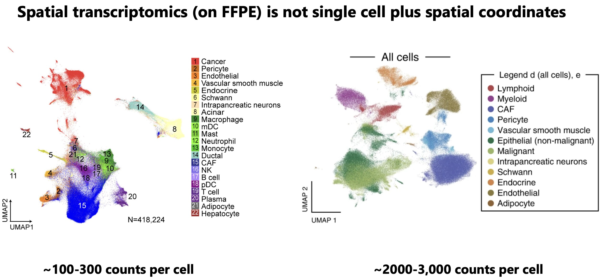

Method of the year in 2024 (proteomics) and 2020 (transcriptomics), spatial -omics has certainly captured the attention of journal editors and alike. Many now believe that integrating -omics with histology is sufficient to land you a CNS paper, and equally many are trying their hardest to actually discover something novel with the tools they have spent hundreds of thousands to acquire. Was the marketing honest? Or was the marketing...marketing?

This post is for people that want to sift through the smokescreen and learn the true experience of using these technologies from a practitioner. Our group had previously written a [review](https://www.cell.com/cancer-cell/abstract/S1535-6108(24)00349-0) on this topic, but understandably, academic publications get neutered. This post is more unfiltered.

Interestingly, the spatial product landscape has undergone major restructuring. All the major platforms got acquired or went bankrupt. Nanostring (and previously CellScape) are now Bruker. Akoya is now Quanterix. Lunaphore is now Bio-Techne. Singular is now PE fodder. Resolve seems shuttered. Curio is now Takara Bio. Vizgen and Ultivue have merged. And 10x Genomics has lost 95% of its market value. Sales are bad. Very sad! Illumina's spatial platform is interesting so much as that it seems to be simplifying sample prep and hopefully decreasing cost by increasing throughput, but it's not for FFPE. The experiments for all platforms are incredibly expensive, typically in the ~\$4k range per slide for around 1 cm^2 of imaging area.

In this post, I specifically cover both spatial transcriptomics and proteomics technologies, and 4 recurrent topics across each assay type:

1. What you can and can't get from a spatial profiling study
2. How useful are the hundreds of new computational methods papers?
3. Who are the companies trying to sell you assays?
4. Best practices for analyzing your spatial data

## Spatial Transcriptomics 

Let me just start by saying that data analysis in spatial -omics is the wild wild west. A very cynical take I've heard is the following: "There are no rules. There is no honesty. There is only creating the figure your PI wants so you can publish the poor quality data you spent hundreds of thousands of dollars and years of your life collecting. It is entirely me-too science where money spent on profiling experiments correlates very well to impact factor."

Satisfyingly, agreeing with this means that there is no need to follow all the spatial methods papers. Luckily for us, our prior can (and should) be that all methods for spatial -omics do not work. The reason why I think this comes down to several factors that are simply very difficult to address:

1. Spatial transcriptomics experiments have very sparse count matrices with low dynamic range. 

RNA as an analyte for spatial -omics in general has several weaknesses:
- RNA is a volatile analyte that degrades over time
- This makes the sample prep complex. Not only do you need to be very careful about being RNAse free, but in order to get decent counts we have often stacked the deck in our favor by using as recently embedded tissue as possible. As a result, studies are not run on true archival FFPE, usually its "FFPE within 2 weeks". This means that spatial transcriptomics is not enabling for large scale studies, or studies on TMAs where the embedded tissue is often very old. In cancer, these large cohorts are necessary to address high levels of heterogeneity. 
- Even when experiments are successful, there are not a lot of counts per cell. See below for a comparison of UMAPs and the difference in quality the extra transcripts from snRNAseq gets you.

Your counts are going to determine how confident you are in the annotation you create. Not only is separation of clusters more difficult, the risk of miscalling cells that don't have lineage marker transcripts (due to poor sensitivity) is much higher. It is also more difficult to call smaller cells like T cells due to transcript contamination and lower expression of lineage defining genes. If you can't annotate many cell types, is the annotation useful? Another consequence of the generally lower count profiles in spatial transcriptomics is that porting a lot of single cell methods to spatial transcriptomics does not have a lot of utility. Things like trajectory inference, unsupervised clustering, and even simple stuff like differential expression, are highly influenced by your counts per cell.

2. Algorithms specifically developed for spatial data such as ligand receptor predictions also do not work very well. Often it's not that the algorithms are written poorly, but simply that the underlying count matrices are not informative enough to make accurate predictions. The databases for ligand and receptor interactions are also poorly curated.

3. Transcript contamination from neighboring cell types (due to both overlap in the z-plane and transcript diffusion) influences not only annotation accuracy, but also reliability of any differential gene expression analysis. For example, cancer cells near fibroblasts express far more fibroblast specific transcripts than cancer cells with fewer local proximity of fibroblasts.

4. Ultimately, a lot of 'correction' approaches are highly sensitive to your calibration. People use single cell or single nucleus datasets as 'anchor cells' to annotate cells, which by themselves have their own transcript biases that do not perfectly correlate with RNA FISH, and their own batch effects which make even generating single cell reference profiles difficult. The actual annotations are highly sensitive to parameter choices and noise introduced by subsequently described limitations.

### Addressing limitations in spatial transcriptomics

People generally have very poor analytic technique. They don't do sensitivity analyses, and depending on the method of analysis you get conflicting results. Simply being honest about the limitations of your spatial analysis puts you in limited company. 

Ideally your workflow enables you to stare at the data for a very long time. Come with a list of hypotheses and use the intensity matrices as a means for quantifying any differences you see. 

These hypotheses can be formed a-priori, or from screening. It is okay to do various DE or colocalization analyses, but results must be taken with a large grain of salt and validated by inspection (staring).

When you do colocalization analyses, I would use a Gaussian kernel density with an intelligently set estimator bandwidth (length scale). Whoever decided that 100 µm was a good cutoff distance for spatial analyses? It should be set according to the length scale of biology that you are investigating (e.g. paracrine interactions at ~100 µm, juxtacrine at <20 µm, gradients around structural landmarks at 1000+ µm).

Anything that you find should be visualized as a sanity check, and confirmed by protein staining. Remember that spatial transcriptomics experiments have many many limitations.

Lastly, there are several papers benchmarking the performance of various spatial imaging platforms (see our [review](https://www.cell.com/cancer-cell/abstract/S1535-6108(24)00349-0)). I think it's safe to say that all of the platforms perform poorly on FFPE tissue and I would try to the best of your ability, to use fresh frozen as much as possible. Increasing molecular plex increases the runtimes of the machine, which in turn degrades the RNA, so we have found that the data quality from smaller panel sizes is actually better than larger panels.

Xenium seems more sensitive than CosMx or MERSCOPE for FFPE. For fresh frozen, the performance should be more comparable. The best performance in my experience has been with [cell lines](https://t.co/8rsAWMLwT3), where the results rival scRNAseq, and it makes sense to push plex as much as possible. Visium HD and some of the offerings from Curio I think can be useful for studying dramatic changes across spatial landmarks with whole transcriptome resolution. However, the lack of single cell resolution can be very limiting for any type of analysis. The Slide-tags / Trekker technology from Curio addresses this but at a significant cost premium.

## Spatial Proteomics

In contrast to spatial transcriptomics, spatial proteomics gives you much higher sensitivity, meaning that you can really trust what you see. The current limitations are due to antibody quality, which limit molecular plex and cost.

In my opinion, this has limited uptake of spatial proteomics, as IHC or mIF experiments can be very cheap (\$100-200 per test) so there is less of a need for expensive high-plex profiling. However, I do think spatial proteomics hits a sweet spot in the mid-plex range where the lower panel size keeps the results interpretable but typically still offers enough richness to identify interesting spatial associations. I also think that a lot of times, people ask for high-plex because they don't know what they are looking for and don't have well defined questions. This is problematic because spatial -omics datasets are noisy enough that they can more or less be manipulated to say whatever you want.

Due to the widespread use and analysis of IHC experiments, there is a robust literature of best practices and community forums that can help troubleshoot. There are efficient softwares like [QuPath](https://qupath.github.io/) which enable viewing and analysis of very large datasets.

Spatial proteomics can be applied on truly archival tissue and thus addresses a major limitation of spatial transcriptomics experiments. Being able to analyze many more tissues gives you the statistical power to analyze many more questions with a single dataset, such as comparing treated vs untreated tissue, or tissues with different genetic backgrounds.

There are still biases that skew results. Peter Sorger has two beautiful papers, one on [BioRxiv](https://pmc.ncbi.nlm.nih.gov/articles/PMC10680601/) and the other in [Cell](https://www.cell.com/cell/pdf/S0092-8674(22)01571-9.pdf) showing the various biases you can have when doing spatial profiling experiments. One of which is that your results can be highly dependent on what tissue block the pathologist decides to section and send for spatial profiling. Another is that a 5 µm slice you send for profiling can often miss important biological signals that happen in a longer length scale than 5 µm.

Sorger and colleagues have also shown that what you can get from a TMA is vastly less interesting than what you get from whole tissue sections due to a large degree of intratumoral heterogeneity.

Segmentation algorithms are also variable in quality, which impacts the quality of intensity matrices that are eventually used for downstream analyses. These algorithms, trained on many manually annotated examples, typically work by identifying nuclei and performing a radial expansion to enclose signal from the entire cell. However, in complex tissues with many cell types and different shapes (due to the geometry of the 5 µm section), the segmentation mask for each cell can be too small or too large, or too circular or too irregular. 

As intensity matrices are often generated by integrated mean/max signal intensity within the segmentation mask, segmentation errors where signal from other cells can contaminate, change the intensity matrices in hard to control for ways. Additionally, signal from cells in the z-plane can also affect the intensity calls.

A variety of platforms have been developed. One that I like a lot is the Lunaphore COMET. The reason being that customization is much easier and cost effective because you can use your own unconjugated antibodies. For alternate platforms like the Akoya Phenocycler, its required that you use their conjugated antibodies (or send your own antibodies to them for conjugation). This is invariably much more expensive and time consuming than the COMET. 

Bruker has two spatial proteomics platforms, CellScape and CosMx, but each suffers from the same conjugation requirement. CosMx in theory can reach very high -plex, but spatial proteomics datasets are already very massive (100+ GB) so I question how feasible it is to analyze that many proteins at once. A couple of groups are working on combined RNA plus protein on the same slide. Again, I think it sounds better than it is, as without customization for specific probes of interest, limited panels can often lack utility for defined questions. The costs for these types of experiments are also often much higher.

The major limiting factor for spatial experiments is throughput. Even getting a small 20-plex protein panel through 100 slides is expensive. For example, COMET charges \$250 per slide for a microfluidic chip that helps with reagent flow through, which in addition to the antibody cost, can reach \$40-50k for such an experiment.

### Addressing limitations in spatial proteomics

Again, much of the meat of analysis is just staring at the marker distribution. There is no substitute for carefully observing staining patterns and with spatial proteomics where there may only be a few dozen markers, there is no excuse for not looking at all of them.

With spatial proteomics, signal intensity is quantitated differently than transcript quantification, and as a result you can't annotate using traditional single cell techniques. A lot more attention needs to be spent on how to convert staining signal into something interpretable. For example, if you look at any paper where they did a spatial proteomics analysis, you'll see a couple things:

1. Many cells are thrown away (the total number of segmented cells is much less than the ones kept for final analysis). This is because some cells don't fall into a cell type bucket, and just get assigned an "unclassified" label. The reason for this is that mIF is very high sensitivity, so you can pick up marker expression in cells due to segmentation error or z-plane overlap. It is common to have CD4+ CD8+ cells simply because those cell types are smaller on average and mostly nucleus, so if two of them are interacting closely, your segmentation algorithm may just call them as one cell. If you see that in the downstream intensity matrix, it can be confusing so many people throw it away. Of course there are other solutions like calling two cell types at the same spot, but it's up to the analyst's choice.

2. Marker distribution is less 'clean'. This is because of segmentation inaccuracy, leading to signal from neighboring cells bleeding into other neighboring cells. It is often the case that markers are not 100% specific or sensitive, and when designing these spatial profiling experiments, people are often over-reliant on a single marker being used to annotate a given cell type. For example, any FOXP3+ cell might be annotated as a regulatory T cell. In scRNAseq, the marker distribution tables look cleaner because the assay sensitivity is lower, so only cells with a lot of expression get picked up, but this is not the case for proteomics.

3. UMAP or TSNE plots always look a bit weird. Intensity distribution for proteomics arbitrarily ranges from 0 to 256, versus in scRNAseq, the dynamic range isn't arbitrarily capped. Unlike scRNAseq, most cells have a low level of intensity that is not automatically background subtracted away. Additionally, the difference between an ultra bright cell or a dimmer cell could just be geometry (e.g. whether the slice captures the whole cell or only the tip of it. Finally, the staining intensity and actual molecule distribution is often non-linear, such that the difference between intensity of 0 and 1 is huge, while the difference between 1 and 256 is smaller. This fact is simply dependent on imaging conditions (e.g. exposure, gain, etc).

One method that works for me is layered annotation based on staining intensity thresholds. For each marker, I manually set a threshold for positivity or negativity based upon the maximum intensity value of a marker in each cell. QuPath has a nice tool where you can simultaneously visualize the positivity threshold and the marker staining intensity so that you can accurately call cells.

Once your thresholds are set, you can annotate your cells in a tree based fashion. For example, your first decision point can be whether the cell is an immune, fibroblast, or epithelial cell. Then, within your immune cells you can use CD3E / CD11b positivity to classify as T cells or myeloid cells. Then, you can use CD4, CD8, and FoxP3 to annotate one layer within your T cells, and so on. I would then also negatively select with independent markers that you know should only be expressed by a certain cell type. For example, I would remove any EpCAM positive cells from my CD4 T cell population. The resulting cells are your 'anchor cells', where you are very confident in the annotation. 

Using those anchor cells, you can annotate the rest of the cells using a clustering or random forest classification algorithm. Inevitably, you will end up with double positive or cells with implausible marker expression. You can either discard those, or annotate doublets by calling two cells at the same location. The goal is to reach a reasonable labeling of cell types and their respective locations. Ideally, you choose one annotation, and confirm any results that you find with a looser or stricter annotation.

Once you have this annotation, I think that the intensity matrices are kind of useless, I would not try to do DE based on protein expression. If you have certain markers, you can further annotate cells as marker positive or negative (e.g. for Ki67). I have always found that doing colocalization analyses based on annotated cells and their locations can be more informative than differential protein abundance. Lastly, it goes without saying but having a pathologist help annotate major features also helps for any type of analysis.
