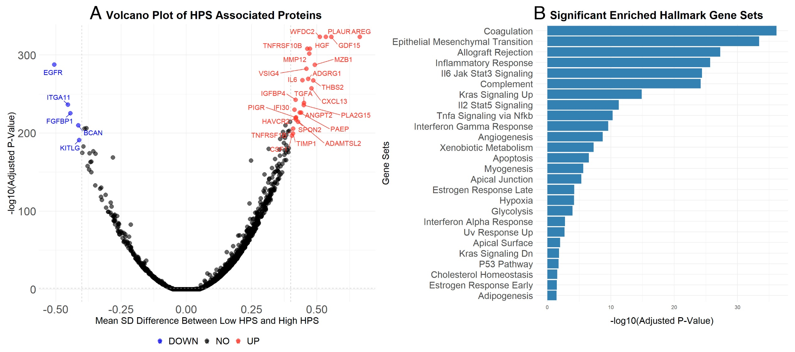

We've made major progress in treating disease and over time nascent indications are evolving into mature ones, saturated with therapies. ___Therapeutic whitespace is shrinking fast.___ Where do you go as a drug developer once the low hanging fruit has been picked? 

Chinese CEO scientists are building some of the most fearless new drug companies (see IL-25 in AD, CD3L1 and IGSF8 for cancer immunotherapy, believing in PD-1/VEGF before no one else). These companies are benefiting from the tailwinds of low cost of capital and resources, abundant hard working PhD talent, and a more industrial culture. In America, we don't have these privileges! While this has seemingly worked beautifully for entrepreneurs in China, there is a fine line between fearless and stupid with high capital costs in the U.S. We need to be precise. 

So, where to drug developer? Venture creation firms have doubled down on asset driven company creation (at the expense of platform builds). When you look at the drugs being developed, it is typically a flavor of the following:

1. Old drug, new indication
2. New engineering to enable an old target
3. New target

Each of these strategies is executed differently, often depending on risk appetite. For example, some groups like Roivant will almost exclusively use the "old drug, new indication" strategy, where they will carefully pick through drugs that are dropped from pipelines or leftover from acquisitions. These assets may already have extensive characterization and even clinical datasets. For de novo drug discovery against old targets, you have groups like the entire Paragon family of companies, developing long half life versions of validated I&I targets. In ATTR cardiomyopathy, acoramidis improves upon tafamidis, and in the FcRn space, Immunovant hopes that IMVT-1402 will improve upon efgartigimod. Finally, new targets are often pursued by new biotech companies with some academic co-founders, or large pharma companies who are able to pursue high-risk high-reward projects. Prometheus with TL1A and Agios with IDH1/2 are the two most prominent examples I can think of.

***

It may be instructive to also understand what is commoditized and not exciting to do. Most importantly, you don't want to be a U.S. biotech company who comes up with ideas like a Chinese company would. It is in some sense, too easy to copy the experts (e.g. Sanofi in I&I, AZ in oncology, etc.) or mine the patent literature for new targets, then apply whatever new state of the art engineering technique to improve upon the TPP. For example:

1. Long half life anything with a pulse
2. For ADCs, making them dual payload, biparatopic/bispecific to enhance internalization
3. Antibody engineering of Fc regions to prevent non-specific internalization or to enhance ADCC
4. Pretty soon, Chinese companies will be able to make any antibody oral
5. Tweaking first generation small molecules to improve potency/PK/ADME profile

***

The following ideas I hope are interesting enough to start discussion. The amount of work necessary to act on each of these though varies greatly and in most cases will require 2-3 years more of academic work before becoming derisked enough to consider spinning up more effort. If any of these are obviously not good ideas, I would love to hear your thoughts as to why. In total, I thought of 19 ideas. 

### Table of Contents

- [Drugging SPP1](#drugging-spp1)
- [FAK degrader](#fak-degrader)
- [STAT3 degrader](#stat3-degrader)
- [Drug development in cancer associated pain](#drug-development-in-cancer-associated-pain)
- [Masked T cell engagers](#masked-t-cell-engagers)
- [CFLAR degrader ADC](#cflar-degrader-adc)
- [Using KRAS inhibitors for RAS addicted pathologies](#using-kras-inhibitors-for-ras-addicted-pathologies)
- [Long half life SC IL-11](#long-half-life-sc-il-11)
- [B cell depleter for AL amyloidosis](#b-cell-depleter-for-al-amyloidosis)
- [Other more speculative ideas](#other-more-speculative-ideas)
  - [FOSL1 degradation](#fosl1-degradation)  
  - [Antibodies against the aging associated proteome](#antibodies-against-the-aging-associated-proteome)  
  - [Long half life IL1RAP antibody](#long-half-life-il1rap-antibody)  
  - [Drug depots for osteoarthritis](#drug-depots-for-osteoarthritis)  
  - [Anti-Siglec 15 for bone disease](#anti-siglec-15-for-bone-disease)  
  - [Anti-Interferon antibody for cancer](#anti-interferon-antibody-for-cancer)  
  - [IgM cleaving enzyme](#igm-cleaving-enzyme)  
  - [p300 inhibitor/degrader for fibrolamellar carcinoma](#p300-inhibitordegrader-for-fibrolamellar-carcinoma)  
  - [Extraskeletal myxoid chondrosarcoma](#extraskeletal-myxoid-chondrosarcoma)  
  - [TG2 degrader for celiac disease](#tg2-degrader-for-celiac-disease)  

#### Drugging SPP1 

SPP1, also known as osteopontin, has emerged as a therapeutic target across cancer, inflammation, and fibrosis. SPP1 marks a "tissue remodeling macrophage", which in instances of wound repair are critical, but in chronic inflammatory settings driven by cancer, chronic injury, or aging, these macrophages can be more harmful.

In tumor contexts, it is produced primarily by both tumor cells and tumor associated macrophages, and can support tumor growth and immune evasion. In multiple different contexts, it has been shown that [genetic](https://elifesciences.org/articles/45313) or [hairpin](https://pmc.ncbi.nlm.nih.gov/articles/PMC11130281/) mediated knockout of SPP1 leads to significantly decreased tumor burden. Bioinformatic studies have also shown that SPP1 is the most [sensitive biomarker](https://www.science.org/doi/10.1126/science.ade2292) for pro-tumor macrophage polarity. 

In fibrosis, SPP1 high macrophages drive myofibroblast accumulation in tissues. In the heart, both [genetic](https://pmc.ncbi.nlm.nih.gov/articles/PMC10448807/#S4) and [siRNA mediated](https://www.biorxiv.org/content/10.1101/2024.08.10.607461v1.full.pdf) deletion of SPP1 reduces fibrosis and rate of atrial fibrillation. In the liver, SPP1 increases fibrosis induced by TGF-beta and targeting SPP1 [reduces fibrosis in vivo](https://pmc.ncbi.nlm.nih.gov/articles/PMC4487727/). 

Perhaps most convincingly, plasma protein abundance of SPP1 is a strong predictor of all sorts of kidney pathology including [acute kidney injury](https://www.nature.com/articles/s41467-024-51304-x), CKD, hypertensive renal disease, dialysis, renal tubulo-interstitial diseases, acute renal failure, and chronic nephritic syndrome. There is also [genetic evidence](https://pmc.ncbi.nlm.nih.gov/articles/PMC9015153/) of an association with chronic kidney disease and [kidney stones](https://pmc.ncbi.nlm.nih.gov/articles/PMC7446165/?utm_source=chatgpt.com).

Plasma protein abundance of SPP1 is also elevated in patients with [vulnerable atherosclerotic plaques](https://www.frontiersin.org/journals/immunology/articles/10.3389/fimmu.2024.1285813/full), hyperparathyroidism, and other disorders of the parathyroid gland. CSF SPP1 tracks [accelerated cognitive decline](https://pubmed.ncbi.nlm.nih.gov/39072932/) in Alzheimer's as well. 

Finally, SPP1 deleted mice also have improved lung compliance in bleomycin IPF models, reduced plaques and inflammatory macrophages in atherosclerosis models, and less kidney fibrosis. SPP1 deleted mice are mostly normal, except with deficiencies in wound healing and [retinal ganglion cell maintenance](https://pmc.ncbi.nlm.nih.gov/articles/PMC9847489/).

Pfizer most recently published [patents](https://patents.google.com/patent/US20110165170A1/en) and also a [feasibility paper](https://pmc.ncbi.nlm.nih.gov/articles/PMC5958109/) arguing that SPP1 neutralization with an antibody format (even potent catalytic formats) is basically impossible, as you would never get robust lasting depletion. The turnover rate of SPP1 is extremely fast, with a half life of just 11 minutes. A PK/PD model estimated that _"weekly administration of a standard antibody at doses as high as 1000mg can only cause ~20% reduction in free osteopontin concentration."_

As a result, Pfizer essentially gave up and likely for good reason. A prototype SPP1 antibody from Astellas dosed at 20 mg/kg IV in RA patients in a trial way back in 2012 didn't do anything (no safety events, but also no changes in biomarkers). SPP1 is pleiotropic and signals through various integrins and CD44 variants. Thus, targeting the ligand rather than the receptor is the only possible strategy.

If you wanted to drug SPP1, it would have to be through an intracellular mechanism. You could get lucky finding a way to drug SPP1 RNA, but I think a really exciting approach is via Sec61 ([Gate Biosciences](https://www.fiercebiotech.com/biotech/lilly-opens-gate-new-small-molecule-drug-class-856m-biobucks-deal)). Sec61 controls protein export in a pore shaped structure, and specific proteins will have signal peptides that 'open up' the pore and enable export out of the cell. Gate has claimed in patent filings to be able to specifically inhibit secretion of certain pathogenic proteins including prion protein, amyloid beta, and VEGFA. While amyloid and VEGFA you could already deplete with an antibody, SPP1 cannot be depleted with an antibody, and I think inhibiting this protein export mechanism could be an elegant solution to the SPP1 target.

Where to go with an SPP1 inhibitor? Given the overwhelming evidence that there is increased plasma SPP1 in all sorts of kidney pathology, it is natural to start there. It may even be tantalizing to think that SPP1 inhibition could make a difference in such a large indication as CKD. Acute kidney injury I think is a reasonable place to start. Some nice preclinical work has identified kidney secreted SPP1 as causal for AKI induced lung injury. If you ran a trial in AKI patients with mortality/event endpoint, I don't think it would be the worst idea in the world. Half of ARDS patients will injure their kidneys, whereas one in five AKI patients will have lung failure. 

#### FAK degrader

The risk profile for a FAK degrader is much lower than SPP1. Defactinib, a FAK inhibitor, is already approved in combination with Avutometinib in LGSOC. I would bet that Verastem also sees approvals in PDAC in combination with chemotherapy, and eventually in combination with various KRAS inhibitors. Some of the leading groups on KRAS inhibition and resistance mechanisms at the Dana Farber and WUSTL have compelling preclinical data that KRAS (or other MAPK inhibition strategies) and FAK inhibition are [synergistic](https://www.science.org/doi/full/10.1126/scitranslmed.ado2402).

FAK and KRAS have complementary resistance mechanisms, where pts resistant to defactinib have increased pERK and tumors resistant to KRAS inhibitors become more mesenchymal and reliant on Rho/Rac signaling pathways, which FAK is necessary for. My own experience in the lab also supports synergy of FAK and KRAS inhibition strategies. 

FAK in combination with a KRAS G12C inhibitor reached 87.5% ORR in 1st line NSCLC: https://meetings.asco.org/abstracts-presentations/239015. When I was at InxMed’s poster for this recent AACR (2025), some pharma scientists thought it was too good to be true. In LGSOC, Verastem’s defactinib and their RAF/MEK clamp Avutometinib had a DCR ~90%, with more significant efficacy in KRAS mutant patients.

It’s an interesting setup where no one outside of InxMed in China and Verastem in the U.S. have FAK inhibitors/degraders. FAK has a significant scaffolding function and PROTACs for FAK are available and effective. Any KRAS driven cancer but especially PDAC I think is a great opportunity. 

FAK is a 125 kDa protein (~1052 amino acids) located in the cytoplasm that localizes to focal adhesions. These focal adhesions link the extracellular matrix with the cytoplasmic cytoskeleton, controlling cell migration and leading to activation of a variety of downstream pathways. Focal adhesion complexes are highly dynamic structures ([sort of like feet while we walk](https://journals.biologists.com/jcs/article/135/20/jcs259089/277381/New-insights-into-FAK-structure-and-function-in)). As you can imagine, these focal adhesions control the mechanical input/output of the cell and have a broad set of influences on cell migration, proliferation, and sensitivity to various drugs.

FAK has 4 domains: a FERM domain which is responsible for autoinhibition, a kinase domain that catalyzes self-phosphorylation when the FERM domain is released, a linker domain and a FAT domain which helps localize FAK to focal adhesions. Defactinib targets this kinase domain and prevents auto-phosphorylation. However, it does not impact many of the important functions of the FAT domain. Kinase dead versions of FAK have been made and still localise to focal adhesions and transmit some traction forces. It is still able to [phosphorylate Akt](https://pubmed.ncbi.nlm.nih.gov/21454615/) and [degrade p53 in the nucleus](https://pubmed.ncbi.nlm.nih.gov/18206965/). FAK degradation is thus likely to provide more potent shutdown of FAK related pro-tumor activity and the _in vitro_ [data](https://onlinelibrary.wiley.com/doi/10.1002/anie.202109237) has borne this out. 

Where to conduct the study? RAS addicted tumors are now targetable and many studies have demonstrated that Rho GTPase and FAK signaling are commonly acute resistance mechanisms. A FAK / KRAS combo study in an indication like PDAC I think would work due to the abundance of preclinical data supporting this strategy, and the emerging data demonstrating the activity of both FAK and KRAS in the disease. The short overall survival of patients may shorten trials and limit the accumulated rate of adverse events stemming from complete FAK shutdown. I had previously done [some work](https://www.biorxiv.org/content/10.1101/2025.02.07.637152v1) and shown that SYDE1 expression is a biomarker for FAK sensitivity. Additional biomarker work with FAK experienced patients could further define the biomarker opportunity.

#### STAT3 degrader

Only recently have there been STAT3 degraders with the potency and PK properties to 'work'. While there is single agent activity in some blood cancers, the activity in solid tumors as evidenced by [KT-333](https://investors.kymeratx.com/news-releases/news-release-details/kymera-therapeutics-presents-new-clinical-data-ongoing-phase-1-0) and data from Shaomeng Wang's [Nature paper](https://www.nature.com/articles/s41586-025-09000-3) indicate that tumor shrinkage is modest at best. Btw -- if you haven't already, check out Shaomeng's research. Time and time again, he has surfaced highly potent degrader chemistry rivaling efforts in pharmaceutical and biotech companies. Ultimately, I think that STAT3 is another target that requires combination therapy, with KRAS being a rational place to start. The toxicity profile is manageable, with stomatitis and arthralgia as the two most common AEs. 

In PDAC, there has been lots of work on STAT3 in pancreatic tumorigenesis from [David Cheresh](https://www.cell.com/cell-reports/fulltext/S2211-1247(25)00781-8), [Nabeel Bardeesy](https://pmc.ncbi.nlm.nih.gov/articles/PMC3693754/), and [Nipun Merchant](https://pmc.ncbi.nlm.nih.gov/articles/PMC10257389/). Recently, work described a [triple combination therapy](https://www.biorxiv.org/content/10.1101/2025.08.04.668325v1.full.pdf) of KRAS, EGFR, and STAT3 with very strong clearance of autochthonous KPC PDAC tumors. There has also been an abundance of adjacent work on the pro-tumor properties of IL-6. While direct IL-6 neutralization with antibodies has not worked, STAT3 is downstream of IL-6 and could offer more potent shut down of the pathway without needing to worry about target engagement of a secreted cytokine. 

Tvardi Therapeutics has a set of STAT3 inhibitors they are trialing in IPF, HCC, and fibrosis related diseases. Vividion Therapeutics has a covalent allosteric STAT3 inhibitor. Kymera has since discontinued KT-333, a STAT3 degrader. There is a funny story about this compound. Right when the molecule was disclosed publicly was when a postdoc from Shaomeng Wang's group was about to give a presentation at AACR 2024. Turns out he used the exact same compound as a less potent control compound. Finally, C4 allegedly has a discovery stage STAT3 degrader program. 

There are two major questions here that made me much less excited than I was originally:
1. Biomarker defined or combo defined population. No way this works in all comers
2. Is the signal in blood cancers commercially viable? The preclinical data was strongest in blood cancers and KT-333 showed partial responses in cHL, NK cell lymphoma, and a few patients with CTCL. Mouse work in ALCL lines showed efficacy, as well as 1 out of 9 AML lines. Without biomarker selection, STAT3 inhibition is clearly not going to beat the standard of care. 

#### Drug development in cancer associated pain

There is a massive indication expansion opportunity for Vertex and other companies that have developed Nav1.8 inhibitors. ~50% of all cancer patients experience pain at some point during their illness, and approximately 70% of patients with advanced, metastatic, or terminal cancer suffer from significant pain (moderate to severe intensity). This can occur due to tumor growth and nearby nerve compression, but also a host of other reasons that the collective field of ___cancer neuroscience___ is now studying. Standard of care here is a physician's choice assortment of NSAIDs, SNRIs/SSRIs (e.g. duloxetine), and acetaminophen. There are even trials of botox for localized pain. Opioids are commonly given for patients with advanced disease or in palliative care, but this is probably not the best option for younger and more fit patients who hope to survive their cancer.

Nav1.8 in particular is probably the best first bet because it already has a drug approval, and there is significant opportunity to improve upon the 1st generation molecule (e.g. Lilly's acquisition of SiteOne). Not all human sensory neurons express Nav1.8, and the initial data with suzetrigine was disappointing. However, other mechanisms like [CB1](https://www.nature.com/articles/s41586-025-08618-7#Sec8) or multispecific molecules (of which several are available for licensing) could also be exciting to test. Suzetrigine is peripherally restricted, and perhaps other molecules that are able to penetrate the CNS may provide deeper pain relief. Nav1.8 inhibition clearly works in some settings, but there are clear levers to pull to optimize the mechanism (better biomarkers, improved potency, testing higher exposures, etc.). 

Sensory nerves are the first to be recruited to sites of injury. This makes sense evolutionarily -- you want it to be painful to disturb a wound. Cancers are wounds that don't heal and so it makes sense that a substantial proportion of nerves recruited to cancers are sensory. Old work has demonstrated that nerves are critical for wound repair, and new work has recapitulated this in the cancer setting. Deinnervation studies where nerves infiltrating a tumor are cut or dissected out significantly decreases tumor growth kinetics. While pain would be the primary endpoint of an analgesic study, any anti-tumor activity at all would be a cherry on top. 

The preclinical models for drug development here are extremely poor. Not only are there significant differences in channel expression across species, there is an emerging understanding that pain differs depending on setting and type of exposure. For example, chronic and acute pain are obviously different, but suzetrigine succeeded in the 'acute' setting of abdominoplasty or bunionectomy, but failed in the also 'acute' setting of lumbosacral radiculopathy. There are no mouse models for cancer associated pain that mimic what is seen in patients. 

However, the approval / study bar is so low that I would think that an enterprising trialist could run a set of academic studies. With the FDA's hand waviness about the lack of a need for animal studies, maybe it is enough to go straight to clinical trials with compounds that have already been trialed in other settings (of which there are an abundance of). The bottomline is that this is a massive opportunity with a very low bar for success and a whole list of compounds that are waiting to find a home. For whatever reason, cancer associated pain is underappreciated as a quality of life factor, and should be considered as an indication for new analgesics.

#### Masked T cell engagers

This is an obvious opportunity that has been derisked by data from CytoMx in EpCAM, and Janux in PSMA. The very clear implication is that this approach works and the 0->1 engineering has been completed. Preclinically validated next generation engineering approaches in combination with novel (for the class) targets I think are definitely worth spawning new private ventures. While investors may not like the spending on indication expansion while the critical trials are ongoing, someone needs to be filling in the next generation pipeline.

What does the landscape look like here?

- Janux has programs in EGFR, PSMA, TROP2, and now CD19
- CytoMx has an EpCAM targeted program
- Vir has programs in HER2, EGFR, and PSMA
- Takeda has programs in EGFR and B7-H3
- Sanofi (through Amunix) has a HER2 targeted molecule
- Merck (in theory through Harpoon) has ITGB6, EpCAM, and TROP2 targeted molecules
- Xilio has a couple, but targets not yet disclosed

This still leaves a compelling set of opportunities for new molecules to be made. For example, you could take any CAR-T study that showed a glimmer of efficacy and convert it to a protease activated TCE format. For example:

1. NECTIN-4 - severe dermatological toxicity
2. GPC3 - hepatotoxicity
3. GD2 - neurotoxicity
4. Mesothelin - off target serositis
5. FOLR1 - expression in the lung
6. CEACAM5 - lung and GI toxicity
7. CA9 - liver/GI

If I had to prioritize, I would pick mesothelin and NECTIN-4 based on known on-target, off-tumor toxicity profile and market size. Late line metastatic pleural mesothelioma both has high mesothelin expression and responds to checkpoint blockade, so I think that would be a good place to start.

#### CFLAR degrader ADC

CFLAR is a novel target that has yet to enter clinical trials. It is a recurrent CRISPR screening hit in vivo and in vitro ([DepMap](https://depmap.org/portal/gene/CFLAR?tab=overview)). The dependency has enrichment in kidney cancer cell lines as well as PDAC. It shows up as a much stronger dependency [in vivo](https://tumorimmunity.org/#/dataportal) than in vitro in monoculture settings. The target can also be enriched in screens in the context of incubation with T cells or NK cells in vitro. 

I have worked with this hit myself in the lab and knockout is indeed very potent for sensitizing cancer cell killing to immune cells. It is relatively well described in CRISPR screening literature and by my latest count, there are maybe 4-5 papers that have identified it as an immune-sensitizing hit. Specifically, it prevents TNFa, Fas, or TRAIL mediated killing by acting as an anti-apoptotic factor. There is indeed normal function in several organs as germline deletion in the skin or liver causes significant immune mediated damage. However, several groups including GSK have found that the apoptotic effect may be more significant in cancer cells than normal epithelial cell lines. 

I see this hit as a target for immune infiltrated but resistant tumors, as well as a strong combination partner for therapies that inflame the tumor microenvironment, like KRAS inhibitors. Non-antigen mediated mechanisms of tumor control by the immune system are necessary for strong regressions, and a target to enable non-antigen mediated tumor control I think would be valuable. Widespread inhibition or depletion of CFLAR is likely to cause irAEs, so I think this is a good candidate for an ADC. A prototype inhibitor molecule was previously developed by University College London and was licensed to Incyte. The latest update was from 2021 so presumably it was deprioritized. 

I think the broader issue with this target is that there is no catalyst incentivizing someone to act. Several pharma companies are theoretically working on the biology of it according to abstracts and other disclosures, but really the next step is a medicinal chemistry exercise. However, why would a chemist want to work on this if the academic interest has mostly dried up (it is no longer novel unfortunately). The major derisking event would be clean safety in higher order species and published anti-tumor efficacy. Now that the most advanced compounds are in Incyte, it is hard to imagine that will happen. 

#### Using KRAS inhibitors for RAS addicted pathologies

The ability to inhibit wild type RAS in a safe and effective manner was recently demonstrated by Revolution Medicines and RMC-6236. At doses high enough to regress tumors, there are an acceptable level of adverse events. This provides hope that lower exposures which may be efficacious against other serious but not as aggressive conditions may also have a safe therapeutic window.

Several have recently commented on the high rate of RAS pathway mutations in [endometriosis](https://pmc.ncbi.nlm.nih.gov/articles/PMC10240146/) and [adenomyosis](https://pmc.ncbi.nlm.nih.gov/articles/PMC12278445/?utm_source=chatgpt.com). [AV malformations](https://www.barrowneuro.org/condition/arteriovenous-malformation-avm/) in the brain/spine are pretty serious and collectively prevalent (~10/100k adults; 300k Americans, 12% of which have symptoms). Legius syndrome, Noonan syndrome, JMML (a rare leukemia in children), and Neurofibromatosis Type 1 are all additional rare but collectively prevalent indications. 

There are probably hundreds of RAS inhibitors in development currently. A select few of them will dominate oncology, but I think there is a niche but compelling opportunity to dominate the non-cancer applications for KRAS inhibitors. A strategy could just be to license whichever doesn't have as compelling shut down of the RAS pathway and thus is uncompetitive in oncology, but has an exquisite safety profile. As the company figures out dosing schedules and PK/PD relationships, it could collect method of use patents as IP protection. Patient advocacy groups and small single arm trials could propel you to fast accelerated approvals. 

Broadly the questions are:
1. What is the therapeutic window needed for efficacy?
2. Will you need lifelong dosing? Is chronic KRAS inhibition safe?
3. Is KRAS the optimal strategy for only somatically mutated patients or is there also efficacy in non-mutated patients? Is MEK or KRAS the right node to intervene at?

#### Long half life SC IL-11

We will see how this mechanism does in IPF from BI's trial (BI 765423). Results should arrive in late 2026 or Q1 2027. 

There is somewhat of a second mover advantage here, where the SC version of BI 765423 will be the exact same antibody and a next generation version could have improved exposure or target an improved epitope. There is all the engineering around making it a bispecific/biparatopic/sweeping antibody that one could imagine doing. The mechanism simply isn't crowded and has many potential indications where it could work. The efficacy bar in IPF specifically is modest and trials read out relatively quickly. 

The biology is becoming well understood. Much of the below is derived from an excellent review on IL-11: https://www.ncbi.nlm.nih.gov/pmc/articles/PMC10754292/, supplemented by additional literature.

IL-11 is a small (19 kDa) cytokine belonging to the IL-6 family that signals in a range of stromal and epithelial cells, in both an autocrine and paracrine fashion, to (1) activate JAK/STAT3 to increase the expression of pro-inflammatory genes, and (2) activate ERK/P90RSK which together inhibits LKB1, activates mTOR, and inhibits GSK3β, to activate epithelial to mesenchymal transition (EMT). 

IL-11 is a major TGF-beta stimulated gene and is thought to be a major effector of the fibrotic effects of TGF-beta. Overall, these signaling events drive a program of mesenchymal gene expression and inflammation across cell types that results in fibrosis and diminished tissue function through age and in response to acute injury. 

In healthy human physiology, IL-11 is involved in:

1.  Hematopoiesis: It supports the production of platelets (thrombopoiesis) by promoting the proliferation and maturation of megakaryocytes. It is involved in recovery from thrombocytopenia, particularly following chemotherapy. The functions of Il11 on hematopoiesis in mice is redundant with other signaling factors, however. Mice with germline knockout of Il11 have normal blood counts.

2.  Reproduction: IL-11 plays a role in embryonic implantation and trophoblast invasion. Female mice with germline deletion of Il11 or Il11ra1 are infertile. 

3.  Bone development: individuals with compound heterozygous LOF mutations of IL11RA are well described. These people can have craniosynostosis, conductive hearing loss, maxillary hypoplasia, exophthalmos, delayed tooth eruption, scoliosis and joint laxity,

In the general population IL11 and IL11RA have passively accumulated LOF mutations. 

In 2019, two manuscripts were published at the same time describing a role for IL11 in lung fibrosis. One [manuscript](https://www.science.org/doi/10.1126/scitranslmed.aaw1237?url_ver=Z39.88-2003&rfr_id=ori:rid:crossref.org&rfr_dat=cr_pub%20%200pubmed) from Stuart Cook on IPF followed on from work in cardiac studies, whereas the identification of IL11 as a driver of lung fibrosis in Hermansky Pudlak syndrome (HPS; genetic disorder that often causes lung scarring) in a separate [manuscript](https://pubmed.ncbi.nlm.nih.gov/31216486/) came about from unbiased RNA-seq screening. Together these studies identified IL11 secretion from stromal cells as an important for fibrosis in patients with IPF, in lung organoids from patients with HPS and in mice with bleomycin-induced lung fibrosis. Following work has shown that an anti-IL11 mAb could prevent and reverse lung pathology.

A number of other publications have validated and extended findings: 

1. 2020, IL11/ERK signaling is important for senescence of lung cells and fibroblast-specific expression of IL11 causes lung fibro-inflammation
2. 2021, IL11 expression is associated with lung fibrosis in patients with rheumatoid arthritis, replication of IL11 up-regulation and its effects in bleomycin injury and HPS
3. 2022, nanoparticle delivery of siRNA against Il11 reduces lung fibrosis in the bleomycin mouse model, IL11 contributes to pulmonary artery remodeling and fibrosis in pulmonary hypertension, therapeutic targeting of IL11 reduces lung fibro-inflammation due to silica particle inhalation
4. 2023, anti-IL11 reduces emphysematous disease in a mouse model of Marfan syndrome, IL11 disrupts alveolar epithelial cell repair functions by causing EMT, IL11 is elevated in interstitial lung disease in systemic sclerosis and IL11 contributes to lung fibrosis in patients with SARS-COV-2

Beyond IPF, kidney disease is another massive indication waiting for new biologic mechanisms.

Regardless of the initial cause, renal fibrosis is the final common pathway leading to end-stage renal disease (ESRD). It involves excessive accumulation of extracellular matrix (ECM) proteins, such as collagen, leading to scarring and loss of functional nephrons. Myofibroblasts are the primary effector cells producing ECM components in fibrosis, and IL-11 plays an important role in converting fibroblasts into myofibroblasts.

IL-11 is upregulated in the kidney in mouse models of Alport Syndrome (genetic kidney disease) and Chronic Kidney Disease. In both settings, the kidney can be regenerated by anti-IL-11 therapy with a monoclonal antibody. Injection of rmIL-11 and transgenic expression of rmIL-11 in fibroblasts, causes renal fibrosis. Mice deleted for Il11ra1 are protected from renal fibrosis and impairment following toxin-induced kidney injury. 

IL11 levels are elevated in the kidney in response to varied injuries that include diabetes, hypertension, ischemia, toxins, infective agents (bacterial and viral), preeclampsia and obstructive nephropathy. In addition, urinary IL11 levels are increased in patients with nephritis and IL11 is highly upregulated in the kidneys of patients with end stage renal failure.

It is worth mentioning that systemic IL-11 blockade could have additional features beyond their intended activity in the indication of choice. 
In a landmark study, IL-11 blockade extended the lifespan of normal mice by 25%. Authors noted metabolic mechanisms. Preclinical studies have demonstrated that IL-11 has anti-tumor activity.

#### B cell depleter for AL amyloidosis

This looks like a cancer in terms of mortality. Amyloid produced by a pathogenic B cell clone deposits in the kidney and heart, causing tissue damage. There are 30-40k patients in the U.S., mostly older >60 years of age. Heart related mortality is the primary cause of death, and 5yr OS is ~50%.

[CAR-T](https://ascopubs.org/doi/10.1200/JCO-24-02252) works very well (>90% CR rate), but patients are often too frail for lymphodepletion and to handle CAR-T associated toxicities. Daratumumab and other B cell antibody depletion approaches are efficacious but efficacy can be improved. Hematologic CR rate is 50-60%. Teclistamab, a BCMA TCE was [trialed](https://www.nature.com/articles/s41408-023-00950-3?utm_source=chatgpt.com) in 7 patients and while all responded quickly, there were several serious infections even with prophylaxis. I think there is likely room to improve upon this profile and run more rigorous trials with an improved compound. For example, if I were a TCE company (specifically CD38), you could make a serious argument for replacing chemotherapy and other aggressive treatment regimens used in the first line. The trials could be quick to run, as patients with advanced cardiac involvement have OS of just 4 months. There are validated biomarkers of response that can be used as surrogate endpoints as well.

AZ and Prothena were interested and both had amyloid binding antibodies that failed. For a group with a CD38 antibody without an indication to start in, AL amyloidosis could be a nice opportunity to collect POC data and an approval, while conducting trials for larger indications.

### Other more speculative ideas

#### FOSL1 degradation

This one is significantly less derisked than FAK or STAT3. Additionally, this approach requires you to be palatable with combination activity as a major source of value. I'm skeptical of any single agent activity. 

FOSL1, encoded by the protein FRA-1, is a transcription factor that coordinates with JUN family members to form the AP-1 transcription factor complex. Lots of work has nominated this complex as a key regulator of transcriptional reprogramming in cancer downstream of oncogenic signaling pathways. Deleting the AP-1 complex removes the 'last line of defense' as this strategy is robust to various upstream ways of becoming drug resistant (e.g. pocket mutations, oncogene amplification, etc.). It is believed that FOSL1 dependency may be greater in conventionally drug resistant tumors and cells. 

FOSL1 is a strongly selective dependency in [DepMap](https://depmap.org/portal/gene/FOSL1?tab=overview) with strongest enrichment in PDAC, and additional enrichment in HNSCC. Drug resistant cells in [KRAS mutant lung/pancreas cancers](https://www.nature.com/articles/ncomms14294) as well as basal-like breast cancer (e.g. TNBC) also seem to have enhanced dependency.

This is a truly novel target that has not seen clinical development. However, degrading FRA-1 with a PROTAC strategy is [possible](https://www.sciencedirect.com/science/article/abs/pii/S0045206824005182?via%3Dihub) and should be tested across larger panels of tumor xenografts.

#### Antibodies against the aging associated proteome

This one is more of a thought experiment than idea for drug development. The premise is that we know that many proteins become progressively enriched in serum as we age. The 'blood proteome' can discriminate younger versus older individuals ([below](https://pmc.ncbi.nlm.nih.gov/articles/PMC11230312/)) and plasma exchange (e.g. giving old people the blood of young people) can have therapeutic benefits. This is not to say that we should be wholesale replacing blood as a therapy, but there are likely specific factors with strong association with disease that should be removed.

Thus, one instructive exercise is to go through lists of proteins that are secreted and detectable in serum, and how they might differ in younger vs older, or simply diseased versus healthy individuals. These should be targetable by antibodies and thus are already 'targetable', and are enriched for various hormones, cytokines, and other molecules that have a role in pathology. The UKBB proteomics [web browser](https://proteome-phenome-atlas.com/) is one tool that is easy to use and covers more than 50k individuals with various ages and pathology, but various papers like the one linked above will also have their own lists.

These lists often converge on the same set of proteins including various collagens, matrix metalloproteinases, coagulation factors, growth factors, and inflammatory proteins. The difficult part is disentangling causation versus correlation and how feasible a given target is for targeting when taking into account their normal function, resynthesis rate, binder availability, etc.. For example, GDF15 shows up on almost every 'aging proteome' because it is a stress responsive hormone. AREG is often recurrent because it is induced by cellular senescence but likely isn't a good target because it may even help counteract senescence induced changes. CXCL13 is essential for formation of immune aggregates that help with normal humoral immunity but also reflects the increase in immune aggregate structures observed in aging tissues.

One in particular that I think is interesting is suPAR. This protein has a strong association with certain forms of kidney disease and has a characterized mechanism of interfering with [podocyte foot processes](https://pubmed.ncbi.nlm.nih.gov/21804539/). [Walden Biosciences](https://www.waldenbiosciences.com/) has an antibody program in clinical development for this mechanism ([WAL0921](https://clinicaltrials.gov/study/NCT06466135)) and should have a readout sometime in 1H 2026.

#### Long half life IL1RAP antibody 

While I was writing this, Otsuka [licensed](https://www.fiercebiotech.com/biotech/otsuka-inks-613m-deal-swedish-biotechs-autoimmune-antibodies) a IL1RAP antibody from Cantargia. Aside from them and Sanofi, there are no others competing in this space. 

IL1RAP is a coreceptor for IL-1, IL-33, IL-36, and in some instances IL-18. Inhibiting the protein can have broader activity than a single cytokine, which is valuable in poorly understood and multifactorial immunological indications like HS and [systemic sclerosis](https://ard.bmj.com/content/83/9/1156). In HS in particular, IL-1 inhibition has been derisked by the success of lutikizumab, Abbvie's IL-1a/b bispecific antibody. Sanofi showed efficacy of IL1RAP blockade in the imiquimod-induced skin inflammation mouse model.

There is also rationale for development in other innate or neutrophil driven lung diseases like non-T2 COPD or non-T2 asthma (e.g. neutrophilic and mixed granulocytic asthma). Mechanistically, IL-1 recruits myeloid cells like monocytes and neutrophils by increasing production of IL-8. IL-33 is an alarmin that activates Type 2 immunity and has shown glimmers of efficacy in certain subgroups of COPD. IL-36 also promotes neutrophil chemotaxis. Here is some preclinical data describing the [importance of IL-1](https://rupress.org/jem/article/209/8/1505/53754/Interleukin-1-controls-allergic-sensitization-to) in asthma model systems. Neutrophilic inflammation in asthma and in COPD is relatively steroid-resistant, and has been overshadowed by therapy targeting the T2 subtype. The spectacular launch of Verona's PDE3/4 inhibitor in COPD shows that there is certainly a market for new mechanisms.

#### Drug depots for osteoarthritis

Osteoarthritis is one of the most debilitating consequences of growing older. It is a multifactorial disease of both mechanical wear and tear and inflammation, which commonly leads to disability. Therapy is essentially only behavioral (e.g. diet and exercise), while pharmacologic treatment is limited to oral/topical NSAIDS or intraarticular steroid injections. The efficacy burden is high because you need to address multiple issues (e.g. structural improvement, pain, inflammation) so there are no approved therapies.

If we believe the premise that single drugs are unlikely to work, what do we do? One idea is to borrow the concept of a drug eluting insert from ophthalmology, which is capable of just continuously secreting single or multiple drugs. If one were able to develop a twice annual fully degradable gel which elutes drug over the course of months, who says no?

Something like this could have many forms -- a gel, a matrix binding coating, microparticles, or even foam. Of course you want to be able to resist joint or shear stress, as the mechanical stress in the knee is much more significant than the eye. Triamcinolone acetonide extended-release (Zilretta) is an FDA approved proof of concept, which is essentially a PLGA microsphere that elutes steroids. This was developed by Flexion Therapeutics all the way back in 2007. 20 years later, there are several ways this could be improved upon. 

What drug substance to put in the depot? With local delivery, we can solve for PK and systemic safety issues that ruined several promising programs and also multiplex several mechanisms at once to push efficacy across multiple clinical endpoints.

1. FGF18 is one of the few mechanisms that has consistently shown structural benefits in an otherwise intractable disease. Several groups are even trying more sophisticated strategies like FGF18 gene therapy. While there are [robust cartilage thickness improvements](https://ard.bmj.com/content/80/8/1062), there was no effect on osteoarthritis pain. 
2. [Lorecivant](https://www.sciencedirect.com/science/article/pii/S1063458421000406?via%3Dihub), the Wnt pathway modulator developed by Samumed narrowly hit on both pain and function endpoints versus placebo using intraarticular injections.
3. As described by [this Nature paper](https://www.nature.com/articles/s41586-023-06888-7), what about Nav1.7 inhibition which seems to have an effect on both pain and OA inflammation?
4. Cathepsin K class ran into on-target off tissue toxicities from systemic administration, but had [robust improvements](https://www.acpjournals.org/doi/10.7326/M19-0675) on bone and cartilage preservation but not pain.

#### Anti-Siglec 15 for bone disease

First, a primer on bone disease.

Bone is constantly remodeling. Osteoblasts build up bone mass and osteoclasts dissolve it. Osteocytes secrete paracrine factors and express mechanosensors that can help direct relative activity of osteoblasts and osteoclasts. 

Osteoblasts and mesenchymal stem cell derived and osteoclasts are actually derived from hematopoietic stem cells (macrophage/monocyte precursors). Osteoclastogenesis refers to the differentiation of macrophage/monocyte precursors into the multinucleated cells that are osteoclasts. 

The major targets in this space, sclerostin, RANKL, and alendronate all play a role in modulating the balance of osteoblasts and osteoclasts. Sclerostin antibodies inhibit the inhibitory effect of sclerostin on the Wnt/beta catenin pathway in osteoblasts and the bone resorption effects it has on osteoclasts. RANKL antibodies prevent RANKL interaction with RANK receptors expressed on osteoclasts and osteoclast precursors which contribute to their persistence and function. Alendronate binds intracellular farnesyl pyrophosphate synthase (FDPS), an essential pathway in osteoclasts. 

Siglec 15 is a RANKL cofactor for osteoclast biogenesis. RANKL stimulation during osteoclastogenesis strongly upregulates siglec 15, which enhances cell–cell fusion of osteoclast precursors and increases bone resorption capacity. RANKL inhibition stops formation of osteoclasts, siglec 15 inhibition could further inhibit the activation and function of residual osteoclasts.

Siglec 15 knockout mice have high bone mass. Two papers have been published independently finding that Siglec 15 blockade using an antibody can induce bone formation, one in a model of [osteogenesis imperfecta](https://onlinelibrary.wiley.com/doi/10.1002/jor.70019) and another in [normal rats](https://www.sciencedirect.com/science/article/abs/pii/S8756328218302941). I found these studies when NextCure [PR'ed](https://ir.nextcure.com/news-releases/news-release-details/preclinical-data-demonstrate-anti-siglec-15-treatment-improves) preclinical data from the osteogenesis imperfecta study.  

You could imagine developing a first in class antibody in osteoporosis, Paget's disease, juvenile osteoporosis, or other bone diseases where you have overactive breakdown via osteoclasts. The RANKL class with Prolia and Xgeva is a major blockbuster indication with efficacy but known safety issues including hypocalcemia and rebound fractures after stopping. There is certainly room for another mechanism.

#### Anti- Interferon antibody for cancer

Counter intuitive, but there has been enough preclinical and clinical data from Andy Minn, Aaron Ring, and Ryan Chow among others to show that it is at least worth trying. 

Prolonged interferon signaling in cancer cells allows them to [resist clearance by T cells](https://pubmed.ncbi.nlm.nih.gov/36646856/).

Anti-interferon antibodies are [detected](https://www.nature.com/articles/s41586-025-09188-4) in patients with productive anti-tumor immune responses in patients and in mouse models.

Interferon pathway mutations are common in patients with primary or acquired resistance to immune checkpoint blockade and interferon pathway components are often [recurrent hits](https://www.sciencedirect.com/science/article/pii/S1535610823000417?via%3Dihub) in immune anchored CRISPR screens.

There is likely no single agent activity for a Type I interferon blocking antibody, but in combination with a checkpoint inhibitor perhaps you see more durable responses. There are molecules developed for lupus that could be repurposed directly, but novel bispecific strategies could also be developed preclinically.

#### IgM cleaving enzyme

IgM typically exists as a pentamer in the bloodstream with a molecular weight of ~900 kDa. This large size limits diffusion into tissues , so it primarily functions in the bloodstream. The large size also makes IgM highly effective at activating the classical pathway of the complement system, which leads to the lysis of pathogens or infected cells. This activation is because of its ability to bind multiple complement proteins simultaneously due to its pentameric structure. Finally, IgM is particularly efficient at getting pathogens or other antigens to clump together (agglutinate), making them easier to be phagocytosed by immune cells.

These features make IgM particularly sensitive to biophysical changes such as changes in temperature or serum concentration, each of which can cause IgM to more easily cause issues like agglutination or autoimmunity.

There are several diseases where this is the case:
- ___Waldenström's Macroglobulinemia___, a clonal B cell disorder where abundant IgM can cause amyloidosis, cryoglobulinemia, peripheral neuropathy, and hyperviscosity syndrome
- ___Cold agglutinin disease___, a disorder where high serum viscosity can cause agglutination in cold temperatures. Patients with CAD have serum IgM of 3.2 g/L
- ___IgM-related peripheral neuropathies___, which encompass an array of entities including immune-mediated neuronal damage, such as that caused by antibodies to myelin-associated glycoprotein (MAG), light chains (amyloidosis), or cryoglobulins. 
- ___IgM associated light chain (AL) amyloidosis___, which accounts for 5–7% of all patients with systemic AL amyloidosis.
- ___Monoclonal gammopathy of undetermined significance (MGUS)___, which is sometimes (10-15%) IgM predominant

Overall, the market size is small, maybe 10-20k patients in the U.S., but share a common pathophysiology and is relatively easy to diagnose due to already existing assays for detecting IgM levels. Similar to how IgG cleaving enzymes (e.g. Seismic, Hansa) are under development for various autoantibody mediated diseases, IgM cleaving enzymes could offer rapid relief for patients with IgM mediated diseases.

#### p300 inhibitor/degrader for fibrolamellar carcinoma

This rationale for this one comes directly from a Cancer Discovery [paper](https://aacrjournals.org/cancerdiscovery/article/15/2/382/751336/DNAJB1-PRKACA-Fusion-Drives-Fibrolamellar-Liver) published earlier this year. The idea is that a unique fusion that is present in almost all fibrolamellar carcinomas drives increased protein abundance of p300, which drives the oncogenic signaling and growth of the cancer. 

The primary issue with this one is that even if you believe the science, there is a small market size. There may be 200-2000 patients alive with FLC at any given time. No clinical trials for this strategy are underway in FLC, but p300 inhibitors have been developed and have entered clinical trials in other tumor indications. In theory, if people need to be on this therapy for a long time, you could grow the TAM to something respectable enough to justify the costs of a few small clinical trials. At the very least, this is just an investigator initiated trial for a biotech developing p300 targeted drugs for larger indications.

#### Extraskeletal myxoid chondrosarcoma

The broader theme here is that if small molecule drug design really does become as easy as protein design, rare cancers such as these should be addressable with ambition similar to that of people in the field of gene editing. This specific cancer, extraskeletal myxoid chondrosarcoma, is a rare sarcoma (cancer of fibroblast-like cells) whose hallmark is a chromosomal translocation involving NR4A3. There are maybe 50 cases per year diagnosed in the U.S.

This seems like the perfect grad school or post-doc project to learn how to do rational small molecule drug design. One could develop cell line models of the disease, develop chemical matter, and perform the relevant in vitro and in vivo studies in the timeline of 3-4 years of focused effort. 

#### TG2 degrader for celiac disease

Tissue transglutaminase 2 (TG2) is the main autoantigen in celiac disease and also contributes to presentation of gluten via deamidation (making them more likely to be presented on HLA). Anti-TG2 antibodies are even used for clinical diagnosis. ZED1227, a selective oral transglutaminase 2 inhibitor, recently demonstrated [statistically significant efficacy](https://www.nejm.org/doi/full/10.1056/NEJMoa2032441) over a 6-week period versus placebo in a gluten challenge setting in patients with celiac disease. So we have a situation where the protein level is elevated in disease and causes the production of (probably) pathogenic autoantibodies, where a small molecule inhibitor has disease modifying efficacy, and the normal function of gene is presumably dispensable. TG2 degraders are published and have been used primarily in the anti-cancer setting. I think this is worth doing the toxicity study to understand what the therapeutic window for this looks like, as TG2 is a multi-functional protein that may be too essential to broadly knock out (though KO mice are normal and this is not a hit in DepMap). Adverse events were broadly similar across placebo and treatment groups in the TG2 inhibitor clinical trial, outside of a small incidence of rash in the highest dose group.

***

<b><i>Knowledge elevates visionary action</i></b>

