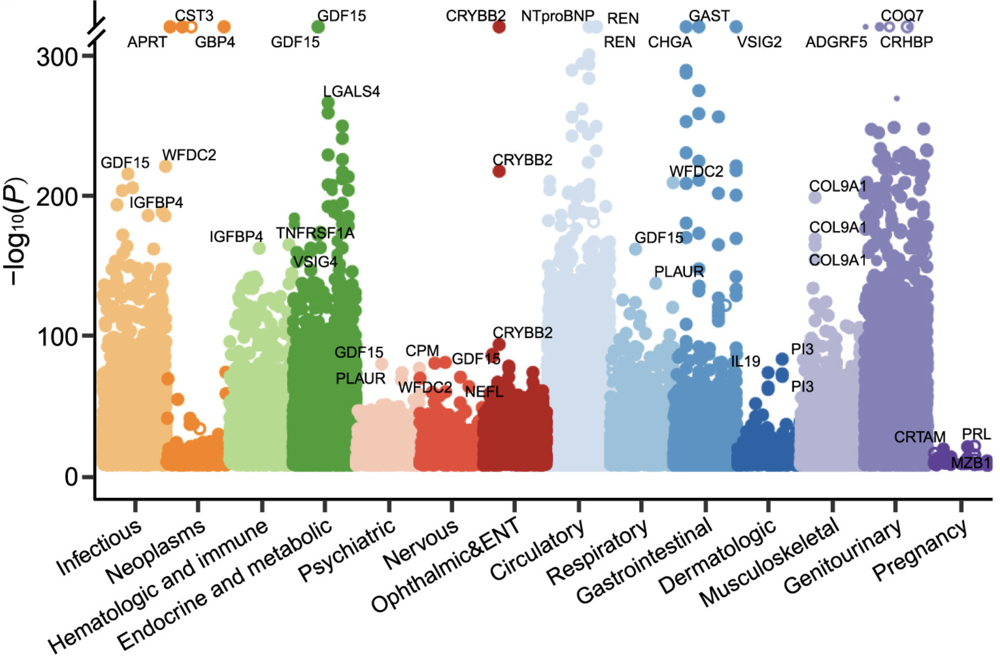

A [paper](https://www.cell.com/cell/fulltext/S0092-8674(24)01268-6) was recently published in Cell analyzing serum proteomics data from >50k adults in the UKBB. While the data and approach are very interesting, the published analyses and results are somewhat underwhelming. 

For those unfamiliar with the dataset, there are over 600 incident diseases, over 400 prevalent diseases, and over 700 traits. The UKBB measured 2920 proteins captured using the Olink Explore proteomics panel. Notably, this assay lacks high abundance proteins like IgG or amyloid species that could have been useful. It is also a serum based assay, so we miss proteins that may have abundant expression locally but are not found in serum at high concentrations (e.g. IL-13, TSLP). 

The primary issue with the analysis conducted was that of the 5.3 million possible associations, a whole 1.4 million of them (27.1%) are considered significant by a nominal p-value cutoff of 0.01. You could say that this is simply an issue of correcting for multiple comparisons, but the issue here is that the distribution of p-values is different across diseases/traits. Some diseases like kidney diseases, intestinal diseases, or infectious diseases have many many significant proteins, while some more rare indications may not have as many cases and thus have less significant p-values overall, or some biology is simply just more subtle and will get washed out by p-value correction approaches. Conversely, there are also certain proteins (e.g. GDF15, IGFBP4, WFDC2, etc.) which seem to be generally stress responsive and upregulated in any unhealthy individual, no matter the specific pathology. This phenomena can also wash out more specific biology.

Alternatively, if we decide to just keep everything with a significant unadjusted p-value, this leaves us with a lot to digest, so much so that it can be difficult to pull out what is meaningful. Below is a plot from the paper's Figure 1 and you can see how many significant associations there are. There are also different distributions of p-values across diseases, making simple threshold based approaches ineffective. 

***

Today's blog is a '1st draft' of a more formal analysis I am in the process of conducting on these data. I have scraped all of the data from their [public browser](https://proteome-phenome-atlas.com/) and reanalysed the data to find insights that I think are more qualitatively interesting than those identified in the original paper. I use a different statistical approach that prioritizes identification of outlier findings more than using naïve two group comparison tests. The result is a list of ~100 associations that I personally think are quite interesting, especially for understudied conditions such as in women's health, gout, and interstitial lung disease, and traits such as height/weight, blood parameters, heart health, and behavioral patterns such as spicy food intake, caffeine intake, and reproductive patterns. Several very strong associations have not been described mechanistically in literature despite corresponding genetic evidence and thus offer opportunities for further investigation. More generally, this statistical approach which traditionally has been applied in the field of economics to study markets, has demonstrated great utility for analyzing these types of large -omics datasets where traditional correction procedures for multiple comparisons fall short. 

## Table of Contents

- [Introduction](#introduction)
- [Methods](#methods)
  - Disease coding considerations  
  - Statistical prioritization approach (HHI method)  
  - Further analysis with external resources (GWAS, druggability, KO models)  
- [Results](#results)
  - [Why are the data so top heavy?](#why-are-the-data-so-top-heavy)
  - [Recapitulation of approved drug targets](#how-often-do-we-recapitulate-approved-drug-targets)
  - [Notable disease–protein associations](#what-are-the-most-notable-disease---protein-associations-in-major-indication-categories-and-what-do-they-teach-us-about-the-underlying-biology)
    - [Cardiology](#cardiology)
    - [Gastrointestinal diseases](#gi-diseases)
    - [Liver diseases](#liver-diseases)
    - [Lung diseases](#lung-diseases)
    - [Neurological diseases](#brain-diseases)
    - [Genitourinary diseases](#genitourinary)
    - [Blood diseases](#blood-diseases)
    - [Endocrine diseases](#endocrine-diseases)
    - [Cancer](#cancer)
    - [Miscellaneous findings](#miscellaneous)
  - [Notable trait–protein associations](#what-are-the-most-notable-trait---protein-associations)
- [Discussion](#discussion)

### Introduction 

Proteomics is having a moment. Several serum proteomic profiling methods have been developed. While their analytical performance do not directly correlate to each other (e.g. Olink tests have correlation coefficients of ~0.4 with Somascan), analyses utilizing their data recover known associations, indicating that the data is in fact useful. New platforms like Nomic are enabling greater throughout as well. 

This provides a new paradigm for discovery. Never before has this scale of data been released, and just like geneticists have analyzed GWAS data, similar approaches can be taken for serum proteomics. Understanding the relationships between plasma proteins and disease at the very least can provide biomarkers, and may even nominate therapeutic targets. 

___Everything must have an explanation.___ The explanation can be technical error or confounding, or overpowered analysis but there must be an explanation. Often there is a biological reason why, and you need to be able to find it. Assuming there are real biological links between observed associations, plasma proteome relationships may even teach us new biology. 

### Methods

#### Disease coding considerations
The UKBB has defined two categories of disease: prevalent and incident. Prevalent diseases refer to conditions that patients have at the same time of getting blood drawn for the serum proteomics data measurement, and incident diseases refer to conditions that patients are diagnosed with after their blood is drawn. In theory, these are interesting because you have both a cross sectional and longitudinal analysis you can do where the associations with prevalent disease provide biomarkers of 'active' disease, while the associations with 'incident' diseases provide you risk prognostic biomarkers. However in practice, it is likely that many of these 'incident' diagnoses that are made after the serum collection are actually just diagnosed late and the patients do in fact have the disease while the serum is collected. I'm not claiming that this is always the case, but the data is 'dirty' enough that I don't trust the incident analysis to only include people who don't actively have the disease and to accurately exclude people who have the disease. Thus, for the purposes of my analysis, I have blended these two datasets as a single set of disease - biomarker associations.

#### Statistical prioritization approach
The dataset suffers from an issue of too many significant associations for a small subset of diseases/proteins and generally inflated p-value estimates overall. There is a separate issue of unhealthy people tending to have dysregulated proteomes, where magnitude of dysregulation is not always correlated with importance to the disease biology. Some proteins are seemingly upregulated with a highly significant p-value in dozens of diseases. The goal of our study is to identify highly specific associations. For example, if we find a disease where only a handful of proteins are enriched, we can more easily conclude that those are specifically related to the biology. If we find proteins that are only sharply enriched in one or two diseases, we may be more confident that there is a genuine relationship. Such a prioritization approach needs to be somewhat insensitive to the absolute magnitude of statistical enrichment (ie. p-values), but sensitive to the relative magnitude. We should care more about a difference between p = 3e-10 vs 2e-3 than a difference between p = 3e-100 vs p = 2e-93. 

___Enter the Herfindahl-Hirshman Index (HHI)___. This is a measure from the field of economics which measures market concentration. The basic idea is that market concentration is proportional to the sum of the squares of market share among all competitors. Market share sums to 1, so if we have a monopoly, the HHI is 1 (1 x 1 = 1). If we have 100 competitors with equal market share, the HHI is 0.01 (0.01^2 x 100). For our case, we can use the transformed -log10(p-values) as inputs (to obtain positive values proportional to the significance of association) and calculate the 'market share' across all given protein associations for a disease (for example) as the -log10(p-value) divided by the sum of all -log10(p-values) for proteins that have calculated associations with the disease. This "HHI" metric will prioritize "outlier" results where a few p-values are much more significant than the rest. This will deprioritize kidney disease which has many overexpressed proteins, which may or may not be related to pathophysiology. It will also deprioritize proteins that are up in virtually any disease, such as GDF15 (if we consider the opposite case where the 'market' is made up of disease associations with proteins). 

#### Further analysis
Further prioritization of these lists can be done using various other target identification resources. These include [GWAS summary statistics](https://www.ebi.ac.uk/gwas/home), druggability/drug repurposing [assessment](https://platform-docs.opentargets.org/target/tractability), and phenotyping of [mouse KO models](https://platform.opentargets.org/downloads/mouse_phenotype/schema). 

Summary statistics are deposited as a Google Sheets [resource](https://drive.google.com/drive/folders/1wDB5UNNKDyL4YYFEPrDslbvAOdHpJ4Rt?usp=sharing).

### Results

In lieu of regurgitating all of the interesting associations I have found, I have organized this section into a set of questions and answers. If there are additional questions you are interested in knowing the answers to, please email me.

#### Why are the data so top heavy?

There are both a set of proteins (e.g. GDF15, PLAUR, WFDC2, EDA2R) and a set of diseases (e.g. Celiac disease or other gastrointestinal pathologies, liver cirrhosis, any sort of kidney problem. Because heart and kidney issues are often comorbid, there is also a lot of overlap), that dominate the number of significant protein - disease associations. You might expect that the unhealthier people are, the more messed up their plasma proteome might be. The diseases listed are all serious and have systemic involvement beyond a single organ, but there are also interesting reasons for why each of them have particularly dysregulated serum protein signatures.

Why celiac and other gastrointestinal pathology? Epithelial damage can release all sorts of proteins into serum that normally would not be there. These proteins go straight to portal circulation and can be readily detected in blood. In kidney diseases where you have poor filtration, much of your serum proteome gets sent to urine. There is likely compensatory production. When you have kidney damage, your filtration rate is also much lower, meaning that less of your blood is being filtered and so many small proteins like cytokines are not effectively cleared, leading to increased serum levels. Most patients with kidney disease have some ongoing background inflammation so you have both increased production and reduced clearance.

A similar story occurs with liver disease. Your liver is also responsible for clearing a set of proteins. Liver disease is also highly inflammatory, and associated with the production of many inflammatory cytokines that go straight to blood circulation.

Certain diseases may only have locally produced soluble factors that drive disease and aren't detected in serum. For example, there is atopic dermatitis where you may have extremely abundant local alarmin production (e.g. TSLP, IL-25, IL-33) but which maybe doesn't readily spill out systemically because of biophysical reasons. 

In terms of the proteins most enriched at the top, these are essentially biomarkers of unhealthiness. They are induced via injury, hypoxia, inflammation, or senescence, all factors associated with disease and aging. 

- ___GDF15___ acts systemically in the liver and in the brainstem and thus requires a high level of production. It suppresses appetite and increases triglyceride production, enabling the body to survive through acute stressors such as infection. Neutralization of GDF15 via monoclonal antibody has shown to be effective in cancer cachexia ([NEJM](https://www.nejm.org/doi/full/10.1056/NEJMoa2409515)).
- ___PLAUR___, also known as soluble uPAR interacts with various integrins during inflammation and ECM remodeling. It acts not only as a chemoattractant for immune cells, but is also involved with immune cell movement into tissue. Soluble levels reflect sustained chronic inflammation. In certain subtypes of kidney disease (e.g. FSGS), suPAR produced by myeloid cells ([Nat. Med.](https://www.nature.com/articles/nm.4242))has been found to be causal for disease progression ([Nat. Med.](https://www.nature.com/articles/nm.4242))
- ___WFDC2___ is a protease inhibitor that protects tissues during inflammation. Soluble levels reflect background chronic inflammation.
- ___EDA2R___ is upregulated by TNF and interferons and acts as a decoy receptor for EDA2, which is concomitantly upregulated. EDA2R has been linked to muscle atrophy ([Nature](https://www.nature.com/articles/s41586-023-06047-y)) and sarcopenia ([Nat. Comm.](https://www.nature.com/articles/s41467-025-56918-3))

#### How often do we recapitulate approved drug targets?

Top dysregulated proteins are ___not uniformly enriched___ for therapeutic targets. 
- IL-13 isn't enriched in dermatitis or COPD
- Very mild enrichment of IL17F in a subtype of psoriasis. Instead, you see PI3 and IL-19
- Very weak enrichment of TSLP in asthma and not in COPD

However, you do see TNF in rheumatoid arthritis. You do see IL-6 in sepsis, rheumatoid arthritis, and barely in polymyalgia rheumatica. IL-22 shows up as a hit in dermatitis. You don't see enrichment of IL-5 in asthma or COPD, but you do see enrichment of eosinophil proteins such as PRG2/3 so we'll count it.

More analysis in the formal paper, but to a first approximation protein abundance associations are not a guarantee of efficacy as a therapeutic target, just like Joan Smith and Jason Sheltzer [found in cancer](https://www.cell.com/cell-reports/fulltext/S2211-1247(22)00313-8).

#### What are the most notable disease - protein associations in major indication categories? And what do they teach us about the underlying biology?

#### Cardiology

Of the diseases of the heart, we have several that can cause dysregulated serum proteomes. The heart works closely with the kidneys to control fluid dynamics and blood flow (e.g. total fluid volume, blood pressure, etc.), and as a result continuously secretes factors at steady levels to control kidney filtration through the renin–angiotensin–aldosterone system (RAAS). When the heart experiences mechanical pressures, such as stretch via volume or pressure overload, it will secrete a precursor molecule of BNP, which is a vasodilator and and induces increased natriuresis (sodium excretion; na-triuresis) by the kidneys to reduce volume. However, BNP is secreted as proBNP, and gets cleaved extracellularly into BNP, the active peptide, and NTproBNP, which is inactive. The NTproBNP accumulates and is a sensitive biomarker for cardiomyopathy (e.g. heart attack, carditis, other ischemia, etc.).

At the same time, many patients with heart failure don't pump blood properly and less blood reaches the kidney. The kidney perceives this as low circulating volume and releases Renin (REN protein) which actually counteracts the activity of BNP, causing the kidneys to retain more water. The heart struggles and produces BNP due to local issues like fibrosis, cardiomyopathy, or other mechanical stresses that cause stress and are unrelated to total blood volume. The kidney, operating normally, doesn't perceive enough blood volume and retains more volume, causing the characteristic edema. 

How does the heart actually get damaged? One primary factor is lipids that accumulate into plaque in major arteries. Thus, diseases of the heart are correlated with serum levels of PCSK9, which reduces LDLR, a liver receptor that sequesters free low density lipoprotein (LDL), and LPA which is a particle that actually carries cholesterol and deposits it in the arterial wall.

There are two interesting proteins with less described biology. While C1S, a complement protease, is known to play a role in myocardial infarct, contributing to clearance of debris and inflammation, it is also enriched in the incident population, meaning the population that has not yet had a heart attack. There is [clinical benefit](https://pubmed.ncbi.nlm.nih.gov/17576071/) of C1 esterase inhibition but it isn't used due to lack of large clinical trials. LGALS4, or Galectin-4 is another protein with significant specific elevation in hyperlipidemia. There is some work showing that it participates in the formation of lipid rafts in intestinal cells.

#### GI diseases

Digestion is a specialized process which requires many esophageal and intestine specific proteins. During disease, the tissue integrity is compromised and these proteins leak into the blood. 

Individuals with Barrett's esophagus and GERD have high levels of PGA4 (which makes sense because it encodes pepsinogen, a stomach enzyme), GAST (encoding gastrin which is a hormone that stimulates release of gastric acid), and LIPF (lipase enzyme). In intestinal malabsorption, you see enriched serum expression of TGM2, which helps maintain epithelial barrier integrity (and which also is the primary autoantigen in celiac). In celiac, there is increased serum detection of CPA2, a dietary enzyme with gut lumen restricted expression. CKMT1A, CKMT1B, MUC2, TXNL1, CLEC2L among many others, are other gut restricted proteins that are readily detected in the serum of people with intestinal diseases.

The gut also lives in harmony with microbes. In certain circumstances, the body needs mechanisms to kill off harmful outgrowth, and thus the gut has a set of specialized proteins to support these mechanisms. One of these is NOS2, which is very strongly enriched in intestinal malabsorption, but also other GI pathologies. NOS2 encodes inducible nitric oxide synthase (iNOS) and produces large quantities of nitric oxide (which kill bacteria) upon induction by inflammatory cytokines (e.g. TNFa, IFNg, IL1b) and bacterial antigens. NOS2 is also a GWAS hit for increased NO and risk of colon cancer

ITGB7 participates in lymphocyte migration and is the target of vedolizumab. The protein is frequently shed during lymphocyte trafficking into tissue and thus behaves as a general marker of immune activation. IL-15 is another biomarker of immune activation and plays critical roles in expansion of NK and CD8 effector T cells, which in certain conditions causes autoimmunity in the gut.

In contrast, TGFA and PTGDS (prostaglandin D2 synthase) represent compensatory mucosal healing molecules.  

Finally, most if not all GI diseases had increased expression of CHGA, or chromagranin A. CHGA is a neuroendocrine secretory protein that is found in granules of secreted hormones. The gut and esophagus are full of endocrine cells that secrete a variety of hormones (e.g. gastrin, somatostatin, serotonin, GLP-1, GIP, CCK, etc.) that help regulate digestion. During disease, overactive enteroendocrine cells or damaged endocrine cells may explain the rise in CHGA detected in serum.

#### Liver diseases

The primary liver diseases broadly categorize themselves into those induced by toxins (e.g. alcohol), those induced by diet (e.g. fatty liver disease; often comorbid with Type 2 diabetes), or those induced by autoimmunity, often with overlap but enough discordance that [groups](https://www.nature.com/articles/s41588-022-01199-5) have distinguished different types of liver disease with solely proteomics. Much like the gut, many enriched serum proteins reflect specialized functions.

For example, GSTA3 and GSTA1 are glutathione S transferases which attach glutathione to reactive compounds to reduce their reactivity and ability to damage other important biomolecules. ADH4 is an enzyme that oxidizes ethanol and retinol. CES1 is an enzyme that hydrolyzes esters, preparing drugs for Phase II reactions like glutathione conjugation. GGT1 is a glutathione catabolism enzyme that is elevated in alcohol use disorder and is also used clinically for diagnosis of liver and bile duct disease.

Among other interesting relationships, we have:

- Elevated levels of OSMR and IL1RAP in liver cirrhosis, potentially implicating these pathways in sustaining chronic injury. In alcoholic liver disease, soluble LIFR is elevated which has a similar downstream pathway as OSMR.

- Trehalase (TREH) helps liver cells clear accumulated fat by inducing autophagy.

- PTPRH - dephosphorylates receptor tyrosine kinases like EGFR and HER2, preventing tumorigenesis

- ENG - protective factor expressed in endothelial and immune cells. Important for angiogenesis and modulating TGF-beta signaling. [Knockout mice](https://pubmed.ncbi.nlm.nih.gov/28941022/) have much more significant liver fibrosis.

- THBS2 is an ECM glycoprotein that is secreted by stellate cells and myofibroblasts. 

- BST2 is also known as tetherin, and is an antiviral protein that can help inhibit the release of viruses associated with liver diseases such as the hepatitis A-E virus family.

- ITGB7 is a hit as well in liver cirrhosis, supporting the role of inflammation in liver disease.

- ACY1 - encodes an enzyme that removes acetyl groups from N-acetylated amino acids. Autoantibodies [stratify](https://pubmed.ncbi.nlm.nih.gov/27633755/) stages of liver fibrosis in patients with hepatitis B.

#### Lung diseases

Lung diseases encompass interstitial lung diseases (e.g. sarcoid, IPF), asthma, and COPD. Other respiratory ailments from infections can also share serum features resembling damaged lungs.

Interstitial lung disease (ILD) is a condition with surprisingly high mortality and high prevalence (0.21% or nearly 700k people in the U.S.). The disease is characterized by scarring of lung tissue and inflammation. In some contexts like sarcoid, you have these macrophage and B-cell filled granulomas that form in the lung. In others like IPF, generalized fibrosis which persists and worsens over time makes it difficult for patients to breathe.

Within ILD, I found associations with:
- SFTPD, which is a surfactant protein that forms part of the lung's innate immune system. It binds to pathogens.
- LAMP3 is highly expressed in alveolar type II cells in the lungs, and is also associated with secretion of surfactant
- Inflammatory proteins IL-6, TNFSF13B (BAFF), and TNFRSF4 (OX40) are all serum enriched and may be therapeutic targets
- Collagens (e.g. COL9A1, COL24A1) are enriched in IPF 

Calcyphosine (CAPS) protein is expressed in ciliated cells of the respiratory epithelium, and enriched in asthma. PRG3, an eosinophil expressed protein, is also enriched in asthma, supporting the therapeutic utility of IL-5 neutralization. PAPPA, a pregnancy protein, is also enriched in asthma, which has been [identified previously](https://pubmed.ncbi.nlm.nih.gov/29211611/). 

I found several unexpected findings in sarcoid, COPD, and asthma:
1. In sarcoid, CD80, a target for abatacept on antigen presenting cells, was enriched and may represent an indicator for the potential efficacy of abatacept in sarcoid. There appear to be some [efficacy data](https://pubmed.ncbi.nlm.nih.gov/39360380/) supporting the use of abatacept in sarcoid.
2. CHIT1, a chitin degradation enzyme secreted by myeloid cells, is highly enriched in sarcoid. A company called Molecure is developing a first in class CHIT1 inhibitor, currently in Ph2 trials. [Here](https://pmc.ncbi.nlm.nih.gov/articles/PMC9529231/) is the preclinical data.
3. TNR, or tenascin R, is supposed to be a neural protein, but is highly expressed in lung pathology like COPD. It is an extracellular matrix protein that does not have a described role in the lung or in COPD
4. CNTN1, a cell adhesion molecule essential for nervous system development, particularly the formation of myelin insulation in myelinated nerves, is highly enriched in severe asthma patients. I wonder if there is a neuroimmunology angle here. Other groups have found that it is [present within exosomes](https://pubmed.ncbi.nlm.nih.gov/33957164/) and act to promote Th2/Th17 responses. There is also a disease termed Contactin-1 (CNTN1) IgG associated autoimmune nodopathy (AN), which is a rare neurological disorder where the immune system produces antibodies that target contactin-1, a protein found at the paranodes of nerve fibers. 2 case reports have shown that some patients have [lung manifestations](https://www.neurology.org/doi/10.1212/WNL.0000000000211529). Maybe a subset of hospitalized asthma patients actually benefit from FcRn or other antibody depleting therapy.

#### Brain diseases
There are a set of nonspecific markers for neurological diseases like Alzheimer's, ALS, Parkinson's, motor neuron disease. These include NEFL, GFAP, APOE. I don't think any of these are novel or interesting. 

One interesting one is CPM, which stands for Carboxypeptidase M. This is an ECM protein associated with myelin and may be shed during neuroinflammation as part of general sets of episodal and paroxysmal disorders. Another recurrent pattern is ACE2 in these disorders and specifically in epilepsy. Likely a similar pattern of shedding from neurovascular stress.

#### Genitourinary

As previously stated, diseases of the kidney have a huge number of dysregulated proteins. However, there are a couple of indications within the broader category that have more specific associations.

- Renal tubulo-interstitial diseases have a set of enriched proteins that have less overlap with other kidney diseases. These proteins include SPINK1, CD300E, CD27, LY6D, and REG1A. SPINK1 is a protease inhibitor secreted to protect epithelium during tissue injury. CD300E is the protein most correlated with monocyte blood percentage, so this likely reflects infiltration of myeloid cells into the kidney. CD27 is a costimulatory receptor for B and T cells, so this likely reflects infiltration of B and T cells, same story for LY6D but for B cells. REG1A is a regeneration factor secreted to promote kidney tubule and epithelial cell repair.

- APOA4 is a protein with unusually high expression in chronic nephritic syndrome. Genetic mutations in APOA4 can cause autosomal dominant tubulointerstitial kidney disease with medullary amyloidosis, a condition characterized by abnormal ApoA4 protein deposition in the kidney medulla, leading to chronic kidney failure. This was previously [identified only via mass spec](https://pubmed.ncbi.nlm.nih.gov/21900878/). I wonder if more cases of nephritis or chronic kidney disease have APOA4 as a cause and are underdiagnosed due to lack of antibodies.

Couple of other interesting associations:

- Kidney stones are associated with global increases in myeloid secreted CSF1 and TNF1R. 

- Prostate hyperplasia or issues will cause shedding of TSPAN1 most significantly, but also KLK3 and GP2. TSPAN1 is a small transmembrane protein that helps organize the cell membrane.

- CHRDL2 is specifically upregulated in leiomyosarcoma of the uterus with a very significant p-value of 6.78e-96. This has never been described before. CHRDL2 is a BMP antagonist that is upregulated in several other cancers. 

#### Blood diseases

Associations relating to blood diseases are very sensitively picked up because the site of action is often directly in the blood.

In thrombocytopenia, which is just low platelets, you see enrichment of several highly expressed platelet proteins including GP4, SNAP23, DNM1, PDGFA (platelet derived growth factor), and BDNF. Additionally, we can look at factors associated with conditions that cause thrombocytopenias including vascular inflammation. PLXNA4, AMIGO2, VCAM1, and BGN are all associated with thrombocytopenias and all have plausible associations with endothelial health.

SDC4 is a common negative association for both prevalent and incident blood disorders. This means that high SDC4 correlates strongly with increased platelet counts. This appears to be part of the mechanism of antithrombin, as antithrombin will [bind and shed SDC4](https://pubmed.ncbi.nlm.nih.gov/15968398/). Interestingly, the perscription medication Eltrombopag which is used to treat thrombocytopenia by binding to c-mpl receptors, also binds SDC4 with micromolar potency. In fact, Eltrombopag has unique  effects relative to romiplostim or avatrombopag which are pure MPL agonists. Maybe there is an angle here.

Vitamin B12 is also known as cobalamin, and requires a cobalamin binding intrinsic factor (CBLIF) in order to be absorbed. Without vitamin B12, DNA cannot be resynthesized and the most apparent clinical manifestation is anemia. Thus, there is a significant association between low CBLIF and vitamin B12 deficiency anemia.

In venous thromboembolism, where basically you just have an obstructive blood clot that forms, there is high serum levels of F10, or coagulation factor X. Makes perfect sense.

Agranulocytosis (neutropenia) is interesting because the prevalent and incident associations are different. The incident associations (which are serum proteins elevated prior to diagnosis) include high levels of TNFSF13B (BAFF cytokine) and FLT3LG. These are factors that stimulate B cell survival and HSC maturation into DCs and B cells respectively. 

In patients with iron deficiency, FGF23 and EPO are strongly enriched in serum. Why does iron matter at all? Iron is a central component necessary for hemoglobin oxygen binding. Without it, tissues will feel hypoxic and think that RBC production needs to increase, and as a result, elevate secretion of EPO. FGF23 is interesting because of its traditionally established role in bone phosphate and vitamin D metabolism and evidence showing that EPO will stimulate FGF23 production. Why there is a relationship between bone metabolism and blood production is unclear to me. Finally, HMBS, a heme production enzyme is also upregulated in iron deficiency and other blood disorders which makes sense as this is in theory helping to replenish low platelet levels.

#### Endocrine diseases

CDHR1 is a retinal protein that is enriched in patients with hyperparathyroidism, likely because hyperparathyroidism is associated with eye manifestations such as keratopathy, scleritis, and retinal hemorrhage. PTH (parathyroid hormone) and TG (thyroglobulin) of course are also up as markers of thyroid activity. In the opposite case, there you have autoimmunity against the thyroid gland, you have enriched serum TNFRSF19, also known as TROY, which can stimulate NFKB survival pathways, and DAF, which regulates complement induced killing.

There are a couple of interesting findings for Sjogren's disease / SLE:

- TRIM21 is the major enriched protein in Sjogren's disease and [60-80%](https://rmdopen.bmj.com/content/6/2/e001184) of patients have autoantibodies against this antigen, and clinical diagnosis also uses autoantibody levels. It binds to Fc regions of IgG, IgM, and IgA, helping to coordinate intracellular response to viruses captured by antibodies. It is highly expressed on pathogenic immune cells.
- DDX58 in SLE, encodes for RIG-I a major interferon response protein that protects cells from viral infection. Genetic variants encode for hyperactive interferon pathway.
- IL15 in lupus erythematosus is enriched and perhaps plays a role in sustaining T/NK cell activation.
- CXCL10 is an interferon stimulated gene in SLE that participates in immune cell recruitment. Chronic interferon signaling in SLE likely explains the enriched serum protein abundance

Type 2 diabetes patients have higher levels of LPL. This is because of a compensatory upregulation in response to hypertriglyceridemia and hyperinsulinemia, combined with shedding from the endothelium due to insulin resistance and inflammation. However, this circulating LPL is often inactive, so triglyceride clearance remains impaired.

##### Cancer

Not a lot of cancers are sampled in the UKBB (for understandable reasons). However, I was surprised at how few strong protein biomarkers of cancer there were. Most of them are again protein biomarkers of local tissue injury.

Leukemias have elevated expression of proteins expressed on lymphocytes such as FCRL3, FCER2, SDK2, TNFRSF13C (BAFF receptor; TACI). In B cell lymphoma, there is also enrichment for TACI, and also OX40, CXCL13, and PD1. In NHL and FL, there is particular enrichment for TNFRSF9 (4-1BB). 

In order of statistical significance, there is very strong enrichment for TRIM1 and KLK3 in prostate cancer, mimicking the finding in prostate hyperplasia. NSCLC has strong enrichment for CXCL17, IL-6, and PLAUR. Kidney cancer has strong enrichment for HAVCR1, also known as kidney injury molecule 1, which is also a [sensitive marker](https://translational-medicine.biomedcentral.com/articles/10.1186/s12967-021-02776-8) for AKI. 

In breast cancer, the two most enriched proteins are CELSR2 and ADGRD1, which are both adhesion GPCRs often cleaved by upregulated MMPs and ADAM family enzymes. In gallbladder cancer, IGFBP7, an endothelial cell angiogenesis ligand, is the top protein. 

Enrichment of FSTL3 in squamous cell carcinoma and REG4 in esophageal cancer are both significant but mild.

#### Miscellaneous

CRYBB2 is high in cataract patients. It is also a GWAS hit for cataract. This is a super strong association. CRYBB2 encodes beta-crystallin B2, which is a structural protein in the lens. The lens is interesting because the crystallin proteins are synthesized once during development and never turned over because the cells that make the protein die off. Cataracts are a strongly age associated issue, which supports 'wear and tear' (ie. UV-B light) as a major cause of crystallin protein breakdown and leakage into serum. CRYBB2 also correlates with the number of eye surgeries someone has had. 

There is a super strong relationship between serum UBQLN3 and gout, never been described before. UBQLN3 is a ubiquilin protein that shuttles ubiquinated proteins to the proteosome for degradation, and interestingly, is testis restricted. Gout is a mineral deposit syndrome where monosodium urate (MSU) gets deposited in joints and other places. Seems like people on [Reddit](https://www.reddit.com/r/gout/comments/1ef6zhb/can_high_uric_acid_levels_cause_dull_testicular/) and in [case reports](https://pmc.ncbi.nlm.nih.gov/articles/PMC8675627/) have also noticed testicular pain in gout; but not well described due to stigma (?). What is unique about the testes and joints? It is related to MSU crystal formation and body temperature! Each of those locations has lower than normal body temperature and thus has increased risk of MSU crystal formation. What likely makes the testes even more at risk for damage is the fact that it is highly metabolically active (lots of dividing cells) and has thus high local uric acid concentration. High serum uric acid has been [linked](https://onlinelibrary.wiley.com/doi/10.1155/2024/3923652) to male infertility. So I think what we have here is UBQLN3 as a biomarker of tissue damage in the testes and associated risk for male infertility.

There is a small but specific correlation between CDKL5 and impacted teeth. Knowledge on CDKL5 is mostly centered around a rare disorder called CDKL5 deficiency disorder which is characterized by early onset epilepsy and developmental delays. There is even an International [Foundation](https://www.cdkl5.com/about-cdkl5) for CDKL5 Research. Like its name suggests, CDKL5 is a cell cycle kinase. Perhaps mechanical remodeling and inflammation caused by impacted teeth lead to leakage of these proteins into serum? Perhaps this protein is especially important for tooth development and maturation.

Acute peritonitis has FSTL3, or follistatin-like 3, as the top enriched protein which binds activins and myostatin. This is sort of similar to the MOA of sotatercept (ActRIIA-Fc) which sequesters activin A and GDF8/11. Is there a role for sotatercept in acute peritonitis? Or should we be thinking about FSTL3-Fc?

Collagens (e.g. COL9A1, COL24A1) are enriched in fibrotic diseases like coxarthrosis (hip joint degeneration). Rheumatoid arthritis has upregulated TNF1R and TNF, as well as CCL7, OX40, TIM3, and PD1. All of these are consistent with the known mechanisms of action. Would be interesting to run an OX40 trial in RA!

#### What are the most notable trait - protein associations?

These segregate into boring and interesting. First the boring:

- Smoking dependency with CXCL17, a cytokine likely associated with smoking associated lung inflammation and fibrosis
- LEP reduction with exercise. Well documented
- Irregular menses with PAEP (glycodelin). Glycodelin is a classic pregnancy associated placental protein that aids in shielding from the immune system and in implantation.
- CGA - age started contraception. Makes sense. CGA is the common alpha subunit found in four human glycoprotein hormones: chorionic gonadotropin (CG), luteinizing hormone (LH), follicle-stimulating hormone (FSH), and thyroid-stimulating hormone (TSH). Contraceptives work by inhibiting secretion of Gonadotropin-Releasing hormone (GnRH), which stimulates the release of FSH and LH. If you are taking contraceptives, you thus have chronically low levels of LH and FSH
- SHBG and testosterone levels. This is a testosterone binding protein which is high when there is a lot of testosterone to buffer levels and low when there is not a lot. It is used clinically to diagnose various sex hormone related pathologies.
- FGF21 protein levels are associated with carb intake. Well understood biology where FGF21 acts in the brain to reduce sweet cravings.
- GDF15 as previously stated shows up as an association with the number of non-cancer illnesses and number of treatments or medications taken. It is a biomarker of unhealthiness. It negatively correlates with exercise, hand grip strength, and father's/mother's age at death. 

Now the interesting:

PTGR1 - liking black pepper. Probably because they recently ate spicy food, the capsaicin is going to trigger inflammation and elevated prostaglandins. PTGR1 helps clear these prostaglandins.

CHI3L1 is a pleiotropic ligand that is associated with alcohol (beer and cider) intake. This association has been reported [as early as 2000](https://pubmed.ncbi.nlm.nih.gov/10898311/) to track with liver fibrosis and recently a group showed that a mouse KO of this protein had less alcohol induced liver damage. This protein seems fibroblast specific, not in hepatocytes. Maybe a target?

INSL5 serum levels are associated with frequency of bowel movements. INSL5 is a hormone that belongs to the relaxin family of peptides. It is produced in the L cells of the gastrointestinal tract. Levels are elevated in calorie-restricted mice and reduced after feeding, and it stimulates appetite. Probably people who eat a lot have more frequent bowel movements -- makes sense. But it belongs also to the relaxin family of peptides. Could it also be inducing bowel movements? INSL5 is also [associated](https://gut.bmj.com/content/early/2025/07/23/gutjnl-2025-335393) with diahrea severity and [in mice](https://pubmed.ncbi.nlm.nih.gov/31989750/) causes increased colonic mobility in an RXFP4 receptor dependent manner. 

WFIKKN1 has a strong negative correlation with mean sphered cell volume of blood cells (higher generally better in regards to RBC health). This is a large 59 kDa protein with multiple domains: a signal peptide, a WAP domain, a follistatin domain, an immunoglobulin domain. Through the follistatin domain, it binds and sequesters GDF8 and GDF11, which mimics the effect of luspatercept, a drug that is approved for MDS to reconstitute RBCs.

LEPR serum levels are strongly associated with alcohol use disorder. There is genetic evidence to support this as well. Leptin is highly pleiotropic, but one of the functions is to reduce cravings by dampening dopamine signaling in the brain response to a reward. For patients with high serum leptin, leptin is potentially getting sequestered so that less lectin activity can occur locally in the brain. High leptin receptor levels in patients with alcohol use disorder may reflect a decreased ability for leptin to signal normally in the brain.

PSPN (persephin) is correlated with the number of live births. This one I have no idea, as it is a relatively undescribed neurotrophic factor with 40% similarity to GDNF and neurturin (wikipedia). This is the [paper](https://www.sciencedirect.com/science/article/pii/S0896627300804535?via%3Dihub) to read if interested.

NCAN and SEZ6L serum levels are highly correlated with height (and weight by proxy). These also show up as GWAS hits. NCAN encodes neurocan, which is a brain ECM protein and SEZ6L encodes a membrane protein expressed in neurons. Not much is known about either gene outside of the nervous system.

SPINK6 is associated with measures of arterial stiffness including pulse wave peak and peak to peak time. SPINK6 is a serine protease inhibitor selective for kallikreins which modulate blood pressure by producing vasodilatory kinins. SPINK6 thus increases blood pressure and arterial stiffness by preventing vasodilation.

OXT, which is oxytocin, has a couple interesting associations. It has the strongest negative correlation with coffee intake (high oxytocin = low coffee intake). Caffeine is known to [excite](https://pmc.ncbi.nlm.nih.gov/articles/PMC5490268/#:~:text=We%20also%20show%20that%20caffeine,of%20caffeine%20on%20energy%20balance.) oxytocin expressing neurons. Maybe people with naturally higher oxytocin don't feel the effects as strongly and don't continue consumption after trying it. Oxytocin levels also correlate with the lifetime number of sexual partners as well as the age at which people first have sex. Tracks?

### Discussion 

Correlation versus causation, sure. But here is a lot to discover by sitting down with GPT and sorting through lists of omics data. Lots of proteins are enriched as a consequence of tissue damage. However, we can often identify insights that inform therapeutic approaches (e.g. eosinophil PRG2/3 in asthma, follistatin family biology, cytokines and autoimmunity) or unveil new biology (e.g. gout and testis damage, interferon proteins in SLE/Sjogren's, and APOA4 in chronic nephritis syndrome). While most of these have been 'discovered' already, there are undoubtedly much more to explore. Are there rare and understudied hormones with weird trait associations? Are there proteins that mimic the effect of approved therapeutics with associations in novel indications? Can we catalogue all the stress induced proteins and their buffers? For seemingly highly pleiotropic molecules, many of which are not well understood, we can use this data to annotate biological functions.Everything must be explained.

Should we be reporting GDF15 serum abundance as a diagnostic? If there is one thing I've learned, it is that you are unlikely to have disease. 75% of diseases had a nominally significant relationship with GDF15 serum abundance. There are certainly therapeutic angles that I think are worth further investigation:

1. IL-15 in SLE or UC
2. OSMR/IL1RAP in liver cirrhosis
4. CD80 / OX40 / BAFF in ILD/sarcoid
5. GDF15, EDA2R, suPAR clearing antibodies

The rise of the biomedical data extraction agent and the rise of the biomedical data analysis agent were both integral for this piece of writing. GPT-5 was very useful for quick Q&A to figure out why a certain disease - protein association existed. This blog post also would never have existed without LLMs helping me to scrape the data. I appreciate the browser that was created. But alternative data visualizations (e.g. volcano plots) or table views (e.g. many disease/traits at once) can be very helpful. If I had these, I probably wouldn't have done this whole thing!

***

<b><i>Knowledge elevates visionary action</i></b>

