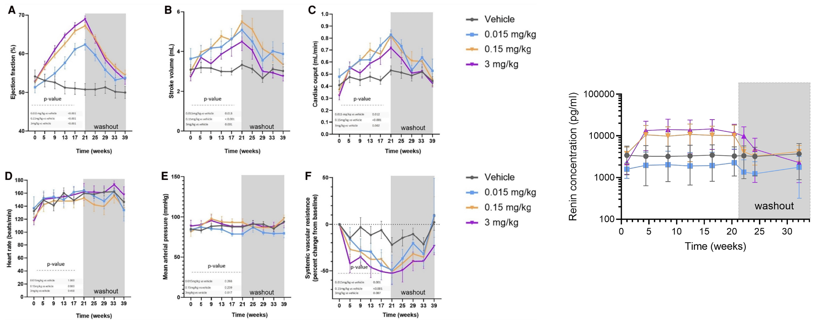

***

Tectonic Therapeutic is one of the most interesting biotech SMID cap companies in the year 2025. The company's lead asset is a long half-life relaxin mimetic, leveraging a pregnancy associated hormone to treat pulmonary hypertension. Playing in the same arena are Eli Lilly and AstraZeneca, each with their own half-life extended relaxin molecules, as well as a small molecule receptor agonist program from AZ. 

The catch is that Lilly discontinued theirs in both heart failure and chronic kidney disease after a trial in a broad heart failure population not only failed to show benefit, but actually showed even worse outcomes on the relaxin drug than on placebo. News of this in January dropped TECX stock by ~50% from mid 40s to mid 20s. Just days later when TECX reported interim Ph1 data from their Ph1b trial, TECX stock rocketed back up, higher than before the Lilly news in the mid 50s. Over the course of Q1, the stock dribbled down and reached a low April 8th at low teens, before steadily climbing back up to the mid-20s. A Nature Medicine [paper](https://www.nature.com/articles/s41591-025-03939-6) describing the full results of Lilly's trials leading to discontinuation was published on August 31st, leading to yet another ~35% move down into the 16s. 

With results from a Ph2 readout from the AstraZeneca long half life relaxin trial about to be announced any day now, there is significant upside potential if these upcoming data (in a more select heart failure population than Lilly's) show clinical benefit. 

Today, I review Tectonic's relaxin mimetic TX45 and summarize the major bull and bear arguments regarding its efficacy profile in an ongoing trial in Group 2 pulmonary hypertension patients with HFpEF. I conclude with an argument for why I think the drug is active overall, effective in the trialed patient population, and will meet the primary endpoint in the upcoming Ph2 trial.

***

## Table of contents
- [Molecular biology](#molecular-biology)
- [Systemic mechanisms](#systemic-mechanisms)
- [Design of TX45](#design-of-tx45)
- [What is the patient population](#what-is-the-patient-population)
  - [Baseline characteristic comparison to Volenrelaxin trial](#baseline-characteristic-comparison-to-volenrelaxin-trial)
  - [Why the patient population differences are an issue](#why-the-patient-population-differences-are-an-issue)
- [PD biomarkers from the TX45 Ph1b trial](#pd-biomarkers-from-the-tx45-ph1b-trial)
- [Dosing considerations](#dosing-considerations)
- [Conclusions](#conclusions)
  - [Bull case](#bull-case)
  - [Bear case](#bear-case)
  - [Upcoming catalysts](#upcoming-catalysts)
- [Literature](#literature)
- [A fun Tim Springer trading history](#a-fun-tim-springer-trading-history)

### Molecular biology 

Relaxin is a small hormone encoded by the RLN2 gene. It is roughly 6 kDa and made up of 53 amino acids. Because the size is small, it gets freely filtered by the kidney and excreted. The half-life of native relaxin is thus short -- in the range of 30 min-6 hrs. In pregnant women, serum levels can reach nanomolar ranges, maybe ~20x the concentration in 'normal' individuals. It is produced by reproductive organs including the corpus luteum, placenta, endometrium, and interestingly the prostate (more below). It can also be produced by the heart, kidney, brain, and fibroblasts.

Relaxin binds the RXFP1 receptor, which is part of a GPCR family that includes RXFP2, RXFP3, and RXFP4. In humans, relaxin has specificity for RXFP1, though there is some small affinity to RXFP2. 

There is significant sequence variation across species, as well as significant variance in receptor expression across species. For example, RXFP1 is expressed in the atria of mice, but not in humans. 

The binding of relaxin to RXFP1 is also somewhat complex, and involves a two step mechanism of first binding to the LRR domain, then a linker region, before activation of the transmembrane domain and downstream signaling.

RXFP1 can exist as a pre-assembled complex, and these complexes often vary by cell type. In [myofibroblasts](https://pubmed.ncbi.nlm.nih.gov/24429402/), relaxin signals through RXFP1-AT2R heterodimers to inhibit TGFb activity. In fibroblasts, there also seems to be a [MMP pathway](https://journals.plos.org/plosone/article?id=10.1371/journal.pone.0042714) stimulated via NO that helps degrade extracellular matrix. 

RXFP1 is also expressed in endothelial and smooth muscle cells. In these contexts, vasodilatory effects are mediated through nitric oxide (NO). RXFP1 will signal through a G protein that turns on nitric oxide production. Nitric oxide acts locally to relax the vessel through cGMP.

In the rat kidney, RXFP1 is detected throughout a variety of cell types in the cortex and medulla, but in humans it seems to be restricted to the glomerulus. Limited data in rats (which could be non-representative of what is happening in humans) indicate that relaxin treatment reduces sodium excretion.

To conclude, relaxin is a small hormone specific for the RXFP1 GPCR. Effects vary by cell type and are poorly conserved across species. There are immediate vasodilatory effects that can be observed in minutes to hours, likely mediated by RXFP1 on endothelial cells. There are longer term fibrotic remodeling effects that can be detected over weeks depending on the extent of existing fibrosis, likely mediated by RXFP1 on myofibroblasts.

### Systemic mechanisms

From the company, there are known hemodynamic and anti-fibrotic properties of relaxin to facilitate gestation:
1. Relaxin increases cardiac output to accommodate the increased demand from the developing fetus. 
2. Relaxin also prepares musculoskeletal tissues for pregnancy and childbirth

During pregnancy there are several other significant hemodynamic changes. These include a ~30% decrease in systemic vascular resistance (SVR), ~50% increase in cardiac output, ~30% increase in global arterial compliance, and ~50% increase in both renal blood flow (RBF) and glomerular filtration rate (GFR). These factors help explain lightheadedness (decrease in SVR) and edema (fluid retention from increased compliance) experienced by pregnant women. To enable larger cardiac output, not only does heart rate increase, but also stroke volume. Stroke volume is a function of how hard the hard can pump and also how much it can relax to enable more blood flow into each chamber. Relaxin contributes to the increased relaxation (lusitropy), while pregnant women also build more heart muscle.

In pregnant women, relaxin stimulates breakdown in collagen to prepare the birth canal. Pregnant women also often report various tissue laxity and various other places (e.g. joints) that are sometimes [therapeutic](https://www.pnas.org/doi/10.1073/pnas.1900355116), and sometimes just cause discomfort and greater risk of injury.

### Design of TX45

TX45 was designed to extend the half-life of native relaxin and address the limitations of 1st generation native relaxin molecules that had short hemodynamic effects. 

TX45 was invented by the Andrew Kruse lab, a protege of Tim Springer. The formulated relaxin into a single chain and fused it to an IgG1 Fc. In contrast to the Lilly molecule which relies on albumin hitchhiking to extend half life, TX45 halflife is extended via FcRn recycling, just like antibodies. The half life of TX45 is on the order of >2 weeks, >600x longer than native relaxin. Do we care that it's an Fc conjugate and Lilly's Volenrelaxin is an albumin VHH conjugate? Not really, they both extend half life and have non remarkable differences in tissue distribution. The smaller size of the albumin VHH improves tissue penetration and distribution at the expense of shorter half life. Full PK/PD data are linked [here](https://investors.tectonictx.com/static-files/85dd9bd7-c433-4583-b8dc-5d38a5d0f29e).

They remove effector function using the N297Q mutation, which removes a glycosylation site important for IgG1 effector functions. This removes complement and ADCC related functions. They also screened for immunogenicity (however purely _in silico_) and did stability assays to demonstrate stability (no change in potency over 28 days; 57C Tm) and low aggregation.

Tectonic claims that TX45 does not couple with β-arrestin, a molecule associated with GPCR receptor desensitization. As a result, the company does not expect desensitization of signaling. In a chronic relaxin dosing [study](https://academic.oup.com/cardiovascres/article/121/6/871/8050098) from AstraZeneca, they did not observe any loss of signaling from desensitization. 

TX45 is 46x less potent than native relaxin in a cAMP maximum response assay in an academic paper. Tectonic's own results show ~200x less potency in a similar assay (0.05 native relaxin vs 10 nM TX45 EC50 for cAMP response). As previously stated, the signaling here is very complicated and in Tectonic's own data it isn't clear that efficacy is dose limited (there may even be an improved therapeutic window at lower doses, more below). AZD3427, AstraZeneca's Fc-relaxin mimic, also has reduced potency of 42x lower than native relaxin (37 pM vs 0.88 pM in a cAMP assay). Lilly's Volenrelaxin has a 8.7x reduced potency relative to native relaxin (2 nM vs 0.23 nM).

### What is the patient population 

The most basic bullish argument is that the trial populations in the failed Lilly trial and the yet to be completed AZ and Tectonic trials are different. Lilly's trial had the following inclusion criteria:

_Patients were aged 18 years or older who had chronic NYHA class II–IV HF, left ventricular ejection fraction of 50% or higher and a recent (within 2 weeks) hospitalization for HF or treatment for an urgent visit for worsening HF with intravenous diuretics. Patients were also required to fulfill the following additional criteria: (1) elevated NT-proBNP (>300 pg/ml in sinus rhythm or >600 pg/ml in atrial fibrillation or flutter) or elevated B-type natriuretic peptide (BNP, >100pg/ml / >200 pg/ml); (2) chronic treatment with a loop diuretic prior to recent worsening but transitioned from intravenous to oral loop diuretics at the time of enrollment; and (3) eGFR > 20 ml/min 1.73m^2._

This is very different from trials for AZD3427 (first image) and TX45 (second image).

Notably, the Lilly trial even ___requires recent hospitalization(!)___ and also requires patients to not be adequately controlled by their loop diuretic. The heart failure population is also quite broad, with many patients having CKD (based on eGFR inclusion criteria).

The AZD3427 and TX45 trials focus on a specific Group 2 PH with HFpEF population with stable medication. They exclude patients who have decompensated HF or recent hospitalizations due to decompensated HF.

TX45 had the most strict I/E criteria: 
1. Stable dose of existing medication
2. NYHA class II/III heart failure, with 6MWT between 100-450. This selects for a 'not too well, not too sick' population. For reference 6MWT > 600 is normal, and 6MWT < 150 is considered poor prognosis.
3. eGFR cutoff of >30 ml/min
4. Explicit exclusion of recent of current hospitalization

Tectonic also enriched for a specific subset of PH patients (CpcPH) which have abnormally high PVR, compared to IpcPH patients which have normal PVR. This is expected to further enrich for patients likely to benefit from a relaxin therapy.

#### Baseline characteristic comparison to Volenrelaxin trial

Since we have baseline characteristics for both the TX45 and Volenrelaxin trials, we can directly compare them to confirm that the populations are quite different.

__Lilly trial patients were older and heavier__
- Age is higher (~74 vs ~65)
- BMI was 30.5 - 32 in Volenrelaxin patients vs 28.7 in placebo. BMI was 28.9 in the TX45 trials.

__Worse baseline hemodynamic parameters__
- Higher TPR (24 vs 20.1). If baseline TPR is too high, it means that blood pressure is being maintained more by vasoconstriction than by flow. An acutely vasodilatory drug would cause major issues here and drop blood pressure
- Lower CO (4.2 vs 4.5). 

__Patients in the Lilly trial had less "renal reserve" (capacity of kidney to respond to stress by improving performance)__
- Creatinine, : Higher baseline creatinine (97 in Lilly trial vs 82.7 uMol/L in TX45 trial)
- Average eGFR measurements put Volenrelaxin trial patients (~52) firmly in Stage 3a CKD (not measured in TX45 trial)
- Lets look at the baseline drug usage in Volenrelaxin trial vs TX45. The TX45 trial patients are using more MRAs, lower ACE/ARB, and lower diuretics. MRAs are contraindicated in CKD patients, hinting that TX45 trial patients have better eGFR even if not formally reported. High diuretic dependence (94 vs 68%) in the Volenrelaxin trial support kidneys being at risk of congestion.

#### Why the patient population differences are an issue

The primary issue in the Lilly trial was a high rate of worsening or hospitalization. In a population that was literally just hospitalized within 2 weeks before starting the trial, patients are at very high risk of recurrent events. Patients with HFpEF, particularly HFpEF with recent worsening congestion, display severe LA myopathy, manifested by atrial fibrillation, LA dilatation and LA dysfunction, along with greater congestion and kidney dysfunction.

People go to the hospital for heart failure for many reasons:
1. Fluid overload: Worsening shortness of breath, pulmonary edema, and peripheral edema
2. Low cardiac output: Fatigue, hypotension, poor perfusion.

In Lilly's trial, they noted evidence of worsening congestion across multiple independent assessments, including higher NT-proBNP levels, estimated LA pressures (E/e′ ratio), cardiac output and estimated plasma volume and lower hematocrit, hemoglobin and serum sodium. 

From Lilly's explanation of the results:

_Contrary to this hypothesis, we found that congestion worsened with 26 weeks of volenrelaxin treatment. This was evidenced by increases in NT-proBNP, E/e′ ratio and estimated plasma volume. Hematocrit and hemoglobin decreased, likely reflecting hemodilution from volume expansion. Red blood cell mass was not directly measured to verify this mechanism, but the observed reduction in serum sodium also supports expansion of plasma water. Cardiac output increased, likely related, at least in part, to the Frank–Starling mechanism accompanying volume expansion that accompanied vasodilation, and LA volumes also tended to increase, in keeping with greater congestion. GGT levels are known to increase in the setting of HF decompensation due to liver congestion16, and these were also increased in the volenrelaxin group as compared to placebo.
_
_The worsening congestion observed with volenrelaxin may appear surprising considering earlier short-term studies with relaxin showing vasodilation, reduction in LA pressure and decreases rather than increases in NT-proBNP. However, the present results with longer-term RXFP1 activation complement and are compatible with the acute studies, suggesting that longer-duration treatment may be necessary for congestion to manifest. Indeed, we observed no evidence of effect on NT-proBNP at the 3-week assessment, but, with longer-duration administration, an increase in NT-proBNP became evident. Similar trends were observed for E/e′. Relaxin is a known vasodilator, which was confirmed by the reductions in total peripheral resistance at 12 weeks and 26 weeks. Acute vasodilation can improve congestion through redistribution of blood volume, but, if this vasodilation triggers a compensatory reduction in sodium excretion, congestion will worsen. This increase in sodium avidity may precipitate sodium retention and plasma volume expansion, as shown in older studies with direct vasodilators. Indeed, excessive vasodilation is also known to be a key cause of high-output HF._ 

The TLDR is that relaxin could be acting like a systemic vasodilator, and just like other vasodilators that have been trialed in HFpEF, run into issues of RAAS upregulation that makes patients increase volume. This volume increase stresses the already stiff left ventricle, increasing left atrial pressures and causing release of NTproBNP. Lilly also makes a great point about other systemic vasodilators such as nitrates and sGC stimulators which worsened symptoms without improving clinical outcomes. 

But is this an indictment of the relaxin class, or specific to their patient population? I think this has to do with kinetics. The antifibrotic effects take longer and you need to be able to hold over the acute vasodilatory effects. If your kidney function is worse (ie. with CKD), the ability to buffer pressure changes and properly excrete sodium are worsened, and you don't have time to see the antifibrotic effects. In healthier patients where kidneys are not prone to volume overload, the longer term benefit from reducing vasoconstriction and fibrosis in the lungs, as well as cardiac fibrosis can return a patient to higher baseline cardiac function. How does CKD make one prone to volume overload and relaxin associated toxicities? In CKD, baseline renin concentrations are higher, and especially when high dose loop diuretics are administered (because they decrease sodium delivery to macula densa), you have higher baseline RAAS activity to retain water. Additionally, in CKD patients, higher arterial pressure is required to secrete sodium, and with systemic vasodilatory effects, patients retain more sodium. 

Lastly, the hemodynamic responses to volenrelaxin are all over the place. Improvement in LARS at 25 mg but most dramatic increase in NT-proBNP. Points to this being a highly heterogeneous population which was likely difficult to randomize. "Average man" paradox where the randomization technically made the population means across treatment groups similar, but there is still lots of heterogeneity in patient endotypes. Heterogeneity is of course bad, because it drowns out any signals of patient benefit. Lilly didn't do any subgroup analyses.

Take the following from the company with a grain of salt:

_"Notably, the Lilly representative also expressed belief that the mechanism could still be effective in a subset of patients, including Group 2 PH (Tectonic's target population) and shared that some KOLs were disappointed at the decision to discontinue the program."_

### PD biomarkers from the TX45 Ph1b trial

Tectonic posted results of the interim analysis of Ph1b in HFpEF. The data represent only 8 hours for acute hemodynamic benchmarks and from a single dose, with some longer term echo endpoints. Other than a mild and non dose dependent acute drop of systemic blood pressure (5-11 mm Hg) on day 1,  blood pressure was stable and normalized to baseline on Day 8 follow up visit in all subjects. The company reported:

- 18.5% improvement in cardiac output, 14.3% improvement in stroke volume
- 15-20% reduction in PWCP and a 32% reduction in PVR in CpcPH patients (no change in IpcPH)
- 28.7% reduction in total pulmonary resistance (TPR, RV afterload surrogate)
- 16.8% reduction in mPAP (related to TPR as TPR = mPAP/CO, a measure of how hard the RV has to work)
- 16.6% reduction in SVR (LV afterload surrogate)
- These changes were consistent across all 19 patients including n=10 patients with HFmrEF, which is good readthrough for HFrEF trial

The company also reported two echo endpoints:

1. TAPSE/SPAP (surrogate for SVR) had 16% stat sig improvement over 4 weeks. There was tapering with the endpoint after 1 week, however still significantly above baseline
2. [RVFAC](https://www.e-echocardiography.com/calculators/myocardial-performance/fractional-area-change-fac) (surrogate for right ventricular function) had 19.3% stat sig improvement over 4 weeks. This is a good sign that there are remodeling effects.

Overall, these data are consistent with short term improvement in hemodynamic parameters (improved congestion), with a hint that longer term remodeling is occurring, as evidenced by the monotonic improvement in RVFAC. PWCP is particularly important because it is a marker of left ventricular function/stiffness (PWCP won't go down unless it is easier for the left atria to pump and has reduced pressure).

While 3 dose levels were used (0.3, 1, 3 mg/kg), they did not stratify results by dose, though it was noted that all reached serum concentrations of greater than 2 ug/ml throughout the study.

### Dosing considerations

What makes this tricky is that models for hypertension and HFpEF are not good. In humans, these are age and diet related diseases. Inducing them in mice, rat, or NHPs models some aspects, but not all. Furthermore, species specific expression of RXFP1 complicates preclinical -> clinical translation. They are choosing an optimal dose based on rat renal blood flow and human renal blood flow. I can understand why, but also that this is unlikely to be optimal. If your primary goal with this drug is long term fibrotic remodeling (the vasodilatory effects being a nice bonus), the optimal biomarker should be an improvement in fibrosis, or simply some clinical parameter. Based on rat PK, 

To reiterate the potency considerations described above:

TX45 is 46x less potent than native relaxin in a cAMP maximum response assay in an academic paper. Tectonic's own results show ~200x less potency in a similar assay (0.05 native relaxin vs 10 nM TX45 EC50 for cAMP response). AZD3427, AstraZeneca's Fc-relaxin mimic, also has reduced potency of 42x lower than native relaxin (37 pM vs 0.88 pM in a cAMP assay) in human and 55x (114 pM vs 2.1 pM) for NHP, which is the only PK data we have. Lilly's Volenrelaxin has a 8.7x reduced potency relative to native relaxin (2 nM vs 0.23 nM). The EC50s vary a lot from assay to assay so I will try to compare on a native relaxin adjusted basis. For sake of comparison, we will say that AZD3427 is 4x more potent than TX45, and Volenrelaxin is 23x more potent than TX45.

TECX is testing Q4W and Q2W dosing regimens, where the Q4W regimen hits 2 ug/ml at trough and the Q4W hits ~8 ug/ml at trough. Based on Lilly's Ph1 data at the 25 mg dose which had the best improvement in LARS (Cmax = 6800 ng/ml, 2-3x accumulation ratio, SC weekly), the trough concentration should be 6.8–13.6 µg/mL. In the AZD NHP paper, they saw that the lowest dose did not induce renin but still had hemodynamic benefits. The 0.015 mg/kg dose translates to ~0.04 ug/mL in plasma, while the 0.15 mg/kg dose (which was the lowest dose tested that increased renin) had exposure of ~0.4 ug/mL in plasma. The AZD authors make a special note that the _average_ concentration within the dosing interval at steady state was 0.91 µg/mL at the 0.15 mg/kg dose, corresponding to two-fold of relaxin-2 levels during pregnancy (adjusting for differences in potency). 

AstraZeneca doesn't disclose the doses used in their Ph2 study. Assuming they shoot for plasma exposure of 0.4 ug/ml at trough and 0.91 ug/ml average, this is slightly lower by a factor of 25% on a potency adjusted basis (4x) than TX45 at 2 ug/ml. However, both TX45 and AZD3472 are significantly under Volenrelaxin, which had trough of 6.8–13.6 µg/mL and higher potency, so on an adjusted basis 78-156x higher than the Q2W dose of TX45 and 81.6-164x higher than AZD3472. I think we can safely say that Lilly was overdosing their drug based on the clinical profile so it is nice to see that the TX45 program is safely under the Lilly dosing schedule.

Hard to fault Lilly though. You don't know you are overdosing until you know. Lower or more spaced out doses may have the highest therapeutic window. 

A couple other small tidbits with unclear readthrough:

1. In the selrelaxin trial in acute heart failure patients, there was a small efficacy signal. This was obviously underdosed as the drug was rapidly cleared. The patients had acute heart failure though so different patient population.
2. Pregnant individuals with preexisting Group 2 PH/PH-LHD do poorly during pregnancy including 4.3% who die. One [study](https://onlinelibrary.wiley.com/doi/full/10.1002/ejhf.594) found heart failure occurred in 27%. Caesarean section was performed in 63.4% (23.9% as emergency). Therapeutic abortion was performed in 4.0%. Complications included miscarriage (5.6%), fetal mortality (2%), premature delivery (21.7%), low birth weight (19.0%), and neonatal mortality (0.7%). On a potency and size adjusted basis, TX45 and AZD3472 are dosed higher than native relaxin. However, the patient population are different. Pregnant women are not older individuals with cardiomyopathy. In fact, many patients in these pregnancy studies have some sort of valvular dysfunction, not cardiac fibrosis. Also, the hemodynamic changes happening during pregnancy are very extreme, and far worse then what we would expect in a typical PH-LHD patient.
3. Circulating concentrations of relaxin are mildly elevated in heart failure -> compensatory response? Hard to know. This is from serum proteomics studies.

## Conclusions

#### Bull case:
1. Acute vasodilatory effects are potent and differentiated versus even other systemic vasodilators
2. Dose management can uncover a therapeutic window not seen in the Volenrelaxin study
3. Trial population matters a lot and TECX's trial in Group 2 PH-LHD is a much better population than Lilly's trial in the broadest HF population. At the very least, the TECX Ph1b population is well enriched for patients likely to benefit. Notably the AZ trial that should have results soon did have an interim analysis and the trial was not stopped for futility, indicating at the very least that AZ did not recapitulate the worsening of heart failure in the Lilly trial.

#### Bear case: 
1. Volenrelaxin, a long half life relaxin mimetic, increased NT-proBNP and worsened congestion
2. No therapeutic window due to volume overload. There is no way to reduce fibrosis without inducing volume overload
3. Side effects restrict market size and limit commercial uptake
4. There was no efficacy of a relaxin drug trialed in scleroderma, another fibrosis dominant indication

TX45 addresses prior challenges with the relaxin class including delivery (serelaxin) and patient selection (Lilly - Volenrelaxin). It is a well engineered molecule exploring a valid dose range in patients selected to achieve maximum benefit. There are existing Ph1b data showing acute hemodynamic benefits and a signal that there will be lasting benefits to cardiac function. There is preclinical data in NHPs demonstrating that it is possible to achieve cardiac benefits without activating RAAS. Unlike scleroderma, activity is known -- we know that RXFP1 is robustly expressed in the heart and that the heart responds to relaxin treatment. Achieving benefit even in the limited CpcPH population enables a blockbuster opportunity.

#### Upcoming catalysts

1. Astra Zeneca AZD3472 trial results imminently (Q3 2025). Think stock soars if no evidence of worsening congestion and ___any___ significant efficacy. TX45 is expected to have improved efficacy due to enrichment for CpcPH patients.

2. Group 2 PH w/ HFrEF readout in October 2025. Important but incomplete readthrough to the HFpEF trial.

HFrEF vs HFpEF? In HFpEF, the high wedge, and the implied left ventricular stiffness is the crux of the disease. If you decrease wedge, you have relieved left ventricular stiffness, the left atrial pressure drops (and associated NTproBNP), and your pulmonary vasculature can normalize. HFrEF pathology centers around impaired contractility, where we want to reduce afterload and allow the heart's reduced ability to pump to still get enough forward flow to oxygenate tissues. So we want to reduce arterial resistance (SVR) and cardiac output. TX45 has shown effects on all of these parameters in both HFpEF and HFrEF patients so I personally think it works in both. However, HFpEF having wedge as a very direct readout and TX45 already hitting on that in a differentiated manner to other vasodilators I think is favorable.

3. Ph2 readout in 2026 for HFpEF enriched for CpcPH. If this hits statistical significance, looking for a >5x. 

#### A fun Tim Springer trading history

### Literature:

1. [Lilly Ph2 trial in half chronic NYHA class II–IV HF (Volenrelaxin)](https://www.nature.com/articles/s41591-025-03939-6)
2. [Volenrelaxin Ph1 trial](https://pmc.ncbi.nlm.nih.gov/articles/PMC11659974/)
3. [Volenrelaxin preclinical data](https://bpspubs.onlinelibrary.wiley.com/doi/10.1111/bph.16055)
2. [Serelaxin in acute heart failure (NEJM)](https://www.nejm.org/doi/10.1056/NEJMoa1801291?url_ver=Z39.88-2003&rfr_id=ori:rid:crossref.org&rfr_dat=cr_pub%20%200pubmed)
3. [AZ RXFP1 agonist AZD3427 Ph1a/b in Healthy Volunteers and HF patients](https://pmc.ncbi.nlm.nih.gov/articles/PMC11964056/)
4. [AZD3427 chronic dosing NHP study](https://academic.oup.com/cardiovascres/article/121/6/871/8050098)
5. [AZD3427 clinical trial page](https://clinicaltrials.gov/study/NCT05737940?rank=1)
6. [BMS Small molecule RXFP1 agonist patent highlight](https://pubs.acs.org/doi/10.1021/acsmedchemlett.5c00273)
7. [TX45 clinical trials page](https://clinicaltrials.gov/study/NCT06616974)
8. [TX45 engineering paper (Kruse)](https://pubs.acs.org/doi/10.1021/acs.molpharmaceut.4c00368)
9. [TX45 PK/PD poster](https://investors.tectonictx.com/static-files/85dd9bd7-c433-4583-b8dc-5d38a5d0f29e)
10. [TX45 Preclinical Data](https://investors.tectonictx.com/static-files/72ff2e05-35d3-4699-b640-aa4c5323a183)
11. [Sanofi long half life peptide](https://pubs.acs.org/doi/10.1021/acs.jmedchem.4c03085)
