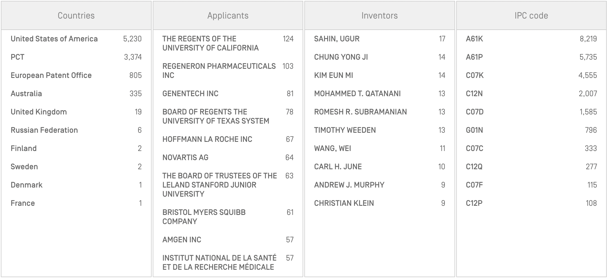
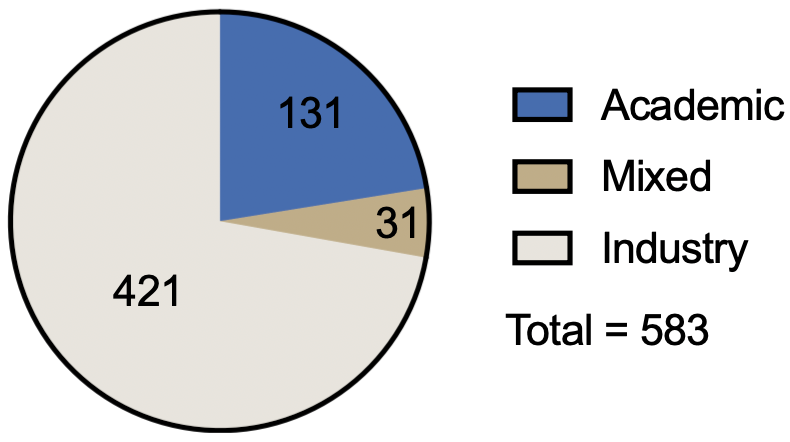
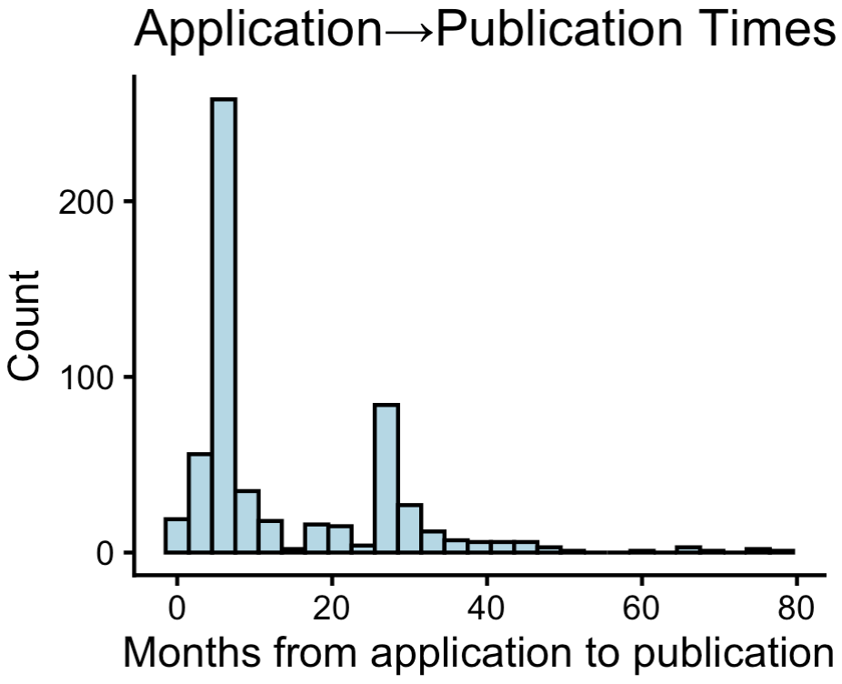

The patent literature is a rich resource for drug developers. Patents are in my view equivalent or even better than PubMed in terms of how useful its information content is. The reason is that patents cost money and for companies, there is no reason to patent unless you think its valuable. For academics, you are incentivized to publish no matter if you think its valuable or not, but patents are gatekeeped by the university's tech transfer office.

Patent content is critical for various aspects of drug development, including: 
- Benchmarking data
- Surfacing new ideas or therapeutic interventions
- Researching competitive landscape
- Getting up to speed on the critical assays that need to be run for a given target or indication
- Understanding freedom to operate

While I find that most scientists have their processes for digesting scientific literature (e.g. RSS feeds/Twitter, periodically checking journal publications, attending conferences), no one (save for maybe Drug Hunter) really does it for patents.

So today's question is: how do you systematically search the patent literature? Today, I will review 9,776 patents published in the last 6 months and see if we can discover any alpha.

## How do patents in the life sciences actually work?

There are two major types of patents: method of use and composition of matter. The latter, are generally considered stronger. 

Not only do you need novelty and non-obviousness, you need 'enablement'. You need to provide enough experimental support so that the scope of the patent is covered and the patent contains enough information for the invention to be replicated after the patent window ends.

After the filing of your patent, the exclusivity window is 20 years. This is separate from the publication date, which is when a patent is available online. Patents are meant to prevent commercialization of an invention, meaning that they are only enforcable if a drug utilizing an invention has reached the commercial stage. If a company uses a patent invention from another party, it is fine as long as the expiration date occurs prior to the drug being marketed.

## My query:

This query retrieves patents with a publication date in the last 6 months. Given today is Oct 20, 2025, the window is Apr 20, 2025 to Oct 20, 2025. I used ChatGPT to develop a query that searches for protein therapeutics, radiopharmaceuticals, and small molecule pharmaceuticals. It likely is missing some codes but with the tinkering I did, I found that this is at least a local maxima for optimizing signal to noise ratio.

This is directly pasted into the search function at the [WIPO website](https://patentscope.wipo.int/search/en/advancedSearch.jsf). By signing up for an account, you can download all of the results (maximum 10k at once). Patents on WIPO are refreshed every Thursday.

(
  IC:(A61K31* OR C07D* OR C07C*
      OR A61K38* OR A61K39* OR C07K14* OR C07K16*
      OR A61K51*
     )
  OR CPC:(“C07K 16/46” OR “C07K 16/468"
          OR “A61K 47/68”
          OR “A61K 31/7088"
          OR “C12N 15/113”
          OR “A61K 48/00")
)
AND EN_CL:(
     inhibit* OR antagonis* OR agonis* OR modul* OR degrad* OR stabiliz*
  OR (“antibody” NEAR2 (to OR against OR bind*))
  OR (bind* NEAR3 (target OR receptor OR protein OR antigen))
  OR bispecific OR multispecific OR “T cell engager” OR BiTE
  OR “antibody-drug conjugate” OR ADC
  OR radiopharmaceutical OR radioligand OR radiolabel* OR radioisotope
  OR “alpha-emitting” OR “beta-emitting” OR “Actinium-225" OR “Lutetium-177”
)
AND DP:[TODAY-6MONTHS TO TODAY]

## Patent analysis

It takes roughly an hour to screen through 1000 patents, and with ~9700 total patents from 6 months, this took me ~a week of intermittent work. 

I ended up with 583 (5.96%) "interesting" patents. This is highly subjective, but to me this means that it is either a target I have not come across, an indication that is a significant unmet need, or a technology or application I perceive to be novel and enabling for broader therapeutic use. ~9700 patents is of course too much to digest at once and you could even argue that ~600 is still too much. Screening and filtering these patents is associate level work and not too difficult, but meaningfully enhances the signal to noise ratio.

Most applicants (475/583; 81.5%) only submitted one patent in the period. Regeneron had the most with 9, followed by Stanford, Berkeley, and BWH with 9, 8, and 6 respectively. Among other pharmas with multiple patents, BMS, AstraZeneca, Chugai (Roche), Eli Lilly, Gilead, Abbvie, and Alnylam had at least 3.

Most patents came from industry, but still a significant number came from academic or mixed industry/academic filers. 

Publication times following the initial patent filing seemed to have spikes at 6 and 24 months. However, some even had 5+ year delays between filing and publication.

### What is big pharma working on?

Notably, this is just a 6 month window into IP filings. However, big pharma is more active than other organizations, as expected. All of them are listed below:

___Bristol Myers Squibb:___
1. IL18BP agonist
2. KRAS inhibitor plus Treg depleter
3. LAG3 antibodies
4. FAK degrader
5. Methods for improving bioavailability
6. USP1 inhibitors

___Regeneron:___
1. CD109 inhibitors for bone mineral density
2. KLHDC7B gene therapy
3. MS4A6A for diseases with myeloid cell dysfunction
4. Mouse model of fibrodysplasia ossificans progressiva
5. engineered alpha klotho peptides
6. GPAM inhibitors for liver disease
7. CHRNB3 inhibitors for smoking cessation
8. p75 neurotrophin receptor for CNS delivery
9. Bet v 1 antibodies for allergy
10. Leptin receptor agonist antibody for increasing bone mass

___Alnylam:___
1. TMPRSS6 RNAi
2. GRB14 RNAi
3. APCS RNAi

___AstraZeneca:___
1. Type 1 interferon receptor inhibitor for lichen planus
2. Type 1 interferon receptor inhibitor for chronic kidney disease
3. Myeloperoxidase inhibitor for chronic inflammatory conditions
4. TRPV4 inhibitors
5. PNPLA3 ASO for genetic subset of MASH

___Eli Lilly:___
1. LAG3 agonist antibody
2. S100A9 inhibiting antibody
3. Urocortin-2 polypeptides
4. RXFP1 agonists
5. FARNESOID X RECEPTOR AGONISTS AND USES THEREOF

___Gilead:___
1. STAT6 degraders
2. Small molecule IL-17A inhibitors
3. LPAR1 inhibitors
4. KHK inhibitors

___GSK:___
1. Artemin inhibitors for headache

___Sanofi:___
1. CD28 / OX40 bispecific antibodies
2. Insulin formulation

## What are some interesting patents?

The whole goal of this exercise was to surface new IP that could potentially be a drug one day. However as you might expect, the patent literature also contains all sorts of other information that is 'interesting'.

Broadly, the stuff I was interested in were 1: new target for new indication, and 2: new drug for same target/indication pair.  

### New target, new mechanism

[Broadwing Bio](https://broadwing.bio/) patent portfolio. This is a Maze ($MAZE) spinout focused on ophthalmology. CFHR and ANGPTL7 are targets.

[Actio Biosciences](https://actiobiosciences.com/) - KCNT1 inhibitor for epilepsy. 

[Alchemab](https://www.alchemab.com/our-science/pipeline/) - UNC5C and complement factor H (CFHR, again)

Argenyx: METHODS OF TREATING MULTIFOCAL MOTOR NEUROPATHY (MMN)

[Arrowhead](https://arrowheadpharma.com/) - ALK7 RNAi

[Ashibio](https://ashibio.com/ashibio-raises-40m-in-seed-and-series-a-financing-to-advance-therapies-for-bone-and-connective-tissue-disorders/) - Methods for treating fibrodysplasia ossificans progressiva (MMP9 inhibition)

[Caradon Therapeutics](https://caradon.bio/) - modified urocortin 3 and TRPML modulators

[Claris Biotherapeutics](https://clarisbio.com/) dHGF mimetic for corneal therapy

Contineum therapeutics ($CTNM) LPAR1 ANTAGONISTS AND USES THEREOF (IPF, PrMS, chronic pain)

TRPA1 inhibitors DE Shaw

Treating endometriosis with NTRK2 inhibitor (Baylor)

TISSUE KALLIKREIN-1 FOR TREATING PREGNANCY DISORDERS [DiaMedica Therapeutics](https://www.diamedica.com/)

Targeting CD73 for endometriosis - academic

GPR84 modulators - [DEM biopharma](https://dembiopharma.com/). Whole purpose of this company is to modulate macrophages for immunotherapy. 

A bispecific antibody targeting HLA-DQ2.5-gluten peptides - Chugai

HJV antibody for IBD and myelofibrosis - [Disk Medicine](https://www.discmedicine.com/)

GlyT1 inhibitors for hepatic polyphorias and polycythemia - [Disk Medicine](https://www.discmedicine.com/)

[Domain Therapeutics](https://www.domaintherapeutics.com/) and MedImmune have PAR-2 inhibitors/antibodies for migraine (Medimmune) and other inflammatory disorders (Domain). The application in migraine looked pretty good based on the [preclinical data](https://pubmed.ncbi.nlm.nih.gov/40036725/) from Medimmune. AZ gave it to Abbvie and TBD whether there is room in CGRP refractory patients but I think it probably works.

IL-8 INHIBITORS FOR USE IN THE TREATMENT OF SOME SARCOMAS - academic

GPR120 AGONISTS FOR THE TREATMENT OF INFLAMMATORY BOWEL DISEASE - Dompe Pharmaceuticals

PHENYLALANINE-DEGRADING ENZYME VARIANTS AND TREATMENTS FOR PHENYLKETONURIA - [IDITAROD BIO](https://www.iditarod.bio/)

NK3 inhibitors for headache - [Kallyope](https://kallyope.com/)

USAG-1 neutralizing antibody for tooth regeneration - academic. There's an interesting Science Advances [paper](https://www.science.org/doi/10.1126/sciadv.abf1798) attached to this one.

METHOD FOR PROMOTING ELONGATION OF LONG BONE DURING CHILDHOOD TO ADOLESCENCE BY GPER-1 ACTIVATION VARIANT - Taiwan

ALK2 ANTIBODIES AND METHODS OF USE THEREOF - Keros

Mediar therapeutics - WISP1 antibody and Ephrin B2 antibody

HHIP-FC FUSION PROTEINS AND USES THEREOF - Berkeley

### New drug for same target/indication pair

FAK degraders - BMS and a chinese company (Shanghai Berrybio). This is the optimal way of targeting FAK.

IL-18RB or IL-18R agonism - Both BMS and Diagonal Therapeutics have patents for antibodies. Application is atopic dermatitis.

[D2M biotherapeutics](https://www.linkedin.com/company/d2mbio/) - ANTI-IL12P35, different epitope for hitting IL-12 selectively vs IL-23

G9A/GLP DEGRADATION - Mount Sinai, Jian Jin

Jannsen - Targeting IL-23 for systemic sclerosis. This is based on some activity in SSc lesions in a couple patients with concurrent psoriasis.

[Kymera](https://www.kymeratx.com/science-innovation/pipeline/) - BCL-XL degraders and MK2 degraders. Neither have been announced, but other groups have worked on both ideas.

Small molecule C1S inhibitors - academic

IL-11 decoy cytokine receptor from Stuart Cook

