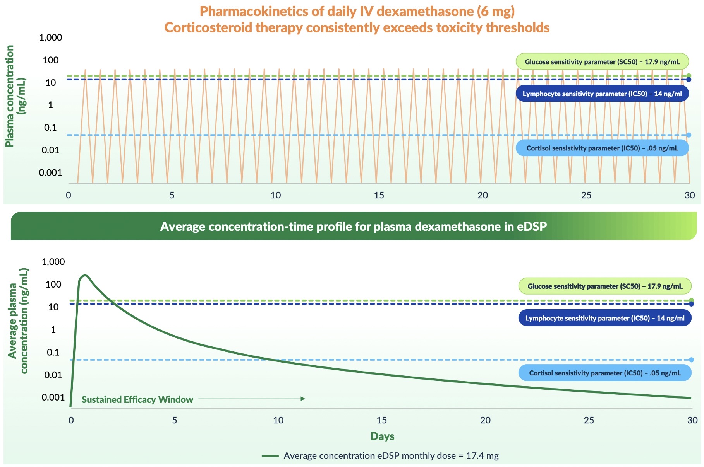
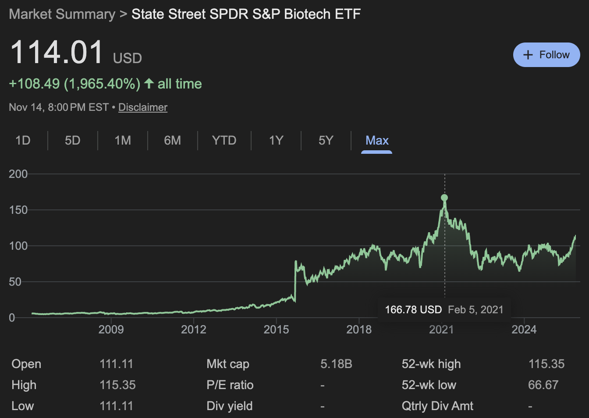

### 4 topics today:

1. [AI antibody design](#ai-antibody-design)
2. [Investigator initiated trials](#investigator-initiated-trials)
3. [Quince Therapeutics](#quince-therapeutics-qncx)
4. [Return of biotech capital markets](#biotech-is-back)

## AI antibody design

This is the topic that probably has occupied the most headspace on biotech Twitter over the last year. Relative to the other noisy conversations about China, GLP-1, AI scientists, and virtual cells, designing antibodies with machine learning to me seems the most immediately useful to know about. 

The launch of Aaron Ring's [Ariax Bio](https://www.ariax.bio/), which is a cost effective and simple to use binder generation tool, and the many antibody and protein design models described in Brian Naughton's recent [blog](https://blog.booleanbiotech.com/ai-antibody-design-2025) give everyday scientists a lot of options. 

It sort of reminds me of a couple years ago (and still continuing today) where every few months there would be a new gene editor published in Cell/Nature/Science. At this point in my career, I am probably never going to be the intended end user of any of these projects (either the gene editors or the AI antibody design tools). So whenever I see these things launch, it feels cool, but incomplete. I for sure don't care about the evaluation metrics and the intimate details of how the model architectures differ. On top of this, I'd say that the benchmarks are so opaque from an outsider that they never make me want to learn how to use them. Few people in the world know how to use antibody design models, let alone how they work.

Much of the argument for why people are excited about these models is for tackling new targets or difficult to access targets. What is happening to LabGenius or ProteinQure, or any of the other first generation AI/ML protein design startups? We have a SORT1 tumor targeting peptide and a T cell engager platform. Yikes. What is coming up next? Nabla has an interesting platform for modeling GPCRs or other multipass membrane proteins. CXCR4, CXCR7, and CLDN4. 

***

Is it an interesting problem? Without a doubt.

If I was a teenager again, developing models to design antibodies would have been an incredible first introduction to biotech. It's not that expensive to brute force your way to a ground truth solution using yeast display or other binder generation techniques. Testing individual designs is not even that hard or expensive either. There is a pretty incredible resource containing hundreds of thousands of antibody designs [here](https://naturalantibody.com/agab/). It's a pretty incredible substrate for a Kaggle competition or as Adaptyv Bio now does, a binder generation competition.

## Investigator initiated trials

Biotech is a decision making game. The core skillset is resource allocation within a set of constraints. 

These constraints are time, money, talent, and most importantly, biology. The first three are easy to understand (impossible to operate a company without them), but the key is the biology constraint. This is the common set of evidence established by the biomedical literature that propels biotech decision making. Different decision makers require different levels of evidence to reach an action and of course this is also dependent on the decision maker's unique context of other assets, strategy, etc.

But the interesting thing about this ecosystem is that biology constraints for the most part are public. These constraints are continually 'relaxed' by academics who uncover new biology and supply new frontiers for firms to develop products. 

Investigator initiated trials (I am going to abbreviate this IIT for brevity) are and will continue to be the most important 'relaxer' of biology constraints for the biotech industry. The classic lab -> CNS paper -> company is just dreadfully inefficient and complicated by the sometimes contrasting incentives of academics (both trainees and PIs), biotech firms, and universities. Human clinical data is the most valuable resource. Most of the foundational large atlasing studies have already been completed. You can make a compelling argument that whole transcriptome RNAseq, GWAS, functional genetic screens, etc, have already identified the high effect size targets and that scRNAseq, spatial, and higher order -omics are just smoke and mirrors. 

Enter the IIT, which collects the initial clinical data that is by far the riskiest data for a biotech firm to collect, let alone publish (copycats, etc). IITs are the 'collect $200 when you pass go' of biotech. It is free R&D that reduces competitive crowding and increases efficiency of capital allocation. This is George Schett with CAR-T in autoimmune disease. Rosenberg with IL-2 in cancer. CHOP's gene therapy work. Carl June's initial CAR-T work and Tocilizumab work in CRS.

There are several advantages:
- Cost is lower
- It benefits the investigator's career
- The resulting information is freely available
- Now is a great time to do this because of improved collaboration between industry and academia, a broad target space already unlocked by approved therapies and thus enabling facile repurposing, and hopefully soon the ease of molecular design should enable exploration of new target space.

I know hospitals are incentivized to work with companies versus individual investigators because they get paid more. I am also aware that this incentivizes poorly designed or run trials that may not be best for patient care. However, the upside of having orders of magnitude more proof of concept studies done in the U.S., and the large potential time savings for new human experimental data that greases industry movement I think makes it worth it. Let it rip.

## Quince Therapeutics (\$QNCX)

This is not a pitch because I don't think this company is investable for retail but I think its an interesting case study. The company has developed a red blood cell based technology that enables long half life (monthly) dosing of dexamethasone. It is an infusion technology where RBCs are drawn out of the body, infused with drug, and reinfused back into patients in an automated fashion. 

While originally developed across many larger indications where steroids are effective but toxic (e.g. IBD, COPD, cystic fibrosis), the company's last ditch hope is ataxia telangiectasia -- a rare genetic disease with no approved therapies. 

They ran a Ph3 study previously in this indication which failed except for a subgroup. The company has now redesigned the study in the subgroup most likely to benefit. To be fair, the rationale for choosing the subgroup makes total sense (younger patient population that is in the acute phase of disease where symptoms worsen the most). But anyway, they have $26 million in cash which funds them through the Ph3 study and into Q2 2026. They need an additional \$100 million to get to an FDA approval.

This is similar to \$DBVT in a couple of ways:
1. That there was a prior Phase III trial that failed and the company has now redesigned and has an imminent readout of a new trial
2. The technology is relatively simply and derisked (used in hundreds of patients already)
3. Has numerous other 'hairy' aspects that make it unattractive to investors

***

Essentially, we have this somewhat complicated infusion technology but with a real drug class. I think the tech works and is likely to have a positive trial readout. The issue is that you are begging someone to do a financing for an indication where the therapy is effective but marginal and is likely going to be very expensive. Its very sad that these kids have the disease and the disease is essentially incurable -- caused by loss of function to ATM, a DNA repair protein. These kids have infection risk, cancer risk, on top of neurologic symptoms. Basically no one studies it and there is nothing except this with any hope of helping.

Its an upsetting situation and really highlights the decision that societies need to make regarding their biopharma industry. Who pays for the trial, knowing that there won't be a payoff?

## Biotech is back

Things are starting to get frothy. 

Yesterday, there was a \$9.2 billion acquisition of Cidara, which is roughly a 4.6x multiple of where it traded ___after___ derisking Phase II data.

We are nowhere near 2021 levels, which is great. And we seemed to have recovered from an 'any news is bad news' environment. While in this bullish tape, I think it is worth thinking about how news will be interpreted moving forward and what it means for biotech investing.

Biotech is definitely much more mature than it was in 2021. TechBio is now resoundingly cringe. Platforms without a plan for indication don't really exist anymore. Preclinical public companies are pretty rare these days.

Biotech/biopharma public impression is seemingly improved? Or I might be hallucinating or hanging out with different groups of people. Lilly crossing a trillion in market cap was a meaningful moment for the sector, as well as Dave Rick's cheeky pint interview.

I do think platforms are back. T cell engagers, pH sensitive medicines, radiopharma, multispecifics, half life extension technologies, etc.

M&A is extremely healthy (TRML, VRNA, CDTX, MRUS, RNA, BPMC, ETNB, ITCI). And then you have the wagons like RVMD, INSM, ABVX, and NKTR that seem to be waiting on deck. Big message is that you want to play in massive indications. Don't try too hard with niche low PoS ideas.

Darwin and TCGX up and Cormorant down I guess. Earlier in the year it seems like some pods shut down but on the year it seems like funds in general did pretty well, which is awesome for everyone involved. 

At the same time, regulatory uncertainty, increased competition from China, and constantly shrinking TAM due to effective new therapies, are all new headwinds. ___These might all be imaginary though.___ Aside from QURE, things have traded positively from FDA messaging. None of the China assets have materially impacted a U.S. company's stock. For all the talk of me-toos, clinical data in hand is still worth much more than imaginary future competition (e.g. UPB). Finally, while people were worried about BBIO/ALNY competition in ATTR-CM, it hasn't materialized yet and both have had earnings at the high end of expectations. For all the talk of GLP-1 shrinking the MASH and related markets, the FGF21 class has basically been bought out clean and MDGL has had an extremely healthy Q3. Increased rates of diagnosis and biologic penetration probably fight back against the shrinking market fear. You could argue that willingness to try branded medication is only getting higher.

To borrow from Kyla Scanlon, the rearview mirror suggests that the biotech meltdown in recent years certainly feels more vibesession than driven by fundamentals.

***

Trading biotech is interesting because its much easier to be an emotional trader when a company lives and dies by a drug working versus earnings performance. As a result, biotech will always have meaningful binaries and valuation disconnects. The coverage universe is not massive and smart investors share opinions on Twitter.

For myself, I've followed biotech through a bull and bear market, but I've more or less only traded biotech stocks for this year. I haven't really viscerally understood what the biotech equivalent of multiple expansion and compression feel like. Analysts with 2-3 YOE maybe will just permanently have bearish disposition. 

Is it worth thinking about the 'analyst class' that is just now graduating from MD or PhD programs and entering the sellside? 3-4 years of being told the job market sucks. Yet the only entry level internship opportunities are VC fellowships that don't teach critical thinking skills. ChatGPT and others pretty much replace the 1st year associate's skillset. More rich get richer phenomena probably. If so, it's a pretty bleak outlook going into a PhD program knowing that industry scientist isn't a safe bet for an exit anymore. Either grind your life away to become a PI and endure academia or enter the industry/finance/consulting lottery.

The success of venture creation studios could counter this? There could be the rise of a 'biotech product manager' type position especially if other R&D costs drop (e.g. China, AI/ML, lab automation). 

Anyways. Onwards and full steam ahead.
