Next year is 2026. It is another end to a 4 year chapter of school. 

With the end of my PhD, I've spent a lot of time thinking about what is important in life outside of academics. Being a student for the large majority of your life gives you a somewhat warped perspective on what matters. Specifically, grades give you an explicit measuring stick of your performance, meant to directly compare you to your peers. When grades aren't enough to distinguish students, there are implicit requirements associated with each level of education. In high school, its extracurriculars and standardized testing. GPA matters in college but so do internships and networking. In your PhD, it's the volume and quality of experimental data and papers you can generate, loosely correlated with citation count.

In some rare cases, students might actually make an outsized impact on the world. However, in most cases these performance metrics really don't matter outside of distinguishing students for fit within the workplace.

This isn't to say that the metrics that control the 1st quarter of your life are meaningless altogether. To the contrary, on aggregate they do an excellent job at enabling students to identify their passions and find the right fit for their careers.

It's just that there is a very abrupt change to what you 'should' be doing or want. It's been interesting to think about, especially as someone about to leave academia.

***

When thinking about choosing a job, I think its really important to think rationally in an economic sense (massive caveat being that this assumes you have liquidity; ie. you have the privilege to move jobs at will and interview widely). This means that it is good to pursue maximum compensation for the least amount of input. This isn't to say that you should be lazy, but rather you need to seriously think about what the value of other aspects of your life is. Outside of a very few select people who own a very significant amount of equity in valuable companies, the people whose lives will be affected most by your decision making are yourself and your family. For most high performing people, giving 110% at your job is already table stakes. 

Most people who work do a mediocre job. Partly due to their own effort, or also potentially due to systemic issues specific to the organization. If you are able to perform at a good to great level, you deserve to be compensated.

This is different if you decide to work in a non-profit setting like government, academics, or other organizations. These places typically provide no or very limited performance bonus. Everyone gets paid equally at the same level and the only way to achieve substantial increases over time is via promotion. Its a trust based incentive structure. My experience has been that non-profit settings are occupied by people incentivized by 3 factors: fear of unemployment, personal ego, and/or genuine desire (helping others, curiosity).

An interesting 'in-between' are for-profit enterprises that treat you like a non-profit employee, commonly startups that don't give you outsized equity and pay at a below market rate. Their implied proposal is to compensate you via connections, rate of learning, or greater responsibility or ownership over your work. This is good for some people but importantly this isn't a universally valued benefit. To use a chess analogy, this is a potential 'dynamic' advantage that needs to be converted (typically by yourself) into a static advantage, often requiring additional unpaid work and not necessarily a guarantee. In contrast, your salary and the money you make, is inherently valuable. 

*** 

I'll probably stop writing the blog at some point next year, or at the very least reduce the cadence significantly. I'll maybe switch to covering academic conferences, or playing around with new science hardware. I've always wanted to have a home lab someday so maybe it will turn into a lab notebook.

Initially, I started writing as a way to quickly get up to speed on a topic. Understanding how a business works or exploring a scientific topic is much more fun and likely to happen if there is some work product attached to it. Writing also forces you to formalize and provide structure to how you think about things which is also helpful. Reading your own writing is a great way to know where you have depth, and where you have no idea what you are talking about. But as I'll write about later, the world has fundamentally changed. It is much easier to get up to speed on something with an LLM, and the incremental value that sitting down for 20 hours and writing can give you is increasingly harder to find.

I've also met enough arrogant self promotional people now that I no longer have any interest in building a personal brand. I'd just rather not interact/compete/be seen in a similar category as the average substacker.

Another reason is simply that the opportunity cost is higher. When you are in academia where there is no financial incentive for outperformance, writing a blog is sort of a fun way to stay up to date and find interesting people to talk to. But in the professional setting, there are real business objectives to meet and there is no way to justify taking an afternoon off to write on the internet. I'd also rather spend the weekend hiking, skiing, or seeing family at this point. 

Lastly, no one really releases good pieces of work publicly anymore. It's either too shallow and incompletely explored or a wall of text without clear structure or prioritization of what the important information is. The best I saw this year were some [stock pitches](https://docs.google.com/document/d/1NIiB3wsDtXHmzjUEwspf-H7UMCOmFWcMous4rmgEOIA/edit?tab=t.0) which were truly excellent and pushed me to do better. But broadly without peers whose work you enjoy reading, it's harder to be engaged. 

Still, this was by far the best year for blog posting. I've had the most people read and engage this year than ever before. I had a post about Chinese biotechs go semi-viral, even getting a mention on Endpoints. I wrote several other works I'm very proud of including a DepMap analysis paper, a plasma proteome analysis, and an ideas list for potential medicines.

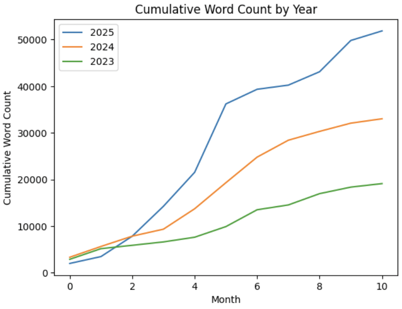

***

It was a super busy year once again for me. A lot of travel and a lot of work.

I had a couple of 1st author papers published in journals. One in Cell Reports was an analysis of CRISPR screens in DepMap to identify therapeutic targets in pancreatic cancer. Another in Science Advances was a new pooled screening assay I developed using a spatial transcriptomics platform called CosMx. We used this technology to identify treatment induced transcriptome and morphological changes to chemotherapy and KRAS inhibition in PDAC cell lines. I have another paper released as a preprint and under revision, and two more in the process of writing. I also contributed to four additional papers as a co-author that hopefully should either be published or preprinted next year. A happy moment for me was surpassing 100 and 200 citations on [Google Scholar](https://scholar.google.com/citations?user=mlArGDAAAAAJ&hl=en). 

I went to AACR again this year but decided not to go to AACR pancreas or submit an abstract for AACR next year.

One of the more annoying parts of the year was being in charge of a grant. Last year, we got funding from a major pharmaceutical company as one of their new initiatives to improve engagement with local academics. Unfortunately, they required us to hold ~monthly meetings to discuss research updates. The grant period was 1 year and 250k in total funding, a significant amount of investment in a short time frame so it was somewhat understandable to want regular updates. However, as a singular graduate student responsible for the entire project, including ideation, experimentation, and presentation (unrelated to my thesis work), it was a major pain.

The graphic below is honestly a very accurate summary of how the PhD goes. Dose dependent stress and frustration. So it goes.

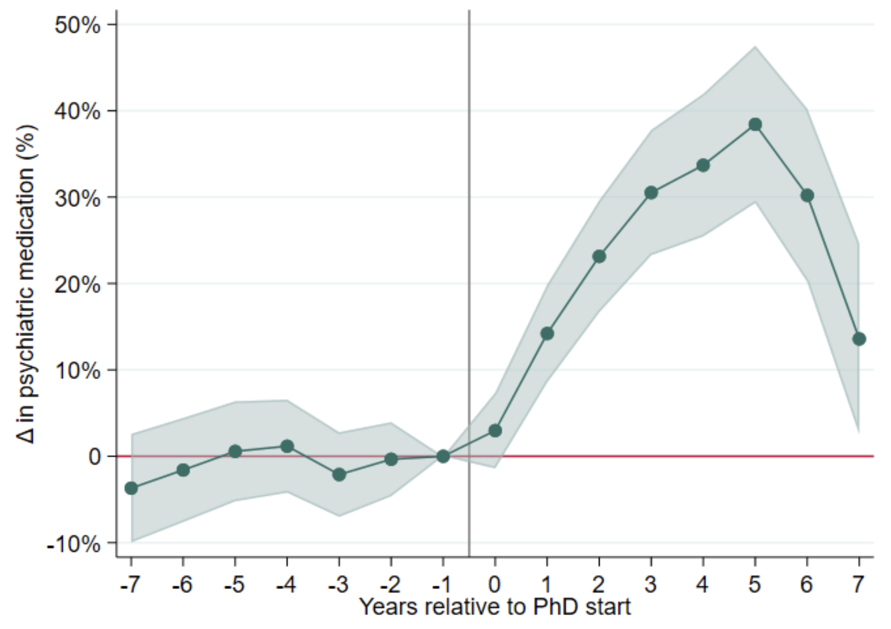

The back half of the year I think is always tough with the business of the holidays. This year was particularly difficult but accompanied with a lot of personal growth. I ran a half-marathon and a week later had wisdom teeth taken out. I got my first experience renting out an apartment, and dealing with all of the home improvement issues that come with it. Dealing with a move-in during the Thanksgiving holiday and all the associated fixing of appliances was a nightmare.

A lot of fun things happened as well. I went to two concerts in the Fall, both artists that I hadn't listened to prior to this year. I got to enjoy my sister's 21st birthday with her and be able to visit my family in China again. I got to go to Hawaii for the first time which was my favorite trip of the year. With my friends, I got to go skiing and planned a big trip to Acadia National Park.

Business wise, it was also a great year. Lots of maturity was gained with trading. Understanding what setups are playable with options. When to ride or fade momentum. How to identify known unknowns and hunt down opportunities where the biology is derisked. I again got to work with multiple companies on target identification as a consultant. Overall, a very productive year with a lot of learnings.

### Lessons learned

There are three major themes that recurrently showed up throughout the year.

#### 1. You don't have to do things. 

There are two aspects to this. First related to people you work with and second related to self motivation in the context of peers.

People ask you to do things for various reasons. Sometimes, people ask you to do things because they genuinely want to see something to get done. Other times, its because there is nothing better to do and they want to occupy you with something so you stop asking them for more work. Or maybe they just want to check if you are still invested in the project. If people really want something that only you can do, they will often ask twice. In a world where you are constantly overburdened with opportunity, knowing what to tastefully ignore is an important skill in the workplace.

Second, a useful thing has been developing a 'good for you brother' mentality, meaning that what other people do shouldn't really evoke any response from yourself. You should just do what you want. There is always someone who is willing to sacrifice more than you are. Often its highly influenced by personal or family circumstances - very much a stochastic process.

If people are interested in working hard, that's great for them. But also if they want to take it chill, also amazing. There's a time and place to be sweaty and singularly focused on how impactful your life will be. That isn't to say it isn't worth pursuing goals and breaking records. Doing that is inherently satisfying. But, it is equally immature to say that the point of life is about making an impact. It's simply not for all people -- everyone has different goals.

#### 2. The world has fundamentally changed. 

I think its super cliché and often incorrect when people say this. For example, your new spatial transcriptomics technology is definitely not a fundamental change to how we do science. However, I have genuinely noticed a large shift in how I do work and interpret the world in the last year. This definitely does not mean that the world has changed for everyone! Most people likely lead very similar lives to five years ago. 

However, it is important to know when the world has changed for ___you___ and act accordingly. For example, the attention span of basically everyone including myself has declined significantly, in large part in my opinion due to LLMs. Short form video (e.g. Tiktok, YouTube shorts) has also contributed to this. There were times where to find an answer to a question you had, you would need to read a 10 page PDF in detail. Now, it's just reformulation of a prompt for ChatGPT. 

Depending on your goals, your behavior needs to change. 

For example if you are an investment professional trying to stay sharp, the two responses to this are either: 
1. Source more information and lean in to the fact that the only remaining 'edge' is working harder to surface more information (e.g. stuff not in the training corpus), ask better questions, and have the LLM fill in the space. 
2. Regain your attention span. Exclusively consume long form content. Trust your ability to read the fine print better than competition's ability to verify the accuracy of what their LLM is telling them.

#### 3. Your interactions with people are highly dependent on shared context. 

This is another learning from observing differences in how people interact on the internet vs real life. Its important to understand what kinds of people you are similar to and different from. If you catch up with friends from middle or high school, it's amazing how different your own circumstances are to them. It is many times more diverse on the internet.

Public demonstrations of LLM psychosis. The millions of people who use AI dating apps. People on the internet are super different from you. Yet, they are overly anonymized and the extent to which you trust what they have to say is often determined by other anonymous peers. Seemingly random people who have the talent to write in a somewhat cohesive manner and the dedication to do it consistently, have an unnatural ability to reach and influence millions of other people on the internet. It can either be really great or really dangerous.

This makes the internet pretty useless for anything related to morals, culture, or anything where norms differ depending on social group. Even for career related stuff, forums are more entertainment than discussion boards and should be consumed as such. This probably seems very obvious to most people, but for me the critical part was realizing that consuming more internet is probably bad for your in person relationships simply because the norms of others on the internet are likely very different from those established locally.

### Goals

Lastly, I have three goals for next year.

#### 1. Improving as an allocator.

When growing up, 'firsts' were always meaningful. First time trying something new or visiting someplace you've never been before. In science, being the first to discover something is sometimes the point of doing the experiments themselves.

However, I've also grown to appreciate the value of seeking out quality. Where can I find the __best__ version of something that makes the experience far better than the __first__ time you experienced it. Or, how does one drug a target that makes the best in class drug far better than the 1st in class drug. Several years ago I listened to a famous scientist say on a podcast: "In science, you can either be first, best, or last."

Identifying quality and novelty is about acquiring and cultivating good taste. Sampling many different things, whether it be clothes, food, or even stocks is an essential part of developing taste. As is understanding completely how something is made, why it was made, and how it is differentiated. Gaining 'reps' in these exercises in all aspects of life is something that I am hoping to do to help me improve my taste and improve as a resource allocator.

#### 2. Practicing soft skills.

Soft skills, especially sales skills, have always been a tricky category for me because they aren't immediately measurable and always subjective. Unlike a professional salesman, scientists and students have very few opportunities to assess their ability to communicate.

But over the past year, I've had many opportunities to convince people to get excited about stuff and continuously failed. People I've talked to range from management teams of small startups, scientists at large companies, and investors. Regardless of whether or not the ideas are good or not, the pitches tend to fall flat. I'm taking a more deliberate approach to learning how to do this better next year.

#### 3. Creating consistency

A great part about next year will be transitioning out of the student schedule. The PhD is at times too flexible and lacking structure, and sometimes just extremely busy. I'm hoping to take advantage of the more stable schedule to establish some consistent habits.

### Pictures

Happy new year and 2026! Scrolling through the photo album is always a fun way to remember the emotions of each month. These were a couple that were meaningful to me.

#### January
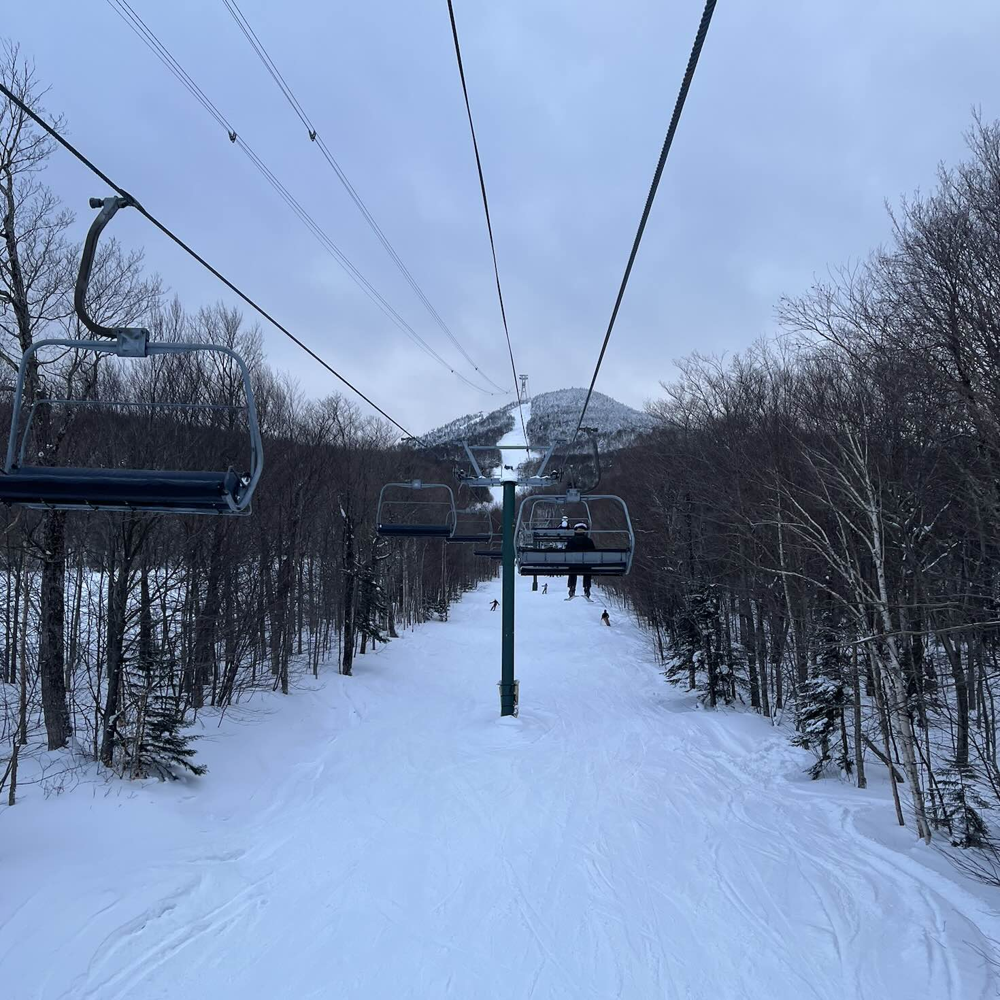

#### February
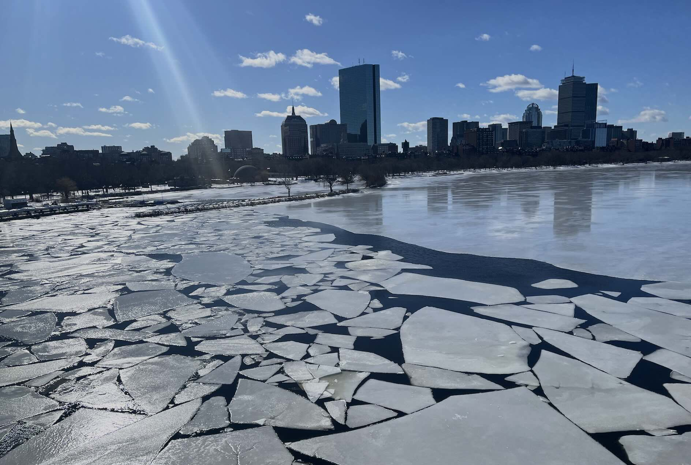

#### March
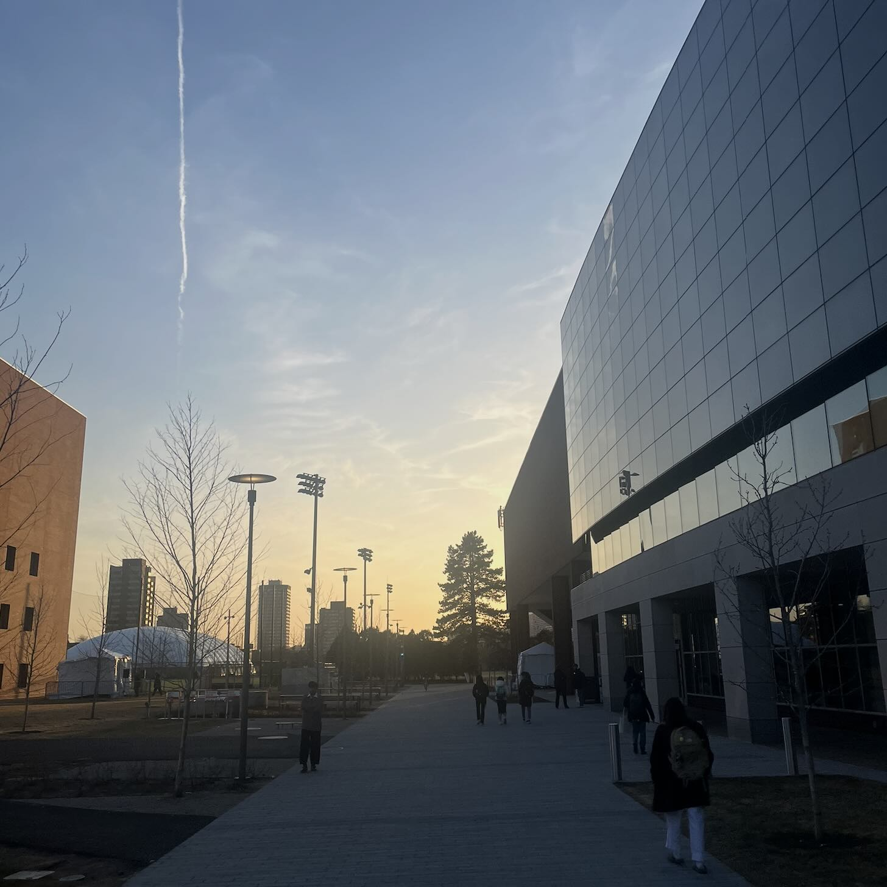

#### April
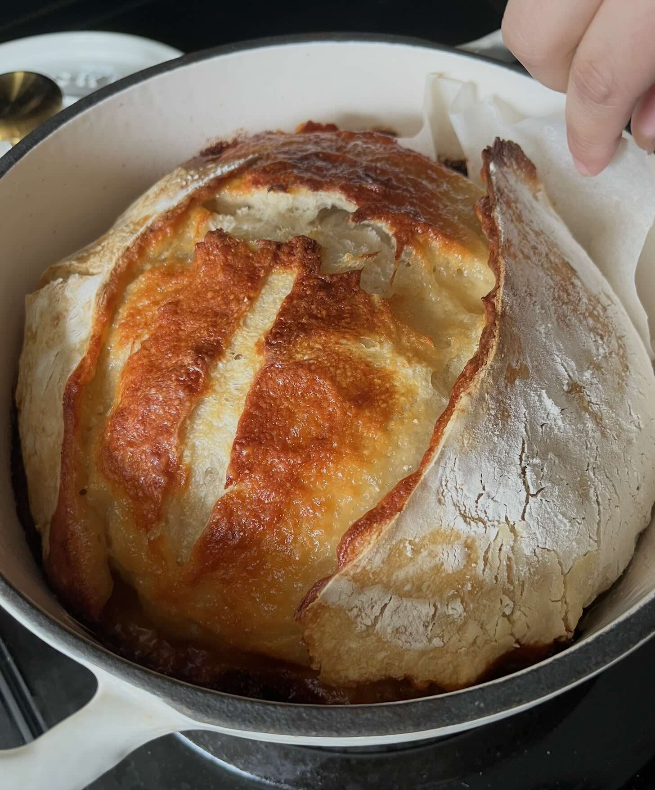

#### May
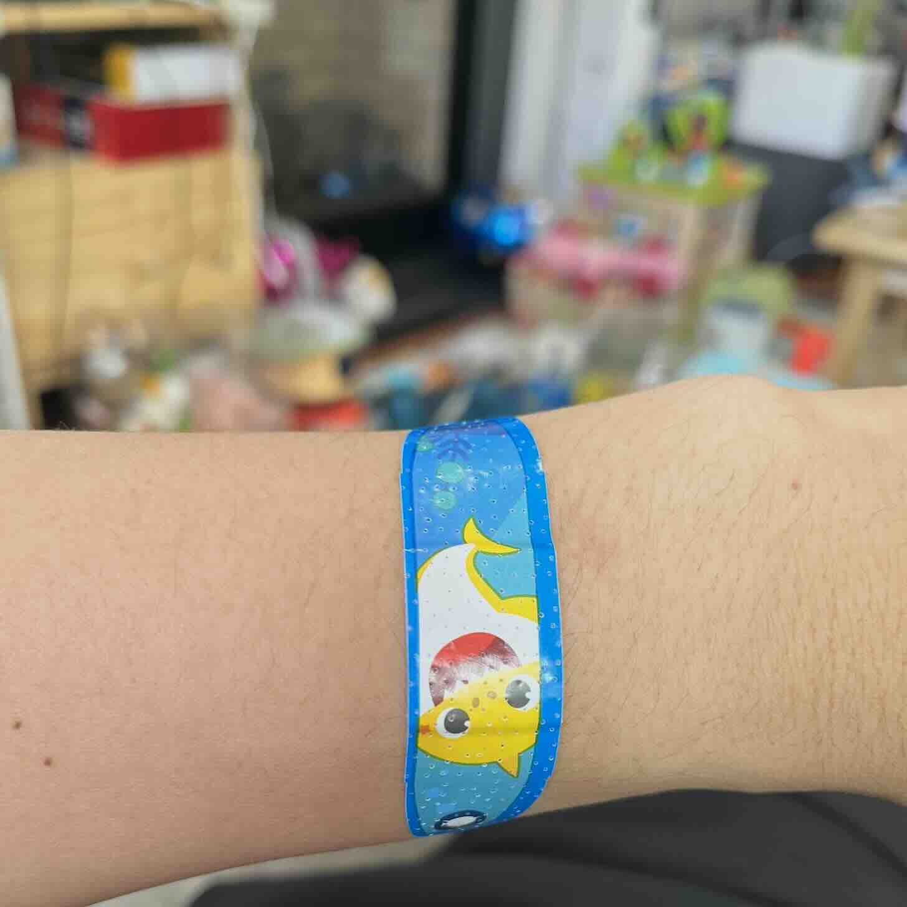

#### June

#### July
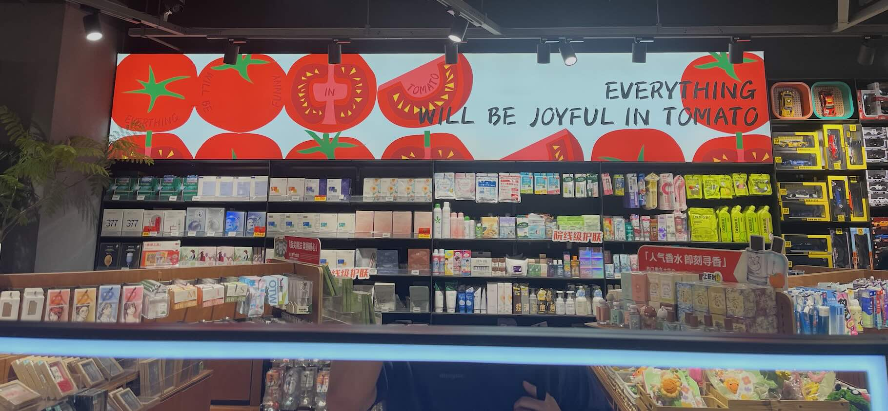

#### August
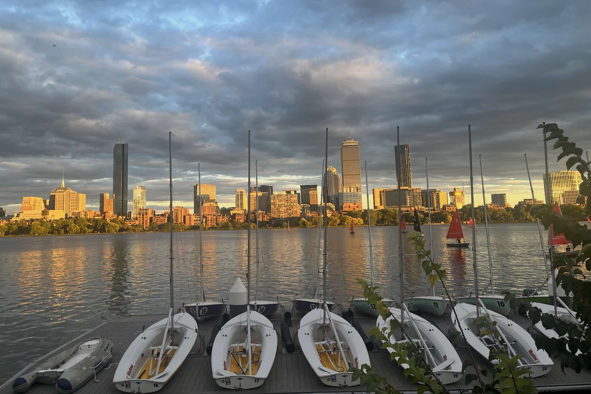

#### September
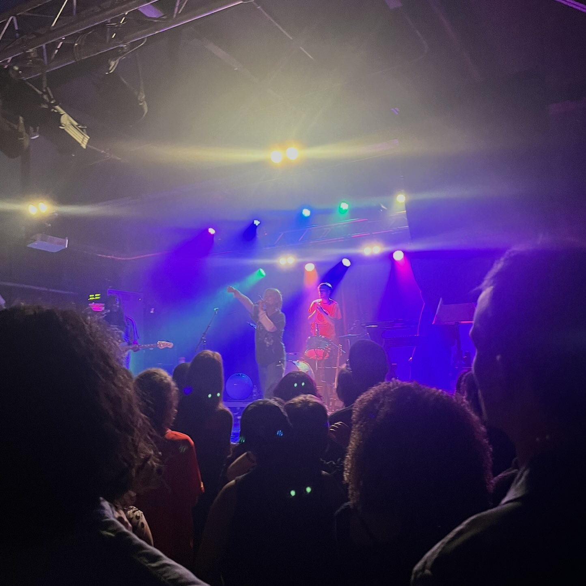

#### October
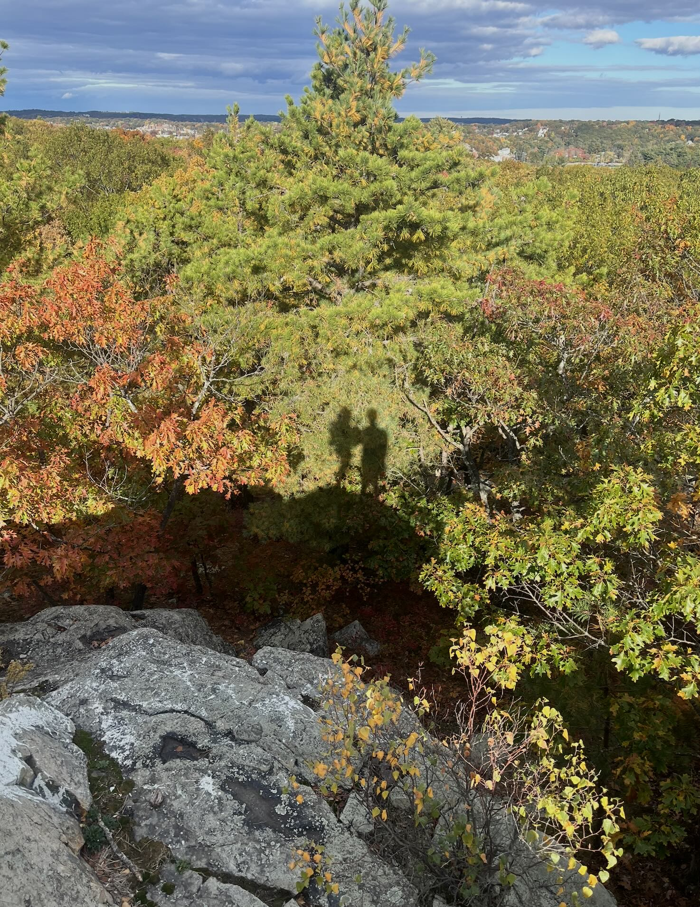

#### November
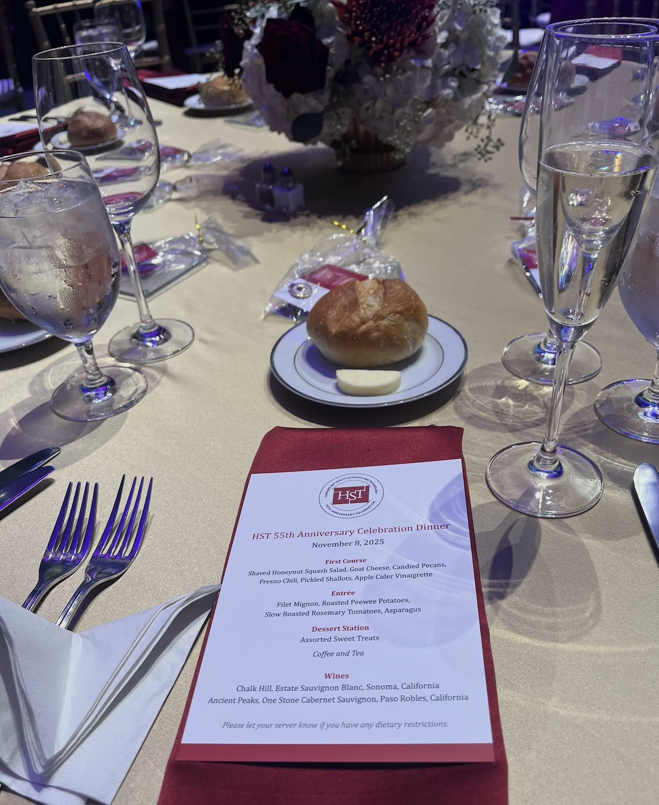

#### December
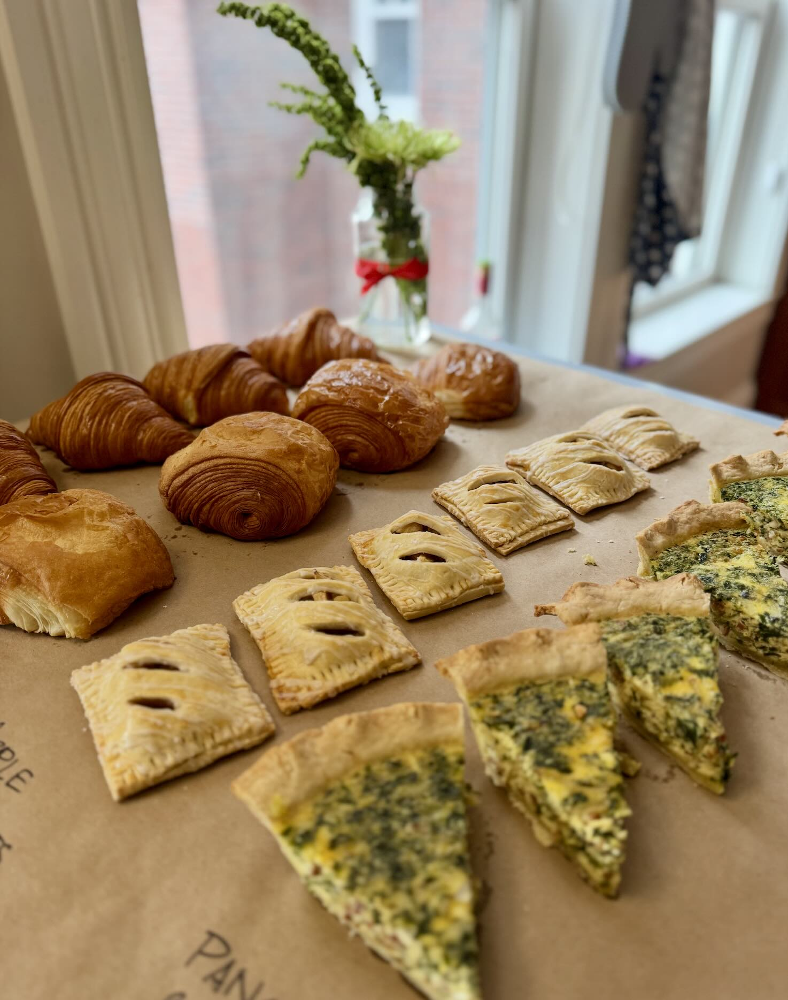