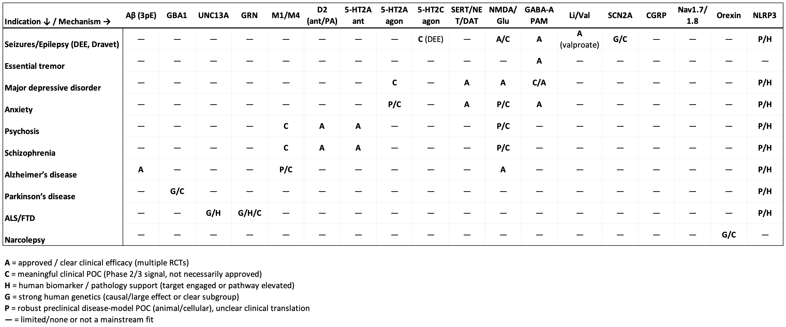

As part of an ongoing effort to understand different spaces within biotech, today we will cover the therapeutic landscape in neuroscience/psychiatry. Previously, we have discussed [cancer](https://www.dennisgong.com/blog/CancerTypes/), [I&I](https://www.dennisgong.com/blog/newmedicines/), and [genetic medicine/rare disease](https://www.dennisgong.com/blog/geneticmedicine/). Neuroscience is an entirely new area for me which clearly has tremendous unmet need but differs from the aforementioned three categories because specific molecular mechanisms linked to disease are less clear. Disease caused by a recurrently mutated somatic mutation or a specific cell type are less common. Instead, the therapeutic armamentarium consists of non-specific channel blockers, GPCR agonists, and neurotransmitter molecule mimics.

Most medicines seem to have mediocre efficacy with side effects. Many inhibit multiple receptors simultaneously and subtle changes in residence time make all the clinical difference. This makes sense given that the brain is a more complex network where stimulation amplitude and kinetics must matter more than other indications. However, it does make comparison of drugs much more difficult and requires empirically determined efficacy in clinical trials.

Outside of a couple examples of striking efficacy in large pharma, namely the orexin class for depression and narcolepsy (e.g. J&J's seltorexant & Takeda's TAK-861), Vertex's suzetrigine in pain, and Roche's BBB shuttle amyloid beta antibodies, the major stories in neuropsych are of M&A activity. BMS's $14bn acquisition of Karuna and KarXT in March 2024 and J&J's $14.6bn acquisition of Intracellular Therapies in January 2025 are the two largest examples.

The goal of this post is to more completely understand the mechanisms, indications, and private/public companies that operate and perform clinical experiments in the neuropsychiatric medicines space. I used ChatGPT for much of the work of collecting information and take responsibility for all mistakes.

## Mechanisms and Indications

First, I'll go over the various mechanisms validated to work as evidenced by approved therapy classes and positive proof of concept clinical trials. I bucketed these mechanisms into four buckets which are reflective of the root of disease pathology and approach to symptom management: 1. Addressing misfolded/mislocalized protein 2. Targeting neural circuitry by activating/inhibiting specific neuron populations 3. Neuroplastogens 4. Neuromodulators that change baseline activity across the brain.

### Misfolded/mislocalized protein

This category is perhaps the easiest to understand. Basically you have inadequate clearance of fibrillar protein species that are prone to aggregation. These protein aggregates (e.g. beta amyloid or intracellular Tau) accumulate and damage various aspects of normal physiology. For example, beta amyloid binds to various synaptic receptors, causing toxicity that causes neuron loss. 

Typically in these disorders, there is also an aspect of neuroinflammation that arises from clearance of these protein aggregates. When endocytosed by microglia, fibrillar proteins can often damage lysosomal membranes, leading to activation of the NLRP3 inflammasome.

In Parkinson's and Lewy body dementia, it is intracellular alpha synuclein protein that builds up and is unable to be effectively cleared, leading to movement disorders. Ineffective clearance can often be caused by gene mutations, such as GBA1 for Parkinson's/Gaucher disease which is present in 5-30% of patients. GBA1 encodes a crucial lysosomal enzyme and when not present, makes breakdown of alpha synuclein harder. 

Similarly, GRN (progranulin) is frequently mutated in FTD. GRN haploinsufficiency leads to lysosome dysfunction (lower expression of cathepsins, lipofuscin accumulation) and lowered clearance of pathogenic TDP-43 protein. Within ALS, mislocalization of TDP-43 is also pathogenic. Mutations in C9ORF72 lead to mislocalization and aggregation of TDP-43 in the cytoplasm. Downstream consequence of mislocalization of TDP-43 protein is missplicing and nonsense mediated decay of UNC13A, another frequently mutated gene, which is a critical protein for helping to dock synaptic vesicles with the plasma membrane. Finally, gain of function mutations in LRRK2 are recurrently detected in patients with Parkinson's which cause impairments in vesicular trafficking and autophagy, again reducing a cell's ability to clear toxic protein.

What are the therapeutic angles here? The simplest idea for extracellular deposits such as amyloid beta are to clear them with antibodies. These are effective (albeit with small effect sizes in Alzheimer's. Additionally, NLRP3 inhibitors are being trialed in Parkinson's and other indications. Because NLRP3 is activated in response to misfolded aggregates and lysosomal dysfunction, causing additional pathogenic inflammation, the idea is that inhibiting this process can reduce the pathogenic inflammation associated with lysosomal dysfunction. While doing nothing about the pathogenic protein, the idea is that this can be symptom relieving.

In genetically defined subsets of diseases caused by intracellular protein, gene therapy is starting to show signs of being an effective therapy. Reexpression of GRN, GBA1, or other proteins that are commonly mutated would theoretically improve lysosomal function to accelerate clearance of intracellular protein. LRRK2 inhibition for patients with gain of function mutations is also in trials. Finally, cell replacement strategies are also gaining steam and are particularly compelling given that for most of these disorders, a majority of neurons are already lost by the time of diagnosis.

### Targeting neural circuitry

This category is also relatively simple. The key idea is that the brain is heterogeneous and specific neuron populations reproducibly affect certain behaviors. Certain disease symptoms or pathophysiology involve specific overactivation or loss/inactivity of certain neuron populations and drugs can compensate by overactivating remaining neurons or by shutting down activity of overactive neurons.

1. Orexin agonists specifically target orexin neurons that are involved in sleep and wakefulness. We know that this specific population of neurons is important for these behaviors via genetic knockout, optogenetic, and clinical means. In narcolepsy patients, 80-90% of orexin neurons are gone, some hypothesize due to autoimmunity. The idea is that similar to multiple sclerosis, there is overlap between viral antigens and orexin proteins, leading to T cell clearance of orexin neurons.

2. Peripheral sensory neurons selectively express the sodium channels Nav1.7/1.8. There is human genetics evidence that people who do not feel pain have loss of function mutations. Knowing this information, specific Nav1.8 targeting inhibitors have been developed for the treatment of acute pain as a non-opioid strategy.

3. In migraine, trigeminal ganglia neurons release CGRP, acting locally to induce vasodilation, inflammation, and transmit pain signals. Specific blockade of CGRP or receptors can reduce migraine symptoms.

4. Nav1.2 (SCN2A) mutations have enhanced effect on excitatory cortical pyramidal neurons, which play a role during epilepsy. Correction of these mutations with ASOs or other gene therapy has shown efficacy in epilepsy patients.

5. M1/M4 muscarinic agonists for schizophrenia act specifically on cortical pyramidal neurons and striatal medium spiny neurons, important in dopamine circuits.

### Neuromodulators

This class of drugs, instead of primarily acting on a specific neuronal population, sets the 'tone' or baseline activation state of neurotransmitter exchange and utilization. Unlike other therapies, the therapeutic effect you want to reach is not a binary on/off, but rather a graded state. For example, medication can be used to control how curious or information seeking one might be, or the baseline level of excitation a stimulus might induce.

#### Inhibitory tone

GABA-A positive allosteric modulation: Enhances inhibitory chloride currents through GABA-A receptors, lowering neuronal firing probability and stabilizing hyperexcitable networks (e.g., seizures, anxiety) by strengthening the brain’s primary fast inhibitory system.

5-HT2C agonists for seizures / Prader Willi: Activate serotonergic receptors that bias circuits toward increased inhibitory control and reduced excitability; in epilepsy this dampens seizure propagation, while in hypothalamic circuits (PWS) it reduces appetite drive.

#### Affective tone (monoamines)

Serotonin/norepinephrine/dopamine transporters (SERT/NET/DAT) control various aspects of mood/response to stimuli, arousal/attention, and goal-directed behavior, respectively. These neurotransmitters are important in common disorders such as depression, ADHD, anxiety, and psychosis. For example, depression/anxiety often are characterized by maladaptive responses to stress (ie. inability to cope), and increasing serotonin signaling may help with that. Selective Serotonin Reuptake Inhibitors (SSRIs) selectively increase serotonin signaling, gradually normalizing emotional processing and stress reactivity.

In ADHD, lack of attention can be addressed by norepinephrine reuptake inhibitors (NRIs), which increase norepinephrine levels and stabilize alertness. Drugs capable of both effects, SNRIs — Serotonin–Norepinephrine Reuptake Inhibitors, may have added benefits in depression whereby improvements in both mood and focus to accomplish tasks may be helpful. Finally, norepinephrine-dopamine reuptake inhibitors (NDRI) such as bupropion may additionally address aspects of depression driven by low motivation. 

#### Psychosis control

In typically the opposite direction, antipsychotics reduce signaling at dopamine D2 receptors, +/- in some instances 5-HT2A for 2nd generation antipsychotics. Psychosis is heterogeneous, but in many cases is caused by dysregulated dopamine signaling, specifically in the striatum. 

Serotonin 5-HT2A antagonism and dopamine D2 receptor antagonism help to normalize aberrant dopamine signaling in mesolimbic striatum, which has the effect of reducing how 'important' or 'suspicious' things feel. This can reduce hallucinogenic suspicions.

#### General intracellular homeostasis

Finally, we have some agents that have pretty pleiotropic mechanisms but empirically work to stabilize mental health. These are lithium and valproate, which generally seem to be effective across indications including BPD, epilepsy, agitation, and potentially even neurodegenerative diseases.

### Neuroplastogens

Finally, neuroplastogens are unique in that they can cause broad scale rewiring of synaptic circuits. While synaptic pruning and formation of new connections does happen at baseline in adults (e.g. learning new skills, acquiring new memories, etc.), the degree to which this happens is relatively less than what may occur in intensely stressful situations or over long periods of unwellness. Pharmacologic therapies aim to accelerate synaptic plasticity to 'reset' maladaptive synaptic circuits that may have arisen (e.g. PTSD, MDD). The interesting thing about these therapies is that their effects can occur over long time intervals and they can potentially be curative, unlike other therapies that need to be taken continuously and effects are driven by receptor occupancy.

The key is how to enable synaptic plasticity and encourage dendritic spine growth. Two of the key mechanisms for doing so are NMDA receptor antagonism (e.g. ketamine), and 5-HT2A agonism (psychedelics). They are separate pathways acting on distinct cell populations, but share a common downstream effect which is BDNF release, mTOR activation, and synapse formation. NMDA receptor antagonists act on fast-spiking GABA interneurons and are critical for information processing and controlling inhibition. 5-HT2A agonists act on layer V cortical pyramidal neurons, which are long-range projection hubs.

Other mechanisms include direct TrkB/BDNF/mTOR activation, ampakines that potentiate AMPA receptors, and Sigma-1 receptor agonists.

### In table form:

To match mechanisms to indications, I have asked ChatGPT to create this table and the following tables for private and public companies:

## Private Companies

## Public Companies

## Large Pharma

The most interesting thing about large pharma's presence in neuropsych after doing this review is that I feel like here more than anywhere else is where they are not willing to take on clinical risk. They would rather buy an entirely derisked asset after a clear proof of concept trial. This is in contrast to oncology or I&I, where I have seen that dealmaking often occurs in the preclinical or early Ph1 stages.

Examples of these large acquisitions include:

1. Acquisition of Gilgamesh pharma by Abbvie Bretisilocin a 5-HT2A receptor agonist and 5-HT releaser for \$1.2bn

2. Acquisition of Cerevel Therapeutics by Abbvie for \$8.7bn. This was for the M4 muscarinic agonist emraclidine that later failed Ph2 trials in schizophrenia and Tavapadon, a D1/D5 dopamine receptor agonist for Parkinson's.

3. BMS's \$14bn acquisition of Karuna and KarXT, an M1/M4 muscarinic agonist for schizophrenia.

4. Acquisition of Intracellular Therapies by J&J for \$14.6bn in January 2025 for lumateperone, an atypical anti-psychotic for schizophrenia, BPD, and MDD. The mechanism is a little nonspecific and includes serotonin 5-HT2A receptor antagonism, dopamine receptor phosphoprotein modulation, and some role as a dopamine receptor-dependent modulator of glutamate.

5. Longboard - \$2.6 billion acquisition by Lundbeck for bexicaserin, a 5-HT2C agonist in development for the treatment of seizures. 

On the preclinical side, notable deals include:

1. Acquisition of Aliada Therapeutics by Abbvie for \$1.4bn. Alida developed a BBB shuttle technology for clearing amyloid beta. Its a similar therapy to several other amyloid clearing therapies from Korsana/Roche (below).

2. Lilly's acquisition of Prevail Therapeutics for $1.04bn. Prevail was a gene therapy company hoping to deliver GRN and GBA1 as a therapy for Parkinson's. Lilly went on to discontinue the GRN program due to efficacy.

3. A small deal for Disarm Therapeutics by Lilly ($135mn upfront, up to $1.36bn in milestones). Disarm is developing SARM1 inhibitors for neurodegeneration.

The two big research projects that I think are notable for big pharma's push into are:

1. Roche's trontinemab amyloid beta brainshuttle antibody. Roche was first to compelling demonstrate rapid clearance of amyloid plaque from Alzheimer patient brains without ARIA, a key limiting safety factor associated with aducanumab and lecanemab, the 1st generation amyloid beta antibodies. Roche's drug is IV and will be amongst the first to try and demonstrate compelling efficacy in large Ph3 trials.

2. Takeda work in narcolepsy with orexin agonists has been done all in house and they have really been pioneers in doing not only the chemistry work but also pivotal clinical trials. They will get an approval with oveporexton in narcolepsy type 1, but also have next generation chemistry with TAK-360 that they are trialing in narcolepsy type 2 (NT2) and idiopathic hypersomnia (IH).

